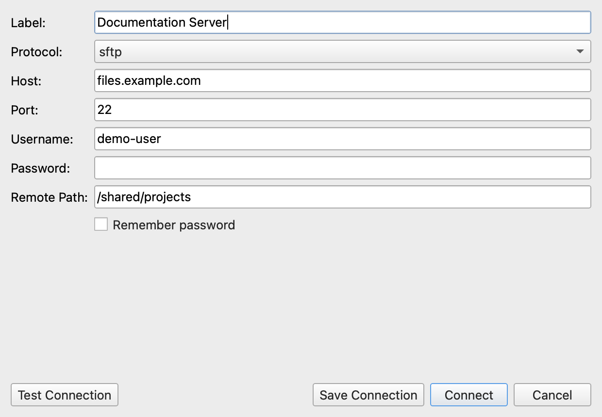

# 04. Advanced Features

ATBCmder offers a powerful set of advanced features for power users, ranging from Virtual File Systems to AI-assisted Semantic Commands. This guide explains how to leverage these tools to maximize your productivity.

## 1. Network Virtual File System (VFS)

ATBCmder allows you to interact with remote file systems as if they were local directories. Supported protocols include **FTP**, **SFTP**, **WebDAV**, and **Samba**. 

- **Seamless Integration**: Once connected, remote files appear in the standard file panels. You can copy, move, delete, and rename files just like local operations.
- **Asynchronous Transfers**: Network operations are executed in a background thread, ensuring the UI remains responsive during large transfers.
- **Connection**: Connections are managed securely. Passwords are not saved to XML config files to ensure credential security.

## 2. Archive VFS and Repacking

Archives are treated as Virtual File Systems (`vfs://`), meaning you can browse inside `.zip`, `.tar`, and `.7z` files natively without extracting them first.

- **Native Browsing**: Navigate into archives directly from the file panel.
- **Modifying Archives**: Need to edit a file inside a `.zip`? Open it, edit it, and ATBCmder's RepackWorker will safely extract, wait for modifications, and repack the file for you.
- **Conflict Resolution**: During extraction or repacking, conflicts are handled gracefully with intuitive dialogs.

## 3. Branch View (Flat View)

Sometimes you need to see all files inside a directory and all of its subdirectories in a single, flat list. 

- **Toggle**: Press `Cmd+B` to activate or deactivate Branch View for the active panel.
- **Exit Quickly**: You can press `Esc` or `Backspace` to quickly exit the flat view and return to standard directory browsing.
- **Streaming Scan**: Directory scanning is streamed asynchronously. It avoids UI freezing even when scanning tens of thousands of files.
- **Path Column**: In Branch View, a "path" column becomes visible, showing the relative directory of each file.
- **Configuration**: Soft caps and batch rendering sizes can be tweaked in the settings for maximum performance.

## 4. Semantic Command

Semantic Command is a natural language interface that brings unparalleled power to file filtering, selection, and searching. It leverages macOS's Spotlight (`mdfind`) for rapid indexing.

- **Activation**: Press `/` or `Cmd+F` to open the Semantic Command input at the bottom of the active panel.
- **Natural Language**: Type commands like *"Select all files larger than 1MB"* or *"Find PDF files modified today"*.
- **Scoping**: By default, searches are scoped to the current directory. Prefix your command with `//` to perform a global Spotlight search (e.g., `//today modified pdf`).
- **Help & History**: 
  - Type `/help` to view a list of supported command templates and examples.
  - Type `/history` to replay recent semantic commands.

## 5. Full Command Parity & Advanced Configuration

For users migrating from traditional dual-pane managers like Double Commander, ATBCmder retains incredible flexibility.

- **Double Commander Hotkeys**: By default, ATBCmder uses classic Double Commander shortcuts (`F5` for Copy, `F6` for Move, `F7` for MkDir, `F8` for Delete, `Tab` for panel switching, etc.).
- **Internal Commands**: Over 189 internal `cm_*` commands are available to be mapped to custom shortcuts, toolbars, or menus.
- **Test Mode Configurations**: Developers and tinkerers can load ATBCmder with an isolated `.test_config` configuration using the `ATBCmder_test.sh` script, allowing you to try new shortcuts or settings without breaking your primary configuration.

---

**Next Steps**: Now that you've mastered the advanced features, check out our [Troubleshooting Guide](05_troubleshooting.md) if you encounter any unexpected behavior.
