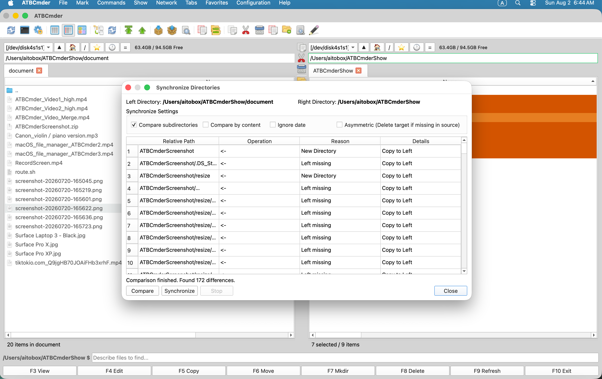

# Kapitel 9: Praxislösungen & Fehlerbehebung

Während orthodoxe Dual-Panel-Dateimanager für ihre enorme Geschwindigkeit und Tastatureffizienz bekannt sind, erfordert die Bewältigung realer Aufgaben oft ein Verständnis dafür, wie verschiedene Subsysteme – wie Verzeichnissynchronisierung, Stapelmusterumbenennung, entfernte virtuelle Dateisysteme, Archivumpacken und rekursive Suche – in alltäglichen Szenarien zusammenarbeiten. Darüber hinaus führt der Betrieb unter modernem macOS zu Sicherheitsgrenzen, Sandbox-Einschränkungen und Überschneidungen mit Systemverknüpfungen, auf die jeder Benutzer irgendwann stößt. 

Dieses Kapitel ist in zwei umfassende Abschnitte unterteilt: 

1. **Praxis-Rezepte & Workflows**: Fünf vollständige, durchgängige exemplarische Vorgehensweisen, die hochwertige Dateiverwaltungs-Workflows mit Schritt-für-Schritt-Anleitungen, visuellen Darstellungen der Benutzeroberfläche, Tastaturkürzeln und Power-User-Tipps abdecken. 
2. **Anleitung zur Fehlerbehebung und häufig gestellte Fragen**: Ausführliche Erklärungen und Diagnoselösungen für häufige Betriebsfragen, Berechtigungsfehler, Verhalten bei der automatischen Aktualisierung, Zurücksetzen der Konfiguration, Funktionstasten der Apple-Tastatur und Mechanismen zur Dateiübertragung zwischen Volumes. 

---

## 1. Visueller Schnellstart: Matrix zur alltäglichen Problemlösung

Die folgende Entscheidungsmatrix ordnet allgemeine Dateiverwaltungsziele und technische Herausforderungen direkt den integrierten Tools und Befehlskennungen von ATBCmder zu: 

```
┌────────────────────────────────────────────────────────────────────────────────────────┐
│                    ALLTÄGLICHE AUFGABEN & FEHLERBEHEBUNG-LEITFADEN                     │
├────────────────────────────────────────────────────────────────────────────────────────┤
│                                                                                        │
│  AUFGABE / ZIEL                            WERKZEUG / METHODE       TASTENKÜRZEL       │
│  ──────────────────────────────────────    ───────────────────────  ─────────────────  │
│  [1] Lokale Projekte auf NAS/HDD spiegeln  Verzeichnissynchronisation Shift+F12 (⇧F12) │
│  [2] Fotobibliotheken nach Datum umbenennen Multi-Umbennungs-Tool  Ctrl+M (⌃M)         │
│  [3] NAS oder Server im Netzwerk einbinden Netzwerk-VFS-Manager    cm_ManageConnections│
│  [4] Konfig in .zip direkt bearbeiten      Archiv-VFS + Editor     Enter ➔ F4 ➔ Save   │
│  [5] Tiefe Speicherfresser aufspüren       Flache Zweigansicht     Cmd+B (⌘B) / Alt+F7 │
│                                                                                        │
│  PROBLEM / SYMPTOM                         URSACHE                 LÖSUNG              │
│  ──────────────────────────────────────    ──────────────────────  ──────────────────  │
│  Fehler "Operation not permitted"          macOS-Sandbox / TCC     cm_GrantAccess      │
│  Externe Laufwerke nicht aktuell           Keine FSEvents auf FAT attr_poll_interval   │
│  Risikofrei Konfigurationen testen         Produktions-XML-Schutz ATBCmder_test.sh     │
│  F-Tasten regeln Systemfunktionen          macOS-Medientasten      Fn-Taste / Settings │
│  Verschieben über Laufwerke träge          Kopieren + Löschen      Freien Platz prüfen │
│                                                                                        │
└────────────────────────────────────────────────────────────────────────────────────────┘
```

### Dual-Matrix-Schnellreferenztabelle

| Aktion/Diagnose | macOS-Verknüpfung | Klassische Commander-Taste | Befehls-ID | Hauptzweck | 
| :--- | :--- | :--- | :--- | :--- | 
| **Verzeichnissynchronisierung** | `Shift+F12` / `⇧F12` | `Shift+F12` | `cm_SyncDirs` | Vergleicht und synchronisiert Dual-Panel-Verzeichnisbäume. | 
| **Batch-Mehrfachumbenennung** | `Ctrl+M` / `⌃M` | `Ctrl+M` | `cm_MultiRename` | Benennt mehrere Dateien mithilfe von Token, Zählern und RegEx um. | 
| **Netzwerkverbindungen** | Menü: Netzwerk | `cm_ManageConnections`| `cm_ManageConnections`| Verwaltet gespeicherte SMB-, SFTP-, WebDAV- und FTP-Serverprofile. | 
| **Schnelle Netzwerkverbindung** | Menü: Netzwerk | `cm_NetworkConnect` | `cm_NetworkConnect` | Ad-hoc-Verbindungsdialog für Remote-Server. | 
| **Direktbearbeitung in Archiven (In-Place Edit)** | `F4` / `Fn+F4` | `F4` | `cm_Edit` | Bearbeitet Archiv-Eintrag; löst beim Speichern `RepackWorker` aus. | 
| **Flache Verzeichnisansicht (Flat Branch View)** | `Cmd+B` / `⌘B` | `Ctrl+B` | `cm_FlatView` | Zeigt rekursiv alle verschachtelten Dateien in einer einzigen flachen Liste an. | 
| **Erweiterte Suche** | `Alt+F7` / `⌥F7` | `Alt+F7` | `cm_Search` | Dateisuche mit mehreren Filtern und Ausgabe „Feed to Listbox“. | 
| **Dateisystemzugriff gewähren**| Menü: Datei / Hilfe | — | `cm_GrantFilesystemAccess`| Startet den Berechtigungsassistenten für die macOS App Sandbox. | 
| **Manuelle Panel-Aktualisierung** | `Ctrl+R` / `⌃R` oder `Cmd+R` / `⌘R` | `Ctrl+R` | `cm_Refresh` | Erzwingt ein sofortiges erneutes Lesen des Verzeichnisses von der Festplatte. | 
| **Systemterminal starten** | `Ctrl+J` / `⌃J` | `Ctrl+J` | `cm_RunTerm` | Erzeugt das macOS-Terminal im aktuellen Panel-Pfad. | 
| **Ordnerplatz berechnen** | `Alt+Shift+Enter` (`Space`) | `Alt+Shift+Enter` (`Space`) | `cm_CountDirContent` / `cm_CalculateSpace` | Berechnet die aggregierte rekursive Bytegröße (`Space` für einzelne Bytes, `Ctrl+L` für ausgewählte Gesamtbytes). | 
| **Sicheres Löschen (Shred)** | `Alt+Delete` / `⌥⌫` | `Alt+Delete` | `cm_Wipe` | Mehrfaches Überschreiben und dauerhaftes Löschen von Dateien. | 

---

## 2. Praxis-Rezepte & Workflows

### 2.1 Rezept 1: Vergleichen und Synchronisieren zweier Backup-Ordner

**Ziel**: Stellen Sie sicher, dass ein externes Sicherungslaufwerk oder ein Netzwerkordner eine exakte, aktuelle Kopie Ihres aktiven Projektverzeichnisses mit vollständiger Sichtbarkeit der hinzugefügten, geänderten oder gelöschten Dateien enthält, bevor Sie Änderungen vornehmen. 

 
*Abbildung 9.1: Das Dialogfeld „Verzeichnissynchronisierung“ zeigt nebeneinander liegende Verzeichnisvergleiche, Richtungskopierpfeile und asymmetrische Spiegelungsoptionen an.*

#### Schritt-für-Schritt-Anleitung

1. **Quelle und Ziel in zwei Panels ausrichten**: 
- Navigieren Sie im **linken Bereich** zu Ihrem primären lokalen Arbeitsverzeichnis (z. B. `~/Documents/Projects/AppAlpha`). 
- Drücken Sie **`Tab`**, um zum **rechten Bereich** zu wechseln und zu Ihrem Ziel-Backup-Ziel zu navigieren (z. B. `/Volumes/BackupDrive/Backups/AppAlpha`). 
2. **Verzeichnissynchronisierung starten**: 
- Drücken Sie **`Shift+F12`** (`⇧F12`) oder wählen Sie **Befehle ➔ Verzeichnisse synchronisieren...** aus der Menüleiste. 
- Das Dialogfeld „Verzeichnisse synchronisieren“ wird geöffnet und der linke Pfad und der rechte Pfad werden automatisch ausgefüllt. 
3. **Vergleichsparameter konfigurieren**: 
- Aktivieren Sie **Unterverzeichnisse vergleichen**, um alle verschachtelten Ordner rekursiv zu durchlaufen. 
- Aktivieren Sie **Nach Inhalt vergleichen**, wenn Sie kryptografische Sicherheit benötigen (Überprüfung der Dateibytes über `filecmp`), anstatt sich ausschließlich auf Dateigrößen und Änderungszeitstempel zu verlassen. 
– Stellen Sie sicher, dass **FAT/SMB-Zeitstempeltoleranz (2,0 Sek.)** aktiviert ist, wenn Ihr Backup-Ziel FAT32, exFAT oder eine SMB-Netzwerkfreigabe verwendet, um falsche Nichtübereinstimmungsflags zu verhindern, die durch die 2-Sekunden-Zeitstempelrundung des Dateisystems verursacht werden. 

4. **Vergleich starten**: 
- Klicken Sie auf **Vergleichen** (oder drücken Sie `Alt+C` / `⌥C`). 
– ATBCmder führt einen Hintergrundvergleichs-Worker (`SyncCompareWorker`) aus und füllt die Vergleichstabelle mit Richtungsaktionsindikatoren: 

* **`->` (von links nach rechts)**: Die lokale Datei ist neuer oder existiert nur auf der linken Seite. Aktion: Von links nach rechts kopieren. 
* **`<-` (Right to Left)**: The backup file is newer, or only exists on the right. Action: copy right to left.
     * **`=` (Equal)**: Both files are identical in size and timestamp/content. These are hidden from the pending action list by default.
     * **`!=` (Conflict)**: Incompatible directory-versus-file collision or timestamp mismatch requiring manual inspection.
5. **Select Your Synchronization Strategy**:
   - **Two-Way Symmetric Sync (Default)**: Copies newer files in both directions (`->` und `<-`). No files are deleted on either side. Ideal for syncing collaborative folders between machines.
   - **Asymmetric Mirroring (`Asymmetric` Checkbox Enabled)**: Makes the Right directory an exact binary replica of the Left directory. Any file on the Right that does not exist on the Left is **permanently deleted from the backup target**.
6. **Review and Execute**:
   - Inspect the summary count at the bottom: *e.g., "Left to Right: 42 files (128.4 MB) | Right to Left: 0 files | Deletes: 3 files"*.
   - Click **Synchronize** to launch the non-blocking background transfer queue. Progress bars reflect active transfer volume and remaining item counts.

> [!CAUTION] 
> **Gefahr von Datenverlust durch asymmetrische Spiegelung**: 
> Wenn der **Asymmetrische**-Modus aktiviert ist, werden auf dem Ziellaufwerk vorhandene Dateien, die auf der Quelle gelöscht oder umbenannt wurden, **dauerhaft entfernt**, ohne in den macOS-Papierkorb verschoben zu werden. Überprüfen Sie immer die Richtungsvergleichstabelle, bevor Sie auf „Synchronisieren“ klicken! 

> [!TIP] 
> **⚡Profi-Tipp: Überprüfung auf Inhaltsebene für Medien und Code**: 
> Beim Sichern von Videomaterial oder Git-Repositorys stimmen die Dateigrößen möglicherweise überein, während subtile interne Bytebeschädigungen vorliegen. Aktivieren Sie immer **Nach Inhalt vergleichen** für geschäftskritische Archive. Obwohl der Byte-für-Byte-Vergleich über USB oder WLAN länger dauert, garantiert er eine 100-prozentige Datenintegrität. 

---

### 2.2 Rezept 2: Stapelumbenennung von Kamerafotos mit Datum und Sequenznummern

**Ziel**: Hunderte unorganisierter Kameradateien (z. B. `DSC_0012.JPG`, `DSC_0013.JPG`, `IMG_4901.CR3`) in saubere, sortierbare Dateinamen wie `2026-09-06_Vacation_001.jpg` mit mit Nullen aufgefüllten Sequenzzählern und Live-Sicherheitsvorschauen umwandeln. 

 
*Abbildung 9.2: Das Batch Multi-Rename Tool mit Echtzeit-Vorschauzeilen, Metadaten-Tokens, numerischen Zählersteuerungen und Kollisionserkennung.*

#### Schritt-für-Schritt-Anleitung

1. **Wählen Sie die Fotos aus**: 
- Navigieren Sie im aktiven Bereich in Ihr Kamera-Importverzeichnis. 
- Wählen Sie alle Fotos mit **`Cmd+A`** (`⌘A`) aus oder drücken Sie **`+`** auf Ihrer Tastatur, um eine Platzhaltermaske wie `*.jpg;*.jpeg;*.cr3;*.arw` einzugeben. 
2. **Starten Sie das Batch-Multi-Rename-Tool**: 
- Drücken Sie **`Ctrl+M`** (`⌃M`) oder **`Cmd+M`** (`⌘M`) oder wählen Sie **Dateien ➔ Multi-Rename-Tool...** aus der Menüleiste. 
3. **Definieren Sie die Dateinamenmaske**: 
- Geben Sie im Feld **Dateinamenmaske** die gewünschte Struktur mithilfe von Metadaten-Tokens ein: 
     ```
     [Y]-[M]-[D]_Vacation_[C]
     ```


- **Token-Erklärung**: 
* `[Y]`: 4-stelliges Jahr der Dateiänderung (z. B. `2026`). 
* `[M]`: 2-stelliger Monat (z. B. `09`). 
* `[D]`: 2-stelliger Tag (z. B. `06`). 
* `Vacation`: Statischer Beschreibungstext. 
* `[C]`: Sequentielle numerische Zähler. 
4. **Konfigurieren Sie die Zählersequenz**: 
- Auf der Karte **Zählereinstellungen**: 
* **Beginn bei**: `1` 
* **Schritt**: `1` 
* **Ziffern**: `3` (dies erzwingt das Auffüllen mit Nullen: `001`, `002`, `003`... bis zu `999`). 
5. **Kamerapräfixe mit Suchen & Ersetzen entfernen (optional)**: 
- Wenn Sie einen Teil des ursprünglichen Dateinamens ohne das Kamerapräfix beibehalten möchten (z. B. die Kamerasequenznummer von `DSC_8941.JPG` beibehalten): 
* Setzen Sie **Dateinamenmaske** auf: `[YMD]_[N5-]` 
* `[N5-]` extrahiert Zeichen von Index 5 bis zum Ende des Namens und entfernt `DSC_` vollständig. 
- Alternativ können Sie die Felder **Suchen & Ersetzen** verwenden: 
* **Suchen**: `DSC_` 
* **Ersetzen**: `Photo_` 
* Aktivieren Sie **RegEx**, wenn Sie komplexe Ausdrucksmuster wie `^IMG_(\d+)` verwenden. 
6. **Überprüfen Sie die Live-Vorschautabelle**: 
- Die 3-Spalten-Tabelle (`Old Name`, `New Name`, `Directory`) wird bei jedem Tastendruck sofort aktualisiert. 
- Überprüfen Sie die Spalte **Status**: ATBCmder hebt doppelte Zielnamen in fettem Rot mit einer Kollisionsanzeige hervor und verhindert so versehentliches Überschreiben. 
7. **Umbenennen ausführen**: 
- Drücken Sie **`Enter`** oder klicken Sie auf **Umbenennen starten**. ATBCmder führt die Umbenennungen atomar auf der Festplatte durch und aktualisiert die Panel-Ansicht. 

> [!NOTE] 
> **Erweiterungssicherheit**: 
> Standardmäßig ist die **Erweiterungsmaske** auf `[E]` eingestellt, sodass die ursprüngliche Dateierweiterung unverändert bleibt. Löschen Sie niemals `[E]`, es sei denn, Sie beabsichtigen ausdrücklich, Erweiterungen aus Ihren Dateien zu entfernen.

> [!TIP] 
> **⚡ Profi-Tipp: Workflow für externe Editoren (`⌘I`)**: 
> Wenn Sie eine unregelmäßige Liste mit Kundennamen oder Titeltiteln haben, drücken Sie im Multi-Rename-Tool **`Cmd+I`** (`⌘I` / Im externen Editor bearbeiten). ATBCmder exportiert die Zielnamen in Ihren Standardtexteditor. Bearbeiten Sie die Liste in Vim, VS Code oder TextEdit, speichern Sie das Dokument und ATBCmder importiert die überarbeiteten Namen sofort in das Vorschauraster. 

---

### 2.3 Rezept 3: Verbindung zu einem Heim-/Büro-NAS über SMB, SFTP oder WebDAV

**Ziel**: Montieren Sie einen lokalen TrueNAS- oder Synology-Speicherpool, einen AWS EC2 Linux-Server oder ein Nextcloud WebDAV-Cloud-Repository in einer Dual-Panel-Registerkarte, ohne mit separaten Terminalbefehlen oder Finder-Verbindungsblättern zu jonglieren. 

 
*Abbildung 9.3: Konfigurieren sicherer Remote-Netzwerkfreigaben über SMB-, SFTP- und WebDAV-Protokolle.*

#### Schritt-für-Schritt-Anleitung

1. **Öffnen Sie den Netzwerkverbindungsmanager**: 
- Wählen Sie **Netzwerk ➔ Netzwerkverbindungen verwalten...** aus der nativen Menüleiste oder führen Sie den Befehl **`cm_ManageConnections`** aus. 
2. **Neues Verbindungsprofil erstellen**: 
- Klicken Sie unten links auf die Schaltfläche **`➕ New`**. 
- Geben Sie im Feld **Label** eine erkennbare Kennung ein (z. B. `Synology Office NAS` oder `AWS Production Web`). 
3. **Protokoll- und Hostdetails konfigurieren**: 
- **Protokoll**: Wählen Sie Ihr Zielprotokoll aus der Dropdown-Liste aus: 
* **SMB/CIFS**: Port `445` (Standard für Synology, QNAP, Windows Server, TrueNAS). 
* **SFTP (SSH File Transfer)**: Port `22` (Standard für Linux/UNIX-Cloud-Instanzen). 
* **WebDAV / WebDAVS**: Port `80` oder `443` (Standard für Nextcloud, ownCloud). 
* **FTP / FTPS**: Port `21` oder `990` (Legacy-Dateihosts). 
- **Host**: Geben Sie die IP-Adresse oder den Domänennamen ein (z. B. `192.168.1.100` oder `sftp.mycompany.com`). 
- **Port**: Wird automatisch eingestellt, wenn das Protokoll ausgewählt wird; Passen Sie an, ob Ihr Server einen nicht standardmäßigen Port verwendet. 
- **Benutzername**: Geben Sie den Benutzernamen Ihres Remote-Systemkontos ein. 
- **Remote-Pfad**: Legen Sie das Standardzielverzeichnis fest (z. B. `/volume1/Media` oder `/var/www/html`). 
4. **Sichere Speicherung von Anmeldeinformationen**: 
- Geben Sie Ihr Passwort oder Ihren Hauptschlüssel ein. 
- Aktivieren Sie **Passwort im macOS-Schlüsselbund merken**. 
- **Sicherheitsgarantie**: ATBCmder speichert niemals Klartext-Anmeldeinformationen in XML-Konfigurationsdateien. Alle Geheimnisse werden kryptografisch im nativen Apple-Schlüsselbund (`com.aitobox.atbcmder.vfs`) versiegelt. 
5. **Testen Sie die Verbindung**: 
- Klicken Sie auf **`🔍 Test Connection`**. 
– ATBCmder sendet einen Hintergrund-Worker (`ConnectionTestWorker`), der die Netzwerkerreichbarkeit validiert, SSH-Hostschlüssel oder TLS-Zertifikate überprüft, Anmeldeinformationen überprüft und eine Erfolgswarnung anzeigt, ohne den Dialog zu schließen. 

6. **Verbinden und durchsuchen**: 
- Klicken Sie auf **`🔗 Connect`** (oder drücken Sie `Enter`). 
– Im aktiven Bereich wird eine neue Ordnerregisterkarte geöffnet, in der der Remote-Pfad als einheitlicher VFS-URI formatiert angezeigt wird: 
     ```
     vfs://smb://admin@192.168.1.100/volume1/Media/
     vfs://sftp://ubuntu@aws.prod.internal:22/var/www/html/
     ```


- Sie können jetzt Dateien auf lokalen Festplatten und Remote-Servern mit identischer Dual-Panel-Agilität durchsuchen, suchen, kopieren (`F5`), verschieben (`F6`) und löschen (`F8`). 
7. **Schnelle Wiederherstellung der Verbindung über die Menüleiste**: 
- Alle gespeicherten Profile erscheinen automatisch unter **Netzwerk ➔ Gespeicherte Verbindungen**. Klicken Sie einfach auf einen gespeicherten Server, um ihn sofort bereitzustellen. 

> [!TIP] 
> **⚡Profi-Tipp: SSH-Schlüsselbasierte Authentifizierung für SFTP**: 
> Für den automatisierten Cloud-Server-Zugriff konfigurieren Sie die Authentifizierung mit öffentlichen Schlüsseln. Lassen Sie in Ihrem SFTP-Verbindungsprofil das Passwortfeld leer und verweisen Sie auf Ihren lokalen privaten Schlüssel (z. B. `~/.ssh/id_ed25519`). Wenn der Schlüssel durch eine Passphrase geschützt ist, fordert ATBCmder einmal zur Eingabe auf und speichert ihn sicher in Ihrem macOS-Schlüsselbund. 

---

### 2.4 Rezept 4: Bearbeiten einer Datei direkt in einem Archiv ohne Extrahieren

**Ziel**: Ändern Sie eine verschachtelte Konfigurationsdatei (`settings.json` oder `config.yaml`) in einem Multi-Gigabyte-Archiv `.zip`, `.tar.gz` oder `.7z` auf einem lokalen Speicher oder einem Remote-Server, ohne das gesamte Archiv auf Ihrer Festplatte zu dekomprimieren. 

 
*Abbildung 9.4: Navigieren und Bearbeiten in komprimierten Archiven über das einheitliche virtuelle Dateisystem `vfs://`.*

#### Schritt-für-Schritt-Anleitung

1. **Geben Sie das Archiv als virtuelles Verzeichnis ein**: 
- Markieren Sie die Archivdatei (z. B. `production_backup.zip`) im aktiven Bereich. 
- Drücken Sie **`Enter`** (oder doppelklicken Sie). 
- ATBCmder fängt die Navigation ab und mountet das Archiv als virtuelles Dateisystem: 
     ```
     vfs:///Users/brain/Downloads/production_backup.zip/
     ```
 

2. **Zur Zieldatei navigieren**: 
- Durchsuchen Sie verschachtelte virtuelle Verzeichnisse (`etc`, `nginx`, `conf.d`), genau wie auf einem physischen Volume. 
- Suchen Sie die Datei, die Sie aktualisieren müssen (z. B. `nginx.conf` oder `app_settings.json`). 
3. **Im integrierten Texteditor öffnen**: 
- Drücken Sie **`F4`** (`Fn+F4` / `cm_Edit`). 
– ATBCmder streamt das komprimierte Element in einen temporären isolierten Puffer und öffnet es direkt im syntaxhervorgehobenen Texteditor. 

4. **Änderungen vornehmen und speichern**: 
- Nehmen Sie die erforderlichen Konfigurationsänderungen vor. 
- Drücken Sie **`Cmd+S`** (`⌘S`), um den Puffer zu speichern. 
5. **Automatischer Repack-Lebenszyklus (`RepackWorker`)**: 
- Wenn Sie den Editor speichern oder schließen, wird die Hintergrund-Repack-Engine (`RepackWorker`) von ATBCmder automatisch aktiviert: 
1. Es berechnet das Delta zwischen dem ursprünglich komprimierten Element und Ihrem geänderten Puffer. 
2. Es prüft die Gesamtarchivgröße anhand des konfigurierten Warnschwellenwerts (`ArchiveRepackWarningMB`). 
3. Die geänderte Datei wird erneut komprimiert und die Archivstruktur wird in einer temporären Datei neu erstellt. 
4. Es ersetzt atomar die ursprüngliche Archivdatei auf der Festplatte und stellt so sicher, dass keine Beschädigung auftritt, wenn das System während des Schreibvorgangs die Stromversorgung verliert. 
5. Die aktive Panelansicht wird automatisch aktualisiert, um die aktualisierten Bytegrößen und Zeitstempel der Mitglieder anzuzeigen.

> [!IMPORTANT] 
> **Umpackschutz für große Archive (`ArchiveRepackWarningMB`)**: 
> Das Aktualisieren einer einzelnen 2-KB-Textdatei in einem 15-GB-Archiv erfordert das Neuschreiben der gesamten Archivdatei auf der Festplatte. Um unerwartete CPU-Spitzen und SSD-Verschleiß zu verhindern, überprüft ATBCmder die Archivgröße. Wenn das Archiv `ArchiveRepackWarningMB` (Standard: 500 MB) überschreitet, wird ein Warndialog angezeigt: * „Dieses Archiv ist 1,4 GB groß. Durch das Neupacken wird die gesamte Datei neu geschrieben. Möchten Sie fortfahren?“* Sie können diesen Schwellenwert unter **Konfiguration ➔ Optionen ➔ Archive** anpassen. 

---

### 2.5 Rezept 5: Suchen und Löschen großer, überfüllter Dateien in verschachtelten Verzeichnissen

**Ziel**: Gewinnen Sie wertvolle SSD-Kapazität zurück, indem Sie verlassene 4K-Video-Renderings, überfüllte `node_modules`-Ordner, Docker-Virtual-Disk-Images oder veraltete DMG-Installationsprogramme, die tief in mehrstufigen Verzeichnisstrukturen verstreut sind, schnell finden und sicher entfernen. 

 
*Abbildung 9.5: Flache Zweigansicht (`Cmd+B`) zeigt tief verschachtelte Inhalte in einer einzigen abgeflachten Tabelle zur sofortigen Größensortierung an.*

#### Methode A: Sofortige Reduzierung über die flache Zweigansicht (`Cmd+B`)

1. **Navigieren Sie zum übergeordneten Stammordner**: 
- Markieren Sie den übergeordneten Ordner der obersten Ebene, den Sie prüfen möchten (z. B. `~/Projects` oder `~/Downloads`). 
2. **Flat Branch View aktivieren**: 
- Drücken Sie **`Cmd+B`** (`⌘B`) oder **`Ctrl+B`** (`cm_FlatView`) oder wählen Sie **Anzeigen ➔ Zweigansicht (flache Ansicht)**. 
- ATBCmder durchsucht rekursiv alle Unterverzeichnisse und zeigt jede verschachtelte Datei in einer **einzelnen, flachen Liste** an, wodurch Verzeichnis-Ordnergrenzen aufgehoben werden. 
3. **Nach Größe absteigend sortieren**: 
- Klicken Sie auf die Spaltenüberschrift **Größe** oder drücken Sie **`Ctrl+F6`** (`cm_SortBySize`), um die größten Dateien nach oben zu sortieren. 
- Riesige ISO-Dateien, Datenbank-Dumps und Images virtueller Maschinen werden sofort oben in Ihrem Panel angezeigt. 
4. **Verzeichnisplatz berechnen**: 
- Für in Standardansichten sichtbare Unterordner platzieren Sie den Cursor auf einem beliebigen Ordner und drücken Sie **`Space`** (`␣` / `cm_CalculateSpace`). ATBCmder berechnet den gesamten rekursiven Byte-Footprint und zeigt ihn anstelle der Standardbezeichnung `<DIR>` an. 
5. **Zweigansicht verlassen**: 
- Drücken Sie erneut **`Cmd+B`** oder drücken Sie `Esc` / `Backspace` auf `..`, um zur normalen hierarchischen Verzeichnisnavigation zurückzukehren. 

---

#### Methode B: Gezielte Filterung über erweiterte Suche (`Alt+F7`) und „Feed to Listbox“

 
*Abbildung 9.6: Dialogfeld „Erweiterte Suche“ mit Größenfilterkriterien und der Schaltfläche „Feed to Listbox“.* 

1. **Erweiterte Suche starten**: 
- Drücken Sie **`Alt+F7`** (`⌥F7`) oder wählen Sie **Befehle ➔ Suchen...**. 
2. **Größen- und Typfilter definieren**: 
- Bestätigen Sie im Feld **Suchen in** Ihr Stammverzeichnis. 
- Überprüfen Sie den Filter **Größe**: Wählen Sie **`>`** und geben Sie `100` mit der Einheit **`MB`** (oder `1` **`GB`**) ein. 
- Geben Sie im Feld **Dateimaske** die Zielerweiterungen an (z. B. `*.dmg;*.iso;*.mp4;*.mov;*.zip`) oder belassen Sie sie bei `*`, um aufgeblähte Elemente zu finden. 
- Beschränken Sie auf der Registerkarte **Datum** optional die Ergebnisse auf Dateien, die in den letzten 180 Tagen nicht geändert wurden. 
3. **Suche ausführen**: 
- Klicken Sie auf **Suche starten**. 
4. **Feed-Ergebnisse in eine virtuelle Panel-Registerkarte („Feed to Listbox“)**: 
- Sobald die Ergebnisse angezeigt werden, klicken Sie auf die Schaltfläche **Zu Listenfeld hinzufügen**. 
- Der gesamte Suchergebnissatz wird in einen **dedizierten virtuellen Tab** in Ihrem aktiven Bereich übertragen. 
– Im Gegensatz zu einem statischen modalen Dialog verhalten sich Dateien auf dieser Registerkarte wie normale Dateibedienfeldelemente: Sie können sie mit der Schnellansicht (`Ctrl+Q` / `⌘Q`) in der Vorschau anzeigen, sie im Universal Lister überprüfen (`F3`) oder mehrere Dateien mit `Insert` / `Space` markieren. 

5. **Überprüfen und löschen**: 
- Wählen Sie unerwünschte Dateien aus und drücken Sie **`F8`** (`Fn+F8` / `cm_Delete`), um sie sicher in den macOS-Papierkorb zu verschieben. 
- Wenn Sie eine dauerhafte, unwiederbringliche Datenlöschung benötigen (z. B. die Löschung vertraulicher Kundendaten), drücken Sie **`Alt+Delete`** (`⌥⌫` / `cm_Wipe`), um die sichere Dateivernichtung in mehreren Durchgängen auszulösen. 

> [!TIP] 
> **⚡Profi-Tipp: Identische doppelte Dateien anhand von Prüfsummen identifizieren**: 
> Wenn Sie vermuten, dass es sich bei mehreren großen Dateien um exakte Duplikate handelt, wählen Sie sie aus und drücken Sie **`Ctrl+X`** (`⌃X` / `cm_CheckSumCalc`). Wählen Sie **SHA-256** und klicken Sie auf Berechnen. Passende Hash-Digests bestätigen 100 % binäre Duplikate, sodass Sie überflüssige Kopien mit absoluter Sicherheit löschen können. 

---

## 3. Leitfaden zur Fehlerbehebung und häufig gestellte Fragen (FAQs)

### 3.1 Fehler „Vorgang nicht zulässig“ / macOS-Berechtigung verweigert

#### Grundursache

Unter modernem macOS (macOS 12 Monterey bis macOS 15 Sequoia) setzt Apple strenge Datenschutzgrenzen für **App Sandbox** und **TCC (Transparency, Consent, and Control)** durch. Sandbox-Anwendungen können nicht auf externe Laufwerke, Systemordner oder sogar Standardbenutzerverzeichnisse (`~/Documents`, `~/Downloads`, `~/Desktop`) zugreifen, ohne ein explizites, vom Benutzer gewährtes kryptografisches Berechtigungstoken, das als **Lesezeichen mit Sicherheitsbereich** bezeichnet wird. 

Wenn ATBCmder kein Dateisystemzugriff gewährt wurde, kann Folgendes auftreten: 

- Dateioperationsdialoge werden angezeigt: `"Error: Operation not permitted"`. 
– Verzeichnisse werden leer angezeigt, obwohl Dateien im Finder vorhanden sind. 
– Bei externen USB- oder Thunderbolt-Laufwerken unter `/Volumes` wird der Fehler „Zugriff verweigert“ angezeigt.

#### Lösung 1: Verwenden Sie den App Sandbox Onboarding Assistant (`cm_GrantFilesystemAccess`)

ATBCmder enthält einen integrierten Onboarding-Assistenten, der für die Registrierung dauerhafter Sicherheitslesezeichen bei macOS entwickelt wurde: 

```
┌─────────────────────────────────────────────────────────────┐
│  Dateisystemzugriff gewähren (Filesystem Access)        [x] │
├─────────────────────────────────────────────────────────────┤
│  Da ATBCmder in sicherer macOS-Sandbox ausgeführt wird,     │
│  benötigt es Ihre Erlaubnis für den Zugriff auf wichtige    │
│  Systemordner und externe Laufwerke.                        │
│                                                             │
│  [  Zugriff auf Stammverzeichnis (/) gewähren  ]            │
│                                                             │
│  [  Zugriff auf externe Laufwerke (/Volumes) gewähren  ]    │
│                                                             │
│  [  Festplattenvollzugriff-Einstellungen öffnen…  ]         │
│                                                             │
│  Stammverzeichnis-Zugriff wird von der Sandbox benötigt.    │
│  Festplattenvollzugriff schützt sensible Benutzerdaten.     │
│                                                 [ Fertig ]  │
└─────────────────────────────────────────────────────────────┘
```
 

1. Wählen Sie in der Menüleiste **Datei** (oder **Hilfe**) ➔ **Dateisystemzugriff gewähren…** oder lösen Sie den Befehl **`cm_GrantFilesystemAccess`** aus. 
2. Klicken Sie auf **"Zugriff auf Stammverzeichnis gewähren (/)"**. 
* Wenn das native Apple-Blatt `NSOpenPanel` angezeigt wird und auf `Macintosh HD` (`/`) verweist, klicken Sie auf **Zugriff gewähren** (oder **Öffnen**). 
* **Warum das funktioniert**: Durch die Autorisierung von `/` wird ein Root-Lesezeichen mit Sicherheitsbereich generiert, das in `sandbox_bookmarks.plist` gespeichert ist. Da untergeordnete Pfade Sicherheitstokens nach unten erben, werden durch die Gewährung des Zugriffs auf `/` alle Standardbenutzerordner dauerhaft entsperrt (`~/Documents`, `~/Downloads`, `/Applications`, `~/Projects`). 
3. Klicken Sie auf **"Zugriff auf externe Festplatten (/Volumes) gewähren"**. 
* Klicken Sie im geöffneten Blatt auf **Zugriff gewähren** für `/Volumes`. 
* Dies autorisiert alle angeschlossenen USB-Flash-Laufwerke, externen SSDs, SD-Karten, Disk-Images (DMG) und Netzwerk-SMB-Mounts. 
4. Klicken Sie auf **Fertig**. Ihre Berechtigungen werden dauerhaft über Anwendungsneustarts hinweg gespeichert.

#### Lösung 2: Gewähren Sie vollständigen Festplattenzugriff (FDA) in den macOS-Systemeinstellungen

Wenn Sie geschützte Systemspeicherorte verwalten müssen – wie `~/Library/Mail`, `~/Library/Messages`, Safari-Browsing-Caches oder Time Machine-Backup-Bäume – erfordert macOS TCC eine zusätzliche Berechtigung auf Systemebene: 

1. Öffnen Sie **Systemeinstellungen** (Apple-Menü  ➔ Systemeinstellungen). 
2. Navigieren Sie zu **Datenschutz und Sicherheit ➔ Vollständiger Festplattenzugriff**. 
3. Suchen Sie **ATBCmder** in der Anwendungsliste und stellen Sie den Schalter auf **Ein**. 
4. Wenn ATBCmder nicht aufgeführt ist: 
* Klicken Sie unten auf die Schaltfläche **`+`**. 
* Authentifizieren Sie sich mit Ihrem Mac-Passwort oder Ihrer Touch ID. 
* Wählen Sie `/Applications/ATBCmder.app` und klicken Sie auf **Öffnen**. 
5. Wenn Sie aufgefordert werden, die Anwendung neu zu starten, klicken Sie auf **Beenden und erneut öffnen**.

#### Lösung 3: Zurücksetzen beschädigter TCC-Datenschutzberechtigungen über das Terminal

Wenn Berechtigungen nach einem macOS-Betriebssystem-Upgrade oder einer Anwendungsneusignierung beschädigt werden, setzen Sie die TCC-Datenbank mit dem macOS-Befehlszeilentool `tccutil` zurück: 

```bash
# Reset all Full Disk Access permissions for ATBCmder
tccutil reset SystemPolicyAllFiles com.aitobox.atbcmder

# Reset Desktop, Documents, and Downloads folder permissions
tccutil reset SystemPolicyDocumentsFolder com.aitobox.atbcmder
tccutil reset SystemPolicyDownloadsFolder com.aitobox.atbcmder
tccutil reset SystemPolicyDesktopFolder com.aitobox.atbcmder
```
 

Nachdem Sie diese Befehle ausgeführt haben, starten Sie ATBCmder neu und führen Sie **`cm_GrantFilesystemAccess`** erneut aus. 

---

### 3.2 Automatische Aktualisierung erkennt Dateiänderungen auf der Festplatte nicht

#### Grundursache

ATBCmder verwendet eine mehrstufige Dateiüberwachungs-Engine: 

1. **Kernel `FSEvents`**: Auf nativen Apple APFS- und HFS+-Volumes gibt der macOS-Kernel sofortige Verzeichnismutationsereignisse aus, wenn Dateien durch externe Tools hinzugefügt, geändert oder gelöscht werden. 
2. **Dateisystemeinschränkungen**: Nicht von Apple stammende Dateisysteme (z. B. externe USB-Sticks, die als **FAT32** oder **exFAT** formatiert sind) und Remote-Netzwerk-Mounts (**SMB**, **NFS**, **SFTP**, **WebDAV**) **unterstützen keine Kernel-`FSEvents`-Benachrichtigungen**. Wenn eine Drittanbieter-App eine Datei auf einer SMB-Freigabe erstellt oder löscht, erhält der macOS-Kernel keine Benachrichtigungsereignisse.

#### Lösungsschritte

1. **Passen Sie das Polling-Fallback-Intervall an (`attr_poll_interval`)**: 
- Öffnen Sie die Einstellungen über **`Cmd+,`** (`⌘,`) oder **Konfiguration ➔ Optionen...**. 
- Navigieren Sie zur Seite **Automatische Aktualisierung**. 
– Stellen Sie sicher, dass **Änderung des Dateinamens überwachen** und **Änderung der Attribute überwachen** aktiviert sind. 

- Passen Sie das **Abfrageintervall (`attr_poll_interval`)** an: 
* Standard: `5 seconds`. 
* Für schnelle lokale Tests oder aktive Netzwerkentwicklung: auf `1` oder `2 seconds` verringern. 
* Für WLAN-Freigaben mit hoher Latenz: Erhöhen Sie auf `10` oder `15 seconds`, um den Netzwerk-Overhead zu minimieren. 
2. **Überprüfen Sie die Liste der ausgeschlossenen Verzeichnisse**: 
- Sehen Sie sich auf derselben Einstellungsseite für die **Automatische Aktualisierung** die Tabelle **Ausgeschlossene Verzeichnisse** an. 
– Wenn Ihr aktiver Pfad (oder ein übergeordneter Ordner) zur Ausschlussliste hinzugefügt wurde, unterdrückt ATBCmder absichtlich die Dateiüberwachung, um CPU-Zyklen zu sparen. Entfernen Sie den Pfad, wenn Sie die Überwachung wieder aktivieren möchten. 

3. **Einstellungen für die Hintergrundaktualisierung überprüfen**: 
– Wenn Dateifenster nur dann nicht aktualisiert werden, wenn ATBCmder minimiert ist oder sich hinter anderen Fenstern befindet, aktivieren Sie die Option: 
`[ ] Disable auto-refresh when ATBCmder is in the background` 
– Deaktivieren Sie diese Option, wenn ATBCmder kontinuierlich Hintergrund-Build-Ausgaben und externe Downloads anzeigen soll. 

4. **Sofortige manuelle Aktualisierung erzwingen**: 
- Drücken Sie jederzeit **`Ctrl+R`** (`⌃R`) oder **`Cmd+R`** (`⌘R`) (`cm_Refresh`). 
– Dadurch werden alle Caching-Ebenen umgangen, interne Verzeichnismodelle geleert und der Verzeichnisinhalt sofort erneut vom Speichercontroller gelesen. 

---

### 3.3 Sicheres Zurücksetzen der Konfiguration oder Testen im isolierten Testmodus

#### Neue Konfigurationen sicher testen mit `scripts/ATBCmder_test.sh`

Wenn Sie experimentelle Tastenkombinationslayouts, neue Farbthemen oder automatisierte Skriptbefehle testen, sollten Sie es vermeiden, die XML-Datei Ihrer Produktionskonfiguration zu ändern. 

ATBCmder stellt ein Sandbox-Test-Launcher-Skript bereit: 
```bash
# Run ATBCmder in an isolated test environment
./scripts/ATBCmder_test.sh
```
 

**Wie es funktioniert**: 

1. Das Skript erstellt ein dediziertes temporäres Verzeichnis: `tests/.test_config/`. 
2. Es kopiert die saubere Baseline-Testkonfiguration (`src/atbcmder/resources/test_config.xml`) nach `tests/.test_config/atbcmder.xml`. 
3. Es exportiert die Umgebungsvariable: 
   ```bash
   export ATBCMDER_CONFIG_PATH="$(pwd)/tests/.test_config"
   ```
 

4. Beim Start liest ATBCmder alle Einstellungen ausschließlich aus diesem Testordner. Alle Änderungen, Tab-Modifikationen oder Hotkey-Experimente sind vollständig in `tests/.test_config/` enthalten, sodass Ihre persönlichen Vorlieben völlig unberührt bleiben.

#### Wiederherstellen der werkseitigen Standardkonfiguration

Wenn Ihre Produktionskonfiguration beschädigt wird oder Sie ganz neu beginnen möchten: 

1. **ATBCmder vollständig beenden** (**`Cmd+Q`** / `⌘Q`). 
2. Öffnen Sie macOS Terminal und suchen Sie Ihr Konfigurationsverzeichnis: 
* Standardinstallation: `~/Library/Einstellungen/atbcmder/` 
* Linux/XDG-Fallback: `~/.config/atbcmder/` 
3. Sichern oder entfernen Sie die aktiven Konfigurationsdateien: 
   ```bash
   # Move configuration files to a backup location
   mv ~/Library/Preferences/atbcmder/atbcmder.xml ~/Library/Preferences/atbcmder/atbcmder.xml.bak
   mv ~/Library/Preferences/atbcmder/atbcmder_hotkeys.xml ~/Library/Preferences/atbcmder/atbcmder_hotkeys.xml.bak
   ```
 

4. Starten Sie ATBCmder neu. 
5. Beim Start erkennt ATBCmder die fehlenden Konfigurationsdateien und generiert automatisch saubere, validierte XML-Konfigurationen neu, die mit offiziellen Werkseinstellungen gefüllt sind.

#### Tragbare Konfigurationen exportieren und importieren

So migrieren Sie Ihre Konfiguration auf mehrere Macs oder erstellen ein externes Backup: 

- **Exportieren**: Wählen Sie **Konfiguration ➔ Konfiguration exportieren...** (Befehl **`cm_ExportConfiguration`**), um einen konsolidierten Schnappschuss `.zip` oder `.xml` zu speichern, der Ihre Hotkeys, Spalten, bevorzugten Registerkarten und Farbpaletten enthält. 
- **Importieren**: Wählen Sie **Konfiguration ➔ Konfiguration importieren...** (Befehl **`cm_ImportConfiguration`**) auf Ihrem Zielcomputer, um die Einstellungen sofort wiederherzustellen. 

---

### 3.4 Funktionstasten, die macOS-Helligkeit/Lautstärke anstelle von Befehlen auslösen

#### Grundursache

Standardmäßig weisen Apple-Tastaturen (MacBook-Einbautastaturen, Magic Keyboards) der oberen Tastenreihe spezielle Hardwarefunktionen zu: 

- `F1` / `F2`: Displayhelligkeit verringern / erhöhen 
- `F3`: Missionskontrolle 
- `F4`: Spotlight / Launchpad 
- `F7` / `F8` / `F9`: Steuerelemente für die Medienwiedergabe (Rücklauf, Wiedergabe/Pause, schneller Vorlauf) 
- `F10` / `F11` / `F12`: Audio-Stummschaltung, Lautstärke verringern, Lautstärke erhöhen 

Wenn Sie `F5` drücken, in der Hoffnung, eine Datei zu kopieren, fängt macOS den Tastendruck ab und unternimmt nichts (oder passt die Tastaturbeleuchtung an).

#### Lösung 1: Verwenden Sie den Modifikatorakkord `Fn`

Halten Sie die Taste **`Fn`** (Funktion) oder **Globus (`🌐`)** in der unteren linken Ecke Ihrer Tastatur gedrückt, während Sie die Funktionstaste drücken: 

- **`Fn+F3`**: Universeller Lister (`cm_View`) 
- **`Fn+F4`**: Texteditor (`cm_Edit`) 
- **`Fn+F5`**: Dateien kopieren (`cm_Copy`) 
- **`Fn+F6`**: Dateien verschieben / umbenennen (`cm_Rename`) 
- **`Fn+F7`**: Neuen Ordner erstellen (`cm_MakeDir`) 
- **`Fn+F8`**: In den Papierkorb löschen (`cm_Delete`) 
- **`Fn+Shift+F12`**: Verzeichnisse synchronisieren (`cm_SyncDirs`)

#### Lösung 2: Standardfunktionstasten systemweit in den macOS-Einstellungen aktivieren

Wenn Sie ATBCmder regelmäßig verwenden, empfiehlt es sich, macOS so zu konfigurieren, dass Funktionstasten als Standardtasten `F1`-`F12` behandelt werden: 

1. Öffnen Sie **Systemeinstellungen** (Apple-Menü  ➔ Systemeinstellungen). 
2. Wählen Sie in der linken Seitenleiste **Tastatur** aus. 
3. Klicken Sie auf die Schaltfläche **Tastaturkürzel...**. 
4. Wählen Sie **Funktionstasten** in der linken Liste des Modalblatts aus. 
5. Schalten Sie den Kippschalter ein: 
**"Verwenden Sie die Tasten F1, F2 usw. als Standardfunktionstasten"** 

6. Klicken Sie auf **Fertig**. 

```
┌─────────────────────────────────────────────────────────────┐
│  Tastaturkurzbefehle                                        │
├──────────────────────────────┬──────────────────────────────┤
│  Tastaturnavigation          │  Die Tasten F1, F2 usw. als  │
│  Sondertasten                │  Standard-Tasten nutzen [EIN]│
│  Funktionstasten        ◄─── │                              │
│  Spotlight                   │  Wenn diese Option aktiv ist,│
│  Mission Control             │  drücken Sie die Fn-Taste,   │
│  App-Kurzbefehle             │  um die aufgedruckten Sonder-│
│                              │  funktionen zu nutzen.       │
│                              │                   [ Fertig ] │
└──────────────────────────────┴──────────────────────────────┘
```
 

*Ergebnis*: Durch Drücken von `F5` wird jetzt direkt das Kopieren in ATBCmder ausgelöst. Um Helligkeit oder Lautstärke anzupassen, halten Sie `Fn` gedrückt, während Sie die Taste drücken.

#### Lösung 3: Verwenden Sie native macOS-Schlüsseläquivalente `Cmd`

Wenn Sie die Systemtastatureinstellungen lieber nicht ändern möchten, bietet ATBCmder native macOS-Tastaturkürzel für jeden Kernvorgang: 

- **Kopie**: `Cmd+C` / `Cmd+V` (oder Standard `F5`) 
- **Verschieben**: `Cmd+C` ➔ `Cmd+Option+V` (`⌥⌘V` verschieben und einfügen) 
- **Löschen**: `Cmd+Delete` (`⌘⌫`) 
- **Neuer Ordner**: `Shift+Cmd+N` (`⇧⌘N`) 
- **Umbenennen**: `F2` oder `Return` 
- **Batch-Mehrfachumbenennung**: `Ctrl+M` (`⌃M`) oder `Cmd+M` (`⌘M`) 
- **Einstellungen**: `Cmd+,` (`⌘,`) 
- **Tab schließen**: `Cmd+W` (`⌘W`) 

---

### 3.5 Verschieben von Dateien über verschiedene Laufwerke vs. dasselbe Laufwerk

Eine häufige Frage von Benutzern ist, warum das Verschieben einer 20-GB-Datei innerhalb desselben Ordners den Bruchteil einer Sekunde dauert, während das Verschieben derselben Datei auf ein externes Laufwerk oder eine Netzwerkfreigabe mehrere Minuten dauert.

#### Intra-Volume-Verschiebung (gleiches Laufwerk/APFS-Partition)

```
┌────────────────────────────────────────────────────────────────────────────────────────┐
│                VERSCHIEBEN AUF GLEICHEM VOLUME (MILLISEKUNDEN-SCHNELL)                 │
├────────────────────────────────────────────────────────────────────────────────────────┤
│                                                                                        │
│   Quelle: /Users/brain/Downloads/BigFile.iso ➔ Ziel: /Users/brain/Movies/              │
│                                                                                        │
│   1. POSIX rename() aktualisiert lediglich den Inode-Verzeichniseintrag im Dateisystem.│
│   2. Physische Datenblöcke auf der SSD werden WEDER gelesen noch kopiert.              │
│   3. Ausführungszeit: < 5 Millisekunden. Erforderlicher freier Speicher: 0 Bytes.      │
│                                                                                        │
└────────────────────────────────────────────────────────────────────────────────────────┘
```
 

Wenn sich Quell- und Zielpfad auf demselben physischen Dateisystem-Volume befinden, gibt ATBCmder einen atomaren POSIX-Systemaufruf `rename()` aus. Das Betriebssystem aktualisiert lediglich Zeigereinträge im Verzeichniskatalog des Dateisystems. Die physischen Datencluster auf Ihrer SSD werden nicht verschoben.

#### Volume-übergreifende Verschiebung (verschiedene Laufwerke/Partitionen/Netzwerk-Mounts)

```
┌────────────────────────────────────────────────────────────────────────────────────────┐
│                  LAUFWERKSÜBERGREIFENDES VERSCHIEBEN (DATENPIPELINE)                   │
├────────────────────────────────────────────────────────────────────────────────────────┤
│                                                                                        │
│   Quelle: /Users/brain/Downloads/BigFile.iso ➔ Ziel: /Volumes/ExternalSSD/Movie/       │
│                                                                                        │
│   Phase 1: Binärer Stream-Transfer (Interne SSD lesen ➔ Auf externes Medium schreiben) │
│   Phase 2: Verifikation & Flush (fsync sichert vollständiges Schreiben)                │
│   Phase 3: Sicheres Löschen (Quelldatei wird erst nach Stufe 2 gelöscht)               │
│                                                                                        │
└────────────────────────────────────────────────────────────────────────────────────────┘
```
 

Bei der Übertragung über verschiedene Dateisystemgrenzen hinweg (z. B. von Ihrer internen Mac-SSD auf ein externes USB-Laufwerk, eine Netzwerk-SMB-Freigabe oder ein Festplatten-Image) ist eine atomare Zeigeraktualisierung physikalisch unmöglich. ATBCmder führt eine mehrstufige **Kopieren-Verifizieren-Löschen-Pipeline** aus: 

1. **Binary Stream Read/Write**: Daten werden in Blöcken vom Quellspeicher-Controller durch den Systemspeicher gestreamt und auf den Zielspeicher-Controller geschrieben. Die Übertragungsdauer hängt vollständig von der physischen Busgeschwindigkeit ab (z. B. USB 3.0 mit ~100 MB/s vs. Thunderbolt 4 mit ~2.800 MB/s). 
2. **Buffer Flush & Verification**: ATBCmder ruft `fsync()` für das Zieldatei-Handle auf, um sicherzustellen, dass alle zwischengespeicherten Daten auf physische Medien geschrieben wurden, und prüft die Äquivalenz der Byteanzahl. 
3. **Sicheres Löschen der Quelle**: Erst nachdem die Zieldatei vollständig geschrieben und überprüft wurde, löscht ATBCmder die Quelldatei von der Originalfestplatte.

#### Kritische Auswirkungen und Sicherheitsgarantien

* **Anforderung an freien Speicherplatz**: Das Ziellaufwerk **muss über ausreichend freie Kapazität verfügen**, um die gesamte Dateinutzlast zu speichern, *bevor* der Vorgang beginnt. Wenn Sie versuchen, eine 30-GB-Datei auf ein externes Laufwerk zu verschieben, auf dem nur 10 GB frei sind, schlägt die Übertragung fehl. 
* **Garantie ohne Datenverlust**: Wenn ein externes Laufwerk versehentlich getrennt wird oder der Zielspeicher während der Übertragung nicht mehr genügend Speicherplatz hat, bricht ATBCmder den Vorgang sofort ab, lässt die Quelldatei **völlig intakt und unbeschädigt**, entfernt alle teilweisen Zieldateien und meldet einen Klartext-Fehlerdialog. 
* **Überwachung der Hintergrundwarteschlange (`cm_OperationsPanel`)**: Langfristige volumeübergreifende Verschiebungen werden in asynchronen Hintergrund-Worker-Threads ausgeführt (`FileOpWorker`). Sie können Übertragungsgeschwindigkeiten und verbleibende Zeiten in Echtzeit überwachen, Übertragungen anhalten/fortsetzen oder nachfolgende Vorgänge in die Warteschlange stellen, ohne die Benutzeroberfläche zu sperren. 

---

### 3.6 Zusätzliche häufig gestellte Fragen

#### F1: Wie wechsle ich den Fokus zwischen dem linken und dem rechten Bereich?

Drücken Sie die Taste **`Tab`** (`⇥`). Der Fokus wechselt sofort zwischen den aktiven und inaktiven Dateitabellen. Das aktive Bedienfeld zeigt eine akzentuierte Randhervorhebung und einen fokussierten Text in der Statusleiste an.

#### F2: Wie tausche ich den Inhalt der linken und rechten Bereiche aus?

Drücken Sie **`Ctrl+U`** (`⌃U`) oder führen Sie den Befehl **`cm_Exchange`** aus. Die Verzeichnisse, Ordnerregisterkarten und Cursorpositionen im linken und rechten Bereich werden sofort ausgetauscht. Um die Panelbreiten auf eine exakte 50/50-Aufteilung auszugleichen, doppelklicken Sie irgendwo auf der vertikalen mittleren Teilungsleiste.

#### F3: Wie wähle ich Dateien mithilfe von Platzhaltermustern aus?

Drücken Sie die Taste **`+`** auf Ihrer Tastatur (oder wählen Sie **Markieren ➔ Gruppe auswählen...** / `cm_MarkPlus`). Geben Sie ein Platzhaltermuster wie `*.pdf` oder `photo_2026_*.jpg` ein. Um die Auswahl von Dateien aufzuheben, die einem Muster entsprechen, drücken Sie die Taste **`-`** (`cm_MarkMinus`). Um Ihre aktuelle Auswahl umzukehren, drücken Sie **`*`** (`cm_MarkInvert`).

#### F4: Wie schalte ich die Sichtbarkeit versteckter Punktdateien um?

Drücken Sie **`Cmd+H`** (`⌘H`) oder **`Cmd+Shift+Period`** (`⇧⌘.`) oder führen Sie den Befehl **`cm_ShowSysFiles`** aus. Versteckte Unix-Dateien (Dateien, die mit einem Punkt beginnen, z. B. `.zshrc`, `.gitignore`, `.env`) wechseln sofort zwischen sichtbarem und ausgeblendetem Status.

#### F5: Wie öffne ich ein macOS-Terminalfenster im aktuellen Verzeichnis?

Drücken Sie **`Ctrl+J`** (`⌃J`) oder führen Sie den Befehl **`cm_RunTerm`** aus. ATBCmder erzeugt eine neue macOS-Terminal- (oder iTerm2-)Sitzung, wobei das aktuelle Arbeitsverzeichnis auf den genauen Pfad Ihres aktiven Dateifensters eingestellt ist.

#### F6: Unterstützt ATBCmder Intel-Macs (x86_64)?

Derzeit wird ATBCmder nativ und exklusiv für **Apple Silicon (M1/M2/M3/M4, ARM64-Architektur)** Macs kompiliert, um den einheitlichen Speicher, die Metal-Hardwarebeschleunigung und die Neural Engine-Subsysteme von Apple voll auszunutzen. **Intel (x86_64) Macs werden derzeit nicht unterstützt.** 

---

## 4. Profi-Tipps und Checkliste für die Systemwartung

Um sicherzustellen, dass ATBCmder in allen Unternehmensworkflows mit Höchstgeschwindigkeit arbeitet: 

- **Wöchentliche Cache-Wartung**: Wenn Sie häufig hochauflösende Kamerakarten durchsuchen, löschen Sie regelmäßig temporäre Miniaturbild-Caches über **Konfiguration ➔ Optionen ➔ Miniaturansichten ➔ Miniaturbild-Cache löschen**, um Speicherplatz freizugeben. 
- **Schlüsselbundprüfung**: Wenn Sie Passwörter auf Remote-SFTP- oder SMB-Servern rotieren, aktualisieren Sie Ihre Anmeldeinformationen in ATBCmder über **Netzwerk ➔ Netzwerkverbindungen verwalten...**. Durch Bearbeiten und Speichern wird das entsprechende Anmeldeinformationselement in Ihrem macOS-Schlüsselbund nahtlos aktualisiert. 
- **Hintergrundwarteschlangenoptimierung**: Passen Sie für Multi-Gigabyte-Übertragungen über 1-Gbit/s- oder 10-Gbit/s-Netzwerke die Blockpuffergrößen unter **Konfiguration ➔ Optionen ➔ Dateioperationen** an, um die Bussättigung zu maximieren. 
- **UNIX-Berechtigungen beibehalten**: Stellen Sie beim Kopieren von Skripten oder kompilierten Binärdateien zwischen macOS APFS-Laufwerken sicher, dass **Dateiattribute und Berechtigungen beibehalten** im Dialogfeld „Kopieren“ (`F5`) aktiviert ist und die Ausführungsflags (`chmod +x`) automatisch beibehalten werden. 

--- 

<div align="center"> 
<p><strong>ATBCmder Benutzerhandbuch und Dokumentationsportal</strong></p> 
<p> 
<a href="index.md">&larr; Zurück zum Dokumentationsportal</a> &nbsp;&bull;&nbsp; 
<a href="getting_started.md">Kapitel 1: Grundlagen</a> &nbsp;&bull;&nbsp; 
<a href="keyboard_shortcuts.md">Kapitel 8: Verknüpfungen</a> &nbsp;&bull;&nbsp; 
<a href="download.md">Kapitel 10: Download und Installation &rarr;</a> 
</p> 
</div>