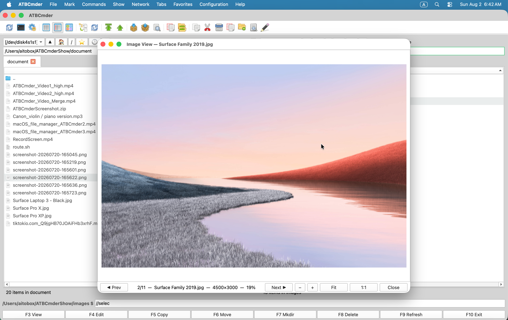

# Kapitel 4: Universeller Betrachter & Editoren

Bei der herkömmlichen Dual-Panel-Dateiverwaltung hängt die Geschwindigkeit stark von der Inspektionsgeschwindigkeit ab. Das Starten schwerer integrierter Entwicklungsumgebungen (IDEs) oder aufgeblähter Desktop-Anwendungen, nur um eine Prüfsumme zu überprüfen, eine Konfigurationszeile zu überprüfen, einen Screenshot zuzuschneiden oder eine PDF-Datei zu prüfen, führt zu kognitiven Reibungen und Fensterunordnung. 

ATBCmder löst dieses Problem, indem es ein einheitliches, mehrmotoriges Anzeige- und Bearbeitungssubsystem bereitstellt, das direkt in den Anwendungskern integriert ist. Ganz gleich, ob Sie eine Echtzeit-Inline-Vorschau beim Navigieren durch Ordner, eine detaillierte forensische Analyse auf Byte-Ebene im Hex-Modus, einen Audioplayer, der beim Organisieren von Dateien im Hintergrund weiterspielt, oder einen atomaren, syntaxbewussten Code-Editor benötigen, ATBCmder bietet Ihnen sofortige Tastatursteuerung. 

---

## 1. Visueller Schnellstart: Sofortige Dateiprüfung und -bearbeitung

ATBCmder unterteilt die Dateiprüfung und -änderung in zwei unterschiedliche Paradigmen: 

1. **Schnellansicht des gegenüberliegenden Panels (`Cmd+Q` / `Ctrl+Q`)**: Bettet eine entprellte Live-Vorschau direkt in das inaktive Panel ein, ohne dass separate Fenster erzeugt werden. 
2. **Dedizierter universeller Lister (`F3`) und interner Editor (`F4`)**: Öffnet unabhängige, nicht modale Fenster, die spezielle Format-Engines, Volltextsuche, Medienwiedergabe und Syntaxhervorhebung unterstützen. 

```
┌────────────────────────────────────────────────────────────────────────────────────────┐
│  AKTIVES PANEL (Dateinavigation)                    INAKTIVES PANEL (Quick View)       │
│  /Users/brain/Projects/atbcmder/src                 [Schnellvorschau: main.py]         │
├──────────────────────────────────────────────┬───┬─────────────────────────────────────┤
│  Name                         Größe  Datum   │   │ 0001: """                           │
│  ▸ [..]                              --:--   │ Q │ 0002: Programmeinstiegspunkt        │
│  ✔ main.py                    8.4 KB 15:10   │ U │ 0003: """                           │
│  ● config.xml                12.1 KB 14:20   │ I │ 0004: import sys                    │
│  ● hero_banner.png          248.5 KB 09:12   │ C │ 0005: from PySide6.QtWidgets import │
│  ● sample_invoice.pdf       512.0 KB 11:30   │ K │ 0006:     QApplication              │
│  ● release_theme.mp3          4.2 MB 16:45   │   │                                     │
│  ● firmware_dump.bin          1.0 MB 10:00   │ V │ [UTF-8] [Python] [LF] [Zeile 1/140] │
├──────────────────────────────────────────────┴───┴─────────────────────────────────────┤
│   [Cmd+Q / Ctrl+Q] Quick View umschalten   [F3] Lister öffnen   [F4] Editor starten    │
└────────────────────────────────────────────────────────────────────────────────────────┘
```

### Spickzettel für Dual-Matrix-Inspektion und -Bearbeitung

| Aktion | macOS-Verknüpfung | Klassische Commander-Taste | Befehls-ID | Beschreibung | 
| :--- | :--- | :--- | :--- | :--- | 
| **Schnellansicht umschalten** | `Cmd+Q` / `⌘Q` | `Ctrl+Q` | `cm_QuickView` | Öffnet die Live-Vorschau im gegenüberliegenden Bereich. | 
| **Universal Lister** | `F3` / `Fn+F3` | `F3` | `cm_View` | Öffnet das ausgewählte Element im Universal Lister. | 
| **Interner Redakteur** | `F4` / `Fn+F4` | `F4` | `cm_Edit` | Öffnet den Code-Editor für Text oder den Bild-Editor für Grafiken. | 
| **Neue Datei erstellen und bearbeiten** | `Shift+F4` / `⇧F4` | `Shift+F4` | `cm_EditNew` | Fordert zur Eingabe des Namens auf und öffnet den Editor. | 
| **Panel-Fokus wechseln** | `Tab` / `⇥` | `Tab` | `cm_SwitchPanel` | Wechselt den Fokus; dreht die Schnellansicht symmetrisch um. | 
| **Hex-Ansichtsmodus** | `2` | `2` | — *(Lister)* | Schaltet die Hexadezimalprüfung auf Byte-Ebene in Lister um. | 
| **Textansichtsmodus** | `1` | `1` | — *(Lister)* | Bringt Lister in den formatierten Nur-Text-Modus zurück. | 
| **Zeilenumbruch umschalten** | `Alt+W` / `⌥W` | `Alt+W` | — *(Lister/Herausgeber)* | Schaltet den weichen Zeilenumbruch im Lister und Editor um. | 
| **Zeilennummern umschalten**| `Alt+L` / `⌥L` | `Alt+L` | — | Schaltet die Nummern der linken Bundstegzeile um. | 
| **Live-Log-Tail-Modus** | `F5` / `Fn+F5` | `F5` | — | Streamt neu angehängte Protokolleinträge in Echtzeit. | 
| **Hintergrundaudio** | `Background` Schaltfläche | — | — | Dockt die Audiowiedergabe an die Panel-Statusleiste an. | 
| **Zuordnungen konfigurieren**| Konfigurationsmenü | — | `cm_FileAssoc` | Konfiguriert Dateierweiterungen und Hilfstools. | 

---

## 2. Schnellansichtsbereich (`Cmd+Q` / `Ctrl+Q` / `cm_QuickView`)

Das **Quick View Panel** ist einer der leistungsstärksten Workflows in herkömmlichen Dateimanagern. Anstatt schwebende Fenster zu öffnen und zu schließen, während Sie einen Ordner mit Hunderten von Elementen untersuchen, verwandelt die Schnellansicht das inaktive Bedienfeld in ein eingebettetes, kontextbezogenes Ansichtsfenster. 

 
*Abbildung 4.1: Im gegenüberliegenden Bereich eingebettete Schnellansicht mit Live-Syntax-hervorgehobenem Code neben der Verzeichnisnavigation.*

### 2.1 Der Vorteil der Dual-Panel-Vorschau

So aktivieren Sie die Schnellansicht: 

1. Navigieren Sie zu einer beliebigen Datei oder einem beliebigen Verzeichnis im aktiven Bereich. 
2. Drücken Sie **`Cmd+Q`** (`⌘Q`) unter macOS oder **`Ctrl+Q`** (`cm_QuickView`). 
3. Das gegenüberliegende Panel wechselt sofort von seiner normalen Verzeichnisliste zum **Quick View Container** (`QuickViewContainer`) und zeigt den Inhalt des Elements unter Ihrem Cursor an. 
4. Durch erneutes Drücken von `Cmd+Q` oder `Ctrl+Q` wird die Vorschau geschlossen und die vorherige Registerkarten- und Ordnerliste des gegenüberliegenden Bedienfelds wiederhergestellt, ohne dass Ihr Platz verloren geht.

### 2.2 100 ms entprellte Echtzeitaktualisierung

Wenn Sie die Pfeiltasten `Up` oder `Down` gedrückt halten, um schnell durch einen Ordner mit Tausenden von Dateien zu scrollen, friert die Standard-Dateivorschau häufig die Benutzeroberfläche ein oder löst eine intensive Festplattenüberlastung aus. 

ATBCmder löst dieses Problem durch einen internen **100-Millisekunden-Single-Shot-Debounce-Timer** (`_quick_view_timer`): 

- Wenn Sie schnell durch Zeilen navigieren, wird der aktive Dateipfad im Speicher abgelegt. 
- Das umfangreiche Laden von Dateien, das Parsen der Syntax und das Rendern von Miniaturansichten werden erst ausgelöst, wenn Ihr Cursor mindestens 100 ms lang auf einem Element verweilt. 
- Das Scrollen bleibt mit mehr als 60 Bildern pro Sekunde perfekt flüssig, selbst beim Durchsuchen von Multi-Gigabyte-Medienverzeichnissen oder Raw-Disk-Dumps.

### 2.3 Symmetrischer Fokuswechsel bei `Tab`

Ein häufiges Problem bei Dual-Panel-Managern ist der Verlust der Vorschau beim Wechseln der Panels. In ATBCmder bietet die Schnellansicht **Symmetrisches Fokus-Umdrehen**: 

- Wenn die Schnellansicht im rechten Bereich aktiv ist und Sie **`Tab`** drücken, um den aktiven Fokus auf den rechten Bereich zu schalten: 
1. Das rechte Bedienfeld stellt sofort seine normale Dateitabelle wieder her, sodass Sie mit Dateien interagieren können. 
2. Die Schnellansicht wechselt automatisch und nahtlos zum linken Bereich und zeigt eine Live-Vorschau der im rechten Bereich hervorgehobenen Datei an. 
- Dadurch bleibt eine ununterbrochene Navigations- und Inspektionsschleife erhalten, unabhängig davon, in welchem ​​Panel Sie arbeiten.

### 2.4 Intelligentes Content-Routing

Der Quick View Container erkennt Dateierweiterungen, MIME-Signaturen und Rohbyte-Header dynamisch, um die optimale Vorschau-Engine auszuwählen: 

| Inhaltstyp | Erweiterungen / Signaturen | Eingebettete Vorschau-Engine | 
| :--- | :--- | :--- | 
| **Quellcode & Text** | `.py`, `.rs`, `.cpp`, `.c`, `.h`, `.js`, `.ts`, `.html`, `.css`, `.json`, `.xml`, `.yaml`, `.md`, Klartext-Heuristiken | `TextPanel` mit Pygments-Syntaxhervorhebung und Zeilennummern. | 
| **Raster- und Vektorbilder**| `.png`, `.jpg`, `.jpeg`, `.webp`, `.svg`, `.bmp`, `.gif`, `.ico`, `.tiff` | `ImagePanel` mit sanftem Downsampling und Beibehaltung des Seitenverhältnisses. | 
| **PDF-Dokumente** | `.pdf` | `PdfPanel` mit nativer `PySide6.QtPdf` Seitenwiedergabe (An Breite anpassen). | 
| **Audio- und Videomedien** | `.mp3`, `.wav`, `.flac`, `.aac`, `.m4a`, `.ogg`, `.mp4`, `.mkv`, `.mov`, `.avi`, `.webm` | `MediaPanel` mit stummgeschalteter Audiovorschau und Wiedergabesteuerung. | 
| **Tabellarische Daten** | `.csv`, `.tsv`, `.xlsx`, `.xls`, `.ods` | `SpreadsheetPanel` mit schreibgeschütztem Tabellenraster und automatischer Spaltengröße. | 
| **Dokumente & E-Books** | `.docx`, `.odt`, `.rtf`, `.epub` | `DocumentPanel` / `EpubPanel` Rich-Text-Dokument-Renderer. | 
| **Datenbankdateien** | `.sqlite`, `.sqlite3`, `.db` | `SqlitePanel` mit Schema-Browser und Tabellendaten-Viewer. | 
| **Archive** | `.zip`, `.tar`, `.gz`, `.bz2`, `.xz`, `.7z` | `ArchiveInspectorPanel` zeigt unkomprimierte Elementhierarchien an. |

### 2.5 Metadaten-Property-Fallback (`QuickViewPropertiesWidget`)

Wenn Sie ein Verzeichnis oder ein Dateiformat markieren, das nicht als Text oder Medium gerendert werden kann, wechselt ATBCmder automatisch zur **Eigenschaften-Fallback-Ansicht** (`QuickViewPropertiesWidget`): 

```
┌────────────────────────────────────────────────────────┐
│  📁 release_builds                                     │
│  /Volumes/ExternalSSD/Projects/release_builds          │
├────────────────────────────────────────────────────────┤
│  Metadata                                              │
│    Full Path:      /Volumes/ExternalSSD/...            │
│    Size:           Directory (or 148,290,112 bytes)    │
│    Last Modified:  2026-09-06 14:10:22                 │
│    Last Accessed:  2026-09-06 15:02:18                 │
├────────────────────────────────────────────────────────┤
│  Permissions (UNIX)                                    │
│    Octal Mode: 0755                                    │
│    Owner:  [✔] Read  [✔] Write  [✔] Execute            │
│    Group:  [✔] Read  [ ] Write  [✔] Execute            │
│    Others: [✔] Read  [ ] Write  [✔] Execute            │
├────────────────────────────────────────────────────────┤
│  Checksums / Stats                                     │
│    Contents: 42 files, 8 folders                       │
│    MD5:      Calculating... ➔ 8f14e45fceea167a...      │
│    SHA256:   Calculating... ➔ 3a491d90bc1f4201...      │
└────────────────────────────────────────────────────────┘
```
 

- **Kopfzeile**: Zeigt das hochauflösende Systemsymbol, den Dateinamen und den übergeordneten Pfad an. 
- **Dateimetadaten**: Zeigt die genaue Bytegröße, die für Menschen lesbare Größe (`KB`, `MB`, `GB`, `TB`), den Änderungszeitstempel (`mtime`) und den Zugriffszeitstempel an (`atime`). 
- **UNIX-Berechtigungsmatrix**: Zeigt den 4-stelligen oktalen Berechtigungsmodus (z. B. `0755`, `0644`) zusammen mit einer schreibgeschützten 3x3-Kontrollkästchenmatrix für Besitzer, Gruppe und andere (`rwx`) an. 
- **Asynchrone Hintergrund-Hashes**: Für Dateien berechnet ein asynchroner Hintergrund-Thread (`HashWorker`) kryptografische MD5- und SHA-256-Hashes, ohne die Schnittstelle zu blockieren. Bei Verzeichnissen wird die Gesamtzahl der verschachtelten Dateien und Unterordner gescannt und gemeldet. 

---

## 3. Universeller Lister (`F3` / `Fn+F3` / `cm_View`)

Während die Schnellansicht für schnelle Vorschauen im Dual-Panel-Fenster optimiert ist, öffnet der **Universal Lister** (`F3` / `Fn+F3` / `cm_View`) ein dediziertes, nicht modales Fenster der obersten Ebene (`UniversalViewerDialog`). Es können mehrere Universal Lister-Fenster gleichzeitig geöffnet sein, sodass Sie Dokumente nebeneinander vergleichen oder Protokolle auf sekundären Displays streamen können.

### Obere Schnellaktionssymbolleiste

Der Lister verfügt über eine integrierte Schnellaktionssymbolleiste, die schnellen Zugriff auf Ansichtsmodi, Navigation und Anzeigeeinstellungen ermöglicht: 

```
[Text (1)] [Hex (2)] [Wrap (Alt+W)] [Line Numbers (Alt+L)] [Tail (F5)] | [◀ Prev (P)] [Next ▶ (N)] | [🔍 Search (Ctrl+F)] [Go to Line (Ctrl+G)] | [Open in System (Ctrl+O)] [Fullscreen (F11)]
```
 

- **Textmodus (`1`) / Hex-Modus (`2`)**: Wechseln Sie sofort zwischen der Anzeige dekodierter Zeichen und der Rohbyte-Prüfung. 
- **Zeilenumbruch (`Alt+W` / `⌥W`)**: Schaltet den weichen Zeilenumbruch für lange Zeilen um. 
- **Zeilennummern (`Alt+L` / `⌥L`)**: Schaltet die Zeilennummerierung im Zwischenraum um. 
- **Tail Mode (`F5`)**: Scrollt automatisch und erfasst neu geschriebene Protokolldaten in Echtzeit. 
- **Vorherige Datei (`P`) / Nächste Datei (`N`)**: Navigiert zur benachbarten Datei in der Dateitabelle des übergeordneten Ordners, ohne das Viewer-Fenster zu schließen. 
- **Suchen (`Ctrl+F` / `Cmd+F`)**: Öffnet die angedockte untere Suchleiste. 
- **Gehe zu Zeile (`Ctrl+G` / `Cmd+G`)**: Fordert zur Eingabe einer Zeilennummer auf, um direkt zum Zielcode zu springen. 
- **Im System öffnen (`Ctrl+O` / `Cmd+O`)**: Übergibt die Datei an die Standardanwendung des macOS-Systems (z. B. Preview, Safari oder Xcode). 
- **Vollbild (`F11` / `Alt+Enter`)**: Maximiert das Lister-Fenster, um die Anzeige auszufüllen. 

---

### 3.1 Bereich 1: Dokumente und strukturierte Bücher

ATBCmder bettet spezielle Layout-Engines für strukturierte Dokumente, Foliensätze, elektronische Bücher und formatierten Text ein, sodass Sie nicht mehr auf den Start externer Office-Suiten warten müssen.

#### 3.1.1 Word- und Rich-Text-Dokumente (`DocumentPanel`)

Wenn Sie `F3` in Microsoft Word-Dateien (`.docx`, `.doc`), Rich Text-Dateien (`.rtf`) oder OpenDocument-Dateien (`.odt`) drücken, aktiviert ATBCmder `DocumentPanel`: 

- **Dokumentseitenkarten**: Rendert strukturierte Seiten auf zentrierten Papierkarten (`.doc-page`) mit gestochen scharfer Typografie und Rändern, die zu modernen Textverarbeitungslayouts passen. 
- **Beibehaltung der Formatierung**: Behält Absatzhierarchien, Fett-/Kursiv-/Unterstreichungsstile, Schriftfarbvariationen, ungeordnete und nummerierte Listen sowie Inline-Hyperlinks bei. 
- **Complex Table & Embedded Image Rendering**: Analysiert komplexe mehrspaltige Tabellenraster mit umrandeten Zellenabständen und rendert eingebettete Inline-Rasterillustrationen. 
- **Seitenzoom und Suche**: Detaillierte Steuerelemente für den Seitenzoom (`Ctrl++` / `Ctrl+-` oder Zoom-Drehfeld) und integrierte Suchleiste im Dokument (`ViewerSearchBar`).

#### 3.1.2 Präsentationsfolien (`PresentationPanel`)

Für Microsoft PowerPoint-Präsentationen (`.pptx`, `.ppt`) startet ATBCmder `PresentationPanel`: 

- **Folienkartenleser**: Jede Folie wird extrahiert und als separate, schattierte Präsentationskarte (`.slide-card`) formatiert, sodass Sie den Inhalt nacheinander überprüfen können. 
- **Folienauswahlleiste**: Eine visuelle Navigationsleiste listet alle Folien mit Miniaturbildindizes auf, sodass Sie sofort zu jeder Folie in einem 100-Folien-Deck springen können. 
- **Foliensuche**: Drücken Sie `Cmd+F`, um Folientitel, Aufzählungspunkte, Sprechernotizen und Beschriftungstextblöcke im gesamten Deck zu durchsuchen.

#### 3.1.3 PDF-Dokument-Viewer (`PdfPanel`)

ATBCmder basiert nativ auf `PySide6.QtPdf` und `QPdfView` und integriert einen PDF-Reader der Enterprise-Klasse: 

 
*Abbildung 4.2: Integrierter PDF-Viewer mit Lesezeichengliederung, Seitenminiaturansichtsleiste, Suche im Dokument und Lesethemen.* 

- **Kontinuierliches mehrseitiges Scrollen**: Scrollen Sie nahtlos über Hunderte von Seiten im mehrseitigen Modus (`QPdfView.PageMode.MultiPage`) oder wechseln Sie zur einseitigen und zweiseitigen Buchansicht. 
- **Dokumentseitenleiste**: 
- *Gliederung / Lesezeichenbaum*: Klicken Sie auf eine beliebige Kapitel- oder Abschnittsüberschrift im PDF-Inhaltsverzeichnis (`QPdfBookmarkModel`), um direkt zu diesem Abschnitt zu springen. 
- *Page Thumbnails Strip*: Scannen Sie Layout und Grafikelemente visuell über die vertikale Miniaturansichtsliste (`PdfThumbnailList`). 
- **Suche und Hervorhebung im Dokument**: Drücken Sie `Cmd+F`, um Text im gesamten Dokument zu durchsuchen. Übereinstimmungen werden auf dem Bildschirm mit einer Echtzeitindizierung des Vorkommens hervorgehoben (`Match 3 of 28`). Springen Sie zwischen Vorkommen mit `Enter` oder `Shift+Enter`. 
- **Lesethemen**: 
- *Normal*: Standard-Dokumentenpapierwiedergabe. 
- *Invertierter Nachtmodus*: Invertiert die RGB-Pixelluminanz (`InvertColorEffect`) für komfortables Lesen in dunklen Umgebungen ohne Augenbelastung. 
- *Sepia Warmth*: Sanfter, warmer Ton, der die Emission von blauem Licht bei längerer Dokumentenüberprüfung reduziert. 
- **Sicherheit und Verschlüsselung**: Fordert über `PdfPasswordDialog` nahtlos zur Eingabe von Passwörtern für verschlüsselte PDF-Dateien auf und überprüft die Metadaten des Erstellers/Produzenten über `PdfPropertiesDialog`.

#### 3.1.4 EPUB-eBooks (`EpubPanel`)

Die Verwaltung technischer Dokumentationen, Handbücher oder digitaler Bücher im EPUB-Format (`.epub`) ist eine native Funktion von ATBCmder: 

- **Dual-Engine-Architektur**: Verwendet einen High-Fidelity-WebEngine-Renderer (`QWebEngineView` mit `EpubUrlSchemeHandler` für reichhaltiges CSS-Design und SVG-Vektorillustrationen) mit einem automatischen Fallback auf `QTextBrowser` in minimalen Umgebungen. 
- **Seitenleiste des Inhaltsverzeichnisses**: Zeigt verschachtelte Kapitelbäume an (`QTreeView`), sodass Sie mit einem Klick zwischen Buchkapiteln und Anhängen wechseln können. 
- **Typografie und Schriftskalierung**: Skalieren Sie die Größe des Lesetextes dynamisch über den Schriftarten-Schieberegler in der unteren Symbolleiste. 
- **Lesekomfort-Themen**: Sofortiges Umschalten zwischen den Farbpaletten Hell, Dunkel und Sepia.

#### 3.1.5 Markdown-Dokumente (`MarkdownPanel`)

Für README-Dateien, technische Hinweise und Entwicklerdokumentation (`.md`, `.markdown`): 

- **GitHub-Flavored Markdown (GFM)**: Rendert Header, Blockzitate, horizontale Regeln, Aufgabenlisten (`- [x]`) und mehrspaltige Tabellen. 
- **Codeblock-Syntax-Styling**: Formatiert automatisch abgegrenzte Codeblöcke (```python, ```bash, ```json) mit deutlicher Hintergrundschattierung, monospaced Typografie und Syntaxfarbe. 

---

### 3.2 Domäne 2: Daten, Tabellen und Entwicklerlaufzeiten

Für technische Benutzer, Datenanalysten und Softwareentwickler bietet ATBCmder sofortige Offline-Dateninspektionstools, die den Overhead externer Datenbank-Clients oder Tabellenkalkulationsanwendungen eliminieren.

#### 3.2.1 Hochleistungstabellen (`SpreadsheetPanel`)

Das Öffnen großer CSV-Dateien oder Excel-Arbeitsmappen mit mehreren Blättern in umfangreichen Office-Suiten kann 10–20 Sekunden dauern. `SpreadsheetPanel` von ATBCmder rendert sie sofort: 

 
*Hochleistungsfähige Excel-Tabellenvorschau in Universal Lister mit Registerkarten für mehrere Blätter und eingefrorenen Koordinaten* 

- **Formatunterstützung**: Microsoft Excel (`.xlsx`, `.xls`), durch Kommas getrennte Werte (`.csv`) und durch Tabulatoren getrennte Werte (`.tsv`). 
- **Registerkarten für mehrere Blätter**: Arbeitsmappen mit mehreren Blättern verfügen über eine untere Registerkartenleiste (`QTabBar`), die ein schnelles Wechseln zwischen Datenblättern ermöglicht. 
- **Virtuelles Tabellenmodell (`VirtualSpreadsheetModel`)**: Nutzt verzögertes inkrementelles Laden von Zeilen über `canFetchMore` und `fetchMore`. Sie können problemlos und mit minimalem Speicherbedarf durch CSVs oder Arbeitsblätter mit Hunderttausenden Zeilen scrollen. 
- **Eingefrorene Spalten- und Zeilenköpfe**: Standard-Tabellenkoordinaten (`A, B, C...` und `1, 2, 3...`) bleiben während des Scrollens zur klaren Orientierung fixiert. 
- **Zwischenablage-TSV-Export**: Wählen Sie einen beliebigen Zellbereich aus und drücken Sie **`Cmd+C`** (`⌘C`), um Daten zu kopieren, die als saubere tabulatorgetrennte Werte formatiert sind und zum Einfügen in Code, Slack oder Terminal-Pipes bereit sind. 
- **Schnellsuche**: Drücken Sie `Cmd+F`, um Zelleninhalte in allen Spalten mit Echtzeit-Zellenfokus zu durchsuchen.

#### 3.2.2 SQLite-Datenbankbrowser (`SqlitePanel`)

Überprüfen Sie SQLite-Datenbanken (`.sqlite`, `.sqlite3`, `.db`) direkt ohne externe GUI-Clients: 

- **Tabellen- und Ansichtsverzeichnis**: Die linke Seitenleiste listet alle Datenbanktabellen und -ansichten zusammen mit der Anzahl ihrer aktiven Zeilen auf. Wenn Sie auf eine Tabelle klicken, wird deren Inhalt sofort geladen. 
- **Virtualisierte Datenansicht**: Verwendet die leistungsstarke `VirtualSpreadsheetModel` für nahtloses Scrollen durch umfangreiche Tabellen. 
- **Interaktive SQL-Abfragekonsole**: Geben Sie benutzerdefinierte SQL-Abfragen in den oberen Abfrageeditor ein und drücken Sie zum Ausführen **`Ctrl+Return`** (oder `Cmd+Return`). Die Ergebnisse werden sofort in der Tabellenansicht angezeigt. 
- **Datentypformatierung**: Behandelt Daten sicher – formatiert Binärblobs als `<BLOB: N B>` und zeigt leere Felder als kursiv geschrieben `NULL` an. 
- **Daten exportieren**: Klicken Sie mit der rechten Maustaste, um ausgewählte Datensätze zu kopieren oder Abfrageergebnisse in CSV oder TSV zu exportieren.

#### 3.2.3 Jupyter-Notebooks (`NotebookPanel`)

Überprüfen Sie Data-Science-Experimente, Machine-Learning-Läufe und Python-Analyse-Notebooks (`.ipynb`): 

- **Zero-Server Native Rendering**: Analysiert JSON-Notebook-Strukturen vollständig offline, ohne dass ein aktiver Jupyter- oder JupyterLab-Server-Daemon erforderlich ist. 
- **Kartenbasiertes Zellenlayout**: 
- *Markdown-Zellen*: In klare Typografie mit Überschriften, fettem Text und Listen umgewandelt. 
- *Codezellen*: Formatiert mit syntaxhervorgehobenem Python-Code, Zeilennummern und Zellenausführungskennzeichen (z. B. `[1]`, `[14]`). 
- *Ausgabeblöcke*: Zeigt Konsolenausgabeströme, Fehler-Tracebacks und Inline-Base64-codierte Diagramme und Grafiken (PNG/SVG) an.

#### 3.2.4 Code- und Nur-Text-Anzeige (`TextPanel`)

Die primäre Textinspektions-Engine ist für schnelles Surfen und große Datenmengen optimiert: 

- **Chunked 64 KB Loader (`FileLoaderWorker`)**: Liest große Dateien in 64-KB-Blöcken mit automatischer Zeilenumbruch-Grenze und verhindert so das Einfrieren von Threads und die Beschädigung von UTF-8-Multibyte-Zeichen. 
- **Pygments Syntax Highlighting**: Über 150 Programmier- und Konfigurationssprachen werden mit dynamischer Anpassung des Hell-/Dunkelmodus unterstützt. 
- **Dynamic Encoding Switcher**: Statistische Zeichensatzerkennung (`chardet`) mit manueller Umschaltung der Statusleiste zwischen UTF-8, GB18030, Big5, Shift-JIS, Windows-1252 und ISO-8859-1. 
- **Live-Tail-Modus (`F5`)**: Aktivieren Sie `FileTailWatcher`, um angehängte Protokollzeilen in Echtzeit zu streamen, passend zu UNIX `tail -f`. Drücken Sie erneut `F5`, um zu pausieren.

#### 3.2.5 Rohe Hex-Byte-Inspektion (`2` / Hex-Modus)

Beim Untersuchen von Binärdateien, Firmware-Dumps, kompilierten Bibliotheken oder beschädigten Dateien: 

- **16-Byte-Hex-Raster**: Zeigt 8-stellige Hex-Offset-Adressen, 16 Hexadezimal-Bytes, aufgeteilt in zwei visuelle 8-Byte-Spalten, und druckbaren ASCII-Text auf der rechten Seite an (`.` für Steuerbytes). 
- **Auto-Hex-Erkennung**: Wenn innerhalb der ersten 1 KB einer Datei Nullbytes (`\x00`) erkannt werden, wechselt ATBCmder automatisch in den Hex-Modus, um Terminal-Verstümmelung zu verhindern. 

---

### 3.3 Bereich 3: Medien- und Systemressourcen

ATBCmder umfasst hardwarebeschleunigte Mediaplayer, Grafikbetrachter und Typografieinspektoren, die direkt in den Kern integriert sind.

#### 3.3.1 Bildbetrachter (`ImagePanel`)

Drücken Sie `F3` in einem beliebigen unterstützten Bildformat (`.png`, `.jpg`, `.webp`, `.svg`, `.gif`, `.bmp`, `.ico`, `.tiff`): 

 
*Abbildung 4.3: Integrierter Bildbetrachter mit interaktivem Canvas-Zoom, Drehung und EXIF-Metadatenextraktion.* 

- **Interaktive Leinwand**: Reibungsloses Zoomen mit dem Mausrad, das an der Cursorposition verankert ist (`SmoothPixmapTransform`), 1:1-Pixelprüfung, An Fenster anpassen und Schwenken per Handziehen. 
- **EXIF-Telemetrie-Inspektor**: Durch Klicken auf **EXIF-Info** werden Kamerametadaten extrahiert: Marke, Modell, Objektivbrennweite, Belichtungszeit, Blende, ISO und GPS-Koordinaten. 
- **Schachbrett-Transparenzszene (`CheckerboardScene`)**: Transparente Alphakanäle in PNG-, WebP- und SVG-Bildern werden über einem branchenüblichen grau-weißen Schachbrettraster gerendert.

#### 3.3.2 Audioplayer und Hintergrundwiedergabemodus (`AudioPlayerDialog`)

Spielen Sie Podcasts, Soundeffekte oder Musiksammlungen ab, während Sie arbeiten: 

 
*Abbildung 4.4: Integrierter Audio-Player mit ID3-Tag-Parsing, Albumcover und Drag-and-Drop-Playlist-Verwaltung.* 

- **Unterstützte Formate**: MP3, FLAC, WAV, AAC, M4A, OGG und AIFF mit Mutagen-ID3-Tag und Cover-Artwork-Extraktion. 
- **Hintergrundwiedergabemodus**: Klicken Sie im Player auf die Schaltfläche **Hintergrund**. Das Player-Fenster wird an einen kompakten **Mini-Player-Controller** in der Hintergrundbetriebsleiste des rechten Bedienfelds angedockt (`bg_ops_container`): 
- Zeigt Titel und Interpret des aktuell wiedergegebenen Titels an. 
- Interaktive Wiedergabeschaltflächen: Zurück (`⏮`), Wiedergabe/Pause (`▶` / `⏸`) und Weiter (`⏭`). 
- Musik wird ohne Unterbrechung abgespielt, während Sie Dateien durchsuchen, Stapelumbenennungen durchführen oder Ordner synchronisieren. 
- Durch Drücken von `F3` auf zusätzliche Audiodateien im Dateifenster werden diese automatisch an die laufende Wiedergabeliste angehängt! 

 
*Abbildung 4.5: Hintergrund-Miniplayer direkt in die Bedienfeld-Bedienleiste eingebettet.*

#### 3.3.3 Hardwarebeschleunigter Videoplayer (`MediaPanel`)

Für Videodateien (`.mp4`, `.mkv`, `.mov`, `.avi`, `.webm`): 

 
*Abbildung 4.6: Hardwarebeschleunigter Videoplayer mit schwebenden OSD-Steuerelementen (On-Screen Display).* 

- **Zero-Overhead-Dekodierung**: Unterstützt von `QtMultimedia` unter Verwendung von macOS VideoToolbox und Apple Silicon GPU-Beschleunigung. 
- **Auto-Fading-OSD-Steuerelemente**: Schwebender Timeline-Scrubber, Lautstärkeregler und Wiedergabesteuerungen werden während der Wiedergabe ausgeblendet. 
- **Untertitel- und Spurwechsel**: Wechseln Sie zwischen eingebetteten Audiostreams und externen Untertiteldateien (`.srt`, `.vtt`). 
- **Vollbildmodus**: Drücken Sie **`F11`** oder doppelklicken Sie, um den Vollbildmodus aufzurufen; Drücken Sie `Esc`, um zurückzukehren.

#### 3.3.4 Schriftart-Typografie-Inspektor (`FontPanel`)

Vorschau der System- und Designschriftarten (`.ttf`, `.otf`, `.woff`, `.woff2`, `.ttc`): 

- **Vorschau in Wasserfallgröße**: Rendert Vorschautext in Standard-Designpunktgrößen: 12, 16, 20, 24, 32, 48 und 64 pt. 
- **Benutzerdefinierte Testzeichenfolge**: Geben Sie benutzerdefinierte Zeichenfolgen ein, um das Kerning und die Interpunktion bestimmter Zeichen zu testen. 
- **Zweisprachige Pangrams**: In der Standardvorschau werden vollständige zweisprachige Pangrams angezeigt: * „Der schnelle Braunfuchs springt über den faulen Hund 1234567890 敏捷的棕狐跃过懒狗“*. 

---

### 3.4 Bereich 4: Systemarchive und Kommunikation

#### 3.4.1 In-Lister-Archivinspektor (`ArchivePanel`)

Beim Drücken von `Enter` werden Archive direkt im Dateifenster über Archive VFS geöffnet, beim Drücken von **`F3`** auf einem Archiv (`.zip`, `.tar`, `.7z`, `.tar.gz`, `.tar.bz2`, `.tar.xz`) öffnet den **Archive Inspector**: 

- Überprüfen Sie interne Verzeichnishierarchien, Mitgliederzahlen, unkomprimierte Bytegrößen, komprimierte Bytegrößen und Komprimierungsverhältnisse in einer schnellen, schreibgeschützten Baumansicht.

#### 3.4.2 E-Mail-Archiv-Viewer (`EmailPanel`)

Für gespeicherte E-Mail-Kommunikation und Nachrichtenarchive (`.eml`, `.msg`): 

- **RFC 2047 MIME-Header-Dekodierung**: Dekodiert internationale Absendernamen, Daten, CC-Empfänger und E-Mail-Betreffs genau. 
- **Visuelle Header-Karte**: Formatiert E-Mail-Header in eine saubere Metadatenkarte. 
- **Rich Body Toggle**: Wechseln Sie zwischen formatierten HTML-E-Mail-Texten und reinem Rohtext. 
- **Anhangsextrahierung**: Listet alle eingebetteten Anhänge mit Dateigrößen auf und bietet eine Schaltfläche **"Anhang speichern unter..."**, um Dateien direkt auf die Festplatte zu extrahieren. 

---

## 4. Interne Editoren: Dual-Mode-Architektur (`F4` / `Fn+F4` / `cm_Edit`)

ATBCmder verfügt über eine intelligente **Dual-Mode Editor Dispatch Engine**: 

- **Wenn sich der Cursor auf Text, Code oder Konfigurationsdateien befindet**: Durch Drücken von `F4` wird der **Interne Code-Editor** (`EditorWindow`) geöffnet. 
- **Wenn sich der Cursor auf Bilddateien befindet (`.png`, `.jpg`, `.webp`, `.bmp`, `.svg`)**: Durch Drücken von `F4` wird automatisch der **Spezielle Bildeditor** gestartet. (`ImageEditorDialog`)! 

Um eine völlig neue Datei im aktiven Ordner zu erstellen und zu bearbeiten, drücken Sie **`Shift+F4`** (`cm_EditNew`). ATBCmder fordert Sie zur Eingabe eines Dateinamens auf (z. B. `deploy.sh` oder `docker-compose.yml`), initialisiert die Datei und öffnet sie sofort im Editor. 

---

### 4.1 Interner Code-Editor (`EditorWindow`)

```
┌────────────────────────────────────────────────────────────────────────────────────────┐
│  Edit: /Users/brain/Projects/atbcmder/scripts/deploy.sh [*]                            │
├────────────────────────────────────────────────────────────────────────────────────────┤
│  [💾 Save] [Save As] | [↶ Undo] [↷ Redo] | [🔍 Find] [Replace] | [Wrap] [Lines] [Zoom]   │
├──────┬─────────────────────────────────────────────────────────────────────────────────┤
│ 0001 │ #!/usr/bin/env bash                                                             │
│ 0002 │ set -euo pipefail                                                               │
│ 0003 │                                                                                 │
│ 0004 │ echo "Deploying ATBCmder release bundle..."                                     │
│ 0005 │ TARGET_DIR="/opt/atbcmder"                                                      │
│ 0006 │ if [ ! -d "$TARGET_DIR" ]; then                                                 │
│ 0007 │     mkdir -p "$TARGET_DIR"                                                      │
│ 0008 │ fi                                                                              │
├──────┴─────────────────────────────────────────────────────────────────────────────────┤
│  Find: [deploy                  ]  Replace: [release                  ] [Match 1 of 3] │
│  [Aa] Match Case   [\b] Whole Word   [.*] RegEx   [Find Next] [Replace] [Replace All]  │
├────────────────────────────────────────────────────────────────────────────────────────┤
│  Line 5, Col 12 | 8 lines | UTF-8 | LF (UNIX) | Bash Shell | [Modified *]              │
└────────────────────────────────────────────────────────────────────────────────────────┘
```

#### Kernfunktionen des Code-Editors

- **Pygments-Syntaxhervorhebung**: Erkennt über 150 Programmier-, Skript- und Konfigurationsformate mit automatischer Spracherkennung anhand von Dateierweiterungen und Shebang-Zeilen. 
- **Dynamischer Zeilennummernsteg**: Der linke Rand wird dynamisch erweitert, um Zeilennummern mit visueller Ausrichtung aufzunehmen. 
- **Intelligente automatische Einrückung und Blockeinrückung**: Durch Drücken von `Enter` werden Einrückungs-Leerzeichen vorwärts übertragen; Wählen Sie Blöcke aus und drücken Sie `Tab` zum Einrücken oder `Shift+Tab` zum Aufheben der Einrückung. 
- **Weicher Zeilenumbruch (`Alt+W` / `⌥W`)**: Umbricht lange Zeilen an Fenstergrenzen, ohne harte Zeilenumbrüche einzufügen. 
- **Zoom-Steuerung**: Skalieren Sie die Typografie mühelos mit `Cmd++` (`⌘+`), `Cmd+-` (`⌘-`) oder setzen Sie sie mit `Cmd+0` (`⌘0`) zurück.

#### Interaktive Such- und Ersetzungsleiste (`EditorReplaceBar`)

Durch Drücken von **`Cmd+F`** (`⌘F`) oder **`Cmd+Option+F`** (`⌥⌘F`) wird die Leiste „Suchen und Ersetzen“ unten angedockt: 

- Inkrementelle Echtzeitsuche mit Vorkommensindizierung (`Match 4 of 19`). 
- Suchflags: Groß-/Kleinschreibung beachten (`[Aa]`), Ganzes Wort (`[\b]`) und reguläre Python-Ausdrücke (`[.*]`). 
- Batch-Aktionen: **Ersetzen** (aktuelles Vorkommen) und **Alle ersetzen** (gesamtes Dokument).

#### Statusleiste und Atomspeicherschutz

- **Telemetrie**: Zeigt Zeile, Spalte, Gesamtzeilenzahl, Codierung und Zeilenumbruchkonvention an (`LF` vs. `CRLF`). 
- **Dirty State Badge**: Ein auffälliger `*`-Indikator erscheint in der Titelleiste und Statusleiste, wenn nicht gespeicherte Änderungen vorhanden sind. 
- **Atomic Save Protection**: Wenn Sie `Cmd+S` drücken, schreibt ATBCmder Daten in eine temporäre Datei auf demselben Volume, synchronisiert Festplattenpuffer und führt eine atomare Ersetzung durch, um sicherzustellen, dass Ihre Originaldatei niemals beschädigt wird, wenn es während des Speicherns zu einem Absturz oder Stromausfall kommt. 

---

### 4.2 Dedizierter Bildeditor (`ImageEditorDialog`)

Wenn Sie in einer Grafik oder einem Screenshot auf **`F4`** drücken, öffnet ATBCmder den umfassenden **Bildeditor**:

#### Interaktive Leinwand und Transformationen

- **Schachbretthintergrund (`CheckerboardScene`)**: Transparente Grafiken werden über einem sauberen Grau-Weiß-Raster gerendert, um sicherzustellen, dass Alpha-Ränder deutlich sichtbar sind. 
- **Drehen und Spiegeln**: Um 90° im oder gegen den Uhrzeigersinn drehen, beliebige Nivellierwinkel feinabstimmen oder horizontal und vertikal spiegeln. 
- **Zoom & Schwenk**: Reibungsloses Zoomen mit Cursorverfolgung und Hand-Drag-Navigation.

#### Zuschneiden mit Seitenverhältnis-Voreinstellungen

- Ziehen Sie die Leinwandgriffe, um Beschnittgrenzen zu definieren. 
- Wechseln Sie zwischen den Seitenverhältnissen **Freeform**, **1:1 Square** (Avatare/App-Symbole), **4:3 Classic** und **16:9 Cinema**. Drücken Sie `Enter`, um sich zu bewerben.

#### Vektoranmerkungen

- **Rechtecke und Kreise**: Heben Sie Benutzeroberflächenelemente mit benutzerdefinierten Rahmenbreiten und Palettenfarben hervor. 
- **Richtungspfeile**: Zeichnen Sie scharfe Vektor-Beschriftungspfeile. 
- **Freihandstift**: Skizzieren Sie Freihandkorrekturen oder Signaturen direkt auf der Leinwand. 
- **Textstempel**: Fügen Sie Typografie mit anpassbaren Schriftarten, Größen, Farben und subtilen Schlagschatten hinzu.

#### Datenschutzschwärzung (Mosaik / Unschärfe)

Müssen Sie einen Screenshot mit vertraulichen Token, Kundennamen oder Telefonnummern teilen? 

- Wählen Sie das Werkzeug **Mosaik/Unschärfe**. 
- Ziehen Sie ein Auswahlfeld über die vertraulichen Informationen. 
- ATBCmder wendet Pixelierung mit variablem Radius oder Gaußsche Unschärfe an und schwärzt vertrauliche Daten sicher vor dem Export.

#### Wasserzeichenmodul

Wenden Sie professionelles Ownership-Branding mithilfe von 4 voreingestellten Platzierungen an: 

- **Gekachelt (`tiled`)**: Abgewinkeltes, sich wiederholendes Wasserzeichenmuster, das die gesamte Leinwand bedeckt (ideal für vertrauliche Entwürfe). 
- **Stempel (`stamp`)**: Eindeutiger Authentifizierungsstempel in der unteren rechten Ecke. 
- **Banner (`banner`)**: Horizontales, halbtransparentes Branding-Banner, das über die Leinwand läuft. 
- **Einzelnes Logo (`single`)**: Frei positionierbares einzelnes Logo oder Textwasserzeichen mit Deckkraft-Schieberegler. 

---

### 4.3 Nahtlose Round-Trip-VFS-Bearbeitung (Remote und Archive)

Der leistungsstärkste Aspekt des Editor-Subsystems von ATBCmder ist seine **universelle VFS-Integration**: 

- Egal, ob Sie `F4` in einem Shell-Skript drücken, das auf einem Remote-SFTP-Server gespeichert ist, eine Konfigurationsdatei in einem AWS Nextcloud WebDAV-Mount oder einen Screenshot in einem verschachtelten `.zip`-Archiv (`vfs://`): 
1. ATBCmder lädt die Datei asynchron in eine sichere temporäre Sandbox herunter. 
2. Die Datei wird entweder in `EditorWindow` oder `ImageEditorDialog` geöffnet. 
3. Wenn Sie `Cmd+S` drücken, fängt ATBCmder das Speicherereignis ab, synchronisiert die geänderte Datei und streamt die aktualisierten Daten automatisch über SFTP/SMB zurück oder aktiviert `RepackWorker`, um das Archiv neu zu packen! 
4. Beim Schließen des Editors werden die temporären Cache-Dateien sauber bereinigt. Sie müssen Dateien nie manuell entpacken, bearbeiten und erneut hochladen. 

---

## 5. ⚡ Profi-Tipps und ausführliche Informationen

Beherrschen Sie diese erweiterten Funktionen, um Ihre Inspektions- und Bearbeitungseffizienz zu maximieren.

### Profi-Tipp 1: Dynamische Audio-Warteschlangenaufnahme mit `F3`

Wenn der Audio-Player beim Durchsuchen Ihrer Musiksammlung im **Hintergrundwiedergabemodus** läuft, müssen Sie den Dialog nicht erneut öffnen, um weitere Musik in die Warteschlange zu stellen: 

1. Markieren Sie eine oder mehrere Audiodateien in einem der Dateifenster. 
2. Drücken Sie **`F3`** (oder `Fn+F3`). 
3. ATBCmder erkennt, dass eine Audio-Player-Instanz bereits aktiv ist und **hängt die ausgewählten Titel automatisch an die laufende Wiedergabeliste (`append_tracks`) an, ohne den aktuell abgespielten Titel zu unterbrechen.

### Profi-Tipp 2: Benutzerdefinierte Dateizuordnungen (`cm_FileAssoc`)

Standardmäßig wird durch Drücken von `F3` der Universal Lister und `F4` der interne Code-Editor geöffnet. Sie können jedoch mithilfe des **File Associations Manager** (`cm_FileAssoc`) bestimmte Dateierweiterungen externen Desktopanwendungen oder benutzerdefinierten Shell-Befehlen zuordnen: 

Navigieren Sie zu **Konfiguration ➔ Konfiguration von Dateizuordnungen**: 

– Sie können Erweiterungen (z. B. `*.rs`, `*.py`, `*.psd`) benutzerdefinierten Aktionen zuordnen. 

- **Interne Befehle**: An interne Kommandantenaktionen binden (z. B. `cm_View`, `cm_Edit`). 
- **Externe Shell-Befehle mit Token-Ersetzung**: 
- `%f` ➔ Ersetzt durch den absoluten Dateipfad (z. B. `/Users/brain/main.rs`). 
- `%d` ➔ Ersetzt durch den übergeordneten Verzeichnispfad (z. B. `/Users/brain`). 
- `%n` ➔ Ersetzt durch den Dateinamen ohne Erweiterung (z. B. `main`). 
- `%e` ➔ Ersetzt durch die Dateierweiterung ohne Punkt (z. B. `rs`). 

*Beispiel für eine externe Zuordnung für Rust-Dateien:* 
```bash
code --goto %f
```

### Profi-Tipp 3: Live-Tail-Modus (`F5`) für DevOps-Protokolle

Öffnen Sie beim Debuggen lokaler Server-Daemons, Docker-Container oder Build-Skripts die Protokolldatei in Universal Lister (`F3`) und drücken Sie **`F5`**: 

– Aktiviert den Daemon `FileTailWatcher`. 
– Lister scrollt automatisch nach unten und streamt neu angehängte Zeilen in Echtzeit auf den Bildschirm, was dem Verhalten von UNIX `tail -f` entspricht. 

- Sie können Suchfilter während des Tailings aktiv lassen, um auftretende Fehler hervorzuheben.

### Profi-Tipp 4: Beliebiges Offset-Streaming für Multi-Gigabyte-Dateien

Wenn Sie einen 20-GB-Datenbank-Dump oder ein Disk-Image untersuchen müssen, versuchen Sie nicht, es in einem Standardeditor zu öffnen. Im Universal Lister von ATBCmder: 

- Verwenden Sie **Gehe zu Zeile (`Ctrl+G`)** oder Sprungschieberegler. 
– Der zugrunde liegende `FileLoaderWorker` verwendet direkte binäre Dateizeigersuchen (`fh.seek(offset)`) und liest nur den genauen 64-KB-Block, der zum Rendern der Ansicht erforderlich ist. 

- Sie können beliebige Sektoren eines Multi-Terabyte-Volumes sofort und ohne Speicheraufwand prüfen. 

---

## 6. Praktische Schritt-für-Schritt-Rezepte

### Rezept 1: Überprüfen und Schwärzen eines sensiblen Screenshots

**Ziel**: Sie haben einen Screenshot aufgenommen, der vertrauliche API-Tokens oder Kundeninformationen enthält, und müssen ihn redigieren, bevor Sie ihn in einen öffentlichen Issue-Tracker hochladen. 

```
Step 1: Highlight screenshot.png in the active panel and press F3 (Universal Lister).
Step 2: On the top toolbar, click "Edit Image" to launch the Image Editor.
Step 3: Select the "Mosaic / Blur" tool from the tool palette.
Step 4: Click and drag a selection rectangle over the API token to pixelate the text.
Step 5: Select the "Crop" tool, frame the relevant portion of the window, and press Enter.
Step 6: Click "Save" (Cmd+S) to overwrite, or "Save As" to create screenshot_redacted.png.
Step 7: Press Esc to close the editor; your clean image is ready in the file panel.
```
 

---

### Rezept 2: Live-Protokollüberwachung und forensische Hex-Inspektion

**Ziel**: Ein Hintergrundprozess schlägt mit einem Codierungsfehler fehl. Sie müssen das Protokoll live beobachten und Rohbytes rund um eine fehlerhafte Sequenz untersuchen. 

```
Step 1: Highlight server.log in the active panel and press F3.
Step 2: Press F5 to activate Tail Mode. Watch incoming live log entries stream past.
Step 3: When the error appears, press F5 again to pause tailing.
Step 4: Press Ctrl+F and search for the error code (e.g. "0xEF").
Step 5: Press 2 on your keyboard to switch into Hex Mode.
Step 6: Inspect the exact 16-byte hexadecimal dump to examine unprintable control characters.
Step 7: Press 1 to return to formatted text mode, or Esc to close.
```
 

---

### Rezept 3: Schnelle Quellcode-Erstellung und Git-Staging

**Ziel**: Erstellen Sie ein neues Shell-Skript in Ihrem aktuellen Projekt-Repository, richten Sie Standard-Bash-Header ein und bereiten Sie es für die Ausführung vor, ohne ATBCmder zu verlassen. 

```
Step 1: In the active directory, press Shift+F4 (cm_EditNew).
Step 2: In the dialog prompt, type "build_release.sh" and press Enter.
Step 3: The Internal Code Editor opens immediately with an empty buffer.
Step 4: Type your script. Notice that auto-indent automatically indents loops and if-blocks:
        #!/usr/bin/env bash
        set -euo pipefail
        echo "Building binaries..."
Step 5: Press Cmd+S (⌘S) to save the file atomically to disk.
Step 6: Press Cmd+W (⌘W) to close the editor.
Step 7: With build_release.sh highlighted in the panel, press Alt+Enter (cm_SetFileProperties).
Step 8: Check the "Execute" permission for Owner (chmod +x) and press Enter.
```
 

---

## 7. Sicherheits- und Systemwarnungen

> [!WARNING] 
> **Externe Änderungsbeobachter** 
> Wenn eine geöffnete Datei von einer externen Anwendung geändert oder abgeschnitten wird, während Sie im internen Editor (`F4`) arbeiten, zeigt ATBCmder vor dem Speichern eine externe Änderungskonfliktwarnung an. Wählen Sie immer **Neu laden**, um die neueste Festplattenversion zu überprüfen, oder **Speichern unter**, um Ihre lokalen Änderungen in einer separaten Datei zu speichern. 

> [!IMPORTANT] 
> **Sicherheit von Binärdateien: Text- vs. Hex-Modus** 
> Das Öffnen einer unbekannten Binärdatei im Textmodus und das Zurückspeichern auf der Festplatte kann die Datei aufgrund von UTF-8-Dekodierungsersetzungen (`\ufffd`) dauerhaft beschädigen. Der Universal Lister von ATBCmder ist standardmäßig schreibgeschützt und stellt so sicher, dass Ihre Binärdateien bei der Inspektion nie versehentlich überschrieben werden. 

> [!CAUTION] 
> **Schnellansicht der Leistung bei Remote-Netzwerkfreigaben** 
> Beim Durchsuchen von Remote-Servern mit hoher Latenz (FTP, SFTP oder WebDAV) und aktivierter Schnellansicht (`Cmd+Q`) löst die Vorschau großer Remote-Video- oder Archivdateien ein Remote-Streaming aus. Wenn die Netzwerkbandbreite begrenzt ist, schalten Sie die Schnellansicht aus (`Cmd+Q`), um Verzeichnisbäume mit voller Geschwindigkeit zu durchsuchen. 

> [!TIP] 
> **Barrierefreiheit der macOS-Funktionstasten** 
> Auf modernen Apple MacBooks und Magic Keyboards sind Funktionstasten (`F1`-`F12`) standardmäßig Hardwaresteuerungen (Helligkeit, Medienwiedergabe) zugeordnet. Um `F3` oder `F4` auszulösen, halten Sie die Taste **`Fn`** gedrückt (z. B. `Fn+F3`, `Fn+F4`). Alternativ aktivieren Sie **„F1-, F2-usw.-Tasten als Standardfunktionstasten verwenden“** in macOS *Systemeinstellungen ➔ Tastatur ➔ Tastaturkürzel ➔ Funktionstasten*. 

---

## 8. Referenztabelle für Dual-Matrix-Tastaturen

| Funktionsbereich | Aktionsbeschreibung | macOS-Verknüpfung | Klassische Commander-Taste | Befehls-ID | 
| :--- | :--- | :--- | :--- | :--- | 
| **Schnellansicht** | Vorschau des gegenüberliegenden Panels umschalten | `Cmd+Q` / `⌘Q` | `Ctrl+Q` | `cm_QuickView` | 
| **Schnellansicht** | Bedienfeld wechseln und Vorschau umdrehen | `Tab` / `⇥` | `Tab` | `cm_SwitchPanel` | 
| **Lister** | Datei im Universal Lister öffnen | `F3` / `Fn+F3` | `F3` | `cm_View` | 
| **Lister** | Nur-Text-Ansichtsmodus | `1` | `1` | — *(Lister)* | 
| **Lister** | Roher Hexadezimal-Ansichtsmodus | `2` | `2` | — *(Lister)* | 
| **Lister** | Zeilenumbruch umschalten | `Alt+W` / `⌥W` | `Alt+W` | — *(Lister/Herausgeber)* | 
| **Lister** | Zeilennummern umschalten | `Alt+L` / `⌥L` | `Alt+L` | — *(Lister/Herausgeber)* | 
| **Lister** | Live-Log-Tail-Modus umschalten | `F5` / `Fn+F5` | `F5` | — *(Lister)* | 
| **Lister** | Vorherige Datei im Verzeichnis | `P` | `P` | — *(Lister)* | 
| **Lister** | Nächste Datei im Verzeichnis | `N` | `N` | — *(Lister)* | 
| **Lister** | Text suchen | `Cmd+F` / `⌘F` | `Ctrl+F` | — *(Lister/Herausgeber)* | 
| **Lister** | Gehen Sie zu Zeilennummer | `Cmd+G` / `⌘G` | `Ctrl+G` | — *(Lister/Herausgeber)* | 
| **Lister** | In System-Standard-App öffnen | `Cmd+O` / `⌘O` | `Ctrl+O` | — *(Lister)* | 
| **Lister** | Vollbild umschalten | `F11` / `Fn+F11` | `F11` | `cm_FullScreen` | 
| **Herausgeber** | Ausgewählte Datei bearbeiten (Code / Bild) | `F4` / `Fn+F4` | `F4` | `cm_Edit` | 
| **Herausgeber** | Neue Datei erstellen und bearbeiten | `Shift+F4` / `⇧F4` | `Shift+F4` | `cm_EditNew` | 
| **Herausgeber** | Datei speichern (atomar) | `Cmd+S` / `⌘S` | `Ctrl+S` | — | 
| **Herausgeber** | Datei speichern unter | `Shift+Cmd+S` / `⇧⌘S` | `F12` | — | 
| **Herausgeber** | Datei neu laden/zurücksetzen | `Cmd+R` / `⌘R` | `Ctrl+R` | — | 
| **Herausgeber** | Editorfenster schließen | `Cmd+W` / `⌘W` | `Esc` | — | 
| **Herausgeber** | Im Dokument suchen | `Cmd+F` / `⌘F` | `Ctrl+F` | — | 
| **Herausgeber** | Suchen und Ersetzen | `Cmd+Option+F` / `⌥⌘F` | `Ctrl+H` | — | 
| **Herausgeber** | Ausgewählten Block einrücken | `Tab` / `⇥` | `Tab` | — | 
| **Herausgeber** | Ausgewählten Block rückgängig machen | `Shift+Tab` / `⇧⇥` | `Shift+Tab` | — | 
| **Herausgeber** | Vergrößern/Verkleinern/Zurücksetzen | `⌘+` / `⌘-` / `⌘0` | `Ctrl++` / `Ctrl+-` / `Ctrl+0` | — | 
| **Medien** | Hintergrund-Audiowiedergabe | Klicken Sie auf `Background` | — | — | 
| **Medien** | Audio an Playlist anhängen | `F3` (beim Spielen) | `F3` | `cm_View` | 
| **Konfiguration** | Dateizuordnungsmanager | Konfigurationsmenü | — | `cm_FileAssoc` |

--- 

<div align="center"> 
<p>Bereit, komplexe Arbeitsabläufe und Stapelverarbeitung zu automatisieren?</p> 
<p><strong><a href="power_tools.md">Fahren Sie mit Kapitel 5 fort: Elektrowerkzeuge und Automatisierung &rarr;</a></strong></p> 
</div>