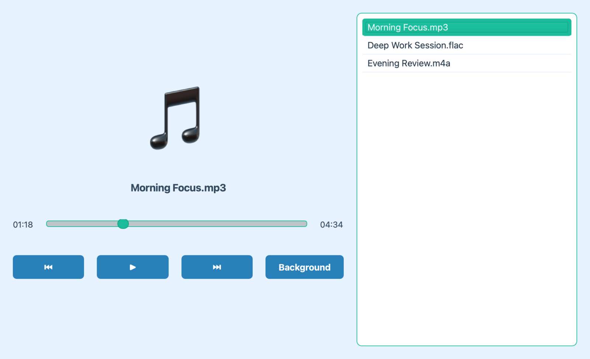
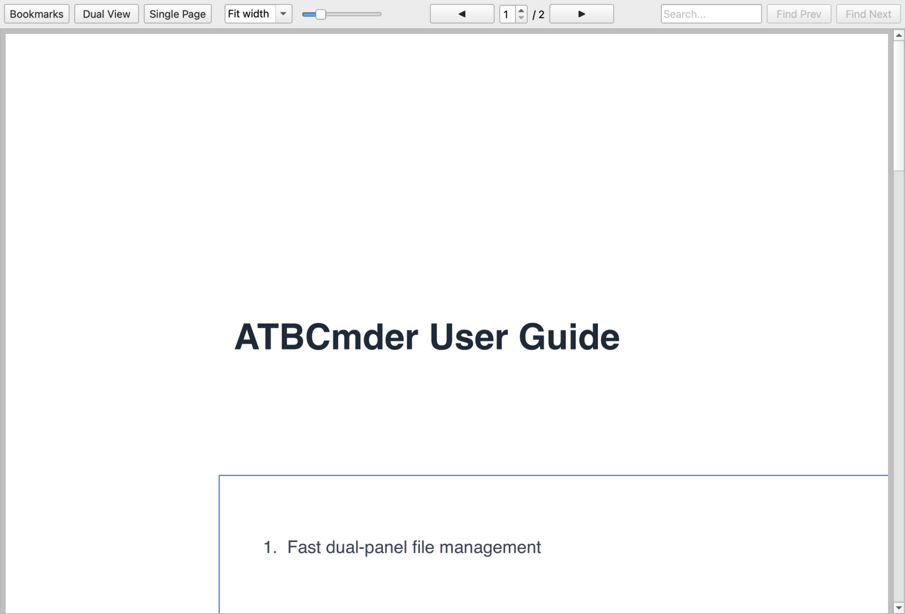

# File Management Guide

This section covers the advanced file visualization, previewing, and auto-refresh capabilities of ATBCmder.

## Previewing Media

When you select files in the panel and press `F3`, ATBCmder launches specialized viewers based on the file type.

### Audio Player

The dedicated Audio Player handles `.mp3`, `.wav`, `.flac`, `.ogg`, `.m4a`, and `.aac` files.
- **Playlist:** Automatically builds a playlist. If you select multiple files, they are queued up. If you select a single file, siblings in the same directory are automatically queued.
- **Background Playback:** You can click the "Background" button to minimize the player. A background indicator will appear in the right panel, allowing uninterrupted music playback while you continue working.
- **Append Mode:** Selecting more audio files and pressing `F3` while the player is in the background will seamlessly append them to the existing playlist.

### PDF Viewer

The PDF viewer provides a unified top toolbar to maximize your vertical reading space.
- **View Controls:** Toggle the left-hand Bookmarks panel and switch between Single Page and Multi-Page continuous scrolling modes.
- **Navigation & Zoom:** Use the toolbar to navigate pages, jump to a specific page, and adjust zoom (including Fit to Width).
- **Search:** A built-in search box allows you to find specific text within the document.
- **Seamless Scrolling:** When hovering over the bookmark panel, scrolling will intelligently forward to the document view for a cohesive reading experience.

## Thumbnails

When browsing images, ATBCmder automatically generates clear, high-quality thumbnails for a smooth and visually pleasing experience. This makes it easy to visually identify your photos and graphics without having to open them individually.

## Helpful Tooltips

ATBCmder features highly informative tooltips designed to help you quickly understand the interface. Whenever you are unsure about a button, menu, or input field, simply hover over it to reveal a comprehensive explanation.
- **Feature Description:** Explains what the element does.
- **Trigger / Shortcut:** Shows associated keyboard shortcuts (e.g., `Ctrl+D` for Hotlist).
- **Advanced Help:** Provides deep explanations of behavior, placeholders, or edge cases.

## Auto-Refresh

The file panels automatically update when changes occur on your disk, ensuring you always see the latest state. This behavior is highly configurable in the Options dialog under **Auto refresh**:
- **Triggers:** You can choose to refresh when files are created, deleted, or renamed, and/or when their size, date, or attributes change. (Attribute changes use an efficient polling mechanism with a customizable interval, default 5 seconds).
- **Conditions:** To save system resources, you can disable auto-refresh when ATBCmder is in the background. You can also define a list of excluded paths and subdirectories that should never trigger an auto-refresh.
