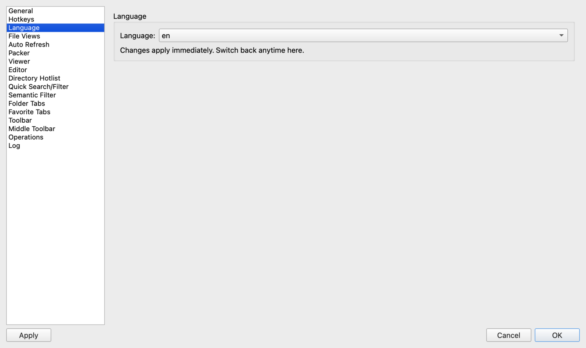

# Getting Started with ATBCmder

Welcome to ATBCmder! This guide will help you understand the fundamental concepts and basic configuration of the application, so you can start managing your files efficiently.

## The Dual Panel Philosophy

ATBCmder is built around the classic dual-panel interface. This philosophy allows you to view two directories side-by-side simultaneously. 

* **Active Panel:** The panel you are currently interacting with. Operations like copy or move will typically take items from the active panel and place them in the inactive (target) panel.
* **Navigation:** You can easily navigate your file system independently in each panel, making file management between different locations seamless and fast.

## Layout and Toolbars

ATBCmder offers a flexible layout, featuring toolbars designed to give you quick access to essential commands.

### Main Toolbar
The Main Toolbar is located at the top of the application, just below the menu bar. It provides quick access to common actions like Refresh, Copy, Edit, and Search. 
* **Visibility:** You can toggle the main toolbar's visibility from the "Show" menu by checking or unchecking "Show Toolbar". Your preference is saved automatically.

### Middle Toolbar
The Middle Toolbar is a vertical strip located directly between the left and right file panels. It serves as both a toolbar and an adjustable splitter.
* **Quick Actions:** It houses buttons for frequent file operations (Copy, Move, Delete, MkDir, etc.), executing them directly on the active panel without needing to use the menu or keyboard shortcuts.
* **Adjustable Splitter:** You can drag the middle toolbar left or right to change the width ratio of the two panels.
* **Customization:** By default, the middle toolbar is hidden. You can enable it by going to the Settings (Options) dialog and checking "Show Middle Toolbar" under the "Middle Toolbar" section. You can also customize icon sizes and whether to show text captions.

## Internationalization (Language Settings)

ATBCmder supports over 30 languages and is designed to integrate smoothly with your system's locale out of the box.

* **System Language Follow:** By default, ATBCmder automatically detects and follows your operating system's language settings. If your system language is fully supported (e.g., English, Simplified Chinese, German, French), the application will display in that language.
* **Manual Configuration:** If you prefer a different language or if your system language is not fully supported, you can manually select a language. Go to the Settings (Options) dialog, navigate to the "Language" page, and choose your preferred language from the dropdown menu.
* **Live Reload:** Language changes are applied immediately across the entire application without requiring a restart.

