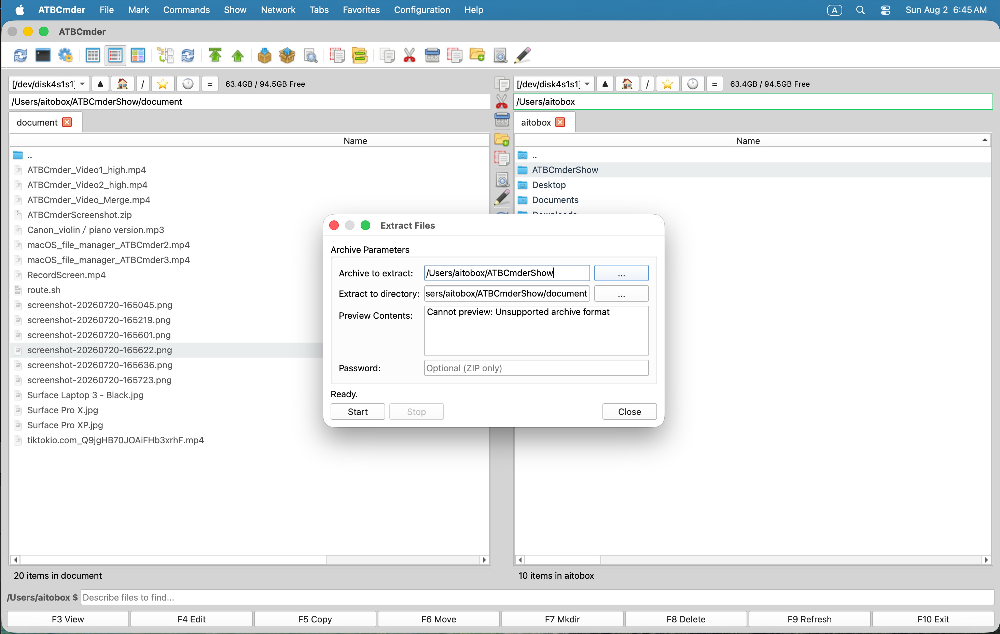
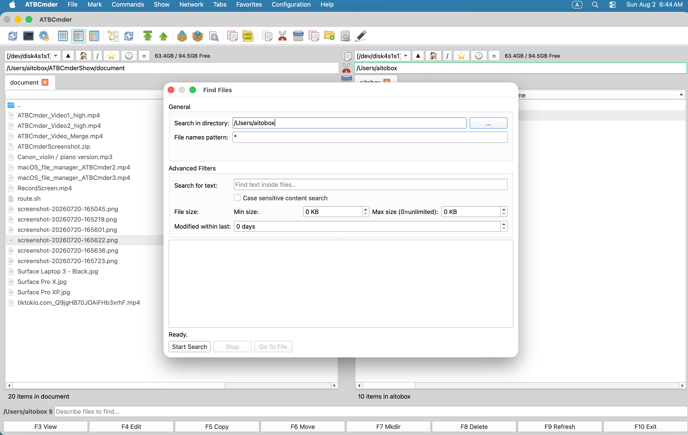
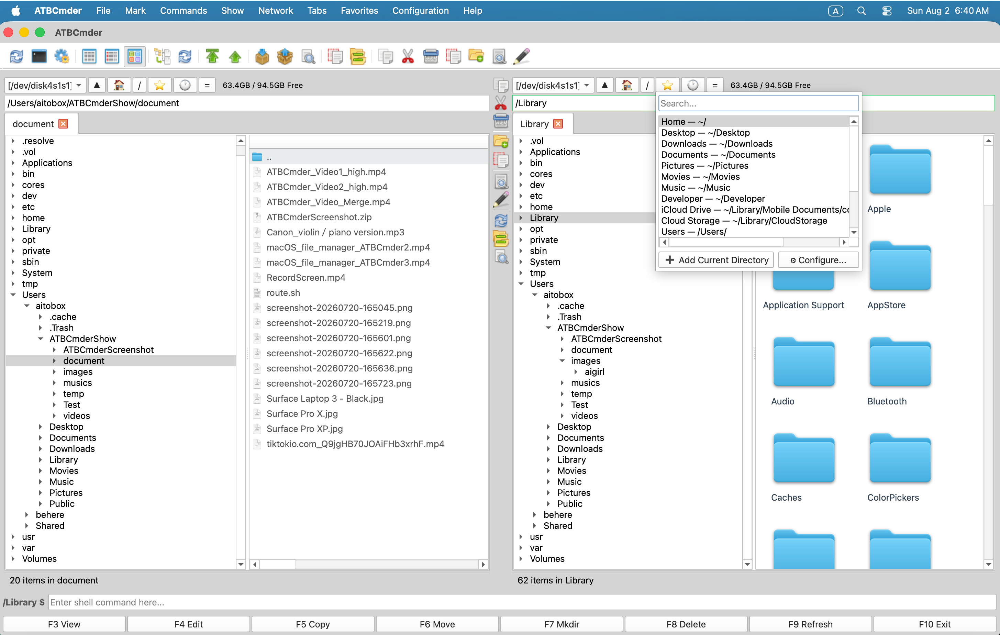
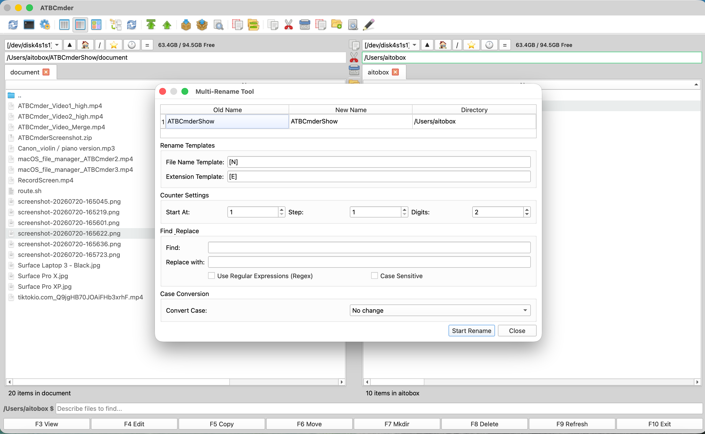
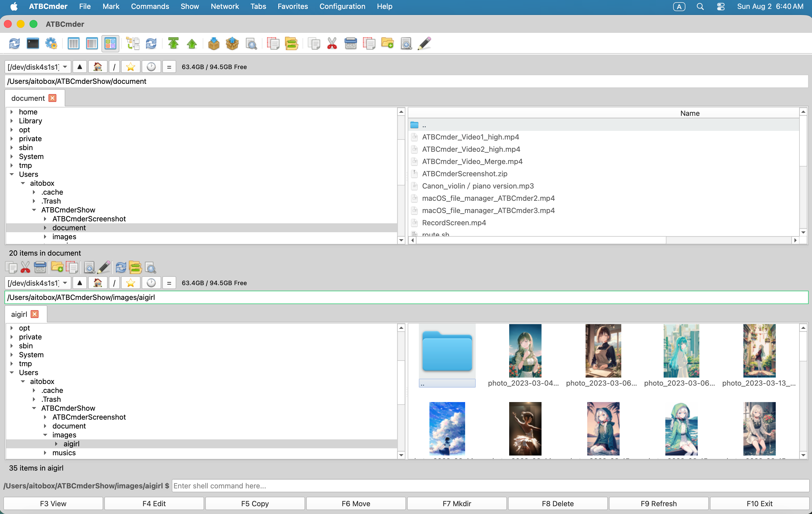
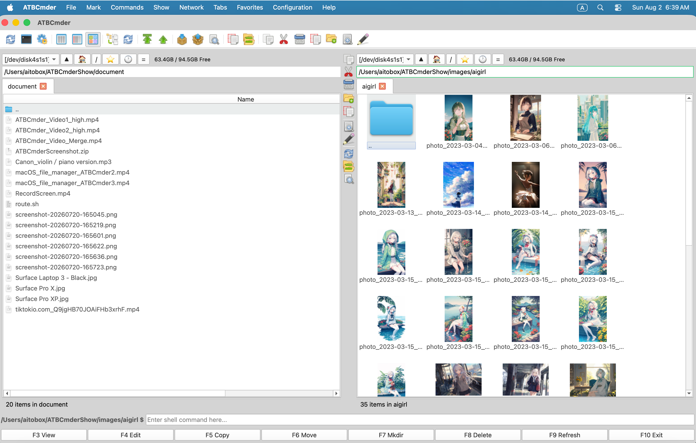
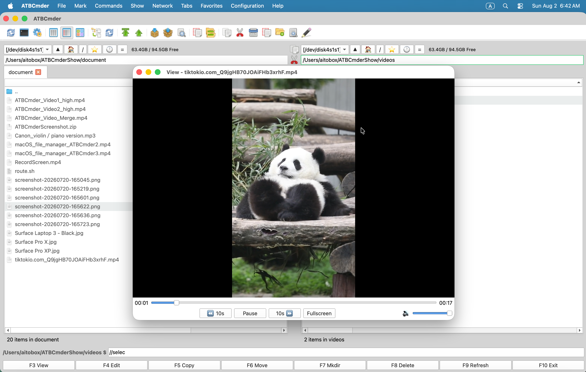

# Welcome to ATBCmder

> **The Dual-Panel File Manager for macOS**  
> Navigate, manage, and transform your files with the speed and power of a professional tool.

---

## Highlights & Key Features

* **🗂 Dual Panel Management** — View and manage two directories side-by-side simultaneously.

* **🌐 Network VFS** — Connect via FTP, SFTP, WebDAV & Samba so remote files feel like local ones.

* **📦 Archive VFS** — Browse and edit ZIP, TAR, 7z archives without extracting them.

* **✨ Semantic Command** — Natural language file search powered by macOS Spotlight integration.

* **🌿 Branch View** — Instantly display all nested sub-files in a single flat list view.

* **🌍 30+ Languages** — Automatically matches your macOS system language.

---

## Interface Showcase

  
*Natural language file search using Semantic Commands.*

  
*Branch View displaying nested sub-folder contents in one flat list.*

  
*Quick access to essential commands via the middle toolbar.*

  
*SMB, SFTP, FTP Remote Access*

  
*Compress and Extract Files*

  
*Image Viewer*

  
*Multi-function Search*

  
*Quick Access Path*

  
*Multi-Rename*

  
*Folder Synchronization*

  
*Horizontal Panel Display*

  
*Thumbnail Display*

  
*Video Player*

  
*Semantic Search*

  
*Music Player*

---

## Documentation Overview & Table of Contents

Welcome to the ATBCmder Help Booklet! Whether you are a beginner getting started or a power user exploring advanced workflows, select a topic below to jump directly into the documentation:

### 🚀 [Getting Started](getting_started.md)
Learn the core dual-panel philosophy, master the top & middle toolbars, and configure system language settings.

### 🧭 [Navigating Like a Pro](navigation.md)
Explore tree views, folder tabs, favorite tabs, directory hotlists, instant quick search, and essential keyboard shortcuts.

### 📁 [Working With Files](file_management.md)
Utilize built-in audio & PDF media previewers, inspect rich file tooltips and thumbnails, and benefit from real-time auto-refresh.

### ⚡ [Advanced Features](advanced_features.md)
Configure remote server connections (Network VFS), manage archives directly (Archive VFS), use Branch View, and leverage natural language semantic commands.

### ⌨️ [Keyboard Shortcuts](keyboard_shortcuts.md)
Complete default keyboard shortcuts reference for maximum file management efficiency.

### ❓ [How-To Guides & FAQ](faq_howtos.md)
Step-by-step solutions for common tasks (FTP setup, archive editing, audio playback) and frequently asked questions.

### 🔒 [Privacy Policy](privacy_policy.md)
Our commitment to complete user data privacy and zero data collection.

---

[Read Getting Started Guide &rarr;](getting_started.md)
