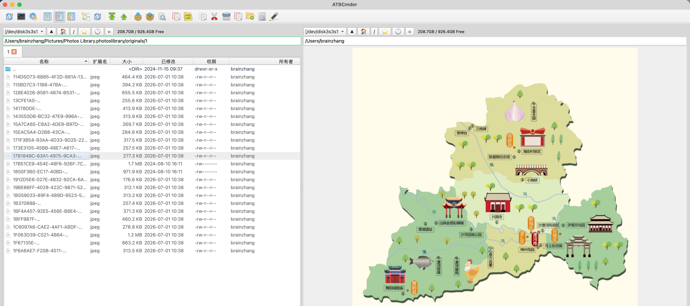

# Navigation Guide

Welcome to the ATBCmder Navigation Guide. This guide covers the primary ways to navigate the file system and manage your view.

## Tree View
The Tree View provides a hierarchical look at your file system, including virtual file systems (VFS) like archives. 
It supports three layout modes, accessible from the **Show** menu:

- **Tree View (Replace)**: Replaces the file list with the tree view.

- **Tree View (Split)**: Shows both the tree view and the file list side-by-side in the current panel.

- **Tree View (Both Panels)**: Enables the split view in both the left and right panels.

Right-click the tree view to toggle the **Show Files** option if you want to see files alongside directories in the tree.

## Folder Tabs & Favorites (Directory Hotlist)
### Folder Tabs
You can open multiple folders in tabs within both the left and right panels.
Right-click the tab bar to access options like New Tab, Close Tab, and tab navigation. 

### Favorite Tabs
You can save your entire dual-panel tab layout (left and right tabs) as a named "Favorite Tab" set. 

- **Save/Load**: Right-click the tab bar and select **Save current tabs to a New Favorite Tabs** or load an existing set.

- **Management**: Go to **Preferences → Favorite Tabs** to rename, delete, or reorder your saved sets.

### Directory Hotlist (Bookmarks)
The Directory Hotlist acts as your bookmarks for frequently used folders.

- **Access**: Use the hotlist popup menu to quickly jump to a bookmarked folder. The popup includes a search box for real-time filtering by name or path.

- **Management**: Manage your bookmarks in **Preferences → Directory Hotlist**, where you can add, delete, edit, and reorder your hotlist entries.

## Quick Search
Quick Search allows you to jump directly to a file by typing its name.

- **Trigger**: Depending on your settings (**Preferences → Quick Search**), typing a letter or using a shortcut (like `Option+Letter` or `Cmd+Option+Letter`) will open the Quick Search overlay.

- **Navigation**: Use the `Up` and `Down` arrows to jump between matching files. Press `Enter` to open the file or folder.

- **Matching Rules**: You can configure it to match the beginning of the filename, or anywhere in the name. Type a trailing dot (`.`) to specifically match the end of a filename (excluding the extension).

## Quick View Panel

  
*Quick View Panel: Browse on one side, preview in real-time on the other*

The Quick View feature allows you to use the opposite panel as a real-time preview window for your files.

- **Hotkeys and Commands (`cm_QuickView`)**:
  Trigger the Quick View mode on and off using the default `Ctrl+Q` or `Cmd+Q` shortcuts.
- **Multi-format Inline Preview & Property Fallback**:
  - **Previewable formats**: Seamlessly integrates text/source code, images, PDFs, audio/video, CSV/JSON, etc., embedding the preview directly in the opposite panel.
  - **Non-previewable formats or Directories**: Automatically displays a metadata panel listing file properties, UNIX octal permissions and read/write/execute matrices, background-calculated MD5/SHA256 hashes, and directory statistics (number of files and subfolders).
- **Smooth Navigation & Debouncing**:
  When navigating the file list using arrow keys, the opposite Quick View panel updates with a 100ms debouncing timer. This ensures the UI remains smooth and stutter-free even when scrolling rapidly.
- **Symmetric Flip**:
  If Quick View is active and you press `Tab` or click to switch focus to the opposite panel, the Quick View automatically flips to the new opposite side, seamlessly following your currently selected file.

## Essential Keyboard Shortcuts (Hotkeys)

For a complete list of default shortcuts and configuration instructions, please refer to the dedicated [Keyboard Shortcuts](keyboard_shortcuts.md) section.

## Auto-Fitting Columns
By default, the file panel automatically adjusts column widths so you can see the full file names.

- **Max text width (Default)**: Columns automatically fit the widest file name currently visible.

- **Average text width**: Sizes columns based on average text width plus a padding factor.

- **Fixed widths**: Retains a fixed width, which is automatically activated if you manually resize a column.

You can change the auto-fit mode in **Preferences → File Views**.
