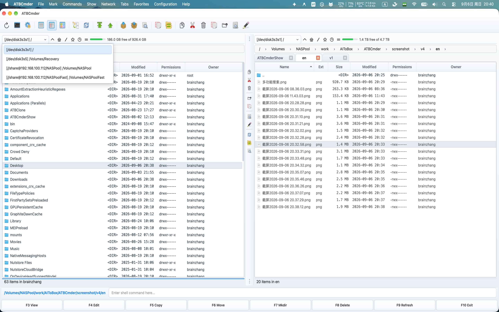

# Capítulo 2: Navegación y pestañas de carpetas

El movimiento fluido y de alta velocidad a través de directorios es la piedra angular de la gestión de archivos ortodoxa. En ATBCmder, nunca tendrá que perder el tiempo arrastrando barras de desplazamiento, haciendo clic repetidamente en carpetas anidadas o luchando con docenas de ventanas fragmentadas del Finder. 

Este capítulo cubre todo lo que necesita para navegar por sistemas de archivos locales y remotos con absoluta confianza: rutas de navegación interactivas, saltos en la jerarquía del teclado, flujos de trabajo nativos de múltiples pestañas de macOS, espacios de trabajo persistentes de pestañas favoritas de doble panel, marcadores de búsqueda difusa instantánea y cinco modos de vista de panel especializados. 

---

## 1. Inicio rápido visual: jerarquía y organización espacial sin esfuerzo

En ATBCmder, cada panel funciona como un motor de navegación autónomo equipado con su propia cadena de ruta de navegación, barra de pestañas independiente, pila de historial y modos de visualización. 

```
┌─────────────────────────────────────────────────────────────────────────────────┐
│ [RUTA MIGA]   🏠 / ▸ Users ▸ username ▸ Projects ▸ ATBCmder ▸ src               │
├─────────────────────────────────────────────────────────────────────────────────┤
│ [PESTAÑAS]    [★ Código (Bloqueado)] [Recursos] [Compilación] [+]               │
├─────────────────────────────────────────────────────────────────────────────────┤
│  Nombre                       Tipo      Tamaño    Modificado         Permisos   │
│  ▸ [..]                                           --:--              drwxr-xr-x │
│  ▸ core                       <DIR>               Hoy, 14:22         drwxr-xr-x │
│  ▸ ui                         <DIR>               Hoy, 15:05         drwxr-xr-x │
│  ● main.py                    py        8.4 KB    Hoy, 15:10         -rw-r--r-- │
│  ● config.xml                 xml       12.1 KB   Ayer, 19:40        -rw-r--r-- │
│                                                                                 │
├─────────────────────────────────────────────────────────────────────────────────┤
│ [BÚSQUEDA RÁPIDA]  🔍 Buscar: mai_   (Coincidencia: main.py)                     │
└─────────────────────────────────────────────────────────────────────────────────┘
```

### Hoja de referencia de navegación de matriz dual

| Acción | Acceso directo a macOS | Llave de comandante clásica | ID de comando | Descripción | 
| :--- | :--- | :--- | :--- | :--- | 
| **Directorio de padres** | `Backspace` / `⌘↑` | `Ctrl+PgUp` | `cm_ChangeDirToParent` | Subir un nivel de directorio (`..`). | 
| **Directorio raíz** | `Ctrl+\` / `⌃\` | `\` | `cm_ChangeDirToRoot` | Salte directamente a la raíz del sistema (`/`). | 
| **Directorio de inicio** | `Ctrl+Shift+Home` / `⌃⇧Home` | `Alt+Home` | `cm_ChangeDirToHome` | Vaya al directorio de inicio del usuario (`~`). | 
| **Abrir elemento/Ingresar directorio** | `Enter` / `⌘↓` | `Enter` | — | Ingrese al directorio seleccionado o abra el archivo. | 
| **Nueva pestaña** | `Cmd+T` / `⌘T` | `Ctrl+T` | `cm_NewTab` | Abra la carpeta activa en una nueva pestaña. | 
| **Cerrar pestaña** | `Cmd+W` / `⌘W` | `Ctrl+W` | `cm_CloseTab` | Cierra la pestaña actualmente enfocada. | 
| **Lista destacada del directorio** | `Ctrl+D` / `⌃D` | `Ctrl+D` | `cm_DirHotList` | Abra la ventana emergente instantánea de marcadores difusos. | 
| **Historia atrás** | `Cmd+[` / `⌘[` | `Alt+Left` | `cm_ViewHistoryPrev` | Regrese a la carpeta visitada anteriormente. | 
| **Historia hacia adelante** | `Cmd+]` / `⌘]` | `Alt+Right` | `cm_ViewHistoryNext` | Avanzar en el historial del directorio. | 
| **Lista desplegable de historial** | `Alt+F8` / `⌥F8` | `Ctrl+Down` | `cm_DirHistory` | Mostrar lista desplegable del historial. | 
| **Lista de unidad/volumen (izquierda/derecha)** | `⌥F1` / `⌥F2` (`⌥D`) | `Alt+F1` / `Alt+F2` (`Alt+D`) | `cm_LeftOpenDrives` / `cm_RightOpenDrives` (`cm_Drives`) | Abra el menú de unidad para el panel izquierdo o derecho (`Alt+D` para el panel activo). | 
| **Búsqueda rápida** | `Ctrl+S` / `⌃S` | `Ctrl+S` | `cm_QuickSearch` | Abra la superposición de búsqueda en tiempo real en el panel. | 

---

## 2. Navegación básica por directorios: rutas, rutas de navegación y accesos directos

ATBCmder le ofrece múltiples formas ergonómicas y redundantes de moverse a través de su sistema de archivos, ya sea que prefiera gestos del mouse, clics en el trackpad o la velocidad pura del teclado.

### Navegación con mouse y panel táctil

- **Ingresar a carpetas**: haga doble clic en cualquier fila del directorio o presione `Enter` (`Return`). 
- **Jerarquías ascendentes**: haga doble clic en la fila superior `[..]` para saltar inmediatamente a la carpeta principal. 
- **Pestañas de fondo**: haga clic con el botón central en cualquier fila de carpeta para abrir ese directorio en una nueva pestaña de fondo sin perder la vista actual (`cm_OpenDirInNewTab`).

### Barra de ruta de navegación interactiva estilo Finder

Ubicada directamente encima de cada panel de archivos, la barra de navegación interactiva representa su ruta UNIX actual como una cadena de segmentos en los que se puede hacer clic: 

```
🏠 / ▸ Users ▸ brain ▸ Projects ▸ ATBCmder ▸ docs
```
 

1. **Salto instantáneo de antepasados**: haga clic en cualquier segmento de antepasados (como `Projects` o `Users`) para saltar directamente a ese nivel, sin pasar por múltiples navegaciones de carpetas principales. 
2. **Menú desplegable del directorio de hermanos**: coloque el cursor sobre o haga clic en el cheurón (`▸`) entre los segmentos para revelar un menú desplegable que enumera todas las carpetas de hermanos en ese nivel de jerarquía. Haga clic en cualquier hermano para navegar directamente a él. 
3. **Utilidades contextuales**: haga clic derecho en cualquier segmento de ruta de navegación para abrir un menú contextual dedicado: 
- **Abrir en una pestaña nueva**: abre esa carpeta ancestral específica en una pestaña nueva. 
- **Revelar en Finder**: abre el directorio en el Finder nativo de macOS (`open -R`). 
- **Copiar ruta**: copia la ruta UNIX absoluta del segmento al portapapeles de macOS. 
- **Abrir en Terminal**: genera una ventana de Terminal dentro de ese directorio exacto. 
4. **Edición de texto de ruta directa (`BreadcrumbLineEdit`)**: 
- Haga doble clic en el espacio en blanco a la derecha de la cadena de ruta de navegación (o presione `Shift+F2`). 
- Los segmentos de ruta de navegación se transforman instantáneamente en un campo de texto editable (`QLineEdit`). 
- Escriba o pegue rutas arbitrarias (como `~/Library/Application Support`, `/var/log`, `/Volumes/ExternalDrive` o `vfs://` ubicaciones de archivo). 
- Presione `Enter` para saltar, o `Esc` para cancelar y volver a los botones de ruta de navegación.

### Saltos rápidos del teclado

Mantén tus manos en la fila de inicio con estos comandos de navegación dedicados: 

- **Directorio principal (`Backspace` / `⌘↑` / `Ctrl+PgUp` / `cm_ChangeDirToParent`)**: Asciende instantáneamente al directorio principal. Cuando asciendes, ATBCmder posiciona automáticamente el cursor en la carpeta de la que acabas de salir, asegurando que nunca pierdas tu lugar. 
- **Directorio raíz (`Ctrl+\` / `cm_ChangeDirToRoot`)**: salta directamente a la raíz del volumen de inicio de macOS (`/`). 
- **Directorio de inicio (`Ctrl+Shift+Home` / `cm_ChangeDirToHome`)**: salta directamente al directorio de inicio de su usuario (`/Users/username` o `~`). 
- **Primera y última entrada**: Presione `Home` (`cm_GoToFirst`) para ajustar el foco del cursor a la entrada superior (`..`), o `End` (`cm_GoToLast`) para saltar al archivo final en el panel actual. 

---

## 3. Pestañas de carpetas: multitarea dentro de cada panel

Trabajar en proyectos de software complejos, bibliotecas de fotografías o copias de seguridad de servidores a menudo requiere hacer malabarismos con varias carpetas simultáneamente. En lugar de abrir docenas de ventanas, ATBCmder incorpora tiras de pestañas múltiples independientes para ambos paneles. 

 
*Gestión de pestañas múltiples y navegación rápida en ATBCmder*

### Diseño de barra de pestañas nativa de macOS

Construida con `MacNativeTabBar`, la barra de pestañas coincide con la estética moderna de macOS: 

- **Diseño visual**: esquinas de pestañas redondeadas, estados de desplazamiento suaves e indicadores claros de acento de pestañas activas. 
- **Botones de cierre al pasar el cursor**: cada pestaña cuenta con un botón de cierre integrado `✕` que aparece al pasar el cursor o al seleccionar. 
- **Clic central para cerrar**: haga clic en cualquier pestaña con el botón central del mouse o haga clic con tres dedos en el trackpad para cerrarla inmediatamente. 
- **Haga doble clic para agregar**: haga doble clic en el espacio vacío en la barra de pestañas para generar instantáneamente una nueva pestaña clonada desde la ruta activa.

### Operaciones con pestañas y teclas de acceso rápido

| Acción | Acceso directo a macOS | Clave clásica | ID de comando | Descripción | 
| :--- | :--- | :--- | :--- | :--- | 
| **Nueva pestaña** | `Cmd+T` / `⌘T` | `Ctrl+T` | `cm_NewTab` | Abre el directorio actual en una nueva pestaña. | 
| **Cerrar pestaña** | `Cmd+W` / `⌘W` | `Ctrl+W` | `cm_CloseTab` | Cierra la pestaña activa (se conserva al menos 1 pestaña). | 
| **Siguiente pestaña** | `Ctrl+Tab` / `⌃⇥` | `Ctrl+Tab` | `cm_NextTab` | Cambia el foco a la siguiente pestaña a la derecha. | 
| **Pestaña anterior** | `Ctrl+Shift+Tab` / `⌃⇧⇥` | `Ctrl+Shift+Tab` | `cm_PrevTab` | Cambia el enfoque a la pestaña anterior a la izquierda. | 
| **Lista de pestañas rápida** | `Ctrl+Shift+L` / `⌃⇧L` | `Ctrl+Shift+L` | `cm_ShowTabsList` | Aparece un menú numerado de todas las pestañas abiertas. | 
| **Cambiar nombre de pestaña** | *Pestaña de clic derecho* | — | `cm_RenameTab` | Asigna una etiqueta descriptiva personalizada a la pestaña. | 
| **Cerrar otras pestañas** | *Pestaña de clic derecho* | — | `cm_CloseOtherTabs` | Cierra todas las pestañas excepto la seleccionada. | 
| **Cerrar duplicados** | *Pestaña de clic derecho* | — | `cm_CloseDuplicateTabs` | Detecta y cierra pestañas duplicadas con rutas idénticas. | 
| **Cerrar todas las pestañas** | *Pestañas de menú* | — | `cm_CloseAllTabs` | Restablece el panel a una sola pestaña. | 
| **Copiar al lado opuesto** | *Pestañas de menú* | — | `cm_CopyAllTabsToOpposite` | Copia todas las pestañas del panel activo al panel de destino. |

### Modos de bloqueo de pestañas

Evite cambios accidentales de directorio en carpetas críticas configurando opciones de bloqueo de pestañas. Haga clic derecho en cualquier pestaña para elegir su modo de bloqueo: 

1. **Normal (Desbloqueado)**: 
- Comportamiento de pestaña predeterminado. 
- Navegar por las carpetas actualiza directamente la ruta de la pestaña actual. 
2. **Bloqueado (`cmd_SetTabOptionLock`)**: 
- La ruta de la pestaña está estrictamente congelada en su ubicación de anclaje inicial. 
- Aparece un icono de candado visual (`🔒` o `★`) en el título de la pestaña. 
- Si hace doble clic en un subdirectorio o navega, ATBCmder automáticamente deja la pestaña bloqueada sin cambios y abre la carpeta de destino en una **nueva pestaña adyacente**. 
3. **Bloqueado con subdirectorios permitidos (`cmd_SetTabOptionLockWithSubdirs`)**: 
- Le permite navegar libremente en carpetas y subdirectorios secundarios dentro de este árbol. 
- Le impide ascender más allá de la carpeta base bloqueada. 
- Si cambia o recarga, la pestaña se restablece de forma segura a su raíz de anclaje. 

---

## 4. Pestañas favoritas: espacios de trabajo de panel dual con nombre

Si bien las pestañas individuales brindan flexibilidad local, las **Pestañas favoritas** le permiten capturar y restaurar entornos operativos completos de doble panel con un solo comando. 

```
┌────────────────────────────────────────┐
│ FAVORITE TAB SET: "Client Release"     │
├───────────────────┬────────────────────┤
│ LEFT PANEL TABS   │ RIGHT PANEL TABS   │
│ 1. [★ src/api]    │ 1. [build/dist]    │
│ 2. [docs/guides]  │ 2. [vfs://sftp/nas]│
│ 3. [tests/unit]   │ 3. [~/Downloads]   │
└───────────────────┴────────────────────┘
```
 

Un conjunto de pestañas favoritas encapsula: 

- Todas las pestañas abiertas en el Panel izquierdo (incluidas rutas y estados de bloqueo). 
- Todas las pestañas abiertas en el Panel derecho (incluidas rutas y estados de bloqueo). 
- La selección de pestañas activas para ambos paneles.

### Comandos de pestañas favoritas

- **Guardar pestañas actuales (`cm_SaveFavoriteTabs`)**: 
- Accesible a través del Menú **Favoritos** → **Guardar pestañas actuales en Nuevas pestañas favoritas**, o haciendo clic derecho en la barra de pestañas. 
- Le solicita que nombre el espacio de trabajo (por ejemplo, `Rust Web Backend`, `Photo Editing 2026` o `Server Deployment`). 
- Almacena la definición del espacio de trabajo de forma persistente en `fav_tab_config.xml`. 
- **Cargar pestañas favoritas (`cm_LoadFavoriteTabs`)**: 
- Accesible a través del Menú **Favoritos** → **Cargar pestañas desde Pestañas favoritas**. 
- Abre un cuadro de diálogo modal que enumera los conjuntos de pestañas guardados. Seleccione un conjunto y ambos paneles reconstruirán inmediatamente el diseño completo de múltiples pestañas. 
- **Volver a guardar pestañas favoritas (`cm_ResaveFavoriteTabs`)**: 
- Actualiza el conjunto de espacios de trabajo actualmente activo con las pestañas recién abiertas, cerradas o navegadas sin solicitar un nuevo nombre. 
- **Recargar pestañas favoritas (`cm_ReloadFavoriteTabs`)**: 
- Devuelve ambos paneles al estado limpio y guardado del espacio de trabajo activo, descartando cualquier pestaña exploratoria abierta durante la sesión. 
- **Ciclar espacios de trabajo (pestañas favoritas siguiente/anterior)**: 
- Cambie rápidamente entre diferentes espacios de trabajo de proyectos guardados de forma secuencial desde el menú Favoritos. 
- **Configuración (`cm_ConfigFavoriteTabs`)**: 
- Abra **Preferencias** → **Pestañas favoritas** para reordenar conjuntos, cambiar el nombre de los espacios de trabajo, editar rutas de pestañas individuales manualmente o eliminar conjuntos obsoletos. 

---

## 5. Listas destacadas del directorio (marcadores)

La **Lista activa de directorio** proporciona acceso global e instantáneo a las carpetas que utiliza con más frecuencia en unidades locales, discos externos y montajes de red remotos. 

 
*Ventana emergente de lista activa de directorio con búsqueda difusa en tiempo real*

### Ventana emergente de lista activa instantánea (`Ctrl+D` / `⌃D` / `cm_DirHotList`)

Al presionar `Ctrl+D` se abre un cuadro de diálogo de búsqueda ligero y flotante centrado justo debajo de tus ojos: 

1. **Búsqueda difusa en tiempo real**: 
- Empiece a escribir inmediatamente. La barra de búsqueda filtra todos los nombres de sus marcadores y rutas de destino en tiempo real. 
- Por ejemplo, escribir `down` coincide instantáneamente con `Downloads — /Users/username/Downloads`. 
2. **Recorrido del teclado**: 
- Utilice las teclas de flecha `Up` y `Down` para resaltar el marcador deseado. 
- Presione `Enter` para navegar por el panel activo directamente a esa ruta. 
- Presione `Esc` para cerrar la ventana emergente sin cambiar su directorio. 
3. **Creación rápida de marcadores**: 
- Haga clic en el botón **Agregar directorio actual** (o presione `Alt+A`) dentro de la ventana emergente. 
- ATBCmder completa automáticamente la ruta de la carpeta actual y sugiere un nombre para mostrar limpio.

### Configuración de lista activa (`Ctrl+Shift+D` / `⌃⇧D` / `cm_ConfigDirHotList`)

Abra **Preferencias** → **Lista activa de directorio** (o active `cm_ConfigDirHotList`) para organizar sus marcadores: 

- **Submenús jerárquicos**: agrupa marcadores relacionados en categorías (por ejemplo, `Work`, `Personal`, `Cloud Storage`, `Network Shares`). 
- **Etiquetas de visualización personalizadas**: asigne nombres descriptivos como `Work Documents` en lugar de rutas largas como `/Users/username/Library/Mobile Documents/com~apple~CloudDocs/Work`. 
- **Reordenación con arrastrar y soltar**: reorganice el orden de los marcadores para mantener los directorios de mayor prioridad en la parte superior de su lista. 

---

## 6. Historial y unidades: navegación por el tiempo y los volúmenes de almacenamiento

ATBCmder mantiene un seguimiento de auditoría completo de sus sesiones de navegación, lo que le permite volver sobre sus pasos a través del almacenamiento local y los volúmenes montados.

### Historial de navegación

Cada panel registra su propia pila de historial de ruta cronológica: 

- **Atrás (`Cmd+[` / `⌘[` o `Alt+Left` / `cm_ViewHistoryPrev`)**: Retrocede un paso en el historial de ruta del panel activo. 
- **Adelante (`Cmd+]` / `⌘]` o `Alt+Right` / `cm_ViewHistoryNext`)**: Avanza un paso después de navegar hacia atrás. 
- **Ventana emergente del historial del directorio (`Alt+F8` / `⌥F8` o `Ctrl+Down` / `⌃↓` / `cm_DirHistory`)**: 
- Muestra un menú emergente desplazable que muestra los últimos 20 directorios visitados en el panel activo. 
- Haga clic o utilice la flecha hacia abajo a cualquier directorio anterior para saltar directamente a él, omitiendo las pulsaciones repetitivas hacia Atrás.

### Conmutador de unidad y volumen

En macOS, todas las particiones internas, unidades USB-C/Thunderbolt externas, DMG montados y recursos compartidos de red residen en `/Volumes`. ATBCmder proporciona comandos dedicados para cambiar entre estos objetivos: 

 
*Unidad montada instantáneamente y selector de volumen activado mediante Alt+F1 (Panel izquierdo), Alt+F2 (Panel derecho) o Alt+D* 

- **Conmutador de unidad del panel izquierdo (`Alt+F1` / `⌥F1` / `cm_LeftOpenDrives`)**: acceso directo principal de Classic Commander que abre el menú de selección de unidad y volumen dirigido al panel izquierdo. 
- **Conmutador de unidad del panel derecho (`Alt+F2` / `⌥F2` / `cm_RightOpenDrives`)**: acceso directo principal de Classic Commander que abre el menú de selección de unidad y volumen dirigido al panel derecho. 
- **Menú de unidad de panel activo (`Alt+D` / `⌥D` / `cm_Drives`)**: abre un menú emergente que enumera todos los volúmenes montados, el sistema de archivos raíz `/`, el hogar del usuario `~` y los puntos finales de red conectados para el panel actualmente enfocado. 

> [!NOTE] 
> **Permisos de unidades externas de macOS**: al navegar a unidades externas bajo `/Volumes` por primera vez, la aplicación Sandbox de macOS puede solicitarle permiso. ATBCmder mostrará un cuadro de diálogo de autorización para crear un marcador persistente con ámbito de seguridad para esa unidad. 

---

## 7. Modos de vista del panel: personalización de la pantalla

ATBCmder presenta 5 modos de visualización especializados diseñados para optimizar el espacio de la pantalla y la densidad de la información para diferentes flujos de trabajo de administración de archivos.

### 1. Vista de columnas completas (`Ctrl+F2` / `⌃F2` / `cm_ColumnsView`)

El modo de visualización estándar y más completo. Muestra archivos en un rico formato tabular con encabezados configurables: 

| Columna | Descripción | Alineación | 
| :--- | :--- | :--- | 
| **Nombre** | Nombre de archivo o directorio con icono de tipo nativo de macOS. | Izquierda | 
| **Ext** | Extensión de archivo (por ejemplo, `py`, `png`, `zip`). | Izquierda | 
| **Tamaño** | Tamaño formateado (B, KB, MB, GB). Las carpetas muestran `<DIR>`. | Derecha | 
| **Fecha de modificación** | Marca de tiempo formateada según la configuración regional de macOS. | Izquierda | 
| **Atributos** | Permisos UNIX (octal `0755` y simbólico `rwxr-xr-x`). | Centro | 
| **Propietario/Grupo** | Nombres de propiedad de usuarios y grupos de UNIX. | Izquierda | 

- **Clasificación de encabezados**: haga clic en cualquier encabezado de columna para alternar el orden de clasificación ascendente o descendente. Haga clic con `Cmd` presionado para realizar una clasificación secundaria.

### 2. Vista breve (`Ctrl+F1` / `⌃F1` / `cm_BriefView`)

La vista breve elimina las columnas de metadatos y organiza los archivos en múltiples columnas verticales compactas que ocupan todo el ancho del panel. 

- **Navegación de alta densidad**: muestra de 3 a 5 veces más elementos en la pantalla simultáneamente. 
- **Mejor para**: escanear rápidamente listados de directorios grandes (como fuentes, volcados de fotografías o archivos de registro) donde solo necesita identificar nombres de archivos.

### 3. Vista de miniaturas (`Ctrl+Shift+F1` / `⌃⇧F1` / `cm_ThumbnailsView`)

La vista de miniaturas convierte la lista de archivos en una cuadrícula de iconos de imágenes y medios. 

 
*Vista de miniaturas que muestra vistas previas de medios en el panel activo* 

- **Medios compatibles**: vistas previas instantáneas de fotografías (JPEG, PNG, HEIC, TIFF, WebP, GIF), formatos vectoriales (SVG), documentos PDF y miniaturas de vídeos (MP4, MOV, MKV). 
- **Generación de fondo asincrónica**: la representación de miniaturas se produce en subprocesos en segundo plano sin bloquear la interacción del usuario. 
- **Tamaño ajustable**: configure los tamaños de los íconos de miniaturas (desde 64 px hasta 256 px) en **Preferencias** → **Vistas de archivos**.

### 4. Vista de árbol (`cm_TreeView`, `cm_TreeViewSplit`, `cm_TreeViewBoth`)

La vista de árbol muestra un árbol de directorios jerárquico expandible, lo que facilita la comprensión de estructuras profundas de carpetas de un vistazo. 

 
*Vista de árbol integrada junto con listados de archivos y miniaturas* 

ATBCmder admite tres diseños distintos de vista de árbol a través del menú **Mostrar**: 

- **Vista de árbol (Reemplazar) (`cm_TreeView`)**: la tabla de archivos del panel activo se reemplaza por completo con un árbol de directorios expandible. 
- **Vista de árbol (dividida) (`cm_TreeViewSplit`)**: el panel activo se divide verticalmente en dos subpaneles: un árbol de directorios a la izquierda y la lista de archivos estándar para la carpeta del árbol seleccionada a la derecha. 
- **Vista de árbol (ambos paneles) (`cm_TreeViewBoth`)**: habilita el árbol de directorios dividido en los paneles izquierdo y derecho simultáneamente. 
- **Mostrar archivos alternar**: haga clic con el botón derecho dentro de la vista de árbol y active **Mostrar archivos** para elegir si los archivos deben mostrarse en el árbol junto a los directorios u ocultarse para mostrar solo los directorios.

### 5. Sucursal / Vista plana (`Cmd+B` / `⌘B` o `Ctrl+B` / `⌃B` / `cm_FlatView`)

Flat View (también conocida como Branch View) es una de las funciones más poderosas de ATBCmder. Atraviesa recursivamente todos los subdirectorios y subcarpetas dentro de la carpeta actual, aplanando todos los archivos anidados en una **única lista unificada**. 

 
*Vista de rama plana (`Cmd+B`) que muestra contenidos anidados en todos los subdirectorios* 

- **La columna Ruta**: en vista plana, ATBCmder agrega automáticamente una columna **Ruta** que muestra la ruta relativa a la carpeta anidada de cada archivo (por ejemplo, `assets/icons/` o `src/core/`). 
- **Clasificación global**: ordena todos los archivos anidados simultáneamente en todo un árbol de proyecto por tamaño, fecha de modificación o extensión de archivo. 
- **Procesamiento por lotes**: seleccione archivos que se originen en una docena de subdirectorios diferentes y cópielos, muévalos, diferencie o cambie el nombre de todos a la vez. 
- **Transmisión transversal**: ATBCmder transmite los resultados de la búsqueda a la vista de manera incremental utilizando trabajadores en segundo plano, lo que garantiza que los proyectos grandes (con decenas de miles de archivos anidados) se carguen sin problemas sin congelar la interfaz de usuario. 
- **Salida rápida**: Presione `Cmd+B` (`Ctrl+B`) nuevamente para salir de la Vista plana y regresar a la vista de directorio jerárquico normal. 

---

## 8. ⚡ Consejos profesionales y análisis profundo: control de precisión

Para usuarios avanzados y teclistas avanzados, ATBCmder ofrece ajustes detallados y mecanismos de búsqueda rápida.

### Superposición de búsqueda rápida en el panel (`Ctrl+S` / `⌃S` / `cm_QuickSearch`)

La búsqueda rápida le permite saltar directamente a cualquier archivo escribiendo su nombre sin abrir un cuadro de diálogo de búsqueda completo. 

```
┌─────────────────────────────────────────────────────────────────┐
│  main.py            py      8.4 KB    Today, 15:10   -rw-r--r-- │
│  main_window.py     py     72.1 KB    Today, 15:18   -rw-r--r-- │
├─────────────────────────────────────────────────────────────────┤
│ 🔍 Quick Search: main_                 [ Next: ↓ ] [ Prev: ↑ ]  │
└─────────────────────────────────────────────────────────────────┘
```
 

1. **Búsqueda incremental**: 
- Presione `Ctrl+S` (o simplemente comience a escribir si está configurado en Preferencias). 
- Aparece una barra superpuesta acoplada en la parte inferior del panel activo. 
- A medida que escribe caracteres, el cursor del panel salta en tiempo real a la primera entrada coincidente. 
2. **Partidos de ciclismo**: 
- Presione `Down Arrow` (`↓`) para saltar al siguiente archivo coincidente. 
- Pulsa `Up Arrow` (`↑`) para saltar al partido anterior. 
- Presione `Enter` para abrir o ejecutar el elemento coincidente. 
- Presione `Esc` para cerrar la barra de búsqueda mientras mantiene el cursor en el archivo encontrado. 
3. **El truco del punto final**: 
- Escriba un punto final (por ejemplo, `config.`) para que coincida específicamente con el final de una base de nombre de archivo, distinguiendo `config.xml` de `configuration_guide.md`. 
4. **Búsqueda rápida frente a filtro frente a filtro semántico**: 
- **Búsqueda rápida (`Ctrl+S` / `cm_QuickSearch`)**: navega con el cursor entre coincidencias mientras mantiene todos los archivos visibles. 
- **Filtro rápido (`cm_QuickFilter`)**: Oculta temporalmente todos los archivos que no coinciden y muestra solo las filas coincidentes en la tabla. 
- **Filtro semántico (`Ctrl+F` / `cm_SemanticFilter`)**: utiliza consultas en lenguaje natural (por ejemplo, `/larger than 10MB`, `//today modified pdf`) a través de macOS Spotlight.

### Modos de columna de ajuste automático

¿Estás cansado de cambiar el tamaño de las columnas manualmente o de tener nombres de archivos truncados? ATBCmder presenta un motor de dimensionamiento de columnas inteligente configurado en **Preferencias** → **Vistas de archivos**: 

1. **Ancho máximo de texto (`mode="max"`)**: 
- Analiza todos los nombres de archivos visibles y amplía la columna Nombre para que el nombre de archivo visible más largo sea completamente legible sin puntos suspensivos (`...`). 
2. **Ancho de texto promedio (`mode="average"`, predeterminado)**: 
- Evalúa el ancho medio estadístico de caracteres entre archivos multiplicado por un factor de relleno configurable (`auto_fit_padding`, predeterminado `1.0`) más los márgenes de los iconos. 
- **Ventaja**: evita que un único nombre de archivo anómalo de 150 caracteres empuje todas las columnas secundarias (Tamaño, Fecha, Permisos) fuera del borde de la pantalla. 
3. **Anchos fijos (`mode="fixed"`)**: 
- Conserva las dimensiones exactas en píxeles de la columna. 
- Se activa automáticamente cada vez que arrastra manualmente un separador de columnas en el encabezado de la tabla, respetando sus ajustes de diseño manuales.

### Modo de paneles duales horizontales (`Ctrl+Shift+H` / `⌃⇧H` / `cm_HorizontalFilePanels`)

De forma predeterminada, ATBCmder coloca los dos paneles de archivos uno al lado del otro (división vertical). En monitores ultra anchos o pantallas verticales, puedes cambiar a paneles horizontales apilados: 

 
*Orientación de paneles apilados horizontalmente con paneles superiores e inferiores* 

- Cambie a través del Menú **Mostrar** → **Modo de paneles horizontales** o presione `Ctrl+Shift+H` (`cm_HorizontalFilePanels`). 
- El paradigma Activo/Inactivo sigue siendo idéntico: las operaciones fluyen sin problemas entre los paneles Superior (Origen) e Inferior (Destino).

### Persistencia de la configuración de vista por pestaña

En la mayoría de los administradores de archivos, cambiar la columna de clasificación o cambiar de columnas detalladas a miniaturas obliga a que toda la ventana cambie globalmente. 

ATBCmder aísla y recuerda las preferencias de visualización en el **nivel de pestaña** individual (`TabState`), que persiste automáticamente durante los reinicios a través de `SessionManager` (`atbcmder_session.xml`): 

- **Modos de vista independientes**: puede mantener la pestaña 1 en **Vista de columnas completas** para revisiones de código, la pestaña 2 en **Vista de cuadrícula de miniaturas** para recursos gráficos y la pestaña 3 en **Vista breve** para hojear rápidamente. 
- **Clasificación independiente**: cada pestaña recuerda su propia columna de clasificación (nombre, extensión, tamaño, fecha o permisos) y dirección de clasificación (ascendente o descendente). Cambiar entre pestañas nunca restablece sus prioridades de clasificación. 
- **Estados planos y de árbol independientes**: una pestaña configurada en **Vista de rama plana** (`Cmd+B` / `cm_FlatView`) o **Modo de vista de árbol** mantiene su directorio recursivo aplanado sin alterar el estado de vista de ninguna otra pestaña en ninguno de los paneles. 

---

## 9. Recetas prácticas paso a paso

Aquí hay tres recetas del mundo real que muestran cómo la navegación, las pestañas y las listas activas se combinan para optimizar las tareas diarias.

### Receta 1: creación de un espacio de trabajo de desarrollo persistente

**Objetivo**: configurar un espacio de trabajo de panel dual para el desarrollo completo que se pueda restaurar con un solo clic en cualquier momento. 

1. **Configurar el Panel Izquierdo (Código Fuente)**: 
- Navegue hasta `~/Projects/MyApp/src`. 
- Abra una segunda pestaña (`Cmd+T`) y navegue hasta `~/Projects/MyApp/tests`. 
- Haga clic derecho en la pestaña `src` y elija **Bloquear pestaña** (`cmd_SetTabOptionLock`). 
2. **Configurar el panel derecho (compilación y registros)**: 
- Haga clic en el panel derecho para enfocarlo (`Tab`). 
- Navegue hasta `~/Projects/MyApp/dist`. 
- Abra una segunda pestaña (`Cmd+T`) y navegue hasta `/var/log`. 
3. **Guardar espacio de trabajo favorito**: 
- Elija Menú **Favoritos** → **Guardar pestañas actuales en Nuevas pestañas favoritas** (`cm_SaveFavoriteTabs`). 
- Ingrese `MyApp FullStack` y presione `Enter`. 
4. **Restauración instantánea**: 
- Siempre que trabaje en este proyecto, simplemente seleccione **Favoritos** → **Cargar pestañas desde pestañas favoritas** (`cm_LoadFavoriteTabs`) y elija `MyApp FullStack`. Ambos paneles configurarán instantáneamente las cuatro pestañas con sus rutas exactas y configuraciones de bloqueo. 

---

### Receta 2: aplanar árboles de directorios profundos para encontrar activos inflados

**Objetivo**: encontrar y limpiar dispositivos de prueba de gran tamaño y volcados de registros dispersos en docenas de subcarpetas anidadas. 

1. Navegue hasta la parte superior de su proyecto o directorio de medios en el panel activo. 
2. Presione `Cmd+B` (`⌘B`) o `Ctrl+B` (`cm_FlatView`) para activar **Vista de sucursal plana**. 
3. Observe cómo todos los subdirectorios se aplanan de forma recursiva en una única lista en el panel. 
4. Haga clic en el encabezado de la columna **Tamaño** una o dos veces para ordenar todos los archivos de mayor a menor. 
5. Los archivos más grandes de todo el árbol de directorios aparecen inmediatamente en la parte superior del panel, y la columna **Ruta** muestra sus ubicaciones anidadas exactas. 
6. Inspeccione o elimine los archivos inflados directamente. 
7. Presione `Cmd+B` nuevamente para desactivar la Vista plana y volver a la exploración de carpetas estándar. 

---

### Receta 3: Marcadores ultrarrápidos en volúmenes internos y de red

**Objetivo**: marcar una carpeta de copia de seguridad del NAS remoto y acceder a ella en menos de dos segundos. 

1. Navegue hasta su unidad de red montada (por ejemplo, `/Volumes/BackupShare/Archives`). 
2. Presione `Ctrl+D` (`⌃D`) para abrir la ventana emergente **Directory Hotlist**. 
3. Haga clic en el botón **Agregar directorio actual** (`btn_add` / `cm_AddDirToHotlist`). 
4. Introduzca un nombre descriptivo como `NAS Archives`. 
5. Mañana, cuando esté en cualquier lugar de su sistema de archivos local, simplemente presione `Ctrl+D`, escriba `nas` y presione `Enter`. ATBCmder lo transporta instantáneamente a través de la red a esa carpeta exacta. 

---

## 10. Alertas de seguridad y sistema

> [!NOTE] 
> **Almacenamiento externo y recursos compartidos de red**: 
> Al acceder a unidades USB externas o recursos compartidos de red (`/Volumes/...`) dentro de pestañas o marcadores, asegúrese de que el volumen esté actualmente montado. Si se desmonta una unidad cuando se inicia ATBCmder, las pestañas que apuntan a ella mostrarán de forma segura un aviso de "Ubicación no disponible" en lugar de bloquearse o eliminar la pestaña. 

> [!TIP] 
> **Reflejo de pestañas en todos los paneles**: 
> ¿Quiere que su panel derecho refleje inmediatamente todas las pestañas abiertas de su panel izquierdo? Utilice Menú **Pestañas** → **Copiar todas las pestañas al panel opuesto** (`cm_CopyAllTabsToOpposite`) para replicar el diseño de pestañas en ambos lados. 

> [!WARNING] 
> **Precaución con operaciones en vista plana (`Cmd+B`)**: 
> En la vista de rama plana, los archivos de varias ramas de directorio distintas aparecen uno al lado del otro en una lista. Tenga cuidado al utilizar `Cmd+A` (Seleccionar todo) seguido de `F8` (Eliminar) o `F6` (Mover), ya que su acción se aplicará de forma recursiva en todos los subdirectorios anidados. 

---

## 11. Tabla de referencia del teclado de matriz dual

| Categoría | Acción | Acceso directo a macOS | Clave clásica | ID de comando interno | 
| :--- | :--- | :--- | :--- | :--- | 
| **Navegación por directorio** | Directorio de padres | `Backspace` / `⌘↑` | `Ctrl+PgUp` | `cm_ChangeDirToParent` | 
| | Directorio raíz | `Ctrl+\` / `⌃\` | `\` | `cm_ChangeDirToRoot` | 
| | Inicio Directorio | `Ctrl+Shift+Home` / `⌃⇧Home` | `Alt+Home` | `cm_ChangeDirToHome` | 
| | Primera entrada | `Home` | `Home` | `cm_GoToFirst` | 
| | Última entrada | `End` | `End` | `cm_GoToLast` | 
| **Pestañas de carpeta** | Nueva pestaña | `Cmd+T` / `⌘T` | `Ctrl+T` | `cm_NewTab` | 
| | Cerrar pestaña | `Cmd+W` / `⌘W` | `Ctrl+W` | `cm_CloseTab` | 
| | Cerrar pestañas duplicadas | *Menú contextual de pestañas* | — | `cm_CloseDuplicateTabs` | 
| | Cerrar todas las pestañas | *Menú de pestañas* | — | `cm_CloseAllTabs` | 
| | Cambiar nombre de pestaña | *Menú contextual de pestañas* | — | `cm_RenameTab` | 
| | Copiar pestañas al lado opuesto | *Menú de pestañas* | — | `cm_CopyAllTabsToOpposite` | 
| | Pestaña siguiente | `Ctrl+Tab` / `⌃⇥` | `Ctrl+Tab` | `cm_NextTab` | 
| | Pestaña anterior | `Ctrl+Shift+Tab` / `⌃⇧⇥` | `Ctrl+Shift+Tab` | `cm_PrevTab` | 
| | Mostrar lista de pestañas | `Ctrl+Shift+L` / `⌃⇧L` | `Ctrl+Shift+L` | `cm_ShowTabsList` | 
| **Pestañas favoritas** | Guardar pestañas favoritas | *Menú de favoritos* | — | `cm_SaveFavoriteTabs` | 
| | Cargar pestañas favoritas | *Menú de favoritos* | — | `cm_LoadFavoriteTabs` | 
| | Guardar favorito activo | *Menú de favoritos* | — | `cm_ResaveFavoriteTabs` | 
| | Recargar favorito activo | *Menú de favoritos* | — | `cm_ReloadFavoriteTabs` | 
| | Configurar pestañas favoritas| *Preferencias* | — | `cm_ConfigFavoriteTabs` | 
| **Listas destacadas e historial** | Lista caliente del directorio | `Ctrl+D` / `⌃D` | `Ctrl+D` | `cm_DirHotList` | 
| | Configurar lista caliente | `Ctrl+Shift+D` / `⌃⇧D` | `Ctrl+Shift+D` | `cm_ConfigDirHotList` | 
| | Agregar directorio a la lista activa | *Ventana emergente de lista caliente* | — | `cm_AddDirToHotlist` | 
| | Historia al revés | `Cmd+[` / `⌘[` | `Alt+Left` | `cm_ViewHistoryPrev` | 
| | Historia hacia adelante | `Cmd+]` / `⌘]` | `Alt+Right` | `cm_ViewHistoryNext` | 
| | Lista desplegable de historial | `Alt+F8` / `⌥F8` | `Ctrl+Down` | `cm_DirHistory` | 
| **Unidades y volúmenes** | Unidades del panel izquierdo | `Alt+F1` / `⌥F1` | `Alt+F1` | `cm_LeftOpenDrives` | 
| | Unidades del panel derecho | `Alt+F2` / `⌥F2` | `Alt+F2` | `cm_RightOpenDrives` | 
| | Menú de unidad de panel activo | `Alt+D` / `⌥D` | `Alt+D` | `cm_Drives` | 
| **Modos de visualización** | Vista de columnas completas | `Ctrl+F2` / `⌃F2` | `Ctrl+F2` | `cm_ColumnsView` | 
| | Vista breve | `Ctrl+F1` / `⌃F1` | `Ctrl+F1` | `cm_BriefView` | 
| | Vista de miniaturas | `Ctrl+Shift+F1` / `⌃⇧F1` | `Ctrl+Shift+F1` | `cm_ThumbnailsView` | 
| | Vista de árbol (Reemplazar) | *Mostrar Menú* | `Ctrl+Shift+F8` | `cm_TreeView` | 
| | Vista de árbol (dividida) | *Mostrar Menú* | — | `cm_TreeViewSplit` | 
| | Vista de árbol (ambos paneles)| *Mostrar Menú* | — | `cm_TreeViewBoth` | 
| | Vista plana de la sucursal | `Cmd+B` / `⌘B` | `Ctrl+B` | `cm_FlatView` | 
| | Modo Paneles Horizontales | `Ctrl+Shift+H` / `⌃⇧H` | `Ctrl+Shift+H` | `cm_HorizontalFilePanels` | 
| **Búsqueda y filtros** | Superposición de búsqueda rápida | `Ctrl+S` / `⌃S` | `Ctrl+S` | `cm_QuickSearch` | 
| | Filtro semántico | `Ctrl+F` / `⌃F` | `Ctrl+F` | `cm_SemanticFilter` |

--- 

<div align="center"> 
<p>Ahora que domina la navegación por directorios, las pestañas y las vistas de paneles:</p> 
<p><strong><a href="file_operations.md">Continúe con el Capítulo 3: Cola y operaciones diarias de archivos &rarr;</a></strong></p> 
</div>