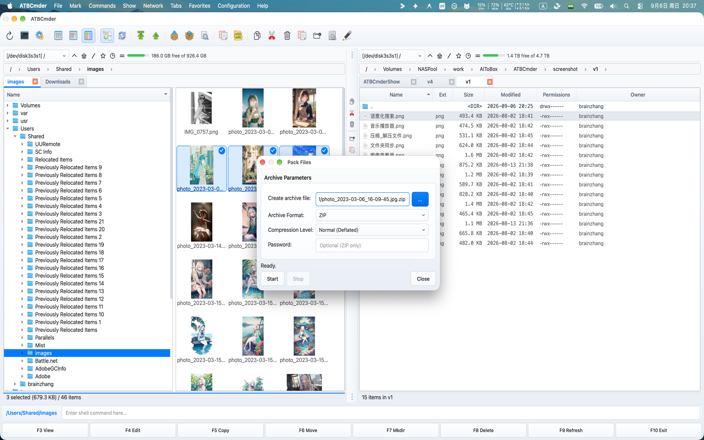

# Capítulo 6: Sistemas de archivos virtuales y red

La gestión de archivos moderna rara vez se detiene en el límite de un único disco duro físico. Los desarrolladores de software mantienen entornos de preparación remotos a través de SFTP; los administradores de sistemas gestionan los archivos compartidos empresariales a través de SMB/CIFS; los creadores de contenido acceden al almacenamiento en la nube y a los servidores multimedia a través de WebDAV; y los usuarios avanzados inspeccionan, editan y empaquetan rutinariamente archivos comprimidos a escala de gigabytes. 

Los entornos de escritorio tradicionales obligan a los usuarios a hacer malabarismos con aplicaciones inconexas: una utilidad de archivo independiente para descomprimir y volver a comprimir archivos zip, un cliente FTP/SFTP externo para administrar los activos del servidor y cuadros de diálogo de montaje del sistema operativo que distribuyen volúmenes remotos en ventanas desconectadas del Finder. 

ATBCmder elimina esta fragmentación a través de su motor **Virtual File System (VFS)**. Construido sobre una capa de abstracción URI `vfs://` unificada, ATBCmder trata los servidores remotos y los archivos comprimidos exactamente como carpetas locales estándar. Puede navegar a un archivo `.tar.gz`, obtener una vista previa de los archivos de código con `F3`, editar un archivo de configuración anidado con `F4` (con reempaquetado automático en vivo al guardar) y copiar activos directamente a través de una sesión SFTP segura a un NAS SMB local usando la clave estándar `F5`, todo sin extraer archivos intermedios a disco o cambiar entre herramientas separadas. 

---

## 1. Inicio rápido visual: arquitectura VFS y matriz de comandos

ATBCmder enruta todo el acceso al sistema de archivos a través de una capa de abstracción unificada. Ya sea que una ruta apunte a una partición SSD APFS de Apple, un miembro dentro de un archivo anidado `.zip` o un directorio remoto alojado en un servidor SFTP de Linux al otro lado del mundo, la interfaz de panel dual proporciona un modelo operativo idéntico. 

```
┌────────────────────────────────────────────────────────────────────────────────────────┐
│                              ATBCMDER DUAL-PANEL GUI                                   │
│            Left Panel (Active)                  Right Panel (Inactive / Target)        │
├────────────────────────────────────────────────────────────────────────────────────────┤
│                                          │                                             │
│  [1] Local File System                   │  [2] Archive Virtual File System (VFS)      │
│      file:///Users/brain/projects/       │      vfs:///Users/brain/backup.tar.gz/src/  │
│      Direct POSIX / APFS access          │      In-place browse, F3 view, F4 live edit │
│                                          │                                             │
│  [3] Remote Network VFS (SFTP/SSH)       │  [4] Remote Storage VFS (SMB / WebDAV)      │
│      vfs://sftp://deploy@aws.prod/app/   │      vfs://smb://admin@truenas/Pool/Media/  │
│      Paramiko / SSH Keys / Keychain      │      Kernel mount_smbfs / WebDAVClient3     │
│                                          │                                             │
├────────────────────────────────────────────────────────────────────────────────────────┤
│                          UNIFIED VFS DISPATCH ENGINE (vfs://)                          │
│     FileSystemModel ➔ VFSManager ➔ SessionCache ➔ StreamCopyWorker / RepackWorker      │
└────────────────────────────────────────────────────────────────────────────────────────┘
```

### Hoja de trucos de red y VFS de matriz dual

| Acción | Acceso directo a macOS | Llave de comandante clásica | ID de comando | Descripción | 
| :--- | :--- | :--- | :--- | :--- | 
| **Empaquetar archivos en el archivo** | `Alt+F5` / `⌥F5` | `Alt+F5` | `cm_PackFiles` | Abre el cuadro de diálogo Paquete de archivo con opciones de formato, compresión y contraseña. | 
| **Extraer archivos del archivo** | `Alt+F9` / `⌥F9` | `Alt+F9` | `cm_ExtractFiles` | Desempaqueta los archivos seleccionados con resolución de colisión. | 
| **Conexión de red rápida** | Menú: Red | `cm_NetworkConnect` | `cm_NetworkConnect` | Abre el cuadro de diálogo de conexión rápida ad-hoc. | 
| **Administrador de conexiones** | Menú: Red | `cm_ManageConnections`| `cm_ManageConnections`| Abre el administrador de red CRUD completo con perfiles de conexión guardados. | 
| **Conexión FTP** | `Ctrl+S` / `⌃S` | `Ctrl+S` | `cm_FTPConnect` | Acceso directo rápido para activar la sesión de conexión FTP. | 
| **Ingresar Archivo/Carpeta** | `Enter` / `⏎` | `Enter` | `cm_Open` | Navega directamente dentro de un `.zip`, `.tar`, `.7z` o directorio remoto. | 
| **Ascender a la carpeta principal** | `Backspace` / `⌫` | `Backspace` | `cm_GoToParent` | Sale del archivo o directorio remoto y regresa al nivel principal. | 
| **Ver archivo virtual/remoto**| `F3` / `Fn+F3` | `F3` | `cm_View` | Transmite archivos remotos o de archivo a Universal Lister. | 
| **Editar archivo virtual/remoto**| `F4` / `Fn+F4` | `F4` | `cm_Edit` | Abre el archivo en el editor; se vuelve a empaquetar o cargar automáticamente al guardar. | 
| **Copiar entre paneles/VFS** | `F5` / `Fn+F5` | `F5` | `cm_Copy` | Copia elementos seleccionados en puntos finales locales, de archivo o de red. | 
| **Panel de operaciones en segundo plano**| Menú: Mostrar | `cm_OperationsPanel` | `cm_OperationsPanel` | Supervisa las colas de transferencia en segundo plano, las velocidades y los subprocesos activos. | 

---

## 2. La abstracción de URI unificada `vfs://`

Los administradores de archivos tradicionales tratan a los servidores y archivos remotos como ciudadanos de segunda clase, que requieren utilidades de montaje externas, carpetas de extracción temporales o clientes de transferencia de terceros. ATBCmder unifica cada origen de archivo bajo una única especificación de URI bien definida: 

```
vfs://[protocol]://[user]@[host]:[port]/[remote_path]
```

### 2.1 Anatomía de los caminos virtuales

Dependiendo del dominio operativo, los `vfs://` URI toman una de dos formas estándar: 

1. **Archivar rutas virtuales**: 
   ```
   vfs:///Users/brain/Documents/release_v1.7.zip/src/main.py
   ```
 

- **Prefijo externo**: `vfs://` indica a `FileSystemModel` que intercepte el recorrido de la ruta. 
- **Ruta del contenedor**: `/Users/brain/Documents/release_v1.7.zip` identifica el archivo del contenedor físico en el almacenamiento local. 
- **Miembro interno**: `src/main.py` señala el recurso virtual anidado dentro del archivo. 

2. **Rutas del servidor de red**: 
   ```
   vfs://sftp://developer@staging.internal.net:2222/var/www/html/index.php
   vfs://smb://admin@192.168.1.50/StoragePool/Backups/2026/
   vfs://webdavs://user@cloud.mycompany.com:443/remote.php/dav/files/user/
   ```
 

- **Especificador de esquema**: Identifica al conductor del transporte (`sftp`, `ftp`, `ftps`, `smb`, `webdav`, `webdavs`, `gdrive`). 
- **Autenticación**: Codifica las credenciales del usuario y el puerto de destino. 
- **Destino remoto**: resuelve directorios absolutos y rutas de archivos en el host remoto. 

```
┌────────────────────────────────────────────────────────────────────────────────────────┐
│                              VFS URI ROUTING IN ACTION                                 │
├────────────────────────────────────────────────────────────────────────────────────────┤
│                                                                                        │
│   Input URI: vfs://sftp://deploy@aws.infra:22/var/log/nginx/access.log                 │
│                 │      │        │        │   └────────────────────► Remote Path        │
│                 │      │        │        └────────────────────────► Port (Default 22)  │
│                 │      │        └─────────────────────────────────► Host / Server      │
│                 │      └──────────────────────────────────────────► Username           │
│                 └─────────────────────────────────────────────────► Protocol Scheme    │
│                                                                                        │
│   Input URI: vfs:///Volumes/Data/Archive.zip/docs/manual.pdf                           │
│                 │                      │        └─────────────────► Archive Member     │
│                 │                      └──────────────────────────► Physical Archive   │
│                 └─────────────────────────────────────────────────► Virtual Scheme     │
└────────────────────────────────────────────────────────────────────────────────────────┘
```

### 2.2 Integración perfecta de panel dual

Debido a que las rutas virtuales se ajustan a las estructuras de directorios estándar dentro de ATBCmder, usted disfruta de una paridad total de panel dual: 

- **Espacios de trabajo virtuales con pestañas**: abra una carpeta SFTP remota en la pestaña 1, un archivo ZIP local cifrado en la pestaña 2 y su carpeta local `~/Downloads` en la pestaña 3. 
- **Copia direccional (`F5`)**: seleccione archivos en su panel activo local y presione `F5` para cargarlos directamente en el servidor remoto o en el archivo comprimido que se muestra en el panel inactivo. 
- **Interoperabilidad de arrastrar y soltar**: arrastre elementos a través de paneles entre discos locales, recursos compartidos de red y jerarquías de archivos sin preparación intermedia. 
- **Barra de ruta de navegación interactiva**: la barra de ruta de navegación analiza los URI virtuales en segmentos en los que se puede hacer clic. Haga clic en cualquier carpeta principal o en la insignia del servidor raíz para saltar al árbol al instante. 

---

## 3. Archivar VFS: navegación e inspección in situ

Abrir un archivo en ATBCmder no requiere extracción manual ni herramienta de descompresión de terceros. Simplemente resalte cualquier archivo admitido y presione **`Enter`** (o haga doble clic). ATBCmder monta el archivo in situ, transformando el panel en un navegador de directorio virtual de alta velocidad. 

 
*Figura 6.1: Navegando dentro de un archivo comprimido multianidado como una carpeta virtual, mostrando tamaños, marcas de tiempo y subdirectorios sin comprimir.*

### 3.1 Formatos de archivo admitidos

ATBCmder cuenta con controladores integrados para todos los formatos de compresión y archivo estándar de la industria: 

| Formato | Extensiones de archivo | Leer soporte | Escribir / Empacar | Soporte de cifrado | 
| :--- | :--- | :---: | :---: | :--- | 
| **CÓDIGO POSTAL** | `.zip` | Sí | Sí | Estándar y AES-256 (`pyzipper`) | 
| **GZip Tarball** | `.tar.gz`, `.tgz` | Sí | Sí | Transmisión de tar estándar POSIX | 
| **BZip2 Tarball**| `.tar.bz2`, `.tbz2` | Sí | Sí | Compresión de bloques bzip2 de alta relación | 
| **XZ Tarball** | `.tar.xz`, `.txz` | Sí | Sí | Compresión LZMA2 de alta eficiencia | 
| **TAR simple** | `.tar` | Sí | Sí | Archivo de cinta UNIX sin comprimir | 
| **7 cremalleras** | `.7z` | Sí | Sí (a través de `py7zr`)| LZMA / LZMA2 compresión sólida |

### 3.2 Flujos de trabajo de navegación local

Al navegar dentro de un archivo: 

1. **Ingrese subdirectorios**: presione `Enter` en cualquier carpeta dentro del archivo para explorar árboles anidados. 
2. **Ascender a Padre (`..`)**: Presione `Backspace` (`⌫`) o haga doble clic en la entrada `.. [Parent Directory]` para ascender. Una vez que llegue a la raíz del archivo, al presionar `Backspace` regresará limpiamente al directorio físico que contiene el archivo. 
3. **Vista previa instantánea (`F3` / `Fn+F3`)**: resalte cualquier documento, imagen o archivo fuente dentro del archivo y presione `F3`. ATBCmder extrae automáticamente el archivo de destino a un entorno limitado temporal seguro y lo procesa dentro de Universal Lister. 
4. **Copia selectiva (`F5` / `Fn+F5`)**: en lugar de descomprimir un archivo completo de varios gigabytes solo para recuperar uno o dos archivos, seleccione los miembros específicos que necesita y presione `F5`. ATBCmder descomprime solo los elementos elegidos directamente en el panel inactivo. 

> [!NOTA] 
> Al obtener una vista previa o copiar archivos individuales de un archivo, ATBCmder transmite solo los bytes del archivo solicitado directamente desde la secuencia del contenedor. No desperdicia espacio en disco ni tiempo descomprimiendo archivos hermanos no seleccionados. 

---

## 4. Reempaquetado en vivo: edición in situ dentro de archivos

Uno de los flujos de trabajo más potentes de ATBCmder es **Live Repacking**. Históricamente, modificar un único archivo anidado dentro de un archivo comprimido requería una tediosa secuencia de seis pasos: extraer el archivo completo, localizar el archivo de destino, editarlo y guardarlo, volver a comprimir el directorio en un nuevo archivo, eliminar el archivo original y limpiar las carpetas temporales. 

ATBCmder hace que editar archivos dentro de archivos sea tan sencillo como editar archivos locales estándar. 

```
┌────────────────────────────────────────────────────────────────────────────────────────┐
│                              LIVE REPACKING LIFECYCLE                                  │
├────────────────────────────────────────────────────────────────────────────────────────┤
│                                                                                        │
│  1. User presses F4 on "config.json" inside "package.zip"                              │
│     │                                                                                  │
│     ├──► ATBCmder extracts "config.json" to sandbox: /tmp/dc_repack_xyz/config.json    │
│     └──► Opens internal EditorDialog with window title: "config.json — Editor"         │
│                                                                                        │
│  2. User modifies file and presses Cmd+S (Save)                                        │
│     │                                                                                  │
│     ├──► Editor emits file_saved signal                                                │
│     └──► RepackWorker checks original archive size vs ArchiveRepackWarningMB threshold │
│                                                                                        │
│  3. Atomic Repack Execution                                                            │
│     │                                                                                  │
│     ├──► Writes modified stream to staging archive: /tmp/package.zip.tmp               │
│     ├──► Validates container integrity via archive driver                              │
│     ├──► Atomic swap: os.replace("/tmp/package.zip.tmp", "/original/package.zip")      │
│     └──► Refreshes active file panel and cleans up sandbox /tmp/dc_repack_xyz/         │
│                                                                                        │
└────────────────────────────────────────────────────────────────────────────────────────┘
```

### 4.1 Paso a paso: edición de un archivo de configuración archivado

1. Navegue hasta el archivo (por ejemplo, `application_bundle.zip`) presionando `Enter`. 
2. Localice el archivo que desea modificar (por ejemplo, `settings.yaml`). 
3. Presione **`F4`** (`Fn+F4`). ATBCmder extrae el archivo en un caché temporal e inicia el editor integrado. 
4. Realice sus modificaciones en el editor. 
5. Presione **`Cmd+S`** (`⌘S`) para guardar. 
6. Cierre el editor con `Cmd+W` (`⌘W`) o `Esc`. 
7. `RepackWorker` de ATBCmder actualiza automáticamente el miembro interno, comprime la estructura actualizada en un archivo temporal, reemplaza atómicamente el archivo original y actualiza la vista del panel. 

> [!PRECAUCIÓN] 
> **Guardia de seguridad de archivo grande (`ArchiveRepackWarningMB`)** 
> Para volver a empaquetar un archivo comprimido es necesario descomprimir y volver a codificar los flujos del contenedor. Modificar un archivo de 10 KB dentro de un archivo de video `.tar.gz` de 20 GB obligaría a la computadora a reescribir los 20 GB de datos. 
> 
> Para evitar congelaciones accidentales del disco, ATBCmder incluye un umbral de seguridad de protección (`ArchiveRepackWarningMB`, predeterminado: **100 MB** en `atbcmder.xml`). Si intenta editar o eliminar un archivo dentro de un archivo mayor que este límite, ATBCmder muestra un mensaje de confirmación: 
> *"Para modificar este archivo es necesario volver a empaquetar todo el archivo, lo que puede llevar mucho tiempo. ¿Desea continuar?"* 

---

## 5. Creación y extracción de archivos (`Alt+F5` / `Alt+F9`)

ATBCmder proporciona trabajadores en segundo plano dedicados para crear y extraer archivos, lo que garantiza que sus paneles de archivos sigan respondiendo incluso durante trabajos de compresión de larga duración. 

 
*Figura 6.2: El cuadro de diálogo Parámetros de archivo (Alt+F5 / cm_PackFiles) que muestra la ruta de destino, la selección de formato, los niveles de compresión y el cifrado de contraseña.*

### 5.1 Comprimir archivos (`Alt+F5` / `⌥F5` / `cm_PackFiles`)

Para crear un nuevo archivo: 

1. En el panel activo, seleccione los archivos o directorios que desea agrupar. 
2. Presione **`Alt+F5`** (`⌥F5`) o elija **Archivos ➔ Empaquetar...** en la barra de menú. 
3. Aparece el cuadro de diálogo **Empaquetar archivos**: 
- **Crear archivo comprimido**: ruta del archivo de destino. De forma predeterminada, ATBCmder sugiere colocar el archivo en el directorio del panel inactivo, que lleva el nombre del elemento enfocado. 
- **Formato de archivo**: elija entre `ZIP`, `TAR`, `TAR.GZ`, `TAR.BZ2`, `TAR.XZ` o `7Z`. 
- **Nivel de compresión**: 
- `Store`: Compresión cero; Embalaje instantáneo para medios precomprimidos (MP4, JPEG). 
- `Fast`: Baja sobrecarga de CPU; ideal para traslados rápidos. 
- `Normal (Deflated)`: Velocidad y relación de compresión equilibradas (recomendado para uso general). 
- `Maximum`: compresión de mayor densidad (utiliza LZMA/Bzip2 cuando corresponda). 
- **Contraseña (solo ZIP)**: ingrese una frase de contraseña secreta para cifrar el archivo. 
4. Haga clic en **Iniciar** (o presione `Enter`). La operación se ejecuta en un hilo en segundo plano sin bloqueo con una barra de progreso y un indicador de estado archivo por archivo.

#### Cifrado de contraseña AES-256 de grado militar

El cifrado ZIP estándar (ZipCrypto heredado) está criptográficamente roto y es vulnerable a ataques de diccionario de texto sin formato. Cuando especifica una contraseña para un archivo ZIP, ATBCmder utiliza **cifrado AES-256** impulsado por `pyzipper` (`pyzipper.AESZipFile` con el estándar `WZ_AES`). Esto garantiza la compatibilidad con macOS, WinZip y 7-Zip al tiempo que protege los datos confidenciales contra el descifrado por fuerza bruta.

#### División de archivos enormes en conjuntos de varios volúmenes

Si necesita distribuir un archivo entre archivos adjuntos de correo electrónico, unidades FAT32 o límites de carga en la nube con límites de tamaño de archivo: 

1. Agrupe sus archivos usando `Alt+F5` (`cm_PackFiles`). 
2. Resalte el archivo resultante `.zip` o `.tar` y active el divisor de archivos mediante **`Alt+F6`** (`cm_FileSpliter`). 
3. Seleccione un tamaño de división preestablecido (por ejemplo, `100 MB`, `4.7 GB DVD`, `CD 700 MB` o un tamaño de byte personalizado). 
4. ATBCmder genera piezas divididas numeradas (`archive.zip.001`, `archive.zip.002`, etc.) junto con un manifiesto de verificación CRC32. Los destinatarios pueden volver a ensamblar el contenedor original en cualquier momento usando **`cm_FileLinker`** (`cm_Combine`). 

---

### 5.2 Extracción de archivos (`Alt+F9` / `⌥F9` / `cm_ExtractFiles`)

Para extraer archivos al disco: 

1. Resalte uno o más archivos en el panel activo. 
2. Presione **`Alt+F9`** (`⌥F9`) o elija **Archivos ➔ Extraer...** en la barra de menú. 
3. Aparece el cuadro de diálogo **Extraer archivos**: 
- **Archivo para extraer**: ruta de origen del contenedor seleccionado. 
- **Extraer a directorio**: Directorio de destino (por defecto, el panel inactivo). 
- **Vista previa de contenido**: un cuadro de lista interactivo que carga los miembros del archivo en tiempo real. 
- **Contraseña**: campo de entrada para archivos protegidos con contraseña. 
4. Haga clic en **Iniciar**. Si ya existe algún archivo de destino en la carpeta de destino, ATBCmder pausa el trabajador y presenta un cuadro de diálogo de colisión interactivo: 
- **Sobrescribir**: reemplaza el archivo de destino en conflicto. 
- **Omitir**: deja el archivo existente intacto y pasa al siguiente elemento. 
- **Sobrescribir todo**: sobrescribe silenciosamente todos los conflictos posteriores. 
- **Omitir todo**: omite automáticamente todos los archivos de destino existentes. 
- **Cancelar**: Detiene de forma segura el proceso de extracción. 

---

## 6. Red remota VFS: protocolos y almacenamiento remoto

ATBCmder incluye un motor de cliente de red multiprotocolo capaz de montar, explorar y manipular servidores remotos directamente dentro del espacio de trabajo de panel dual. 

 
*Figura 6.3: Exploración de directorios de servidores Linux remotos a través de SFTP seguro con atributos de archivos en vivo, permisos de propiedad y transferencia de panel dual.* 

 
*Figura 6.4: Tipos de conexión de red admitidos: FTP/FTPS, SFTP seguro, almacenamiento en la nube WebDAV y recursos compartidos de red SMB.*

### 6.1 Protocolos de red admitidos

| Esquema de protocolo | Puerto predeterminado | Capa de transporte | Modos de autenticación | Mejor utilizado para | 
| :--- | :---: | :--- | :--- | :--- | 
| **`sftp://`** | `22` | SSH-2 (Paramiko) | Contraseña, clave SSH (`id_rsa`, `id_ed25519`) | Servidores Linux, instancias en la nube, hosts de prueba | 
| **`ftp://`** | `21` | RFC 959 simple | Anónimo, texto sin cifrar Nombre de usuario y contraseña | Alojamiento web heredado, dispositivos de laboratorio locales | 
| **`ftps://`** | `990` | FTP cifrado con TLS | Nombre de usuario y contraseña con SSL/TLS | Servidores FTP comerciales seguros | 
| **`smb://`** | `445` | CIFS/SMB3 | Windows NT/Kerberos/Cuenta local | Recursos compartidos de Windows, dispositivos NAS, servidores Samba | 
| **`webdav://`** | `80` | HTTPWebDAV | Autenticación implícita básica | Servidores web de almacenamiento en red local | 
| **`webdavs://`** | `443` | HTTPSWebDAV | Autenticación básica/digest cifrada con SSL | Nextcloud, ownCloud, almacenamiento en la nube comercial | 
| **`gdrive://`** | `443` | API de Google Drive | Autorización de token OAuth2 | Unidades en la nube y carpetas compartidas de Google Drive | 

---

### 6.2 Capacidades de protocolo y análisis profundo

#### SFTP (Protocolo de transferencia de archivos SSH)

Respaldado por el motor SSH estándar de la industria `paramiko`, el controlador SFTP de ATBCmder establece túneles cifrados a través del puerto 22: 

- **Seguridad de la clave del host (`WarningPolicy`)**: en cumplimiento de estrictos requisitos de seguridad, ATBCmder consulta automáticamente su archivo local `~/.ssh/known_hosts`. Al conectarse a un host conocido, las claves del host se verifican criptográficamente. Si se encuentra un servidor desconocido, ATBCmder emite una advertencia de seguridad en lugar de confiar silenciosamente en claves públicas inesperadas. 
- **Autenticación de clave SSH**: además de la autenticación de contraseña estándar, ATBCmder admite archivos de clave privada SSH (`~/.ssh/id_rsa`, `~/.ssh/id_ed25519`). 
- **Asignación de atributos UNIX**: conserva los modos de archivo octal remoto (`chmod`), cadenas de propiedad de usuario/grupo y marcas de tiempo exactas de modificación POSIX.

#### FTP y FTPS (SSL explícito/implícito)

Impulsado por `ftplib` de Python, el controlador FTP admite: 

- **Modo pasivo (PASV)**: habilitado de forma predeterminada para garantizar conexiones confiables a través de enrutadores NAT restrictivos y firewalls de consumo. 
- **Codificaciones configurables**: resuelve problemas de visualización de nombres de archivos no ASCII al permitirle cambiar entre los conjuntos de caracteres `UTF-8`, `ISO-8859-1`, `GB18030` y `Windows-1252`.

#### SMB/Samba (Windows compartidos y dispositivos NAS)

A diferencia de las bibliotecas Python SMB de espacio de usuario ingenuo que sufren velocidades de transferencia lentas, ATBCmder emplea una arquitectura híbrida: 

- **Aceleración del kernel nativo de macOS (`mount_smbfs`)**: en macOS, `SambaMounter` de ATBCmder aprovecha el subsistema nativo `/sbin/mount_smbfs` de Apple. Monta el recurso compartido remoto directamente en el árbol VFS de macOS (`/Volumes/` o un directorio de montaje aislado), desbloqueando el rendimiento completo de lectura/escritura SMB3 acelerado por hardware. 
- **Detección de montaje existente**: si macOS Finder o un script del sistema ya ha montado el recurso compartido SMB de destino, ATBCmder detecta automáticamente el punto de montaje activo de la tabla OS `mount` y navega hasta él instantáneamente, evitando conexiones de red redundantes. 

> [!IMPORTANTE] 
> **Requisito de nombre compartido para PYMES** 
> No se puede explorar un servidor SMB en el nivel de nombre de host simple. Un URI de SMB **debe** incluir el recurso compartido de destino o el nombre de exportación en la ruta: 
> 
> - ❌ No válido: `vfs://smb://nas.local/` 
> - ✅ Válido: `vfs://smb://nas.local/StoragePool` o `vfs://smb://192.168.1.100/Media`

#### WebDAV y WebDAVS (Nextcloud / Almacenamiento en la nube)

Creado sobre `webdavclient3`, este controlador proporciona sincronización de archivos bidireccional con soluciones modernas de almacenamiento en la nube: 

- **Verificación de certificados SSL**: admite una validación estricta de certificados SSL para hosts WebDAVS públicos, con una opción de anulación para certificados autofirmados en configuraciones de laboratorio privado. 
- **Creación recursiva de directorio (`makedirs`)**: crea automáticamente rutas de directorio remotas anidadas faltantes durante las operaciones de carga masiva. 

---

## 7. Conexión rápida frente a Administrador de conexiones

ATBCmder proporciona dos mecanismos flexibles para conectarse a hosts remotos: **Conexión rápida** para sesiones rápidas y temporales y **Administrador de conexión** para marcadores de servidor persistentes y categorizados.

### 7.1 Conexión rápida (`cm_NetworkConnect`)

Cuando necesita acceder rápidamente a un servidor sin saturar su configuración permanente: 

1. Elija **Red ➔ Conexión rápida...** (o ejecute el comando `cm_NetworkConnect`). 
2. Aparece el mensaje de conexión ligera: 
- **Protocolo**: Seleccione `sftp`, `ftp`, `ftps`, `smb`, `webdav`, `webdavs` o `gdrive`. 
- **Host y puerto**: ingrese la dirección del servidor (el puerto completa automáticamente los valores predeterminados). 
- **Nombre de usuario y contraseña**: ingrese las credenciales de conexión. 
- **Ruta remota**: inicio del directorio remoto (predeterminado: `/`). 
- **Recordar contraseña**: déjelo sin marcar para una conexión efímera de sesión única. 
3. Haga clic en **Probar conexión** para verificar el protocolo de enlace y las credenciales de la red antes de conectarse. 
4. Haga clic en **Conectar**. ATBCmder abre inmediatamente una nueva pestaña en el panel activo que apunta al servidor remoto. 

---

### 7.2 Administrador de conexiones (`cm_ManageConnections`)

Para los servidores a los que accede regularmente, **Connection Manager** proporciona un panel de configuración completo: 

```
┌────────────────────────────────────────────────────────────────────────────────────────┐
│                              CONNECTION MANAGER DIALOG                                 │
├──────────────────────────────┬─────────────────────────────────────────────────────────┤
│  Saved Connections           │  Connection Details                                     │
│  ┌────────────────────────┐  │  Label:        [ Staging Web Server (AWS)             ] │
│  │ 🔐 AWS Staging Server  │  │  Protocol:     [ SFTP (port 22)                     ▼ ] │
│  │ 🖧 Synology Office NAS │  │  Host:         [ ec2-54-210-10-2.compute.amazonaws.com] │
│  │ 🌐 Nextcloud Personal  │  │  Port:         [ 22                                   ] │
│  │ 📂 Legacy Archive FTP  │  │  Username:     [ ubuntu                               ] │
│  │                        │  │  Password:     [ ••••••••••••••••••                   ] │
│  │                        │  │  Remote Path:  [ /var/www/production                  ] │
│  │                        │  │  [✓] Remember password in macOS Keychain                │
│  └────────────────────────┘  │                                                         │
│  [➕ New] [⧉ Dup] [🗑 Del]    │  [🔍 Test Connection]          [💾 Save]  [🔗 Connect] │
└──────────────────────────────┴─────────────────────────────────────────────────────────┘
```

#### Administrar perfiles de servidor

- **Crear nuevo (`➕ New`)**: borra el formulario de la derecha para definir una nueva configuración de servidor. 
- **Duplicar (`⧉ Duplicate`)**: Clona el perfil de conexión seleccionado. Ideal para gestionar múltiples entornos (desarrollo, ensayo, producción) en configuraciones de host idénticas. 
- **Eliminar (`🗑 Delete`)**: elimina el perfil de conexión y elimina las credenciales asociadas del llavero del sistema. 
- **Probar conexión (`🔍 Test Connection`)**: envía un trabajador en segundo plano (`ConnectionTestWorker`) para conectarse, autenticarse y desconectarse correctamente, verificando la capacidad de respuesta del servidor sin tener que navegar. 
- **Conectar (`🔗 Connect`)**: guarda cualquier edición de campo pendiente, establece la sesión remota y carga el directorio remoto en una nueva pestaña del panel activo.

#### Menú de conexiones guardadas dinámicas

Las conexiones guardadas se integran automáticamente en la barra de menú superior en **Red ➔ Conexiones guardadas**. Puede montar cualquier servidor marcado con un solo clic: 

- `Network ➔ Saved Connections ➔ 🔐 AWS Staging Server` 
- `Network ➔ Saved Connections ➔ 🖧 Synology Office NAS` 

---

## 8. Seguridad de credenciales e integración de llaveros

Los archivos de configuración del administrador de archivos son un objetivo principal para el malware de recolección de credenciales. Muchos administradores de archivos heredados almacenan contraseñas FTP/SFTP en archivos de configuración XML o INI de texto sin formato ubicados en el directorio de inicio del usuario. 

**ATBCmder garantiza cero almacenamiento de credenciales de texto sin cifrar.**

### 8.1 La arquitectura de seguridad

```
┌────────────────────────────────────────────────────────────────────────────────────────┐
│                           CREDENTIAL STORAGE ARCHITECTURE                              │
├────────────────────────────────────────────────────────────────────────────────────────┤
│                                                                                        │
│   Connection Configuration XML                    Apple System Keychain                │
│   (~/.config/atbcmder/atbcmder.xml)               (service: "ATBCmder_VFS")            │
│   ┌─────────────────────────────────────┐         ┌──────────────────────────────────┐ │
│   │ <connection>                        │         │ Label: "AWS Staging Server"      │ │
│   │   <label>AWS Staging</label>        │         │ Key:   Encrypted Secret          │ │
│   │   <scheme>sftp</scheme>             │         │ Access: Controlled by macOS      │ │
│   │   <host>aws.infra.net</host>        │         │         Hardware Security Enclave│ │
│   │   <user>deploy</user>               │         └──────────────────────────────────┘ │
│   │   <password></password>             │                           ▲                  │
│   │ </connection>                       │                           │                  │
│   └─────────────────────────────────────┘                           │                  │
│         ▲                                                           │                  │
│         │ Password stripped on save                                 │ Stored via       │
│         └─────────────────── ConnectionManager ─────────────────────┘ Python keyring   │
│                                                                                        │
└────────────────────────────────────────────────────────────────────────────────────────┘
```
 

1. **Borrado XML de texto sin cifrar**: Siempre que los perfiles de conexión se serializan en el disco (`atbcmder.xml`), la rutina `ConnectionManager.save()` fuerza explícitamente `d["password"] = ""` antes de escribir. Incluso si una parte no autorizada inspecciona su XML de configuración, nunca se revelarán las contraseñas del servidor. 
2. **Cifrado del llavero del sistema macOS**: cuando se selecciona la casilla **Recordar contraseña**, las contraseñas se guardan directamente en el llavero macOS a través de la API del sistema `keyring` bajo el identificador de servicio seguro `ATBCmder_VFS`. La derivación y el almacenamiento de claves están protegidos por el hardware Secure Enclave de Apple. 
3. **Sesiones efímeras en memoria**: si "Recordar contraseña" no está marcado, las credenciales se mantienen estrictamente en la memoria dinámica (`VFSSessionCache`) durante el ciclo de vida actual de la aplicación y se borran en el momento en que finaliza ATBCmder. 

---

## 9. ⚡ Consejos profesionales: operaciones remotas de alto rendimiento

### Consejo 1: Cola de transferencia en segundo plano sin bloqueo (`cm_OperationsPanel`)

Al copiar directorios grandes en servidores remotos o descargar archivos ISO de varios gigabytes a través de SFTP, nunca congele su espacio de trabajo. Todas las operaciones de archivos de red en ATBCmder se integran automáticamente con la **Cola de operaciones en segundo plano**: 

- Presione **`F5`** para iniciar una transferencia, luego haga clic en **Fondo** (o déjelo en cola automáticamente). 
- Abra el panel de operaciones a través de **Mostrar ➔ Panel de operaciones** (`cm_OperationsPanel`) para monitorear gráficos de ancho de banda en vivo, recuentos de bytes por archivo y estimaciones de transferencia restantes. 
- Puede pausar, reanudar o reordenar las transferencias de red en cola mientras continúa explorando archivos locales en ambos paneles.

### Consejo 2: Copia de secuencias a través de protocolos heterogéneos

El motor `stream_copy_file` de ATBCmder permite **transmisión directa de servidor a servidor**. Si arrastra una carpeta desde un servidor SFTP en el Panel izquierdo a un recurso compartido de red SMB en el Panel derecho: 

- ATBCmder **no** descarga el directorio completo a su disco duro local de Mac antes de volver a cargarlo. 
- Los datos se fragmentan a través de un anillo de búfer en memoria, transmitiendo bytes desde el socket de origen directamente al socket de destino. Esto elimina el desgaste del disco local y admite transferencias mayores que la capacidad SSD local disponible.

### Consejo 3: Mantener activa la red y evitar caídas de conexión

Los firewalls de red con estado y las puertas de enlace NAT frecuentemente cortan las conexiones TCP inactivas después de 60 a 300 segundos de inactividad. Para evitar sesiones desconectadas al explorar árboles remotos grandes: 

- La capa `BaseNetworkVFS` de ATBCmder mantiene automáticamente los latidos de la sesión a través de conexiones inactivas. 
- Si se produce una caída momentánea de la red, el mecanismo interno `_retry()` ejecuta hasta **3 reintentos** usando un retroceso exponencial (`2^attempt` intervalos de segundos) antes de informar una falla de conexión.

### Consejo 4: Edición de archivos remotos con ciclo de vida de carga automática

¿Necesita editar un `nginx.conf` o un script de Python directamente en un servidor remoto? 

1. Resalte el archivo remoto en la vista del panel SFTP o WebDAV. 
2. Presione **`F4`** (`Fn+F4`). 
3. ATBCmder descarga el archivo en un entorno limitado temporal aislado (`/tmp/`) y lo abre en el editor integrado. 
4. Cada vez que presiona **`Cmd+S`** (`⌘S`), ATBCmder activa `_upload_vfs_temp()`, transmite el archivo actualizado al servidor remoto de forma asincrónica y muestra una confirmación en la barra de estado. 
5. Cuando cierra el editor, el archivo temporal se desvincula de forma segura de `/tmp/`. 

---

## 10. Sistema y alertas de seguridad

> [!ADVERTENCIA] 
> **No coincide la verificación de la clave del host SSH** 
> Si un servidor SFTP regenera sus claves de host (por ejemplo, después de una reinstalación del sistema operativo) o si se intenta una interceptación de red por parte de un intermediario, ATBCmder detecta que la clave del servidor no coincide con la huella digital registrada en `~/.ssh/known_hosts`. 
> Nunca omita las advertencias de la clave del host en redes Wi-Fi públicas que no sean de confianza sin verificar de forma independiente la huella digital de la clave pública del servidor con el administrador del sistema. 

> [!IMPORTANTE] 
> **Espacio de caché temporal para archivos remotos grandes** 
> Al ver (`F3`) o editar (`F4`) archivos de varios gigabytes almacenados en servidores VFS remotos, ATBCmder transmite el elemento de destino a su volumen `/tmp` local. Asegúrese de que el contenedor APFS principal de su Mac tenga suficiente espacio de almacenamiento libre antes de abrir archivos remotos masivos de video o bases de datos. 

> [!PRECAUCIÓN] 
> **Desmontar recursos compartidos de red remota** 
> Para recursos compartidos SMB montados a través de macOS `mount_smbfs`, finalizar la conectividad de red sin desconectarse puede dejar identificadores de montaje obsoletos en `/Volumes/`. Utilice siempre el menú de unidad del panel o la acción de desconexión antes de cerrar su computadora portátil o cambiar de red Wi-Fi. 

---

## 11. Tabla de referencia del teclado maestro de matriz dual

| Categoría | Descripción de la acción | Acceso directo a macOS | Llave de comandante clásica | ID de comando | 
| :--- | :--- | :--- | :--- | :--- | 
| **Operaciones de archivo** | Empaquetar archivos/carpetas seleccionados | `Alt+F5` / `⌥F5` | `Alt+F5` | `cm_PackFiles` | 
| **Operaciones de archivo** | Extraer archivos seleccionados | `Alt+F9` / `⌥F9` | `Alt+F9` | `cm_ExtractFiles` | 
| **Operaciones de archivo** | Explorar el interior del contenedor de archivos| `Enter` / `⏎` | `Enter` | `cm_Open` | 
| **Operaciones de archivo** | Salir del archivo al directorio principal| `Backspace` / `⌫` | `Backspace` | `cm_ChangeDirToParent` | 
| **Operaciones de archivo** | Vista previa del archivo dentro del archivo | `F3` / `Fn+F3` | `F3` | `cm_View` | 
| **Operaciones de archivo** | Editar archivo dentro del archivo (en vivo) | `F4` / `Fn+F4` | `F4` | `cm_Edit` | 
| **Operaciones de archivo** | Extraer solo elementos seleccionados | `F5` / `Fn+F5` | `F5` | `cm_Copy` | 
| **Operaciones de archivo** | Dividir un archivo grande en volúmenes| `Alt+F6` / `⌥F6` | `Alt+F6` | `cm_FileSpliter` / `cm_Split` | 
| **Operaciones de archivo** | Volver a ensamblar piezas de volumen dividido | Menú: Archivos ➔ Combinar archivos | — | `cm_FileLinker` / `cm_Combine` | 
| **Conexiones de red**| Diálogo de conexión rápida a la red | Menú: Red | — | `cm_NetworkConnect` | 
| **Conexiones de red**| Administrar conexiones de red | Menú: Red | — | `cm_ManageConnections` | 
| **Conexiones de red**| Conexión rápida al servidor FTP | `Ctrl+S` / `⌃S` | `Ctrl+S` | `cm_FTPConnect` | 
| **Conexiones de red**| Desconectar el recurso compartido de red remota| Menú: Red | — | `cm_NetworkDisconnect` | 
| **Gestión de transferencias**| Abrir cola de transferencia de operaciones | Menú: Mostrar | — | `cm_OperationsPanel` | 
| **Gestión de transferencias**| Pausar/Reanudar cola activa | `Space` (en cola)| `Space` | — |

--- 

<div align="center"> 
<p>¿Listo para personalizar las teclas de acceso rápido, las vistas del panel y el comportamiento de las aplicaciones?</p> 
<p><strong><a href="preferences_and_customization.md">Continúe con el Capítulo 7: Preferencias y personalización →ATB_HTML_00006__</strong></p> 
</div>