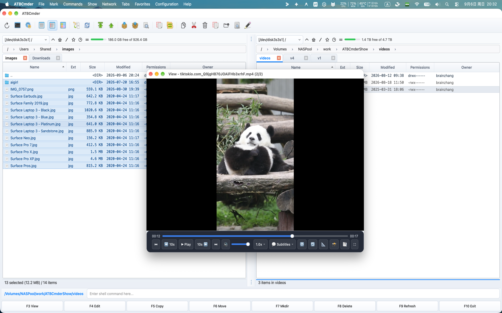

# Capítulo 4: Visor universal y editores integrados

En la gestión de archivos ortodoxa de doble panel, la velocidad depende en gran medida de la velocidad de inspección. Lanzar entornos de desarrollo integrados (IDE) pesados ​​o aplicaciones de escritorio infladas solo para verificar una suma de verificación, verificar una línea de configuración, recortar una captura de pantalla o inspeccionar un PDF crea fricción cognitiva y desorden de ventanas. 

ATBCmder resuelve esto proporcionando un subsistema unificado de visualización y edición de múltiples motores directamente integrado en el núcleo de la aplicación. Ya sea que necesite una vista previa en línea en tiempo real mientras se desplaza por las carpetas, un análisis forense profundo a nivel de bytes en modo hexadecimal, un reproductor de audio que continúa reproduciéndose en segundo plano mientras organiza archivos o un editor de código atómico y consciente de la sintaxis, ATBCmder le brinda control instantáneo del teclado. 

---

## 1. Inicio rápido visual: inspección y edición inmediata de archivos

ATBCmder divide la inspección y modificación de archivos en dos paradigmas distintos: 

1. **Vista rápida del panel opuesto (`Cmd+Q` / `Ctrl+Q`)**: incorpora una vista previa en vivo y sin rebotes directamente dentro del panel inactivo sin generar ventanas separadas. 
2. **Lister universal dedicado (`F3`) y editor interno (`F4`)**: abre ventanas independientes, no modales, que admiten motores de formatos especializados, búsqueda de texto completo, reproducción multimedia y resaltado de sintaxis. 

```
┌────────────────────────────────────────────────────────────────────────────────────────┐
│  ACTIVE PANEL (File Navigation)                     INACTIVE PANEL (Quick View)        │
│  /Users/brain/Projects/atbcmder/src                 [Quick View Preview: main.py]      │
├──────────────────────────────────────────────┬───┬─────────────────────────────────────┤
│  Name                         Size   Date    │   │ 0001: """                           │
│  ▸ [..]                              --:--   │ Q │ 0002: Main application entry point  │
│  ✔ main.py                    8.4 KB 15:10   │ U │ 0003: """                           │
│  ● config.xml                12.1 KB 14:20   │ I │ 0004: import sys                    │
│  ● hero_banner.png          248.5 KB 09:12   │ C │ 0005: from PySide6.QtWidgets import │
│  ● sample_invoice.pdf       512.0 KB 11:30   │ K │ 0006:     QApplication              │
│  ● release_theme.mp3          4.2 MB 16:45   │   │                                     │
│  ● firmware_dump.bin          1.0 MB 10:00   │ V │ [UTF-8] [Python] [LF] [Line 1/140]  │
├──────────────────────────────────────────────┴───┴─────────────────────────────────────┤
│   [Cmd+Q / Ctrl+Q] Toggle Quick View    [F3] Universal Lister    [F4] Internal Editor  │
└────────────────────────────────────────────────────────────────────────────────────────┘
```

### Hoja de trucos de inspección y edición de matriz dual

| Acción | Acceso directo a macOS | Llave de comandante clásica | ID de comando | Descripción | 
| :--- | :--- | :--- | :--- | :--- | 
| **Alternar vista rápida** | `Cmd+Q` / `⌘Q` | `Ctrl+Q` | `cm_QuickView` | Abre una vista previa en vivo en el panel opuesto. | 
| **Listador universal** | `F3` / `Fn+F3` | `F3` | `cm_View` | Abre el elemento seleccionado en Universal Lister. | 
| **Editor interno** | `F4` / `Fn+F4` | `F4` | `cm_Edit` | Abre el Editor de código para texto o el Editor de imágenes para gráficos. | 
| **Crear y editar nuevo archivo** | `Shift+F4` / `⇧F4` | `Shift+F4` | `cm_EditNew` | Solicita el nombre y abre el editor. | 
| **Enfoque del panel de interruptores** | `Tab` / `⇥` | `Tab` | `cm_SwitchPanel` | Cambia el enfoque; voltea la Vista rápida simétricamente. | 
| **Modo de vista hexadecimal** | `2` | `2` | — *(Lister)* | Alterna la inspección hexadecimal a nivel de bytes en Lister. | 
| **Modo de vista de texto** | `1` | `1` | — *(Lister)* | Devuelve Lister al modo de texto plano formateado. | 
| **Alternar ajuste de palabras** | `Alt+W` / `⌥W` | `Alt+W` | — *(Lister/Editor)* | Alterna el ajuste suave de líneas en Lister y Editor. | 
| **Alternar números de línea**| `Alt+L` / `⌥L` | `Alt+L` | — | Alterna los números de línea del margen izquierdo. | 
| **Modo de cola de registro en vivo** | `F5` / `Fn+F5` | `F5` | — | Transmite entradas de registro recién agregadas en tiempo real. | 
| **Audio de fondo** | `Background` Botón | — | — | Acopla la reproducción de audio a la barra de estado del panel. | 
| **Configurar asociaciones**| Menú de configuración | — | `cm_FileAssoc` | Configura extensiones de archivos y herramientas auxiliares. | 

---

## 2. Panel de vista rápida (`Cmd+Q` / `Ctrl+Q` / `cm_QuickView`)

El **Panel de vista rápida** es uno de los flujos de trabajo más potentes de los administradores de archivos ortodoxos. En lugar de abrir y cerrar ventanas flotantes mientras inspecciona una carpeta que contiene cientos de elementos, Vista rápida transforma el panel inactivo en una ventana gráfica contextual incrustada. 

 
*Figura 4.1: Vista rápida integrada en el panel opuesto que muestra código resaltado con sintaxis en vivo junto con la navegación del directorio.*

### 2.1 La ventaja de la vista previa de panel dual

Para activar la Vista rápida: 

1. Navegue a cualquier archivo o directorio en el panel activo. 
2. Presione **`Cmd+Q`** (`⌘Q`) en macOS o **`Ctrl+Q`** (`cm_QuickView`). 
3. El panel opuesto cambia instantáneamente de su lista de directorio normal al **Contenedor de vista rápida** (`QuickViewContainer`), mostrando el contenido del elemento debajo del cursor. 
4. Al presionar `Cmd+Q` o `Ctrl+Q` nuevamente se cierra la vista previa y se restaura la lista de pestañas y carpetas anteriores del panel opuesto sin perder su lugar.

### 2.2 Actualización en tiempo real sin rebotes de 100 ms

Al mantener presionadas las teclas de flecha `Up` o `Down` para desplazarse rápidamente por una carpeta de miles de archivos, las vistas previas de archivos estándar a menudo congelan la interfaz de usuario o provocan una intensa paliza del disco. 

ATBCmder resuelve esto mediante un **temporizador de rebote de un solo disparo de 100 milisegundos** interno (`_quick_view_timer`): 

- A medida que navega rápidamente por las filas, la ruta del archivo activo se almacena en la memoria. 
- La carga pesada de archivos, el análisis de sintaxis y la representación de miniaturas solo se activan una vez que el cursor se detiene en un elemento durante al menos 100 ms. 
- El desplazamiento se mantiene perfectamente fluido a más de 60 fotogramas por segundo, incluso cuando se exploran directorios multimedia de varios gigabytes o volcados de disco sin formato.

### 2.3 Inversión de enfoque simétrico en `Tab`

Un problema común en los administradores de panel dual es perder la vista previa al cambiar de panel. En ATBCmder, la Vista rápida incluye **Inversión de enfoque simétrico**: 

- Si la Vista rápida está activa en el Panel derecho y presiona **`Tab`** para cambiar el foco activo al Panel derecho: 
1. El Panel derecho restaura inmediatamente su tabla de archivos normal para que pueda interactuar con los archivos. 
2. Vista rápida cambia automáticamente y sin problemas al Panel izquierdo, mostrando una vista previa en vivo de cualquier archivo resaltado en el Panel derecho. 
- Esto mantiene un bucle de navegación e inspección ininterrumpido independientemente del panel en el que esté trabajando.

### 2.4 Enrutamiento inteligente de contenidos

El Quick View Container detecta dinámicamente extensiones de archivos, firmas MIME y encabezados de bytes sin formato para seleccionar el motor de vista previa óptimo: 

| Tipo de contenido | Extensiones / Firmas | Motor de vista previa integrado | 
| :--- | :--- | :--- | 
| **Código fuente y texto** | `.py`, `.rs`, `.cpp`, `.c`, `.h`, `.js`, `.ts`, `.html`, `.css`, `.json`, `.xml`, `.yaml`, `.md`, heurística de texto plano | `TextPanel` con resaltado de sintaxis de Pygments y números de línea. | 
| **Imágenes rasterizadas y vectoriales**| `.png`, `.jpg`, `.jpeg`, `.webp`, `.svg`, `.bmp`, `.gif`, `.ico`, `.tiff` | `ImagePanel` con reducción de resolución suave y preservación de la relación de aspecto. | 
| **Documentos PDF** | `.pdf` | `PdfPanel` con representación de página nativa `PySide6.QtPdf` (Ajustar al ancho). | 
| **Medios de audio y vídeo** | `.mp3`, `.wav`, `.flac`, `.aac`, `.m4a`, `.ogg`, `.mp4`, `.mkv`, `.mov`, `.avi`, `.webm` | `MediaPanel` con controles de reproducción y vista previa de audio silenciados. | 
| **Datos tabulares** | `.csv`, `.tsv`, `.xlsx`, `.xls`, `.ods` | `SpreadsheetPanel` con cuadrícula de tabla de solo lectura y tamaño automático de columnas. | 
| **Documentos y libros electrónicos** | `.docx`, `.odt`, `.rtf`, `.epub` | `DocumentPanel` / `EpubPanel` renderizador de documentos de texto enriquecido. | 
| **Archivos de base de datos** | `.sqlite`, `.sqlite3`, `.db` | `SqlitePanel` con navegador de esquemas y visor de datos de tablas. | 
| **Archivos** | `.zip`, `.tar`, `.gz`, `.bz2`, `.xz`, `.7z` | `ArchiveInspectorPanel` muestra jerarquías de miembros sin comprimir. |

### 2.5 Reserva de propiedad de metadatos (`QuickViewPropertiesWidget`)

Cuando resalta un directorio o un formato de archivo que no se puede representar como texto o medio, ATBCmder cambia automáticamente a la **Vista alternativa de propiedades** (`QuickViewPropertiesWidget`): 

```
┌────────────────────────────────────────────────────────┐
│  📁 release_builds                                     │
│  /Volumes/ExternalSSD/Projects/release_builds          │
├────────────────────────────────────────────────────────┤
│  Metadata                                              │
│    Full Path:      /Volumes/ExternalSSD/...            │
│    Size:           Directory (or 148,290,112 bytes)    │
│    Last Modified:  2026-09-06 14:10:22                 │
│    Last Accessed:  2026-09-06 15:02:18                 │
├────────────────────────────────────────────────────────┤
│  Permissions (UNIX)                                    │
│    Octal Mode: 0755                                    │
│    Owner:  [✔] Read  [✔] Write  [✔] Execute            │
│    Group:  [✔] Read  [ ] Write  [✔] Execute            │
│    Others: [✔] Read  [ ] Write  [✔] Execute            │
├────────────────────────────────────────────────────────┤
│  Checksums / Stats                                     │
│    Contents: 42 files, 8 folders                       │
│    MD5:      Calculating... ➔ 8f14e45fceea167a...      │
│    SHA256:   Calculating... ➔ 3a491d90bc1f4201...      │
└────────────────────────────────────────────────────────┘
```
 

- **Tarjeta de encabezado**: muestra el icono del sistema de alta resolución, el nombre del archivo y la ruta principal. 
- **Metadatos de archivo**: muestra el tamaño exacto de bytes, el tamaño legible por humanos (`KB`, `MB`, `GB`, `TB`), la marca de tiempo de modificación (`mtime`) y la marca de tiempo de acceso. (`atime`). 
- **Matriz de permisos UNIX**: muestra el modo de permiso octal de 4 dígitos (por ejemplo, `0755`, `0644`) junto con una matriz de casillas de verificación de 3x3 de solo lectura para propietario, grupo y otros (`rwx`). 
- **Hashes de fondo asincrónicos**: para archivos, un subproceso de fondo asincrónico (`HashWorker`) calcula hashes criptográficos MD5 y SHA-256 sin bloquear la interfaz. Para los directorios, escanea e informa el recuento agregado de archivos y subcarpetas anidados. 

---

## 3. Listador universal (`F3` / `Fn+F3` / `cm_View`)

Si bien Quick View está optimizado para vistas previas rápidas dentro de la ventana de panel dual, **Universal Lister** (`F3` / `Fn+F3` / `cm_View`) abre una ventana no modal dedicada de nivel superior (`UniversalViewerDialog`). Se pueden abrir varias ventanas de Universal Lister simultáneamente, lo que le permite comparar documentos uno al lado del otro o mantener registros en streaming en pantallas secundarias.

### Barra de herramientas superior de acción rápida

Lister cuenta con una barra de herramientas de acción rápida integrada que brinda acceso rápido a los modos de visualización, navegación y configuraciones de visualización: 

```
[Text (1)] [Hex (2)] [Wrap (Alt+W)] [Line Numbers (Alt+L)] [Tail (F5)] | [◀ Prev (P)] [Next ▶ (N)] | [🔍 Search (Ctrl+F)] [Go to Line (Ctrl+G)] | [Open in System (Ctrl+O)] [Fullscreen (F11)]
```
 

- **Modo de texto (`1`) / Modo hexadecimal (`2`)**: alterna instantáneamente entre la visualización de caracteres decodificados y la inspección de bytes sin procesar. 
- **Ajuste de palabras (`Alt+W` / `⌥W`)**: alterna el ajuste suave de palabras para líneas largas. 
- **Números de línea (`Alt+L` / `⌥L`)**: alterna el margen de numeración de líneas. 
- **Modo de cola (`F5`)**: se desplaza y captura automáticamente los datos de registro recién escritos en tiempo real. 
- **Archivo anterior (`P`)/Archivo siguiente (`N`)**: navega al archivo adyacente en la tabla de archivos de la carpeta principal sin cerrar la ventana del visor. 
- **Buscar (`Ctrl+F` / `Cmd+F`)**: abre la barra de búsqueda inferior acoplada. 
- **Ir a línea (`Ctrl+G` / `Cmd+G`)**: solicita un número de línea para saltar directamente al código de destino. 
- **Abrir en el sistema (`Ctrl+O` / `Cmd+O`)**: transfiere el archivo a la aplicación predeterminada del sistema macOS (por ejemplo, Vista previa, Safari o Xcode). 
- **Pantalla completa (`F11` / `Alt+Enter`)**: Maximiza la ventana del Lister para llenar la pantalla. 

---

### 3.1 Dominio 1: Documentos y libros estructurados

ATBCmder incorpora motores de diseño especializados para documentos estructurados, presentaciones de diapositivas, libros electrónicos y texto formateado, eliminando la necesidad de esperar a que se lancen paquetes de oficina externos.

#### 3.1.1 Documentos de Word y texto enriquecido (`DocumentPanel`)

Al presionar `F3` en archivos de Microsoft Word (`.docx`, `.doc`), texto enriquecido (`.rtf`) u OpenDocument (`.odt`), ATBCmder activa `DocumentPanel`: 

- **Tarjetas de páginas de documentos**: presenta páginas estructuradas en tarjetas de papel centradas (`.doc-page`) con tipografía nítida y márgenes que coinciden con los diseños de los procesadores de textos modernos. 
- **Preservación de formato**: conserva jerarquías de párrafos, estilos de negrita/cursiva/subrayado, variaciones de color de fuente, listas numeradas y desordenadas e hipervínculos en línea. 
- **Representación de tablas complejas y imágenes incrustadas**: analiza cuadrículas de tablas complejas de varias columnas con espaciado de celdas con bordes y representa ilustraciones rasterizadas en línea incrustadas. 
- **Zoom y búsqueda de página**: controles granulares de zoom de página (`Ctrl++` / `Ctrl+-` o cuadro de giro de zoom) y barra de búsqueda integrada en el documento (`ViewerSearchBar`).

#### 3.1.2 Presentación de diapositivas (`PresentationPanel`)

Para presentaciones de Microsoft PowerPoint (`.pptx`, `.ppt`), ATBCmder inicia `PresentationPanel`: 

- **Lector de tarjetas de diapositivas**: cada diapositiva se extrae y se formatea como una tarjeta de presentación sombreada distinta (`.slide-card`), lo que le permite revisar el contenido de forma secuencial. 
- **Selector de diapositivas**: un cajón de navegación visual enumera todas las diapositivas con índices en miniatura, lo que le permite saltar instantáneamente a cualquier diapositiva en una plataforma de 100 diapositivas. 
- **Búsqueda de diapositivas**: presione `Cmd+F` para buscar títulos de diapositivas, viñetas, notas del orador y bloques de texto destacado en toda la plataforma.

#### 3.1.3 Visor de documentos PDF (`PdfPanel`)

Con tecnología nativa de `PySide6.QtPdf` y `QPdfView`, ATBCmder incorpora un lector de PDF de nivel empresarial: 

 
*Figura 4.2: Visor de PDF integrado que presenta un esquema de marcadores, una franja de miniaturas de páginas, búsqueda en documentos y temas de lectura.* 

- **Desplazamiento continuo de varias páginas**: desplácese sin problemas por cientos de páginas en modo de varias páginas (`QPdfView.PageMode.MultiPage`), o cambie a vistas de libro de una o dos páginas. 
- **Barra lateral del documento**: 
- *Esquema/Árbol de marcadores*: haga clic en cualquier encabezado de capítulo o sección en la tabla de contenido del PDF (`QPdfBookmarkModel`) para saltar directamente a esa sección. 
- *Tira de miniaturas de página*: escanea visualmente el diseño y los elementos gráficos a través de la lista de miniaturas verticales (`PdfThumbnailList`). 
- **Búsqueda y resaltado en documentos**: presione `Cmd+F` para buscar texto en todo el documento. Las coincidencias se resaltan en pantalla con indexación de ocurrencias en tiempo real (`Match 3 of 28`). Salte entre ocurrencias con `Enter` o `Shift+Enter`. 
- **Temas de lectura**: 
- *Normal*: Representación en papel de documento estándar. 
- *Modo nocturno invertido*: invierte la luminancia de los píxeles RGB (`InvertColorEffect`) para una lectura cómoda en entornos oscuros sin fatiga visual. 
- *Sepia Warmth*: Tono suave y cálido que reduce la emisión de luz azul durante la revisión prolongada de documentos. 
- **Seguridad y cifrado**: solicita contraseñas sin problemas en archivos PDF cifrados a través de `PdfPasswordDialog` e inspecciona los metadatos del creador/productor a través de `PdfPropertiesDialog`.

#### 3.1.4 Libros electrónicos EPUB (`EpubPanel`)

La gestión de documentación técnica, manuales o libros digitales en formato EPUB (`.epub`) es nativa de ATBCmder: 

- **Arquitectura de motor dual**: Emplea un renderizador WebEngine de alta fidelidad (`QWebEngineView` con `EpubUrlSchemeHandler` para estilos CSS enriquecidos e ilustraciones vectoriales SVG) con un respaldo automático a `QTextBrowser` en entornos mínimos. 
- **Barra lateral de tabla de contenido**: muestra árboles de capítulos anidados (`QTreeView`), lo que permite saltar con un solo clic entre capítulos de libros y apéndices. 
- **Tipografía y escala de fuente**: escale dinámicamente el tamaño del texto de lectura mediante el control deslizante de fuente de la barra de herramientas inferior. 
- **Temas de comodidad de lectura**: alternancia instantánea entre paletas de colores claro, oscuro y sepia.

#### 3.1.5 Documentos de rebajas (`MarkdownPanel`)

Para archivos README, notas técnicas y documentación para desarrolladores (`.md`, `.markdown`): 

- **Markdown con sabor a GitHub (GFM)**: representa encabezados, citas en bloque, reglas horizontales, listas de tareas (`- [x]`) y tablas de varias columnas. 
- **Estilo de sintaxis de bloque de código**: formatea automáticamente bloques de código delimitados (```python, ```bash, ```json) con distintos sombreados de fondo, tipografía monoespaciada y colores de sintaxis. 

---

### 3.2 Dominio 2: datos, tablas y tiempos de ejecución del desarrollador

Para usuarios técnicos, analistas de datos e ingenieros de software, ATBCmder proporciona herramientas de inspección de datos instantáneas y fuera de línea que eliminan la sobrecarga de clientes de bases de datos externos o aplicaciones de hojas de cálculo.

#### 3.2.1 Hojas de cálculo de alto rendimiento (`SpreadsheetPanel`)

Abrir archivos CSV de gran tamaño o libros de Excel de varias hojas en paquetes de oficina pesados ​​puede tardar entre 10 y 20 segundos. `SpreadsheetPanel` de ATBCmder los renderiza instantáneamente: 

 
*Vista previa de hojas de cálculo de Excel de alto rendimiento en Universal Lister con pestañas de varias hojas y coordenadas congeladas* 

- **Compatibilidad de formato**: Microsoft Excel (`.xlsx`, `.xls`), valores separados por comas (`.csv`) y valores separados por tabulaciones (`.tsv`). 
- **Pestañas de varias hojas**: los libros con varias hojas cuentan con una barra de pestañas inferior (`QTabBar`), lo que permite un cambio rápido entre hojas de datos. 
- **Modelo de tabla virtual (`VirtualSpreadsheetModel`)**: utiliza carga de filas incremental diferida mediante `canFetchMore` y `fetchMore`. Puede desplazarse por archivos CSV u hojas de trabajo con cientos de miles de filas sin problemas y con un uso mínimo de memoria. 
- **Encabezados de columnas y filas congelados**: las coordenadas de la hoja de cálculo estándar (`A, B, C...` y `1, 2, 3...`) permanecen fijadas durante el desplazamiento para una orientación clara. 
- **Exportación TSV del portapapeles**: seleccione cualquier rango de celdas y presione **`Cmd+C`** (`⌘C`) para copiar datos formateados como valores limpios separados por tabulaciones listos para pegar en código, Slack o tuberías terminales. 
- **Búsqueda rápida**: presione `Cmd+F` para buscar el contenido de las celdas en todas las columnas con enfoque de celda en tiempo real.

#### 3.2.2 Explorador de bases de datos SQLite (`SqlitePanel`)

Inspeccione las bases de datos SQLite (`.sqlite`, `.sqlite3`, `.db`) directamente sin clientes GUI externos: 

- **Directorio de tablas y vistas**: la barra lateral izquierda enumera todas las tablas y vistas de la base de datos junto con sus recuentos de filas activas. Al hacer clic en cualquier tabla se carga su contenido inmediatamente. 
- **Vista de datos virtualizados**: utiliza el `VirtualSpreadsheetModel` de alto rendimiento para desplazarse sin problemas a través de tablas masivas. 
- **Consola interactiva de consultas SQL**: escriba consultas SQL personalizadas en el editor de consultas superior y presione **`Ctrl+Return`** (o `Cmd+Return`) para ejecutar. Los resultados aparecen en la vista de tabla al instante. 
- **Formato de tipo de datos**: maneja los datos de forma segura: formatea los blobs binarios como `<BLOB: N B>` y muestra los campos vacíos como `NULL` en cursiva. 
- **Exportar datos**: haga clic derecho para copiar registros seleccionados o exportar resultados de consultas a CSV o TSV.

#### 3.2.3 Cuadernos Jupyter (`NotebookPanel`)

Revise experimentos de ciencia de datos, ejecuciones de aprendizaje automático y cuadernos de análisis de Python (`.ipynb`): 

- **Representación nativa de servidor cero**: analiza estructuras de cuadernos JSON completamente fuera de línea sin necesidad de un demonio de servidor Jupyter o JupyterLab activo. 
- **Diseño de celda basado en tarjeta**: 
- *Celdas de rebajas*: renderizadas en tipografía limpia con títulos, texto en negrita y listas. 
- *Celdas de código*: formateado con código Python resaltado con sintaxis, números de línea e insignias de ejecución de celda (por ejemplo, `[1]`, `[14]`). 
- *Bloques de salida*: muestra flujos de salida de la consola, rastreos de errores y tablas y gráficos codificados en base64 en línea (PNG/SVG).

#### 3.2.4 Visualización de código y texto sin formato (`TextPanel`)

El motor de inspección de texto principal está optimizado para navegación de alta velocidad y grandes volcados de datos: 

- **Cargador fragmentado de 64 KB (`FileLoaderWorker`)**: lee archivos grandes en bloques de 64 KB con ajuste automático de límites de nueva línea, lo que evita la congelación de subprocesos y la corrupción de caracteres multibyte UTF-8. 
- **Resaltado de sintaxis de pigmentos**: más de 150 lenguajes de programación y configuración compatibles con adaptación dinámica del modo claro/oscuro. 
- **Conmutador de codificación dinámica**: Detección estadística de juegos de caracteres (`chardet`) con cambio manual de la barra de estado entre UTF-8, GB18030, Big5, Shift-JIS, Windows-1252 e ISO-8859-1. 
- **Modo Live Tail (`F5`)**: active `FileTailWatcher` para transmitir líneas de registro adjuntas en tiempo real, que coincidan con UNIX `tail -f`. Presione `F5` nuevamente para hacer una pausa.

#### 3.2.5 Inspección de bytes hexadecimales sin formato (`2` / modo hexadecimal)

Al inspeccionar archivos binarios, volcados de firmware, bibliotecas compiladas o archivos dañados: 

- **Cuadrícula hexadecimal de 16 bytes**: muestra direcciones de desplazamiento hexadecimal de 8 dígitos, 16 bytes hexadecimales divididos en dos columnas visuales de 8 bytes y texto ASCII imprimible a la derecha (`.` para bytes de control). 
- **Detección automática hexadecimal**: si se detectan bytes nulos (`\x00`) dentro del primer KB de un archivo, ATBCmder cambia automáticamente al modo hexadecimal para evitar la confusión del terminal. 

---

### 3.3 Dominio 3: Medios y activos del sistema

ATBCmder incluye reproductores multimedia acelerados por hardware, visores de gráficos e inspectores de tipografía integrados directamente en el núcleo.

#### 3.3.1 Visor de imágenes (`ImagePanel`)

Presione `F3` en cualquier formato de imagen compatible (`.png`, `.jpg`, `.webp`, `.svg`, `.gif`, `.bmp`, `.ico`, `.tiff`): 

 
*Figura 4.3: Visor de imágenes integrado con zoom de lienzo interactivo, rotación y extracción de metadatos EXIF.* 

- **Lienzo interactivo**: zoom suave con la rueda del mouse anclado a la posición del cursor (`SmoothPixmapTransform`), inspección de píxeles 1:1, Ajustar a la ventana y barrido manual con arrastre. 
- **Inspector de telemetría EXIF**: al hacer clic en **Información EXIF**, se extraen los metadatos de la cámara: marca, modelo, distancia focal de la lente, tiempo de exposición, apertura, ISO y coordenadas GPS. 
- **Escena de transparencia de tablero de ajedrez (`CheckerboardScene`)**: los canales alfa transparentes en imágenes PNG, WebP y SVG se representan sobre una cuadrícula de tablero de ajedrez gris y blanco estándar de la industria.

#### 3.3.2 Reproductor de audio y modo de reproducción en segundo plano (`AudioPlayerDialog`)

Reproduzca podcasts, efectos de sonido o colecciones de música mientras trabaja: 

 
*Figura 4.4: Reproductor de audio integrado que presenta análisis de etiquetas ID3, carátulas de álbumes y administración de listas de reproducción de arrastrar y soltar.* 

- **Formatos admitidos**: MP3, FLAC, WAV, AAC, M4A, OGG y AIFF con etiqueta ID3 de mutágeno y extracción de portada. 
- **Modo de reproducción en segundo plano**: haga clic en el botón **Fondo** en el reproductor. La ventana del reproductor se acopla a un **controlador de minirreproductor** compacto en la barra de operaciones en segundo plano del panel derecho (`bg_ops_container`): 
- Muestra el título y el artista de la pista que se está reproduciendo actualmente. 
- Botones de reproducción interactiva: Anterior (`⏮`), Reproducir/Pausar (`▶` / `⏸`) y Siguiente (`⏭`). 
- La música se reproduce ininterrumpidamente mientras explora archivos, ejecuta cambios de nombre por lotes o sincroniza carpetas. 
- ¡Al presionar `F3` en archivos de audio adicionales en el panel de archivos, se agregan automáticamente a la lista de reproducción en ejecución! 

 
*Figura 4.5: Minirreproductor de fondo integrado directamente en la barra de operaciones del panel.*

#### 3.3.3 Reproductor de vídeo acelerado por hardware (`MediaPanel`)

Para archivos de vídeo (`.mp4`, `.mkv`, `.mov`, `.avi`, `.webm`): 

 
*Figura 4.6: Reproductor de video acelerado por hardware con controles de visualización en pantalla flotante (OSD).* 

- **Decodificación sin gastos generales**: Desarrollado por `QtMultimedia` utilizando macOS VideoToolbox y aceleración de GPU Apple Silicon. 
- **Controles OSD con desvanecimiento automático**: el control flotante de la línea de tiempo, el control deslizante de volumen y los controles de reproducción se desvanecen durante la reproducción. 
- **Cambio de subtítulos y pistas**: cambie entre transmisiones de audio integradas y archivos de subtítulos externos (`.srt`, `.vtt`). 
- **Modo de pantalla completa**: Presione **`F11`** o haga doble clic para ingresar a pantalla completa; presione `Esc` para regresar.

#### 3.3.4 Inspector de tipografía de fuentes (`FontPanel`)

Vista previa del sistema y fuentes de diseño (`.ttf`, `.otf`, `.woff`, `.woff2`, `.ttc`): 

- **Vistas previas de tamaño en cascada**: presenta texto de vista previa en tamaños de puntos de diseño estándar: 12, 16, 20, 24, 32, 48 y 64 pt. 
- **Cadena de prueba personalizada**: ingrese cadenas personalizadas para probar el interletraje y la puntuación de caracteres específicos. 
- **Pangramas bilingües**: la vista previa predeterminada muestra pangramas bilingües completos: *"El rápido zorro marrón salta sobre el perro perezoso 1234567890 敏捷的棕狐跃过懒狗"*. 

---

### 3.4 Dominio 4: Comunicaciones y archivos del sistema

#### 3.4.1 Inspector de archivos incluidos en la lista (`ArchivePanel`)

Mientras presiona `Enter`, se abren archivos directamente en el panel de archivos a través de Archive VFS, al presionar **`F3`** en un archivo (`.zip`, `.tar`, `.7z`, `.tar.gz`, `.tar.bz2`, `.tar.xz`) abre el **Inspector de archivo**: 

- Inspeccione jerarquías de directorios internos, recuentos de miembros, tamaños de bytes sin comprimir, tamaños de bytes comprimidos y relaciones de compresión en una vista de árbol rápida y de solo lectura.

#### 3.4.2 Visor de archivos de correo electrónico (`EmailPanel`)

Para comunicaciones por correo electrónico guardadas y archivos de mensajes (`.eml`, `.msg`): 

- **Decodificación de encabezado MIME RFC 2047**: decodifica con precisión nombres de remitentes internacionales, fechas, destinatarios CC y asuntos de correo electrónico. 
- **Tarjeta de encabezado visual**: formatea los encabezados de correo electrónico en una tarjeta de metadatos limpia. 
- **Alternar cuerpo enriquecido**: cambia entre cuerpos de correo electrónico HTML formateados y texto sin formato. 
- **Extracción de archivos adjuntos**: enumera todos los archivos adjuntos incrustados con tamaños de archivo y proporciona un botón **"Guardar archivo adjunto como..."** para extraer archivos directamente al disco. 

---

## 4. Editores internos: arquitectura de modo dual (`F4` / `Fn+F4` / `cm_Edit`)

ATBCmder presenta un **motor de despacho de editor de modo dual** inteligente: 

- **Cuando el cursor está en archivos de texto, código o configuración**: Al presionar `F4` se abre el **Editor de código interno** (`EditorWindow`). 
- **Cuando el cursor está en archivos de imagen (`.png`, `.jpg`, `.webp`, `.bmp`, `.svg`)**: Al presionar `F4` se inicia automáticamente el **Editor de imágenes dedicado** (`ImageEditorDialog`)! 

Para crear y editar un archivo nuevo desde cero en la carpeta activa, presione **`Shift+F4`** (`cm_EditNew`). ATBCmder le solicita un nombre de archivo (por ejemplo, `deploy.sh` o `docker-compose.yml`), inicializa el archivo y lo abre inmediatamente en el editor. 

---

### 4.1 Editor de Código Interno (`EditorWindow`)

```
┌────────────────────────────────────────────────────────────────────────────────────────┐
│  Edit: /Users/brain/Projects/atbcmder/scripts/deploy.sh [*]                            │
├────────────────────────────────────────────────────────────────────────────────────────┤
│  [💾 Save] [Save As] | [↶ Undo] [↷ Redo] | [🔍 Find] [Replace] | [Wrap] [Lines] [Zoom]   │
├──────┬─────────────────────────────────────────────────────────────────────────────────┤
│ 0001 │ #!/usr/bin/env bash                                                             │
│ 0002 │ set -euo pipefail                                                               │
│ 0003 │                                                                                 │
│ 0004 │ echo "Deploying ATBCmder release bundle..."                                     │
│ 0005 │ TARGET_DIR="/opt/atbcmder"                                                      │
│ 0006 │ if [ ! -d "$TARGET_DIR" ]; then                                                 │
│ 0007 │     mkdir -p "$TARGET_DIR"                                                      │
│ 0008 │ fi                                                                              │
├──────┴─────────────────────────────────────────────────────────────────────────────────┤
│  Find: [deploy                  ]  Replace: [release                  ] [Match 1 of 3] │
│  [Aa] Match Case   [\b] Whole Word   [.*] RegEx   [Find Next] [Replace] [Replace All]  │
├────────────────────────────────────────────────────────────────────────────────────────┤
│  Line 5, Col 12 | 8 lines | UTF-8 | LF (UNIX) | Bash Shell | [Modified *]              │
└────────────────────────────────────────────────────────────────────────────────────────┘
```

#### Capacidades principales del editor de código

- **Resaltado de sintaxis de Pygments**: reconoce más de 150 formatos de programación, secuencias de comandos y configuración con detección automática de idioma a partir de extensiones de archivos y líneas shebang. 
- **Margen dinámico de números de línea**: el margen izquierdo se expande dinámicamente para acomodar los números de línea con alineación visual. 
- **Sangría automática inteligente y sangría en bloque**: Al presionar `Enter`, se transfieren espacios en blanco de sangría; seleccione bloques y presione `Tab` para sangrar o `Shift+Tab` para quitar la sangría.
 - **Ajuste suave de Word (`Alt+W` / `⌥W`)**: ajusta líneas largas en los límites de la ventana sin insertar saltos de nueva línea estrictos.
 - **Controles de zoom**: escale la tipografía sin esfuerzo usando `Cmd++` (`⌘+`), `Cmd+-` (`⌘-`), o restablezca con `Cmd+0` (`⌘0`).

#### Barra interactiva de buscar y reemplazar (`EditorReplaceBar`)

Al presionar **`Cmd+F`** (`⌘F`) o **`Cmd+Option+F`** (`⌥⌘F`) se acopla la barra Buscar y reemplazar en la parte inferior: 

- Búsqueda incremental en tiempo real con indexación de ocurrencias (`Match 4 of 19`). 
- Indicadores de búsqueda: distingue entre mayúsculas y minúsculas (`[Aa]`), palabras completas (`[\b]`) y expresiones regulares de Python (`[.*]`). 
- Acciones por lotes: **Reemplazar** (ocurrencia actual) y **Reemplazar todo** (documento completo).

#### Barra de estado y protección de guardado atómico

- **Telemetría**: muestra líneas, columnas, recuento total de líneas, codificación y convención de nueva línea (`LF` frente a `CRLF`). 
- **Insignia de estado sucio**: aparece un indicador destacado `*` en la barra de título y en la barra de estado siempre que existen ediciones no guardadas. 
- **Protección de guardado atómico**: al presionar `Cmd+S`, ATBCmder escribe datos en un archivo temporal en el mismo volumen, sincroniza los buffers de disco y ejecuta un reemplazo atómico, lo que garantiza que su archivo original nunca se corrompa si se produce un fallo o un corte de energía durante el guardado. 

---

### 4.2 Editor de imágenes dedicado (`ImageEditorDialog`)

Cuando presiona **`F4`** en cualquier gráfico o captura de pantalla, ATBCmder abre el completo **Editor de imágenes**:

#### Lienzo interactivo y transformaciones

- **Fondo de tablero de ajedrez (`CheckerboardScene`)**: los gráficos transparentes se representan sobre una cuadrícula limpia en gris y blanco, lo que garantiza que los bordes alfa sean claramente visibles. 
- **Rotación y volteo**: gire 90° en sentido horario o antihorario, ajuste ángulos de nivelación arbitrarios o refleje horizontal y verticalmente. 
- **Zoom y panorámica**: zoom suave con seguimiento del cursor y navegación con arrastre manual.

#### Recortar con ajustes preestablecidos de relación de aspecto

- Arrastre los controladores del lienzo para definir los límites del recorte. 
- Cambie entre las relaciones de aspecto **Forma libre**, **Cuadrado 1:1** (avatares/íconos de aplicaciones), **4:3 Clásico** y **Cine 16:9**. Presione `Enter` para presentar la solicitud.

#### Anotaciones vectoriales

- **Rectángulos y círculos**: resalte elementos de la interfaz con anchos de borde personalizados y colores de paleta. 
- **Flechas direccionales**: dibuja flechas de llamada vectoriales nítidas. 
- **Pluma a mano alzada**: dibuja correcciones o firmas a mano alzada directamente en el lienzo. 
- **Sellos de texto**: agregue tipografía con fuentes, tamaños, colores y sombras sutiles personalizables.

#### Redacción de privacidad (mosaico/desenfoque)

¿Necesita compartir una captura de pantalla que contenga tokens confidenciales, nombres de clientes o números de teléfono? 

- Selecciona la herramienta **Mosaico / Desenfoque**. 
- Arrastre un cuadro de selección sobre la información confidencial. 
- ATBCmder aplica pixelación de radio variable o desenfoque gaussiano, redactando de forma segura datos confidenciales antes de exportarlos.

#### Módulo de marca de agua

Aplique la marca de propiedad profesional utilizando 4 ubicaciones preestablecidas: 

- **Alicatado (`tiled`)**: patrón de marca de agua repetido y en ángulo que cubre todo el lienzo (ideal para borradores confidenciales). 
- **Sello (`stamp`)**: Sello de autenticación distintivo colocado en la esquina inferior derecha. 
- **Banner (`banner`)**: Banner de marca horizontal semitransparente que atraviesa el lienzo. 
- **Logotipo único (`single`)**: logotipo único o marca de agua de texto que se puede colocar libremente con control deslizante de opacidad. 

---

### 4.3 Edición VFS de ida y vuelta sin interrupciones (remota y archivos)

El aspecto más poderoso del subsistema de edición de ATBCmder es su **Integración Universal VFS**: 

- Ya sea que presione `F4` en un script de shell almacenado en un servidor SFTP remoto, un archivo de configuración dentro de un montaje WebDAV de AWS Nextcloud o una captura de pantalla dentro de un archivo anidado `.zip` (`vfs://`): 
1. ATBCmder descarga el archivo de forma asincrónica a un entorno limitado temporal seguro. 
2. El archivo se abre en `EditorWindow` o `ImageEditorDialog`. 
3. Cuando presiona `Cmd+S`, ATBCmder intercepta el evento de guardado, sincroniza el archivo modificado y transmite automáticamente los datos actualizados a través de SFTP/SMB o activa `RepackWorker` para volver a empaquetar el archivo. 
4. Al cerrar el editor, los archivos de caché temporales se eliminan limpiamente. Nunca tendrás que descomprimir, editar y volver a cargar archivos manualmente. 

---

## 5. ⚡ Consejos profesionales y análisis profundo

Domine estas funciones avanzadas para maximizar su eficiencia de inspección y edición.

### Consejo profesional 1: ingesta dinámica de cola de audio con `F3`

Cuando tienes el reproductor de audio ejecutándose en **Modo de reproducción en segundo plano** mientras exploras tu colección de música, no necesitas volver a abrir el cuadro de diálogo para poner en cola más música: 

1. Resalte uno o más archivos de audio en cualquiera de los paneles de archivos. 
2. Presione **`F3`** (o `Fn+F3`). 
3. ATBCmder detecta que una instancia de reproductor de audio ya está activa y automáticamente **agrega las pistas seleccionadas** a la lista de reproducción en ejecución (`append_tracks`) sin interrumpir la pista que se está reproduciendo actualmente.

### Consejo profesional 2: asociaciones de archivos personalizadas (`cm_FileAssoc`)

De forma predeterminada, al presionar `F3` se abre Universal Lister y `F4` se abre el Editor de código interno. Sin embargo, puede asignar extensiones de archivos específicas a aplicaciones de escritorio externas o comandos de shell personalizados utilizando el **Administrador de asociaciones de archivos** (`cm_FileAssoc`): 

Navegue hasta **Configuración ➔ Configuración de asociaciones de archivos**: 

- Puede asignar extensiones (por ejemplo, `*.rs`, `*.py`, `*.psd`) a acciones personalizadas. 
- **Comandos internos**: Vinculado a acciones del comandante interno (por ejemplo, `cm_View`, `cm_Edit`). 
- **Comandos de Shell externos con sustitución de token**: 
- `%f` ➔ Reemplazado por la ruta absoluta del archivo (por ejemplo, `/Users/brain/main.rs`). 
- `%d` ➔ Reemplazado por la ruta del directorio principal (por ejemplo, `/Users/brain`). 
- `%n` ➔ Reemplazado por el nombre del archivo sin extensión (por ejemplo, `main`). 
- `%e` ➔ Reemplazado por la extensión de archivo sin punto (por ejemplo, `rs`). 

*Ejemplo de asociación externa para archivos Rust:* 
```bash
code --goto %f
```

### Consejo profesional 3: modo Live Tail (`F5`) para registros de DevOps

Al depurar demonios del servidor local, contenedores Docker o scripts de compilación, abra el archivo de registro en Universal Lister (`F3`) y presione **`F5`**: 

- Activa el demonio `FileTailWatcher`. 
- Lister se desplaza automáticamente hacia la parte inferior y transmite las líneas recién agregadas a la pantalla en tiempo real, coincidiendo con el comportamiento de UNIX `tail -f`. 
- Puede mantener activos los filtros de búsqueda mientras los sigue para resaltar los errores a medida que ocurren.

### Consejo profesional 4: transmisión con desplazamiento arbitrario para archivos de varios gigabytes

Si necesita inspeccionar un volcado de base de datos o una imagen de disco de 20 GB, no intente abrirlo en un editor estándar. En el Lister universal de ATBCmder: 

- Utilice **Ir a línea (`Ctrl+G`)** o salte los controles deslizantes. 
- El `FileLoaderWorker` subyacente utiliza búsquedas directas de puntero de archivos binarios (`fh.seek(offset)`), leyendo solo el bloque exacto de 64 KB necesario para representar la vista. 
- Puede inspeccionar sectores arbitrarios de un volumen de varios terabytes instantáneamente sin sobrecarga de memoria. 

---

## 6. Recetas prácticas paso a paso

### Receta 1: inspeccionar y redactar una captura de pantalla confidencial

**Objetivo**: capturaste una captura de pantalla que contiene tokens API confidenciales o información del cliente y necesitas redactarla antes de subirla a un rastreador de problemas público. 

```
Step 1: Highlight screenshot.png in the active panel and press F3 (Universal Lister).
Step 2: On the top toolbar, click "Edit Image" to launch the Image Editor.
Step 3: Select the "Mosaic / Blur" tool from the tool palette.
Step 4: Click and drag a selection rectangle over the API token to pixelate the text.
Step 5: Select the "Crop" tool, frame the relevant portion of the window, and press Enter.
Step 6: Click "Save" (Cmd+S) to overwrite, or "Save As" to create screenshot_redacted.png.
Step 7: Press Esc to close the editor; your clean image is ready in the file panel.
```
 

---

### Receta 2: Monitoreo de registros en vivo e inspección forense hexagonal

**Objetivo**: Un proceso en segundo plano falla con un error de codificación. Debe observar el registro en vivo e inspeccionar los bytes sin procesar alrededor de una secuencia con formato incorrecto. 

```
Step 1: Highlight server.log in the active panel and press F3.
Step 2: Press F5 to activate Tail Mode. Watch incoming live log entries stream past.
Step 3: When the error appears, press F5 again to pause tailing.
Step 4: Press Ctrl+F and search for the error code (e.g. "0xEF").
Step 5: Press 2 on your keyboard to switch into Hex Mode.
Step 6: Inspect the exact 16-byte hexadecimal dump to examine unprintable control characters.
Step 7: Press 1 to return to formatted text mode, or Esc to close.
```
 

---

### Receta 3: Creación rápida de código fuente y puesta en escena de Git

**Objetivo**: crear un nuevo script de shell en el repositorio de su proyecto actual, configurar encabezados bash estándar y prepararlo para su ejecución sin salir de ATBCmder. 

```
Step 1: In the active directory, press Shift+F4 (cm_EditNew).
Step 2: In the dialog prompt, type "build_release.sh" and press Enter.
Step 3: The Internal Code Editor opens immediately with an empty buffer.
Step 4: Type your script. Notice that auto-indent automatically indents loops and if-blocks:
        #!/usr/bin/env bash
        set -euo pipefail
        echo "Building binaries..."
Step 5: Press Cmd+S (⌘S) to save the file atomically to disk.
Step 6: Press Cmd+W (⌘W) to close the editor.
Step 7: With build_release.sh highlighted in the panel, press Alt+Enter (cm_SetFileProperties).
Step 8: Check the "Execute" permission for Owner (chmod +x) and press Enter.
```
 

---

## 7. Alertas de seguridad y sistema

> [!ADVERTENCIA] 
> **Vigilantes de modificaciones externas** 
> Si una aplicación externa modifica o trunca un archivo abierto mientras trabaja en el Editor interno (`F4`), ATBCmder muestra una advertencia de conflicto de cambio externo antes de guardarlo. Elija siempre **Recargar** para inspeccionar la última versión del disco o **Guardar como** para conservar sus modificaciones locales en un archivo separado. 

> [!IMPORTANTE] 
> **Seguridad de archivos binarios: modo texto versus modo hexadecimal** 
> Abrir un archivo binario desconocido en modo texto y guardarlo nuevamente en el disco puede dañar permanentemente el archivo debido a los reemplazos de decodificación UTF-8 (`\ufffd`). Universal Lister de ATBCmder es de solo lectura de forma predeterminada, lo que garantiza que sus archivos binarios nunca se sobrescriban accidentalmente durante la inspección. 

> [!PRECAUCIÓN] 
> **Vista rápida del rendimiento en recursos compartidos de red remota** 
> Al explorar servidores remotos de alta latencia (FTP, SFTP o WebDAV) con la Vista rápida (`Cmd+Q`) activa, la vista previa de archivos remotos masivos de video o archivos activará la transmisión remota. Si el ancho de banda de la red es limitado, desactive la Vista rápida (`Cmd+Q`) para explorar los árboles de directorios a toda velocidad. 

> [!CONSEJO] 
> **Accesibilidad de teclas de función de macOS** 
> En los MacBooks y Magic Keyboards de Apple modernos, las teclas de función (`F1`-`F12`) están asignadas de forma predeterminada a controles de hardware (brillo, reproducción multimedia). Para activar `F3` o `F4`, mantenga presionada la tecla **`Fn`** (por ejemplo, `Fn+F3`, `Fn+F4`). Alternativamente, habilite **"Usar teclas F1, F2, etc. como teclas de función estándar"** en macOS *Configuración del sistema ➔ Teclado ➔ Atajos de teclado ➔ Teclas de función*. 

---

## 8. Tabla de referencia del teclado de matriz dual

| Área Funcional | Descripción de la acción | Acceso directo a macOS | Llave de comandante clásica | ID de comando | 
| :--- | :--- | :--- | :--- | :--- | 
| **Vista rápida** | Alternar vista previa del panel opuesto | `Cmd+Q` / `⌘Q` | `Ctrl+Q` | `cm_QuickView` | 
| **Vista rápida** | Panel de conmutación y vista previa de giro | `Tab` / `⇥` | `Tab` | `cm_SwitchPanel` | 
| **Listador** | Abrir archivo en Universal Lister | `F3` / `Fn+F3` | `F3` | `cm_View` | 
| **Listador** | Modo de visualización de texto sin formato | `1` | `1` | — *(Lister)* | 
| **Listador** | Modo de visualización hexadecimal sin formato | `2` | `2` | — *(Lister)* | 
| **Listador** | Alternar ajuste de palabras | `Alt+W` / `⌥W` | `Alt+W` | — *(Lister/Editor)* | 
| **Listador** | Alternar números de línea | `Alt+L` / `⌥L` | `Alt+L` | — *(Lister/Editor)* | 
| **Listador** | Alternar modo de cola de registro en vivo | `F5` / `Fn+F5` | `F5` | — *(Lister)* | 
| **Listador** | Archivo anterior en el directorio | `P` | `P` | — *(Lister)* | 
| **Listador** | Siguiente archivo en el directorio | `N` | `N` | — *(Lister)* | 
| **Listador** | Buscar texto | `Cmd+F` / `⌘F` | `Ctrl+F` | — *(Lister/Editor)* | 
| **Listador** | Ir al número de línea | `Cmd+G` / `⌘G` | `Ctrl+G` | — *(Lister/Editor)* | 
| **Listador** | Abrir en la aplicación predeterminada del sistema | `Cmd+O` / `⌘O` | `Ctrl+O` | — *(Lister)* | 
| **Listador** | Alternar pantalla completa | `F11` / `Fn+F11` | `F11` | `cm_FullScreen` | 
| **Editor** | Editar archivo seleccionado (Código/Imagen) | `F4` / `Fn+F4` | `F4` | `cm_Edit` | 
| **Editor** | Crear y editar un nuevo archivo | `Shift+F4` / `⇧F4` | `Shift+F4` | `cm_EditNew` | 
| **Editor** | Guardar archivo (atómico) | `Cmd+S` / `⌘S` | `Ctrl+S` | — | 
| **Editor** | Guardar archivo como | `Shift+Cmd+S` / `⇧⌘S` | `F12` | — | 
| **Editor** | Recargar / Revertir Archivo | `Cmd+R` / `⌘R` | `Ctrl+R` | — | 
| **Editor** | Cerrar ventana del editor | `Cmd+W` / `⌘W` | `Esc` | — | 
| **Editor** | Buscar en Documento | `Cmd+F` / `⌘F` | `Ctrl+F` | — | 
| **Editor** | Buscar y reemplazar | `Cmd+Option+F` / `⌥⌘F` | `Ctrl+H` | — | 
| **Editor** | Sangrar bloque seleccionado | `Tab` / `⇥` | `Tab` | — | 
| **Editor** | Bloque seleccionado sin sangría | `Shift+Tab` / `⇧⇥` | `Shift+Tab` | — | 
| **Editor** | Acercar / Alejar / Restablecer | `⌘+` / `⌘-` / `⌘0` | `Ctrl++` / `Ctrl+-` / `Ctrl+0` | — | 
| **Medios** | Reproducción de audio en segundo plano | Haga clic en `Background` | — | — | 
| **Medios** | Agregar audio a la lista de reproducción | `F3` (al jugar) | `F3` | `cm_View` | 
| **Configuración** | Administrador de asociaciones de archivos | Menú de configuración | — | `cm_FileAssoc` |

--- 

<div align="center"> 
<p>¿Listo para automatizar flujos de trabajo complejos y procesamiento por lotes?</p> 
<p><strong><a href="power_tools.md">Continúe con el Capítulo 5: Herramientas eléctricas y automatización →ATB_HTML_00006__</strong></p> 
</div>