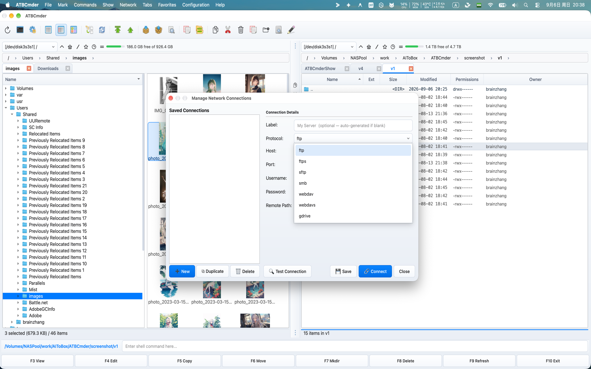

# Chapitre 6: Systèmes de fichiers virtuels et réseau

La gestion moderne des fichiers s’arrête rarement aux limites d’un seul disque dur physique. Les développeurs de logiciels gèrent des environnements de transfert à distance via SFTP ; les administrateurs système gèrent les partages de fichiers d'entreprise via SMB/CIFS ; les créateurs de contenu accèdent au stockage cloud et aux serveurs multimédias via WebDAV ; et les utilisateurs expérimentés inspectent, modifient et emballent régulièrement des archives compressées à l'échelle du gigaoctet. 

Les environnements de bureau traditionnels obligent les utilisateurs à jongler avec des applications disparates : un utilitaire d'archivage autonome pour décompresser et recompresser les archives zip, un client FTP/SFTP externe pour gérer les actifs du serveur et des boîtes de dialogue de montage du système d'exploitation qui dispersent les volumes distants sur les fenêtres du Finder déconnectées. 

ATBCmder élimine cette fragmentation grâce à son moteur **Virtual File System (VFS)**. Construit sur une couche d'abstraction URI `vfs://` unifiée, ATBCmder traite les serveurs distants et les archives compressées exactement comme des dossiers locaux standard. Vous pouvez naviguer dans une archive `.tar.gz`, prévisualiser les fichiers de code avec `F3`, modifier un fichier de configuration imbriqué avec `F4` (avec reconditionnement automatique en direct lors de l'enregistrement) et copier des actifs directement via une session SFTP sécurisée sur un NAS SMB sur site à l'aide de la clé standard `F5`, le tout sans extraire de fichiers intermédiaires vers disque ou basculer entre des outils distincts. 

---

## 1. Démarrage rapide visuel : l'architecture VFS et la matrice de commandes

ATBCmder achemine tous les accès au système de fichiers via une couche d'abstraction unifiée. Qu'un chemin pointe vers une partition SSD Apple APFS, un membre dans une archive `.zip` imbriquée ou un répertoire distant hébergé sur un serveur Linux SFTP à l'autre bout du monde, l'interface à double panneau fournit un modèle opérationnel identique. 

```
┌────────────────────────────────────────────────────────────────────────────────────────┐
│                              ATBCMDER DUAL-PANEL GUI                                   │
│            Left Panel (Active)                  Right Panel (Inactive / Target)        │
├────────────────────────────────────────────────────────────────────────────────────────┤
│                                          │                                             │
│  [1] Local File System                   │  [2] Archive Virtual File System (VFS)      │
│      file:///Users/brain/projects/       │      vfs:///Users/brain/backup.tar.gz/src/  │
│      Direct POSIX / APFS access          │      In-place browse, F3 view, F4 live edit │
│                                          │                                             │
│  [3] Remote Network VFS (SFTP/SSH)       │  [4] Remote Storage VFS (SMB / WebDAV)      │
│      vfs://sftp://deploy@aws.prod/app/   │      vfs://smb://admin@truenas/Pool/Media/  │
│      Paramiko / SSH Keys / Keychain      │      Kernel mount_smbfs / WebDAVClient3     │
│                                          │                                             │
├────────────────────────────────────────────────────────────────────────────────────────┤
│                          UNIFIED VFS DISPATCH ENGINE (vfs://)                          │
│     FileSystemModel ➔ VFSManager ➔ SessionCache ➔ StreamCopyWorker / RepackWorker      │
└────────────────────────────────────────────────────────────────────────────────────────┘
```

### Aide-mémoire VFS et réseau à double matrice

| Actions | Raccourci macOS | Clé de commandant classique | ID de commande | Descriptif | 
| :--- | :--- | :--- | :--- | :--- | 
| **Emballer les fichiers dans l'archive** | `Alt+F5` / `⌥F5` | `Alt+F5` | `cm_PackFiles` | Ouvre la boîte de dialogue Archive Pack avec les options de format, de compression et de mot de passe. | 
| **Extraire les fichiers des archives** | `Alt+F9` / `⌥F9` | `Alt+F9` | `cm_ExtractFiles` | Décompresse les archives sélectionnées avec résolution de collision. | 
| **Connexion réseau rapide** | Menu : Réseau | `cm_NetworkConnect` | `cm_NetworkConnect` | Ouvre la boîte de dialogue de connexion ad hoc rapide. | 
| **Gestionnaire de connexion** | Menu : Réseau | `cm_ManageConnections`| `cm_ManageConnections`| Ouvre le gestionnaire de réseau CRUD complet avec les profils de connexion enregistrés. | 
| **Connexion FTP** | `Ctrl+S` / `⌃S` | `Ctrl+S` | `cm_FTPConnect` | Raccourci rapide pour déclencher une session de connexion FTP. | 
| **Entrez l'archive/le dossier** | `Enter` / `⏎` | `Enter` | `cm_Open` | Navigue directement dans un `.zip`, `.tar`, `.7z` ou un répertoire distant. | 
| **Monter vers le dossier parent** | `Backspace` / `⌫` | `Backspace` | `cm_GoToParent` | Sort de l'archive ou du répertoire distant pour revenir au niveau parent. | 
| **Afficher le fichier virtuel/distant**| `F3` / `Fn+F3` | `F3` | `cm_View` | Diffuse le fichier distant ou d'archive dans Universal Lister. | 
| **Modifier le fichier virtuel/distant**| `F4` / `Fn+F4` | `F4` | `cm_Edit` | Ouvre le fichier dans l'éditeur ; se reconditionne automatiquement ou se télécharge après l'enregistrement. | 
| **Copier sur les panneaux / VFS** | `F5` / `Fn+F5` | `F5` | `cm_Copy` | Copie les éléments sélectionnés sur les points de terminaison locaux, d'archives ou de réseau. | 
| **Panneau des opérations en arrière-plan**| Menu : Afficher | `cm_OperationsPanel` | `cm_OperationsPanel` | Surveille les files d’attente de transfert en arrière-plan, les vitesses et les threads actifs. | 

---

## 2. L'abstraction unifiée d'URI `vfs://`

Les gestionnaires de fichiers traditionnels traitent les serveurs et archives distants comme des citoyens de seconde zone, nécessitant des utilitaires de montage externes, des dossiers d'extraction temporaires ou des clients de transfert tiers. ATBCmder unifie chaque source de fichier sous une spécification URI unique et bien définie : 

```
vfs://[protocol]://[user]@[host]:[port]/[remote_path]
```

### 2.1 Anatomie des chemins virtuels

Selon le domaine opérationnel, les URI `vfs://` prennent l'une des deux formes standard suivantes : 

1. **Archiver les chemins virtuels** : 
   ```
   vfs:///Users/brain/Documents/release_v1.7.zip/src/main.py
   ```
 

- **Préfixe externe** : `vfs://` demande à `FileSystemModel` d'intercepter la traversée du chemin. 
- **Chemin du conteneur** : `/Users/brain/Documents/release_v1.7.zip` identifie l'archive du conteneur physique sur le stockage local. 
- **Membre interne** : `src/main.py` identifie la ressource virtuelle imbriquée dans l'archive. 

2. **Chemins du serveur réseau** : 
   ```
   vfs://sftp://developer@staging.internal.net:2222/var/www/html/index.php
   vfs://smb://admin@192.168.1.50/StoragePool/Backups/2026/
   vfs://webdavs://user@cloud.mycompany.com:443/remote.php/dav/files/user/
   ```
 

- **Scheme Specifier** : Identifie le chauffeur de transport (`sftp`, `ftp`, `ftps`, `smb`, `webdav`, `webdavs`, `gdrive`). 
- **Authentification** : code les informations d'identification de l'utilisateur et le port cible. 
- **Remote Target** : résout les chemins absolus de répertoire et de fichier sur l'hôte distant. 

```
┌────────────────────────────────────────────────────────────────────────────────────────┐
│                              VFS URI ROUTING IN ACTION                                 │
├────────────────────────────────────────────────────────────────────────────────────────┤
│                                                                                        │
│   Input URI: vfs://sftp://deploy@aws.infra:22/var/log/nginx/access.log                 │
│                 │      │        │        │   └────────────────────► Remote Path        │
│                 │      │        │        └────────────────────────► Port (Default 22)  │
│                 │      │        └─────────────────────────────────► Host / Server      │
│                 │      └──────────────────────────────────────────► Username           │
│                 └─────────────────────────────────────────────────► Protocol Scheme    │
│                                                                                        │
│   Input URI: vfs:///Volumes/Data/Archive.zip/docs/manual.pdf                           │
│                 │                      │        └─────────────────► Archive Member     │
│                 │                      └──────────────────────────► Physical Archive   │
│                 └─────────────────────────────────────────────────► Virtual Scheme     │
└────────────────────────────────────────────────────────────────────────────────────────┘
```

### 2.2 Intégration transparente à deux panneaux

Étant donné que les chemins virtuels sont conformes aux structures de répertoires standard dans ATBCmder, vous bénéficiez d'une parité complète sur deux panneaux : 

- **Espaces de travail virtuels à onglets** : ouvrez un dossier SFTP distant dans l'onglet 1, une archive ZIP locale chiffrée dans l'onglet 2 et votre dossier local `~/Downloads` dans l'onglet 3. 
- **Copie directionnelle (`F5`)** : sélectionnez les fichiers dans votre panneau actif local et appuyez sur `F5` pour les télécharger directement sur le serveur distant ou dans l'archive compressée affichée dans le panneau inactif. 
- **Interopérabilité par glisser-déposer** : faites glisser les éléments sur les panneaux entre les disques locaux, les partages réseau et les hiérarchies d'archives sans préparation intermédiaire. 
- **Barre de fil d'Ariane interactive** : la barre de chemin d'Ariane analyse les URI virtuels en segments cliquables. Cliquez sur n’importe quel dossier parent ou sur le badge du serveur racine pour remonter instantanément dans l’arborescence. 

---

## 3. Archiver VFS : navigation et inspection sur place

L'ouverture d'une archive dans ATBCmder ne nécessite aucune extraction manuelle ni outil de décompression tiers. Mettez simplement en surbrillance n’importe quelle archive prise en charge et appuyez sur **`Enter`** (ou double-cliquez). ATBCmder monte l'archive sur place, transformant le panneau en un navigateur de répertoire virtuel à grande vitesse. 

 
*Figure 6.1 : Navigation dans une archive compressée multi-imbriqué en tant que dossier virtuel, affichant les tailles, les horodatages et les sous-répertoires non compressés.*

### 3.1 Formats d'archives pris en charge

ATBCmder propose des pilotes intégrés pour tous les formats d'archives et de compression standard de l'industrie : 

| Formater | Extensions de fichiers | Lire l'assistance | Écrire / Emballer | Prise en charge du cryptage | 
| :--- | :--- | :---: | :---: | :--- | 
| **ZIP** | `.zip` | Oui | Oui | Norme et AES-256 (`pyzipper`) | 
| **GZip Tarball** | `.tar.gz`, `.tgz` | Oui | Oui | Streaming tar standard POSIX | 
| **BZip2 Tarball**| `.tar.bz2`, `.tbz2` | Oui | Oui | Compression de bloc bzip2 à rapport élevé | 
| **XZ Tarball** | `.tar.xz`, `.txz` | Oui | Oui | Compression LZMA2 à haute efficacité | 
| **TAR ordinaire** | `.tar` | Oui | Oui | Archive sur bande UNIX non compressée | 
| **7-Zip** | `.7z` | Oui | Oui (via `py7zr`)| Compression solide LZMA / LZMA2 |

### 3.2 Flux de travail de navigation sur place

Lors de la navigation dans une archive : 

1. **Entrez les sous-répertoires** : appuyez sur `Enter` sur n'importe quel dossier de l'archive pour explorer les arborescences imbriquées. 
2. **Monter vers le parent (`..`)** : Appuyez sur `Backspace` (`⌫`) ou double-cliquez sur l'entrée `.. [Parent Directory]` pour monter. Une fois que vous avez atteint la racine de l'archive, appuyer sur `Backspace` vous ramène proprement au répertoire physique contenant le fichier d'archive. 
3. **Aperçu instantané (`F3` / `Fn+F3`)** : mettez en surbrillance n'importe quel document, image ou fichier source dans l'archive et appuyez sur `F3`. ATBCmder extrait automatiquement le fichier cible dans un bac à sable temporaire sécurisé et le restitue dans Universal Lister. 
4. **Copie sélective (`F5` / `Fn+F5`)** : Au lieu de décompresser une archive entière de plusieurs gigaoctets juste pour récupérer un ou deux fichiers, sélectionnez les membres spécifiques dont vous avez besoin et appuyez sur `F5`. ATBCmder décompresse uniquement les éléments choisis directement dans le panneau inactif. 

> [!NOTE] 
> Lors de la prévisualisation ou de la copie de fichiers individuels à partir d'une archive, ATBCmder diffuse uniquement les octets de fichiers demandés directement à partir du flux du conteneur. Il ne perd pas d'espace disque ni de temps à décompresser les fichiers frères non sélectionnés. 

---

## 4. Reconditionnement en direct : édition sur place dans les archives

L'un des flux de travail les plus puissants d'ATBCmder est le **Live Repacking**. Historiquement, la modification d'un seul fichier imbriqué dans une archive compressée nécessitait une séquence fastidieuse en six étapes : extraire l'intégralité de l'archive, localiser le fichier cible, le modifier et l'enregistrer, recompresser le répertoire dans une nouvelle archive, supprimer l'archive d'origine et nettoyer les dossiers temporaires. 

ATBCmder rend l'édition de fichiers dans des archives aussi simple que l'édition de fichiers locaux standard. 

```
┌────────────────────────────────────────────────────────────────────────────────────────┐
│                              LIVE REPACKING LIFECYCLE                                  │
├────────────────────────────────────────────────────────────────────────────────────────┤
│                                                                                        │
│  1. User presses F4 on "config.json" inside "package.zip"                              │
│     │                                                                                  │
│     ├──► ATBCmder extracts "config.json" to sandbox: /tmp/dc_repack_xyz/config.json    │
│     └──► Opens internal EditorDialog with window title: "config.json — Editor"         │
│                                                                                        │
│  2. User modifies file and presses Cmd+S (Save)                                        │
│     │                                                                                  │
│     ├──► Editor emits file_saved signal                                                │
│     └──► RepackWorker checks original archive size vs ArchiveRepackWarningMB threshold │
│                                                                                        │
│  3. Atomic Repack Execution                                                            │
│     │                                                                                  │
│     ├──► Writes modified stream to staging archive: /tmp/package.zip.tmp               │
│     ├──► Validates container integrity via archive driver                              │
│     ├──► Atomic swap: os.replace("/tmp/package.zip.tmp", "/original/package.zip")      │
│     └──► Refreshes active file panel and cleans up sandbox /tmp/dc_repack_xyz/         │
│                                                                                        │
└────────────────────────────────────────────────────────────────────────────────────────┘
```

### 4.1 Étape par étape : Modification d'un fichier de configuration archivé

1. Accédez à l'archive (par exemple, `application_bundle.zip`) en appuyant sur `Enter`. 
2. Localisez le fichier que vous souhaitez modifier (par exemple, `settings.yaml`). 
3. Appuyez sur **`F4`** (`Fn+F4`). ATBCmder extrait le fichier dans un cache temporaire et lance l'éditeur intégré. 
4. Effectuez vos modifications dans l'éditeur. 
5. Appuyez sur **`Cmd+S`** (`⌘S`) pour enregistrer. 
6. Fermez l'éditeur avec `Cmd+W` (`⌘W`) ou `Esc`. 
7. `RepackWorker` d'ATBCmder met automatiquement à jour le membre interne, compresse la structure mise à jour dans un fichier temporaire, remplace atomiquement l'archive d'origine et actualise la vue du panneau. 

> [!CAUTION] 
> **Grande protection des archives (`ArchiveRepackWarningMB`)** 
> Le reconditionnement d'une archive compressée nécessite la décompression et le réencodage des flux de conteneurs. La modification d'un fichier de 10 Ko dans une archive vidéo `.tar.gz` de 20 Go forcerait l'ordinateur à réécrire les 20 Go de données. 
> 
> Pour éviter le gel accidentel du disque, ATBCmder inclut un seuil de sécurité de protection (`ArchiveRepackWarningMB`, par défaut : **100 Mo** dans `atbcmder.xml`). Si vous tentez de modifier ou de supprimer un fichier dans une archive supérieure à cette limite, ATBCmder affiche une invite de confirmation : 
> *"La modification de cette archive nécessite de recompresser l'intégralité du fichier, ce qui peut prendre beaucoup de temps. Souhaitez-vous continuer ?"* 

---

## 5. Création et extraction d'archives (`Alt+F5` / `Alt+F9`)

ATBCmder fournit des travailleurs d'arrière-plan dédiés pour la création et l'extraction d'archives, garantissant ainsi que vos panneaux de fichiers restent réactifs même pendant les tâches de compression de longue durée. 

 
*Figure 6.2 : La boîte de dialogue Paramètres d'archive (Alt+F5 / cm_PackFiles) affichant le chemin de destination, la sélection du format, les niveaux de compression et le cryptage du mot de passe.*

### 5.1 Compression de fichiers (`Alt+F5` / `⌥F5` / `cm_PackFiles`)

Pour créer une nouvelle archive : 

1. Dans le panneau actif, sélectionnez les fichiers ou répertoires que vous souhaitez regrouper. 
2. Appuyez sur **`Alt+F5`** (`⌥F5`) ou choisissez **Fichiers ➔ Pack...** dans la barre de menu. 
3. La boîte de dialogue **Pack Files** apparaît : 
- **Créer un fichier d'archive** : chemin du fichier de destination. Par défaut, ATBCmder suggère de placer l'archive dans le répertoire du panneau inactif, nommé d'après l'élément ciblé. 
- **Format d'archive** : choisissez entre `ZIP`, `TAR`, `TAR.GZ`, `TAR.BZ2`, `TAR.XZ` ou `7Z`. 
- **Niveau de compression** : 
- `Store` : Zéro compression ; packaging instantané pour supports pré-compressés (MP4, JPEG). 
- `Fast` : faible surcharge du processeur ; idéal pour des transferts rapides. 
- `Normal (Deflated)` : Vitesse et taux de compression équilibrés (recommandé pour un usage général). 
- `Maximum` : compression de densité la plus élevée (utilise LZMA/Bzip2 le cas échéant). 
- **Mot de passe (ZIP uniquement)** : saisissez une phrase secrète pour chiffrer l'archive. 
4. Cliquez sur **Démarrer** (ou appuyez sur `Enter`). L'opération s'exécute dans un thread d'arrière-plan non bloquant avec une barre de progression et un indicateur d'état fichier par fichier.

#### Cryptage de mot de passe AES-256 de qualité militaire

Le cryptage ZIP standard (ancien ZipCrypto) est cryptographiquement brisé et vulnérable aux attaques par dictionnaire en clair. Lorsque vous spécifiez un mot de passe pour une archive ZIP, ATBCmder utilise le **cryptage AES-256** optimisé par `pyzipper` (`pyzipper.AESZipFile` avec la norme `WZ_AES`). Cela garantit la compatibilité avec macOS, WinZip et 7-Zip tout en protégeant les données sensibles contre le décryptage par force brute.

#### Diviser d'énormes archives sur des ensembles multi-volumes

Si vous devez distribuer une archive sur des pièces jointes à des e-mails, des lecteurs FAT32 ou des limites de téléchargement dans le cloud avec des limites de taille de fichier : 

1. Regroupez vos fichiers en utilisant `Alt+F5` (`cm_PackFiles`). 
2. Mettez en surbrillance l'archive `.zip` ou `.tar` résultante et déclenchez le séparateur de fichiers via **`Alt+F6`** (`cm_FileSpliter`). 
3. Sélectionnez une taille de division prédéfinie (par exemple, `100 MB`, `4.7 GB DVD`, `CD 700 MB` ou une taille d'octet personnalisée). 
4. ATBCmder génère des pièces divisées numérotées (`archive.zip.001`, `archive.zip.002`, etc.) ainsi qu'un manifeste de vérification CRC32. Les destinataires peuvent réassembler le conteneur d'origine à tout moment en utilisant **`cm_FileLinker`** (`cm_Combine`). 

---

### 5.2 Extraction des archives (`Alt+F9` / `⌥F9` / `cm_ExtractFiles`)

Pour extraire des archives sur le disque : 

1. Mettez en surbrillance une ou plusieurs archives dans le panneau actif. 
2. Appuyez sur **`Alt+F9`** (`⌥F9`) ou choisissez **Fichiers ➔ Extraire...** dans la barre de menu. 
3. La boîte de dialogue **Extraire les fichiers** s'affiche : 
- **Archive à extraire** : chemin source du conteneur sélectionné. 
- **Extraire vers le répertoire** : Répertoire de destination (par défaut sur le panneau inactif). 
- **Aperçu du contenu** : une zone de liste interactive chargeant les membres de l'archive en temps réel. 
- **Mot de passe** : Champ de saisie pour les archives protégées par mot de passe. 
4. Cliquez sur **Démarrer**. Si un fichier cible existe déjà dans le dossier de destination, ATBCmder met le travailleur en pause et présente une boîte de dialogue de collision interactive : 
- **Écraser** : remplace le fichier de destination en conflit. 
- **Sauter** : laisse le fichier existant intact et passe à l'élément suivant. 
- **Overwrite All** : écrase silencieusement tous les conflits ultérieurs. 
- **Skip All** : contourne automatiquement tous les fichiers de destination existants. 
- **Annuler** : arrête en toute sécurité le processus d'extraction. 

---

## 6. VFS réseau distant : protocoles et stockage distant

ATBCmder comprend un moteur client réseau multiprotocole capable de monter, parcourir et manipuler des serveurs distants directement dans l'espace de travail à double panneau. 

 
*Figure 6.3 : Navigation dans les répertoires du serveur Linux distant via SFTP sécurisé avec attributs de fichiers en direct, autorisations de propriété et transfert à double panneau.* 

 
*Figure 6.4 : Types de connexion réseau pris en charge : FTP/FTPS, SFTP sécurisé, stockage cloud WebDAV et partages réseau SMB.*

### 6.1 Protocoles réseau pris en charge

| Schéma de protocole | Port par défaut | Couche de transport | Modes d'authentification | Meilleur utilisé pour | 
| :--- | :---: | :--- | :--- | :--- | 
| **`sftp://`** | `22` | SSH-2 (Paramiko) | Mot de passe, clé SSH (`id_rsa`, `id_ed25519`) | Serveurs Linux, instances cloud, hôtes intermédiaires | 
| **`ftp://`** | `21` | RFC 959 simple | Nom d'utilisateur et mot de passe anonymes et en texte clair | Hébergement Web existant, appareils de laboratoire local | 
| **`ftps://`** | `990` | FTP crypté TLS | Nom d'utilisateur et mot de passe avec SSL/TLS | Serveurs FTP commerciaux sécurisés | 
| **`smb://`** | `445` | CIFS/SMB3 | Windows NT / Kerberos / Compte local | Partages Windows, appliances NAS, serveurs Samba | 
| **`webdav://`** | `80` | HTTPWebDAV | Authentification de base Digest | Serveurs Web, stockage en réseau local | 
| **`webdavs://`** | `443` | HTTPSWebDAV | Authentification de base/Digest cryptée SSL | Nextcloud, ownCloud, stockage cloud commercial | 
| **`gdrive://`** | `443` | API Google Drive | Autorisation du jeton OAuth2 | Lecteurs cloud et dossiers partagés Google Drive | 

---

### 6.2 Capacités du protocole et analyse approfondie

#### SFTP (protocole de transfert de fichiers SSH)

Soutenu par le moteur SSH standard `paramiko`, le pilote SFTP d'ATBCmder établit des tunnels cryptés sur le port 22 : 

- **Sécurité de la clé hôte (`WarningPolicy`)** : Conformément aux exigences de sécurité strictes, ATBCmder consulte automatiquement votre fichier `~/.ssh/known_hosts` local. Lors de la connexion à un hôte connu, les clés d'hôte sont vérifiées cryptographiquement. Si un serveur inconnu est rencontré, ATBCmder émet un avertissement de sécurité plutôt que de faire confiance silencieusement à des clés publiques inattendues. 
- **Authentification par clé SSH** : en plus de l'authentification par mot de passe standard, ATBCmder prend en charge les fichiers de clé privée SSH (`~/.ssh/id_rsa`, `~/.ssh/id_ed25519`). 
- **Mappage d'attributs UNIX** : préserve les modes de fichiers octaux distants (`chmod`), les chaînes de propriété des utilisateurs/groupes et les horodatages exacts des modifications POSIX.

#### FTP et FTPS (SSL explicite/implicite)

Piloté par `ftplib` de Python, le pilote FTP prend en charge : 

- **Mode passif (PASV)** : activé par défaut pour garantir des connexions fiables via des routeurs NAT restrictifs et des pare-feu grand public. 
- **Encodages configurables** : résout les problèmes d'affichage des noms de fichiers non ASCII en vous permettant de basculer entre les jeux de caractères `UTF-8`, `ISO-8859-1`, `GB18030` et `Windows-1252`.

#### SMB / Samba (partages Windows et appareils NAS)

Contrairement aux bibliothèques Python SMB en espace utilisateur naïf qui souffrent de vitesses de transfert lentes, ATBCmder utilise une architecture hybride : 

- **Accélération native du noyau macOS (`mount_smbfs`)** : sur macOS, `SambaMounter` d'ATBCmder exploite le sous-système natif `/sbin/mount_smbfs` d'Apple. Il monte le partage distant directement dans l'arborescence macOS VFS (`/Volumes/` ou un répertoire de montage isolé), déverrouillant ainsi un débit de lecture/écriture SMB3 entièrement accéléré par le matériel. 
- **Détection de montage existant** : si macOS Finder ou un script système a déjà monté le partage SMB cible, ATBCmder détecte automatiquement le point de montage actif à partir de la table OS `mount` et y accède instantanément, évitant ainsi les connexions réseau redondantes. 

> [!IMPORTANT] 
> **Exigence relative au nom de partage SMB** 
> Un serveur SMB ne peut pas être parcouru au niveau du simple nom d'hôte. Un URI SMB **doit** inclure le partage cible ou le nom de l'exportation dans le chemin : 
> 
> - ❌ Invalide : `vfs://smb://nas.local/` 
> - ✅ Valide : `vfs://smb://nas.local/StoragePool` ou `vfs://smb://192.168.1.100/Media`

#### WebDAV et WebDAVS (Nextcloud / Stockage Cloud)

Construit sur `webdavclient3`, ce pilote fournit une synchronisation bidirectionnelle des fichiers avec des solutions de stockage cloud modernes : 

- **Vérification du certificat SSL** : prend en charge la validation stricte des certificats SSL pour les hôtes WebDAVS publics, avec une bascule de remplacement pour les certificats auto-signés dans les configurations homelab privées. 
- **Création de répertoire récursive (`makedirs`)** : crée automatiquement les chemins de répertoire distant imbriqués manquants lors des opérations de téléchargement groupé. 

---

## 7. Connexion rapide et gestionnaire de connexion

ATBCmder fournit deux mécanismes flexibles pour se connecter à des hôtes distants : **Quick Connect** pour des sessions rapides et temporaires, et **Connection Manager** pour des signets de serveur persistants et catégorisés.

### 7.1 Connexion rapide (`cm_NetworkConnect`)

Lorsque vous avez besoin d'accéder rapidement à un serveur sans encombrer votre configuration permanente : 

1. Choisissez **Réseau ➔ Connexion rapide...** (ou exécutez la commande `cm_NetworkConnect`). 
2. L'invite de connexion légère apparaît : 
- **Protocole** : sélectionnez `sftp`, `ftp`, `ftps`, `smb`, `webdav`, `webdavs` ou `gdrive`. 
- **Hôte et port** : saisissez l'adresse du serveur (le port remplit automatiquement les valeurs par défaut). 
- **Nom d'utilisateur et mot de passe** : saisissez les informations de connexion. 
- **Chemin distant** : Démarrage du répertoire distant (par défaut : `/`). 
- **Mémoriser le mot de passe** : laissez cette case décochée pour une connexion éphémère en une seule session. 
3. Cliquez sur **Test de connexion** pour vérifier l'établissement de liaison réseau et les informations d'identification avant de vous connecter. 
4. Cliquez sur **Connecter**. ATBCmder ouvre immédiatement un nouvel onglet dans le panneau actif pointant vers le serveur distant. 

---

### 7.2 Gestionnaire de connexions (`cm_ManageConnections`)

Pour les serveurs auxquels vous accédez régulièrement, **Connection Manager** fournit un tableau de bord de configuration complet : 

```
┌────────────────────────────────────────────────────────────────────────────────────────┐
│                              CONNECTION MANAGER DIALOG                                 │
├──────────────────────────────┬─────────────────────────────────────────────────────────┤
│  Saved Connections           │  Connection Details                                     │
│  ┌────────────────────────┐  │  Label:        [ Staging Web Server (AWS)             ] │
│  │ 🔐 AWS Staging Server  │  │  Protocol:     [ SFTP (port 22)                     ▼ ] │
│  │ 🖧 Synology Office NAS │  │  Host:         [ ec2-54-210-10-2.compute.amazonaws.com] │
│  │ 🌐 Nextcloud Personal  │  │  Port:         [ 22                                   ] │
│  │ 📂 Legacy Archive FTP  │  │  Username:     [ ubuntu                               ] │
│  │                        │  │  Password:     [ ••••••••••••••••••                   ] │
│  │                        │  │  Remote Path:  [ /var/www/production                  ] │
│  │                        │  │  [✓] Remember password in macOS Keychain                │
│  └────────────────────────┘  │                                                         │
│  [➕ New] [⧉ Dup] [🗑 Del]    │  [🔍 Test Connection]          [💾 Save]  [🔗 Connect] │
└──────────────────────────────┴─────────────────────────────────────────────────────────┘
```

#### Gestion des profils de serveur

- **Créer un nouveau (`➕ New`)** : Efface le formulaire de droite pour définir une nouvelle configuration de serveur. 
- **Dupliquer (`⧉ Duplicate`)** : Clone le profil de connexion sélectionné. Idéal lors de la gestion de plusieurs environnements (développement, staging, production) sur des configurations d'hôtes identiques. 
- **Supprimer (`🗑 Delete`)** : supprime le profil de connexion et supprime les informations d'identification associées du trousseau système. 
- **Test de connexion (`🔍 Test Connection`)** : envoie un travailleur en arrière-plan (`ConnectionTestWorker`) pour se connecter, s'authentifier et se déconnecter en douceur, vérifiant ainsi la réactivité du serveur sans quitter le serveur. 
- **Connect (`🔗 Connect`)** : enregistre toutes les modifications de champ en attente, établit la session à distance et charge le répertoire distant dans un nouvel onglet de panneau actif.

#### Menu Connexions enregistrées dynamiques

Les connexions enregistrées sont automatiquement intégrées dans la barre de menu supérieure sous **Réseau ➔ Connexions enregistrées**. Vous pouvez monter n'importe quel serveur mis en signet en un seul clic : 

- `Network ➔ Saved Connections ➔ 🔐 AWS Staging Server` 
- `Network ➔ Saved Connections ➔ 🖧 Synology Office NAS` 

---

## 8. Sécurité des informations d'identification et intégration du trousseau

Les fichiers de configuration du gestionnaire de fichiers sont une cible privilégiée pour les logiciels malveillants de collecte d'informations d'identification. De nombreux gestionnaires de fichiers existants stockent les mots de passe FTP/SFTP dans des fichiers de configuration XML ou INI en texte clair situés dans le répertoire personnel de l'utilisateur. 

**ATBCmder garantit aucun stockage d'informations d'identification en texte clair.**

### 8.1 L'architecture de sécurité

```
┌────────────────────────────────────────────────────────────────────────────────────────┐
│                           CREDENTIAL STORAGE ARCHITECTURE                              │
├────────────────────────────────────────────────────────────────────────────────────────┤
│                                                                                        │
│   Connection Configuration XML                    Apple System Keychain                │
│   (~/.config/atbcmder/atbcmder.xml)               (service: "ATBCmder_VFS")            │
│   ┌─────────────────────────────────────┐         ┌──────────────────────────────────┐ │
│   │ <connection>                        │         │ Label: "AWS Staging Server"      │ │
│   │   <label>AWS Staging</label>        │         │ Key:   Encrypted Secret          │ │
│   │   <scheme>sftp</scheme>             │         │ Access: Controlled by macOS      │ │
│   │   <host>aws.infra.net</host>        │         │         Hardware Security Enclave│ │
│   │   <user>deploy</user>               │         └──────────────────────────────────┘ │
│   │   <password></password>             │                           ▲                  │
│   │ </connection>                       │                           │                  │
│   └─────────────────────────────────────┘                           │                  │
│         ▲                                                           │                  │
│         │ Password stripped on save                                 │ Stored via       │
│         └─────────────────── ConnectionManager ─────────────────────┘ Python keyring   │
│                                                                                        │
└────────────────────────────────────────────────────────────────────────────────────────┘
```
 

1. **Cleartext XML Scrubbing** : chaque fois que les profils de connexion sont sérialisés sur le disque (`atbcmder.xml`), la routine `ConnectionManager.save()` force explicitement `d["password"] = ""` avant l'écriture. Même si une partie non autorisée inspecte votre configuration XML, aucun mot de passe du serveur ne sera jamais révélé. 
2. **Chiffrement du trousseau du système macOS** : lorsque la case **Mémoriser le mot de passe** est cochée, les mots de passe sont enregistrés directement dans le trousseau macOS via l'API du système `keyring` sous l'identifiant de service sécurisé `ATBCmder_VFS`. La dérivation et le stockage des clés sont protégés par le matériel Secure Enclave d'Apple. 
3. **Sessions éphémères en mémoire** : si la case « Mémoriser le mot de passe » n'est pas cochée, les informations d'identification sont conservées strictement dans la mémoire dynamique (`VFSSessionCache`) pendant le cycle de vie actuel de l'application et sont effacées au moment où ATBCmder se termine. 

---

## 9. ⚡ Conseils de pro : opérations à distance hautes performances

### Astuce 1 : file d'attente de transfert en arrière-plan non bloquante (`cm_OperationsPanel`)

Lorsque vous copiez des répertoires volumineux sur des serveurs distants ou téléchargez des ISO de plusieurs gigaoctets via SFTP, ne gelez jamais votre espace de travail. Toutes les opérations sur les fichiers réseau dans ATBCmder s'intègrent automatiquement à la **file d'attente des opérations en arrière-plan** : 

- Appuyez sur **`F5`** pour lancer un transfert, puis cliquez sur **Arrière-plan** (ou laissez-le automatiquement en file d'attente). 
- Ouvrez le panneau des opérations via **Afficher ➔ Panneau des opérations** (`cm_OperationsPanel`) pour surveiller les graphiques de bande passante en direct, le nombre d'octets par fichier et les estimations de transfert restant. 
- Vous pouvez suspendre, reprendre ou réorganiser les transferts réseau en file d'attente tout en continuant à parcourir les fichiers locaux dans les deux panneaux.

### Astuce 2 : Copie de flux sur des protocoles hétérogènes

Le moteur `stream_copy_file` d'ATBCmder permet un **streaming direct de serveur à serveur**. Si vous faites glisser un dossier d'un serveur SFTP dans le panneau de gauche vers un partage réseau SMB dans le panneau de droite : 

- ATBCmder ne télécharge **pas** l'intégralité du répertoire sur votre disque dur Mac local avant de le télécharger à nouveau. 
- Les données sont regroupées via un anneau tampon en mémoire, diffusant les octets du socket source directement vers le socket cible. Cela élimine l’usure du disque local et permet des transferts supérieurs à la capacité SSD locale disponible.

### Astuce 3 : maintien du réseau et prévention des interruptions de connexion

Les pare-feu réseau dynamiques et les passerelles NAT coupent fréquemment les connexions TCP inactives après 60 à 300 secondes d'inactivité. Pour éviter les sessions déconnectées lors de la navigation dans de grandes arborescences distantes : 

- La couche `BaseNetworkVFS` d'ATBCmder maintient automatiquement les battements de cœur de session sur les connexions inactives. 
- Si une interruption momentanée du réseau se produit, le mécanisme interne `_retry()` exécute jusqu'à **3 nouvelles tentatives** en utilisant une interruption exponentielle (`2^attempt` secondes d'intervalle) avant de signaler un échec de connexion.

### Astuce 4 : Modification de fichiers distants avec le cycle de vie de téléchargement automatique

Besoin d'éditer un `nginx.conf` ou un script Python directement sur un serveur distant ? 

1. Mettez en surbrillance le fichier distant dans la vue de votre panneau SFTP ou WebDAV. 
2. Appuyez sur **`F4`** (`Fn+F4`). 
3. ATBCmder télécharge le fichier dans un bac à sable temporaire isolé (`/tmp/`) et l'ouvre dans l'éditeur intégré. 
4. Chaque fois que vous appuyez sur **`Cmd+S`** (`⌘S`), ATBCmder déclenche `_upload_vfs_temp()`, renvoyant le fichier mis à jour vers le serveur distant de manière asynchrone et affichant une confirmation dans la barre d'état. 
5. Lorsque vous fermez l'éditeur, le fichier temporaire est dissocié de manière sécurisée de `/tmp/`. 

---

## 10. Alertes système et sécurité

> [!WARNING] 
> **Incohérence de vérification de la clé de l'hôte SSH** 
> Si un serveur SFTP régénère ses clés d'hôte (par exemple, après une réinstallation du système d'exploitation) ou si une interception réseau de type man-in-the-middle est tentée, ATBCmder détecte que la clé du serveur ne correspond pas à l'empreinte digitale enregistrée dans `~/.ssh/known_hosts`. 
> Ne contournez jamais les avertissements de clé d'hôte sur les réseaux Wi-Fi publics non fiables sans vérifier indépendamment l'empreinte digitale de la clé publique du serveur avec votre administrateur système. 

> [!IMPORTANT] 
> **Espace de cache temporaire pour les gros fichiers distants** 
> Lors de la visualisation (`F3`) ou de la modification (`F4`) de fichiers de plusieurs gigaoctets stockés sur des serveurs VFS distants, ATBCmder diffuse l'élément cible sur votre volume `/tmp` local. Assurez-vous que le conteneur APFS principal de votre Mac dispose de suffisamment d'espace de stockage libre avant d'ouvrir d'énormes fichiers vidéo ou de base de données distants. 

> [!CAUTION] 
> **Démontage des partages réseau distants** 
> Pour les partages SMB montés via macOS `mount_smbfs`, la fin de la connectivité réseau sans déconnexion peut laisser des handles de montage obsolètes dans `/Volumes/`. Utilisez toujours le menu du lecteur du panneau ou l'action de déconnexion avant de fermer votre ordinateur portable ou de changer de réseau Wi-Fi. 

---

## 11. Tableau de référence du clavier maître à double matrice

| Catégorie | Description de l'action | Raccourci macOS | Clé de commandant classique | ID de commande | 
| :--- | :--- | :--- | :--- | :--- | 
| **Opérations d'archivage** | Pack des fichiers/dossiers sélectionnés | `Alt+F5` / `⌥F5` | `Alt+F5` | `cm_PackFiles` | 
| **Opérations d'archivage** | Extraire les archives sélectionnées | `Alt+F9` / `⌥F9` | `Alt+F9` | `cm_ExtractFiles` | 
| **Opérations d'archivage** | Parcourir l'intérieur du conteneur d'archives | `Enter` / `⏎` | `Enter` | `cm_Open` | 
| **Opérations d'archivage** | Quitter l'archive vers le répertoire parent | `Backspace` / `⌫` | `Backspace` | `cm_ChangeDirToParent` | 
| **Opérations d'archivage** | Aperçu du fichier dans l'archive | `F3` / `Fn+F3` | `F3` | `cm_View` | 
| **Opérations d'archivage** | Modifier le fichier dans l'archive (en direct) | `F4` / `Fn+F4` | `F4` | `cm_Edit` | 
| **Opérations d'archivage** | Extraire les éléments sélectionnés uniquement | `F5` / `Fn+F5` | `F5` | `cm_Copy` | 
| **Opérations d'archivage** | Diviser les grandes archives en volumes | `Alt+F6` / `⌥F6` | `Alt+F6` | `cm_FileSpliter` / `cm_Split` | 
| **Opérations d'archivage** | Réassembler les pièces de volume divisé | Menu : Fichiers ➔ Combiner des fichiers | — | `cm_FileLinker` / `cm_Combine` | 
| **Connexions réseau**| Boîte de dialogue de connexion réseau rapide | Menu : Réseau | — | `cm_NetworkConnect` | 
| **Connexions réseau**| Gérer les connexions réseau | Menu : Réseau | — | `cm_ManageConnections` | 
| **Connexions réseau**| Connexion rapide au serveur FTP | `Ctrl+S` / `⌃S` | `Ctrl+S` | `cm_FTPConnect` | 
| **Connexions réseau**| Déconnecter le partage réseau distant | Menu : Réseau | — | `cm_NetworkDisconnect` | 
| **Gestion des transferts**| Ouvrir la file d'attente de transfert des opérations | Menu : Afficher | — | `cm_OperationsPanel` | 
| **Gestion des transferts**| Pause/Reprise de la file d'attente active | `Space` (dans la file d'attente)| `Space` | — |

--- 

<div align="center"> 
<p>Prêt à personnaliser les raccourcis clavier, les vues des panneaux et le comportement des applications ?</p> 
<p><strong><a href="preferences_and_customization.md">Passer au chapitre 7 : Préférences et personnalisation &rarr;</a></strong></p> 
</div>