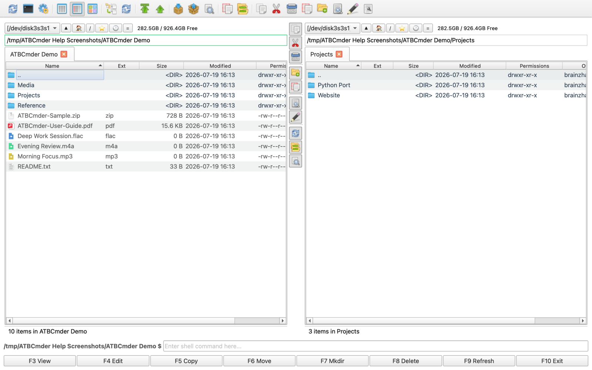

# Benvenuto in ATBCmder

[](download.md) 
[-arancione.svg)](download.md) 
[](download.md) 
[](privacy_policy.md) 

Benvenuto nel portale di documentazione ufficiale di **ATBCmder**: il veloce file manager a doppio pannello, con tastiera, progettato specificamente per macOS. ATBCmder unisce la tradizione di velocità e comando dei file manager ortodossi (Total Commander, Double Commander, Norton Commander) con il moderno design macOS, l'integrazione nativa del sistema e strumenti avanzati. 

---

## La filosofia del doppio pannello

I tradizionali file manager desktop a finestra singola come macOS Finder costringono gli utenti a un ciclo infinito di apertura di finestre sovrapposte, perdita di traccia delle cartelle di origine e di destinazione e rischio di cadute accidentali in sottocartelle sbagliate. 

```
Esplorazione tradizionale (Finder):
┌────────────────────────┐      ┌────────────────────────┐
│ Cartella A (Dov'ero?)  │ ──?  │ Cartella B (Quale?)    │  → Finestre sovrapposte, perdita
└────────────────────────┘      └────────────────────────┘    di fuoco e rilasci errati

Il metodo ATBCmder (Doppio pannello ortodosso):
┌───────────────────────────────┬───────────────────────────────┐
│    PANNELLO ATTIVO (Sorgente) │   PANNELLO INATTIVO (Destin.) │
│  File in attesa di azione     │  Destinazione chiara e certa  │
│  [ Copia / Sposta / Diff/Sync ═════════════════════════════► ]│
└───────────────────────────────┴───────────────────────────────┘
```
 

ATBCmder risolve questo problema attraverso il **paradigma del doppio pannello sorgente-destinazione**: 

- **Orientamento visivo immediato e costante**: due visualizzazioni di directory indipendenti sono sempre visibili una accanto all'altra. 
- **Operazioni direzionali prevedibili**: quando attivi Copia (`F5`) o Sposta (`F6`), ATBCmder trasferisce automaticamente gli elementi dal **Pannello attivo** (dove si trova il cursore) al **Pannello inattivo** (la vista opposta). Nessun trascinamento, nessuna ipotesi, nessuna ricerca di finestre di destinazione nascoste. 
- **Velocità tastiera**: tieni le mani sulla tastiera. Scorri le directory, seleziona i file con caratteri jolly, ispeziona gli archivi ed esegui trasformazioni batch in millisecondi. 
- **Zero Finder Window Clutter**: una finestra gestisce tutto: volumi locali, server di rete (FTP, SFTP, SMB, WebDAV), contenuti di archivio (`.zip`, `.7z`, `.tar`) e code di trasferimento in background. 

---

## Tour e punti di riferimento dell'interfaccia visiva

ATBCmder organizza la potenza in un layout pulito e intuitivo progettato per darti una consapevolezza situazionale istantanea di entrambe le directory. 

```
┌──────────────────────────────────────────────────────────────────────────────────────────┐
│ [1] Barra dei menu: File   Seleziona   Comandi   Mostra   Configurazione   Aiuto         │
├──────────────────────────────────────────────────────────────────────────────────────────┤
│ [2] Barra strumenti: [🔍 Cerca]  [⚡ Coda]  [⚙️ Impostazioni]  [📁 Barra unità]          │
├─────────────────────────────────────────────┬────────────────────────────────────────────┤
│ [3] Percorso: 🏠 > Users > brain > work     │ [3] Percorso: 💾 > Volumes > Backup        │
├─────────────────────────────────────────────┼────────────────────────────────────────────┤
│ [4] Schede: [Progetto Alfa ✕] [Docs] [+]    │ [4] Schede: [Archivio 2026 ✕] [+]          │
├──────────────────────────────────────┬──────┼────────────────────────────────────────────┤
│ [5] Pannello sinistro (Attivo / Orig)│ [6]  │ [5] Pannello destro (Inattivo / Destin.)   │
│ 📁 .. [Cartella superiore]           │  M   │ 📁 .. [Cartella superiore]                 │
│ 📁 assets                            │  E   │ 📁 archive_2025                            │
│ 📁 src                               │  D   │ 📁 release_builds                          │
│ 📄 Cargo.toml             1.2 KB     │  I   │ 📄 CHANGELOG.md                 14.8 KB    │
│ 📄 main.rs                8.4 KB     │  A   │ 📄 README.md                     4.1 KB    │
│ 📄 config.json            2.1 KB     │      │ 📦 backup_bundle.zip           128.4 MB    │
│                                      │      │                                            │
├──────────────────────────────────────┴──────┴────────────────────────────────────────────┤
│ [7] Barra di stato: 6 elementi | 2 selezionati   │ Disco: 142.6 GB liberi / 494.3 GB      │
└──────────────────────────────────────────────────────────────────────────────────────────┘
```

### Riferimento al punto di riferimento dell'interfaccia utente

1. **Barra dei menu e integrazione nativa di macOS (`[1]`)**: supporto completo del menu dell'applicazione macOS, scorciatoie standard (`⌘,`, `⌘Q`, `⌘W`) e accesso completo al menu per ogni comando interno di Commander (`cm_*`). 
2. **Barra degli strumenti principale e funzioni di avvio rapido (`[2]`)**: accesso immediato con un clic a Ricerca (`Alt+F7`), Coda di trasferimento in background (`cm_OperationsPanel`), Preferenze (`Cmd+,`) e selettori di unità. 
3. **Barra del percorso breadcrumb interattiva (`[3]`)**: fare clic su qualsiasi segmento di directory nel percorso per passare direttamente alla gerarchia. Fare clic sulla freccia del menu a discesa del segmento per sfogliare le sottodirectory. 
4. **Schede cartelle e aree di lavoro (`[4]`)**: apri un numero illimitato di schede in ciascun pannello (`Cmd+T`), chiudi le schede (`Cmd+W`), blocca le posizioni preferite e salva intere aree di lavoro con schede a doppio pannello (`cm_SaveFavoriteTabs`). 
5. **Pannelli a doppio file (`[5]`)**: tabelle di file indipendenti. Il pannello attivo mostra un bordo di accento distinto e un cursore focalizzato. Cambia istantaneamente la messa a fuoco con `Tab`. 
6. **Barra degli strumenti centrale e divisore trascinabile (`[6]`)**: una striscia verticale ad azione rapida posizionata direttamente sul divisore del pannello. Fornisce trigger con un clic per Visualizza (`F3`), Modifica (`F4`), Copia (`F5`), Sposta (`F6`), Nuova cartella (`F7`), Elimina (`F8`), Cancella e scambia i pannelli (`cm_Exchange`). Trascina il divisore a sinistra o a destra per ridimensionare i pannelli. 
7. **Barra di stato e misuratore di spazio di archiviazione dell'unità (`[7]`)**: mostra il conteggio dei file in tempo reale, le statistiche degli elementi selezionati, le dimensioni dei byte aggregati e un indicatore della capacità di archiviazione del volume attivo con calcolo dello spazio libero. 

---

## Vetrina delle interfacce

Esplora le capacità di ATBCmder attraverso le caratteristiche principali: 

| Doppi pannelli e visualizzazione ad albero | Barra degli strumenti di azione rapida centrale | 
| :---: | :---: | 
|  |  | 
| *Layout a doppio pannello con struttura delle directory e anteprima in miniatura.* | *Striscia di azione rapida: Visualizza, Modifica, Copia, Sposta, MkDir, Elimina, Cancella.* | 

| Comandi in linguaggio naturale | Vista ramo piatto ricorsiva | 
| :---: | :---: | 
|  |  | 
| *Ricerca istantanea basata su macOS Spotlight e analisi delle query semantiche.* | *Vista ramo (`Cmd+B`) che mostra i contenuti nidificati in un unico elenco semplice.* | 

| VFS di rete e remoto | Archivio VFS (nessuna estrazione necessaria) | 
| :---: | :---: | 
|  |  | 
| *Connettiti a condivisioni di rete FTP, SFTP, WebDAV e SMB/Samba.* | *Sfoglia e modifica gli archivi ZIP, TAR, 7z come cartelle standard.* | 

---

## Scegli il tuo percorso

Che tu non abbia mai toccato uno strumento a doppio pannello prima o che tu abbia trascorso due decenni utilizzando Total Commander, ATBCmder fornisce un percorso ottimizzato per il futuro:

### 🟢 Traccia A: Nuovo ai file manager a doppio pannello?

*Benvenuti in un modo più rapido e pulito di gestire i file su macOS.* 

Se provieni da Finder o da sistemi operativi desktop standard, i file manager ortodossi potrebbero inizialmente sembrare poco familiari. Una volta appresi gli schemi principali, non vorrai più tornare a trascinare file su finestre sparse: 

1. **Inizia con i concetti fondamentali**: leggi il [Capitolo 1: Nozioni fondamentali e configurazione di macOS](getting_started.md) per comprendere i pannelli attivi e inattivi, la barra degli strumenti centrale e la concessione delle autorizzazioni del disco di macOS. 
2. **Operazioni quotidiane principali**: scopri come copiare, spostare, rinominare ed eliminare senza toccare il mouse nel [Capitolo 3: Operazioni giornaliere sui file e coda](file_operations.md). 
3. **Anteprima di tutto all'istante**: scopri come visualizzare in anteprima le immagini, ascoltare file audio, leggere il codice e controllare i PDF premendo un solo tasto nel [Capitolo 4: Universal Lister & Editors](viewers_and_editors.md). 
4. **Segui le guide pratiche**: scopri i flussi di lavoro pratici di tutti i giorni e le domande comuni nel [Capitolo 9: Ricette reali e risoluzione dei problemi](faq_howtos.md). 

---

### ⚡ Traccia B: Migrazione da Total Commander/Double Commander?

*Tutta la potenza e i riflessi della tastiera che conosci, progettati nativamente per macOS.* 

ATBCmder è stato creato per portare l'autentica esperienza di Commander sui moderni macOS senza eseguire goffi X11, wine wrapper o porte legacy non mantenute: 

1. **Padroneggia le combinazioni di tasti a doppia matrice**: rivedi la nostra matrice completa di scorciatoie affiancate (`macOS Cmd` vs `Commander Fn`) nel [Capitolo 8: Scorciatoie da tastiera principali](keyboard_shortcuts.md). 
2. **Sfrutta strumenti avanzati**: utilizzare lo strumento di ridenominazione multipla batch (`Ctrl+M`), Diff. file affiancati (`Meta+Shift+F12`), Sincronizzazione cartelle (`Shift+F12`) e Ricerca avanzata nel [Capitolo 5: Strumenti elettrici e automazione](power_tools.md). 
3. **Connettiti a sistemi remoti e virtuali**: sfoglia e modifica direttamente all'interno degli archivi `.zip` e `.tar` con repacking in tempo reale o gestisci server remoti tramite SFTP, SMB e WebDAV nel [Capitolo 6: File system virtuali e rete](network_and_vfs.md). 
4. **Personalizza e trasferisci la tua configurazione**: associa nuovamente i comandi, configura il comportamento di aggiornamento automatico ed esporta l'XML di configurazione nel [Capitolo 7: Preferenze e personalizzazione](preferences_and_customization.md). 

---

## Sommario principale

Esplora la suite completa di documentazione ATBCmder:

### 🚀 [Capitolo 1: Nozioni fondamentali e configurazione di macOS](getting_started.md)

Comprendi la filosofia del doppio pannello, esplora l'anatomia dell'interfaccia, configura le autorizzazioni della sandbox dell'app macOS tramite l'assistente di onboarding (`cm_GrantFilesystemAccess`), imposta le sostituzioni della lingua di sistema in oltre 30 impostazioni locali e personalizza i temi Chiaro/Scuro.

### 🧭 [Capitolo 2: Navigazione e schede cartella](navigation_and_tabs.md)

Muoviti facilmente tra gli alberi delle directory utilizzando breadcrumb interattivi, spostamenti tramite tastiera (`Ctrl+\`, `Backspace`), organizzazione a più schede (`Cmd+T`, `Cmd+W`), set di aree di lavoro preferite a doppio pannello (`cm_SaveFavoriteTabs`), Hotlist di directory segnalibri (`Ctrl+D`) e modalità di visualizzazione flessibili (breve, colonne complete, miniature, visualizzazione ad albero e visualizzazione a ramo piatto `Cmd+B`).

### 📁 [Capitolo 3: Operazioni giornaliere sui file e coda](file_operations.md)

Esegui operazioni sui file veloci e affidabili: Copia (`F5`), Sposta (`F6`), Nuova cartella (`F7`), Elimina nel cestino (`F8`) e rinomina rapida incorporata (`F2`). Selezioni principali di caratteri jolly e attributi, interoperabilità drag-and-drop, risoluzione dei conflitti di collisione, autorizzazioni ottali UNIX (`Alt+Enter`) e monitoraggio del trasferimento asincrono tramite la coda delle operazioni in background (`cm_OperationsPanel`).

### 👁️ [Capitolo 4: Lister universale ed editor integrati](viewers_and_editors.md)

Ispeziona i file senza avviare pesanti software di terze parti. Utilizza Quick View (`Ctrl+Q` / `Cmd+Q`) per anteprime in tempo reale sul pannello laterale e Universal Lister (`F3`) per documenti Word, fogli di calcolo, database SQLite, notebook Jupyter, EPUB, codice con evidenziazione della sintassi, ispezione dei byte esadecimali non elaborati (`2`), annotazioni di immagini e filigrana (`F4`), lettore di documenti PDF e lettori multimediali audio/video integrati con riproduzione audio in background. Modifica i file direttamente con l'editor di testo integrato (`F4`).

### ⚡ [Capitolo 5: Utensili elettrici e automazione](power_tools.md)

Automatizza le complesse sfide di gestione dei file: ridenominazione multipla batch (`Ctrl+M`) con token e sostituzione RegEx, differenza visiva dei file affiancati (`Meta+Shift+F12`), sincronizzazione bidirezionale delle directory (`Shift+F12`), ricerca multifiltro avanzata (`Alt+F7`) con "Feed to Listbox", comandi semantici Spotlight e linguaggio naturale (`/`), divisore e linker file, verifica checksum (MD5, SHA-256, CRC32), cancellazione sicura multi-pass (`cm_Wipe`) e terminale incorporato (`Ctrl+J`).

### 🌐 [Capitolo 6: File system virtuali e rete](network_and_vfs.md)

Tratta i server remoti e gli archivi compressi come normali cartelle locali utilizzando URI `vfs://` unificati. Naviga all'interno degli archivi `.zip`, `.tar` e `.7z` senza decomprimerli, modifica i file sul posto con il repacking automatico in tempo reale, crea archivi crittografati (`Alt+F5`) e gestisci connessioni persistenti su FTP, SFTP (chiavi SSH), WebDAV e SMB/Samba condivisioni di rete.

### ⚙️ [Capitolo 7: Preferenze e personalizzazione](preferences_and_customization.md)

Configura ATBCmder per adattarlo esattamente al tuo stile di lavoro. Cerca e associa tasti di scelta rapida primari/secondari con avvisi di conflitto in tempo reale, personalizza le colonne della tabella dei file e le regole di adattamento automatico, regola la sensibilità dell'aggiornamento automatico del watcher dei file, definisce associazioni di estensioni di file personalizzate ed esporta/importa profili di configurazione portatili (`cm_ExportConfiguration`).

### ⌨️ [Capitolo 8: Scorciatoie da tastiera principali](keyboard_shortcuts.md)

Guida completa di riferimento alle scorciatoie a doppia matrice che confronta le scorciatoie native di macOS (modificatori `Cmd`) con i classici tasti funzione di Commander (`F1`-`F12`). Include istruzioni dedicate per il comportamento del modificatore `Fn` della tastiera Apple e la configurazione dei "tasti funzione standard" di macOS.

### ❓ [Capitolo 9: Ricette reali e risoluzione dei problemi](faq_howtos.md)

Procedure dettagliate dettagliate per attività comuni nel mondo reale: sincronizzazione dei backup di directory, ridenominazione in batch delle librerie di foto della fotocamera con timestamp, montaggio di unità NAS di rete, aggiornamento dei file di configurazione all'interno di archivi remoti e diagnosi di errori di autorizzazione sandbox di macOS o problemi di aggiornamento automatico.

### 📥 [Capitolo 10: Download e installazione](download.md)

Opzioni di installazione per macOS 12.0+ Monterey tramite Sequoia. Scarica direttamente dal Mac App Store o prendi i pacchetti di installazione DMG autonomi creati nativamente per Apple Silicon (architettura M1/M2/M3/M4, ARM64). *Nota: i Mac Intel (x86_64) non sono attualmente supportati.* 

---

### 🔒 [Appendice: Informativa sulla privacy e sicurezza dei dati](privacy_policy.md)

Il nostro impegno fondamentale per la privacy degli utenti: ATBCmder include zero tracking, zero logging telemetrico e zero analisi di background. Tutte le operazioni sui file, le credenziali di rete e gli indici di ricerca rimangono strettamente locali sul tuo Mac. 

--- 

<div align="center"> 
<p>Pronto per iniziare?</p> 
<p><strong><a href="getting_started.md">Procedi al capitolo 1: Nozioni fondamentali e configurazione di macOS &rarr;</a></strong></p> 
</div>