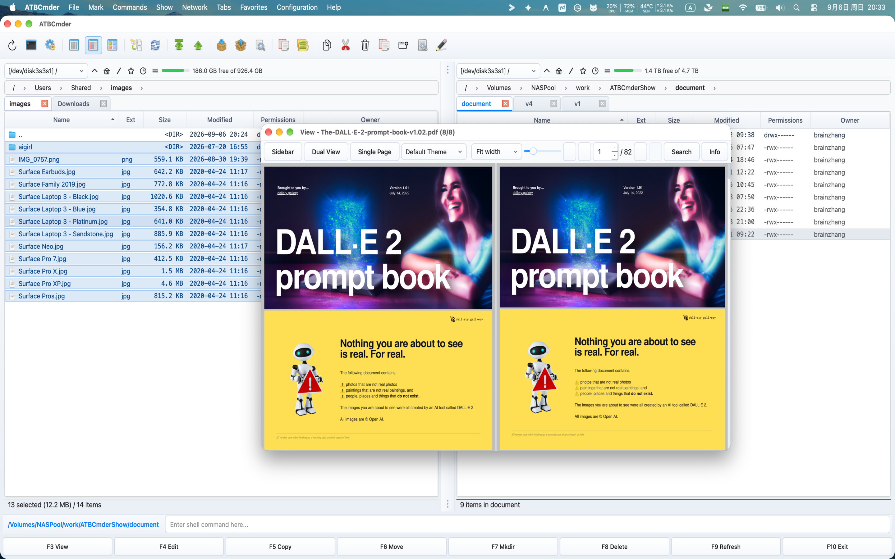
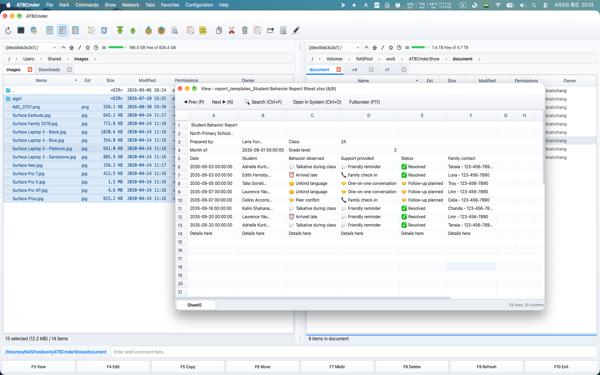
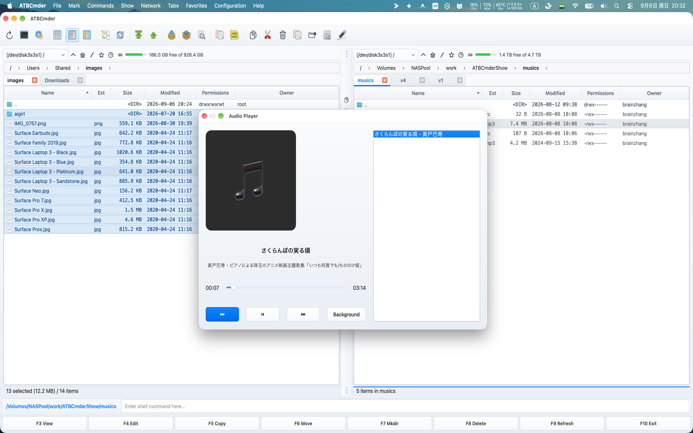

# Capitolo 4: Visualizzatore universale (Universal Lister) (Universal Lister) ed editor integrati

Nella gestione ortodossa dei file a doppio pannello, la velocità dipende in larga misura dalla velocità di ispezione. Il lancio di ambienti di sviluppo integrati (IDE) pesanti o di applicazioni desktop gonfie solo per verificare un checksum, controllare una riga di configurazione, ritagliare uno screenshot o esaminare un PDF crea attrito cognitivo e confusione di finestre. 

ATBCmder risolve questo problema fornendo un sottosistema di visualizzazione e modifica unificato e multi-motore, direttamente integrato nel nucleo dell'applicazione. Se hai bisogno di un'anteprima in linea in tempo reale mentre ti sposti tra le cartelle, di un'analisi forense approfondita a livello di byte in modalità esadecimale, di un lettore audio che continua a riprodurre in background mentre organizzi i file o di un editor di codice atomico e sensibile alla sintassi, ATBCmder ti offre il controllo immediato della tastiera. 

---

## 1. Avvio rapido visivo: ispezione e modifica immediata dei file

ATBCmder divide l'ispezione e la modifica dei file in due paradigmi distinti: 

1. **Visualizzazione rapida pannello avversario (`Cmd+Q` / `Ctrl+Q`)**: incorpora un'anteprima dal vivo con antirimbalzo direttamente all'interno del pannello inattivo senza generare finestre separate. 
2. **Lister universale dedicato (`F3`) ed editor interno (`F4`)**: apre finestre indipendenti e non modali che supportano motori di formato specializzati, ricerca di testo completo, riproduzione multimediale ed evidenziazione della sintassi. 

```
┌────────────────────────────────────────────────────────────────────────────────────────┐
│  PANNELLO ATTIVO (Navigazione file)                 PANNELLO INATTIVO (Quick View)     │
│  /Users/brain/Projects/atbcmder/src                 [Anteprima rapida: main.py]        │
├──────────────────────────────────────────────┬───┬─────────────────────────────────────┤
│  Nome                         Dim.   Data    │   │ 0001: """                           │
│  ▸ [..]                              --:--   │ Q │ 0002: Punto di ingresso principale  │
│  ✔ main.py                    8.4 KB 15:10   │ U │ 0003: """                           │
│  ● config.xml                12.1 KB 14:20   │ I │ 0004: import sys                    │
│  ● hero_banner.png          248.5 KB 09:12   │ C │ 0005: from PySide6.QtWidgets import │
│  ● sample_invoice.pdf       512.0 KB 11:30   │ K │ 0006:     QApplication              │
│  ● release_theme.mp3          4.2 MB 16:45   │   │                                     │
│  ● firmware_dump.bin          1.0 MB 10:00   │ V │ [UTF-8] [Python] [LF] [Riga 1/140]  │
├──────────────────────────────────────────────┴───┴─────────────────────────────────────┤
│   [Cmd+Q / Ctrl+Q] Attiva Quick View    [F3] Visualizzatore Lister    [F4] Editor      │
└────────────────────────────────────────────────────────────────────────────────────────┘
```

### Foglio informativo di ispezione e modifica a doppia matrice

| Azione | Scorciatoia macOS | Chiave del comandante classico | ID comando | Descrizione | 
| :--- | :--- | :--- | :--- | :--- | 
| **Attiva/disattiva visualizzazione rapida** | `Cmd+Q` / `⌘Q` | `Ctrl+Q` | `cm_QuickView` | Apre l'anteprima dal vivo nel pannello opposto. | 
| **Elenco universale** | `F3` / `Fn+F3` | `F3` | `cm_View` | Apre l'elemento selezionato in Universal Lister. | 
| **Redattore interno** | `F4` / `Fn+F4` | `F4` | `cm_Edit` | Apre l'editor di codice per il testo o l'editor di immagini per la grafica. | 
| **Crea e modifica un nuovo file** | `Shift+F4` / `⇧F4` | `Shift+F4` | `cm_EditNew` | Richiede il nome e apre l'editor. | 
| **Cambia messa a fuoco del pannello** | `Tab` / `⇥` | `Tab` | `cm_SwitchPanel` | Cambia la messa a fuoco; capovolge la Visualizzazione rapida simmetricamente. | 
| **Modalità di visualizzazione esadecimale** | `2` | `2` | — *(Lista)* | Attiva/disattiva l'ispezione esadecimale a livello di byte in Lister. | 
| **Modalità di visualizzazione testo** | `1` | `1` | — *(Lista)* | Riporta Lister alla modalità testo normale formattato. | 
| **Attiva/disattiva A capo automatico** | `Alt+W` / `⌥W` | `Alt+W` | — *(Lista/Redattore)* | Attiva/disattiva il ritorno a capo morbido delle righe nel Lister e nell'Editor. | 
| **Attiva/disattiva numeri di riga**| `Alt+L` / `⌥L` | `Alt+L` | — | Attiva/disattiva i numeri delle linee di margine sinistro. | 
| **Modalità coda registro live** | `F5` / `Fn+F5` | `F5` | — | Trasmette in tempo reale le voci di registro appena aggiunte. | 
| **Audio di sottofondo** | `Background` Tasto | — | — | Collega la riproduzione audio alla striscia di stato del pannello. | 
| **Configura associazioni**| Menù di configurazione | — | `cm_FileAssoc` | Configura estensioni di file e strumenti di supporto. | 

---

## 2. Pannello di visualizzazione rapida (`Cmd+Q` / `Ctrl+Q` / `cm_QuickView`)

Il **Pannello di visualizzazione rapida** è uno dei flussi di lavoro più potenti nei file manager ortodossi. Invece di aprire e chiudere finestre mobili mentre controlli una cartella contenente centinaia di elementi, Visualizzazione rapida trasforma il pannello inattivo in una finestra contestuale incorporata. 

 
*Figura 4.1: Visualizzazione rapida incorporata nel pannello opposto che mostra il codice evidenziato dalla sintassi in tempo reale insieme alla navigazione nella directory.*

### 2.1 Il vantaggio dell'anteprima a doppio pannello

Per attivare la Visualizzazione rapida: 

1. Passare a qualsiasi file o directory nel pannello attivo. 
2. Premere **`Cmd+Q`** (`⌘Q`) su macOS o **`Ctrl+Q`** (`cm_QuickView`). 
3. Il pannello opposto passa immediatamente dal normale elenco di directory al **Contenitore di visualizzazione rapida** (`QuickViewContainer`), visualizzando il contenuto dell'elemento sotto il cursore. 
4. Premendo nuovamente `Cmd+Q` o `Ctrl+Q` si chiude l'anteprima e si ripristina la scheda precedente e l'elenco delle cartelle del pannello opposto senza perdere la posizione.

### 2.2 Aggiornamento in tempo reale con rimbalzo di 100 ms

Quando si tengono premuti i tasti freccia `Up` o `Down` per scorrere rapidamente una cartella di migliaia di file, i visualizzatori di anteprima dei file standard spesso bloccano l'interfaccia utente o innescano un intenso sovraccarico del disco. 

ATBCmder risolve questo problema tramite un **timer antirimbalzo a scatto singolo da 100 millisecondi** interno (`_quick_view_timer`): 

- Mentre navighi rapidamente tra le righe, il percorso del file attivo viene memorizzato. 
- Il caricamento pesante dei file, l'analisi della sintassi e il rendering delle miniature si attivano solo quando il cursore si ferma su un elemento per almeno 100 ms. 
- Lo scorrimento rimane perfettamente fluido a oltre 60 fotogrammi al secondo, anche durante la navigazione in directory multimediali multi-gigabyte o dump di dischi grezzi.

### 2.3 Inversione simmetrica del fuoco su `Tab`

Un problema comune nei gestori a doppio pannello è la perdita dell'anteprima quando si cambia pannello. In ATBCmder, la Visualizzazione rapida presenta **Capovolgimento simmetrico della messa a fuoco**: 

- Se la Visualizzazione rapida è attiva sul pannello di destra e premi **`Tab`** per spostare il focus attivo sul pannello di destra: 
1. Il pannello destro ripristina immediatamente la normale tabella dei file in modo da poter interagire con i file. 
2. Visualizzazione rapida passa automaticamente e senza interruzioni al pannello di sinistra, visualizzando un'anteprima dal vivo di qualsiasi file evidenziato nel pannello di destra. 
- Ciò mantiene un ciclo ininterrotto di navigazione e ispezione indipendentemente dal pannello in cui stai lavorando.

### 2.4 Instradamento intelligente dei contenuti

Il contenitore Quick View rileva dinamicamente le estensioni dei file, le firme MIME e le intestazioni dei byte non elaborati per selezionare il motore di anteprima ottimale: 

| Tipo di contenuto | Estensioni/Firme | Motore di anteprima incorporato | 
| :--- | :--- | :--- | 
| **Codice sorgente e testo** | `.py`, `.rs`, `.cpp`, `.c`, `.h`, `.js`, `.ts`, `.html`, `.css`, `.json`, `.xml`, `.yaml`, `.md`, euristica del testo semplice | `TextPanel` con evidenziazione della sintassi di Pygments e numeri di riga. | 
| **Immagini raster e vettoriali**| `.png`, `.jpg`, `.jpeg`, `.webp`, `.svg`, `.bmp`, `.gif`, `.ico`, `.tiff` | `ImagePanel` con downsampling uniforme e mantenimento delle proporzioni. | 
| **Documenti PDF** | `.pdf` | `PdfPanel` con rendering della pagina `PySide6.QtPdf` nativo (Adatta alla larghezza). | 
| **Supporti audio e video** | `.mp3`, `.wav`, `.flac`, `.aac`, `.m4a`, `.ogg`, `.mp4`, `.mkv`, `.mov`, `.avi`, `.webm` | `MediaPanel` con anteprima audio disattivata e controlli di riproduzione. | 
| **Dati tabellari** | `.csv`, `.tsv`, `.xlsx`, `.xls`, `.ods` | `SpreadsheetPanel` con griglia della tabella di sola lettura e ridimensionamento automatico delle colonne. | 
| **Documenti e libri elettronici** | `.docx`, `.odt`, `.rtf`, `.epub` | `DocumentPanel` / `EpubPanel` renderer di documenti rich-text. | 
| **File di database** | `.sqlite`, `.sqlite3`, `.db` | `SqlitePanel` con browser schema e visualizzatore dati tabella. | 
| **Archivio** | `.zip`, `.tar`, `.gz`, `.bz2`, `.xz`, `.7z` | `ArchiveInspectorPanel` visualizzazione delle gerarchie dei membri non compresse. |

### 2.5 Fallback proprietà metadati (`QuickViewPropertiesWidget`)

Quando evidenzi una directory o un formato di file che non può essere visualizzato come testo o supporto, ATBCmder passa automaticamente alla **Visualizzazione fallback delle proprietà** (`QuickViewPropertiesWidget`): 

```
┌────────────────────────────────────────────────────────┐
│  📁 release_builds                                     │
│  /Volumes/ExternalSSD/Projects/release_builds          │
├────────────────────────────────────────────────────────┤
│  Metadata                                              │
│    Full Path:      /Volumes/ExternalSSD/...            │
│    Size:           Directory (or 148,290,112 bytes)    │
│    Last Modified:  2026-09-06 14:10:22                 │
│    Last Accessed:  2026-09-06 15:02:18                 │
├────────────────────────────────────────────────────────┤
│  Permissions (UNIX)                                    │
│    Octal Mode: 0755                                    │
│    Owner:  [✔] Read  [✔] Write  [✔] Execute            │
│    Group:  [✔] Read  [ ] Write  [✔] Execute            │
│    Others: [✔] Read  [ ] Write  [✔] Execute            │
├────────────────────────────────────────────────────────┤
│  Checksums / Stats                                     │
│    Contents: 42 files, 8 folders                       │
│    MD5:      Calculating... ➔ 8f14e45fceea167a...      │
│    SHA256:   Calculating... ➔ 3a491d90bc1f4201...      │
└────────────────────────────────────────────────────────┘
```
 

- **Scheda di intestazione**: visualizza l'icona di sistema ad alta risoluzione, il nome del file e il percorso principale. 
- **Metadati del file**: mostra la dimensione esatta in byte, la dimensione leggibile (`KB`, `MB`, `GB`, `TB`), il timestamp di modifica (`mtime`) e il timestamp di accesso (`atime`). 
- **Matrice di autorizzazione UNIX**: visualizza la modalità di autorizzazione ottale a 4 cifre (ad esempio `0755`, `0644`) insieme a una matrice di caselle di controllo 3x3 di sola lettura per Proprietario, Gruppo e Altri (`rwx`). 
- **Hash in background asincroni**: per i file, un thread in background asincrono (`HashWorker`) calcola gli hash crittografici MD5 e SHA-256 senza bloccare l'interfaccia. Per le directory, esegue la scansione e segnala il conteggio aggregato di file e sottocartelle nidificati. 

---

## 3. Lister universale (`F3` / `Fn+F3` / `cm_View`)

Mentre Quick View è ottimizzato per anteprime rapide all'interno della finestra a doppio pannello, **Universal Lister** (`F3` / `Fn+F3` / `cm_View`) apre una finestra dedicata non modale di livello superiore (`UniversalViewerDialog`). È possibile aprire più finestre Universal Lister contemporaneamente, consentendo di confrontare i documenti fianco a fianco o di mantenere i registri in streaming su display secondari.

### Barra degli strumenti di azione rapida superiore

Il Lister è dotato di una barra degli strumenti di azione rapida integrata che fornisce un rapido accesso alle modalità di visualizzazione, alla navigazione e alle impostazioni di visualizzazione: 

```
[Text (1)] [Hex (2)] [Wrap (Alt+W)] [Line Numbers (Alt+L)] [Tail (F5)] | [◀ Prev (P)] [Next ▶ (N)] | [🔍 Search (Ctrl+F)] [Go to Line (Ctrl+G)] | [Open in System (Ctrl+O)] [Fullscreen (F11)]
```
 

- **Modalità testo (`1`) / Modalità esadecimale (`2`)**: passa istantaneamente dalla visualizzazione dei caratteri decodificati all'ispezione dei byte grezzi. 
- **A capo automatico (`Alt+W` / `⌥W`)**: attiva/disattiva il ritorno a capo automatico per le righe lunghe. 
- **Numeri di riga (`Alt+L` / `⌥L`)**: attiva/disattiva il margine interno per la numerazione delle righe. 
- **Modalità coda (`F5`)**: scorre e acquisisce automaticamente i dati di registro appena scritti in tempo reale. 
- **File precedente (`P`) / File successivo (`N`)**: passa al file adiacente nella tabella dei file della cartella principale senza chiudere la finestra del visualizzatore. 
- **Trova (`Ctrl+F` / `Cmd+F`)**: apre la barra di ricerca inferiore ancorata. 
- **Vai alla riga (`Ctrl+G` / `Cmd+G`)**: richiede un numero di riga per passare direttamente al codice di destinazione. 
- **Apri nel sistema (`Ctrl+O` / `Cmd+O`)**: trasferisce il file all'applicazione predefinita del sistema macOS (ad esempio Anteprima, Safari o Xcode). 
- **Schermo intero (`F11` / `Alt+Enter`)**: ingrandisce la finestra Lister per riempire il display. 

---

### 3.1 Dominio 1: Documenti e libri strutturati

ATBCmder incorpora motori di layout specializzati per documenti strutturati, presentazioni di diapositive, libri elettronici e testo formattato, eliminando la necessità di attendere il lancio di suite per ufficio esterne.

#### 3.1.1 Documenti Word e RTF (`DocumentPanel`)

Quando si preme `F3` su file Microsoft Word (`.docx`, `.doc`), Rich Text (`.rtf`) o OpenDocument (`.odt`), ATBCmder attiva `DocumentPanel`: 

- **Schede pagine documento**: visualizza pagine strutturate su schede cartacee centrate (`.doc-page`) con caratteri e margini nitidi che si adattano ai layout dei moderni elaboratori di testi. 
- **Preservazione della formattazione**: preserva le gerarchie dei paragrafi, gli stili grassetto/corsivo/sottolineato, le variazioni di colore dei caratteri, gli elenchi numerati e non ordinati e i collegamenti ipertestuali incorporati. 
- **Tabelle complesse e rendering di immagini incorporate**: analizza complesse griglie di tabelle a più colonne con spaziatura delle celle delimitate ed esegue il rendering delle illustrazioni raster in linea incorporate. 
- **Zoom e ricerca della pagina**: controlli granulari dello zoom della pagina (`Ctrl++` / `Ctrl+-` o casella di selezione dello zoom) e barra di ricerca integrata nel documento (`ViewerSearchBar`).

#### 3.1.2 Schemi di diapositive di presentazione (`PresentationPanel`)

Per le presentazioni Microsoft PowerPoint (`.pptx`, `.ppt`), ATBCmder avvia `PresentationPanel`: 

- **Lettore di schede per diapositive**: ogni diapositiva viene estratta e formattata come una scheda di presentazione distinta e ombreggiata (`.slide-card`), consentendoti di rivedere i contenuti in sequenza. 
- **Striscia di selezione delle diapositive**: un cassetto di navigazione visiva elenca tutte le diapositive con gli indici delle miniature, consentendoti di passare immediatamente a qualsiasi diapositiva in un mazzo di 100 diapositive. 
- **Ricerca diapositive**: premi `Cmd+F` per cercare titoli di diapositive, elenchi puntati, note del relatore e blocchi di testo di callout nell'intera presentazione.

#### 3.1.3 Visualizzatore documenti PDF (`PdfPanel`)

Alimentato nativamente da `PySide6.QtPdf` e `QPdfView`, ATBCmder incorpora un lettore PDF di livello aziendale: 

 
*Figura 4.2: Visualizzatore PDF integrato con struttura dei segnalibri, striscia di miniature di pagina, ricerca nel documento e temi di lettura.* 

- **Scorrimento continuo di più pagine**: scorri senza interruzioni centinaia di pagine in modalità multipagina (`QPdfView.PageMode.MultiPage`) o passa alle visualizzazioni del libro a pagina singola e a due pagine. 
- **Barra laterale del documento**: 
- *Struttura/Albero dei segnalibri*: fai clic su qualsiasi capitolo o intestazione di sezione nel sommario PDF (`QPdfBookmarkModel`) per passare direttamente a quella sezione. 
- *Striscia miniature di pagina*: scansiona visivamente il layout e gli elementi grafici tramite l'elenco delle miniature verticale (`PdfThumbnailList`). 
- **Ricerca ed evidenziazione nel documento**: premi `Cmd+F` per cercare testo nel documento. Le corrispondenze vengono evidenziate sullo schermo con l'indicizzazione delle occorrenze in tempo reale (`Match 3 of 28`). Passa da un'occorrenza all'altra con `Enter` o `Shift+Enter`. 
- **Temi di lettura**: 
- *Normale*: rendering standard della carta del documento. 
- *Modalità notturna invertita*: inverte la luminanza dei pixel RGB (`InvertColorEffect`) per una lettura confortevole in ambienti bui senza affaticamento della vista. 
- *Sepia Warmth*: tonalità calda e morbida che riduce l'emissione di luce blu durante la revisione estesa dei documenti. 
- **Sicurezza e crittografia**: richiede facilmente le password sui file PDF crittografati tramite `PdfPasswordDialog` e controlla i metadati del creatore/produttore tramite `PdfPropertiesDialog`.

#### 3.1.4 eBook EPUB (`EpubPanel`)

La gestione della documentazione tecnica, dei manuali o dei libri digitali in formato EPUB (`.epub`) è nativa di ATBCmder: 

- **Architettura a doppio motore**: utilizza un renderer WebEngine ad alta fedeltà (`QWebEngineView` con `EpubUrlSchemeHandler` per uno stile CSS ricco e illustrazioni vettoriali SVG) con un fallback automatico a `QTextBrowser` su ambienti minimi. 
- **Barra laterale del sommario**: visualizza alberi di capitoli nidificati (`QTreeView`), consentendo di passare con un clic tra i capitoli del libro e le appendici. 
- **Ridimensionamento tipografia e caratteri**: ridimensiona dinamicamente le dimensioni del testo di lettura tramite il cursore dei caratteri nella barra degli strumenti inferiore. 
- **Temi per il comfort di lettura**: passaggio istantaneo tra le tavolozze dei colori Chiaro, Scuro e Seppia.

#### 3.1.5 Documenti di ribasso (`MarkdownPanel`)

Per file README, note tecniche e documentazione per sviluppatori (`.md`, `.markdown`): 

- **GitHub-Flavored Markdown (GFM)**: esegue il rendering di intestazioni, virgolette, regole orizzontali, elenchi di attività (`- [x]`) e tabelle a più colonne. 
- **Stile della sintassi del blocco di codice**: formatta automaticamente i blocchi di codice recintati (```python, ```bash, ```json) con ombreggiatura di sfondo distinta, tipografia a spaziatura fissa e colorazione della sintassi. 

---

### 3.2 Dominio 2: dati, tabelle e runtime per sviluppatori

Per utenti tecnici, analisti di dati e ingegneri del software, ATBCmder fornisce strumenti istantanei di ispezione dei dati offline che eliminano il sovraccarico di client di database esterni o applicazioni di fogli di calcolo.

#### 3.2.1 Fogli di calcolo ad alte prestazioni (`SpreadsheetPanel`)

L'apertura di file CSV di grandi dimensioni o di cartelle di lavoro Excel composte da più fogli nelle suite per ufficio pesanti può richiedere 10-20 secondi. `SpreadsheetPanel` di ATBCmder li renderizza istantaneamente: 

 
*Anteprima del foglio di calcolo Excel ad alte prestazioni in Universal Lister con schede multifoglio e coordinate congelate* 

- **Supporto formati**: Microsoft Excel (`.xlsx`, `.xls`), valori separati da virgole (`.csv`) e valori separati da tabulazioni (`.tsv`). 
- **Schede a più fogli**: le cartelle di lavoro con più fogli presentano una barra delle schede inferiore (`QTabBar`), che consente il passaggio rapido tra i fogli dati. 
- **Modello di tabella virtuale (`VirtualSpreadsheetModel`)**: utilizza il caricamento di righe incrementale lento tramite `canFetchMore` e `fetchMore`. Puoi scorrere CSV o fogli di lavoro con centinaia di migliaia di righe senza problemi con un ingombro minimo di memoria. 
- **Intestazioni di colonna e riga bloccate**: le coordinate standard del foglio di calcolo (`A, B, C...` e `1, 2, 3...`) rimangono fissate durante lo scorrimento per un orientamento chiaro. 
- **Esportazione TSV negli Appunti**: seleziona un intervallo di celle qualsiasi e premi **`Cmd+C`** (`⌘C`) per copiare i dati formattati come valori puliti separati da tabulazioni pronti per essere incollati nel codice, Slack o nei terminali. 
- **Ricerca rapida**: premi `Cmd+F` per cercare il contenuto della cella in tutte le colonne con focus cella in tempo reale.

#### 3.2.2 Browser del database SQLite (`SqlitePanel`)

Ispeziona i database SQLite (`.sqlite`, `.sqlite3`, `.db`) direttamente senza client GUI esterni: 

- **Directory di tabelle e visualizzazioni**: la barra laterale sinistra elenca tutte le tabelle e le visualizzazioni del database insieme al conteggio delle righe attive. Facendo clic su qualsiasi tabella ne viene caricato immediatamente il contenuto. 
- **Visualizzazione dati virtualizzata**: utilizza `VirtualSpreadsheetModel` ad alte prestazioni per lo scorrimento continuo di tabelle di grandi dimensioni. 
- **Console interattiva delle query SQL**: digita query SQL personalizzate nell'editor di query in alto e premi **`Ctrl+Return`** (o `Cmd+Return`) per eseguire. I risultati vengono inseriti immediatamente nella vista tabella. 
- **Formattazione del tipo di dati**: gestisce i dati in modo sicuro: formatta i BLOB binari come `<BLOB: N B>` e visualizza i campi vuoti come in corsivo `NULL`. 
- **Esporta dati**: fare clic con il pulsante destro del mouse per copiare i record selezionati o esportare i risultati della query in CSV o TSV.

#### 3.2.3 Taccuini Jupyter (`NotebookPanel`)

Esaminare gli esperimenti di data science, le esecuzioni di machine learning e i notebook di analisi Python (`.ipynb`): 

- **Rendering nativo zero-server**: analizza le strutture dei notebook JSON completamente offline senza richiedere un demone server Jupyter o JupyterLab attivo. 
- **Layout cella basato su scheda**: 
- *Celle Markdown*: rese in tipografia pulita con intestazioni, testo in grassetto ed elenchi. 
- *Celle di codice*: formattate con codice Python evidenziato dalla sintassi, numeri di riga e badge di esecuzione delle celle (ad esempio `[1]`, `[14]`). 
- *Blocchi di output*: visualizza i flussi di output della console, i traceback degli errori e grafici e diagrammi con codifica Base64 in linea (PNG/SVG).

#### 3.2.4 Visualizzazione di codice e testo normale (`TextPanel`)

Il motore principale di ispezione del testo è ottimizzato per la navigazione ad alta velocità e enormi dump di dati: 

- **Caricatore da 64 KB in blocchi (`FileLoaderWorker`)**: legge file di grandi dimensioni in blocchi da 64 KB con allineamento automatico dei limiti di nuova riga, impedendo il congelamento del thread e la corruzione dei caratteri multibyte UTF-8. 
- **Evidenziazione della sintassi Pygments**: oltre 150 linguaggi di programmazione e configurazione supportati con adattamento dinamico della modalità Luce/Scuro. 
- **Selettore di codifica dinamica**: rilevamento statistico del set di caratteri (`chardet`) con commutazione manuale della barra di stato tra UTF-8, GB18030, Big5, Shift-JIS, Windows-1252 e ISO-8859-1. 
- **Modalità Live Tail (`F5`)**: attiva `FileTailWatcher` per trasmettere in streaming le righe di registro aggiunte in tempo reale, corrispondenti a UNIX `tail -f`. Premi di nuovo `F5` per mettere in pausa.

#### 3.2.5 Ispezione byte esadecimali grezzi (`2` / Modalità esadecimale)

Durante l'ispezione di file binari, dump del firmware, librerie compilate o file danneggiati: 

- **Griglia esadecimale da 16 byte**: visualizza indirizzi di offset esadecimale da 8 cifre, 16 byte esadecimali suddivisi in due colonne visive da 8 byte e testo ASCII stampabile sulla destra (`.` per byte di controllo). 
- **Rilevamento automatico esadecimale**: se vengono rilevati byte nulli (`\x00`) entro il primo 1 KB di un file, ATBCmder passa automaticamente alla modalità esadecimale per evitare confusione nel terminale. 

---

### 3.3 Dominio 3: risorse multimediali e di sistema

ATBCmder include lettori multimediali con accelerazione hardware, visualizzatori grafici e ispettori tipografici integrati direttamente nel core.

#### 3.3.1 Visualizzatore immagini (`ImagePanel`)

Premi `F3` su qualsiasi formato immagine supportato (`.png`, `.jpg`, `.webp`, `.svg`, `.gif`, `.bmp`, `.ico`, `.tiff`): 

 
*Figura 4.3: Visualizzatore di immagini integrato con zoom interattivo, rotazione ed estrazione di metadati EXIF.* 

- **Tela interattiva**: zoom fluido con la rotellina del mouse ancorata alla posizione del cursore (`SmoothPixmapTransform`), ispezione pixel 1:1, Adatta alla finestra e panoramica tramite trascinamento a mano. 
- **Ispettore telemetria EXIF**: facendo clic su **Info EXIF** si estraggono i metadati della fotocamera: marca, modello, lunghezza focale dell'obiettivo, tempo di esposizione, apertura, ISO e coordinate GPS. 
- **Scena trasparenza scacchiera (`CheckerboardScene`)**: i canali alfa trasparenti nelle immagini PNG, WebP e SVG vengono renderizzati su una griglia a scacchiera grigia e bianca standard del settore.

#### 3.3.2 Lettore audio e modalità di riproduzione in background (`AudioPlayerDialog`)

Riproduci podcast, effetti sonori o raccolte musicali mentre lavori: 

 
*Figura 4.4: Lettore audio integrato con analisi dei tag ID3, copertine degli album e gestione delle playlist tramite trascinamento.* 

- **Formati supportati**: MP3, FLAC, WAV, AAC, M4A, OGG e AIFF con tag ID3 mutageno ed estrazione della grafica della copertina. 
- **Modalità di riproduzione in background**: fai clic sul pulsante **Sfondo** nel lettore. La finestra del lettore si aggancia a un **controller mini-player** compatto nella barra delle operazioni in background del pannello destro (`bg_ops_container`): 
- Visualizza il titolo e l'artista del brano attualmente in riproduzione. 
- Pulsanti di riproduzione interattiva: Precedente (`⏮`), Riproduci/Pausa (`▶` / `⏸`) e Successivo (`⏭`). 
- La musica viene riprodotta ininterrottamente mentre sfogli file, esegui rinominazioni batch o sincronizzi cartelle. 
- Premendo `F3` su file audio aggiuntivi nel pannello dei file li si aggiunge automaticamente alla playlist in esecuzione! 

 
*Figura 4.5: Mini-player di sfondo incorporato direttamente nella barra delle operazioni del pannello.*

#### 3.3.3 Lettore video con accelerazione hardware (`MediaPanel`)

Per i file video (`.mp4`, `.mkv`, `.mov`, `.avi`, `.webm`): 

 
*Figura 4.6: Lettore video con accelerazione hardware con controlli OSD (mobile on-screen display).* 

- **Decodifica zero-overhead**: basato su `QtMultimedia` utilizzando macOS VideoToolbox e l'accelerazione GPU Apple Silicon. 
- **Controlli OSD con dissolvenza automatica**: lo scrubber della timeline mobile, il cursore del volume e i controlli di riproduzione svaniscono durante la riproduzione. 
- **Cambio sottotitoli e traccia**: passa tra flussi audio incorporati e file di sottotitoli esterni (`.srt`, `.vtt`). 
- **Modalità a schermo intero**: premi **`F11`** o fai doppio clic per accedere a schermo intero; premi `Esc` per tornare.

#### 3.3.4 Ispettore tipografia carattere (`FontPanel`)

Anteprima dei caratteri di sistema e progettazione (`.ttf`, `.otf`, `.woff`, `.woff2`, `.ttc`): 

- **Anteprime dimensione cascata**: esegue il rendering del testo di anteprima con dimensioni in punti di progettazione standard: 12, 16, 20, 24, 32, 48 e 64 pt. 
- **Stringa di test personalizzata**: inserisci stringhe personalizzate per testare la crenatura e la punteggiatura di caratteri specifici. 
- **Pangrammi bilingui**: l'anteprima predefinita mostra i pangrammi bilingui completi: *"La veloce volpe marrone salta sopra il cane pigro 1234567890 敏捷的棕狐跃过懒狗"*. 

---

### 3.4 Dominio 4: Archivi di sistema e comunicazioni

#### 3.4.1 Ispettore archivio in-lister (`ArchivePanel`)

Premendo `Enter` si aprono gli archivi direttamente nel pannello file tramite Archivio VFS, premendo **`F3`** su un archivio (`.zip`, `.tar`, `.7z`, `.tar.gz`, `.tar.bz2`, `.tar.xz`) apre la **Ispezione Archivio**: 

- Ispeziona le gerarchie di directory interne, i conteggi dei membri, le dimensioni dei byte non compressi, le dimensioni dei byte compressi e i rapporti di compressione in una visualizzazione ad albero veloce e di sola lettura.

#### 3.4.2 Visualizzatore archivio e-mail (`EmailPanel`)

Per le comunicazioni e-mail salvate e gli archivi dei messaggi (`.eml`, `.msg`): 

- **Decodifica intestazione MIME RFC 2047**: decodifica accuratamente nomi di mittenti internazionali, date, destinatari CC e oggetti di posta elettronica. 
- **Scheda di intestazione visiva**: formatta le intestazioni delle e-mail in una scheda di metadati pulita. 
- **Attiva/disattiva Rich Body**: passa dal corpo email HTML formattato al testo semplice e non elaborato. 
- **Estrazione allegati**: elenca tutti gli allegati incorporati con le dimensioni dei file e fornisce un pulsante **"Salva allegato con nome..."** per estrarre i file direttamente sul disco. 

---

## 4. Editor interni: architettura dual-mode (`F4` / `Fn+F4` / `cm_Edit`)

ATBCmder è dotato di un intelligente **Motore di spedizione dell'editor a doppia modalità**: 

- **Quando il cursore si trova su file di testo, codice o configurazione**: premendo `F4` si apre l'**editor del codice interno** (`EditorWindow`). 
- **Quando il cursore è sui file immagine (`.png`, `.jpg`, `.webp`, `.bmp`, `.svg`)**: Premendo `F4` si avvia automaticamente l'**Immagine dedicata Editor** (`ImageEditorDialog`)! 

Per creare e modificare da zero un nuovo file nella cartella attiva, premere **`Shift+F4`** (`cm_EditNew`). ATBCmder ti richiede un nome file (ad esempio `deploy.sh` o `docker-compose.yml`), inizializza il file e lo apre immediatamente nell'editor. 

---

### 4.1 Editor del codice interno (`EditorWindow`)

```
┌────────────────────────────────────────────────────────────────────────────────────────┐
│  Edit: /Users/brain/Projects/atbcmder/scripts/deploy.sh [*]                            │
├────────────────────────────────────────────────────────────────────────────────────────┤
│  [💾 Save] [Save As] | [↶ Undo] [↷ Redo] | [🔍 Find] [Replace] | [Wrap] [Lines] [Zoom]   │
├──────┬─────────────────────────────────────────────────────────────────────────────────┤
│ 0001 │ #!/usr/bin/env bash                                                             │
│ 0002 │ set -euo pipefail                                                               │
│ 0003 │                                                                                 │
│ 0004 │ echo "Deploying ATBCmder release bundle..."                                     │
│ 0005 │ TARGET_DIR="/opt/atbcmder"                                                      │
│ 0006 │ if [ ! -d "$TARGET_DIR" ]; then                                                 │
│ 0007 │     mkdir -p "$TARGET_DIR"                                                      │
│ 0008 │ fi                                                                              │
├──────┴─────────────────────────────────────────────────────────────────────────────────┤
│  Find: [deploy                  ]  Replace: [release                  ] [Match 1 of 3] │
│  [Aa] Match Case   [\b] Whole Word   [.*] RegEx   [Find Next] [Replace] [Replace All]  │
├────────────────────────────────────────────────────────────────────────────────────────┤
│  Line 5, Col 12 | 8 lines | UTF-8 | LF (UNIX) | Bash Shell | [Modified *]              │
└────────────────────────────────────────────────────────────────────────────────────────┘
```

#### Funzionalità principali dell'editor del codice

- **Evidenziazione della sintassi Pygments**: riconosce oltre 150 formati di programmazione, scripting e configurazione con rilevamento automatico della lingua dalle estensioni di file e dalle linee shebang. 
- **Rilegatura dinamica dei numeri di riga**: il margine sinistro si espande dinamicamente per accogliere i numeri di riga con allineamento visivo. 
- **Rientro automatico intelligente e blocco rientro**: premendo `Enter` si spostano gli spazi bianchi di rientro; seleziona i blocchi e premi `Tab` per rientrare o `Shift+Tab` per annullare il rientro. 
- **A capo automatico (`Alt+W` / `⌥W`)**: manda a capo le righe lunghe ai limiti della finestra senza inserire interruzioni di nuova riga rigide. 
- **Controlli zoom**: ridimensiona facilmente la tipografia utilizzando `Cmd++` (`⌘+`), `Cmd+-` (`⌘-`) o reimposta con `Cmd+0` (`⌘0`).

#### Barra interattiva Trova e sostituisci (`EditorReplaceBar`)

Premendo **`Cmd+F`** (`⌘F`) o **`Cmd+Option+F`** (`⌥⌘F`) si aggancia la barra Trova e sostituisci in basso: 

- Ricerca incrementale in tempo reale con indicizzazione delle occorrenze (`Match 4 of 19`). 
- Flag di ricerca: distinzione tra maiuscole e minuscole (`[Aa]`), parola intera (`[\b]`) ed espressioni regolari Python (`[.*]`). 
- Azioni batch: **Sostituisci** (occorrenza corrente) e **Sostituisci tutto** (intero documento).

#### Barra di stato e protezione del salvataggio atomico

- **Telemetria**: visualizza riga, colonna, conteggio totale delle righe, codifica e convenzione di nuova riga (`LF` vs `CRLF`). 
- **Dirty State Badge**: un indicatore `*` prominente viene visualizzato nella barra del titolo e nella barra di stato ogni volta che sono presenti modifiche non salvate. 
- **Protezione salvataggio atomico**: quando si preme `Cmd+S`, ATBCmder scrive i dati in un file temporaneo sullo stesso volume, sincronizza i buffer del disco ed esegue una sostituzione atomica, assicurando che il file originale non venga mai danneggiato in caso di arresto anomalo o interruzione di corrente durante il salvataggio. 

---

### 4.2 Editor di immagini dedicato (`ImageEditorDialog`)

Quando premi **`F4`** su qualsiasi elemento grafico o screenshot, ATBCmder apre l'**editor di immagini completo**:

#### Tela interattiva e trasformazioni

- **Sfondo a scacchiera (`CheckerboardScene`)**: la grafica trasparente viene renderizzata su una griglia grigia e bianca pulita, garantendo che i bordi alfa siano chiaramente visibili. 
- **Rotazione e ribaltamento**: ruota di 90° in senso orario/antiorario, regola con precisione angoli di livellamento arbitrari o specchia orizzontalmente e verticalmente. 
- **Zoom e panoramica**: zoom fluido con tracciamento del cursore e navigazione con trascinamento della mano.

#### Ritaglio con proporzioni predefinite

- Trascina le maniglie della tela per definire i confini del ritaglio. 
- Passa tra le proporzioni **Forma libera**, **Quadrato 1:1** (avatar/icone app), **4:3 Classico** e **16:9 Cinema**. Premi `Enter` per applicare.

#### Annotazioni vettoriali

- **Rettangoli e cerchi**: evidenzia gli elementi dell'interfaccia con larghezze dei bordi e colori della tavolozza personalizzati. 
- **Frecce direzionali**: disegna frecce di richiamo vettoriali nitide. 
- **Penna a mano libera**: disegna correzioni o firme a mano libera direttamente sulla tela. 
- **Timbri di testo**: aggiungi elementi tipografici con caratteri, dimensioni, colori e ombre esterne discrete personalizzabili.

#### Oscuramento della privacy (Mosaico/Sfocatura)

Hai bisogno di condividere uno screenshot contenente token riservati, nomi di clienti o numeri di telefono? 

- Seleziona lo strumento **Mosaico/Sfocatura**. 
- Trascina una casella di selezione sulle informazioni sensibili. 
- ATBCmder applica la pixelizzazione a raggio variabile o la sfocatura gaussiana, oscurando in modo sicuro i dati sensibili prima dell'esportazione.

#### Modulo Filigrana

Applica il marchio di proprietà professionale utilizzando 4 posizionamenti preimpostati: 

- **A piastrelle (`tiled`)**: motivo filigrana angolato e ripetuto che copre l'intera tela (ideale per bozze riservate). 
- **Timbro (`stamp`)**: timbro di autenticazione distinto posizionato nell'angolo in basso a destra. 
- **Banner (`banner`)**: banner di branding orizzontale semitrasparente che corre sull'area di disegno. 
- **Logo singolo (`single`)**: logo singolo o filigrana di testo liberamente posizionabili con dispositivo di scorrimento dell'opacità. 

---

### 4.3 Modifica VFS andata e ritorno senza soluzione di continuità (remoto e archivi)

L'aspetto più potente del sottosistema editor di ATBCmder è la sua **Integrazione VFS universale**: 

- Sia che si prema `F4` su uno script shell archiviato su un server SFTP remoto, un file di configurazione all'interno di un montaggio WebDAV AWS Nextcloud o uno screenshot all'interno di un archivio nidificato `.zip` (`vfs://`): 
1. ATBCmder scarica il file in modo asincrono in una sandbox temporanea sicura. 
2. Il file si apre in `EditorWindow` o `ImageEditorDialog`. 
3. Quando premi `Cmd+S`, ATBCmder intercetta l'evento di salvataggio, sincronizza il file modificato e trasmette automaticamente i dati aggiornati su SFTP/SMB o impegna `RepackWorker` per reimballare l'archivio! 
4. Alla chiusura dell'editor, i file temporanei della cache vengono cancellati in modo pulito. Non dovrai mai decomprimere, modificare e ricaricare manualmente i file. 

---

## 5. ⚡ Suggerimenti professionali e approfondimento

Padroneggia queste funzionalità avanzate per massimizzare l'efficienza di ispezione e modifica.

### Suggerimento professionale 1: acquisizione coda audio dinamica con `F3`

Quando il lettore audio è in esecuzione in **modalità di riproduzione in background** mentre sfogli la tua raccolta musicale, non è necessario riaprire la finestra di dialogo per mettere in coda altra musica: 

1. Evidenziare uno o più file audio in uno dei pannelli dei file. 
2. Premere **`F3`** (o `Fn+F3`). 
3. ATBCmder rileva che un'istanza del lettore audio è già attiva e **aggiunge automaticamente le tracce selezionate** alla playlist in esecuzione (`append_tracks`) senza interrompere la traccia attualmente in riproduzione.

### Suggerimento professionale 2: associazioni di file personalizzate (`cm_FileAssoc`)

Per impostazione predefinita, premendo `F3` si apre l'Universal Lister e `F4` si apre l'editor di codice interno. Tuttavia, puoi associare estensioni di file specifiche ad applicazioni desktop esterne o comandi shell personalizzati utilizzando **Gestione associazioni file** (`cm_FileAssoc`): 

Passare a **Configurazione ➔ Configurazione delle associazioni di file**: 

- Puoi associare le estensioni (ad esempio `*.rs`, `*.py`, `*.psd`) ad azioni personalizzate. 
- **Comandi interni**: si associa alle azioni del comandante interno (ad esempio `cm_View`, `cm_Edit`). 
- **Comandi shell esterni con sostituzione token**: 
- `%f` ➔ Sostituito dal percorso assoluto del file (es. `/Users/brain/main.rs`). 
- `%d` ➔ Sostituito dal percorso della directory principale (ad esempio `/Users/brain`). 
- `%n` ➔ Sostituito dal nome del file senza estensione (es. `main`). 
- `%e` ➔ Sostituito dall'estensione del file senza punto (es. `rs`). 

*Esempio di associazione esterna per file Rust:* 
```bash
code --goto %f
```

### Suggerimento 3 degli esperti: modalità Live Tail (`F5`) per i log DevOps

Durante il debug di daemon del server locale, contenitori Docker o script di compilazione, aprire il file di registro in Universal Lister (`F3`) e premere **`F5`**: 

- Coinvolge il demone `FileTailWatcher`. 
- Lister scorre automaticamente verso il basso e trasmette sullo schermo le righe appena aggiunte in tempo reale, corrispondendo al comportamento di UNIX `tail -f`. 
- Puoi mantenere attivi i filtri di ricerca durante il tailing per evidenziare gli errori non appena si verificano.

### Suggerimento professionale 4: streaming con offset arbitrario per file multi-gigabyte

Se è necessario controllare un dump del database da 20 GB o un'immagine del disco, non tentare di aprirlo in un editor standard. Nel Lister universale di ATBCmder: 

- Utilizza **Vai alla riga (`Ctrl+G`)** o salta i controlli del cursore. 
- Il sottostante `FileLoaderWorker` utilizza la ricerca diretta del puntatore di file binario (`fh.seek(offset)`), leggendo solo l'esatto blocco da 64 KB richiesto per eseguire il rendering della vista. 
- È possibile ispezionare istantaneamente settori arbitrari di un volume multi-terabyte senza sovraccarico di memoria. 

---

## 6. Ricette pratiche passo dopo passo

### Soluzione 1: ispezione e correzione di uno screenshot sensibile

**Obiettivo**: hai acquisito uno screenshot contenente token API riservati o informazioni sul cliente e devi oscurarlo prima di caricarlo su un sistema di monitoraggio dei problemi pubblico. 

```
Step 1: Highlight screenshot.png in the active panel and press F3 (Universal Lister).
Step 2: On the top toolbar, click "Edit Image" to launch the Image Editor.
Step 3: Select the "Mosaic / Blur" tool from the tool palette.
Step 4: Click and drag a selection rectangle over the API token to pixelate the text.
Step 5: Select the "Crop" tool, frame the relevant portion of the window, and press Enter.
Step 6: Click "Save" (Cmd+S) to overwrite, or "Save As" to create screenshot_redacted.png.
Step 7: Press Esc to close the editor; your clean image is ready in the file panel.
```
 

---

### Soluzione 2: monitoraggio dei registri in tempo reale e ispezione forense degli esadecimali

**Obiettivo**: un processo in background non riesce a causa di un errore di codifica. È necessario guardare il registro in tempo reale e ispezionare i byte grezzi attorno a una sequenza non corretta. 

```
Step 1: Highlight server.log in the active panel and press F3.
Step 2: Press F5 to activate Tail Mode. Watch incoming live log entries stream past.
Step 3: When the error appears, press F5 again to pause tailing.
Step 4: Press Ctrl+F and search for the error code (e.g. "0xEF").
Step 5: Press 2 on your keyboard to switch into Hex Mode.
Step 6: Inspect the exact 16-byte hexadecimal dump to examine unprintable control characters.
Step 7: Press 1 to return to formatted text mode, or Esc to close.
```
 

---

### Soluzione 3: creazione rapida del codice sorgente e staging Git

**Obiettivo**: creare un nuovo script di shell nel repository del progetto corrente, impostare intestazioni bash standard e prepararlo per l'esecuzione senza uscire da ATBCmder. 

```
Step 1: In the active directory, press Shift+F4 (cm_EditNew).
Step 2: In the dialog prompt, type "build_release.sh" and press Enter.
Step 3: The Internal Code Editor opens immediately with an empty buffer.
Step 4: Type your script. Notice that auto-indent automatically indents loops and if-blocks:
        #!/usr/bin/env bash
        set -euo pipefail
        echo "Building binaries..."
Step 5: Press Cmd+S (⌘S) to save the file atomically to disk.
Step 6: Press Cmd+W (⌘W) to close the editor.
Step 7: With build_release.sh highlighted in the panel, press Alt+Enter (cm_SetFileProperties).
Step 8: Check the "Execute" permission for Owner (chmod +x) and press Enter.
```
 

---

## 7. Avvisi di sicurezza e sistema

> [!WARNING] 
> **Osservatori esterni delle modifiche** 
> Se un file aperto viene modificato o troncato da un'applicazione esterna mentre si lavora nell'editor interno (`F4`), ATBCmder visualizza un avviso di conflitto di modifiche esterne prima del salvataggio. Scegli sempre **Ricarica** per controllare la versione più recente del disco o **Salva con nome** per conservare le modifiche locali in un file separato. 

> [!IMPORTANT] 
> **Sicurezza dei file binari: modalità testo e modalità esadecimale** 
> L'apertura di un file binario sconosciuto in modalità testo e il salvataggio su disco può danneggiare permanentemente il file a causa delle sostituzioni della decodifica UTF-8 (`\ufffd`). L'Universal Lister di ATBCmder è di sola lettura per impostazione predefinita, garantendo che i tuoi file binari non vengano mai sovrascritti accidentalmente durante l'ispezione. 

> [!WARNING] 
> **Visualizzazione rapida delle prestazioni sulle condivisioni di rete remote** 
> Durante la navigazione su server remoti ad alta latenza (FTP, SFTP o WebDAV) con Visualizzazione rapida (`Cmd+Q`) attiva, l'anteprima di enormi file di archivio o video remoti attiverà lo streaming remoto. Se la larghezza di banda della rete è limitata, disattiva la Visualizzazione rapida (`Cmd+Q`) per sfogliare gli alberi delle directory alla massima velocità. 

> [!TIP] 
> **Accessibilità tasti funzione macOS** 
> Sui moderni Apple MacBook e Magic Keyboards, i tasti funzione (`F1`-`F12`) sono mappati per impostazione predefinita sui controlli hardware (luminosità, riproduzione multimediale). Per attivare `F3` o `F4`, tieni premuto il tasto **`Fn`** (ad esempio `Fn+F3`, `Fn+F4`). In alternativa, abilita **"Utilizza i tasti F1, F2, ecc. come tasti funzione standard"** in macOS *Impostazioni di sistema ➔ Tastiera ➔ Scorciatoie da tastiera ➔ Tasti funzione*. 

---

## 8. Tabella di riferimento della tastiera a doppia matrice

| Area Funzionale | Azione Descrizione | Scorciatoia macOS | Chiave del comandante classico | ID comando | 
| :--- | :--- | :--- | :--- | :--- | 
| **Visualizzazione rapida** | Attiva/disattiva l'anteprima del pannello opposto | `Cmd+Q` / `⌘Q` | `Ctrl+Q` | `cm_QuickView` | 
| **Visualizzazione rapida** | Cambia pannello e capovolgi anteprima | `Tab` / `⇥` | `Tab` | `cm_SwitchPanel` | 
| **Lista** | Apri file in Universal Lister | `F3` / `Fn+F3` | `F3` | `cm_View` | 
| **Lista** | Modalità di visualizzazione testo normale | `1` | `1` | — *(Lista)* | 
| **Lista** | Modalità di visualizzazione esadecimale grezza | `2` | `2` | — *(Lista)* | 
| **Lista** | Attiva/disattiva A capo automatico | `Alt+W` / `⌥W` | `Alt+W` | — *(Lista/Redattore)* | 
| **Lista** | Attiva/disattiva i numeri di riga | `Alt+L` / `⌥L` | `Alt+L` | — *(Lista/Redattore)* | 
| **Lista** | Attiva/disattiva la modalità coda registro live | `F5` / `Fn+F5` | `F5` | — *(Lista)* | 
| **Lista** | File precedente nella directory | `P` | `P` | — *(Lista)* | 
| **Lista** | File successivo nella directory | `N` | `N` | — *(Lista)* | 
| **Lista** | Trova testo | `Cmd+F` / `⌘F` | `Ctrl+F` | — *(Lista/Redattore)* | 
| **Lista** | Vai a Numero di riga | `Cmd+G` / `⌘G` | `Ctrl+G` | — *(Lista/Redattore)* | 
| **Lista** | Apri nell'app predefinita del sistema | `Cmd+O` / `⌘O` | `Ctrl+O` | — *(Lista)* | 
| **Lista** | Attiva/Disattiva schermo intero | `F11` / `Fn+F11` | `F11` | `cm_FullScreen` | 
| **Redattore** | Modifica file selezionato (codice/immagine) | `F4` / `Fn+F4` | `F4` | `cm_Edit` | 
| **Redattore** | Crea e modifica un nuovo file | `Shift+F4` / `⇧F4` | `Shift+F4` | `cm_EditNew` | 
| **Redattore** | Salva file (atomico) | `Cmd+S` / `⌘S` | `Ctrl+S` | — | 
| **Redattore** | Salva file con nome | `Shift+Cmd+S` / `⇧⌘S` | `F12` | — | 
| **Redattore** | Ricarica/Ripristina file | `Cmd+R` / `⌘R` | `Ctrl+R` | — | 
| **Redattore** | Chiudi la finestra dell'editor | `Cmd+W` / `⌘W` | `Esc` | — | 
| **Redattore** | Trova nel Documento | `Cmd+F` / `⌘F` | `Ctrl+F` | — | 
| **Redattore** | Trova e sostituisci | `Cmd+Option+F` / `⌥⌘F` | `Ctrl+H` | — | 
| **Redattore** | Rientro blocco selezionato | `Tab` / `⇥` | `Tab` | — | 
| **Redattore** | Elimina il rientro del blocco selezionato | `Shift+Tab` / `⇧⇥` | `Shift+Tab` | — | 
| **Redattore** | Zoom avanti/indietro/Reimposta | `⌘+` / `⌘-` / `⌘0` | `Ctrl++` / `Ctrl+-` / `Ctrl+0` | — | 
| **Media** | Riproduzione audio di sottofondo | Fare clic su `Background` | — | — | 
| **Media** | Aggiungi audio alla playlist | `F3` (durante la riproduzione) | `F3` | `cm_View` | 
| **Configurazione** | Gestore associazioni file | Menù di configurazione | — | `cm_FileAssoc` |

--- 

<div align="center"> 
<p>Pronto per automatizzare flussi di lavoro complessi ed elaborazioni batch?</p> 
<p><strong><a href="power_tools.md">Procedi al capitolo 5: Utensili elettrici e automazione &rarr;</a></strong></p> 
</div>