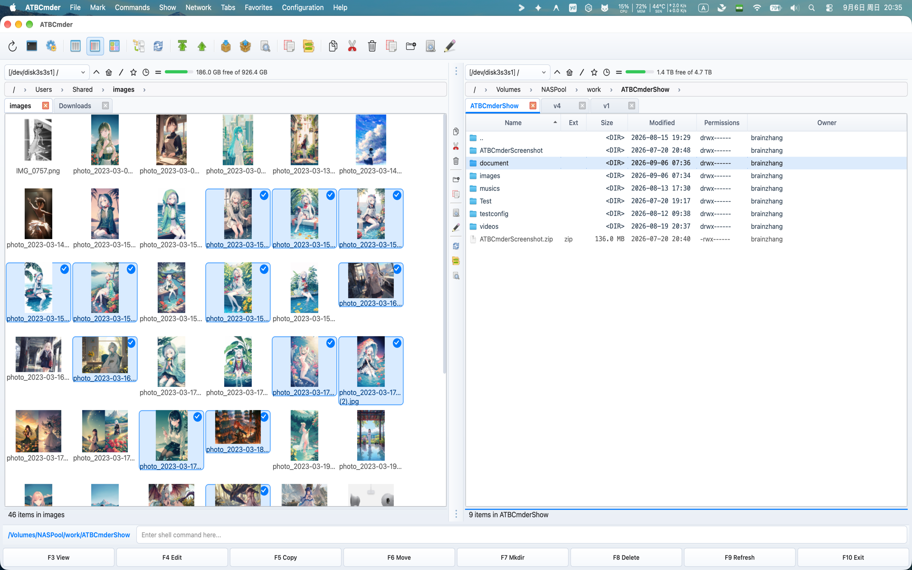

# 第2章：高速ナビゲーションとフォルダータブ

ディレクトリ内の流動的で高速な移動は、従来のファイル管理の基礎です。 ATBCmder では、スクロールバーをドラッグしたり、ネストされたフォルダーを繰り返しクリックしたり、断片化された多数の Finder ウィンドウと格闘したりして時間を無駄にする必要はありません。 

この章では、絶対的な自信を持ってローカルおよびリモートのファイル システムをナビゲートするために必要なすべてについて説明します。インタラクティブなブレッドクラム、キーボード階層のジャンプ、ネイティブ macOS マルチタブ ワークフロー、永続的なデュアルパネルの [お気に入り] タブ ワークスペース、インスタント ファジー検索ブックマーク、および 5 つの特殊なパネル ビュー モードです。 

---

## 1. ビジュアルクイックスタート: 簡単な階層と空間構成

ATBCmder では、各パネルは、独自のブレッドクラム チェーン、独立したタブ ストリップ、履歴スタック、および表示モードを備えた自律的なブラウジング エンジンとして動作します。 

```
┌─────────────────────────────────────────────────────────────────────────────────┐
│ [BREADCRUMB]  🏠 / ▸ Users ▸ username ▸ Projects ▸ ATBCmder ▸ src               │
├─────────────────────────────────────────────────────────────────────────────────┤
│ [TAB STRIP]   [★ Source (Locked)] [Assets] [Build Output] [+]                   │
├─────────────────────────────────────────────────────────────────────────────────┤
│  Name                         Ext       Size      Date Modified      Attr       │
│  ▸ [..]                                           --:--              drwxr-xr-x │
│  ▸ core                       <DIR>               Today, 14:22       drwxr-xr-x │
│  ▸ ui                         <DIR>               Today, 15:05       drwxr-xr-x │
│  ● main.py                    py        8.4 KB    Today, 15:10       -rw-r--r-- │
│  ● config.xml                 xml       12.1 KB   Yesterday, 19:40   -rw-r--r-- │
│                                                                                 │
├─────────────────────────────────────────────────────────────────────────────────┤
│ [QUICK SEARCH]  🔍 Find: mai_   (Matches: main.py)                              │
└─────────────────────────────────────────────────────────────────────────────────┘
```

### デュアル マトリックス ナビゲーションのチートシート

| アクション | macOS ショートカット | クラシック コマンダー キー | コマンドID | 説明 |
 | :--- | :--- | :--- | :--- | :--- |
 | **親ディレクトリ** | `Backspace` / `⌘↑` | `Ctrl+PgUp` | `cm_ChangeDirToParent` | ディレクトリ レベルを 1 つ上に移動します (`..`)。 |
 | **ルート ディレクトリ** | `Ctrl+\` / `⌃\` | `\` | `cm_ChangeDirToRoot` | システム ルート (`/`) に直接ジャンプします。 |
 | **ホーム ディレクトリ** | `Ctrl+Shift+Home` / `⌃⇧Home` | `Alt+Home` | `cm_ChangeDirToHome` | ユーザーのホーム ディレクトリ (`~`) にジャンプします。 |
 | **項目を開く/ディレクトリを入力** | `Enter` / `⌘↓` | `Enter` | — | 選択したディレクトリを入力するか、ファイルを開きます。 |
 | **新しいタブ** | `Cmd+T` / `⌘T` | `Ctrl+T` | `cm_NewTab` | 新しいタブでアクティブなフォルダーを開きます。 |
 | **タブを閉じる** | `Cmd+W` / `⌘W` | `Ctrl+W` | `cm_CloseTab` | 現在フォーカスされているタブを閉じます。 |
 | **ディレクトリ ホットリスト** | `Ctrl+D` / `⌃D` | `Ctrl+D` | `cm_DirHotList` | インスタントファジーブックマークポップアップを開きます。 |
 | **歴史に戻る** | `Cmd+[` / `⌘[` | `Alt+Left` | `cm_ViewHistoryPrev` | 以前にアクセスしたフォルダーに戻ります。 |
 | **歴史の前進** | `Cmd+]` / `⌘]` | `Alt+Right` | `cm_ViewHistoryNext` | ディレクトリ履歴を前に進みます。 |
 | **履歴ドロップダウン リスト** | `Alt+F8` / `⌥F8` | `Ctrl+Down` | `cm_DirHistory` | 履歴ドロップダウンリストを表示します。 |
 | **ドライブ/ボリュームリスト (左/右)** | `⌥F1` / `⌥F2` (`⌥D`) | `Alt+F1` / `Alt+F2` (`Alt+D`) | `cm_LeftOpenDrives` / `cm_RightOpenDrives` (`cm_Drives`) | 左側または右側のパネルのドライブ メニューを開きます (アクティブ パネルの場合は `Alt+D`)。 |
 | **クイック検索** | `Ctrl+S` / `⌃S` | `Ctrl+S` | `cm_QuickSearch` | パネルでリアルタイム検索オーバーレイを開きます。 |

 ---

## 2. 基本的なディレクトリ ナビゲーション: パス、ブレッドクラム、ショートカット

ATBCmder は、マウス ジェスチャ、トラックパッドのクリック、純粋なキーボードの速度など、ファイル システム内を移動するための複数の冗長で人間工学に基づいた方法を提供します。

### マウスとトラックパッドのナビゲーション

- **フォルダーの入力**: 任意のディレクトリ行をダブルクリックするか、`Enter` (`Return`) を押します。 
- **昇順階層**: 先頭の `[..]` 行をダブルクリックすると、すぐに親フォルダーにジャンプします。 
- **バックグラウンド タブ**: フォルダーの行を中クリックすると、現在のビューを失うことなく、そのディレクトリが新しいバックグラウンド タブで開きます (`cm_OpenDirInNewTab`)。

### Finder スタイルのインタラクティブなブレッドクラム バー

各ファイル パネルの真上に配置されたインタラクティブなブレッドクラム バーは、現在の UNIX パスをクリック可能なセグメントのチェーンとして表します。 

```
🏠 / ▸ Users ▸ brain ▸ Projects ▸ ATBCmder ▸ docs
```


 1. **インスタント祖先リーピング**: 任意の祖先セグメント (`Projects` や `Users` など) をクリックすると、複数の親フォルダーのナビゲーションをバイパスして、そのレベルに直接ジャンプします。 
2. **兄弟ディレクトリ ドロップダウン**: セグメント間の山形 (`▸`) の上にマウスを置くかクリックすると、その階層レベルのすべての兄弟フォルダーをリストするドロップダウン メニューが表示されます。 任意の兄弟をクリックして、その兄弟に直接移動します。 
3. **コンテキスト ユーティリティ**: ブレッドクラム セグメントを右クリックして、専用のコンテキスト メニューを呼び出します。 
- **新しいタブで開く**: 特定の祖先フォルダーを新しいタブで開きます。 
- **Finder で表示**: ネイティブ macOS Finder (`open -R`) でディレクトリを開きます。 
- **パスのコピー**: セグメントの絶対 UNIX パスを macOS クリップボードにコピーします。 
- **ターミナルで開く**: 正確なディレクトリ内にターミナル ウィンドウを生成します。 
4. **ダイレクト パス テキスト編集 (`BreadcrumbLineEdit`)**:
 - ブレッドクラム チェーンの右側の空白スペースをダブルクリックします (または `Shift+F2` を押します)。 
- ブレッドクラム セグメントは、編集可能なテキスト フィールド (`QLineEdit`) に即座に変換されます。 
- 任意のパス (`~/Library/Application Support`、`/var/log`、`/Volumes/ExternalDrive`、または `vfs://` アーカイブの場所など) を入力または貼り付けます。 
- `Enter` を押してジャンプするか、`Esc` を押してキャンセルしてブレッドクラム ボタンに戻ります。

### 素早いキーボードジャンプ

次の専用ナビゲーション コマンドを使用して、ホーム列に手を置いてください。 

- **親ディレクトリ (`Backspace` / `⌘↑` / `Ctrl+PgUp` / `cm_ChangeDirToParent`)**: 即座に親ディレクトリに移動します。 上昇すると、ATBCmder は、終了したばかりのフォルダーにカーソルを自動的に配置するため、場所を見失うことはありません。 
- **ルート ディレクトリ (`Ctrl+\` / `cm_ChangeDirToRoot`)**: macOS 起動ボリュームのルート (`/`) に直接ジャンプします。 
- **ホーム ディレクトリ (`Ctrl+Shift+Home` / `cm_ChangeDirToHome`)**: ユーザーのホーム ディレクトリ (`/Users/username` または `~`) に直接ジャンプします。 
- **最初と最後のエントリ**: `Home` (`cm_GoToFirst`) を押してカーソル フォーカスを先頭のエントリ (`..`) にスナップするか、`End` (`cm_GoToLast`) を押して現在のパネルの最後のファイルにジャンプします。 

---

## 3. フォルダー タブ: 各パネル内でのマルチタスク

複雑なソフトウェア プロジェクト、フォト ライブラリ、サーバー バックアップの作業では、多くの場合、複数のフォルダーを同時に操作する必要があります。 ATBCmder には、多数のウィンドウを開くのではなく、両方のパネルに独立したマルチタブ ストリップが組み込まれています。 


 *ATBCmder のマルチタブ管理とクイック ナビゲーション*

### ネイティブ macOS タブ バーのデザイン

`MacNativeTabBar` で構築されたタブ バーは、最新の macOS の美学に適合します。 

- **ビジュアル デザイン**: 丸いタブの角、滑らかなホバー状態、および明確なアクティブ タブのアクセント インジケーター。 
- **ホバー閉じるボタン**: すべてのタブには、ホバーまたは選択時に表示される統合された `✕` 閉じるボタンが備えられています。 
- **中クリックして閉じる**: マウスの中ボタン/トラックパッドの 3 本指でクリックして任意のタブをクリックすると、すぐに閉じます。 
- **ダブルクリックして追加**: タブ ストリップの空きスペースをダブルクリックすると、アクティブなパスから複製された新しいタブが即座に生成されます。

### タブ操作とホットキー

| アクション | macOS ショートカット | クラシックキー | コマンドID | 説明 |
 | :--- | :--- | :--- | :--- | :--- |
 | **新しいタブ** | `Cmd+T` / `⌘T` | `Ctrl+T` | `cm_NewTab` | 現在のディレクトリを新しいタブで開きます。 |
 | **タブを閉じる** | `Cmd+W` / `⌘W` | `Ctrl+W` | `cm_CloseTab` | アクティブなタブを閉じます (少なくとも 1 つのタブが保持されます)。 |
 | **次のタブ** | `Ctrl+Tab` / `⌃⇥` | `Ctrl+Tab` | `cm_NextTab` | フォーカスを右隣のタブに切り替えます。 |
 | **前のタブ** | `Ctrl+Shift+Tab` / `⌃⇧⇥` | `Ctrl+Shift+Tab` | `cm_PrevTab` | フォーカスを左の前のタブに切り替えます。 |
 | **クイック タブ リスト** | `Ctrl+Shift+L` / `⌃⇧L` | `Ctrl+Shift+L` | `cm_ShowTabsList` | 開いているすべてのタブの番号付きメニューをポップアップ表示します。 |
 | **タブの名前を変更** | *タブを右クリック* | — | `cm_RenameTab` | タブにカスタムのわかりやすいラベルを割り当てます。 |
 | **他のタブを閉じる** | *タブを右クリック* | — | `cm_CloseOtherTabs` | 選択したタブを除くすべてのタブを閉じます。 |
 | **重複を閉じる** | *タブを右クリック* | — | `cm_CloseDuplicateTabs` | 同一のパスを持つ重複したタブを検出して閉じます。 |
 | **すべてのタブを閉じる** | *メニュータブ* | — | `cm_CloseAllTabs` | パネルを単一のタブにリセットします。 |
 | **反対側にコピー** | *メニュータブ* | — | `cm_CopyAllTabsToOpposite` | アクティブなパネル内のすべてのタブをターゲット パネルにコピーします。 |

### タブのロックモード

タブ ロック オプションを構成することで、重要なフォルダーで誤ってディレクトリが変更されるのを防ぎます。 任意のタブを右クリックして、そのロック モードを選択します。 

1. **通常 (ロック解除)**:
 - デフォルトのタブの動作。 
- フォルダー間を移動すると、現在のタブのパスが直接更新されます。 
2. **ロックされました (`cmd_SetTabOptionLock`)**:
 - タブのパスは、最初のアンカー位置に厳密に固定されます。 
- 視覚的なロック アイコン (`🔒` または `★`) がタブ タイトルに表示されます。 
- サブディレクトリをダブルクリックするか移動すると、ATBCmder は自動的にロックされたタブを変更せずに、**新しい隣接するタブ**でターゲット フォルダを開きます。 
3. **サブディレクトリを許可してロック (`cmd_SetTabOptionLockWithSubdirs`)**:
 - このツリー内の子フォルダーとサブディレクトリを自由に参照できます。 
- ロックされたベース フォルダーより上位に移動することを制限します。 
- 切り替えるかリロードすると、タブは安全にアンカー ルートにリセットされます。 

---

## 4. お気に入りのタブ: 名前付きデュアルパネル ワークスペース

個々のタブはローカルな柔軟性を提供しますが、**お気に入りタブ** を使用すると、単一のコマンドで完全なデュアルパネル操作環境をキャプチャして復元できます。 

```
┌────────────────────────────────────────┐
│ FAVORITE TAB SET: "Client Release"     │
├───────────────────┬────────────────────┤
│ LEFT PANEL TABS   │ RIGHT PANEL TABS   │
│ 1. [★ src/api]    │ 1. [build/dist]    │
│ 2. [docs/guides]  │ 2. [vfs://sftp/nas]│
│ 3. [tests/unit]   │ 3. [~/Downloads]   │
└───────────────────┴────────────────────┘
```


 お気に入りタブ セットには以下がカプセル化されています。 

- 左パネルで開いているすべてのタブ (パスとロック状態を含む)。 
- 右パネルで開いているすべてのタブ (パスとロック状態を含む)。 
- 両方のパネルのアクティブなタブの選択。

### お気に入りのタブのコマンド

- **現在のタブを保存 (`cm_SaveFavoriteTabs`)**:
 - メニュー [**お気に入り**] → [**現在のタブを新しいお気に入りタブに保存**] からアクセスするか、タブ ストリップを右クリックしてアクセスできます。 
- ワークスペースに名前を付けるように求められます (例: `Rust Web Backend`、`Photo Editing 2026`、または `Server Deployment`)。 
- ワークスペース定義を `fav_tab_config.xml` に永続的に保存します。 
- **お気に入りのタブをロード (`cm_LoadFavoriteTabs`)**:
 - メニュー **お気に入り** → **お気に入りタブからタブをロード** からアクセスできます。 
- 保存したタブ セットをリストするモーダル ダイアログを開きます。 セットを選択すると、両方のパネルが完全なマルチタブ レイアウトを即座に再構築します。 
- **お気に入りのタブを再保存 (`cm_ResaveFavoriteTabs`)**:
 - 新しい名前の入力を求めることなく、現在アクティブなワークスペース セットを、新しく開いたタブ、閉じたタブ、または移動したタブで更新します。 
- **お気に入りのタブを再読み込み (`cm_ReloadFavoriteTabs`)**:
 - 両方のパネルをアクティブなワークスペースのクリーンに保存された状態に戻し、セッション中に開かれた探索タブをすべて破棄します。 
- **ワークスペースの循環 (次/前のお気に入りタブ)**:
 - [お気に入り] メニューから、保存されているさまざまなプロジェクト ワークスペースを順番にすばやく切り替えます。 
- **構成 (`cm_ConfigFavoriteTabs`)**:
 - **設定** → **お気に入りタブ**を開いて、セットの順序を変更したり、ワークスペースの名前を変更したり、個々のタブのパスを手動で編集したり、古いセットを削除したりできます。 

---

## 5. ディレクトリホットリスト (ブックマーク)

**ディレクトリ ホットリスト** は、ローカル ドライブ、外部ディスク、リモート ネットワーク マウント全体で、最も頻繁に使用されるフォルダーへのグローバルな即時アクセスを提供します。 


 *リアルタイムあいまい検索を備えたディレクトリ ホットリスト ポップアップ*

### インスタント ホットリスト ポップアップ (`Ctrl+D` / `⌃D` / `cm_DirHotList`)

`Ctrl+D` を押すと、目の下の中央に軽量のフローティング検索ダイアログが表示されます。 

1. **リアルタイムあいまい検索**:
 - すぐに入力を開始します。 検索バーは、すべてのブックマーク名とターゲット パスをリアルタイムでフィルター処理します。 
- たとえば、「`down`」と入力すると、すぐに「`Downloads — /Users/username/Downloads`」と一致します。 
2. **キーボード トラバーサル**:
 - `Up` および `Down` 矢印キーを使用して、目的のブックマークを強調表示します。 
- `Enter` を押して、アクティブなパネルをそのパスに直接移動します。 
- `Esc` を押して、ディレクトリを変更せずにポップアップを閉じます。 
3. **ブックマークを簡単に作成**:
 - ポップアップ内の [**現在のディレクトリの追加**] ボタンをクリックします (または `Alt+A` を押します)。 
- ATBCmder は、現在のフォルダー パスを自動的に設定し、適切な表示名を提案します。

### ホットリスト構成 (`Ctrl+Shift+D` / `⌃⇧D` / `cm_ConfigDirHotList`)

**設定** → **ディレクトリ ホットリスト** を開き (または `cm_ConfigDirHotList` をトリガーして)、ブックマークを整理します。 

- **階層サブメニュー**: 関連するブックマークをカテゴリにグループ化します (例: `Work`、`Personal`、`Cloud Storage`、`Network Shares`)。 
- **カスタム表示ラベル**: `/Users/username/Library/Mobile Documents/com~apple~CloudDocs/Work` のような長いパスではなく、`Work Documents` のようなわかりやすい名前を割り当てます。 
- **ドラッグ アンド ドロップによる並べ替え**: ブックマークの順序を並べ替えて、最優先のディレクトリをリストの一番上に配置します。 

---

## 6. 履歴とドライブ: 時間とストレージ ボリュームのナビゲート

ATBCmder はブラウジング セッションの包括的な監査証跡を維持し、ローカル ストレージとマウントされたボリューム全体で自分のステップを再追跡できるようにします。

### ナビゲーション履歴

各パネルは、独自の時系列パス履歴スタックを記録します。 

- **戻る (`Cmd+[` / `⌘[` または `Alt+Left` / `cm_ViewHistoryPrev`)**: アクティブなパネルのパス履歴を 1 つ後ろに移動します。 
- **進む (`Cmd+]` / `⌘]` または `Alt+Right` / `cm_ViewHistoryNext`)**: 戻った後、1 ステップ前に進みます。 
- **ディレクトリ履歴ポップアップ (`Alt+F8` / `⌥F8` または `Ctrl+Down` / `⌃↓` / `cm_DirHistory`)**:
 - アクティブなパネルに最後にアクセスした 20 以上のディレクトリを示すスクロール可能なポップアップ メニューを表示します。 
- 前のディレクトリをクリックまたは下矢印をクリックすると、そのディレクトリに直接ジャンプし、繰り返し「Back」を押す必要はありません。

### ドライブ＆ボリュームスイッチャー

macOS では、すべての内部パーティション、外部 USB-C / Thunderbolt ドライブ、マウントされた DMG、およびネットワーク共有は `/Volumes` の下に存在します。 ATBCmder は、これらのターゲットを切り替えるための専用コマンドを提供します。 


 *Alt+F1 (左パネル)、Alt+F2 (右パネル)、または Alt+D でトリガーされるインスタント マウントされたドライブとボリューム セレクター*

 - **左パネル ドライブ スイッチャー (`Alt+F1` / `⌥F1` / `cm_LeftOpenDrives`)**: 左パネルを対象としたドライブとボリュームの選択メニューを開くクラシック コマンダー コア ショートカット。 
- **右パネル ドライブ スイッチャー (`Alt+F2` / `⌥F2` / `cm_RightOpenDrives`)**: 右パネルを対象としたドライブとボリュームの選択メニューを開くクラシック コマンダー コア ショートカット。 
- **アクティブなパネル ドライブ メニュー (`Alt+D` / `⌥D` / `cm_Drives`)**: 現在フォーカスされているパネルのマウントされているすべてのボリューム、ルート ファイルシステム `/`、ユーザー ホーム `~`、および接続されているネットワーク エンドポイントをリストするポップアップ メニューを開きます。 

> [!NOTE]
 > **macOS 外部ドライブのアクセス許可**: `/Volumes` の下の外部ドライブに初めて移動するとき、macOS アプリ サンドボックスは許可を求めるプロンプトを表示する場合があります。 ATBCmder は、そのドライブの永続的なセキュリティ スコープのブックマークを作成するための認証ダイアログを表示します。 

---

## 7. パネル ビュー モード: 表示の調整

ATBCmder は、さまざまなファイル管理ワークフローに合わせて画面スペースと情報密度を最適化するように設計された 5 つの特殊な表示モードを備えています。

### 1. 全列ビュー (`Ctrl+F2` / `⌃F2` / `cm_ColumnsView`)

標準的で最も包括的な表示モード。 It displays files in a rich tabular format with configurable headers:

 | コラム | 説明 | 位置合わせ |
 | :--- | :--- | :--- |
 | **名前** | File or directory name with native macOS type icon. | 左 |
 | **内線** | File extension (e.g., `py`, `png`, `zip`). | 左 |
 | **サイズ** | フォーマット後のサイズ (B、KB、MB、GB)。 フォルダーには `<DIR>` が表示されます。 | 右 |
 | **変更日** | macOS ロケールに従ってフォーマットされたタイムスタンプ。 | 左 |
 | **属性** | UNIX permissions (octal `0755` and symbolic `rwxr-xr-x`). | センター |
 | **所有者/グループ** | UNIX ユーザーおよびグループの所有権名。 | 左 |

 - **Header Sorting**: Click any column header to toggle ascending or descending sort order. Click with `Cmd` held to perform secondary sorting.

### 2. 概要ビュー (`Ctrl+F1` / `⌃F1` / `cm_BriefView`)

Brief View はメタデータ列を取り除き、ファイルをパネルの幅全体を満たす複数のコンパクトな垂直列に整理します。 

- **高密度ブラウジング**: 画面上に 3 倍から 5 倍の項目を同時に表示します。 
- **最適な用途**: ファイル名を特定するだけで済む大規模なディレクトリ リスト (フォント、写真ダンプ、ログ アーカイブなど) を迅速にスキャンします。

### 3. サムネイル ビュー (`Ctrl+Shift+F1` / `⌃⇧F1` / `cm_ThumbnailsView`)

サムネイル ビューは、ファイル リストを画像とメディア アイコンのグリッドに変換します。 


 *アクティブなパネルにメディア プレビューを表示するサムネイル ビュー*

 - **サポートされているメディア**: 写真 (JPEG、PNG、HEIC、TIFF、WebP、GIF)、ベクター形式 (SVG)、PDF ドキュメント、ビデオ サムネイル (MP4、MOV、MKV) のインスタント プレビュー。 
- **非同期バックグラウンド生成**: サムネイルのレンダリングは、ユーザーの操作をブロックすることなくバックグラウンド スレッドで行われます。 
- **調整可能なサイズ**: **環境設定** → **ファイル ビュー**でサムネイル アイコンのサイズ (64 ピクセルから最大 256 ピクセル) を構成します。

### 4. ツリー ビュー (`cm_TreeView`、`cm_TreeViewSplit`、`cm_TreeViewBoth`)

ツリー ビューには、展開可能な階層ディレクトリ ツリーが表示され、深いフォルダー構造を一目で簡単に理解できます。 


 *ツリー ビューがファイル リストとサムネイルとともに統合されました*

 ATBCmder は、**表示** メニューを介して 3 つの異なるツリー ビュー レイアウトをサポートします。 

- **ツリー ビュー (置換) (`cm_TreeView`)**: アクティブなパネルのファイル テーブルが、展開可能なディレクトリ ツリーに完全に置き換えられます。 
- **ツリー ビュー (分割) (`cm_TreeViewSplit`)**: アクティブなパネルは、左側のディレクトリ ツリーと右側の選択したツリー フォルダーの標準ファイル リストの 2 つのサブペインに垂直に分割されます。 
- **ツリー ビュー (両方のパネル) (`cm_TreeViewBoth`)**: 左側と右側の両方のパネルで分割ディレクトリ ツリーを同時に有効にします。 
- **ファイルの表示切り替え**: ツリー ビュー内で右クリックし、**ファイルの表示**を切り替えて、ファイルをディレクトリと一緒にツリーに表示するか、ディレクトリのみを表示するように非表示にするかを選択します。

### 5. ブランチ/フラット ビュー (`Cmd+B` / `⌘B` または `Ctrl+B` / `⌃B` / `cm_FlatView`)

フラット ビュー (ブランチ ビューとも呼ばれる) は、ATBCmder の最も強力な機能の 1 つです。 現在のフォルダー内のすべてのサブディレクトリとサブフォルダーを再帰的に走査し、ネストされたすべてのファイルを **単一の統合リスト**に平坦化します。 


 *すべてのサブディレクトリにわたるネストされたコンテンツを表示するフラット ブランチ ビュー (`Cmd+B`)*

 - **パス列**: フラット ビューでは、ATBCmder は各ファイルのネストされたフォルダーの相対パス (`assets/icons/` または `src/core/`) を示す **パス** 列を自動的に追加します。 
- **グローバル ソート**: プロジェクト ツリー全体で、ネストされたすべてのファイルをサイズ、変更日、またはファイル拡張子別に同時に並べ替えます。 
- **バッチ処理**: 十数の異なるサブディレクトリから生成されたファイルを選択し、それらをすべて一度にコピー、移動、比較、または名前変更します。 
- **ストリーミング トラバーサル**: ATBCmder は、バックグラウンド ワーカーを使用して検索結果をビューに段階的にストリーミングし、大規模なプロジェクト (数万のネストされたファイルを含む) が UI をフリーズさせることなくスムーズに読み込まれるようにします。 
- **クイック終了**: `Cmd+B` (`Ctrl+B`) をもう一度押すと、フラット ビューが終了し、通常の階層ディレクトリ ビューに戻ります。 

---

## 8. ⚡ プロのヒントと詳細: 精密制御

ATBCmder は、上級ユーザーやパワーキーボーディスト向けに、きめ細かいチューニングと迅速な検索メカニズムを提供します。

### パネル内クイック検索オーバーレイ (`Ctrl+S` / `⌃S` / `cm_QuickSearch`)

クイック検索を使用すると、完全な検索ダイアログを開かずに、ファイル名を入力して任意のファイルに直接ジャンプできます。 

```
┌─────────────────────────────────────────────────────────────────┐
│  main.py            py      8.4 KB    Today, 15:10   -rw-r--r-- │
│  main_window.py     py     72.1 KB    Today, 15:18   -rw-r--r-- │
├─────────────────────────────────────────────────────────────────┤
│ 🔍 Quick Search: main_                 [ Next: ↓ ] [ Prev: ↑ ]  │
└─────────────────────────────────────────────────────────────────┘
```


 1. **増分検索**:
 - `Ctrl+S` を押します (または、環境設定で設定されている場合は単に入力を開始します)。 
- オーバーレイ バーがアクティブなパネルの下部にドッキングされて表示されます。 
- 文字を入力すると、パネル カーソルが最初に一致したエントリにリアルタイムでジャンプします。 
2. **サイクリングマッチ**:
 - `Down Arrow` (`↓`) を押して、次の一致するファイルにジャンプします。 
- `Up Arrow` (`↑`) を押すと、前の一致にジャンプします。 
- `Enter` を押して、一致した項目を開くか実行します。 
- 見つかったファイル上にカーソルを置いたまま、`Esc` を押して検索バーを閉じます。 
3. **末尾のドットのトリック**:
 - 末尾のピリオド (例: `config.`) を入力してファイル名ベースの末尾に一致させ、`config.xml` と `configuration_guide.md` を区別します。 
4. **クイック検索、フィルター、セマンティック フィルター**:
 - **クイック検索 (`Ctrl+S` / `cm_QuickSearch`)**: すべてのファイルを表示したまま、一致の間でカーソルを移動します。 
- **クイック フィルター (`cm_QuickFilter`)**: 一致しないファイルをすべて一時的に非表示にし、テーブル内の一致する行のみを表示します。 
- **セマンティック フィルター (`Ctrl+F` / `cm_SemanticFilter`)**: macOS Spotlight 経由で自然言語クエリ (例: `/larger than 10MB`、`//today modified pdf`) を使用します。

### 自動フィッティング列モード

列のサイズを手動で変更したり、ファイル名が切り詰められたりすることにうんざりしていませんか? ATBCmder には、**設定** → **ファイル ビュー** で設定されたインテリジェントな列サイジング エンジンが搭載されています。 

1. **最大テキスト幅 (`mode="max"`)**:
 - 表示されているすべてのファイル名をスキャンし、表示されている最長のファイル名が省略記号なしで完全に判読できるように [名前] 列を拡張します (`...`)。 
2. **平均テキスト幅 (`mode="average"`、デフォルト)**:
 - ファイル全体の統計的平均文字幅に、構成可能なパディング係数 (`auto_fit_padding`、デフォルト `1.0`) とアイコンのマージンを乗算して評価します。 
- **利点**: 単一の異常な 150 文字のファイル名によって、すべての二次列 (サイズ、日付、権限) が画面の端からはみ出すことを防ぎます。 
3. **固定幅 (`mode="fixed"`)**:
 - 正確な列ピクセル寸法を保持します。 
- テーブルヘッダーの列セパレーターを手動でドラッグするたびに、手動でのレイアウト調整を考慮して、自動的にアクティブになります。

### 水平デュアルパネルモード (`Ctrl+Shift+H` / `⌃⇧H` / `cm_HorizontalFilePanels`)

デフォルトでは、ATBCmder は 2 つのファイル パネルを並べて配置します (垂直分割)。 ウルトラワイド モニターまたは垂直ポートレート ディスプレイでは、積み重ねられた水平パネルに切り替えることができます。 


 *上部パネルと下部パネルを備えた水平方向の積層パネルの向き*

 - メニュー **表示** → **水平パネル モード** で切り替えるか、`Ctrl+Shift+H` (`cm_HorizontalFilePanels`) を押します。 
- アクティブ/非アクティブのパラダイムは同じままです。操作は上部 (ソース) パネルと下部 (ターゲット) パネルの間でスムーズに流れます。

### タブごとのビュー設定の永続化

ほとんどのファイル マネージャーでは、並べ替え列を変更したり、詳細列からサムネイルに切り替えたりすると、ウィンドウ全体が強制的にグローバルに変更されます。 

ATBCmder は、個々の **タブ レベル** (`TabState`) でビュー設定を分離して記憶し、`SessionManager` (`atbcmder_session.xml`) を介して再起動後も自動的に保持されます。 

- **独立した表示モード**: コード レビュー用にタブ 1 を **全列表示**、グラフィック アセット用にタブ 2 を **サムネイル グリッド ビュー**、高速スキミング用にタブ 3 を**簡易表示**に維持できます。 
- **独立した並べ替え**: 各タブは、独自の並べ替え列 (名前、拡張子、サイズ、日付、または権限) と並べ替え方向 (昇順と降順) を記憶します。 タブを切り替えても、並べ替えの優先順位はリセットされません。 
- **独立したフラットおよびツリー状態**: **フラット ブランチ ビュー** (`Cmd+B` / `cm_FlatView`) または **ツリー ビュー モード** に設定されたタブは、どちらのパネルの他のタブのビュー状態も変更せずに、再帰的なディレクトリのフラット化を維持します。 

---

## 9. ステップバイステップの実践的なレシピ

ここでは、ナビゲーション、タブ、ホットリストを組み合わせて日常業務を効率化する方法を紹介する 3 つの実際のレシピを紹介します。

### レシピ 1: 永続的な開発ワークスペースを構築する

**目標**: いつでもワンクリックで復元できる、フルスタック開発用のデュアルパネル ワークスペースをセットアップします。 

1. **左パネルの設定 (ソース コード)**:
 - `~/Projects/MyApp/src` に移動します。 
- 2 番目のタブ (`Cmd+T`) を開き、`~/Projects/MyApp/tests` に移動します。 
- `src` タブを右クリックし、**タブのロック** (`cmd_SetTabOptionLock`) を選択します。 
2. **右パネルの構成 (ビルドとログ)**:
 - 右側のパネルをクリックしてフォーカスします (`Tab`)。 
- `~/Projects/MyApp/dist` に移動します。 
- 2 番目のタブ (`Cmd+T`) を開き、`/var/log` に移動します。 
3. **お気に入りのワークスペースを保存**:
 - メニュー **お気に入り** → **現在のタブを新しいお気に入りタブに保存** (`cm_SaveFavoriteTabs`) を選択します。 
- `MyApp FullStack` と入力し、`Enter` を押します。 
4. **即時復元**:
 - このプロジェクトに取り組むときは、[**お気に入り**] → [**お気に入りタブからタブをロード**] (`cm_LoadFavoriteTabs`) を選択し、`MyApp FullStack` を選択するだけです。 どちらのパネルでも、4 つのタブすべてに正確なパスとロック設定が即座に構成されます。 

---

### レシピ 2: 肥大化したアセットを見つけるために深いディレクトリ ツリーを平坦化する

**目標**: 数十のネストされたサブフォルダーに散在する特大のテスト フィクスチャとログ ダンプを見つけてクリーンアップします。 

1. アクティブなパネルでプロジェクトまたはメディア ディレクトリの先頭に移動します。 
2. `Cmd+B` (`⌘B`) または `Ctrl+B` (`cm_FlatView`) を押して **フラット ブランチ ビュー**をアクティブにします。 
3. すべてのサブディレクトリがパネル内の 1 つのリストに再帰的にフラット化されるのを確認します。 
4. [**サイズ**] 列ヘッダーを 1 回または 2 回クリックして、すべてのファイルを最大から最小の順に並べ替えます。 
5. ディレクトリ ツリー全体の最大のファイルがパネルの上部にすぐに表示され、**パス** 列にはそれらの正確なネストされた場所が表示されます。 
6. 肥大化したファイルを直接検査または削除します。 
7. __​​ATB_INL_00004__ をもう一度押してフラット ビューをオフにし、標準のフォルダー参照に戻ります。 

---

### レシピ 3: 内部ボリュームとネットワーク ボリュームにわたる超高速ブックマーク

**目標**: リモート NAS バックアップ フォルダーをブックマークし、2 秒以内にそのフォルダーにジャンプします。 

1. マウントされたネットワーク ドライブ (例: `/Volumes/BackupShare/Archives`) に移動します。 
2. `Ctrl+D` (`⌃D`) を押して、**ディレクトリ ホットリスト** ポップアップを呼び出します。 
3. [**現在のディレクトリの追加**] ボタン (`btn_add` / `cm_AddDirToHotlist`) をクリックします。 
4. `NAS Archives` などのわかりやすい名前を入力します。 
5. 明日、ローカル ファイル システムのどこにいても、`Ctrl+D` を押し、`nas` と入力し、`Enter` を押します。 ATBCmder は、ネットワークを介してその正確なフォルダーに即座に転送します。 

---

## 10. 安全性とシステムの警告

> [!NOTE]
 > **外部ストレージとネットワーク共有**:
 > タブまたはブックマーク内の外部 USB ドライブまたはネットワーク共有 (`/Volumes/...`) にアクセスする場合は、ボリュームが現在マウントされていることを確認してください。 ATBCmder の起動時にドライブがアンマウントされている場合、そのドライブを指すタブには、タブがクラッシュしたり削除されたりすることなく、「場所が利用できません」という通知が安全に表示されます。 

> [!ヒント]
 > **パネル間でのタブのミラーリング**:
 > 左側のパネルで開いているすべてのタブを右側のパネルに即座にミラーリングしたいですか? メニュー **タブ** → **すべてのタブを反対側のパネルにコピー** (`cm_CopyAllTabsToOpposite`) を使用して、タブ レイアウトを両側に複製します。 

> [!警告]
 > **フラット ビューでの操作に関する注意 (`Cmd+B`)**:
 > フラット ブランチ ビューでは、複数の個別のディレクトリ ブランチからのファイルが 1 つのリストに並べて表示されます。 `Cmd+A` (すべて選択) の後に `F8` (削除) または `F6` (移動) を使用する場合は、アクションがネストされたすべてのサブディレクトリに再帰的に適用されるため、注意してください。 

---

## 11. デュアル マトリックス キーボードの参照表

| カテゴリー | アクション | macOS ショートカット | クラシックキー | 内部コマンド ID |
 | :--- | :--- | :--- | :--- | :--- |
 | **ディレクトリ ナビゲーション** | 親ディレクトリ | `Backspace` / `⌘↑` | `Ctrl+PgUp` | `cm_ChangeDirToParent` |
 | | ルートディレクトリ | `Ctrl+\` / `⌃\` | `\` | `cm_ChangeDirToRoot` |
 | | ホームディレクトリ | `Ctrl+Shift+Home` / `⌃⇧Home` | `Alt+Home` | `cm_ChangeDirToHome` |
 | | 最初のエントリー | `Home` | `Home` | `cm_GoToFirst` |
 | | 最後のエントリ | `End` | `End` | `cm_GoToLast` |
 | **フォルダー タブ** | 新しいタブ | `Cmd+T` / `⌘T` | `Ctrl+T` | `cm_NewTab` |
 | | タブを閉じる | `Cmd+W` / `⌘W` | `Ctrl+W` | `cm_CloseTab` |
 | | 重複したタブを閉じる | *タブのコンテキスト メニュー* | — | `cm_CloseDuplicateTabs` |
 | | すべてのタブを閉じる | *タブメニュー* | — | `cm_CloseAllTabs` |
 | | タブの名前を変更 | *タブのコンテキスト メニュー* | — | `cm_RenameTab` |
 | | タブを反対側にコピー | *タブメニュー* | — | `cm_CopyAllTabsToOpposite` |
 | | 次のタブ | `Ctrl+Tab` / `⌃⇥` | `Ctrl+Tab` | `cm_NextTab` |
 | | 前のタブ | `Ctrl+Shift+Tab` / `⌃⇧⇥` | `Ctrl+Shift+Tab` | `cm_PrevTab` |
 | | タブリストを表示 | `Ctrl+Shift+L` / `⌃⇧L` | `Ctrl+Shift+L` | `cm_ShowTabsList` |
 | **お気に入りのタブ** | お気に入りのタブを保存 | *お気に入りメニュー* | — | `cm_SaveFavoriteTabs` |
 | | お気に入りのタブをロード | *お気に入りメニュー* | — | `cm_LoadFavoriteTabs` |
 | | アクティブなお気に入りを再保存 | *お気に入りメニュー* | — | `cm_ResaveFavoriteTabs` |
 | | アクティブなお気に入りをリロード | *お気に入りメニュー* | — | `cm_ReloadFavoriteTabs` |
 | | お気に入りのタブを構成する| *設定* | — | `cm_ConfigFavoriteTabs` |
 | **ホットリストと履歴** | ディレクトリホットリスト | `Ctrl+D` / `⌃D` | `Ctrl+D` | `cm_DirHotList` |
 | | ホットリストを構成する | `Ctrl+Shift+D` / `⌃⇧D` | `Ctrl+Shift+D` | `cm_ConfigDirHotList` |
 | | ディレクトリをホットリストに追加 | *ホットリストポップアップ* | — | `cm_AddDirToHotlist` |
 | | 歴史を遡る | `Cmd+[` / `⌘[` | `Alt+Left` | `cm_ViewHistoryPrev` |
 | | 歴史を前進 | `Cmd+]` / `⌘]` | `Alt+Right` | `cm_ViewHistoryNext` |
 | | 履歴ドロップダウン リスト | `Alt+F8` / `⌥F8` | `Ctrl+Down` | `cm_DirHistory` |
 | **ドライブとボリューム** | 左パネルのドライブ | `Alt+F1` / `⌥F1` | `Alt+F1` | `cm_LeftOpenDrives` |
 | | 右パネルドライブ | `Alt+F2` / `⌥F2` | `Alt+F2` | `cm_RightOpenDrives` |
 | | アクティブパネルドライブメニュー | `Alt+D` / `⌥D` | `Alt+D` | `cm_Drives` |
 | **表示モード** | 全列表示 | `Ctrl+F2` / `⌃F2` | `Ctrl+F2` | `cm_ColumnsView` |
 | | 概要 | `Ctrl+F1` / `⌃F1` | `Ctrl+F1` | `cm_BriefView` |
 | | サムネイル表示 | `Ctrl+Shift+F1` / `⌃⇧F1` | `Ctrl+Shift+F1` | `cm_ThumbnailsView` |
 | | ツリービュー (置換) | *メニューを表示* | `Ctrl+Shift+F8` | `cm_TreeView` |
 | | ツリービュー (分割) | *メニューを表示* | — | `cm_TreeViewSplit` |
 | | ツリー ビュー (両方のパネル)| *メニューを表示* | — | `cm_TreeViewBoth` |
 | | フラットブランチビュー | `Cmd+B` / `⌘B` | `Ctrl+B` | `cm_FlatView` |
 | | 水平パネルモード | `Ctrl+Shift+H` / `⌃⇧H` | `Ctrl+Shift+H` | `cm_HorizontalFilePanels` |
 | **検索とフィルター** | クイック検索オーバーレイ | `Ctrl+S` / `⌃S` | `Ctrl+S` | `cm_QuickSearch` |
 | | セマンティックフィルター | `Ctrl+F` / `⌃F` | `Ctrl+F` | `cm_SemanticFilter` |

---

 <div align="center">
 <p>これで、ディレクトリ ナビゲーション、タブ、パネル ビューをマスターできました:</p>
 <p><strong><a href="file_operations.md">第 3 章: 日常のファイル操作とキューに進む &rarr;</a></strong></p>
 </div>