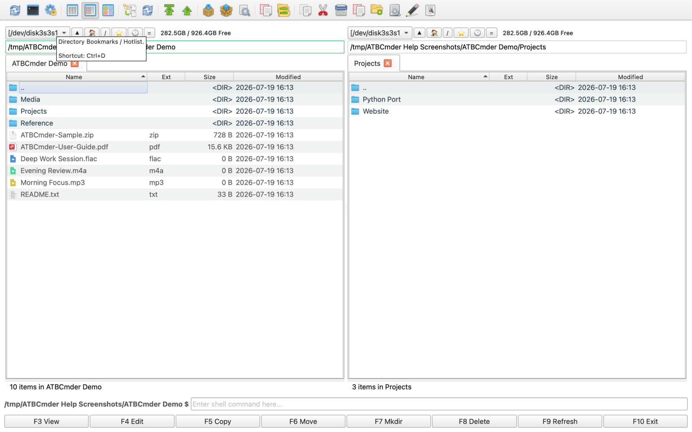

# 第7章：環境設定とカスタマイズ

本当に効率的なファイル マネージャーは、デフォルトに強制的に適応させるのではなく、ワークフローに適応する必要があります。 すべてのエンジニア、システム管理者、デジタル アーキビスト、およびクリエイティブな専門家は、それぞれ異なる筋肉の記憶、ディスプレイ要件、および操作習慣を持っています。一部のエンジニアは、厳密にオーソドックスなNorton Commander / Total Commanderのファンクション キー (`F1`–`F10`) に依存していますが、他の人はネイティブの macOS ショートカット (`Cmd+C`、`Cmd+V`、 `Cmd+O`); サブピクセルのタイポグラフィックメトリクスによる動的な列の自動調整を必要とするものもあれば、厳格で固定された列の境界を必要とするものもあります。 積極的なリアルタイムのファイルシステム イベント監視を必要とするものもありますが、パッシブ ポーリングが必須である高遅延のネットワーク共有上で実行されるものもあります。 

ATBCmder は、総合的な構成可能性を目指してゼロから設計されています。 モジュール式の **設定ダイアログ** (`Cmd+,` / `⌘,` / `cm_Options`)、リアルタイムの競合検出を備えた直感的な **ホットキー エディタ**、インテリジェントな **列自動調整エンジン**、外部トークン マクロを使用したカスタマイズ可能な **ファイルの関連付け**、およびポータブルな **ZIP 構成バンドル** (`cm_ExportConfiguration`)、ATBCmder を使用すると、デュアルパネル環境のあらゆる側面を微調整し、カスタマイズしたセットアップをすべての Mac システムにわたってシームレスに実行できます。 

---

## 1. ビジュアル クイックスタート: 環境設定センターとコマンド マトリックス

ATBCmder は、すべてのユーザー設定を、16 の特殊な構成ページ、分離されたホットキー マッピング エンジン、およびアトミック XML ストレージ レイヤーで構成される統合設定アーキテクチャに一元化します。 

```
┌────────────────────────────────────────────────────────────────────────────────────────┐
│                          ATBCMDER PREFERENCES CENTER (Cmd+,)                           │
├──────────────────────┬─────────────────────────────────────────────────────────────────┤
│  CATEGORY NAVIGATION │  ACTIVE CONFIGURATION PAGE                                      │
├──────────────────────┼─────────────────────────────────────────────────────────────────┤
│  • General           │  Column Auto-Fit Mode:                                          │
│  • Hotkeys           │  [ Average Mode (Smart Padding)                       ▼ ]       │
│  • Language          │                                                                 │
│  • File Views        │  Average Mode Padding Factor: [ 1.25x ]                         │
│  • Auto Refresh      │                                                                 │
│  • Operations        │  Sorting Behavior:                                              │
│  • Packer            │  [X] Natural (numeric) sorting: photo1.jpg < photo10.jpg        │
│  • Plugins           │  [X] Case-sensitive sorting                                     │
│  • Directory Hotlist │  Folder Position: [ Folders First                     ▼ ]       │
│  • Favorite Tabs     │                                                                 │
│  • Editor            │  Thumbnail Generation:                                          │
│  • Viewer            │  Default Size: [ 128 px ]   Cache: [~/.cache/atbcmder]          │
│  • Toolbar           │                                                                 │
│  • Middle Toolbar    │  Date/Time Format:                                              │
│  • Log               │  Long Format: [ %Y-%m-%d %H:%M:%S                             ] │
│  • Quick Search      │                                                                 │
│  • Semantic Filter   │  [ Revert Changes ]                   [ Apply ] [ OK ] [Cancel] │
├──────────────────────┴─────────────────────────────────────────────────────────────────┤
│  CONFIG BACKEND:  atbcmder.xml  |  atbcmder_hotkeys.xml  |  favtabs.xml  |  hotlist.xml│
│  PORTABILITY:     cm_ExportConfiguration (ZIP)  ➔  cm_ImportConfiguration (ZIP)        │
└────────────────────────────────────────────────────────────────────────────────────────┘
```

### デュアル マトリックスの設定とカスタマイズに関するチートシート

| アクション | macOS ショートカット | クラシック コマンダー キー | コマンドID | 説明 |
 | :--- | :--- | :--- | :--- | :--- |
 | **環境設定を開く** | `Cmd+,` / `⌘,` | `Alt+O` / `⌥O` | `cm_Options` | メインの複数ページの設定ダイアログを開きます。 |
 | **ホットキーの構成** | `Cmd+,` ➔ ホットキー | — | `cm_Options` (ホットキー) | キーボード ショートカット バインディング テーブルに直接アクセスします。 |
 | **ファイルの関連付けを構成する**| メニュー: 設定 | — | `cm_FileAssoc` | ファイル拡張子を内部または外部のビューア/エディタにマップします。 |
 | **ディレクトリ ホットリストのセットアップ** | `Ctrl+Shift+D` / `⌃⇧D` | `Ctrl+Shift+D` | `cm_ConfigDirHotList` | 保存されたフォルダーのブックマークとアクティブなホットキー (ホットリストを開くには `Ctrl+D`) を編集します。 |
 | **お気に入りのタブを構成する** | メニュー: 設定 | — | `cm_ConfigFavoriteTabs`| 保存されたデュアルパネルフォルダータブセットを管理します。 |
 | **アーカイバを構成する** | メニュー: 設定 | — | `cm_ConfigArchivers` | 外部アーカイバ実行可能ファイルと圧縮ルールを構成します。 |
 | **構成のエクスポート** | メニュー: 設定 | — | `cm_ExportConfiguration`| すべての構成 XML ファイルをポータブルな `.zip` バンドルにエクスポートします。 |
 | **構成のインポート** | メニュー: 設定 | — | `cm_ImportConfiguration`| `.zip` バンドルから構成 XML ファイルを復元します。 |
 | **構成ディレクトリを開く** | メニュー: 設定 | — | `cm_OpenConfigDirectory`| アクティブなパネルを ATBCmder の構成フォルダーに直接移動します。 |
 | **設定をすぐに保存します** | メニュー: 設定 | — | `cm_ConfigSaveSettings`| すべてのメモリ内の構成変更を直ちにディスクにフラッシュします。 |
 | **ウィンドウの位置を保存** | メニュー: 設定 | — | `cm_ConfigSavePos` | 現在のウィンドウのジオメトリとスプリッターの比率を維持します。 |
 | **ファイル ツールチップの切り替え** | 設定: ファイルビュー | — | *(設定)* | 詳細なフローティング メタデータ ツールチップを有効または無効にします。 |
 | **システム権限を付与** | メニュー: 設定 | — | `cm_GrantFilesystemAccess`| macOS アプリ サンドボックス フル ディスク アクセス オンボーディング ガイドを起動します。 |

 ---

## 2. [設定] ダイアログの構造とナビゲーション (`Cmd+,` / `cm_Options`)

ATBCmder の中央制御室は **設定ダイアログ** です。 macOS で **`Cmd+,`** (`⌘,`) を押すか、アプリケーション メニューから **ATBCmder ➔ 環境設定...** を選択するか、セマンティック コマンド バー (`/`) から `cm_Options` を実行することで、いつでも呼び出すことができます。

### 2.1 ダイアログのレイアウトと対話モデル

[環境設定] ダイアログでは、明瞭さとキーボード アクセシビリティを考慮して設計されたマスターと詳細の分割レイアウトが使用されています。 

1. **カテゴリ ナビゲーション リスト (左)**: 読みやすい 14 ポイントのインターフェイス フォントと固定の 195 ピクセルのサイドバーを備えた垂直セレクター。 `Up` および `Down` 矢印キーを使用してカテゴリ間を移動するか、マウスでクリックします。 
2. **積み重ねられたページ スクロール領域 (右)**: フレームのない `QScrollArea` で囲まれた拡張構成パネル。 カテゴリを切り替えると、ダイアログのサイズ変更やウィンドウのちらつきを引き起こすことなく、対応する設定ページがスムーズに表示されます。 
3. **アクション ボタン マトリックス (下)**:
 - **OK**: すべてのページにわたるすべての入力フィールドを検証し、変更された設定をディスク (`atbcmder.xml`) に書き込み、再翻訳とテーマの更新をトリガーして、ダイアログを閉じます。 
- **適用**: ダイアログを閉じることなく、変更されたすべてのパラメータを直ちにコミットします。 これは、UI フォント、テーマのバリエーション、列のパディング、自動更新間隔をリアルタイムでテストするのに最適です。 
- **キャンセル**: 現在のセッションで行われた未保存の変更を破棄します。 テーマを適用せずにプレビューした場合、ATBCmder はインターフェイスを以前のテーマに自動的にロールバックします。 

```
┌────────────────────────────────────────────────────────────────────────────┐
│ Preferences Dialog Sidebar Navigation                                      │
├────────────────────────────────────────────────────────────────────────────┤
│  [ General ]         Basic UI, file lists, confirmation prompts, theme     │
│  [ Hotkeys ]         Keyboard shortcuts, context scoping, conflict manager │
│  [ Language ]        30+ real-time GUI translations without restart        │
│  [ File Views ]      Sorting rules, column auto-fitting, datetime formats  │
│  [ Auto Refresh ]    File monitoring events, polling, background sleep     │
│  [ Operations ]      Collision defaults (overwrite/rename), permissions    │
│  [ Packer ]          Archive formats (ZIP, 7Z, TAR), external binaries     │
│  [ Directory Hotlist]Bookmarks management, target panels, drag-and-drop    │
│  [ Favorite Tabs ]   Dual-panel workspace sets, layout persistence         │
│  [ Editor ]          Internal code editor typography, external editor CLI  │
│  [ Viewer ]          Universal Lister fonts, image rendering, external CLI │
│  [ Toolbar ]         Main button bar layout, custom commands, icon picker  │
│  [ Middle Toolbar ]  Middle splitter button bar, quick actions             │
│  [ Log ]             Operation audit trails, file logging, rotation        │
│  [ Quick Search ]    In-panel letter search, matching algorithms           │
│  [ Semantic Filter ] Natural language command input, spotlight integration │
│  [ Tabs ]            Folder tab bar styling, close buttons, locking rules  │
└────────────────────────────────────────────────────────────────────────────┘
```


 ---

### 2.2 包括的な構成ページのディレクトリ

「環境設定」ダイアログの各ページは、特定の機能ドメインに対応します。

| ページ | 実装モジュール | 主要な構成制御 |
 | :--- | :--- | :--- |
 | **一般** | `page_general.py` | 隠しファイルの表示設定、ファイル アイコン、削除/上書き確認ダイアログ、システムのゴミ箱統合、コピー/移動バッファ サイズ (4 KB ～ 10 MB)、テーマの選択、グローバル フォント サイズ、トレイへの最小化切り替え、およびグローバル ウィンドウの表示/非表示ホットキー (`Cmd+Opt+H`)。 |
 | **ホットキー** | `page_hotkeys.py` | マルチコンテキスト コマンド検索、プライマリおよびセカンダリ ショートカット コード バインディング、自動ショートカット衝突警告、および工場出荷時のデフォルト リセット。 |
 | **言語** | `page_language.py` | 30 以上の言語 (英語、ドイツ語、フランス語、簡体字中国語、日本語、ロシア語、スペイン語など) をサポートするダイナミック ローカリゼーション セレクターとインスタント ライブ UI 翻訳。 |
 | **ファイル ビュー** | `page_fileview.py` | 大文字と小文字を区別する自然数値による並べ替え、フォルダーの並べ替え位置 (フォルダーが最初、ファイルが最初、混合)、新規/更新ファイルの配置、列の自動調整モード (固定、平均、最大)、パディング係数スライダー、およびカスタム日時形式。 |
 | **自動更新** | `page_auto_refresh.py` | ファイルシステムの作成/削除/名前変更の監視、ファイル属性変更の監視、タイマーポーリングフォールバック間隔、バックグラウンド時無効化の切り替え、およびディレクトリ除外フィルターリスト。 |
 | **操作** | `page_operations.py` | デフォルトのファイル衝突ポリシー (確認、上書き、スキップ、古いものを上書き、ターゲットの自動変更)、ディレクトリ衝突ポリシー (確認、マージ、上書き、スキップ)、空き領域の事前割り当て、シンボリックリンクの処理、許可/タイムスタンプの保存、および検証。 |
 | **パッカー** | `page_packer.py` | デフォルトの圧縮アーカイブ形式 (`zip`、`7z`、`tar.gz`、`tar.bz2`、`tar.xz`、`tar`)、7-Zip、GNU Tar、Gzip の外部実行可能パス Bzip2 および XZ ユーティリティ。 |
 | **ディレクトリ ホットリスト**| `page_hotlist.py` | インタラクティブなブックマーク マネージャー: お気に入りのディレクトリを追加、削除、並べ替え (`Drag & Drop`)、デュアル パネルのターゲット パスを指定し、クイック アクセス キーを割り当てます。 |
 | **お気に入りのタブ** | `page_favorite_tabs.py` | ワークスペース スナップショット マネージャー: マルチタブ デュアル パネル ディレクトリ レイアウトの保存、名前変更、並べ替え、および復元。 |
 | **編集者** | `page_editor.py` | 内部コードエディタのフォントファミリー、フォントサイズ、タブストップの幅、ワードラップ、行番号の切り替え。 外部エディターの実行可能ファイルのパスとコマンドライン引数。 |
 | **閲覧者** | `page_viewer.py` | Universal Lister のテキスト タイポグラフィ、タブ ストップ、マージン、行の折り返し、キャレットの表示/非表示、画像レンダリング オプション (EXIF 自動回転、ズーム モード、透明グリッド)、および外部ビューア CLI ツール。 |
 | **ツールバー** | `page_toolbar.py` | トップ ボタン バーのカスタマイズ: アイコン サイズ スライダー (16 ～ 64 ピクセル)、バー サイズ スライダー、フラット ボタン スタイル、キャプションの切り替え、コマンド階層ツリー、およびカスタム アイコン ピッカー ダイアログ。 |
 | **中央のツールバー** | `page_toolbar.py` | 中央の垂直分割ツールバーの構成: アイコンのサイズ、アクション ボタン、レイアウトの並べ替え。 |
 | **ログ** | `page_log.py` | 操作監査ログ: ログ ファイルの宛先、トークン パス置換、最大ログ ファイル サイズ、ログ ローテーション動作、および特定の操作イベント フィルター (コピー、移動、削除、解凍)。 |
 | **クイック検索** | `page_quicksearch.py` | キーボードのクイック検索モード (完全一致、先頭、末尾、ワイルドカード)、大文字と小文字の区別、および自動終了タイムアウト。 |
 | **セマンティック フィルター** | `page_semantic_filter.py` | 埋め込み自然言語コマンド バー (`/`) の動作、検索プロバイダーのバックエンド、および提案のデバウンス。 |
 | **タブ** | `page_tabs.py` | フォルダー タブの外観: 閉じるボタンの表示、複数行のタブ レイアウトとスクロール タブ、ロックされたタブのナビゲーション動作、およびタブを閉じた確認。 |

---

### 2.3 リアルタイムのテーマと動的な言語切り替え

外観設定を変更した後にアプリケーションを閉じて再起動する必要がある従来のユーティリティとは異なり、ATBCmder は **ホットスワップ可能なテーマとローカリゼーション** を備えています。 

1. **テーマのプレビュー**: **全般**を開き、`Classic`、`Light`、`Dark`、または `macOS Native (Stylish)` から選択し、Qt スタイルシートの挿入によってウィンドウのスタイルが即座に変更されることを確認します。 **キャンセル**を押すと、以前のテーマがシームレスに復元されます。 
2. **インスタント翻訳**: **言語**を開き、30 以上の翻訳済みロケールのリストから好みの方言を選択し、**適用** をクリックします。 ウィンドウ タイトル、カテゴリ サイドバー、メニュー、ボタン、ステータス バー、およびダイアログ プロンプトは、ATBCmder の動的な `tr()` 翻訳パイプラインを通じてターゲット言語に即座に再レンダリングされます。 


 *図 7.1: 言語設定ページでは、30 を超えるサポート対象言語間で即座にゼロリスタートのローカリゼーションが可能です。*

 ---

## 3. キーボード ショートカットのカスタマイズと競合管理

キーボードの効率化は、デュアルパネル ファイル管理の中核となる哲学です。 ATBCmder の **ホットキー エディタ** (`page_hotkeys.py`) は、厳密なコンテキスト分離と衝突防止を強制しながら、ショートカット コードを完全に制御します。 

```
┌────────────────────────────────────────────────────────────────────────────────────────┐
│                              HOTKEY CONFIGURATION PAGE                                 │
├────────────────────────────────────────────────────────────────────────────────────────┤
│  Hotkey Context: [ FilePanel                                                 ▼ ]       │
│  Filter Commands: [ copy                                                     ] ⌧       │
├──────────────────────┬────────────────────────┬───────────────────┬────────────────────┤
│ Command ID           │ Description            │ Primary Shortcut  │ Secondary Shortcut │
├──────────────────────┼────────────────────────┼───────────────────┼────────────────────┤
│ cm_Copy              │ Copy Files or Folders  │ F5                │ Cmd+C              │
│ cm_CopySamePanel     │ Duplicate File in Pane │ Shift+F5          │ Cmd+D              │
│ cm_CopyRightPanel     │ Copy to Right Panel    │ Alt+F5            │                   │
│ cm_CopyFullNamesToClip│ Copy Full Path Names   │ Ctrl+Shift+C      │ Cmd+Opt+C         │
├──────────────────────┴────────────────────────┴───────────────────┴────────────────────┤
│  [ Edit Shortcut... ]           [ Clear Shortcuts ]            [ Reset to Defaults ]   │
└────────────────────────────────────────────────────────────────────────────────────────┘
```

### 3.1 コンテキストの分離とスコープ設定

ショートカットの枯渇を避けるために、ATBCmder はキーの組み合わせを **コンテキスト スコープ** に分割します。 1 つのコンテキストで定義されたショートカットは、無関係なウィンドウの同じキーに干渉しません。 

- **メイン**: すべてのウィンドウで使用できるグローバル アプリケーション ショートカット (例: 環境設定の `Cmd+,`、終了の `Cmd+Q`)。 
- **FilePanel**: 左または右のファイル リストにキーボード フォーカスがある場合は常にアクティブになります (例: `F5` がコピーされ、`Space` はディレクトリ サイズを計算し、`Backspace` は親に移動します)。 
- **ビューア**: Universal Lister (`F3`) 内でアクティブ: テキスト エンコーディング、16 進ビューの切り替え (`2` / 16 進モード)、画像ズーム、およびメディア再生を制御します。 
- **エディタ**: 組み込みテキスト エディタ内でアクティブ (`F4`): 構文の強調表示、インデント、検索/置換 (`Cmd+F`)、およびファイル保存 (`Cmd+S`) を制御します。 
- **差分**: サイドバイサイド ファイル差分内でアクティブ: ハンク ナビゲーション (`F7`/`F8`)、ライン同期、およびマージ操作。 
- **FindFiles**: マルチフィルター検索ダイアログでアクティブになります。新しい検索をトリガーし、結果をナビゲートし、リストボックスにフィードします。 
- **MultiRename**: Batch Multi-Rename ツールでアクティブになります: カウンターの操作、トークンの挿入、および実行。 

---

### 3.2 デュアル バインディング アーキテクチャ (プライマリおよびセカンダリ ショートカット)

ATBCmder を使用すると、**2 つの異なるショートカットの組み合わせ**をすべての単一コマンドに割り当てることができます。 

- **プライマリ ショートカット**: 主要なマッスル メモリ コード (例: クラシック コマンダー ユーザーの場合は `F5`)。 
- **二次ショートカット**: 代替コード (例: macOS ネイティブのエルゴノミクスの場合は `Cmd+C`)。 

両方のショートカットは、指定されたコンテキスト内で同時にアクティブなままになります。 メニューをナビゲートするとき、ATBCmder はメニュー項目テキストの横にプライマリ ショートカットを自動的に表示し、明確な視覚的参照を提供します。 

---

### 3.3 ステップバイステップのレシピ: キーボード ショートカットのカスタマイズ

この実践的なチュートリアルに従って、既存のコマンドを再バインドするか、2 番目のショートカットを割り当てます。 

1. **`Cmd+,`** (`⌘,`) を押して環境設定を開き、左側のサイドバーで **ホットキー** を選択します。 
2. ドロップダウンから適切な **ホットキー コンテキスト** を選択します (例: `FilePanel`)。 
3. コマンド名またはキーワードを [**フィルター コマンド**] ボックスに入力します (例: `Wipe` または `ターミナル`)。 テーブルは、一致するエントリをリアルタイムでフィルタリングします。 
4. コマンド行をダブルクリックするか、行を選択して **編集...** をクリックします。 
5. [**ホットキーの編集**] ダイアログで:
 - [**プライマリ ショートカット**] ボックス内をクリックし、目的のキーの組み合わせ (例: `Ctrl+Alt+T`) を押します。 ATBCmder はコードをきれいにキャプチャし、シーケンスを単一の同時コードに制限します。 
- (オプション) **セカンダリ ショートカット** ボックス内をクリックし、別の組み合わせ (例: `Cmd+Shift+T`) を押します。 
6. [**保存**] をクリックします。 

```
┌────────────────────────────────────────────────────┐
│ Edit Hotkey Dialog                                 │
├────────────────────────────────────────────────────┤
│ Command:             cm_RunTerm - Run Terminal     │
│ Primary Shortcut:    [ Ctrl+J                    ] │
│ Secondary Shortcut:  [ Cmd+Opt+T                 ] │
│                                                    │
│                           [ Cancel ]    [ Save ]   │
└────────────────────────────────────────────────────┘
```


 ---

### 3.4 自動衝突検出と衝突警告

同じコンテキスト内の別のコマンドによってすでに要求されているキー コードを割り当てようとすると、ATBCmder の衝突検出エンジンが直ちに介入します。 警告ダイアログに、競合する割り当てが表示されます。 

> [!WARNING]
 > **ショートカットの競合が検出されました**
 > ショートカット `Ctrl+M` は、`FilePanel` コンテキストの `cm_MultiRename` にすでに割り当てられています。 
> これを上書きして、`Ctrl+M` を `cm_MarkCurrentExtension` に再割り当てしますか?

 - **はい** をクリックすると、古いコマンドから `Ctrl+M` が自動的にバインド解除され、新しく選択したコマンドに適用されます。 
- [**いいえ**] をクリックすると編集がキャンセルされ、既存のバインドは変更されずに維持されます。 

---

### 3.5 グローバル ウィンドウの表示/非表示ホットキー (`Cmd+Opt+H` / `Ctrl+Alt+H`)

ATBCmder をバックグラウンドで目立たないように実行し続けることを好むパワー ユーザーの場合:

 1. **[設定] ➔ [一般]** を開きます。 
2. **システム トレイに最小化** をオンにします。 
3. **ウィンドウ ホットキーの表示/非表示** (デフォルト: `Ctrl+Alt+H` / `⌘⌥H`) を見つけます。 
4. シーケンス ボックスをクリックして、カスタム グローバル ホットキー コードを登録します。 
5. [**適用**] をクリックします。 

他の全画面アプリケーション内で作業している場合でも、macOS 内のどこからでも、ATBCmder を即座に前面に呼び出したり、バックグラウンドに閉じたりできるようになりました。 

---

## 4. ファイルビュー、列モード、サムネイル管理

**ファイル ビュー** ページ (`page_fileview.py`) は、ディレクトリがどのようにレンダリング、測定、並べ替えられ、デュアル パネルで表示されるかを制御します。 

```
┌────────────────────────────────────────────────────────────────────────────────────────┐
│                              FILE VIEWS CONFIGURATION                                  │
├────────────────────────────────────────────────────────────────────────────────────────┤
│  Sorting Rules:                                                                        │
│  [X] Case-sensitive sorting             [X] Natural (numeric) sorting                  │
│  [ ] Special sorting rules                                                             │
│  Folder sort mode:        [ Folders first                                    ▼ ]       │
│  New files position:      [ Sorted                                           ▼ ]       │
│  Updated files position:  [ Top                                              ▼ ]       │
├────────────────────────────────────────────────────────────────────────────────────────┤
│  Column Widths & Auto-Fit Engine:                                                      │
│  Column auto-fit mode:    [ Average mode                                     ▼ ]       │
│  Average mode padding:    [ 1.20x ]  (Range: 1.00x - 5.00x)                            │
│  Hint: In Fixed mode, drag column dividers to save exact pixel widths per side.        │
├────────────────────────────────────────────────────────────────────────────────────────┤
│  Date/Time Formatting:                                                                 │
│  Long datetime format:    [ %Y-%m-%d %H:%M:%S                                ]         │
│  Sync dirs format:        [ %Y.%m.%d %H:%M:%S                                ]         │
└────────────────────────────────────────────────────────────────────────────────────────┘
```

### 4.1 カラム自動フィッティング エンジン: 3 つのモード

デュアルパネル ファイル マネージャーは、さまざまなファイル名の長さに苦労することがよくあります。列が広すぎると水平スクロールが発生し、列が狭すぎると重要なファイル拡張子が切り捨てられます。 ATBCmder は、次の 3 つの異なる自動フィッティング動作でこれを解決します。 

1. **固定モード (`fixed`)**:
 - 自動再計算を無効にします。 
- 列の幅は、配置した場所に正確に残ります。 
- **手動ドラッグ**: 列ヘッダー間の垂直境界線 (例: `Name` と `Ext` の間) をドラッグすると、ATBCmder は正確なピクセル幅をキャプチャし、パネルの各辺 (`column_widths_left` と `column_widths_right`) に対して個別に保持します。 `atbcmder.xml`)。 
2. **平均モード (`average` — 推奨デフォルト)**:
 - ディレクトリ内に表示されるすべてのファイル名の平均タイポグラフィ幅 (`QFontMetrics`) を評価します。 
- 平均幅に設定した **パディング係数** (スライダーは `1.0x` から `5.0x` まで調整可能、デフォルトは `1.0x`–`1.25x`) で乗算し、ファイル タイプ アイコンと視覚的な余裕のための 40 ピクセルを追加します。 
- 極端な外れ値のファイル名 (単一の 120 文字のログ ファイル名など) が他のすべての列を画面外に押し出すのを防ぎます。 
3. **最大幅モード (`max`)**:
 - ディレクトリ エントリをスキャンし、最も幅の広い単一ファイル名と安全パディング (+50 ピクセル) に一致するように列を拡張します。 
- ゼロのファイル名が省略記号 (`...`) で切り捨てられることを保証し、メディア アーカイブや科学データセットに最適です。 

> [!TIP]
 > **大規模ディレクトリの最適化**:
 > 何万ものアイテムを含むディレクトリでは、個々の文字列を測定するとインターフェイスがフリーズします。 ATBCmder は、インテリジェントなステップ サンプリング (`_MAX_SAMPLE = 200`) を自動的に適用し、均等に分散された行のサブセットを評価して、親ディレクトリ マーカー (`..`) を無視して 2 ミリ秒未満でタイポグラフィ メトリクスを計算します。 

---

### 4.2 ファイルの並べ替えオプション

テーブル ビュー内で項目がどのように順序付けされるかを微調整します。 

- **自然 (数値) ソート**: 有効にすると、文字列内の数値が数学的に比較されます: `file1.txt`、`file2.txt`、`file10.txt` (アルファベット順の `file1.txt`、`file10.txt`、 `file2.txt`)。 
- **大文字と小文字を区別して並べ替え**: チェックすると、ASCII/Unicode の序数値に従って大文字が小文字よりも前に配置されます (`File.txt` は `apple.txt` より前に並べ替えられます)。 チェックを外すと、並べ替えでは大文字と小文字が区別されません。 
- **フォルダーソートモード**:
 - `Folders first`: ディレクトリはパネルの上部ですべてのファイルの上にグループ化されています。 
- `Files first`: ファイルが最初にリストされ、ディレクトリが最後に配置されます。 
- `Mixed`: ファイルとフォルダーは、統一された順序でアルファベット順に並べ替えられます。 
- **新規および更新されたファイルの位置**: ファイルシステムのライブ更新中に新しく作成されたファイルまたは最近変更されたファイルが表示される場所を制御します (`Sorted`、`Top`、または `Bottom`)。 

---

### 4.3 サムネイル グリッド ビューとキャッシュの仕組み

写真家、デザイナー、ビデオ編集者向けに、ATBCmder は統合された **サムネイル グリッド ビュー** (`cm_ThumbnailsView`) を提供し、表形式の行を視覚的な画像プレビューに置き換えます。 


 *図 7.2: カスタム グリッド間隔で画像プレビューを表示する高性能サムネイル ビュー。*

#### サイズ変更とダイナミックズーム

- **デフォルトのサムネイル サイズ**: 48 ピクセルから最大 512 ピクセルまで設定可能 (デフォルト: 128 ピクセル)。 
- **インタラクティブなピンチツーズーム**: Apple トラックパッドでは、標準の 2 本指ピンチ ジェスチャを使用するか、**`Ctrl`** を押したままマウス ホイールをスクロールして、サムネイルをリアルタイムで動的に拡大縮小します。

#### 多層キャッシュアーキテクチャ

高解像度の 4,800 万ピクセルの RAW 写真または複雑なベクトル SVG のサムネイルを生成すると、CPU に負荷がかかります。 ATBCmder は、堅牢な 2 層キャッシュ アーキテクチャを採用しています。 

1. **インメモリ LRU キャッシュ**: 500 個の解凍された `QPixmap` オブジェクトを RAM に保持し、瞬時に滑らかな 60fps スクロールを実現します。 
2. **永続ディスク キャッシュ**: ユーザー キャッシュ ディレクトリにローカルに保存されます。 
- macOS / Linux パス: `~/.cache/atbcmder/thumbnails/`
 - キャッシュ キーは、ファイル パス、ファイル変更タイムスタンプ (`mtime`)、要求されたピクセル サイズ、およびキャッシュ スキーマ バージョンを組み合わせた暗号化 SHA-256 ハッシュによって生成されます。 
$$\text{キャッシュ キー} = \text{SHA256}(\text{ファイルパス} + \text{時間} + \text{サイズ} + \text{バージョン})$$

 - イメージ ファイルがディスク上で編集または更新されると、そのタイムスタンプが変更され、古いキャッシュ エントリが即座に無効になり、自動バックグラウンドでの再レンダリングがトリガーされます。 
3. **バックグラウンド ワーカー スレッド**: 画像処理は、Pillow (PIL) またはハードウェア アクセラレーションの `QImage` パイプラインを利用する専用の `QThread` ワーカー プールにオフロードされ、大量のバッチ インポート中にデュアル パネル インターフェイスが途切れないことが保証されます。 

---

### 4.4 カスタムの日付と時刻の書式設定

ATBCmder を使用すると、標準の Python `strftime` 構文を使用して、カスタム タイムスタンプの書式設定文字列を定義できます。 

- **長い日付時刻形式** (デフォルト: `%Y-%m-%d %H:%M:%S`): 全列ビュー (`2026-09-06 14:30:00`) での日付表示を制御します。 
- **Sync dirs format** (デフォルト: `%Y.%m.%d %H:%M:%S`): [ディレクトリ シンクロナイザー] ダイアログでのタイムスタンプの表示を制御します。 

| トークン | 説明 | 出力例 |
 | :--- | :--- | :--- |
 | `%Y` | 4 桁の年 | `2026` |
 | `%m` | 2 桁の月 (`01`–`12`) | `09` |
 | `%d` | 2 桁の日 (`01`–`31`) | `06` |
 | `%H` | 24 時間形式の 2 桁の時間 (`00`–`23`) | `14` |
 | `%I` | 12 時間形式の 2 桁の時 (`01`–`12`) | `02` |
 | `%p` | 午前・午後指定｜ `PM` |
 | `%M` | 2 桁の分 (`00`–`59`) | `30` |
 | `%S` | 2 桁の秒 (`00`–`59`) | `15` |

 ---

## 5. ファイルシステムの自動リフレッシュと監視感度

共有コードベースで共同作業したり、ブラウザ アセットをダウンロードしたり、バックグラウンドでコンパイル タスクを実行したりすると、ディレクトリの内容は常に変化します。 **自動更新** ページ (`page_auto_refresh.py`) は、リアルタイム UI の精度と CPU およびバッテリーの消費量のバランスをとります。 

```
┌────────────────────────────────────────────────────────────────────────────────────────┐
│                              AUTO-REFRESH CONFIGURATION                                │
├────────────────────────────────────────────────────────────────────────────────────────┤
│  [X] Refresh file list:                                                                │
│      [X] When files are created, deleted or renamed                                    │
│      [X] When size, date or attributes change                                          │
│      Polling interval (seconds): [ 5 ]                                                 │
├────────────────────────────────────────────────────────────────────────────────────────┤
│  Disable auto-refresh:                                                                 │
│      [X] When application is in the background                                         │
│      [X] For the following paths and their subdirectories:                             │
│          ┌──────────────────────────────────────────────────────────────────────────┐  │
│          │ /Volumes/NetworkShare/LargeMediaArchive                                  │  │
│          │ /Users/username/Developer/linux-kernel/                                  │  │
│          │ /Users/username/work/heavy_project/node_modules/                         │  │
│          └──────────────────────────────────────────────────────────────────────────┘  │
└────────────────────────────────────────────────────────────────────────────────────────┘
```

### 5.1 イベントトリガーとポーリングフォールバック

ATBCmder は、ネイティブ オペレーティング システムのイベント監視とインテリジェントなポーリング フォールバックを組み合わせます。 

- **イベント モニタリング (`watch_file_name_change`)**: ネイティブ OS カーネル通知 (macOS `FSEvents` / `kqueue`) を利用して、CPU オーバーヘッドなしでファイルの作成、削除、名前変更を検出します。 
- **属性監視 (`watch_attributes_change`)**: ファイル サイズの拡張、タイムスタンプの更新、および許可モードの調整を追跡します。 
- **ポーリング フォールバック間隔 (`attr_poll_interval`)**: 1 ～ 60 秒の範囲で構成可能 (デフォルト: 5 秒)。 
*なぜポーリングが必要なのでしょうか?* リモート ネットワーク ストレージ マウント (SMB、CIFS、NFS、SFTP VFS) は、リモート クライアントが変更を行ったときにネイティブ OS ファイルシステム イベントの発行に失敗することがよくあります。 バックグラウンドポーリングタイマーにより、リモートパネルのリストが古くなることはありません。 

---

### 5.2 バッテリーと CPU の節約: バックグラウンド時は無効にする

バッテリー電源で動作する macOS ラップトップでは、アクティブなファイルシステム ウォッチャーが不必要な電力を消費する可能性があります。 

- **アプリケーションがバックグラウンドにあるとき** (`watch_only_foreground`) をチェックすると、ATBCmder がウィンドウ フォーカスを失った瞬間に、すべてのアクティブなポーリング タイマーとイベント ウォッチャーが自動的に一時停止されます。 
- ATBCmder に切り替えると、パネルはただちに 1 回の調整された更新を実行し、すべてのディレクトリのリストが即座に最新の状態になります。 

---

### 5.3 パス除外フィルター

`node_modules`、Git メタデータ リポジトリ (`.git`)、コンパイル アーティファクト キャッシュ (`target/`、`build/`)、ローカル データベース ファイルなど、チャーンの多いディレクトリでは、1 分あたり数千のディスク イベントが生成されます。 

1. **次のパスとそのサブディレクトリについて** (`watch_exclude_dirs`) を確認します。 
2. 除外テキスト領域に、1 行に 1 つの絶対ディレクトリ パスを入力します。 
   ```text
   /Users/username/Developer/project/node_modules
   /Users/username/Developer/linux/.git
   /Volumes/ProductionNAS/RenderingQueue
   ```


 3. [**適用**] をクリックします。 ATBCmder は、これらのパス ツリー内で発生するファイル システム イベントを無視し、不要な UI 更新や CPU スパイクを排除します。 

---

## 6. カスタム ファイルの関連付けと外部ツールの統合

ファイルをダブルクリックするか、**`Enter`** を押すと、通常、デフォルトのシステム アプリケーションを使用してそのファイルが開きます。 ATBCmder の **ファイル関連付けシステム** (`cm_FileAssoc` / `file_associations.py`) を使用すると、特定のファイル パターンのカスタム アクションを定義し、内部コマンドまたは外部端末/GUI アプリケーションにマッピングできます。

### 6.1 アーキテクチャとパターンの特異性

ファイルの関連付けは、パターンの特異性の順に評価されます。最も長く、最も具体的な glob パターンが最初に一致します。 

$$\text{特異性の順序: } \texttt{*.min.js} \longrightarrow \texttt{*.js} \longrightarrow \texttt{text/*} \longrightarrow \texttt{*}$$

 各関連付けには複数のアクション (例: 「VS Code で開く」、「16 進数の表示」、「Python で実行」) を含めることができ、その 1 つが `Enter` でトリガーされる主なデフォルト アクションとして指定されます。 

---

### 6.2 外部コマンドのトークン マクロ置換

外部ツールまたはコマンドライン スクリプトを起動すると、ATBCmder はトークン マクロをアクティブなファイルのメタデータに自動的に置き換えます。 

| マクロトークン | 意味 | 値の例 |
 | :--- | :--- | :--- |
 | **`%f`** | 選択したファイルの完全な絶対パス | `/Users/username/Documents/report.pdf` |
 | **`%d`** | ファイルを含むディレクトリ パス | `/Users/username/Documents` |
 | **`%n`** | 拡張子なしの基本ファイル名 | `report` |
 | **`%e`** | 先頭のドットのないファイル拡張子 | `pdf` |

 ---

### 6.3 実践的な関連付けレシピ

#### レシピ 1: Visual Studio Code で Python スクリプトを開く

- **パターン**: `*.py`
 - **ラベル**: `Edit in VS Code`
 - **コマンド**: `code %f`
 - **アクション タイプ**: 外部シェル コマンド

#### レシピ 2: ターミナルで Python スクリプトを実行する

- **パターン**: `*.py`
 - **ラベル**: `Execute Script`
 - **コマンド**: `python3 %f`
 - **アクション タイプ**: 外部シェル コマンド

#### レシピ 3: 専用プレビューアでマークダウンを表示する

- **パターン**: `*.md`
 - **ラベル**: `Preview in Typora`
 - **コマンド**: `open -a Typora %f`
 - **アクション タイプ**: 外部シェル コマンド

#### レシピ 4: Beyond Compare でファイルを反対側のパネルと比較する

- **パターン**: `*`
 - **ラベル**: `Compare with Target`
 - **コマンド**: `bcomp %f %d`
 - **アクション タイプ**: 外部シェル コマンド

 ---

## 7. ツールバーと中央ツールバーのカスタマイズ

ATBCmder には 2 つのカスタマイズ可能なツールバーが用意されています。**メイン ツールバー**はメニュー バーの下にあり、**中央ツールバー**は 2 つのファイル パネルを分離するスプリッター内に垂直に埋め込まれています。 


 *図 7.3: スプリッター ボタンとクイック アクション トリガーを構成する中央のツールバー オプション ページ。*

### 7.1 ツールバーの外観のカスタマイズ

**環境設定 ➔ ツールバー** または **環境設定 ➔ 中央ツールバー** を開きます。 

- **バー サイズ スライダー**: ツールバーの高さ/幅を 16 ピクセルから 64 ピクセルまで調整します。 
- **アイコン サイズ スライダー**: ボタン アイコンを 16 ピクセルから 64 ピクセル (デフォルト: 24 ピクセル) にスケールします。 
- **フラット ボタン**: モダンなフラット ボーダーレス ボタンとクラシックな盛り上がったボタンを切り替えます。 
- **キャプションを表示**: ツールバー アイコンの下または横にテキスト ラベルを表示します。 

---

### 7.2 項目の追加と組み込みのアイコンピッカー

ツールバー項目は、次の 3 つの要素タイプをサポートする階層ツリーに編成されています。 

1. **セパレータ**: ボタン グループ間に視覚的な区切り線またはスペーサを挿入します。 
2. **内部コマンド**: 自動補完コマンド フィールドを使用して、ATBCmder の 230 以上の `cm_*` コマンドのいずれかを選択します。 
3. **外部コマンド**: 外部シェル コマンド、作業ディレクトリ、およびパラメーター トークン (`%f`、`%d`) を指定します。

#### 組み込みのアイコンピッカー (`IconPickerDialog`)

カスタム ボタンを構成する場合、アイコン プレビュー ボタンをクリックして、統合された **アイコン ピッカー** を開きます。 

- 何百ものバンドルされた SVG および PNG アイコンにわたる即時検索フィルターを備えています。 
- 高解像度のプレビューとアセット ステム名を使用して、均一なグリッドにアイコンを表示します。 

```
┌────────────────────────────────────────────────────────────────────────┐
│ Icon Picker Dialog                                                     │
├────────────────────────────────────────────────────────────────────────┤
│ Search: [ terminal                                                   ] │
├──────────────────────────────────────────────────────┬─────────────────┤
│  ┌────┐   ┌────┐   ┌────┐   ┌────┐   ┌────┐   ┌────┐ │ PREVIEW:        │
│  │ 💻 │   │ 🖥️ │   │ ⌨️ │   │ ⚙️ │   │ 📁 │   │ 🔍 │ │                  │
│  └────┘   └────┘   └────┘   └────┘   └────┘   └────┘ │      💻         │
│  cm_RunTerm  console  terminal  bash   sh      zsh   │                 │
│  ┌────┐   ┌────┐   ┌────┐   ┌────┐   ┌────┐   ┌────┐ │ Name: cm_RunTerm│
│  │ 📄 │   │ ✏️ │   │ ✂️ │   │ 📋 │   │ 🗑️ │   │ 🔒 │ │ Size: 48x48     │
│  └────┘   └────┘   └────┘   └────┘   └────┘   └────┘ │ Format: SVG/PNG │
├──────────────────────────────────────────────────────┴─────────────────┤
│                                                [ Cancel ]  [ Select ]  │
└────────────────────────────────────────────────────────────────────────┘
```


 ---

### 7.3 ディレクトリホットリストとお気に入りタブのカスタマイズ

- **ディレクトリ ホットリスト (`page_hotlist.py`)**: `Ctrl+D` ブックマークを管理します。 現在のパスを追加し、ドラッグ アンド ドロップを使用してブックマークを並べ替え、ターゲット パネルの同期を構成し、アクセス キーを割り当てます。 
- **お気に入りのタブ (`page_favorite_tabs.py`)**: 完全なデュアルパネル マルチタブ ワークスペース レイアウトを保存します。 ワンクリックで正確な開発ディレクトリ セットまたは写真編集ディレクトリ セットを復元します。 


 *図 7.4: ディレクトリ ホットリストのブックマークとパスの管理*

 ---

## 8. 構成の移植性と分離テストモード

新しい Mac への移行、一連の開発マシンのプロビジョニング、またはカスタマイズされたキーバインディングを同僚と共有する場合でも、ATBCmder を使用すると構成のバックアップと展開が簡単になります。

### 8.1 構成ストレージのアーキテクチャ

ATBCmder は、すべてのユーザー設定を、標準のオペレーティング システム構成ディレクトリにある、きれいに構造化された人間が判読できる XML ファイルに保存します。 

- **macOS 標準パス**:
 `~/Library/環境設定/atbcmder/`

 - **macOS アプリのサンドボックス パス**:
 `~/Library/Containers/com.aitobox.atbcmder/Data/Library/環境設定/atbcmder/`

 - **Linux/UNIX パス**:
 `~/.config/atbcmder/`

 - **直接アクセス コマンド**:
 **`cm_OpenConfigDirectory`** を実行 (またはメニューから **Configuration ➔ Open Configuration Directory** を選択) すると、アクティブなパネルがこのフォルダーに直接移動します。 

```
~/Library/Preferences/atbcmder/
├── atbcmder.xml          # Core application configuration, geometry, themes, view rules
├── atbcmder_hotkeys.xml  # User keyboard shortcut overrides and custom bindings
├── favtabs.xml           # Saved favorite folder tab layouts and paths
├── hotlist.xml           # Directory Hotlist (Ctrl+D) bookmarks hierarchy
└── history.xml           # Recent directory jumps, command line history, search history
```


 ---

### 8.2 構成バンドルのエクスポート (`cm_ExportConfiguration`)

ATBCmder 環境のオールインワンのポータブル バックアップを作成するには、次の手順を実行します。 

1. メニュー バーから **Configuration ➔ Export Configuration...** を選択します (または `cm_ExportConfiguration` を実行します)。 
2. 宛先ディレクトリを選択し、ファイル名を選択します (デフォルト: `atbcmder-config.zip`)。 
3. [**保存**] をクリックします。 

ATBCmder は、保留中のメモリ変更をすべてディスクにフラッシュし、すべての構成 XML ファイル (`atbcmder.xml`、`atbcmder_hotkeys.xml`、`favtabs.xml`、`hotlist.xml`) を収集し、それらをアトミックな圧縮 ZIP アーカイブにパッケージ化します。 

---

### 8.3 構成バンドルのインポート (`cm_ImportConfiguration`)

構成バックアップを新しいマシンに復元するか、既知の正常な状態に戻すには、次の手順を実行します。 

1. メニュー バーから **Configuration ➔ Import Configuration...** を選択します (または `cm_ImportConfiguration` を実行します)。 
2. 以前にエクスポートした `atbcmder-config.zip` アーカイブを選択します。 
3. 警告プロンプトを確認します。 
> インポートすると、現在の設定がすべて選択したファイルの内容に置き換えられます。 続く？ 
4. [**はい**] をクリックします。 

ATBCmder はアーカイブを安全に解凍し、抽出されたすべてのファイルが有効な XML 構成であることを確認し、アクティブなディスク ファイルを置き換え、内部 `Config()` シングルトンをリロードし、ファイル パネルと列レイアウトの両方を即座に更新します。これらすべてをアプリケーションを再起動する必要はありません。 

> [!IMPORTANT]
 > **エンタープライズ セキュリティ: アンチトラバーサル保護**
 > ATBCmder は、構成のインポート中に厳密なパス トラバーサル検証を強制します (`zipfile` サニタイズ)。 パス区切り文字 (`/`、`\`)、ディレクトリ トラバーサル (`..`)、または XML 以外のファイル拡張子を含むアーカイブ メンバーは直ちに拒否され、悪意のあるアーカイブの改ざんからオペレーティング システムを保護します。 

---

### 8.4 分離テストモード (`ATBCmder_test.sh`)

カスタム プラグインを開発するとき、積極的なホットキーの再バインドを実験するとき、またはベータ設定をテストするときは、毎日のドライバー設定を変更しないようにする必要があります。 

ATBCmder は、`ATBCMDER_CONFIG_PATH` 環境変数を介した完全な構成リダイレクトをサポートしています。 専用のテスト スクリプトがプロジェクト リポジトリに含まれています。 

```bash
# Launch ATBCmder in completely isolated test mode:
./scripts/ATBCmder_test.sh
```

#### 分離テストモードの動作方法:

1. `tests/.test_config/` にクリーンな一時テスト ディレクトリをプロビジョニングします。 
2. 工場出荷時のベースライン設定を `src/atbcmder/resources/test_config.xml` から `tests/.test_config/atbcmder.xml` にコピーします。 
3. `export ATBCMDER_CONFIG_PATH="$(pwd)/tests/.test_config"` を設定します。 
4. Python で ATBCmder を生成します。 セッション中に変更または削除された設定は一時テスト ディレクトリにのみ影響し、個人の `~/Library/環境設定/atbcmder/` ファイルは 100% 変更されません。 

---

## 9. ⚡ プロのヒントと詳細: 高度なカスタマイズ

### プロのヒント 1: Chezmoi / Ansible による自動ドットファイル プロビジョニング

ATBCmder はすべての状態を標準 UTF-8 XML ファイルにシリアル化するため、構成を Git dotfiles リポジトリにチェックインし、Chezmoi、GNU Stow、または Ansible などのツールを使用して管理できます。 

```bash
# Example: Adding ATBCmder configuration to Chezmoi dotfiles manager
chezmoi add ~/Library/Preferences/atbcmder/atbcmder.xml
chezmoi add ~/Library/Preferences/atbcmder/atbcmder_hotkeys.xml
```

### プロのヒント 2: 高性能ネットワーク ウォッチャーのチューニング

数百万のファイルを含むエンタープライズ SMB/NFS ファイル サーバー間で作業する場合、アクティブな再帰イベント監視によりネットワークの輻輳が発生する可能性があります。 

1. **[設定] ➔ [自動更新]** を開きます。 
2. **サイズ、日付、または属性が変更された場合** のチェックを外します。 
3. **ポーリング間隔**を `15` または `30` 秒に設定します。 
4. ネットワーク マウント ルート (`/Volumes/EnterpriseShare`) を **パス除外リスト** に追加します。 
5. 即時同期が必要な場合は、手動パネル更新 (**`Ctrl+R`** / `⌘R`) を使用します。

### プロのヒント 3: 外部コマンド環境変数

カスタムの外部ツールバー ボタンまたはファイルの関連付けを構成する場合、ATBCmder はユーザー シェル環境 (`PATH`、`HOME`、`USER`) を自動的に継承します。 実行可能ファイルの完全な絶対パスを指定しなくても、Homebrew (`/opt/homebrew/bin/`) 経由でインストールされたコマンド ライン ユーティリティを直接呼び出すことができます。

### プロのヒント 4: フローティング ファイル ツールチップの構成

ATBCmder には、項目の上にマウスを置くとファイルのサイズ、EXIF データ、オーディオ ビットレート、アーカイブ メンバー数を表示する豊富なフローティング メタデータ ツールチップが含まれています。 **[環境設定] ➔ [ファイル ビュー]** でツールチップのオンとオフを切り替えることができます。 


 *図 7.5: マウスを置くと詳細なファイル プロパティを表示する豊富なメタデータ ツールチップ。*

 ---

## 10. 安全性とシステムの警告

> [!CAUTION]
 > **ショートカットの上書き検証**
 > `Main` または `FilePanel` コンテキスト内のプライマリ ショートカットを上書きすると、そのショートカットは元のコマンドから即座にバインド解除されます。 `F5` (コピー) や `Enter` (開く) などの重要なコマンドを誤ってバインド解除した場合は、ホットキー エディターの **デフォルトにリセット** ボタンを使用して工場出荷時のキーバインドを復元します。 

> [!WARNING]
 > **構成のインポートによりすべての設定が置き換えられます**
 > `cm_ImportConfiguration` 経由で構成バンドルを復元すると、現在の `atbcmder.xml`、`favtabs.xml`、および `hotlist.xml` ファイルが完全に上書きされます。 外部アーカイブをインポートする前に、必ず既存の構成のバックアップをエクスポートしてください。 

> [!IMPORTANT]
 > **macOS アプリのサンドボックスとフルディスク アクセス**
 > ATBCmder が macOS アプリ サンドボックスで実行されている場合、明示的なユーザーの許可がなければ、コンテナの外部にある設定ファイルやディレクトリを読み取ることはできません。 外部ドライブへのアクセス時に権限エラーが発生した場合は、**`cm_GrantFilesystemAccess`** を実行して、macOS フル ディスク アクセスのオンボーディング フローを完了してください。 

---

## 11. マスターデュアルマトリックスのカスタマイズと環境設定コマンドリファレンス

| カテゴリー | アクションの説明 | macOS ショートカット | クラシック コマンダー キー | コマンドID |
 | :--- | :--- | :--- | :--- | :--- |
 | **設定** | メイン設定ダイアログを開く | `Cmd+,` / `⌘,` | `Alt+O` / `⌥O` | `cm_Options` |
 | **設定** | 今すぐ設定を XML に保存 | メニュー: 設定 | — | `cm_ConfigSaveSettings` |
 | **設定** | ウィンドウの位置とサイズを保存 | メニュー: 設定 | — | `cm_ConfigSavePos` |
 | **設定** | ファイルのツールチップを切り替え | 環境設定 ➔ ファイルビュー | — | *(設定)* |
 | **設定** | フルディスク権限を付与する | メニュー: 設定 | — | `cm_GrantFilesystemAccess` |
 | **ホットキー** | ホットキー エディタ ページを開く | `Cmd+,` ➔ ホットキー | — | `cm_Options` |
 | **ホットキー** | グローバル ウィンドウの表示/非表示ホットキー | `Ctrl+Alt+H` / `⌘⌥H` | `Ctrl+Alt+H` | *(グローバル システム ホットキー)* |
 | **協会** | ファイル関連付けマネージャーを開く | メニュー: 設定 | — | `cm_FileAssoc` |
 | **ブックマーク** | ディレクトリホットリストマネージャー | `Ctrl+Shift+D` / `⌃⇧D` | `Ctrl+Shift+D` | `cm_ConfigDirHotList` |
 | **ブックマーク** | 現在のディレクトリをホットリストに追加 | メニュー: ブックマーク | — | `cm_AddDirToHotlist` |
 | **フォルダー タブ** | お気に入りフォルダー タブ マネージャー | メニュー: 設定 | — | `cm_ConfigFavoriteTabs` |
 | **フォルダー タブ** | 現在のタブをお気に入りセットとして保存| メニュー: タブ | — | `cm_SaveFavoriteTabs` |
 | **アーカイバ** | アーカイバ バイナリを構成する | メニュー: 設定 | — | `cm_ConfigArchivers` |
 | **移植性** | 構成を ZIP にエクスポート | メニュー: 設定 | — | `cm_ExportConfiguration` |
 | **移植性** | ZIP から設定をインポート | メニュー: 設定 | — | `cm_ImportConfiguration` |
 | **移植性** | 設定フォルダーを開く | メニュー: 設定 | — | `cm_OpenConfigDirectory` |
 | **表示モード** | サムネイル グリッド ビューを切り替える | `Ctrl+Shift+F1` / `⌃⇧F1` | `Ctrl+Shift+F1` | `cm_ThumbnailsView` |
 | **表示モード** | アクティブなパネルのリストを更新 | `Ctrl+R` / `⌃R` | `Ctrl+R` | `cm_Refresh` |

---

 <div align="center">
 <p>アプリケーション全体のすべてのキーボード ショートカットとコマンド マトリックスをマスターする準備はできましたか?</p>
 <p><strong><a href="keyboard_shortcuts.md">第 8 章: マスター キーボード ショートカットに進む &rarr;</a></strong></p>
 </div>