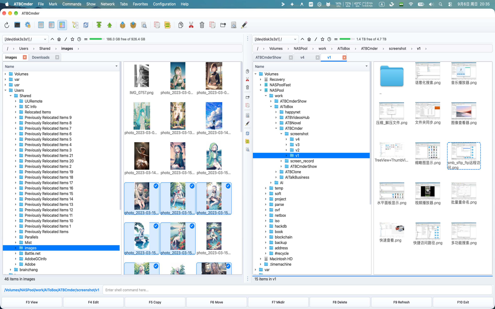
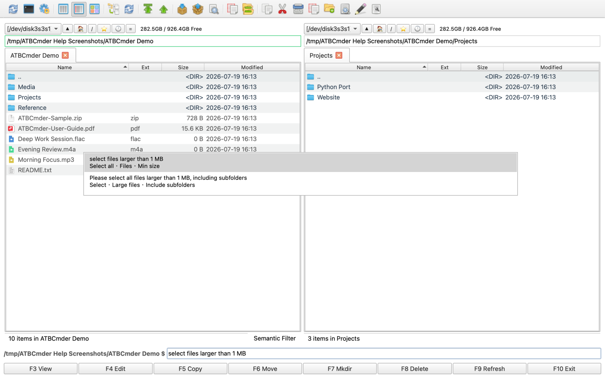
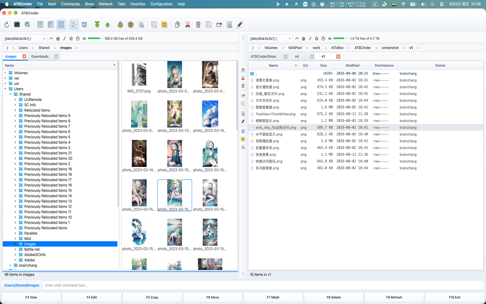

# ATBCmder 에 오신 것을 환영합니다

[](download.md) 
[-orange.svg)](download.md) 
[](download.md) 
[](privacy_policy.md) 

macOS용으로 특별히 설계된 빠른 키보드 우선 듀얼 패널 파일 관리자인 **ATBCmder**의 공식 문서 포털에 오신 것을 환영합니다. ATBCmder는 정통 파일 관리자(Total Commander, Double Commander, Norton Commander)의 속도 및 명령 유산을 최신 macOS 디자인, 기본 시스템 통합 및 고급 전동 도구와 통합합니다. 

---

## 듀얼 패널 철학

macOS Finder와 같은 기존의 단일 창 데스크톱 파일 관리자는 사용자를 겹치는 창을 열고, 소스 및 대상 폴더의 추적을 잃으며, 실수로 잘못된 하위 폴더에 놓일 위험이 있는 끝없는 순환을 강요합니다. 

```
기존 단일 창 파일 탐색 (Finder):
┌────────────────────────┐      ┌────────────────────────┐
│ 폴더 A (내가 어디였지?)│ ──?  │ 폴더 B (어느 폴더지?)  │  → 창 겹침, 포커스 분산,
└────────────────────────┘      └────────────────────────┘    엉뚱한 곳에 잘못 드롭

ATBCmder 정통 듀얼 패널 방식 (Orthodox Dual-Panel):
┌───────────────────────────────┬───────────────────────────────┐
│     활성 패널 (작업 원본)     │     비활성 패널 (작업 대상)   │
│  작업을 기다리는 파일 목록    │  명확하고 예측 가능한 대상 폴더│
│  [ 복사 / 이동 / 비교 / 동기화 ════════════════════════════► ]│
└───────────────────────────────┴───────────────────────────────┘
```
 

ATBCmder는 **소스-타겟 이중 패널 패러다임**을 통해 이 문제를 해결합니다. 

- **일정한 방향**: 두 개의 독립적인 디렉터리 보기가 항상 나란히 표시됩니다. 
- **예측 가능한 방향 작업**: 복사(`F5`) 또는 이동(`F6`)을 트리거하면 ATBCmder는 자동으로 **활성 패널**(커서가 있는 곳)에서 **비활성 패널**(반대쪽 보기)로 항목을 전송합니다. 끌거나 추측하거나 숨겨진 대상 창을 검색할 필요가 없습니다. 
- **손끝에서 이어지는 키보드 플로우**: 손을 키보드 위에 올려두세요. 디렉터리를 이동하고, 와일드카드를 사용하여 파일을 선택하고, 아카이브를 검사하고, 밀리초 단위로 일괄 변환을 실행하세요. 
- **Zero Finder Window Clutter**: 하나의 창에서 로컬 볼륨, 네트워크 서버(FTP, SFTP, SMB, WebDAV), 아카이브 콘텐츠(`.zip`, `.7z`, `.tar`) 및 백그라운드 전송 대기열 등 모든 것을 처리합니다. 

---

## 시각적 인터페이스 투어 및 랜드마크

ATBCmder는 두 디렉토리에 대한 즉각적인 상황 인식을 제공하도록 설계된 깔끔하고 직관적인 레이아웃으로 전원을 구성합니다. 

```
┌──────────────────────────────────────────────────────────────────────────────────────────┐
│ [1] 메뉴 바: 파일(F)   선택(M)   명령(C)   보기(S)   설정(O)   도움말(H)                 │
├──────────────────────────────────────────────────────────────────────────────────────────┤
│ [2] 주 도구 모음: [🔍 검색]  [⚡ 작업 큐]  [⚙️ 환경설정]  [📁 드라이브 바]               │
├─────────────────────────────────────────────┬────────────────────────────────────────────┤
│ [3] 경로 탐색: 🏠 > Users > brain > work    │ [3] 경로 탐색: 💾 > Volumes > Backup       │
├─────────────────────────────────────────────┼────────────────────────────────────────────┤
│ [4] 탭 바: [프로젝트 A ✕] [문서] [+]        │ [4] 탭 바: [2026 보관 ✕] [+]               │
├──────────────────────────────────────┬──────┼────────────────────────────────────────────┤
│ [5] 왼쪽 패널 (활성 / 작업 원본)     │ [6]  │ [5] 오른쪽 패널 (비활성 / 작업 대상)       │
│ 📁 .. [상위 폴더로]                  │  중  │ 📁 .. [상위 폴더로]                        │
│ 📁 assets                            │  앙  │ 📁 archive_2025                            │
│ 📁 src                               │  도  │ 📁 release_builds                          │
│ 📄 Cargo.toml             1.2 KB     │  구  │ 📄 CHANGELOG.md                 14.8 KB    │
│ 📄 main.rs                8.4 KB     │      │ 📄 README.md                     4.1 KB    │
│ 📄 config.json            2.1 KB     │      │ 📦 backup_bundle.zip           128.4 MB    │
│                                      │      │                                            │
├──────────────────────────────────────┴──────┴────────────────────────────────────────────┤
│ [7] 상태 표시줄: 6개 항목 | 2개 선택됨 (10.5 KB) │ 디스크: 142.6 GB 사용 가능 / 494.3 GB  │
└──────────────────────────────────────────────────────────────────────────────────────────┘
```

### UI 랜드마크 참조

1. **메뉴 표시줄 및 기본 macOS 통합(`[1]`)**: 완전한 macOS 애플리케이션 메뉴 지원, 표준 단축키(`⌘,`, `⌘Q`, `⌘W`) 및 모든 내부 Commander 명령에 대한 전체 메뉴 액세스(`cm_*`). 
2. **기본 도구 모음 및 빠른 실행 프로그램(`[2]`)**: 원클릭으로 검색(`Alt+F7`), 백그라운드 전송 대기열(`cm_OperationsPanel`), 기본 설정(`Cmd+,`) 및 드라이브 선택기에 즉시 액세스할 수 있습니다. 
3. **대화형 탐색 경로 표시줄(`[3]`)**: 계층 구조 위로 바로 이동하려면 경로에서 디렉터리 세그먼트를 클릭합니다. 하위 디렉터리를 찾아보려면 세그먼트 드롭다운 화살표를 클릭하세요. 
4. **폴더 탭 및 작업 영역(`[4]`)**: 각 패널에서 탭을 무제한으로 열고(`Cmd+T`), 탭을 닫고(`Cmd+W`), 즐겨찾는 위치를 잠그고, 전체 이중 패널 탭 작업 영역을 저장합니다(`cm_SaveFavoriteTabs`). 
5. **이중 파일 패널(`[5]`)**: 독립 파일 테이블. 활성 패널에는 뚜렷한 강조 테두리와 초점이 맞춰진 커서가 표시됩니다. `Tab`을 사용하여 즉시 초점을 전환하세요. 
6. **가운데 도구 모음 및 드래그 가능한 분할기(`[6]`)**: 패널 분할기에 직접 배치된 수직 빠른 작업 스트립입니다. 보기(`F3`), 편집(`F4`), 복사(`F5`), 이동(`F6`), 새 폴더(`F7`), 삭제(`F8`), 초기화 및 교체에 대한 원클릭 트리거를 제공합니다. 패널(`cm_Exchange`). 패널 크기를 조정하려면 분할자를 왼쪽이나 오른쪽으로 드래그하세요. 
7. **상태 표시줄 및 드라이브 저장 용량 측정기(`[7]`)**: 활성 파일 수, 선택한 항목 통계, 집계 바이트 크기, 여유 공간 계산과 함께 활성 볼륨 저장 용량 게이지를 표시합니다. 

---

## 인터페이스 쇼케이스

주요 기능 하이라이트를 통해 ATBCMder의 기능을 살펴보세요. 

| 듀얼 패널 및 트리 보기 | 중간 빠른 작업 도구 모음 | 
| :---: | :---: | 
|  |  | 
| *디렉토리 트리와 썸네일 미리보기가 포함된 듀얼 패널 레이아웃.* | *빠른 작업 스트립: 보기, 편집, 복사, 이동, MkDir, 삭제, 지우기.* | 

| 자연어 명령 | 재귀적 평면 분기 보기 | 
| :---: | :---: | 
|  |  | 
| *macOS Spotlight 및 의미론적 쿼리 구문 분석을 통한 즉각적인 검색.* | *단일 단순 목록에 중첩된 내용을 표시하는 분기 보기(`Cmd+B`).* | 

| 네트워크 및 원격 VFS | 아카이브 VFS(추출 필요 없음) | 
| :---: | :---: | 
|  |  | 
| *FTP, SFTP, WebDAV 및 SMB/Samba 네트워크 공유에 연결합니다.* | *표준 폴더처럼 ZIP, TAR, 7z 아카이브 내부를 탐색하고 편집하세요.* | 

---

## 당신의 길을 선택하세요

이전에 듀얼 패널 도구를 사용해 본 적이 없든 Total Commander를 20년 동안 사용해 보았든 관계없이 ATBCmder는 최적화된 발전 경로를 제공합니다.

### 🟢 트랙 A: 듀얼 패널 파일 관리자를 처음 사용하시나요?

*macOS에서 파일을 보다 빠르고 깔끔하게 관리할 수 있는 방법에 오신 것을 환영합니다.* 

Finder 또는 표준 데스크톱 운영 체제를 사용하는 경우 정통 파일 관리자가 처음에는 낯설게 보일 수 있습니다. 핵심 패턴을 배우고 나면 흩어져 있는 창을 가로질러 파일을 드래그하는 일로 돌아가고 싶지 않을 것입니다. 

1. **핵심 개념부터 시작**: [1장: 기본 사항 및 macOS 설정](getting_started.md)을 읽고 활성 패널과 비활성 패널, 중간 도구 모음 및 macOS 디스크 권한 부여를 이해하세요. 
2. **일상 작업 마스터**: [3장: 일일 파일 작업 및 큐](file_operations.md)에서 마우스를 터치하지 않고 복사, 이동, 이름 바꾸기, 삭제하는 방법을 알아보세요. 
3. **모든 것을 즉시 미리보기**: [4장: 범용 리스터 및 편집기](viewers_and_editors.md)에서 단일 키 입력으로 이미지를 미리 보고, 오디오 파일을 듣고, 코드를 읽고, PDF를 검사하는 방법을 알아보세요. 
4. **실습 가이드 따르기**: [9장: 실제 레시피 및 문제 해결](faq_howtos.md)에서 실용적인 일상 작업 흐름과 일반적인 질문을 확인하세요. 

---

### ⚡ 트랙 B: Total Commander/Double Commander에서 마이그레이션하시나요?

*당신이 알고 있는 모든 전원 및 키보드 반사 작용은 기본적으로 macOS용으로 설계되었습니다.* 

ATBCmder는 투박한 X11, 와인 래퍼 또는 유지 관리되지 않는 레거시 포트를 실행하지 않고 최신 macOS에 진정한 Commander 경험을 제공하기 위해 만들어졌습니다. 

1. **이중 매트릭스 키 바인딩 마스터하기**: [8장: 마스터 키보드 단축키](keyboard_shortcuts.md)에서 전체 병렬 단축키 매트릭스(`macOS Cmd` 대 `Commander Fn`)를 검토하세요. 
2. **고급 전동 공구 활용**: [5장: 전동 공구 및 자동화](power_tools.md)에서 일괄 일괄 이름 변경 도구 (Multi-Rename)(`Ctrl+M`), 병렬 파일 차이 비교 (File Diff)(`Meta+Shift+F12`), 폴더 동기화(`Shift+F12`) 및 고급 검색을 사용합니다. 
3. **원격 및 가상 시스템에 연결**: 라이브 재패킹을 통해 `.zip` 및 `.tar` 아카이브 내에서 직접 검색 및 편집하거나 [6장: 가상 파일 시스템 및 네트워크](network_and_vfs.md)에서 SFTP, SMB 및 WebDAV를 통해 원격 서버를 관리합니다. 
4. **설정 사용자 정의 및 포팅**: 명령을 리바인드하고, 자동 새로 고침 동작을 구성하고, [7장: 기본 설정 및 사용자 정의](preferences_and_customization.md)에서 구성 XML을 내보냅니다. 

---

## 마스터 목차

전체 ATBCMder 문서 제품군을 살펴보세요.

### 🚀 [1장: 기초 및 macOS 설정](getting_started.md)

듀얼 패널 철학을 이해하고, 인터페이스 구조를 살펴보고, 온보딩 지원(`cm_GrantFilesystemAccess`)을 통해 macOS App Sandbox 권한을 구성하고, 30개 이상의 로캘에 걸쳐 시스템 언어 재정의를 설정하고, Light/Dark 테마를 맞춤화하세요.

### 🧭 [챕터 2: 탐색 및 폴더 탭](navigation_and_tabs.md)

대화형 이동 경로, 키보드 점프(`Ctrl+\`, `Backspace`), 다중 탭 구성(`Cmd+T`, `Cmd+W`), 이중 패널 즐겨찾는 작업 공간 세트(`cm_SaveFavoriteTabs`), 디렉터리 핫리스트 책갈피를 사용하여 디렉터리 트리를 쉽게 이동합니다. (`Ctrl+D`) 및 유연한 보기 모드(간단한, 전체 열, 축소판, 트리 보기 및 플랫 분기 보기 `Cmd+B`).

### 📁 [3장: 일일 파일 작업 및 큐](file_operations.md)

빠르고 견고한 파일 작업 수행: 복사(`F5`), 이동(`F6`), 새 폴더(`F7`), 휴지통에 삭제(`F8`) 및 인라인 빠른 이름 바꾸기(`F2`). 마스터 와일드카드 및 속성 선택, 드래그 앤 드롭 상호 운용성, 충돌 충돌 해결, UNIX 8진수 권한(`Alt+Enter`) 및 백그라운드 작업 대기열(`cm_OperationsPanel`)을 통한 비동기 전송 모니터링.

### 👁️ [4장: 범용 리스터 및 내장 편집기](viewers_and_editors.md)

무거운 타사 소프트웨어를 실행하지 않고도 파일을 검사할 수 있습니다. 실시간 측면 패널 미리 보기에는 훑어보기(`Ctrl+Q` / `Cmd+Q`)를 사용하고 Word 문서, 스프레드시트, SQLite 데이터베이스, Jupyter Notebook, EPUB, 구문 강조 코드, 원시 16진수 바이트 검사(`2`), 이미지 주석 및 워터마킹(`F4`), PDF 문서 리더, 배경 오디오 재생 기능이 있는 통합 오디오/비디오 미디어 플레이어. 내장된 텍스트 편집기(`F4`)를 사용하여 파일을 직접 편집하세요.

### ⚡ [5장: 전동 공구 및 자동화](power_tools.md)

복잡한 파일 관리 문제 자동화: 토큰 및 RegEx 대체를 사용한 일괄 다중 이름 바꾸기(`Ctrl+M`), 병렬 시각적 파일 차이(`Meta+Shift+F12`), 양방향 디렉터리 동기화 (Sync Dirs) (Sync Dirs)(`Shift+F12`), "목록 상자에 피드"를 사용한 고급 다중 필터 검색(`Alt+F7`), 스포트라이트 및 자연어 의미 체계 명령(`/`), 파일 분할기 및 링커, 체크섬 확인(MD5, SHA-256, CRC32), 보안 멀티패스 삭제(`cm_Wipe`) 및 내장 터미널(`Ctrl+J`).

### 🌐 [6장: 가상 파일 시스템 및 네트워크](network_and_vfs.md)

통합 `vfs://` URI를 사용하여 원격 서버 및 압축 아카이브를 일반 로컬 폴더처럼 처리합니다. 압축을 풀지 않고 `.zip`, `.tar` 및 `.7z` 아카이브 내부를 탐색하고, 자동화된 라이브 재패킹을 통해 파일을 내부에서 편집하고, 암호화된 아카이브(`Alt+F5`)를 생성하고, FTP, SFTP(SSH 키), WebDAV 및 SMB/Samba 네트워크 공유에서 영구 연결을 관리합니다.

### ⚙️ [7장: 기본 설정 및 사용자 정의](preferences_and_customization.md)

정확한 작업 스타일에 맞게 ATBCMder를 구성하십시오. 실시간 충돌 경고로 기본/보조 단축키를 검색 및 바인딩하고, 파일 테이블 열 및 자동 맞춤 규칙을 사용자 정의하고, 파일 감시자 자동 새로 고침 감도를 조정하고, 사용자 정의 파일 확장자 연결을 정의하고, 휴대용 구성 프로필을 내보내거나 가져옵니다(`cm_ExportConfiguration`).

### ⌨️ [8장: 마스터 키보드 단축키](keyboard_shortcuts.md)

기본 macOS 단축키(`Cmd` 수정자)와 클래식 Commander 기능 키(`F1`-`F12`)를 비교하는 포괄적인 듀얼 매트릭스 단축키 참조 가이드입니다. Apple 키보드 `Fn` 수정자 동작 및 macOS "표준 기능 키" 구성에 대한 전용 지침이 포함되어 있습니다.

### ❓ [9장: 실제 레시피 및 문제 해결](faq_howtos.md)

일반적인 실제 작업에 대한 실용적인 단계별 연습: 디렉터리 백업 동기화, 타임스탬프를 사용하여 카메라 사진 라이브러리 일괄 이름 바꾸기, 네트워크 NAS 드라이브 마운트, 원격 아카이브 내의 구성 파일 업데이트, macOS 샌드박스 권한 오류 또는 자동 새로 고침 문제 진단.

### 📥 [10장: 다운로드 및 설치](download.md)

Sequoia를 통한 macOS 12.0+ Monterey 설치 옵션. Mac App Store에서 직접 다운로드하거나 Apple Silicon(M1/M2/M3/M4, ARM64 아키텍처)용으로 기본 제작된 독립형 DMG 설치 프로그램 패키지를 다운로드하세요. *참고: Intel(x86_64) Mac은 현재 지원되지 않습니다.* 

---

### 🔒 [부록: 개인정보 보호정책 및 데이터 보안](privacy_policy.md)

사용자 개인정보 보호에 대한 당사의 기본 약속: ATBCmder에는 제로 추적, 제로 원격 측정 로깅 및 제로 백그라운드 분석이 포함되어 있습니다. 모든 파일 작업, 네트워크 자격 증명 및 검색 색인은 엄격하게 Mac에 로컬로 유지됩니다. 

--- 

<div align="center"> 
<p>시작할 준비가 되셨나요?</p> 
<p><strong><a href="getting_started.md">1장으로 진행: 기본 사항 및 macOS 설정 &rarr;</a></strong></p> 
</div>