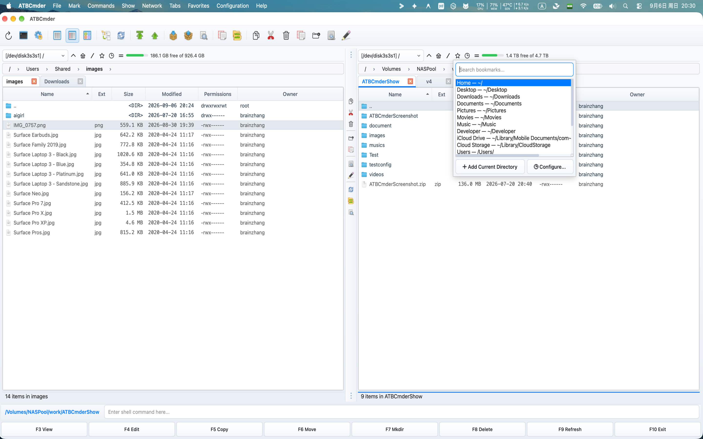
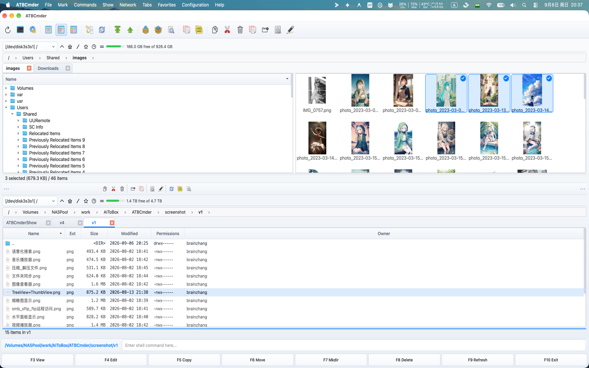

# Capítulo 2: Navegação e abas de pastas

O movimento fluido e de alta velocidade através de diretórios é a base do gerenciamento ortodoxo de arquivos. No ATBCmder, você nunca precisa perder tempo arrastando barras de rolagem, clicando repetidamente em pastas aninhadas ou lutando com dezenas de janelas fragmentadas do Finder. 

Este capítulo aborda tudo o que você precisa para navegar em sistemas de arquivos locais e remotos com absoluta confiança: trilhas interativas, saltos na hierarquia do teclado, fluxos de trabalho nativos de várias guias do macOS, áreas de trabalho persistentes de guias favoritas de painel duplo, marcadores instantâneos de pesquisa difusa e cinco modos de visualização de painel especializados. 

---

## 1. Guia de início rápido visual: hierarquia e organização espacial sem esforço

No ATBCmder, cada painel opera como um mecanismo de navegação autônomo equipado com sua própria cadeia de navegação, faixa de guias independente, pilha de histórico e modos de visualização. 

```
┌─────────────────────────────────────────────────────────────────────────────────┐
│ [NAVEGAÇÃO]   🏠 / ▸ Users ▸ username ▸ Projects ▸ ATBCmder ▸ src               │
├─────────────────────────────────────────────────────────────────────────────────┤
│ [ABAS]        [★ Código (Bloqueado)] [Recursos] [Saída Build] [+]               │
├─────────────────────────────────────────────────────────────────────────────────┤
│  Nome                         Tipo      Tamanho   Modificado         Permissões │
│  ▸ [..]                                           --:--              drwxr-xr-x │
│  ▸ core                       <DIR>               Hoje, 14:22        drwxr-xr-x │
│  ▸ ui                         <DIR>               Hoje, 15:05        drwxr-xr-x │
│  ● main.py                    py        8.4 KB    Hoje, 15:10        -rw-r--r-- │
│  ● config.xml                 xml       12.1 KB   Ontem, 19:40       -rw-r--r-- │
│                                                                                 │
├─────────────────────────────────────────────────────────────────────────────────┤
│ [BUSCA RÁPIDA]  🔍 Buscar: mai_   (Correspondência: main.py)                    │
└─────────────────────────────────────────────────────────────────────────────────┘
```

### Folha de dicas de navegação de matriz dupla

| Ação | Atalho do macOS | Chave do Comandante Clássico | ID do comando | Descrição | 
| :--- | :--- | :--- | :--- | :--- | 
| **Diretório pai** | `Backspace` / `⌘↑` | `Ctrl+PgUp` | `cm_ChangeDirToParent` | Suba um nível de diretório (`..`). | 
| **Diretório raiz** | `Ctrl+\` / `⌃\` | `\` | `cm_ChangeDirToRoot` | Vá diretamente para a raiz do sistema (`/`). | 
| **Diretório inicial** | `Ctrl+Shift+Home` / `⌃⇧Home` | `Alt+Home` | `cm_ChangeDirToHome` | Vá para o diretório inicial do usuário (`~`). | 
| **Abrir item/Inserir diretório** | `Enter` / `⌘↓` | `Enter` | — | Entre no diretório selecionado ou abra o arquivo. | 
| **Nova guia** | `Cmd+T` / `⌘T` | `Ctrl+T` | `cm_NewTab` | Abra a pasta ativa em uma nova guia. | 
| **Fechar guia** | `Cmd+W` / `⌘W` | `Ctrl+W` | `cm_CloseTab` | Feche a guia atualmente em foco. | 
| **Lista de favoritos do diretório** | `Ctrl+D` / `⌃D` | `Ctrl+D` | `cm_DirHotList` | Abra o pop-up instantâneo de favoritos difusos. | 
| **Histórico Voltar** | `Cmd+[` / `⌘[` | `Alt+Left` | `cm_ViewHistoryPrev` | Volte para a pasta visitada anteriormente. | 
| **Histórico Avançar** | `Cmd+]` / `⌘]` | `Alt+Right` | `cm_ViewHistoryNext` | Avance no histórico do diretório. | 
| **Lista suspensa de histórico** | `Alt+F8` / `⌥F8` | `Ctrl+Down` | `cm_DirHistory` | Exibir lista suspensa do histórico. | 
| **Lista de Unidade/Volume (Esquerda/Direita)** | `⌥F1` / `⌥F2` (`⌥D`) | `Alt+F1` / `Alt+F2` (`Alt+D`) | `cm_LeftOpenDrives` / `cm_RightOpenDrives` (`cm_Drives`) | Abra o menu do drive para o painel esquerdo ou direito (`Alt+D` para o painel ativo). | 
| **Pesquisa rápida** | `Ctrl+S` / `⌃S` | `Ctrl+S` | `cm_QuickSearch` | Abra a sobreposição de pesquisa em tempo real no painel. | 

---

## 2. Navegação básica no diretório: caminhos, localização atual e atalhos

O ATBCmder oferece várias maneiras redundantes e ergonômicas de se mover pelo sistema de arquivos, quer você prefira gestos do mouse, cliques no trackpad ou pura velocidade do teclado.

### Navegação com mouse e trackpad

- **Inserindo Pastas**: Clique duas vezes em qualquer linha do diretório ou pressione `Enter` (`Return`). 
- **Hierarquias ascendentes**: clique duas vezes na linha superior `[..]` para ir imediatamente para a pasta pai. 
- **Guias em segundo plano**: clique com o botão do meio em qualquer linha da pasta para abrir esse diretório em uma nova guia em segundo plano sem perder a visualização atual (`cm_OpenDirInNewTab`).

### Barra de navegação interativa estilo Finder

Posicionada diretamente acima de cada painel de arquivo, a barra de navegação interativa representa seu caminho atual do UNIX como uma cadeia de segmentos clicáveis: 

```
🏠 / ▸ Users ▸ brain ▸ Projects ▸ ATBCmder ▸ docs
```
 

1. **Salto instantâneo do ancestral**: Clique em qualquer segmento ancestral (como `Projects` ou `Users`) para ir direto para esse nível, ignorando várias navegações na pasta pai. 
2. **Listas suspensas do diretório irmão**: passe o mouse ou clique na divisa (`▸`) entre os segmentos para revelar um menu suspenso listando todas as pastas irmãs nesse nível de hierarquia. Clique em qualquer irmão para navegar diretamente até ele. 
3. **Utilitários Contextuais**: Clique com o botão direito em qualquer segmento de localização atual para abrir um menu de contexto dedicado: 
- **Abrir em nova guia**: abre essa pasta ancestral específica em uma nova guia. 
- **Revelar no Finder**: abre o diretório no Finder nativo do macOS (`open -R`). 
- **Copiar caminho**: copia o caminho UNIX absoluto do segmento para a área de transferência do macOS. 
- **Abrir no Terminal**: Abre uma janela do Terminal dentro desse diretório exato. 
4. **Edição direta de texto de caminho (`BreadcrumbLineEdit`)**: 
- Clique duas vezes no espaço em branco à direita da cadeia de navegação (ou pressione `Shift+F2`). 
- Os segmentos de localização atual se transformam instantaneamente em um campo de texto editável (`QLineEdit`). 
- Digite ou cole caminhos arbitrários (como locais de arquivo `~/Library/Application Support`, `/var/log`, `/Volumes/ExternalDrive` ou `vfs://`). 
- Pressione `Enter` para pular ou `Esc` para cancelar e retornar aos botões de localização atual.

### Saltos rápidos no teclado

Mantenha as mãos na linha inicial com estes comandos de navegação dedicados: 

- **Diretório pai (`Backspace` / `⌘↑` / `Ctrl+PgUp` / `cm_ChangeDirToParent`)**: sobe instantaneamente para o diretório pai. Ao subir, o ATBCmder posiciona automaticamente o cursor na pasta que você acabou de sair, garantindo que você nunca perca o lugar. 
- **Diretório raiz (`Ctrl+\` / `cm_ChangeDirToRoot`)**: vai diretamente para a raiz do volume de inicialização do macOS (`/`). 
- **Diretório inicial (`Ctrl+Shift+Home` / `cm_ChangeDirToHome`)**: vai diretamente para o diretório inicial do usuário (`/Users/username` ou `~`). 
- **Primeira e última entrada**: pressione `Home` (`cm_GoToFirst`) para direcionar o foco do cursor para a entrada superior (`..`) ou `End` (`cm_GoToLast`) para pular para o arquivo final no painel atual. 

---

## 3. Guias de pasta: multitarefa em cada painel

Trabalhar em projetos de software complexos, bibliotecas de fotos ou backups de servidores geralmente exige o gerenciamento simultâneo de várias pastas. Em vez de abrir dezenas de janelas, o ATBCmder incorpora faixas independentes de múltiplas abas para ambos os painéis. 

 
*Gerenciamento de várias guias e navegação rápida no ATBCmder*

### Design nativo da barra de guias do macOS

Construída com `MacNativeTabBar`, a barra de guias corresponde à estética moderna do macOS: 

- **Design visual**: cantos arredondados das guias, estados de foco suaves e indicadores claros de destaque da guia ativa. 
- **Botões de fechamento ao passar o mouse**: cada guia apresenta um botão de fechar `✕` integrado que aparece ao passar o mouse ou selecionar. 
- **Clique do meio para fechar**: Clique em qualquer guia com o botão do meio do mouse/trackpad e clique com três dedos para fechá-la imediatamente. 
- **Clique duas vezes para adicionar**: Clique duas vezes no espaço vazio na faixa de guias para gerar instantaneamente uma nova guia clonada do caminho ativo.

### Operações de guias e teclas de atalho

| Ação | Atalho do macOS | Chave Clássica | ID do comando | Descrição | 
| :--- | :--- | :--- | :--- | :--- | 
| **Nova guia** | `Cmd+T` / `⌘T` | `Ctrl+T` | `cm_NewTab` | Abre o diretório atual em uma nova guia. | 
| **Fechar guia** | `Cmd+W` / `⌘W` | `Ctrl+W` | `cm_CloseTab` | Fecha a guia ativa (mínimo de 1 guia retida). | 
| **Próxima guia** | `Ctrl+Tab` / `⌃⇥` | `Ctrl+Tab` | `cm_NextTab` | Os ciclos focam na próxima guia à direita. | 
| **Guia anterior** | `Ctrl+Shift+Tab` / `⌃⇧⇥` | `Ctrl+Shift+Tab` | `cm_PrevTab` | Os ciclos focam na guia anterior à esquerda. | 
| **Lista de guias rápidas** | `Ctrl+Shift+L` / `⌃⇧L` | `Ctrl+Shift+L` | `cm_ShowTabsList` | Abre um menu numerado de todas as guias abertas. | 
| **Renomear guia** | *Clique com o botão direito* | — | `cm_RenameTab` | Atribui um rótulo amigável personalizado à guia. | 
| **Fechar outras guias** | *Clique com o botão direito* | — | `cm_CloseOtherTabs` | Fecha todas as guias, exceto a selecionada. | 
| **Fechar duplicatas** | *Clique com o botão direito* | — | `cm_CloseDuplicateTabs` | Detecta e fecha guias duplicadas com caminhos idênticos. | 
| **Fechar todas as guias** | *Guias de menu* | — | `cm_CloseAllTabs` | Redefine o painel para uma única guia. | 
| **Copiar para o lado** | *Guias de menu* | — | `cm_CopyAllTabsToOpposite` | Copia todas as guias do painel ativo para o painel de destino. |

### Modos de bloqueio de guias

Evite alterações acidentais de diretório em pastas críticas configurando opções de bloqueio de guias. Clique com o botão direito em qualquer guia para escolher seu modo de bloqueio: 

1. **Normal (Desbloqueado)**: 
- Comportamento padrão da guia. 
- Navegar pelas pastas atualiza diretamente o caminho da guia atual. 
2. **Bloqueado (`cmd_SetTabOptionLock`)**: 
- O caminho da guia está estritamente congelado em seu local de âncora inicial. 
- Um ícone de cadeado visual (`🔒` ou `★`) aparece no título da guia. 
- Se você clicar duas vezes em um subdiretório ou navegar, o ATBCmder automaticamente deixa a guia bloqueada inalterada e abre a pasta de destino em uma **nova guia adjacente**. 
3. **Bloqueado com subdiretórios permitidos (`cmd_SetTabOptionLockWithSubdirs`)**: 
- Permite que você navegue livremente em pastas e subdiretórios secundários nesta árvore. 
- Restringe você de subir acima da pasta base bloqueada. 
- Se você desligar ou recarregar, a guia será redefinida com segurança para sua raiz âncora. 

---

## 4. Guias favoritas: espaços de trabalho nomeados de painel duplo

Embora as guias individuais forneçam flexibilidade local, as **Guias Favoritas** permitem capturar e restaurar ambientes operacionais completos de painel duplo em um único comando. 

```
┌────────────────────────────────────────┐
│ FAVORITE TAB SET: "Client Release"     │
├───────────────────┬────────────────────┤
│ LEFT PANEL TABS   │ RIGHT PANEL TABS   │
│ 1. [★ src/api]    │ 1. [build/dist]    │
│ 2. [docs/guides]  │ 2. [vfs://sftp/nas]│
│ 3. [tests/unit]   │ 3. [~/Downloads]   │
└───────────────────┴────────────────────┘
```
 

Um conjunto de guias favoritas encapsula: 

- Todas as abas abertas no Painel Esquerdo (incluindo caminhos e estados de bloqueio). 
- Todas as abas abertas no Painel Direito (incluindo caminhos e estados de bloqueio). 
- A seleção da guia ativa para ambos os painéis.

### Comandos de guias favoritas

- **Salvar guias atuais (`cm_SaveFavoriteTabs`)**: 
- Acessível através do Menu **Favoritos** → **Salvar guias atuais em Novas Guias Favoritas** ou clicando com o botão direito na faixa de guias. 
- Solicita que você nomeie o espaço de trabalho (por exemplo, `Rust Web Backend`, `Photo Editing 2026` ou `Server Deployment`). 
- Armazena a definição do espaço de trabalho de forma persistente em `fav_tab_config.xml`. 
- **Carregar guias favoritas (`cm_LoadFavoriteTabs`)**: 
- Acessível através do Menu **Favoritos** → **Carregar guias de Guias Favoritas**. 
- Abre uma caixa de diálogo modal listando seus conjuntos de guias salvos. Selecione um conjunto e ambos os painéis reconstroem imediatamente o layout completo de várias guias. 
- **Salvar novamente guias favoritas (`cm_ResaveFavoriteTabs`)**: 
- Atualiza o conjunto de espaço de trabalho atualmente ativo com quaisquer guias recém-abertas, fechadas ou navegadas sem solicitar um novo nome. 
- **Recarregar guias favoritas (`cm_ReloadFavoriteTabs`)**: 
- Reverte ambos os painéis para o estado limpo e salvo do espaço de trabalho ativo, descartando quaisquer guias exploratórias abertas durante a sessão. 
- **Ciclar espaços de trabalho (guias favoritas seguintes/anteriores)**: 
- Alterne rapidamente entre diferentes espaços de trabalho de projetos salvos sequencialmente no menu Favoritos. 
- **Configuração (`cm_ConfigFavoriteTabs`)**: 
- Abra **Preferências** → **Guias favoritas** para reordenar conjuntos, renomear espaços de trabalho, editar caminhos de guias individuais manualmente ou excluir conjuntos obsoletos. 

---

## 5. Listas de diretórios (marcadores)

A **Lista de diretórios** fornece acesso global e instantâneo às pastas usadas com mais frequência em unidades locais, discos externos e montagens de rede remotas. 

 

* Pop-up da Hotlist do diretório com pesquisa difusa em tempo real *

### Pop-up instantâneo da lista de favoritos (`Ctrl+D` / `⌃D` / `cm_DirHotList`)

Pressionar `Ctrl+D` invoca uma caixa de diálogo de pesquisa flutuante e leve, centralizada bem sob seus olhos: 

1. **Pesquisa difusa em tempo real**: 
- Comece a digitar imediatamente. A barra de pesquisa filtra todos os nomes de favoritos e caminhos de destino em tempo real. 
- Por exemplo, digitar `down` corresponde instantaneamente a `Downloads — /Users/username/Downloads`. 
2. **Travessia do teclado**: 
- Use as teclas de seta `Up` e `Down` para destacar o marcador desejado. 
- Pressione `Enter` para navegar no painel ativo diretamente para esse caminho. 
- Pressione `Esc` para descartar o pop-up sem alterar seu diretório. 
3. **Criação rápida de favoritos**: 
- Clique no botão **Adicionar diretório atual** (ou pressione `Alt+A`) dentro do pop-up. 
- ATBCmder preenche automaticamente o caminho da pasta atual e sugere um nome de exibição limpo.

### Configuração da lista de procurados (`Ctrl+Shift+D` / `⌃⇧D` / `cm_ConfigDirHotList`)

Abra **Preferências** → **Lista de diretórios** (ou acione `cm_ConfigDirHotList`) para organizar seus favoritos: 

- **Submenus hierárquicos**: Agrupe marcadores relacionados em categorias (por exemplo, `Work`, `Personal`, `Cloud Storage`, `Network Shares`). 
- **Rótulos de exibição personalizados**: atribua nomes amigáveis ​​como `Work Documents` em vez de caminhos longos como `/Users/username/Library/Mobile Documents/com~apple~CloudDocs/Work`. 
- **Reordenação de arrastar e soltar**: reorganize a ordem dos marcadores para manter os diretórios de maior prioridade no topo da sua lista. 

---

## 6. Histórico e unidades: navegando no tempo e nos volumes de armazenamento

ATBCmder mantém uma trilha de auditoria abrangente de suas sessões de navegação, permitindo que você refaça suas etapas no armazenamento local e nos volumes montados.

### Histórico de navegação

Cada painel registra sua própria pilha de histórico de caminho cronológico: 

- **Voltar (`Cmd+[` / `⌘[` ou `Alt+Left` / `cm_ViewHistoryPrev`)**: Retrocede um passo no histórico de caminhos do painel ativo. 
- **Avançar (`Cmd+]` / `⌘]` ou `Alt+Right` / `cm_ViewHistoryNext`)**: Avança um passo após navegar para trás. 
- **Popup de histórico de diretório (`Alt+F8` / `⌥F8` ou `Ctrl+Down` / `⌃↓` / `cm_DirHistory`)**: 
- Exibe um menu pop-up rolável mostrando os últimos 20 diretórios visitados no painel ativo. 
- Clique ou use a seta para baixo em qualquer diretório anterior para ir diretamente para ele, ignorando os pressionamentos repetidos de Voltar.

### Alternador de unidade e volume

No macOS, todas as partições internas, unidades USB-C/Thunderbolt externas, DMGs montados e compartilhamentos de rede residem em `/Volumes`. ATBCmder fornece comandos dedicados para alternar entre estes alvos: 

 
*Drive montado instantaneamente e seletor de volume acionado via Alt+F1 (painel esquerdo), Alt+F2 (painel direito) ou Alt+D* 

- **Alterador de unidade do painel esquerdo (`Alt+F1` / `⌥F1` / `cm_LeftOpenDrives`)**: atalho principal do Commander clássico que abre o menu de seleção de unidade e volume direcionado ao painel esquerdo. 
- **Comutador de unidade do painel direito (`Alt+F2` / `⌥F2` / `cm_RightOpenDrives`)**: atalho principal do Commander clássico que abre o menu de seleção de unidade e volume direcionado ao painel direito. 
- **Menu da unidade do painel ativo (`Alt+D` / `⌥D` / `cm_Drives`)**: abre um menu pop-up listando todos os volumes montados, sistema de arquivos raiz `/`, página inicial do usuário `~` e pontos de extremidade de rede conectados para o painel atualmente em foco. 

> [!NOTE] 
> **Permissões de unidades externas do macOS**: ao navegar para unidades externas em `/Volumes` pela primeira vez, o macOS App Sandbox pode solicitar permissão. ATBCmder exibirá uma caixa de diálogo de autorização para criar um marcador de escopo de segurança persistente para essa unidade. 

---

## 7. Modos de visualização do painel: Adaptando a tela

ATBCmder apresenta 5 modos de visualização especializados projetados para otimizar o espaço da tela e a densidade de informações para diferentes fluxos de trabalho de gerenciamento de arquivos.

### 1. Visualização completa das colunas (`Ctrl+F2` / `⌃F2` / `cm_ColumnsView`)

O modo de visualização padrão e mais abrangente. Ele exibe arquivos em um formato tabular rico com cabeçalhos configuráveis: 

| Coluna | Descrição | Alinhamento | 
| :--- | :--- | :--- | 
| **Nome** | Nome do arquivo ou diretório com ícone de tipo nativo do macOS. | Esquerda | 
| **Ext** | Extensão do arquivo (por exemplo, `py`, `png`, `zip`). | Esquerda | 
| **Tamanho** | Tamanho formatado (B, KB, MB, GB). As pastas mostram `<DIR>`. | Certo | 
| **Data de modificação** | Carimbo de data/hora formatado de acordo com a localidade do macOS. | Esquerda | 
| **Atributos** | Permissões UNIX (octal `0755` e simbólica `rwxr-xr-x`). | Centro | 
| **Proprietário/Grupo** | Nomes de propriedade de usuários e grupos UNIX. | Esquerda | 

- **Classificação de cabeçalho**: clique em qualquer cabeçalho de coluna para alternar a ordem de classificação crescente ou decrescente. Clique com `Cmd` pressionado para realizar a classificação secundária.

### 2. Visão resumida (`Ctrl+F1` / `⌃F1` / `cm_BriefView`)

O Brief View elimina colunas de metadados, organizando os arquivos em várias colunas verticais compactas que preenchem toda a largura do painel. 

- **Navegação de alta densidade**: exibe de 3 a 5 vezes mais itens na tela simultaneamente. 
- **Ideal para**: verificação rápida de listagens de diretórios grandes (como fontes, despejos de fotos ou arquivos de log) onde você só precisa identificar nomes de arquivos.

### 3. Visualização de miniaturas (`Ctrl+Shift+F1` / `⌃⇧F1` / `cm_ThumbnailsView`)

A visualização de miniaturas converte a lista de arquivos em uma grade de imagens e ícones de mídia. 

 
*Visualização de miniaturas exibindo visualizações de mídia no painel ativo* 

- **Mídia suportada**: visualizações instantâneas de fotos (JPEG, PNG, HEIC, TIFF, WebP, GIF), formatos vetoriais (SVG), documentos PDF e miniaturas de vídeos (MP4, MOV, MKV). 
- **Geração assíncrona em segundo plano**: a renderização de miniaturas ocorre em threads em segundo plano sem bloquear a interação do usuário. 
- **Tamanho ajustável**: configure tamanhos de ícones de miniaturas (de 64px a 256px) em **Preferências** → **Visualizações de arquivos**.

### 4. Visualização em árvore (`cm_TreeView`, `cm_TreeViewSplit`, `cm_TreeViewBoth`)

A visualização em árvore exibe uma árvore de diretórios hierárquica expansível, facilitando a compreensão rápida de estruturas de pastas profundas. 

 
*Tree View integrado junto com listagens de arquivos e miniaturas* 

ATBCmder oferece suporte a três layouts distintos de visualização em árvore por meio do menu **Mostrar**: 

- **Visualização em árvore (substituir) (`cm_TreeView`)**: A tabela de arquivos do painel ativo é substituída inteiramente por uma árvore de diretórios expansível. 
- **Visualização em árvore (dividida) (`cm_TreeViewSplit`)**: O painel ativo é dividido verticalmente em dois subpainéis: uma árvore de diretórios à esquerda e a listagem de arquivos padrão para a pasta da árvore selecionada à direita. 
- **Visualização em árvore (ambos os painéis) (`cm_TreeViewBoth`)**: Ativa a divisão da árvore de diretórios nos painéis Esquerdo e Direito simultaneamente. 
- **Mostrar arquivos**: clique com o botão direito dentro da visualização em árvore e alterne **Mostrar arquivos** para escolher se os arquivos devem ser renderizados na árvore ao lado dos diretórios ou ocultos para exibir apenas os diretórios.

### 5. Filial/Visualização plana (`Cmd+B` / `⌘B` ou `Ctrl+B` / `⌃B` / `cm_FlatView`)

Flat View (também conhecido como Branch View) é um dos recursos mais poderosos do ATBCmder. Ele percorre recursivamente todos os subdiretórios e subpastas dentro da pasta atual, nivelando todos os arquivos aninhados em uma **lista unificada**. 

 
*Flat Branch View (`Cmd+B`) exibindo conteúdo aninhado em todos os subdiretórios* 

- **A coluna Path**: Na visualização plana, o ATBCmder adiciona automaticamente uma coluna **Path** mostrando o caminho relativo da pasta aninhada de cada arquivo (por exemplo, `assets/icons/` ou `src/core/`). 
- **Classificação global**: Classifique todos os arquivos aninhados simultaneamente em toda a árvore do projeto por tamanho, data de modificação ou extensão de arquivo. 
- **Processamento em lote**: selecione arquivos provenientes de uma dúzia de subdiretórios diferentes e copie, mova, compare ou renomeie todos de uma vez. 
- **Streaming Traversal**: ATBCmder transmite resultados de pesquisa para a visualização de forma incremental usando trabalhadores em segundo plano, garantindo que projetos grandes (com dezenas de milhares de arquivos aninhados) sejam carregados sem problemas, sem congelar a interface do usuário. 
- **Saída rápida**: Pressione `Cmd+B` (`Ctrl+B`) novamente para sair da visualização plana e retornar à visualização normal do diretório hierárquico. 

---

## 8. ⚡ Dicas profissionais e aprofundamento: controle de precisão

Para usuários avançados e tecladistas avançados, o ATBCmder oferece ajuste refinado e mecanismos de pesquisa rápida.

### Sobreposição de pesquisa rápida no painel (`Ctrl+S` / `⌃S` / `cm_QuickSearch`)

A Pesquisa Rápida permite que você vá diretamente para qualquer arquivo digitando seu nome sem abrir uma caixa de diálogo de pesquisa completa. 

```
┌─────────────────────────────────────────────────────────────────┐
│  main.py            py      8.4 KB    Today, 15:10   -rw-r--r-- │
│  main_window.py     py     72.1 KB    Today, 15:18   -rw-r--r-- │
├─────────────────────────────────────────────────────────────────┤
│ 🔍 Quick Search: main_                 [ Next: ↓ ] [ Prev: ↑ ]  │
└─────────────────────────────────────────────────────────────────┘
```
 

1. **Pesquisa Incremental**: 
- Pressione `Ctrl+S` (ou simplesmente comece a digitar se configurado em Preferências). 
- Uma barra de sobreposição aparece encaixada na parte inferior do painel ativo. 
- À medida que você digita os caracteres, o cursor do painel salta em tempo real para a primeira entrada correspondente. 
2. **Partidas de Ciclismo**: 
- Pressione `Down Arrow` (`↓`) para pular para o próximo arquivo correspondente. 
- Pressione `Up Arrow` (`↑`) para pular para a partida anterior. 
- Pressione `Enter` para abrir ou executar o item correspondente. 
- Pressione `Esc` para fechar a barra de pesquisa enquanto mantém o cursor no arquivo encontrado. 
3. **O truque do ponto final**: 
- Digite um ponto final (por exemplo, `config.`) para corresponder especificamente ao final de uma base de nome de arquivo, distinguindo `config.xml` de `configuration_guide.md`. 
4. **Pesquisa rápida x filtro x filtro semântico**: 
- **Pesquisa Rápida (`Ctrl+S` / `cm_QuickSearch`)**: Navega o cursor entre as correspondências enquanto mantém todos os arquivos visíveis. 
- **Filtro Rápido (`cm_QuickFilter`)**: Oculta temporariamente todos os arquivos não correspondentes, exibindo apenas as linhas correspondentes na tabela. 
- **Filtro Semântico (`Ctrl+F` / `cm_SemanticFilter`)**: usa consultas em linguagem natural (por exemplo, `/larger than 10MB`, `//today modified pdf`) via macOS Spotlight.

### Modos de coluna de ajuste automático

Cansado de redimensionamento manual de colunas ou nomes de arquivos truncados? ATBCmder apresenta um mecanismo inteligente de dimensionamento de colunas configurado em **Preferências** → **Visualizações de arquivos**: 

1. **Largura máxima do texto (`mode="max"`)**: 
- Verifica todos os nomes de arquivos visíveis e amplia a coluna Nome para que o nome de arquivo visível mais longo seja totalmente legível sem reticências (`...`). 
2. **Largura média do texto (`mode="average"`, padrão)**: 
- Avalia a largura média estatística dos caracteres nos arquivos multiplicada por um fator de preenchimento configurável (`auto_fit_padding`, padrão `1.0`) mais as margens do ícone. 
- **Vantagem**: evita que um único nome de arquivo anômalo de 150 caracteres empurre todas as colunas secundárias (tamanho, data, permissões) para fora da borda da tela. 
3. **Larguras fixas (`mode="fixed"`)**: 
- Mantém as dimensões exatas dos pixels da coluna. 
- Ativado automaticamente sempre que você arrasta manualmente um separador de colunas no cabeçalho da tabela, respeitando seus ajustes manuais de layout.

### Modo de painéis duplos horizontais (`Ctrl+Shift+H` / `⌃⇧H` / `cm_HorizontalFilePanels`)

Por padrão, o ATBCmder coloca os dois painéis de arquivos lado a lado (divisão vertical). Em monitores ultralargos ou telas verticais verticais, você pode alternar para painéis horizontais empilhados: 

 
*Orientação horizontal dos painéis empilhados com painéis superior e inferior* 

- Alterne através do Menu **Mostrar** → **Modo Painéis Horizontais** ou pressione `Ctrl+Shift+H` (`cm_HorizontalFilePanels`). 
- O paradigma Ativo/Inativo permanece idêntico: as operações fluem suavemente entre os painéis Superior (Origem) e Inferior (Destino).

### Persistência de configurações de visualização por guia

Na maioria dos gerenciadores de arquivos, alterar a coluna de classificação ou mudar de colunas detalhadas para miniaturas força a janela inteira a mudar globalmente. 

O ATBCmder isola e lembra as preferências de visualização no **nível da guia** individual (`TabState`), persistidas automaticamente nas reinicializações por meio de `SessionManager` (`atbcmder_session.xml`): 

- **Modos de visualização independentes**: você pode manter a guia 1 em **Visualização de colunas completas** para revisões de código, a Guia 2 em **Visualização em grade de miniaturas** para recursos gráficos e a Guia 3 em **Visualização resumida** para leitura rápida. 
- **Classificação independente**: cada guia lembra sua própria coluna de classificação (Nome, Extensão, Tamanho, Data ou Permissões) e direção de classificação (crescente versus decrescente). Alternar entre guias nunca redefine suas prioridades de classificação. 
- **Estados planos e de árvore independentes**: uma guia definida como **Visualização de ramificação plana** (`Cmd+B` / `cm_FlatView`) ou **Modo de visualização de árvore** mantém seu nivelamento de diretório recursivo sem alterar o estado de visualização de qualquer outra guia em qualquer painel. 

---

## 9. Receitas práticas passo a passo

Aqui estão três receitas do mundo real que mostram como a navegação, as guias e as listas de procurados se combinam para agilizar as tarefas diárias.

### Receita 1: Construindo um Espaço de Trabalho de Desenvolvimento Persistente

**Objetivo**: configurar um espaço de trabalho de painel duplo para desenvolvimento full-stack que possa ser restaurado com um clique a qualquer momento. 

1. **Configurar Painel Esquerdo (Código Fonte)**: 
- Navegue para `~/Projects/MyApp/src`. 
- Abra uma segunda aba (`Cmd+T`) e navegue até `~/Projects/MyApp/tests`. 
- Clique com o botão direito na guia `src` e escolha **Bloquear guia** (`cmd_SetTabOptionLock`). 
2. **Configurar painel direito (Build & Logs)**: 
- Clique no painel direito para focalizá-lo (`Tab`). 
- Navegue para `~/Projects/MyApp/dist`. 
- Abra uma segunda aba (`Cmd+T`) e navegue até `/var/log`. 
3. **Salvar espaço de trabalho favorito**: 
- Escolha Menu **Favoritos** → **Salvar guias atuais em Novas guias favoritas** (`cm_SaveFavoriteTabs`). 
- Digite `MyApp FullStack` e pressione `Enter`. 
4. **Restauração Instantânea**: 
- Sempre que você trabalhar neste projeto, basta selecionar **Favoritos** → **Carregar guias das guias favoritas** (`cm_LoadFavoriteTabs`) e escolher `MyApp FullStack`. Ambos os painéis configurarão instantaneamente todas as quatro guias com seus caminhos exatos e configurações de bloqueio. 

---

### Receita 2: Achatando árvores de diretórios profundos para encontrar ativos inchados

**Objetivo**: encontrar e limpar equipamentos de teste superdimensionados e despejos de log espalhados em dezenas de subpastas aninhadas. 

1. Navegue até o topo do seu projeto ou diretório de mídia no painel ativo. 
2. Pressione `Cmd+B` (`⌘B`) ou `Ctrl+B` (`cm_FlatView`) para ativar **Visualização de ramificação plana**. 
3. Observe como todos os subdiretórios são recursivamente nivelados em uma única lista no painel. 
4. Clique no cabeçalho da coluna **Tamanho** uma ou duas vezes para classificar todos os arquivos do maior para o menor. 
5. Os arquivos maiores em toda a árvore de diretórios aparecem imediatamente na parte superior do painel, com a coluna **Caminho** mostrando seus locais aninhados exatos. 
6. Inspecione ou exclua os arquivos inchados diretamente. 
7. Pressione `Cmd+B` novamente para desligar Flat View e retornar à navegação de pasta padrão. 

---

### Receita 3: Marcadores extremamente rápidos em volumes internos e de rede

**Objetivo**: marcar uma pasta de backup do NAS remoto e acessá-la em menos de dois segundos. 

1. Navegue até sua unidade de rede montada (por exemplo, `/Volumes/BackupShare/Archives`). 
2. Pressione `Ctrl+D` (`⌃D`) para invocar o pop-up **Directory Hotlist**. 
3. Clique no botão **Adicionar diretório atual** (`btn_add` / `cm_AddDirToHotlist`). 
4. Insira um nome amigável como `NAS Archives`. 
5. Amanhã, quando você estiver em qualquer lugar do sistema de arquivos local, simplesmente pressione `Ctrl+D`, digite `nas` e pressione `Enter`. ATBCmder transporta você instantaneamente pela rede para essa pasta exata. 

---

## 10. Alertas de segurança e sistema

> [!NOTE] 
> **Armazenamento externo e compartilhamentos de rede**: 
> Ao acessar unidades USB externas ou compartilhamentos de rede (`/Volumes/...`) em guias ou marcadores, certifique-se de que o volume esteja montado no momento. Se uma unidade for desmontada quando o ATBCmder for iniciado, as guias que apontam para ela exibirão com segurança um aviso de "Local indisponível" em vez de travar ou remover a guia. 

> [!TIP] 
> **Espelhamento de guias entre painéis**: 
> Quer que o painel direito espelhe imediatamente todas as guias abertas do painel esquerdo? Use Menu **Guias** → **Copiar todas as guias para o painel oposto** (`cm_CopyAllTabsToOpposite`) para replicar o layout da guia em ambos os lados. 

> [!WARNING] 
> **Cuidado com operações em Flat View (`Cmd+B`)**: 
> Na Visualização de ramificação plana, os arquivos de várias ramificações de diretório distintas aparecem lado a lado em uma lista. Tenha cuidado ao usar `Cmd+A` (Selecionar tudo) seguido de `F8` (Excluir) ou `F6` (Mover), pois sua ação será aplicada recursivamente em todos os subdiretórios aninhados. 

---

## 11. Tabela de referência do teclado de matriz dupla

| Categoria | Ação | Atalho do macOS | Chave Clássica | ID de comando interno | 
| :--- | :--- | :--- | :--- | :--- | 
| **Navegação no diretório** | Diretório pai | `Backspace` / `⌘↑` | `Ctrl+PgUp` | `cm_ChangeDirToParent` | 
| | Diretório raiz | `Ctrl+\` / `⌃\` | `\` | `cm_ChangeDirToRoot` | 
| | Diretório inicial | `Ctrl+Shift+Home` / `⌃⇧Home` | `Alt+Home` | `cm_ChangeDirToHome` | 
| | Primeira entrada | `Home` | `Home` | `cm_GoToFirst` | 
| | Última entrada | `End` | `End` | `cm_GoToLast` | 
| **Guias de pastas** | Nova guia | `Cmd+T` / `⌘T` | `Ctrl+T` | `cm_NewTab` | 
| | Fechar guia | `Cmd+W` / `⌘W` | `Ctrl+W` | `cm_CloseTab` | 
| | Fechar guias duplicadas | *Menu de contexto da guia* | — | `cm_CloseDuplicateTabs` | 
| | Fechar todas as guias | *Menu de guias* | — | `cm_CloseAllTabs` | 
| | Renomear guia | *Menu de contexto da guia* | — | `cm_RenameTab` | 
| | Copiar guias para o oposto | *Menu de guias* | — | `cm_CopyAllTabsToOpposite` | 
| | Próxima guia | `Ctrl+Tab` / `⌃⇥` | `Ctrl+Tab` | `cm_NextTab` | 
| | Guia Anterior | `Ctrl+Shift+Tab` / `⌃⇧⇥` | `Ctrl+Shift+Tab` | `cm_PrevTab` | 
| | Mostrar lista de guias | `Ctrl+Shift+L` / `⌃⇧L` | `Ctrl+Shift+L` | `cm_ShowTabsList` | 
| **Guias favoritas** | Salvar guias favoritas | *Menu Favoritos* | — | `cm_SaveFavoriteTabs` | 
| | Carregar guias favoritas | *Menu Favoritos* | — | `cm_LoadFavoriteTabs` | 
| | Salvar novamente favorito ativo | *Menu Favoritos* | — | `cm_ResaveFavoriteTabs` | 
| | Recarregar favorito ativo | *Menu Favoritos* | — | `cm_ReloadFavoriteTabs` | 
| | Configurar guias favoritas | *Preferências* | — | `cm_ConfigFavoriteTabs` | 
| **Listas de favoritos e histórico** | Lista de favoritos do diretório | `Ctrl+D` / `⌃D` | `Ctrl+D` | `cm_DirHotList` | 
| | Configurar lista de favoritos | `Ctrl+Shift+D` / `⌃⇧D` | `Ctrl+Shift+D` | `cm_ConfigDirHotList` | 
| | Adicionar diretório à lista de favoritos | *Pop-up da lista de favoritos* | — | `cm_AddDirToHotlist` | 
| | História para trás | `Cmd+[` / `⌘[` | `Alt+Left` | `cm_ViewHistoryPrev` | 
| | História Avançar | `Cmd+]` / `⌘]` | `Alt+Right` | `cm_ViewHistoryNext` | 
| | Lista suspensa de histórico | `Alt+F8` / `⌥F8` | `Ctrl+Down` | `cm_DirHistory` | 
| **Unidades e volumes** | Unidades do painel esquerdo | `Alt+F1` / `⌥F1` | `Alt+F1` | `cm_LeftOpenDrives` | 
| | Unidades do painel direito | `Alt+F2` / `⌥F2` | `Alt+F2` | `cm_RightOpenDrives` | 
| | Menu do Drive do Painel Ativo | `Alt+D` / `⌥D` | `Alt+D` | `cm_Drives` | 
| **Modos de visualização** | Visualização de colunas completas | `Ctrl+F2` / `⌃F2` | `Ctrl+F2` | `cm_ColumnsView` | 
| | Breve Visão | `Ctrl+F1` / `⌃F1` | `Ctrl+F1` | `cm_BriefView` | 
| | Visualização de miniaturas | `Ctrl+Shift+F1` / `⌃⇧F1` | `Ctrl+Shift+F1` | `cm_ThumbnailsView` | 
| | Visualização em árvore (Substituir) | *Mostrar Menu* | `Ctrl+Shift+F8` | `cm_TreeView` | 
| | Visualização em árvore (dividida) | *Mostrar Menu* | — | `cm_TreeViewSplit` | 
| | Visualização em árvore (ambos os painéis) | *Mostrar Menu* | — | `cm_TreeViewBoth` | 
| | Vista de filial plana | `Cmd+B` / `⌘B` | `Ctrl+B` | `cm_FlatView` | 
| | Modo Painéis Horizontais | `Ctrl+Shift+H` / `⌃⇧H` | `Ctrl+Shift+H` | `cm_HorizontalFilePanels` | 
| **Pesquisa e filtros** | Sobreposição de pesquisa rápida | `Ctrl+S` / `⌃S` | `Ctrl+S` | `cm_QuickSearch` | 
| | Filtro Semântico | `Ctrl+F` / `⌃F` | `Ctrl+F` | `cm_SemanticFilter` |

--- 

<div align="center"> 
<p>Agora que você domina a navegação de diretório, guias e visualizações de painel:</p> 
<p><strong><a href="file_operations.md">Prossiga para o Capítulo 3: Operações diárias de arquivos e fila &rarr;</a></strong></p> 
</div>