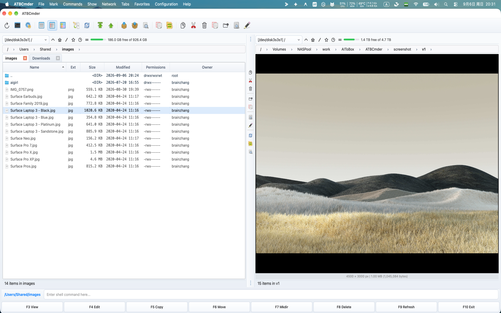

# Capítulo 4: Visualizador universal e editores integrados

No gerenciamento ortodoxo de arquivos com painel duplo, a velocidade depende muito da velocidade da inspeção. Lançar ambientes de desenvolvimento integrados (IDEs) pesados ​​ou aplicativos de desktop inchados apenas para verificar uma soma de verificação, verificar uma linha de configuração, cortar uma captura de tela ou inspecionar um PDF cria atrito cognitivo e confusão de janelas. 

O ATBCmder resolve isso fornecendo um subsistema unificado de visualização e edição com vários mecanismos, diretamente integrado ao núcleo do aplicativo. Se você precisa de uma visualização embutida em tempo real enquanto percorre pastas, uma análise forense profunda em nível de byte no modo Hex, um reprodutor de áudio que continua sendo reproduzido em segundo plano enquanto você organiza arquivos ou um editor de código atômico com reconhecimento de sintaxe, o ATBCmder oferece controle instantâneo do teclado. 

---

## 1. Guia de início rápido visual: inspeção e edição imediata de arquivos

ATBCmder divide a inspeção e modificação de arquivos em dois paradigmas distintos: 

1. **Visualização rápida do painel oposto (`Cmd+Q` / `Ctrl+Q`)**: Incorpora uma visualização ao vivo e rejeitada diretamente dentro do painel inativo sem gerar janelas separadas. 
2. **Lista Universal Dedicado (`F3`) e Editor Interno (`F4`)**: Abre janelas independentes e não modais com suporte a mecanismos de formato especializados, pesquisa de texto completo, reprodução de mídia e realce de sintaxe. 

```
┌────────────────────────────────────────────────────────────────────────────────────────┐
│  ACTIVE PANEL (File Navigation)                     INACTIVE PANEL (Quick View)        │
│  /Users/brain/Projects/atbcmder/src                 [Quick View Preview: main.py]      │
├──────────────────────────────────────────────┬───┬─────────────────────────────────────┤
│  Name                         Size   Date    │   │ 0001: """                           │
│  ▸ [..]                              --:--   │ Q │ 0002: Main application entry point  │
│  ✔ main.py                    8.4 KB 15:10   │ U │ 0003: """                           │
│  ● config.xml                12.1 KB 14:20   │ I │ 0004: import sys                    │
│  ● hero_banner.png          248.5 KB 09:12   │ C │ 0005: from PySide6.QtWidgets import │
│  ● sample_invoice.pdf       512.0 KB 11:30   │ K │ 0006:     QApplication              │
│  ● release_theme.mp3          4.2 MB 16:45   │   │                                     │
│  ● firmware_dump.bin          1.0 MB 10:00   │ V │ [UTF-8] [Python] [LF] [Line 1/140]  │
├──────────────────────────────────────────────┴───┴─────────────────────────────────────┤
│   [Cmd+Q / Ctrl+Q] Toggle Quick View    [F3] Universal Lister    [F4] Internal Editor  │
└────────────────────────────────────────────────────────────────────────────────────────┘
```

### Folha de dicas de inspeção e edição de matriz dupla

| Ação | Atalho do macOS | Chave do Comandante Clássico | ID do comando | Descrição | 
| :--- | :--- | :--- | :--- | :--- | 
| **Alternar visualização rápida** | `Cmd+Q` / `⌘Q` | `Ctrl+Q` | `cm_QuickView` | Abre a visualização ao vivo no painel oposto. | 
| **Lista Universal** | `F3` / `Fn+F3` | `F3` | `cm_View` | Abre o item selecionado no Universal Lister. | 
| **Editor Interno** | `F4` / `Fn+F4` | `F4` | `cm_Edit` | Abre o Editor de Código para texto ou o Editor de Imagens para gráficos. | 
| **Criar e editar novo arquivo** | `Shift+F4` / `⇧F4` | `Shift+F4` | `cm_EditNew` | Solicita o nome e abre o editor. | 
| **Alternar foco do painel** | `Tab` / `⇥` | `Tab` | `cm_SwitchPanel` | Muda o foco; inverte a visualização rápida simetricamente. | 
| **Modo de visualização hexadecimal** | `2` | `2` | — *(Lista)* | Alterna a inspeção hexadecimal em nível de byte no Lister. | 
| **Modo de visualização de texto** | `1` | `1` | — *(Lista)* | Retorna o Lister para o modo de texto simples formatado. | 
| **Alternar quebra de linha** | `Alt+W` / `⌥W` | `Alt+W` | — *(Listador/Editor)* | Alterna a quebra de linha suave no Lister e no Editor. | 
| **Alternar números de linha**| `Alt+L` / `⌥L` | `Alt+L` | — | Alterna os números das linhas de medianiz à esquerda. | 
| **Modo de registro ao vivo** | `F5` / `Fn+F5` | `F5` | — | Transmite entradas de log recém-anexadas em tempo real. | 
| **Áudio de fundo** | `Background` Botão | — | — | Encaixa a reprodução de áudio na faixa de status do painel. | 
| **Configurar associações**| Menu Configuração | — | `cm_FileAssoc` | Configura extensões de arquivo e ferramentas auxiliares. | 

---

## 2. Painel de visualização rápida (`Cmd+Q` / `Ctrl+Q` / `cm_QuickView`)

O **Painel de visualização rápida** é um dos fluxos de trabalho mais poderosos em gerenciadores de arquivos ortodoxos. Rather than opening and closing floating windows as you inspect a folder containing hundreds of items, Quick View transforms the inactive panel into an embedded, contextual viewport.

  
*Figura 4.1: Visualização rápida incorporada no painel oposto exibindo código realçado com sintaxe ao vivo junto com a navegação no diretório.*

### 2.1 A vantagem da visualização de painel duplo

Para ativar a Visualização Rápida: 

1. Navegue até qualquer arquivo ou diretório no painel ativo. 
2. Pressione **`Cmd+Q`** (`⌘Q`) no macOS ou **`Ctrl+Q`** (`cm_QuickView`). 
3. O painel oposto muda instantaneamente de sua listagem de diretório normal para o **Quick View Container** (`QuickViewContainer`), renderizando o conteúdo do item sob o cursor. 
4. Pressionar `Cmd+Q` ou `Ctrl+Q` novamente fecha a visualização e restaura a guia anterior e a lista de pastas do painel oposto sem perder seu lugar.

### 2.2 Atualização em tempo real com depuração de 100 ms

Ao manter pressionadas as teclas de seta `Up` ou `Down` para rolar rapidamente por uma pasta de milhares de arquivos, os visualizadores de arquivos padrão geralmente congelam a interface do usuário ou provocam uma intensa sobrecarga no disco. 

O ATBCmder resolve isso por meio de um **temporizador de debounce de disparo único interno de 100 milissegundos** (`_quick_view_timer`): 

- À medida que você navega rapidamente pelas linhas, o caminho do arquivo ativo é armazenado na memória. 
- O carregamento pesado de arquivos, a análise de sintaxe e a renderização de miniaturas só são acionados quando o cursor pausa em um item por pelo menos 100 ms. 
- A rolagem permanece perfeitamente suave a mais de 60 quadros por segundo, mesmo ao navegar em diretórios de mídia de vários gigabytes ou despejos de disco brutos.

### 2.3 Inversão de foco simétrico em `Tab`

Um problema comum em gerenciadores de painel duplo é perder a visualização ao trocar de painel. No ATBCmder, o Quick View apresenta **Inversão simétrica de foco**: 

- Se a Visualização rápida estiver ativa no painel direito e você pressionar **`Tab`** para mudar o foco ativo para o painel direito: 
1. O painel direito restaura imediatamente sua tabela de arquivos normal para que você possa interagir com os arquivos. 
2. A Visualização Rápida muda automaticamente e perfeitamente para o Painel Esquerdo, exibindo uma visualização ao vivo de qualquer arquivo destacado no Painel Direito. 
- Isso mantém um ciclo ininterrupto de navegação e inspeção, independentemente do painel em que você está trabalhando.

### 2.4 Roteamento Inteligente de Conteúdo

O Quick View Container detecta dinamicamente extensões de arquivo, assinaturas MIME e cabeçalhos de bytes brutos para selecionar o mecanismo de visualização ideal: 

| Tipo de conteúdo | Extensões/Assinaturas | Mecanismo de visualização incorporado | 
| :--- | :--- | :--- | 
| **Código Fonte e Texto** | `.py`, `.rs`, `.cpp`, `.c`, `.h`, `.js`, `.ts`, `.html`, `.css`, `.json`, `.xml`, `.yaml`, `.md`, heurística de texto simples | `TextPanel` com destaque de sintaxe do Pygments e números de linha. | 
| **Imagens raster e vetoriais**| `.png`, `.jpg`, `.jpeg`, `.webp`, `.svg`, `.bmp`, `.gif`, `.ico`, `.tiff` | `ImagePanel` com redução de resolução suave e preservação da proporção de aspecto. | 
| **Documentos PDF** | `.pdf` | `PdfPanel` com renderização de página nativa `PySide6.QtPdf` (ajustar à largura). | 
| **Mídia de áudio e vídeo** | `.mp3`, `.wav`, `.flac`, `.aac`, `.m4a`, `.ogg`, `.mp4`, `.mkv`, `.mov`, `.avi`, `.webm` | `MediaPanel` com visualização de áudio silenciado e controles de reprodução. | 
| **Dados tabulares** | `.csv`, `.tsv`, `.xlsx`, `.xls`, `.ods` | `SpreadsheetPanel` com grade de tabela somente leitura e dimensionamento automático de coluna. | 
| **Documentos e e-books** | `.docx`, `.odt`, `.rtf`, `.epub` | `DocumentPanel` / `EpubPanel` renderizador de documentos rich-text. | 
| **Arquivos de banco de dados** | `.sqlite`, `.sqlite3`, `.db` | `SqlitePanel` com navegador de esquema e visualizador de dados de tabela. | 
| **Arquivos** | `.zip`, `.tar`, `.gz`, `.bz2`, `.xz`, `.7z` | `ArchiveInspectorPanel` exibindo hierarquias de membros não compactadas. |

### 2.5 Fallback de propriedade de metadados (`QuickViewPropertiesWidget`)

Quando você destaca um diretório ou formato de arquivo que não pode ser renderizado como texto ou mídia, o ATBCmder alterna automaticamente para **Properties Fallback View** (`QuickViewPropertiesWidget`): 

```
┌────────────────────────────────────────────────────────┐
│  📁 release_builds                                     │
│  /Volumes/ExternalSSD/Projects/release_builds          │
├────────────────────────────────────────────────────────┤
│  Metadata                                              │
│    Full Path:      /Volumes/ExternalSSD/...            │
│    Size:           Directory (or 148,290,112 bytes)    │
│    Last Modified:  2026-09-06 14:10:22                 │
│    Last Accessed:  2026-09-06 15:02:18                 │
├────────────────────────────────────────────────────────┤
│  Permissions (UNIX)                                    │
│    Octal Mode: 0755                                    │
│    Owner:  [✔] Read  [✔] Write  [✔] Execute            │
│    Group:  [✔] Read  [ ] Write  [✔] Execute            │
│    Others: [✔] Read  [ ] Write  [✔] Execute            │
├────────────────────────────────────────────────────────┤
│  Checksums / Stats                                     │
│    Contents: 42 files, 8 folders                       │
│    MD5:      Calculating... ➔ 8f14e45fceea167a...      │
│    SHA256:   Calculating... ➔ 3a491d90bc1f4201...      │
└────────────────────────────────────────────────────────┘
```
 

- **Cartão de cabeçalho**: Exibe o ícone do sistema em alta resolução, o nome do arquivo e o caminho pai. 
- **Metadados do arquivo**: mostra o tamanho exato do byte, tamanho legível por humanos (`KB`, `MB`, `GB`, `TB`), carimbo de data/hora de modificação (`mtime`) e carimbo de data/hora de acesso (`atime`). 
- **Matriz de permissão UNIX**: exibe o modo de permissão octal de 4 dígitos (por exemplo, `0755`, `0644`) junto com uma matriz de caixa de seleção 3x3 somente leitura para Proprietário, Grupo e Outros (`rwx`). 
- **Hashes de segundo plano assíncronos**: para arquivos, um thread de segundo plano assíncrono (`HashWorker`) calcula hashes criptográficos MD5 e SHA-256 sem bloquear a interface. Para diretórios, ele verifica e relata a contagem agregada de arquivos e subpastas aninhados. 

---

## 3. Lista Universal (`F3` / `Fn+F3` / `cm_View`)

Embora o Quick View seja otimizado para visualizações rápidas na janela de painel duplo, o **Universal Lister** (`F3` / `Fn+F3` / `cm_View`) abre uma janela não modal dedicada de nível superior (`UniversalViewerDialog`). Várias janelas do Universal Lister podem ser abertas simultaneamente, permitindo comparar documentos lado a lado ou manter o streaming de registros em monitores secundários.

### Barra de ferramentas de ação rápida superior

O Lister apresenta uma barra de ferramentas de ação rápida integrada que fornece acesso rápido aos modos de visualização, navegação e configurações de exibição: 

```
[Text (1)] [Hex (2)] [Wrap (Alt+W)] [Line Numbers (Alt+L)] [Tail (F5)] | [◀ Prev (P)] [Next ▶ (N)] | [🔍 Search (Ctrl+F)] [Go to Line (Ctrl+G)] | [Open in System (Ctrl+O)] [Fullscreen (F11)]
```
 

- **Modo Texto (`1`) / Modo Hex (`2`)**: Alterna instantaneamente entre exibição de caracteres decodificados e inspeção de bytes brutos. 
- **Word Wrap (`Alt+W` / `⌥W`)**: Alterna a quebra suave de palavras para linhas longas. 
- **Números de linha (`Alt+L` / `⌥L`)**: Alterna a medianiz de numeração de linha. 
- **Modo Tail (`F5`)**: Rola e captura automaticamente dados de log recém-gravados em tempo real. 
- **Arquivo Anterior (`P`) / Próximo Arquivo (`N`)**: Navega para o arquivo adjacente na tabela de arquivos da pasta pai sem fechar a janela do visualizador. 
- **Localizar (`Ctrl+F` / `Cmd+F`)**: Abre a barra de pesquisa inferior encaixada. 
- **Ir para a linha (`Ctrl+G` / `Cmd+G`)**: solicita um número de linha para ir diretamente para o código de destino. 
- **Abrir no sistema (`Ctrl+O` / `Cmd+O`)**: transfere o arquivo para o aplicativo padrão do sistema macOS (por exemplo, Preview, Safari ou Xcode). 
- **Tela cheia (`F11` / `Alt+Enter`)**: Maximiza a janela do Lister para preencher a exibição. 

---

### 3.1 Domínio 1: Documentos e Livros Estruturados

O ATBCmder incorpora mecanismos de layout especializados para documentos estruturados, apresentações de slides, livros eletrônicos e texto formatado, eliminando a necessidade de esperar pelo lançamento de suítes de escritório externas.

#### 3.1.1 Documentos Word e Rich Text (`DocumentPanel`)

Ao pressionar `F3` em arquivos Microsoft Word (`.docx`, `.doc`), Rich Text (`.rtf`) ou OpenDocument (`.odt`), ATBCmder ativa `DocumentPanel`: 

- **Cartões de páginas de documentos**: renderiza páginas estruturadas em cartões de papel centralizados (`.doc-page`) com tipografia nítida e margens correspondentes aos layouts modernos de processadores de texto. 
- **Preservação de formatação**: preserva hierarquias de parágrafos, estilos de negrito/itálico/sublinhado, variações de cores de fonte, listas não ordenadas e numeradas e hiperlinks embutidos. 
- **Tabela complexa e renderização de imagens incorporadas**: analisa grades complexas de tabelas de múltiplas colunas com espaçamento de células com bordas e renderiza ilustrações raster incorporadas. 
- **Zoom e pesquisa de página**: controles granulares de zoom de página (`Ctrl++` / `Ctrl+-` ou caixa giratória de zoom) e barra de pesquisa integrada no documento (`ViewerSearchBar`).

#### 3.1.2 Apresentação de slides (`PresentationPanel`)

Para apresentações do Microsoft PowerPoint (`.pptx`, `.ppt`), ATBCmder inicia `PresentationPanel`: 

- **Leitor de cartões de slides**: cada slide é extraído e formatado como um cartão de apresentação distinto e sombreado (`.slide-card`), permitindo revisar o conteúdo sequencialmente. 
- **Faixa seletora de slides**: uma gaveta de navegação visual lista todos os slides com índices de miniaturas, permitindo que você vá instantaneamente para qualquer slide em um conjunto de 100 slides. 
- **Pesquisa de slides**: pressione `Cmd+F` para pesquisar títulos de slides, marcadores, anotações do orador e blocos de texto explicativo em toda a apresentação.

#### 3.1.3 Visualizador de documentos PDF (`PdfPanel`)

Desenvolvido nativamente por `PySide6.QtPdf` e `QPdfView`, ATBCmder incorpora um leitor de PDF de nível empresarial: 

 
*Figura 4.2: Visualizador de PDF integrado com contorno de marcadores, faixa de miniaturas de página, pesquisa no documento e temas de leitura.* 

- **Rolagem contínua de várias páginas**: role perfeitamente por centenas de páginas no modo de várias páginas (`QPdfView.PageMode.MultiPage`) ou alterne para visualizações de livro de página única e de duas páginas. 
- **Barra lateral do documento**: 
- *Árvore de esboço/marcadores*: Clique em qualquer capítulo ou título de seção no índice do PDF (`QPdfBookmarkModel`) para ir diretamente para essa seção. 
- *Faixa de miniaturas de página*: Digitalize visualmente o layout e os elementos gráficos por meio da lista vertical de miniaturas (`PdfThumbnailList`). 
- **Pesquisa e destaque no documento**: pressione `Cmd+F` para pesquisar texto no documento. As correspondências são destacadas na tela com indexação de ocorrências em tempo real (`Match 3 of 28`). Salte entre ocorrências com `Enter` ou `Shift+Enter`. 
- **Temas de leitura**: 
- *Normal*: Renderização padrão em papel de documento. 
- *Modo Noturno Invertido*: Inverte a luminância dos pixels RGB (`InvertColorEffect`) para uma leitura confortável em ambientes escuros sem cansaço visual. 
- *Calor Sépia*: Tom suave e quente que reduz a emissão de luz azul durante a revisão prolongada de documentos. 
- **Segurança e criptografia**: solicita senhas em arquivos PDF criptografados via `PdfPasswordDialog` e inspeciona metadados do criador/produtor via `PdfPropertiesDialog`.

#### 3.1.4 e-books EPUB (`EpubPanel`)

O gerenciamento de documentação técnica, manuais ou livros digitais em formato EPUB (`.epub`) é nativo do ATBCmder: 

- **Arquitetura de motor duplo**: emprega um renderizador WebEngine de alta fidelidade (`QWebEngineView` com `EpubUrlSchemeHandler` para estilo CSS rico e ilustrações vetoriais SVG) com um substituto automático para `QTextBrowser` em ambientes mínimos. 
- **Barra lateral do índice**: Exibe árvores de capítulos aninhadas (`QTreeView`), permitindo alternar com um clique entre capítulos de livros e apêndices. 
- **Tipografia e dimensionamento de fonte**: dimensione dinamicamente o tamanho do texto de leitura por meio do controle deslizante de fonte da barra de ferramentas inferior. 
- **Temas de conforto de leitura**: alternância instantânea entre as paletas de cores Claro, Escuro e Sépia.

#### 3.1.5 Documentos de redução (`MarkdownPanel`)

Para arquivos README, notas técnicas e documentação do desenvolvedor (`.md`, `.markdown`): 

- **Markdown com sabor do GitHub (GFM)**: renderiza cabeçalhos, citações em bloco, regras horizontais, listas de tarefas (`- [x]`) e tabelas com várias colunas. 
- **Estilo de sintaxe de bloco de código**: formata automaticamente blocos de código protegidos (```python, ```bash, ```json) com sombreamento de fundo distinto, tipografia monoespaçada e coloração de sintaxe. 

---

### 3.2 Domínio 2: Dados, Tabelas e Tempos de Execução do Desenvolvedor

Para usuários técnicos, analistas de dados e engenheiros de software, o ATBCmder fornece ferramentas instantâneas de inspeção de dados off-line que eliminam a sobrecarga de clientes de banco de dados externos ou aplicativos de planilha.

#### 3.2.1 Planilhas de alto desempenho (`SpreadsheetPanel`)

A abertura de arquivos CSV grandes ou pastas de trabalho do Excel com várias planilhas em suítes de escritório pesadas pode levar de 10 a 20 segundos. O `SpreadsheetPanel` do ATBCmder os renderiza instantaneamente: 

 
*Visualização de planilha Excel de alto desempenho no Universal Lister com guias de várias planilhas e coordenadas congeladas* 

- **Suporte a formatos**: Microsoft Excel (`.xlsx`, `.xls`), valores separados por vírgula (`.csv`) e valores separados por tabulação (`.tsv`). 
- **Guias com várias planilhas**: pastas de trabalho com várias planilhas apresentam uma barra de guias inferior (`QTabBar`), permitindo a alternância rápida entre planilhas de dados. 
- **Modelo de tabela virtual (`VirtualSpreadsheetModel`)**: utiliza carregamento de linha incremental lento via `canFetchMore` e `fetchMore`. Você pode percorrer CSVs ou planilhas com centenas de milhares de linhas sem problemas e com consumo mínimo de memória. 
- **Cabeçalhos de colunas e linhas congelados**: as coordenadas padrão da planilha (`A, B, C...` e `1, 2, 3...`) permanecem fixadas durante a rolagem para uma orientação clara. 
- **Exportação TSV da área de transferência**: selecione qualquer intervalo de células e pressione **`Cmd+C`** (`⌘C`) para copiar dados formatados como valores separados por tabulação limpos, prontos para serem colados em código, Slack ou pipes de terminal. 
- **Pesquisa rápida**: pressione `Cmd+F` para pesquisar o conteúdo da célula em todas as colunas com foco na célula em tempo real.

#### 3.2.2 Navegador de banco de dados SQLite (`SqlitePanel`)

Inspecione bancos de dados SQLite (`.sqlite`, `.sqlite3`, `.db`) diretamente, sem clientes GUI externos: 

- **Diretório de tabelas e visualizações**: a barra lateral esquerda lista todas as tabelas e visualizações do banco de dados junto com suas contagens de linhas ativas. Clicar em qualquer tabela carrega seu conteúdo imediatamente. 
- **Visualização de dados virtualizados**: usa `VirtualSpreadsheetModel` de alto desempenho para rolagem contínua por tabelas enormes. 
- **Console de consulta SQL interativo**: digite consultas SQL personalizadas no editor de consultas superior e pressione **`Ctrl+Return`** (ou `Cmd+Return`) para executar. Os resultados são preenchidos na visualização da tabela instantaneamente. 
- **Formatação de tipo de dados**: trata dados com segurança — formata blobs binários como `<BLOB: N B>` e exibe campos vazios como `NULL` em itálico. 
- **Exportar dados**: clique com o botão direito para copiar os registros selecionados ou exportar os resultados da consulta para CSV ou TSV.

#### 3.2.3 Cadernos Jupyter (`NotebookPanel`)

Revise experimentos de ciência de dados, execuções de aprendizado de máquina e cadernos de análise Python (`.ipynb`): 

- **Renderização nativa de servidor zero**: analisa estruturas de notebook JSON completamente off-line sem exigir um daemon de servidor Jupyter ou JupyterLab ativo. 
- **Layout de célula baseado em cartão**: 
- *Células Markdown*: renderizadas em tipografia limpa com títulos, texto em negrito e listas. 
- *Células de código*: formatadas com código Python realçado pela sintaxe, números de linha e emblemas de execução de células (por exemplo, `[1]`, `[14]`). 
- *Blocos de saída*: exibe fluxos de saída do console, rastreamentos de erros e tabelas e gráficos codificados em base64 embutidos (PNG/SVG).

#### 3.2.4 Visualização de código e texto simples (`TextPanel`)

O mecanismo principal de inspeção de texto é otimizado para navegação em alta velocidade e grandes despejos de dados: 

- **Carregador fragmentado de 64 KB (`FileLoaderWorker`)**: Lê arquivos grandes em blocos de 64 KB com ajuste automático de limites de nova linha, evitando congelamento de threads e corrupção de caracteres multibyte UTF-8. 
- **Destaque de sintaxe do Pygments**: Mais de 150 linguagens de programação e configuração suportadas com adaptação dinâmica do modo Claro/Escuro. 
- **Alternador de codificação dinâmica**: detecção estatística de conjunto de caracteres (`chardet`) com alternância manual da barra de status entre UTF-8, GB18030, Big5, Shift-JIS, Windows-1252 e ISO-8859-1. 
- **Modo Tail Tail (`F5`)**: Envolva `FileTailWatcher` para transmitir linhas de log anexadas em tempo real, correspondendo a UNIX `tail -f`. Pressione `F5` novamente para pausar.

#### 3.2.5 Inspeção de bytes hexadecimais brutos (`2` / modo hexadecimal)

Ao inspecionar binários, dumps de firmware, bibliotecas compiladas ou arquivos corrompidos: 

- **Grade hexadecimal de 16 bytes**: exibe endereços de deslocamento hexadecimal de 8 dígitos, 16 bytes hexadecimais divididos em duas colunas visuais de 8 bytes e texto ASCII imprimível à direita (`.` para bytes de controle). 
- **Detecção Auto-Hex**: Se bytes nulos (`\x00`) forem detectados no primeiro 1 KB de um arquivo, o ATBCmder muda automaticamente para o modo Hex para evitar a distorção do terminal. 

---

### 3.3 Domínio 3: Mídia e Ativos do Sistema

ATBCmder inclui reprodutores de mídia acelerados por hardware, visualizadores gráficos e inspetores de tipografia integrados diretamente no núcleo.

#### 3.3.1 Visualizador de imagens (`ImagePanel`)

Pressione `F3` em qualquer formato de imagem suportado (`.png`, `.jpg`, `.webp`, `.svg`, `.gif`, `.bmp`, `.ico`, `.tiff`): 

 
*Figura 4.3: Visualizador de imagens integrado com zoom de tela interativo, rotação e extração de metadados EXIF.* 

- **Tela Interativa**: Zoom suave da roda do mouse ancorado na posição do cursor (`SmoothPixmapTransform`), inspeção de pixel 1:1, Ajustar à janela e arrastar manualmente. 
- **EXIF Telemetry Inspector**: clicar em **EXIF Info** extrai os metadados da câmera: marca, modelo, distância focal da lente, tempo de exposição, abertura, ISO e coordenadas GPS. 
- **Cena de transparência em tabuleiro de xadrez (`CheckerboardScene`)**: Canais alfa transparentes em imagens PNG, WebP e SVG são renderizados em uma grade de tabuleiro de xadrez cinza e branco padrão do setor.

#### 3.3.2 Reprodutor de áudio e modo de reprodução em segundo plano (`AudioPlayerDialog`)

Reproduza podcasts, efeitos sonoros ou coleções de músicas enquanto trabalha: 

 
*Figura 4.4: Reprodutor de áudio integrado com análise de tags ID3, capa de álbum e gerenciamento de lista de reprodução de arrastar e soltar.* 

- **Formatos suportados**: MP3, FLAC, WAV, AAC, M4A, OGG e AIFF com etiqueta mutagênica ID3 e extração de capa. 
- **Modo de reprodução em segundo plano**: Clique no botão **Plano de fundo** no player. A janela do player se encaixa em um **controlador de miniplayer** compacto na barra de operações em segundo plano do painel direito (`bg_ops_container`): 
- Exibe o título e o artista da faixa atualmente em reprodução. 
- Botões de reprodução interativos: Anterior (`⏮`), Reproduzir/Pausar (`▶` / `⏸`) e Próximo (`⏭`). 
- A música é reproduzida ininterruptamente enquanto você navega em arquivos, executa renomeações em lote ou sincroniza pastas. 
- Pressionar `F3` em arquivos de áudio adicionais no painel de arquivos os anexa automaticamente à lista de reprodução em execução! 

 
*Figura 4.5: Miniplayer de fundo incorporado diretamente na barra de operações do painel.*

#### 3.3.3 Player de vídeo acelerado por hardware (`MediaPanel`)

Para arquivos de vídeo (`.mp4`, `.mkv`, `.mov`, `.avi`, `.webm`): 

 
*Figura 4.6: Player de vídeo acelerado por hardware com controles flutuantes de exibição na tela (OSD).* 

- **Decodificação Zero Overhead**: desenvolvido com `QtMultimedia` utilizando macOS VideoToolbox e aceleração de GPU Apple Silicon. 
- **Controles OSD de esmaecimento automático**: O controle deslizante da linha do tempo flutuante, o controle deslizante de volume e os controles de reprodução desaparecem durante a reprodução. 
- **Troca de legenda e faixa**: alterna entre fluxos de áudio incorporados e arquivos de legenda externos (`.srt`, `.vtt`). 
- **Modo Tela Cheia**: Pressione **`F11`** ou clique duas vezes para entrar em tela cheia; pressione `Esc` para retornar.

#### 3.3.4 Inspetor de tipografia de fontes (`FontPanel`)

Visualize fontes do sistema e do design (`.ttf`, `.otf`, `.woff`, `.woff2`, `.ttc`): 

- **Pré-visualizações de tamanho em cascata**: renderiza texto de visualização em tamanhos de pontos de design padrão: 12, 16, 20, 24, 32, 48 e 64 pt. 
- **Sequência de caracteres de teste personalizada**: insira sequências personalizadas para testar kerning e pontuação de caracteres específicos. 
- **Pangramas bilíngues**: a visualização padrão exibe pangramas bilíngues completos: *"A rápida raposa marrom salta sobre o cachorro preguiçoso 1234567890 敏捷的棕狐跃过懒狗"*. 

---

### 3.4 Domínio 4: Arquivos e Comunicações do Sistema

#### 3.4.1 Inspetor de arquivo In-Lister (`ArchivePanel`)

Ao pressionar `Enter` abre arquivos diretamente no painel de arquivos via Archive VFS, pressionando **`F3`** em um arquivo (`.zip`, `.tar`, `.7z`, `.tar.gz`, `.tar.bz2`, `.tar.xz`) abre o **Inspetor de Arquivos**: 

- Inspecione hierarquias de diretórios internos, contagens de membros, tamanhos de bytes não compactados, tamanhos de bytes compactados e taxas de compactação em uma visualização em árvore rápida e somente leitura.

#### 3.4.2 Visualizador de arquivo de e-mail (`EmailPanel`)

Para comunicações por e-mail salvas e arquivos de mensagens (`.eml`, `.msg`): 

- **Decodificação de cabeçalho MIME RFC 2047**: decodifica com precisão nomes de remetentes internacionais, datas, destinatários CC e assuntos de e-mail. 
- **Cartão de cabeçalho visual**: formata cabeçalhos de e-mail em um cartão de metadados limpo. 
- **Rich Body Toggle**: alterne entre corpos de e-mail HTML formatados e texto simples bruto. 
- **Extração de anexos**: lista todos os anexos incorporados com tamanhos de arquivo e fornece um botão **"Salvar anexo como..."** para extrair arquivos diretamente para o disco. 

---

## 4. Editores internos: arquitetura de modo duplo (`F4` / `Fn+F4` / `cm_Edit`)

ATBCmder apresenta um **Mecanismo de despacho de editor de modo duplo** inteligente: 

- **Quando o cursor está em arquivos de texto, código ou configuração**: Pressionar `F4` abre o **Editor de código interno** (`EditorWindow`). 
- **Quando o cursor está em arquivos de imagem (`.png`, `.jpg`, `.webp`, `.bmp`, `.svg`)**: Pressionar `F4` inicia automaticamente o **Editor de imagem dedicado** (`ImageEditorDialog`)! 

Para criar e editar um arquivo totalmente novo do zero na pasta ativa, pressione **`Shift+F4`** (`cm_EditNew`). ATBCmder solicita um nome de arquivo (por exemplo, `deploy.sh` ou `docker-compose.yml`), inicializa o arquivo e o abre imediatamente no editor. 

---

### 4.1 Editor de código interno (`EditorWindow`)

```
┌────────────────────────────────────────────────────────────────────────────────────────┐
│  Edit: /Users/brain/Projects/atbcmder/scripts/deploy.sh [*]                            │
├────────────────────────────────────────────────────────────────────────────────────────┤
│  [💾 Save] [Save As] | [↶ Undo] [↷ Redo] | [🔍 Find] [Replace] | [Wrap] [Lines] [Zoom]   │
├──────┬─────────────────────────────────────────────────────────────────────────────────┤
│ 0001 │ #!/usr/bin/env bash                                                             │
│ 0002 │ set -euo pipefail                                                               │
│ 0003 │                                                                                 │
│ 0004 │ echo "Deploying ATBCmder release bundle..."                                     │
│ 0005 │ TARGET_DIR="/opt/atbcmder"                                                      │
│ 0006 │ if [ ! -d "$TARGET_DIR" ]; then                                                 │
│ 0007 │     mkdir -p "$TARGET_DIR"                                                      │
│ 0008 │ fi                                                                              │
├──────┴─────────────────────────────────────────────────────────────────────────────────┤
│  Find: [deploy                  ]  Replace: [release                  ] [Match 1 of 3] │
│  [Aa] Match Case   [\b] Whole Word   [.*] RegEx   [Find Next] [Replace] [Replace All]  │
├────────────────────────────────────────────────────────────────────────────────────────┤
│  Line 5, Col 12 | 8 lines | UTF-8 | LF (UNIX) | Bash Shell | [Modified *]              │
└────────────────────────────────────────────────────────────────────────────────────────┘
```

#### Recursos principais do editor de código

- **Destaque de sintaxe do Pygments**: reconhece mais de 150 formatos de programação, script e configuração com detecção automática de linguagem a partir de extensões de arquivo e linhas shebang. 
- **Mediniz de número de linha dinâmica**: a margem esquerda se expande dinamicamente para acomodar números de linha com alinhamento visual. 
- **Recuo automático inteligente e recuo de bloco**: Pressionar `Enter` avança o recuo do espaço em branco; selecione blocos e pressione `Tab` para recuar ou `Shift+Tab` para desindentar. 
- **Soft Word Wrap (`Alt+W` / `⌥W`)**: Quebra linhas longas nos limites da janela sem inserir quebras de nova linha rígidas. 
- **Controles de zoom**: dimensione a tipografia sem esforço usando `Cmd++` (`⌘+`), `Cmd+-` (`⌘-`) ou redefina com `Cmd+0` (`⌘0`).

#### Barra interativa de localização e substituição (`EditorReplaceBar`)

Pressionar **`Cmd+F`** (`⌘F`) ou **`Cmd+Option+F`** (`⌥⌘F`) encaixa a barra Localizar e Substituir na parte inferior: 

- Pesquisa incremental em tempo real com indexação de ocorrências (`Match 4 of 19`). 
- Sinalizadores de pesquisa: diferencia maiúsculas de minúsculas (`[Aa]`), palavra inteira (`[\b]`) e expressões regulares do Python (`[.*]`). 
- Ações em lote: **Substituir** (ocorrência atual) e **Substituir tudo** (documento inteiro).

#### Barra de status e proteção de salvamento atômico

- **Telemetria**: exibe linha, coluna, contagem total de linhas, codificação e convenção de nova linha (`LF` vs `CRLF`). 
- **Dirty State Badge**: Um indicador `*` proeminente aparece na barra de título e na barra de status sempre que existem edições não salvas. 
- **Proteção de salvamento atômico**: Ao pressionar `Cmd+S`, ATBCmder grava dados em um arquivo temporário no mesmo volume, sincroniza buffers de disco e executa uma substituição atômica, garantindo que seu arquivo original nunca seja corrompido se ocorrer uma falha ou corte de energia durante o salvamento. 

---

### 4.2 Editor de imagens dedicado (`ImageEditorDialog`)

Quando você pressiona **`F4`** em qualquer gráfico ou captura de tela, o ATBCmder abre o **Editor de imagens** abrangente:

#### Tela interativa e transformações

- **Fundo xadrez (`CheckerboardScene`)**: Os gráficos transparentes são renderizados sobre uma grade cinza e branca limpa, garantindo que as bordas alfa sejam claramente visíveis. 
- **Rotação e inversão**: gire 90° no sentido horário/anti-horário, ajuste ângulos de nivelamento arbitrários ou espelhe horizontalmente e verticalmente. 
- **Zoom e panorâmica**: zoom suave com rastreamento de cursor e navegação por arrastar a mão.

#### Corte com predefinições de proporção de aspecto

- Arraste as alças da tela para definir os limites do corte. 
- Alterne entre as proporções **Forma Livre**, **Quadrado 1:1** (avatares/ícones de aplicativos), **Clássico 4:3** e **Cinema 16:9**. Pressione `Enter` para aplicar.

#### Anotações vetoriais

- **Retângulos e Círculos**: destaque elementos da interface com larguras de borda e cores de paleta personalizadas. 
- **Setas direcionais**: desenhe setas de texto explicativo nítidas. 
- **Caneta à mão livre**: esboce correções ou assinaturas à mão livre diretamente na tela. 
- **Selos de texto**: Adicione tipografia com fontes, tamanhos, cores e sombras sutis personalizáveis.

#### Redação de privacidade (Mosaico/Desfoque)

Precisa compartilhar uma captura de tela contendo tokens confidenciais, nomes de clientes ou números de telefone? 

- Selecione a ferramenta **Mosaico/Desfoque**. 
- Arraste uma caixa de seleção sobre as informações confidenciais. 
- ATBCmder aplica pixelização de raio variável ou desfoque gaussiano, redigindo dados confidenciais com segurança antes da exportação.

#### Módulo de marca d'água

Aplique a marca de propriedade profissional usando 4 canais predefinidos: 

- **Tiled (`tiled`)**: Padrão de marca d’água repetitivo e angular cobrindo toda a tela (ideal para rascunhos confidenciais). 
- **Selo (`stamp`)**: Selo de autenticação distinto colocado no canto inferior direito. 
- **Banner (`banner`)**: Banner de marca horizontal semitransparente que atravessa a tela. 
- **Logotipo único (`single`)**: Logotipo único ou marca d'água de texto livremente posicionável com controle deslizante de opacidade. 

---

### 4.3 Edição perfeita de VFS de ida e volta (remoto e arquivos)

O aspecto mais poderoso do subsistema de edição do ATBCmder é sua **Integração Universal VFS**: 

- Quer você pressione `F4` em um script de shell armazenado em um servidor SFTP remoto, um arquivo de configuração dentro de uma montagem AWS Nextcloud WebDAV ou uma captura de tela dentro de um arquivo `.zip` aninhado (`vfs://`): 
1. ATBCmder baixa o arquivo de forma assíncrona para uma sandbox temporária segura. 
2. O arquivo abre em `EditorWindow` ou `ImageEditorDialog`. 
3. Quando você pressiona `Cmd+S`, ATBCmder intercepta o evento de salvamento, sincroniza o arquivo modificado e transmite automaticamente os dados atualizados de volta por SFTP/SMB ou envolve `RepackWorker` para reembalar o arquivo! 
4. Ao fechar o editor, os arquivos de cache temporários são limpos de forma limpa. Você nunca precisa descompactar, editar e reenviar arquivos manualmente. 

---

## 5. ⚡ Dicas profissionais e aprofundamento

Domine esses recursos avançados para maximizar sua eficiência de inspeção e edição.

### Dica profissional 1: ingestão de fila de áudio dinâmica com `F3`

Quando o reprodutor de áudio está sendo executado no **Modo de reprodução em segundo plano** enquanto você navega em sua coleção de músicas, não é necessário reabrir a caixa de diálogo para colocar mais músicas na fila: 

1. Realce um ou mais arquivos de áudio em qualquer painel de arquivos. 
2. Pressione **`F3`** (ou `Fn+F3`). 
3. ATBCmder detecta que uma instância do reprodutor de áudio já está ativa e **anexa automaticamente as faixas selecionadas** à lista de reprodução em execução (`append_tracks`) sem interromper a faixa atualmente em reprodução.

### Dica profissional 2: associações de arquivos personalizados (`cm_FileAssoc`)

Por padrão, pressionar `F3` abre o Lister Universal e `F4` abre o Editor de Código interno. No entanto, você pode mapear extensões de arquivo específicas para aplicativos de desktop externos ou comandos de shell personalizados usando o **Gerenciador de associações de arquivos** (`cm_FileAssoc`): 

Navegue até **Configuração ➔ Configuração de associações de arquivos**: 

- Você pode mapear extensões (por exemplo, `*.rs`, `*.py`, `*.psd`) para ações personalizadas. 
- **Comandos Internos**: Vincula-se a ações internas do comandante (por exemplo, `cm_View`, `cm_Edit`). 
- **Comandos Shell Externos com Substituição de Token**: 
- `%f` ➔ Substituído pelo caminho absoluto do arquivo (por exemplo, `/Users/brain/main.rs`). 
- `%d` ➔ Substituído pelo caminho do diretório pai (por exemplo, `/Users/brain`). 
- `%n` ➔ Substituído pelo nome do arquivo sem extensão (ex.: `main`). 
- `%e` ➔ Substituído pela extensão do arquivo sem ponto (ex.: `rs`). 

*Exemplo de associação externa para arquivos Rust:* 
```bash
code --goto %f
```

### Dica profissional 3: modo Live Tail (`F5`) para registros de DevOps

Ao depurar daemons de servidor local, contêineres Docker ou scripts de construção, abra o arquivo de log no Universal Lister (`F3`) e pressione **`F5`**: 

- Envolve o daemon `FileTailWatcher`. 
- O Lister rola automaticamente para o final e transmite as linhas recém-anexadas à tela em tempo real, correspondendo ao comportamento do UNIX `tail -f`. 
- Você pode manter os filtros de pesquisa ativos enquanto segue para destacar os erros à medida que eles ocorrem.

### Dica profissional 4: streaming de deslocamento arbitrário para arquivos de vários gigabytes

Se você precisar inspecionar um dump de banco de dados de 20 GB ou uma imagem de disco, não tente abri-lo em um editor padrão. No Lister Universal do ATBCmder: 

- Use **Ir para linha (`Ctrl+G`)** ou pule os controles deslizantes. 
- O `FileLoaderWorker` subjacente usa buscas diretas de ponteiro de arquivo binário (`fh.seek(offset)`), lendo apenas o bloco exato de 64 KB necessário para renderizar a visualização. 
- Você pode inspecionar setores arbitrários de um volume de vários terabytes instantaneamente sem sobrecarga de memória. 

---

## 6. Receitas práticas passo a passo

### Receita 1: inspecionando e redigindo uma captura de tela sensível

**Objetivo**: você capturou uma captura de tela contendo tokens de API confidenciais ou informações do cliente e precisa editá-la antes de carregá-la em um rastreador de problemas público. 

```
Step 1: Highlight screenshot.png in the active panel and press F3 (Universal Lister).
Step 2: On the top toolbar, click "Edit Image" to launch the Image Editor.
Step 3: Select the "Mosaic / Blur" tool from the tool palette.
Step 4: Click and drag a selection rectangle over the API token to pixelate the text.
Step 5: Select the "Crop" tool, frame the relevant portion of the window, and press Enter.
Step 6: Click "Save" (Cmd+S) to overwrite, or "Save As" to create screenshot_redacted.png.
Step 7: Press Esc to close the editor; your clean image is ready in the file panel.
```
 

---

### Receita 2: Monitoramento de log ao vivo e inspeção forense hexadecimal

**Objetivo**: um processo em segundo plano está falhando com um erro de codificação. Você precisa assistir o log ao vivo e inspecionar os bytes brutos em torno de uma sequência malformada. 

```
Step 1: Highlight server.log in the active panel and press F3.
Step 2: Press F5 to activate Tail Mode. Watch incoming live log entries stream past.
Step 3: When the error appears, press F5 again to pause tailing.
Step 4: Press Ctrl+F and search for the error code (e.g. "0xEF").
Step 5: Press 2 on your keyboard to switch into Hex Mode.
Step 6: Inspect the exact 16-byte hexadecimal dump to examine unprintable control characters.
Step 7: Press 1 to return to formatted text mode, or Esc to close.
```
 

---

### Receita 3: criação rápida de código-fonte e preparação do Git

**Objetivo**: Criar um novo script de shell no repositório do projeto atual, configurar cabeçalhos bash padrão e prepará-lo para execução sem sair do ATBCmder. 

```
Step 1: In the active directory, press Shift+F4 (cm_EditNew).
Step 2: In the dialog prompt, type "build_release.sh" and press Enter.
Step 3: The Internal Code Editor opens immediately with an empty buffer.
Step 4: Type your script. Notice that auto-indent automatically indents loops and if-blocks:
        #!/usr/bin/env bash
        set -euo pipefail
        echo "Building binaries..."
Step 5: Press Cmd+S (⌘S) to save the file atomically to disk.
Step 6: Press Cmd+W (⌘W) to close the editor.
Step 7: With build_release.sh highlighted in the panel, press Alt+Enter (cm_SetFileProperties).
Step 8: Check the "Execute" permission for Owner (chmod +x) and press Enter.
```
 

---

## 7. Alertas de segurança e sistema

> [!AVISO] 
> **Vigilantes de modificação externa** 
> Se um arquivo aberto for modificado ou truncado por um aplicativo externo enquanto você estiver trabalhando no Editor Interno (`F4`), o ATBCmder exibirá um aviso de conflito de alteração externa antes de salvar. Sempre escolha **Recarregar** para inspecionar a versão mais recente do disco ou **Salvar como** para preservar suas modificações locais em um arquivo separado. 

> [!IMPORTANTE] 
> **Segurança de arquivos binários: modo texto versus modo hexadecimal** 
> Abrir um arquivo binário desconhecido no Modo Texto e salvá-lo de volta no disco pode corromper permanentemente o arquivo devido a substituições de decodificação UTF-8 (`\ufffd`). O Universal Lister do ATBCmder é somente leitura por padrão, garantindo que seus arquivos binários nunca sejam substituídos acidentalmente durante a inspeção. 

> [!CUIDADO] 
> **Desempenho de visualização rápida em compartilhamentos de rede remotos** 
> Ao navegar em servidores remotos de alta latência (FTP, SFTP ou WebDAV) com Quick View (`Cmd+Q`) ativo, a visualização de vídeos remotos massivos ou arquivos compactados acionará o streaming remoto. Se a largura de banda da rede for limitada, desative a Visualização Rápida (`Cmd+Q`) para navegar nas árvores de diretórios em velocidade total. 

> [!TIP] 
> **Acessibilidade das teclas de função do macOS** 
> Em Apple MacBooks e Magic Keyboards modernos, as teclas de função (`F1`-`F12`) são mapeadas por padrão para controles de hardware (brilho, reprodução de mídia). Para acionar `F3` ou `F4`, mantenha pressionada a tecla **`Fn`** (por exemplo, `Fn+F3`, `Fn+F4`). Como alternativa, ative **"Usar as teclas F1, F2, etc. como teclas de função padrão"** no macOS *Configurações do sistema ➔ Teclado ➔ Atalhos de teclado ➔ Teclas de função*. 

---

## 8. Tabela de referência do teclado de matriz dupla

| Área Funcional | Descrição da ação | Atalho do macOS | Chave do Comandante Clássico | ID do comando | 
| :--- | :--- | :--- | :--- | :--- | 
| **Visualização rápida** | Alternar visualização do painel oposto | `Cmd+Q` / `⌘Q` | `Ctrl+Q` | `cm_QuickView` | 
| **Visualização rápida** | Painel de alternância e visualização de inversão | `Tab` / `⇥` | `Tab` | `cm_SwitchPanel` | 
| **Lista** | Abrir arquivo no Lister Universal | `F3` / `Fn+F3` | `F3` | `cm_View` | 
| **Lista** | Modo de visualização de texto simples | `1` | `1` | — *(Lista)* | 
| **Lista** | Modo de visualização hexadecimal bruto | `2` | `2` | — *(Lista)* | 
| **Lista** | Alternar quebra de linha | `Alt+W` / `⌥W` | `Alt+W` | — *(Listador/Editor)* | 
| **Lista** | Alternar números de linha | `Alt+L` / `⌥L` | `Alt+L` | — *(Listador/Editor)* | 
| **Lista** | Alternar modo de cauda de registro ao vivo | `F5` / `Fn+F5` | `F5` | — *(Lista)* | 
| **Lista** | Arquivo anterior no diretório | `P` | `P` | — *(Lista)* | 
| **Lista** | Próximo arquivo no diretório | `N` | `N` | — *(Lista)* | 
| **Lista** | Encontrar texto | `Cmd+F` / `⌘F` | `Ctrl+F` | — *(Listador/Editor)* | 
| **Lista** | Vá para o número da linha | `Cmd+G` / `⌘G` | `Ctrl+G` | — *(Listador/Editor)* | 
| **Lista** | Abrir no aplicativo padrão do sistema | `Cmd+O` / `⌘O` | `Ctrl+O` | — *(Lista)* | 
| **Lista** | Alternar tela cheia | `F11` / `Fn+F11` | `F11` | `cm_FullScreen` | 
| **Editor** | Editar arquivo selecionado (código/imagem) | `F4` / `Fn+F4` | `F4` | `cm_Edit` | 
| **Editor** | Criar e editar novo arquivo | `Shift+F4` / `⇧F4` | `Shift+F4` | `cm_EditNew` | 
| **Editor** | Salvar arquivo (atômico) | `Cmd+S` / `⌘S` | `Ctrl+S` | — | 
| **Editor** | Salvar arquivo como | `Shift+Cmd+S` / `⇧⌘S` | `F12` | — | 
| **Editor** | Recarregar/Reverter Arquivo | `Cmd+R` / `⌘R` | `Ctrl+R` | — | 
| **Editor** | Fechar janela do editor | `Cmd+W` / `⌘W` | `Esc` | — | 
| **Editor** | Encontre no documento | `Cmd+F` / `⌘F` | `Ctrl+F` | — | 
| **Editor** | Localizar e substituir | `Cmd+Option+F` / `⌥⌘F` | `Ctrl+H` | — | 
| **Editor** | Recuar bloco selecionado | `Tab` / `⇥` | `Tab` | — | 
| **Editor** | Remover recuo do bloco selecionado | `Shift+Tab` / `⇧⇥` | `Shift+Tab` | — | 
| **Editor** | Aumentar / Diminuir zoom / Redefinir | `⌘+` / `⌘-` / `⌘0` | `Ctrl++` / `Ctrl+-` / `Ctrl+0` | — | 
| **Mídia** | Reprodução de áudio de fundo | Clique em `Background` | — | — | 
| **Mídia** | Anexar áudio à lista de reprodução | `F3` (ao jogar) | `F3` | `cm_View` | 
| **Configuração** | Gerenciador de associações de arquivos | Menu Configuração | — | `cm_FileAssoc` |

--- 

<div align="center"> 
<p>Pronto para automatizar fluxos de trabalho complexos e processamento em lote?</p> 
<p><strong><a href="power_tools.md">Prossiga para o Capítulo 5: Ferramentas elétricas e automação &rarr;</a></strong></p> 
</div>