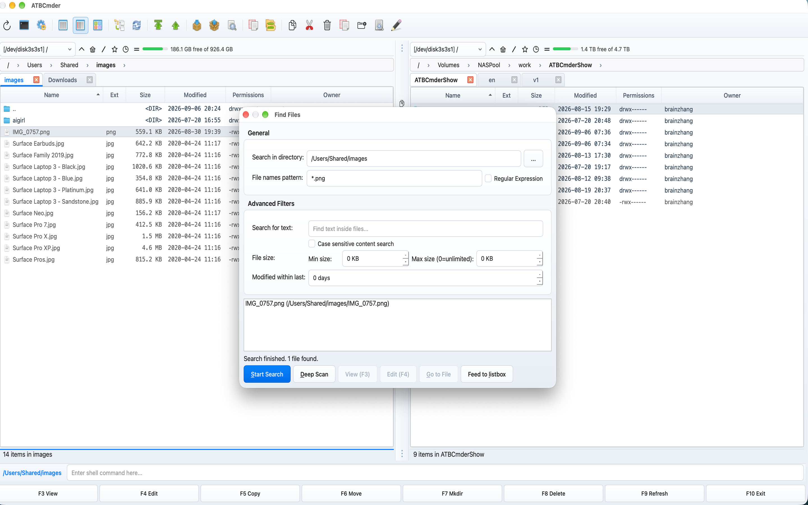

# Глава 5: Инструменты продуктивности и автоматизация

В управлении большими объемами файлов базовые манипуляции с файлами — копирование, перемещение и удаление отдельных элементов — это только начало. Профессиональные инженеры, системные администраторы, создатели контента и аналитики данных часто сталкиваются со сложными операционными задачами: реструктуризация тысяч цифровых активов с непоследовательными именами, изоляция тонких регрессий кода между параллельными ветвями выпуска, поддержка синхронизированных зеркал в сетевых массивах хранения, поиск глубоко спрятанных файлов конфигурации и криптографическая проверка целостности файлов. 

ATBCmder преобразует эти трудоемкие задачи в быстрые, детерминированные операции. Вместо того, чтобы требовать внешних сценариев командной строки, сторонних пакетных утилит или неуклюжих автономных приложений сравнения, ATBCmder интегрирует комплексный пакет автоматизации непосредственно в свое традиционное двухпанельное ядро. Если вам нужно выполнить замену регулярных выражений во всем фотоархиве, выполнить двустороннюю синхронизацию каталогов с хешированием на уровне контента или передать результаты поиска с несколькими фильтрами в виртуальное рабочее пространство, ATBCmder предоставит вам необходимые инструменты с полной эффективностью клавиатуры. 

---

## 1. Визуальное краткое руководство: механизм автоматизации и матрица команд

ATBCmder делит электроинструменты и средства автоматизации на шесть специализированных функциональных областей, которые легко взаимодействуют с двухпанельным интерфейсом: 

```
┌────────────────────────────────────────────────────────────────────────────────────────┐
│                                DUAL FILE PANELS                                        │
│     Left Panel (Source / Directory A)        Right Panel (Target / Directory B)        │
├────────────────────────────────────────────────────────────────────────────────────────┤
│                                          │                                             │
│  [1] Batch Multi-Rename (Ctrl+M)         │  [2] Side-by-Side File Diff (Meta+Shift+F12)│
│      Tokens, RegEx, Counters, Preview    │      Line highlights, Hunk sync, In-place   │
│                                          │                                             │
│  [3] Directory Sync (Shift+F12)          │  [4] Advanced Search (Alt+F7)               │
│      Content/Date compare, Asym mirror   │      Spotlight / Deep scan ➔ Feed to Listbox│
│                                          │                                             │
│  [5] Semantic Command Bar (/)            │  [6] File Utilities & Security              │
│      Spotlight queries, AI intent, NLP   │      Split/Link, Checksum, Wipe (Alt+Del)   │
│                                          │                                             │
├────────────────────────────────────────────────────────────────────────────────────────┤
│  [Feed to Listbox] ➔ Populates virtual panel tab for bulk operations across directories│
└────────────────────────────────────────────────────────────────────────────────────────┘
```

### Памятка по автоматизации двухматричной системы

| Действие | Ярлык macOS | Классический ключ командира | Идентификатор команды | Описание | 
| :--- | :--- | :--- | :--- | :--- | 
| **Пакетное многократное переименование** | `Ctrl+M` / `⌃M` | `Ctrl+M` | `cm_MultiRename` | Открывает диалоговое окно инструмента «Пакетное множественное переименование». | 
| **Параллельная разница в файлах** | `Meta+Shift+F12` / `⌘⇧F12` | `Meta+Shift+F12` | `cm_FileDiff` / `cm_CompareFiles` | Сравнивает два выбранных файла рядом (`Shift+F3` для `cm_CompareContents`). | 
| **Синхронизация каталогов** | `Shift+F12` / `⇧F12` | `Shift+F12` | `cm_SyncDirs` | Сравнивает и синхронизирует каталоги двух панелей. | 
| **Расширенный поиск файлов** | `Alt+F7` / `⌥F7` | `Alt+F7` | `cm_Search` / `cm_FileSearch` | Открывает диалоговое окно поиска с несколькими фильтрами. | 
| **Быстрый поиск Spotlight** | `Ctrl+Shift+F` / `⌃⇧F` | `Ctrl+Shift+F` | *(Меню команд)* | Запускает мгновенный поиск метаданных Spotlight. | 
| **Ввод семантической команды**| `/` | `/` | `cm_VisSemanticCommand` | Активирует встроенную панель команд на естественном языке. | 
| **Разделить большой файл** | `Alt+F6` / `⌥F6` | `Alt+F6` | `cm_FileSpliter` / `cm_Split` | Разбивает большой файл на пронумерованные фрагменты. | 
| **Объединить разделенные файлы** | Меню: Файлы ➔ Объединить файлы | — | `cm_FileLinker` / `cm_Combine` | Собирает фрагменты `.001`, `.002` в один файл. | 
| **Вычислить контрольную сумму** | `Ctrl+X` / `⌃X` | `Ctrl+X` | `cm_CheckSumCalc` / `cm_CalculateChecksum` | Вычисляет хеши MD5, SHA-1, SHA-256 или SHA-512. | 
| **Проверка файла контрольной суммы** | Меню инструментов | — | `cm_CheckSumVerify` / `cm_VerifyChecksum` | Проверяет файлы на соответствие `.md5`, `.sha256` или `.sfv`. | 
| **Безопасное удаление (Уничтожить)** | `Alt+Delete` / `⌥⌫` | `Alt+Delete` | `cm_Wipe` | Безопасно перезаписывает и удаляет файлы. | 
| **Запустить системный терминал** | `Ctrl+J` / `⌃J` | `Ctrl+J` | `cm_RunTerm` | Создает терминал macOS по текущему пути к панели. | 

---

## 2. Инструмент пакетного множественного переименования (`Ctrl+M` / `⌃M` / `cm_MultiRename`)

Переименование десятков или сотен файлов вручную утомительно и чревато ошибками. **Инструмент пакетного множественного переименования** (`cm_MultiRename`, сопоставленный с `fmultirename.pas` в классической архитектуре) позволяет определять гибкие шаблоны именования, применять счетчики динамических последовательностей, выполнять преобразования регистра и выполнять мощные правила поиска и замены регулярных выражений (RegEx) с гарантиями визуальной безопасности в реальном времени. 

 
*Рис. 5.1. Инструмент пакетного множественного переименования с функциями предварительного просмотра строк, масками токенов, параметрами числового счетчика и обнаружением дубликатов.*

### 2.1 Рабочий процесс многократного переименования

1. **Выбрать файлы**. На активной панели файлов выберите файлы или каталоги, которые вы хотите переименовать, используя `Space`, `Insert` или выбор подстановочного знака (`+`). Если ничего не выбрано, используется элемент под курсором. 
2. **Инструмент запуска**: нажмите **`Ctrl+M`** (`⌃M`) или выберите **Файлы ➔ Инструмент многократного переименования...** в строке меню. 
3. **Настройка шаблонов и правил**. Введите маски имени файла/расширения, установите параметры счетчика или определите строки поиска и замены. 
4. **Просмотр в реальном времени**: таблица из трех столбцов (`Old Name`, `New Name`, `Directory`) обновляется мгновенно при каждом нажатии клавиши. 
5. **Выполнить**: нажмите **Начать переименование** (или нажмите `Enter`). ATBCmder выполняет переименование атомарно и обновляет панели файлов. 

---

### 2.2 Токены шаблонов и разделение диапазона

ATBCmder использует интуитивно понятные токены в квадратных скобках для ссылки на части метаданных исходного файла: 

| Токен | Описание | Пример ввода | Результирующее значение | 
| :--- | :--- | :--- | :--- | 
| **`[N]`** | Исходное имя файла без расширения | `report_2026.pdf` | `report_2026` | 
| **`[E]`** | Исходное расширение файла (без точки) | `archive.tar.gz` | `gz` | 
| **`[C]`** | Последовательный числовой счетчик | *(Файл 3 в списке)* | `003` (зависит от настройки цифр) | 
| **`[Y]`** | 4-значный Год изменения файла | `2026-09-06` | `2026` | 
| **`[M]`** | 2-значный Месяц изменения файла | `September` | `09` | 
| **`[D]`** | 2-значный день изменения файла | `6th` | `06` | 
| **`[h]`** | 2-значный час (24-часовой формат) | `14:30:15` | `14` | 
| **`[m]`** | 2-значная минута | `14:30:15` | `30` | 
| **`[s]`** | 2-значный второй | `14:30:15` | `15` |

#### Срез диапазона символов (`[Na-b]` / `[Ea-b]`)

Вы можете извлечь определенные диапазоны символов из исходного имени или расширения, используя срез индекса на основе 1: 

- **`[N1-4]`**: извлекает первые 4 символа имени. Для `Document_Final.txt` это дает `Docu`. 
- **`[N5-]`**: извлекается от 5-го символа до конца имени. Для `DSC_0982.jpg` это дает `0982`. 
- **`[N-5]`**: извлекает до 5-го символа. 
- **`[E1-2]`**: извлекает первые 2 символа расширения. Для `archive.html` это дает `ht`. 

---

### 2.3 Элементы управления счетчиком и числовые последовательности

Группа **Настройки счетчика** обеспечивает детальный контроль над числовой индексацией: 

- **Начало с**: начальное целое число для последовательности счетчика (по умолчанию: `1`). 
- **Шаг**: значение приращения, добавляемое для каждого последующего файла (по умолчанию: `1`). Установка Step на `2` генерирует `1, 3, 5, 7...`. 
- **Цифры**: ширина заполнения нулями (диапазон: от `1` до `10`). Установка для цифры значения `3` форматирует числа как `001`, `002`, `003`. Установка для цифры значения `1` отключает ведущие нули (`1`, `2`, `3`). 

---

### 2.4 Поиск и замена и регулярные выражения

Группа **Найти и заменить** позволяет заменять текст во всех выбранных элементах: 

- **Найти**: целевая подстрока или шаблон регулярного выражения. 
- **Заменить на**: строка замены. Если RegEx включен, обратные ссылки (`$1`, `$2` или `\1`, `\2`) относятся к группам захвата. 
- **Использовать регулярные выражения (регулярное выражение)**: включает анализ регулярных выражений стандартной библиотеки Python. 
- **С учетом регистра**: если флажок снят, при сопоставлении игнорируется регистр символов (например, совпадение одновременно с `.JPG` и `.jpg`).

#### Мощные примеры замены регулярных выражений

```
Example 1: Strip unwanted tracking or release tags from filenames
Input File:      Album_Artist_-_Track_01_[Lossless_24bit_96kHz].flac
Find Pattern:    \s*\[.*?\]
Replace with:    (leave empty)
Output File:     Album_Artist_-_Track_01.flac

Example 2: Reorder dates from YYYY-MM-DD to DD-MM-YYYY
Input File:      Invoice_2026-09-06_Acme.pdf
Find Pattern:    (\d{4})-(\d{2})-(\d{2})
Replace with:    $3-$2-$1
Output File:     Invoice_06-09-2026_Acme.pdf

Example 3: Convert spaces and underscores to standardized hyphens
Input File:      my new blog post_draft.md
Find Pattern:    [ _]+
Replace with:    -
Output File:     my-new-blog-post-draft.md
```
 

---

### 2.5 Режимы преобразования регистров

ATBCmder обеспечивает мгновенную нормализацию регистра, не требуя сложных шаблонов: 

- **Без изменений**: исходная капитализация сохраняется. 
- **нижний регистр**: преобразует все имя файла и расширение в нижний регистр (`PHOTO_001.JPG` ➔ `photo_001.jpg`). 
- **ВЕРХНИЙ РЕГИСТР**: преобразует все символы в верхний регистр (`readme.txt` ➔ `README.TXT`). 
- **Первая буква заглавная**: начальный символ каждого слова пишется с заглавной буквы (`war and peace.epub` ➔ `War And Peace.epub`). 

---

### 2.6 Сетка предварительного просмотра в реальном времени и защита от столкновений

Переименование сотен файлов без предварительного просмотра может привести к катастрофической перезаписи данных. ATBCmder реализует **безаварийную архитектуру безопасности**: 

1. **Мгновенный предварительный просмотр отладки**: когда вы вводите данные в шаблон или настраиваете поля прокрутки, таблица немедленно вычисляет результирующие имена файлов. 
2. **Обнаружение повторяющихся целей**: ATBCmder сканирует все вычисленные имена выходных файлов в папке назначения. Если два или более файлов разрешаются в одно и то же имя или если имя файла разрешается в пустую строку: 
- Конфликтующие строки сразу выделяются ярким красным цветом (`#FFEBEB` / `#D70000` в светлом режиме, `#4A1515` / `#FF8080` в темном режиме). 
- Кнопка **Начать переименование** автоматически **отключается**. 
- Всплывающая подсказка предупреждает: *"Обнаружены конфликты имен. Устраните дубликаты перед переименованием."* 
3. **Устранение конфликтов**. Как только вы настроите счетчик, шаблон или регулярное выражение, чтобы сделать все имена целевых файлов уникальными, предупреждение исчезнет, а кнопка **Начать переименование** снова станет активной. 

---

### 2.7 Практические пошаговые рецепты

#### Рецепт А. Переименование фотографий с цифровой камеры с использованием временных меток

Преобразуйте загадочные имена камер (`IMG_4092.JPG`, `IMG_4093.JPG`) в хронологически организованные ресурсы: 

1. Выберите файлы фотографий и нажмите **`Ctrl+M`**. 
2. Установите для **Шаблона имени файла** значение: `Photo_[Y][M][D]_[C]`. 
3. Установите для **Шаблона расширения** значение: `[E]`. 
4. Установите для параметра **Цифры** значение `3`, для параметра **Начало с** значение `1`. 
5. Установите для параметра **Преобразование регистра** значение `lowercase`. 
6. Просмотрите результат: `photo_20260906_001.jpg`, `photo_20260906_002.jpg`. 
7. Нажмите `Enter`, чтобы подать заявку.

#### Рецепт Б. Добавление префикса с сохранением имени и расширения

Префикс пакета документов кодом проекта: 

1. Выберите документы и нажмите **`Ctrl+M`**. 
2. В поле **Шаблон имени файла** введите: `PRJ-ALPHA_[N]`. 
3. Оставьте **Шаблон расширения** как `[E]`. 
4. Нажмите **Начать переименование**. 

---

## 3. Параллельная визуальная разница файлов (`Meta+Shift+F12` / `⌘⇧F12` / `cm_FileDiff`)

Обнаружение различий между версиями конфигурации, файлами исходного кода или дампами данных — ежедневная задача для опытных пользователей. ATBCmder включает в себя встроенный параллельный **Визуальный просмотрщик различий файлов** (`DiffViewerDialog`), который устраняет необходимость запуска тяжелых внешних инструментов. 

```
┌────────────────────────────────────────────────────────────────────────────────────────┐
│  Side-by-side Diff: config.py (Left)  vs.  config.py.new (Right)                       │
├────────────────────────────────────────────────────────────────────────────────────────┤
│ [💾 Save Left] [💾 Save Right] | [Copy to Right →] [← Copy to Left] | [Prev] [Next]    │
│ [🔄 Re-compare] | [✔] Ignore whitespace  [ ] Ignore case  [ ] Ignore blank lines       │
├─────────────────────────────────────────────┬──────────────────────────────────────────┤
│ config.py (Left)                            │ config.py.new (Right)                    │
├─────────────────────────────────────────────┼──────────────────────────────────────────┤
│ 12: DEBUG = False                           │ 12: DEBUG = False                        │
│ 13: LOG_LEVEL = "INFO"                      │ 13: LOG_LEVEL = "DEBUG"      [CHANGED]   │
│ 14: PORT = 8080                             │ 14: PORT = 8080                          │
│ 15: # Deprecated database setting           │ 15:                                      │
│ 16: DB_TIMEOUT = 30              [REMOVED]  │ 16: DB_TIMEOUT = 10          [CHANGED]   │
│ 17:                                         │ 17: SSL_ENABLED = True       [ADDED]     │
├─────────────────────────────────────────────┴──────────────────────────────────────────┤
│  Difference 2 of 4  │  Ln 16, Col 1 (Left)  │  Ln 16, Col 1 (Right)                    │
└────────────────────────────────────────────────────────────────────────────────────────┘
```

### 3.1 Запуск сравнения файлов

- **Сравнить два выбранных файла**: на одной панели выберите ровно два файла и нажмите **`Meta+Shift+F12`** (`⌘⇧F12`) или выберите **Команды ➔ Сравнить по содержимому...**. 
- **Сравнить противоположные файлы**: выделите файл на левой панели, выделите соответствующий файл на правой панели и нажмите `cm_CompareContents`. 
- **Поддерживаемые команды**: `cm_CompareContents`, `cm_FileDiff` и `cm_CompareByContent` — все они направляются в механизм параллельного сравнения. 

---

### 3.2 Выделение визуальных различий и цветовая кодировка

Механизм сравнения анализирует текст построчно, используя оптимизированный алгоритм LCS Ханта-Шимански (`TextDiffer`), разделяя различия на фрагменты с цветовой кодировкой: 

| Тип различия | Светлая тема | Выделение темной темы | Описание | 
| :--- | :--- | :--- | :--- | 
| **Добавлены строки** | Мягкий изумруд (`#e6ffed`) | Темно-зеленый лес (`#234b2d`) | Строки присутствуют только в правом файле. | 
| **Удалены строки** | Мягкий малиновый (`#ffeef0`) | Темно-малиновый красный (`#552328`) | Строки присутствуют в левом файле, но отсутствуют в правом. | 
| **Измененные строки** | Мягкий янтарь (`#fff5b1`) | Темно-янтарное золото (`#50461e`) | Линии изменены между левой и правой версиями. | 
| **Активный красавчик** | Яркий контрастный оттенок | Яркий контрастный оттенок | Блок различий, в данный момент сфокусированный курсором. | 

На каждой панели есть специальный левый разделитель (`LineNumberArea`), в котором отображаются номера строк с индексом 1, синхронизированные с позициями различий. 

---

### 3.3 Синхронизированная прокрутка и безопасность повторного входа

При сравнении длинных исходных файлов, содержащих тысячи строк, навигация по коду требует четкой координации: 

- Прокрутка вертикальной или горизонтальной полосы прокрутки любого редактора мгновенно изменяет противоположный редактор на такое же смещение в пикселях. 
- ATBCmder реализует внутреннюю **блокировку повторного входа** (`_syncing_vscroll`, `_syncing_hscroll`), предотвращающую циклы обратной связи по событиям, зависания или дрейф курсора. 

---

### 3.4 Навигация по кускам и двунаправленное слияние

Перемещаться по различиям можно без использования мыши: 

- **Следующее отличие**: нажмите **`Alt+Down`** / `⌥↓` (или `Ctrl+Down`). 
- **Предыдущее отличие**: нажмите **`Alt+Up`** / `⌥↑` (или `Ctrl+Up`). 
- **Перейти к фрагменту**: нажатие на любую выделенную строку на любой панели автоматически делает этот фрагмент активным.

#### Двунаправленное слияние (совместимость Vimdiff `dp` / `do`)

Объедините различия между файлами одним нажатием клавиши: 

- **Копировать слева направо (`→`)**: нажмите **`Alt+Right`** / `⌥→` (или `Ctrl+Alt+Right` или Vimdiff `dp` через **`Alt+P`**). Активный фрагмент в левом редакторе заменяет соответствующий раздел в правом редакторе. 
- **Копировать справа налево (`←`)**: нажмите **`Alt+Left`** / `⌥←` (или `Ctrl+Alt+Left` или Vimdiff `do` через **`Alt+O`**). Активный фрагмент в правом редакторе заменяет соответствующий раздел в левом редакторе. 

---

### 3.5 Редактирование на месте и атомарное сохранение

В отличие от программ просмотра различий, которые рассматривают текст как доступный только для чтения, обе панели в ATBCmder являются полнофункциональными редакторами кода: 

- Введите, вставьте или удалите текст непосредственно в любом редакторе. 
- Всякий раз, когда ручное редактирование изменяет строки, нажмите **`F5`** (или `Ctrl+R`), чтобы повторно запустить расчет разницы в обновленных буферах. 
- Сохранить левый файл: нажмите **💾 Сохранить левый** (или нажмите `Cmd+S` / `Ctrl+S`, пока левый редактор находится в фокусе). 
- Сохранить правый файл: нажмите **💾 Сохранить право** (или нажмите `Cmd+S` / `Ctrl+S`, пока правый редактор находится в фокусе). 

---

### 3.6 Параметры сравнительной фильтрации

Панель инструментов просмотра различий позволяет изолировать подлинные логические изменения от шума форматирования: 

- **Игнорировать пробелы (`_cb_ws`)**: игнорируются изменения табуляции, конечные пробелы и отступы пробелов и табуляции. 
- **Игнорировать регистр (`_cb_case`)**: выполняет сравнение символов без учета регистра. 
- **Игнорировать пустые строки (`_cb_blank`)**: сворачивает добавление и удаление пустых строк, уделяя особое внимание существенным изменениям кода. 

---

### 3.7 Обнаружение различий в двоичных файлах

Если какой-либо файл, выбранный для сравнения, содержит нулевые байты или двоичные подписи MIME (например, изображения, исполняемые файлы, скомпилированные архивы), ATBCmder автоматически вызывает `BinaryDiffer`: 

- Отображает размеры файлов и криптографические хеши SHA-256 рядом. 
- Четко указывает, являются ли двоичные файлы байтовыми или расходящимися. 

---

## 4. Синхронизация каталогов (`Shift+F12` / `⇧F12` / `cm_SyncDirs`)

Синхронизация деревьев каталогов на локальных дисках, дисках резервного копирования и в сетевых хранилищах является краеугольным камнем надежных систем. **Синхронизатор каталогов** (`SyncDirsDialog`, сопоставленный с `fsyncdirsdlg.pas`) ATBCmder сравнивает целые иерархии папок, определяет точные направленные операции и предварительно просматривает каждое копирование и удаление файла, прежде чем прикасаться к вашему хранилищу. 

 
*Рис. 5.2. Диалоговое окно синхронизации каталогов, отображающее статус рекурсивного сравнения, стрелки направленной синхронизации и элементы управления асимметричным зеркалированием.*

### 4.1 Запуск синхронизации каталогов

1. Откройте **Исходный каталог** на левой панели и **Целевой каталог** на правой панели. 
2. Нажмите **`Shift+F12`** (`⇧F12`) или выберите **Команды ➔ Синхронизировать каталоги...**. 
3. Появится диалоговое окно «Синхронизировать каталоги» с обоими путями, предварительно заполненными в карточках заголовков. 

---

### 4.2 Методы сравнения и точность

Перед синхронизацией настройте критерии сравнения на карточке **Синхронизировать настройки**: 

| Настройка | По умолчанию | Описание | 
| :--- | :--- | :--- | 
| **Сравнить подкаталоги** | `Enabled` | Рекурсивно обходит все вложенные каталоги. | 
| **Сравнить по содержанию** | `Disabled` | Считывает и проверяет байты файла напрямую, используя `filecmp.cmp`. Гарантирует 100% точность для файлов с идентичными временными метками, но с измененными данными. | 
| **Игнорировать дату** | `Disabled` | Сравнивает файлы исключительно по размеру в байтах, игнорируя временные метки модификации файловой системы. | 
| **Допуск на временные метки FAT/SMB** | `2.0 sec` | Автоматически учитывает разрешение меток времени FAT/FAT32/exFAT с точностью до 2 секунд, предотвращая ложные флаги несоответствия при синхронизации между macOS и внешними дисками. | 

---

### 4.3 Анализ направления и индикаторы состояния

Нажмите **Сравнить**, чтобы запустить неблокирующую рабочую программу фонового сравнения (`SyncCompareWorker`). Таблица сравнения заполняется строками направления с цветовой кодировкой: 

```
┌────────────────────────────────────────────────────────────────────────────────────────┐
│ Relative Path             │ Operation │ Reason            │ Details                    │
├───────────────────────────┼───────────┼───────────────────┼────────────────────────────┤
│ assets/banner.png         │    ->     │ Left is newer     │ 2026-09-06 > 2026-08-15    │
│ docs/manual.pdf           │    ->     │ Right missing     │ File exists only on left   │
│ config/settings.json      │    <-     │ Right is newer    │ 2026-09-06 > 2026-09-01    │
│ vendor/legacy_lib.so      │    <-     │ Left missing      │ File exists only on right  │
│ build/cache.db            │    !=     │ Conflict          │ Timestamp / type mismatch  │
└────────────────────────────────────────────────────────────────────────────────────────┘
```
 

- **`->` (слева направо)**: файл слева является более новым или существует только слева. Действие по умолчанию: скопировать вправо. 
- **`<-` (справа налево)**: файл справа является более новым или существует только справа. Действие по умолчанию: скопировать влево (в двустороннем режиме). 
- **`=` (Равно)**: файлы совпадают по размеру, метке времени/содержимому. Отфильтровано из списка активной синхронизации для экономии времени. 
- **`!=` (Конфликт)**: несовместимый конфликт каталога и файла или неразрешимый конфликт временных меток. Пропускается во время автоматической массовой синхронизации в целях безопасности данных. 

---

### 4.4. Асимметричное зеркалирование и двусторонняя симметричная синхронизация

ATBCmder поддерживает две принципиально разные философии синхронизации:

#### 1. Двусторонняя симметричная синхронизация (по умолчанию)

- **Цель**: привести оба каталога в соответствие, чтобы в обоих были самые последние версии каждого файла. 
- **Действие**: файлы с пометкой __ATB_INL_0000__ копируются слева ➔ справа. Файлы с пометкой `<-` копируются вправо ➔ влево. 
- **Безопасность**: файлы с обеих сторон не удаляются.

#### 2. Асимметричное зеркалирование (флажок `Asymmetric` включен)

- **Цель**: сделать правый каталог точной и идентичной копией левого каталога. 
- **Действие**: файлы с пометкой __ATB_INL_0000__ копируются слева ➔ справа. Файлы справа, которые *не* существуют слева (`<- Right missing on Left`), **навсегда удаляются из правого каталога**. 
- **Сценарий использования**: создание первичных зеркал резервного копирования на внешних резервных дисках или общих ресурсах NAS. 

---

### 4.5 Журнал безопасности и аудита перед выполнением

- **Проверка перед синхронизацией**: внимательно просмотрите заполненную таблицу. Вы можете увидеть точные относительные пути и рабочие причины каждого перевода. 
- **Остановить управление**: если необходимо прервать большое задание сравнения или синхронизации, нажмите **Стоп**. Фоновый поток безопасно завершает работу, не оставляя поврежденных частичных файлов. 
- **Автоматический журнал аудита**: каждое копирование, перезапись и удаление, выполненные во время синхронизации, записываются во внутренний **Журнал операций** ATBCmder (`LogCategory.COPY_MOVE_LINK`, `LogCategory.DELETE`). 

---

## 5. Расширенный поиск файлов и подача в список (`Alt+F7` / `⌥F7` / `cm_Search`)

Поиск определенных файлов во вложенных структурах папок является распространенным узким местом администрирования. ATBCmder предоставляет высокопроизводительный **Расширенный диалог поиска файлов** (`SearchDialog`, сопоставленный с `fFindDlg.pas`), сочетающий в себе встроенную индексацию macOS Spotlight с механизмом глубокого сканирования файловой системы и незаменимую возможность **Подача в список**. 

 
*Рис. 5.3. Диалоговое окно «Расширенный поиск файлов» с параметрами нескольких фильтров, элементами управления глубоким сканированием и кнопкой «Подать в список».*

### 5.1 Запуск поиска

- Нажмите **`Alt+F7`** (`⌥F7`) на любой панели или выберите **Команды ➔ Поиск файлов...**. 
- Откроется диалоговое окно поиска с полем **Искать в каталоге**, предварительно заполненным текущим путем к активной панели. 

---

### 5.2 Серверы двойного поиска: Spotlight против глубокого сканирования

ATBCmder имеет две специализированные поисковые системы: 

```
                  ┌───────────────────────────────────────────────┐
                  │          Search Query Triggered               │
                  └───────────────────────┬───────────────────────┘
                                          │
                  ┌───────────────────────┴───────────────────────┐
                  ▼                                               ▼
    ┌───────────────────────────┐                   ┌───────────────────────────┐
    │  Spotlight Engine         │                   │  Deep Scan Engine         │
    │  (SpotlightSearchWorker)  │                   │  (DeepScanWorker)         │
    ├───────────────────────────┤                   ├───────────────────────────┤
    │ • Uses macOS mdfind       │                   │ • Recursive os.scandir    │
    │ • Millisecond results     │                   │ • Scans unindexed drives  │
    │ • APFS metadata indexed   │                   │ • Network shares (SMB/NFS)│
    │ • Standard local storage  │                   │ • Raw text/regex parsing  │
    └───────────────────────────┘                   └───────────────────────────┘
```
 

1. **Поисковая система Spotlight (`SpotlightSearchWorker`)**: в macOS нажатие **Начать поиск** (или нажатие `Enter`) использует системный индекс метаданных Spotlight (`mdfind`). Он находит тысячи совпадающих путей в гигабайтах хранилища за доли секунды. 
2. **Механизм глубокого сканирования (`DeepScanWorker`)**: нажатие **Глубокого сканирования** обходит индексацию системы и выполняет прямой рекурсивный обход файловой системы. Это важно при поиске: 
- Внешние USB-накопители или SD-карты, на которых отключено индексирование Spotlight. 
- Общие сетевые ресурсы (SMB, SFTP, FTP, WebDAV). 
— Каталоги сборки разработчика исключены через `.metadata_never_index`. 

---

### 5.3 Критерии поиска с несколькими фильтрами

Точная настройка поисковых запросов с использованием детальных параметров в группах **Общие** и **Расширенные фильтры**: 

- **Шаблон имен файлов**: 
- *Подстановочные знаки*: стандартные подстановочные знаки оболочки, такие как `*.py`, `invoice_2026_*.pdf` или `test_??.go`. 
- *Подстроки*: ввод `draft` позволяет найти любой файл или папку, содержащую «черновик». 
- *Регулярные выражения*: установите флажок **Регулярное выражение**, чтобы включить полный синтаксис регулярных выражений (например, `^v\d+\.\d+\.(json|xml)$`). 
- **Поиск текста (поиск в файле)**: 
- Ищет строковое содержимое UTF-8 и ASCII внутри текста, исходного кода и файлов документов. 
– Проверьте **Поиск контента с учетом регистра**, чтобы узнать точное совпадение регистра. 

- **Диапазон размеров файлов**: 
– Установите **Минимальный размер** и **Максимальный размер** в килобайтах (`KB`). Установка максимального размера на `0` оставляет верхние границы неограниченными. 

- **Диапазон дат**: 
– Укажите **Изменено за последние N дней** (например, `7` дней, чтобы найти работу за прошедшую неделю). 

---

### 5.4 Быстрая проверка результатов поиска

При просмотре результатов поиска в списке результатов: 

- **Просмотр файла (`F3`)**: мгновенно открывает выделенный результат поиска в универсальном списке. 
- **Редактировать файл (`F4`)**: открывает файл непосредственно во встроенном текстовом редакторе. 
- **Перейти к файлу (`Enter` / `Go to File`)**: закрывает диалоговое окно поиска, перемещает главную панель к родительскому каталогу файла и помещает курсор непосредственно на файл. 

---

### 5.5 Возможности «Подачи в список»

Наиболее преобразующей функцией традиционных файловых менеджеров является **Подача в список**: 

```
┌────────────────────────────────────────────────────────────────────────────────────────┐
│ SEARCH RESULTS (Flat Virtual Panel Tab)             OPPOSING PANEL (Destination)       │
│ [Search: *.log modified < 30 days]                 /Volumes/ArchiveStorage/Logs        │
├──────────────────────────────────────────────┬───┬─────────────────────────────────────┤
│  Name                         Size   Folder  │   │  Name                        Size   │
│  ▸ [..]                              --:--   │   │  ▸ [..]                             │
│  ✔ app_server.log            14 MB   /var/log│ C │  ▸ archive_2025             <DIR>   │
│  ✔ auth_audit.log             2 MB   /etc/sec│ O │                                     │
│  ✔ worker_3.log              88 KB   /opt/app│ P │                                     │
│  ● access.log               512 KB   /var/log│ Y │                                     │
├──────────────────────────────────────────────┴───┴─────────────────────────────────────┤
│  [3 items selected] ➔ Press F5 to copy all matching files into destination folder!     │
└────────────────────────────────────────────────────────────────────────────────────────┘
```
 

1. В диалоговом окне поиска, как только соответствующие файлы будут найдены, нажмите кнопку **Поместить в список**. 
2. ATBCmder закрывает диалоговое окно и открывает новую **вкладку результатов виртуального поиска** на активной панели. 
3. Вместо перехода к каждой папке по отдельности все соответствующие файлы из каталогов разной глубины отображаются в одной плоской таблице. 
4. **Выполнить любое действие командира**: 
- Выберите все или определенные элементы (`Space`, `+`, `Cmd+A`). 
- **Скопируйте (`F5`)** или **Переместите (`F6`)** соответствующие файлы из разных папок в одну целевую папку на противоположной панели. 
- **Пакетное множественное переименование (`Ctrl+M`)** одновременно всех совпадающих результатов поиска. 
- **Надежное удаление (`F8` или `Alt+Delete`)** ненужных временных файлов во всей иерархии проекта одним движением. 

---

## 6. Интеграция Spotlight и система семантических команд (`/` и `Ctrl+Shift+F`)

Современные рабочие процессы требуют гибких запросов, выходящих за рамки жестких диалоговых окон с фильтрами. ATBCmder интегрирует индексирование macOS Spotlight напрямую с **Системой семантических команд естественного языка**, доступной из встроенной панели команд в нижней части главного окна. 

 
*Рисунок 5.4: Семантическая панель команд, анализирующая запрос на естественном языке с помощью живых шаблонов автозаполнения.* 

 
*Рисунок 5.5: Результаты семантического поиска отображаются непосредственно внутри активной панели.*

### 6.1 Активация семантических команд

- **Нажмите `/`**: на панели активного файла просто нажмите косую черту (`/`). ATBCmder немедленно фокусирует нижнюю панель редактирования команд, предварительно заполняя ее `/`. 
- **Ярлык поиска Spotlight**: нажмите **`Ctrl+Shift+F`** (`⌃⇧F`) или `Cmd+Shift+F`, чтобы открыть интерфейс семантического фильтра. 
- **Закрыть**: нажмите `Escape`, чтобы очистить фильтр и восстановить стандартный список каталогов. 

---

### 6.2 Области действия: локальные (__ATB_INL_0000__) и глобальные (`//`)

ATBCmder различает фильтрацию на уровне папок и общесистемное обнаружение, используя соглашения о префиксах:

#### 1. Область локального каталога (`/<query>`)

Запросы, начинающиеся с одинарной косой черты, работают исключительно с каталогом, открытым в активной панели (и его подпапками, если указаны рекурсивные параметры): 

- `/larger than 10MB`: в текущей папке отображаются только файлы размером более 10 Мегабайт. 
- `/> 50MB`: числовое сокращение для фильтрации по размеру. 
- `/today modified pdf`: фильтры для PDF-документов, измененных за последние 24 часа. 
- `/images`: отображает только растровые и векторные форматы изображений. 
- `/source code`: показывает Python, C++, Rust, Go, JavaScript и другие исходные файлы. 
- `/contains "API_KEY"`: фильтры для текстовых файлов, содержащих строку «API_KEY». 
- `/hide *.log`: скрывает файлы журналов на активном дисплее.

#### 2. Глобальная область действия системы (`//<query>`)

Запросы, начинающиеся с двойной косой черты, запрашивают весь системный том macOS через Spotlight: 

- `//today modified pdf`: находит все PDF-документы, измененные сегодня, на вашем Mac. 
- `//larger than 1GB dmg`: находит все установщики образов дисков, размер которых превышает 1 ГБ. 
- `//code contains "OAuth2Handler"`: находит все общесистемные исходные файлы, содержащие «OAuth2Handler». 

---

### 6.3 Семантические запросы с помощью искусственного интеллекта (`?` или `/?`)

При настройке с использованием поставщика искусственного интеллекта (Google Gemini, OpenAI, Anthropic Claude или местного Ollama) в *Настройки ➔ Семантический фильтр*: 

- Префикс запроса с __ATB_INL_0000__ или `/?` направляет инструкцию естественного языка через анализатор LLM. 
- Пример: `/? find all final invoices sent to client Acme last quarter over $5000` 
- ИИ преобразует сложные человеческие фразы в точные атрибуты метаданных Spotlight (`kMDItemFSSize`, `kMDItemContentModificationDate`, `kMDItemTextContent`), мгновенно отображая соответствующие файлы на панели. 

---

### 6.4 Автозаполнение, каталог (`/help`) и история (`/history`)

Когда вы вводите в поле редактирования семантической команды: 

- **Всплывающее окно интерактивного завершения**: раскрывающееся меню (`SemanticCompletionPopup`) отображает контекстные предложения шаблонов на основе встроенного каталога (`semantic-command-templates.xml`). Используйте стрелки `Down` и `Up`, чтобы выделить предложения, и нажмите `Tab` или `Enter`, чтобы принять их. 
- **Каталог справки (`/help`)**: при вводе `/help` открывается **Диалоговое окно справки по семантическим командам**, в котором перечислены десятки примеров с возможностью поиска по категориям (размер, дата, тип файла, содержимое, теги). Двойной щелчок по любой записи вставляет ее в командную строку. 
- **История команд (`/history`)**: при вводе `/history` отображается хронологический журнал всех ранее выполненных семантических команд с метками времени выполнения, что позволяет мгновенно вызвать их. 

---

### 6.5 Модификаторы мгновенных действий панели

Семантическая панель команд также позволяет управлять выбором панелей и сортировкой, не касаясь мыши: 

| Семантическая команда | Действие выполнено | 
| :--- | :--- | 
| `/select all visible` | Выбирает все элементы, отображаемые в данный момент после фильтрации. | 
| `/clear selection` | Отменяет выбор всех элементов на панели. | 
| `/invert selection` | Инвертирует текущее состояние выбора файла. | 
| `/select images` | Добавляет все файлы изображений на панели к текущему выделению. | 
| `/sort by size descending` | Сортирует таблицу файлов по размеру от большего к меньшему. | 
| `/reset sort` | Восстанавливает алфавитную сортировку имен по умолчанию. | 
| `/group by date` | Группирует файлы динамически по скобкам даты изменения. | 
| `/clear filter` | Удаляет все активные семантические фильтры и восстанавливает полный список каталогов. | 

---

## 7. Основные файловые утилиты и целостность данных

Помимо поиска и пакетного переименования, ATBCmder объединяет набор основных системных утилит, предназначенных для управления большими файлами, аудита безопасности и проверки криптографической целостности.

### 7.1 Разделитель больших файлов (`cm_FileSpliter` / `cm_Split` / `Alt+F6`)

При передаче больших образов дисков, видеоархивов или контейнеров виртуальных машин между устройствами хранения данных с ограничениями размера файловой системы (например, ограничением FAT32 в 4 ГБ) или ограничениями на вложения электронной почты **File Splitter** (`SplitWorker`) делит файлы на пронумерованные последовательные сегменты: 

1. Выберите большой файл на активной панели. 
2. Выберите **Файлы ➔ Разделить файл...** (или нажмите `cm_Split`). 
3. Выберите каталог назначения (по умолчанию — противоположная панель). 
4. Выберите стандартную предустановку размера фрагмента или введите собственный размер в байтах: 
- **1,44 МБ**: устаревшая дискета 3,5 дюйма. 
- **700 МБ**: стандартная емкость CD-R. 
- **4,7 ГБ**: емкость однослойного диска DVD-R. 
- **100 МБ**: стандартный фрагмент для загрузки. 
- **Пользовательский размер**: определяемое пользователем пороговое значение в байтах, КБ, МБ или ГБ. 
5. Нажмите **ОК**. ATBCmder разделяет исходный файл в фоновом рабочем потоке, создавая файлы последовательностей `.001`, `.002`, `.003`.... 

---

### 7.2 Компоновщик и объединитель файлов (`cm_FileLinker` / `cm_Combine` / `Alt+F7`)

Сборка разделенных фрагментов файла в исходный неповрежденный файл выполняется без проблем: 

1. На панели файлов выделите **первую разделенную часть** (должна заканчиваться расширением `.001`). 
2. Выберите **Файлы ➔ Объединить файлы...** (или активируйте `cm_Combine`). 
3. ATBCmder автоматически определяет все последовательные части (`.001`, `.002`, `.003`... до `.999`). 
4. Выберите имя выходного файла и целевой каталог. 
5. Нажмите **ОК**. Фоновый рабочий процесс (`CombineWorker`) последовательно объединяет части обратно в точную побайтовую двоичную копию. 

---

### 7.3 Криптографические контрольные суммы и проверка (`cm_CheckSumCalc`, `cm_CheckSumVerify`)

Проверка того, что загруженные файлы, образы дисков или резервные копии архивов не были повреждены или подделаны, жизненно важна для целостности данных. ATBCmder включает встроенный **Калькулятор и средство проверки контрольной суммы** (`ChecksumDialog`). 

```
┌────────────────────────────────────────────────────────────────────────────────────────┐
│ Checksum Calculator                                                                    │
├────────────────────────────────────────────────────────────────────────────────────────┤
│ Hash Algorithm: [ SHA256           ▾]                                                  │
├────────────────────────────────────────────────────────────────────────────────────────┤
│ 3a491d90bc1f42013149db82a890471b67823f40d12e8424e6a00a120894fe83  arch_linux.iso       │
│ 8f14e45fceea167a5a36dedd4bea25431846b9a898492efd727402c3ef30b65a  rootfs.tar.gz        │
│ e3b0c44298fc1c149afbf4c8996fb92427ae41e4649b934ca495991b7852b855  empty_manifest.txt   │
├────────────────────────────────────────────────────────────────────────────────────────┤
│  [Progress: 100%] Hashing completed.                                                   │
│  [Calculate]    [Stop]    [💾 Save to File]                                 [Close]    │
└────────────────────────────────────────────────────────────────────────────────────────┘
```

#### Вычисление хешей (`cm_CheckSumCalc` / `Ctrl+X`)

1. Выберите один или несколько файлов на панели. 
2. Выберите **Файлы ➔ Вычислить контрольную сумму...** (или нажмите `Ctrl+X`). 
3. Выберите желаемый алгоритм: **MD5**, **SHA1**, **SHA256** или **SHA512**. 
4. Нажмите **Рассчитать**. Рабочий поток передает файлы через фрагменты размером 64 КБ в фоновом режиме, не блокируя интерфейс. 
5. Нажмите **Сохранить в файл**, чтобы экспортировать хэши в стандартный файл манифеста `.sha256` или `.md5`.

#### Проверка манифестов контрольной суммы (`cm_CheckSumVerify`)

1. Выберите **Файлы ➔ Проверить контрольные суммы...**. 
2. Выберите существующий файл контрольной суммы (`.sha256`, `.md5`, `.sha1`, `.sha512` или `.sfv`). 
3. ATBCmder автоматически анализирует манифест, находит соответствующие файлы в том же каталоге, пересчитывает хэши на диске и представляет отчет о состоянии с цветовой кодировкой: 
- **`OK`**: файл идеально соответствует контрольной сумме. 
- **`FAILED`**: обнаружено повреждение или модификация данных! 
- **`MISSING`**: указанный файл не найден в каталоге. 

---

### 7.4 Безопасное уничтожение/удаление файлов (`cm_Wipe` / `Alt+Delete` / `⌥⌫`)

Стандартное удаление файлов просто отключает связи между записями каталога, оставляя нетронутыми блоки необработанных данных на диске, откуда их могут извлечь утилиты восстановления. При работе с конфиденциальными ключами, учетными данными или собственным исходным кодом используйте **Безопасное удаление/очистка** (`cm_Wipe`): 

1. Выберите конфиденциальные файлы или каталоги. 
2. Нажмите **`Alt+Delete`** (`⌥⌫`) или выберите **Файл ➔ Безопасное удаление (очистка)...**. 
3. Подтвердите запрос предупреждения системы безопасности. 
4. **Последовательность криптографического многопроходного уничтожения (`wipe_path`)**: 
- **Пропуск 1**: перезаписывает всю длину файла в байтах криптографически безопасными псевдослучайными байтами (`os.urandom`). 
- **Шаг 2**: весь файл перезаписывается нулевыми байтами (`\x00`). 
- **Проход 3**: перезапись новыми случайными байтами. 
- **Аппаратная синхронизация**: вызывает `os.fsync()` базового файлового дескриптора, чтобы заставить операционную систему и кэш контроллера хранилища записать данные на физический носитель. 
- **Усечение и отсоединение**: усекает файл до 0 байт перед вызовом `os.unlink()`. 
- **Очистка каталогов**: рекурсивно стирает все содержащиеся в них файлы перед отключением родительских каталогов. 

---

### 7.5 Встроенный системный терминал (`Ctrl+J` / `⌃J` / `cm_RunTerm`)

Хотя ATBCmder превосходно справляется с графическими рабочими процессами с двумя панелями, доступ к оболочке часто требуется для компиляции, веток git или управления сервером: 

- Нажмите **`Ctrl+J`** (`⌃J`) или выберите **Команды ➔ Запустить терминал**. 
- ATBCmder немедленно открывает macOS **Терминал.app** (или настроенный вами эмулятор терминала по умолчанию) с рабочим каталогом, инициализированным по точному пути, открытому на активной панели. 
- Не требуется вводить `cd /Users/...` или перетаскивать папки в окна терминала. 

---

## 8. ⚡ Советы профессионалов и глубокая автоматизация рабочих процессов

### 8.1 Рецепт: Рекурсивный поиск ➔ Подача в список ➔ Многократное переименование

**Цель**: удалить номера версий из сотен файлов ресурсов, разбросанных по 50 вложенным подпапкам. 

1. Откройте корень проекта на левой панели. 
2. Нажмите **`Alt+F7`**, чтобы открыть поиск. 
3. В поле «Имена файлов» введите: `*_v[0-9]*.png`. 
4. Нажмите **Начать поиск**. Когда появятся подходящие объекты, нажмите **Передать в список**. 
5. На появившейся вкладке виртуальной панели выберите все файлы с **`Cmd+A`**. 
6. Нажмите **`Ctrl+M`**, чтобы запустить инструмент многократного переименования. 
7. В поле **Найти** введите: `_v\d+`. Включите **Использовать регулярные выражения (Regex)**. 
8. Оставьте поле **Заменить на** пустым. 
9. Убедитесь, что в таблице предварительного просмотра отображаются чистые имена файлов без суффиксов версий. 
10. Нажмите **Начать переименование**. ATBCmder мгновенно переименовывает каждый файл во всех 50 подпапках! 

---

### 8.2 Рецепт: безопасное зеркалирование резервных копий в облаке и NAS с асимметричной синхронизацией

**Цель**: поддерживать идентичное внешнее зеркало ваших документов на внешнем SSD или SMB NAS-накопителе без накопления дубликатов файлов. 

1. Откройте локальный `~/Documents` на левой панели. 
2. Откройте `/Volumes/BackupSSD/Documents` на правой панели. 
3. Нажмите **`Shift+F12`** (`cm_SyncDirs`). 
4. В настройках убедитесь, что установлен флажок **Сравнить подкаталоги**. 
5. Установите флажок **Асимметричный (Удалить целевой объект, если он отсутствует в исходном коде)**. 
6. Нажмите **Сравнить**. 
7. Просмотрите список: 
- Синие/зеленые стрелки (`->`) обозначают файлы, которые будут скопированы в резервную копию. 
- Красные удаления (`<-`) обозначают устаревшие файлы на резервном диске, которые вы впоследствии удалили локально. 
8. Нажмите **Синхронизировать**. Ваш резервный диск теперь является зеркалом вашей локальной папки. 

---

### 8.3 Рецепт: криминалистический хэш-проявление перед долгосрочным хранением архива

**Цель**: рассчитать и сохранить криптографические контрольные суммы для проекта объемом несколько терабайт, прежде чем перемещать его в холодное ленточное или облачное хранилище. 

1. Перейдите в каталог, содержащий результаты вашего проекта. 
2. Выберите все элементы (`Cmd+A`) и нажмите **`Ctrl+X`** (`cm_CheckSumCalc`). 
3. Установите для алгоритма значение **SHA256**. 
4. Нажмите **Рассчитать**. Потоковый хэш-работник обрабатывает файлы в фоновом режиме. 
5. Нажмите **Сохранить в файл** и назовите его `MANIFEST-SHA256.txt`. 
6. Всякий раз, когда вы получаете файлы спустя годы, просто выберите `MANIFEST-SHA256.txt` и запустите **Проверить контрольные суммы**, чтобы гарантировать отсутствие порчи битов или скрытое повреждение. 

---

### 8.4 Рецепт: объединение семантической фильтрации естественного языка с представлением плоских ветвей (`Cmd+B`)

**Цель**: найти и упорядочить все медиафайлы в сложной глубокой структуре каталогов, не открывая диалоговые окна поиска. 

1. Выделите папку проекта верхнего уровня и нажмите **`Cmd+B`** (`cm_FlatView`), чтобы объединить все содержимое подпапки в один список. 
2. Нажмите **`/`**, чтобы сфокусировать семантическую панель команд. 
3. Введите: `/images larger than 5MB`. 
4. Сведенный список мгновенно изолирует изображения с высоким разрешением во всех вложенных каталогах. 
5. Нажмите `/select all visible`, затем нажмите **`F5`**, чтобы скопировать их все в организованный целевой каталог на противоположной панели. 
6. Нажмите `Cmd+B` еще раз, чтобы восстановить обычный просмотр иерархического дерева. 

---

## 9. Безопасность, производительность и системные оповещения

> [!ВНИМАНИЕ] 
> **Необратимость асимметричной синхронизации каталогов** 
> Включение параметра **Асимметричный** в синхронизации каталогов (`Shift+F12`) приводит к тому, что файлы в целевом каталоге, которых нет в исходном, будут **безвозвратно удалены**. Всегда выполняйте визуальную проверку таблицы предварительного просмотра сравнения, прежде чем нажимать **Синхронизировать**. 

> [!ВНИМАНИЕ] 
> **Подстановки регулярных выражений с множественным переименованием** 
> При выполнении замен в регулярных выражениях с обратными ссылками (`$1`, `$2`) убедитесь, что номера групп захвата соответствуют круглым скобкам в вашем шаблоне. Прежде чем нажать **Начать переименование**, проверьте свой шаблон на строках таблицы предварительного просмотра в реальном времени. Если появляются повторяющиеся имена целевых объектов, ATBCmder блокирует выполнение, чтобы защитить вас от потери данных. 

> [!ВАЖНО] 
> **Ограничения на уничтожение твердотельных накопителей** 
> Утилита Secure Wipe (`cm_Wipe` / `Alt+Delete`) перезаписывает данные файла с помощью нескольких проходов случайных и нулевых байтов с последующим вызовом `fsync`. Однако современные твердотельные накопители (SSD) используют алгоритмы выравнивания износа и избыточное выделение ресурсов на уровне контроллера, которые могут перенаправлять запись на альтернативные флэш-блоки. Для надежной утилизации твердотельных накопителей объедините уничтожение файлов с полнодисковым шифрованием macOS FileVault. 

> [!ПРИМЕЧАНИЕ] 
> **Доступность Spotlight на сетевых томах и томах FAT** 
> Быстрый поиск Spotlight (`Ctrl+Shift+F`) основан на индексах метаданных macOS, которые по умолчанию активны на внутренних дисках APFS. Удаленные сетевые подключения (SMB, SFTP) и внешние диски exFAT могут не индексироваться Spotlight. Если запрос Spotlight не возвращает результатов на внешнем диске, используйте **Глубокое сканирование** (`Alt+F7`) или включите рекурсивное сканирование каталогов. 

> [!СОВЕТ] 
> **Совместимость функциональных клавиш Apple (`Fn`)** 
> На клавиатурах Apple Magic Keyboards и MacBook функциональные клавиши (`F1`-`F12`) по умолчанию отвечают за аппаратные действия (яркость, громкость). Чтобы нажать `Shift+F12` или `Alt+F7`, удерживайте клавишу **`Fn`**: `Fn+Shift+F12`, `Fn+Alt+F7`. Альтернативно включите ** «Использовать клавиши F1, F2 и т. д. как стандартные функциональные клавиши»** в macOS *Системные настройки ➔ Клавиатура ➔ Сочетания клавиш ➔ Функциональные клавиши*. 

---

## 10. Справочная таблица основной двухматричной клавиатуры

| Функциональная область | Описание действия | Ярлык macOS | Классический ключ командира | Идентификатор команды | 
| :--- | :--- | :--- | :--- | :--- | 
| **Множественное переименование** | Запустить инструмент пакетного множественного переименования | `Ctrl+M` / `⌃M` | `Ctrl+M` | `cm_MultiRename` | 
| **Множественное переименование** | Выполнить/Начать переименование | `Enter` / `⏎` | `Enter` | — | 
| **Множественное переименование** | Отменить/Закрыть инструмент | `Esc` | `Esc` | — | 
| **Разница в файлах** | Сравнить выбранные файлы/панели | `Meta+Shift+F12` / `⌘⇧F12` | `Meta+Shift+F12` | `cm_FileDiff` / `cm_CompareFiles` | 
| **Разница в файлах** | Перейти к следующему отличию | `Alt+Down` / `⌥↓` | `Ctrl+Down` | — | 
| **Разница в файлах** | Перейти к предыдущей разнице | `Alt+Up` / `⌥↑` | `Ctrl+Up` | — | 
| **Разница в файлах** | Копировать кусок слева направо | `Alt+Right` / `⌥→` / `Alt+P` | `Ctrl+Alt+Right` | — | 
| **Разница в файлах** | Копировать кусок справа налево | `Alt+Left` / `⌥←` / `Alt+O` | `Ctrl+Alt+Left` | — | 
| **Разница в файлах** | Сохранить изменения в специализированном редакторе | `Cmd+S` / `⌘S` | `Ctrl+S` | — | 
| **Разница в файлах** | Пересчитать разницы | `F5` / `Fn+F5` | `Ctrl+R` | — | 
| **Синхронизация каталогов**| Открыть каталоги синхронизации | `Shift+F12` / `⇧F12` | `Shift+F12` | `cm_SyncDirs` | 
| **Синхронизация каталогов**| Начать сравнение каталогов | `Alt+C` / `⌥C` | `Enter` | — | 
| **Синхронизация каталогов**| Отменить сравнение/синхронизацию | Нажмите `Stop` | `Esc` | — | 
| **Поиск файлов** | Открыть диалоговое окно расширенного поиска | `Alt+F7` / `⌥F7` | `Alt+F7` | `cm_Search` / `cm_FileSearch` | 
| **Поиск файлов** | Посмотреть результат в Universal Lister | `F3` / `Fn+F3` | `F3` | `cm_View` | 
| **Поиск файлов** | Редактировать результат в текстовом редакторе | `F4` / `Fn+F4` | `F4` | `cm_Edit` | 
| **Поиск файлов** | Перейти к файлу на активной панели | `Enter` / `⏎` | `Enter` | — | 
| **Поиск файлов** | Подача результатов на виртуальную панель | Нажмите `Feed to listbox` | Нажмите `Feed to listbox` | — *(Диалоговое действие)* | 
| **В центре внимания и НЛП**| Быстрый поиск в центре внимания | `Ctrl+Shift+F` / `⌃⇧F` | `Ctrl+Shift+F` | *(Меню команд)* | 
| **В центре внимания и НЛП**| Активировать семантическую панель команд | `/` | `/` | `cm_VisSemanticCommand` | 
| **В центре внимания и НЛП**| Отключить семантический фильтр | `Esc` | `Esc` | — | 
| **Файловые утилиты**| Разделить файл на куски | `Alt+F6` / `⌥F6` | `Alt+F6` | `cm_FileSpliter` / `cm_Split` | 
| **Файловые утилиты**| Объединить пронумерованные разделенные фрагменты | Меню: Файлы ➔ Объединить файлы | — | `cm_FileLinker` / `cm_Combine` | 
| **Файловые утилиты**| Вычислить контрольную сумму (хеш) | `Ctrl+X` / `⌃X` | `Ctrl+X` | `cm_CheckSumCalc` / `cm_CalculateChecksum` | 
| **Файловые утилиты**| Проверка файла манифеста контрольной суммы | Меню инструментов | Меню инструментов | `cm_CheckSumVerify` / `cm_VerifyChecksum` | 
| **Файловые утилиты**| Безопасное многопроходное удаление (Уничтожение) | `Alt+Delete` / `⌥⌫` | `Alt+Delete` | `cm_Wipe` | 
| **Файловые утилиты**| Открыть собственный терминал macOS | `Ctrl+J` / `⌃J` | `Ctrl+J` | `cm_RunTerm` |

--- 

<div align="center"> 
<p>Готовы подключаться к удаленным серверам и исследовать виртуальные архивы?</p> 
<p><strong><a href="network_and_vfs.md">Перейдите к главе 6: Виртуальные файловые системы и сеть &rarr;</a></strong></p> 
</div>