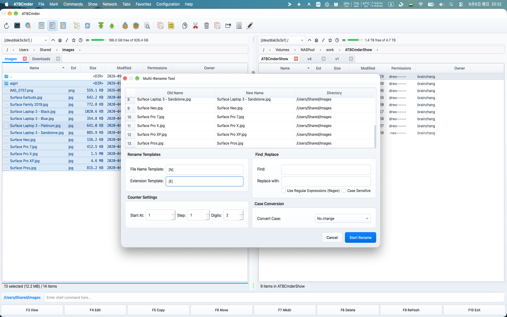

# 第 9 章：實戰場景解決方案與疑難排解

雖然正統雙面板檔案管理器以極速和高效純鍵盤操作聞名，但在實際日常工作中，我們往往需要將多個子系統協同配合——例如雙向資料夾同步、正則批次重新命名、遠端虛擬檔案系統、免解壓編輯壓縮包以及遞迴檢索等。此外，在現代 macOS 系統中執行，你也會遇到沙盒安全許可權邊界、功能鍵排程以及跨驅動器資料遷移等特有場景。

本章分為兩大核心部分：

1. **高頻實戰場景指南（5 套經典方案）**：提供從頭到尾的完整步驟演練、介面效果圖、快速鍵指引與高手進階技巧。
2. **疑難排錯指南與常見問題 (FAQ)**：深入解析許可權報錯、自動重新整理機制、配置安全重置、Mac 鍵盤 Fn 功能鍵對映以及跨卷檔案轉移機制。

---

## 1. 快速上手：日常任務與排錯速查矩陣

下表將常見檔案管理目標與排錯需求直接對映到 ATBCmder 的內建工具與快速鍵：

```
┌────────────────────────────────────────────────────────────────────────────────────────┐
│                              日常任務與排錯快速指引路由表                              │
├────────────────────────────────────────────────────────────────────────────────────────┤
│                                                                                        │
│  任務目標                                  推薦工具 / 方法          快捷鍵             │
│  ──────────────────────────────────────    ───────────────────────  ─────────────────  │
│  [1] 將本機專案鏡像備份到外接硬碟或 NAS    資料夾同步工具          Shift+F12 (⇧F12)    │
│  [2] 按拍攝日期和序號批次整理照片檔案      多重批次重新命名工具    Ctrl+M (⌃M)         │
│  [3] 掛載家庭/辦公 NAS、網盤或雲端伺服器   網路連線管理器          cm_ManageConnections│
│  [4] 直接修改 .zip 壓縮檔內的設定檔        壓縮檔 VFS + 編輯器     Enter ➔ F4 ➔ 儲存   │
│  [5] 揪出並清理多層深處的大檔案釋放磁碟    扁平展開檢視 / 進階搜尋 Cmd+B (⌘B) / Alt+F7 │
│                                                                                        │
│  常見故障 / 異常現象                       根本原因                解決方案            │
│  ──────────────────────────────────────    ──────────────────────  ──────────────────  │
│  提示 "Operation not permitted" 權限錯誤   macOS 沙盒 / TCC 攔截   cm_GrantAccess      │
│  外接隨身硬碟或隨身碟未自動重新整理        FAT/exFAT 缺少內核事件 調小輪詢間隔或重整   │
│  想大膽測試設定但擔心破壞原有正常設定      生產 XML 隔離保護       執行測試指令碼      │
│  按 F1–F12 變成了調節螢幕亮度和音量        macOS 預設佔用了媒體鍵 配合 Fn 鍵或系統設定 │
│  跨磁碟移動超大檔案耗时明顯變長            跨卷物理「複製+校驗+刪除」 確保目標空間充裕 │
│                                                                                        │
└────────────────────────────────────────────────────────────────────────────────────────┘
```

### 雙矩陣快速鍵速查表

| 操作 / 診斷專案 | macOS 原生快速鍵 | 經典 Commander 鍵位 | 命令標識 (Command ID) | 核心用途 |
| :--- | :--- | :--- | :--- | :--- |
| **資料夾同步** | `Shift+F12` / `⇧F12` | `Shift+F12` | `cm_SyncDirs` | 深度對比並雙向同步雙面板資料夾內容 |
| **多重批次重新命名** | `Ctrl+M` / `⌃M` | `Ctrl+M` | `cm_MultiRename` | 使用動態佔位符、計數器與正規表示式批次改名 |
| **網路連線管理** | 選單: 網路 | `cm_ManageConnections` | `cm_ManageConnections` | 管理儲存的 SMB、SFTP、WebDAV、FTP 連線配置 |
| **快速網路連線** | 選單: 網路 | `cm_NetworkConnect` | `cm_NetworkConnect` | 快速臨時連線遠端伺服器，無需事先儲存 |
| **壓縮包原地編輯** | `F4` / `Fn+F4` | `F4` | `cm_Edit` | 直接編輯包內檔案，儲存時自動安全回寫重打包 |
| **扁平展開檢視** | `Cmd+B` / `⌘B` | `Ctrl+B` | `cm_FlatView` | 遞迴穿透所有子資料夾，單列表平鋪顯示全部檔案 |
| **多功能高階搜尋** | `Alt+F7` / `⌥F7` | `Alt+F7` | `cm_Search` | 多條件搜尋，並支援將結果一鍵“匯出到面板列表” |
| **授予磁碟讀寫許可權** | 選單: 檔案 / 幫助 | — | `cm_GrantFilesystemAccess` | 啟動 macOS 沙盒許可權指引助手 |
| **手動重新整理面板** | `Cmd+R` / `⌘R` 或 `Ctrl+R` | `Ctrl+R` | `cm_Refresh` | 強制繞過快取，重新自物理磁碟讀取目錄 |
| **開啟系統終端機** | `Ctrl+J` / `⌃J` | `Ctrl+J` | `cm_RunTerm` | 在當前面板所在路徑下喚起 macOS 終端機視窗 |
| **計算資料夾佔用大小** | `Alt+Shift+Enter` (`Space`) | `Alt+Shift+Enter` (`Space`) | `cm_CountDirContent` / `cm_CalculateSpace` | 實時遞迴統計游標處或全部資料夾實際位元組容量（空格鍵為當前資料夾，`Ctrl+L` 為累計）。 |
| **安全粉碎抹除** | `Alt+Delete` / `⌥⌫` | `Alt+Delete` | `cm_Wipe` | 多輪覆寫物理資料塊，徹底永久抹除機密檔案 |

---

## 2. 五大經典實戰演練

### 2.1 實戰演練 1：比較並同步兩個備份資料夾

**場景目標**：確保行動硬碟或區域網 NAS 中的備份資料夾與你本地工作目錄完全一致。在真正執行同步前，直觀檢查每一處新增、修改或刪除的檔案，避免意外覆蓋。

  
*圖 9.1：資料夾同步視窗，直觀展示左右雙欄檔案對比、流向箭頭與單向映像檔備份選項。*

#### 詳細操作步驟

1. **在左右雙面板中就位**：
   - 在**左面板**中，進入本地的主工作目錄（如 `~/Documents/Projects/AppAlpha`）。
   - 按 **`Tab`** 鍵切換至**右面板**，進入對應的外部備份目錄（如 `/Volumes/BackupDrive/Backups/AppAlpha`）。
2. **啟動資料夾同步工具**：
   - 按下 **`Shift+F12`**（`⇧F12`），或點選選單欄 **命令 ➔ 資料夾同步...**。
   - 同步視窗隨即開啟，左側路徑與右側路徑已自動填入。
3. **設定對比規則**：
   - 勾選 **子目錄 (Compare Subdirectories)**，遞迴比對所有深層巢狀資料夾。
   - 勾選 **按內容比較 (Compare by Content)**：如果你需要 100% 絕對嚴謹的資料校驗（透過逐位元組雜湊比對），而不僅僅依據檔案修改時間和檔案體積。
   - 勾選 **FAT / SMB 時間容差 (2.0 秒)**：如果目標盤是 FAT32、exFAT 或 SMB 區域網共享，該選項能避免因檔案系統 2 秒時間精度舍入帶來的虛假不匹配。
4. **開始深度比對**：
   - 點選 **比對 (Compare)**（或按快速鍵 `Alt+C` / `⌥C`）。
   - ATBCmder 會在後臺多執行緒對比，並在表格中清晰標出每個檔案的流向：
     * **`->` (從左向右)**：本地檔案較新，或右側尚不存在。同步操作：複製到右側。
     * **`<-` (從右向左)**：備份盤檔案較新，或左側尚不存在。同步操作：複製到左側。
     * **`=` (完全一致)**：檔案大小與時間戳/內容完全相同，預設自動隱藏不干擾視線。
     * **`!=` (發生衝突)**：存在檔案型別衝突或時間異常，需要手動確認。
5. **選擇同步策略**：
   - **雙向對稱同步（預設）**：按方向箭頭雙向更新較新檔案，雙方均不刪除任何檔案。適合兩臺電腦之間的協同工作目錄同步。
   - **非對稱映像檔備份 (勾選 `Asymmetric`)**：以左側為唯一基準，強制右側備份完全一致。**注意：右側存在但左側已刪除的檔案，將被永久刪除！**
6. **確認並執行**：
   - 檢視底部的彙總資料：如 *“從左到右: 42 個檔案 (128.4 MB) | 從右到左: 0 個檔案 | 刪除: 3 個檔案”*。
   - 點選 **同步 (Synchronize)**。系統會在後臺佇列無阻塞傳輸，介面實時顯示速率與剩餘時間。

> [!CAUTION]
> **非對稱映像檔 (Asymmetric) 刪除風險警告**：
> 勾選 **Asymmetric (非對稱映像檔)** 後，任何在源目錄中不存在的檔案都會在目標盤中被**徹底刪除**，且不經過廢紙簍！點選“同步”前，請務必核對檔案清單中的紅色刪除項。

> [!TIP]
> **⚡ 進階技巧：針對音影片與程式碼庫的“按內容比較”**：
> 備份影片源素材或 Git 倉庫時，有時候檔案體積雖然相同，但內部個別資料塊可能已有微調。勾選“按內容比較”雖然需要多耗費一點硬碟讀取時間，但能提供 100% 可信的可靠性。

---

### 2.2 實戰演練 2：批次重新命名數碼相機照片（日期+遞增序號）

**場景目標**：將相機中雜亂無章的原始照片檔名（如 `DSC_0012.JPG`、`DSC_0013.JPG`、`IMG_4901.CR3`）快速批次規整為統一規範的名稱（如 `2026-09-06_度假_001.jpg`），自帶三位補零序號，並在執行前實時預覽。

  
*圖 9.2：多重批次重新命名視窗，具備實時更名預覽列表、動態後設資料佔位符、計數器與重名預警。*

#### 詳細操作步驟

1. **選中需要改名的照片**：
   - 在面板中進入照片所在目錄。
   - 按 **`Cmd+A`**（`⌘A`）全選，或者按下鍵盤 **`+`** 鍵輸入萬用字元規則（如 `*.jpg;*.jpeg;*.cr3;*.arw`）進行定向多選。
2. **開啟批次重新命名工具**：
   - 按下快速鍵 **`Ctrl+M`**（`⌃M`）或 **`Cmd+M`**（`⌘M`），也可以點選選單欄 **檔案 ➔ 批次重新命名...**。
3. **輸入檔名命名模板 (Mask)**：
   - 在 **檔名掩碼 (File Name Mask)** 輸入框中鍵入：
     ```
     [Y]-[M]-[D]_度假_[C]
     ```

   - **佔位符解析**：
     * `[Y]`：檔案最後修改日期的 4 位年份（如 `2026`）。
     * `[M]`：2 位月份（如 `09`）。
     * `[D]`：2 位日期（如 `06`）。
     * `度假`：自定義的固定描述文字。
     * `[C]`：遞增的計數器序號。
4. **設定遞增計數器引數**：
   - 在 **計數器設定 (Counter Settings)** 區域調整：
     * **起始值 (Start at)**：`1`
     * **步進 (Step)**：`1`
     * **位數 (Digits)**：`3`（系統會自動在前補零，格式為 `001`, `002`, `003` ... 直至 `999`）。
5. **去除相機原有字首（可選）**：
   - 如果你想保留相機原有的數字編號，但剔除 `DSC_` 字首：
     * 方式一：設定模板為 `[YMD]_[N5-]`（`[N5-]` 代表從原檔名的第 5 個字元提取到末尾）。
     * 方式二：在下方 **查詢與替換 (Search & Replace)** 區域輸入：
       - **查詢**：`DSC_`
       - **替換**：`照片_`
       - 若要處理複雜的正則匹配（如 `^IMG_(\d+)`），勾選 **正則 (RegEx)**。
6. **實時檢查預覽表格**：
   - 三列表格（原檔名、新檔名、所在目錄）會隨著你的每一次按鍵**毫秒級實時更新**。
   - 觀察 **狀態 (Status)** 列：若規則導致多個檔案更名後同名，ATBCmder 會自動標紅並顯示衝突警告，嚴防誤覆蓋。
7. **一鍵執行更名**：
   - 按 **`Enter`** 鍵或點選 **開始重新命名**。磁碟上的檔案即刻瞬間完成重新命名，面板列表自動重新整理。

> [!NOTE]
> **副檔名保護機制**：
> 預設情況下，**副檔名掩碼 (Extension Mask)** 始終為 `[E]`，代表嚴格保持原檔案字尾不變。除非你確有修改字尾的需求，否則請勿刪除 `[E]`。

> [!TIP]
> **⚡ 進階技巧：在外部文字編輯器中自由改名 (`⌘I`)**：
> 如果你拿到的是一份不對稱的客戶姓名列表或歌曲名，在批次重新命名視窗中按下 **`Cmd+I`**（`⌘I`），ATBCmder 會將目標更名列表整體匯出並在你的外部編輯器（如 VS Code 或備忘錄）中開啟。編輯儲存後，修改結果會自動倒灌回預覽表格中！

---

### 2.3 實戰演練 3：透過 SMB、SFTP 或 WebDAV 連線家庭/辦公 NAS 與伺服器

**場景目標**：將辦公室的群暉/威聯通 NAS、雲端的 Linux 伺服器或私有 Nextcloud 網盤掛載為雙面板的一個分頁，像操作本地資料夾一樣自由複製、移動和編輯檔案。

  
*圖 9.3：配置 SMB、SFTP、WebDAV 等遠端網路連線並安全儲存到系統鑰匙串。*

#### 詳細操作步驟

1. **開啟網路連線管理器**：
   - 點選選單欄 **網路 ➔ 管理網路連線...**，或執行命令 **`cm_ManageConnections`**。
2. **新建一個連線配置**：
   - 點選左下角的 **`➕ 新建 (New)`** 按鈕。
   - 在 **連線標籤 (Label)** 中填入便於識別的名稱（如 `群暉辦公 NAS` 或 `AWS 生產伺服器`）。
3. **配置協議與伺服器資訊**：
   - **協議 (Protocol)**：在下拉選單中選擇：
     * **SMB/CIFS**：埠 `445`（適用於群暉、威聯通、Windows 共享、TrueNAS）。
     * **SFTP (SSH 檔案傳輸)**：埠 `22`（適用於 Linux/UNIX 雲主機）。
     * **WebDAV / WebDAVS**：埠 `80` 或 `443`（適用於堅果雲、Nextcloud、ownCloud）。
     * **FTP / FTPS**：埠 `21` 或 `990`（傳統檔案伺服器）。
   - **主機地址 (Host)**：輸入區域網 IP 或公網域名（如 `192.168.1.100` 或 `nas.local`）。
   - **埠 (Port)**：選擇協議後會自動填入標準埠，若有自定義對映可直接修改。
   - **使用者名稱 (Username)**：輸入你的遠端登入賬戶名。
   - **初始遠端路徑 (Remote Path)**：連線成功後預設進入的目錄（如 `/volume1/Media` 或 `/var/www`）。
4. **安全憑據儲存**：
   - 輸入訪問密碼或金鑰。
   - 勾選 **儲存密碼到 macOS 鑰匙串 (Keychain)**。
   - **安全承諾**：ATBCmder 絕不會在明文 XML 配置檔案中儲存你的密碼。所有網路憑據均透過系統底層加密 API 寫入 Apple 鑰匙串保護。
5. **連通性測試**：
   - 點選 **`🔍 測試連線`** 按鈕。
   - 系統會在後臺建立連線握手、驗證證書與登入憑據，並在不關閉當前視窗的情況下即時反饋測試結果。
6. **一鍵連線瀏覽**：
   - 點選 **`🔗 連線`** 按鈕（或按 `Enter` 鍵）。
   - 當前啟用面板會立刻新建一個分頁，路徑以統一虛擬檔案系統 URI 展示：
     ```
     vfs://smb://admin@192.168.1.100/volume1/Media/
     vfs://sftp://ubuntu@aws.prod.internal:22/var/www/html/
     ```

   - 此時你可以按 `F5` 複製、`F6` 移動、`F8` 刪除，與操作本地硬碟完全無異。
7. **下次極速重連**：
   - 所有儲存過的遠端連線均會自動列入選單欄 **網路 ➔ 已儲存連線** 中，隨時點選即可瞬間掛載。

> [!TIP]
> **⚡ 進階技巧：SFTP 私鑰免密登入**：
> 針對雲伺服器，強烈推薦使用 SSH 金鑰認證。在 SFTP 配置中將密碼留空，直接在“私鑰檔案”中選擇本地的 `~/.ssh/id_ed25519` 或 `id_rsa`。若私鑰帶有 passphrase 密碼短語，系統首次詢問後即可自動存入鑰匙串。

---

### 2.4 實戰演練 4：無需解壓，直接在壓縮包內原地修改檔案

**場景目標**：需要微調一個幾 GB 大小的 `.zip`、`.tar.gz` 或 `.7z` 壓縮包內部的某張配置表（如 `nginx.conf` 或 `settings.json`），免去“漫長解壓整包 ➔ 修改檔案 ➔ 重新壓縮”的繁瑣流程。

  
*圖 9.4：透過統一 `vfs://` 架構免解壓原地瀏覽與編輯壓縮包內容。*

#### 詳細操作步驟

1. **像進入普通資料夾一樣進入壓縮包**：
   - 在面板中將游標移動到壓縮檔案上（如 `production_backup.zip`）。
   - 按下 **`Enter`** 鍵（或雙擊滑鼠）。
   - ATBCmder 會直接進入該壓縮包內部，位址列顯示為虛擬檔案系統路徑：
     ```
     vfs:///Users/brain/Downloads/production_backup.zip/
     ```

2. **找到你要修改的目標檔案**：
   - 壓縮包內的多層子目錄結構完全保留，直接導航找到要改的檔案（如 `conf/app_settings.json`）。
3. **在內建文字編輯器中開啟**：
   - 按下 **`F4`**（`Fn+F4` / `cm_Edit`）。
   - ATBCmder 會以流式讀取將該檔案安全載入記憶體臨時緩衝區，並在語法高亮編輯器中開啟。
4. **編輯並儲存**：
   - 修改所需引數後，按下 **`Cmd+S`**（`⌘S`）儲存。
5. **全自動回寫重打包 (`RepackWorker`)**：
   - 當你儲存或關閉編輯器時，ATBCmder 的後臺回寫引擎 (`RepackWorker`) 會自動觸發：
     1. 檢測檔案是否有真實變更；
     2. 自動檢查壓縮包整體體積，防止誤操作耗費過大算力；
     3. 自動在後臺把修改後的檔案重新壓縮並替換回原壓縮包內部；
     4. 採用原子安全寫入機制，即使中途斷電也不會損壞原壓縮包；
     5. 面板自動重新整理，顯示更新後的檔案大小與修改時間。

> [!IMPORTANT]
> **超大壓縮包防卡頓保護門限 (`ArchiveRepackWarningMB`)**：
> 在一個超過 10 GB 的巨型壓縮包裡更新一個 2 KB 的小文字，底層需要重寫整個大型歸檔檔案。為了避免意外導致高負荷磁碟讀寫，當壓縮包體積超過設定閾值（預設 500 MB）時，ATBCmder 會貼心彈出警示彈窗徵求同意。你可以在 **配置 ➔ 選項 ➔ 壓縮工具** 中按需調整此閾值。

---

### 2.5 實戰演練 5：查詢並清理多層子目錄中的超大冗餘檔案

**場景目標**：迅速找出深層隱藏的廢棄 4K 影片、龐大的 `node_modules` 快取、虛擬機器映像檔或舊安裝包，釋放寶貴的 Mac 固態硬碟空間。

  
*圖 9.5：扁平展開檢視 (`Cmd+B`) 將多層深層資料夾內的所有檔案平鋪顯示，支援直接按體積倒序排列。*

#### 方案 A：一鍵“扁平展開檢視” (`Cmd+B`)

1. **定位到要排查的父級資料夾**：
   - 選中待檢查的專案根目錄（如 `~/Projects` 或 `~/Downloads`）。
2. **開啟扁平檢視 (Branch View / Flat View)**：
   - 按下 **`Cmd+B`**（`⌘B`）或 **`Ctrl+B`**（`cm_FlatView`），或點選選單欄 **顯示 ➔ 扁平檢視**。
   - ATBCmder 會瞬間穿透並遞迴掃描所有子目錄，將裡面的成千上萬個檔案**平鋪在一張單列表格**中展示，直接抹平資料夾層級。
3. **按檔案大小倒序排列**：
   - 點選表頭的 **大小 (Size)** 列，或按下快速鍵 **`Ctrl+F6`**（`cm_SortBySize`）。
   - 列表中體積最大的巨大 ISO 映像檔、大型資料庫備份和影片檔案立刻置頂排列在最上方。
4. **統計資料夾佔用空間**：
   - 若在普通目錄檢視下，只需把游標停在任意資料夾上按一下 **空格鍵 (`Space`)**，系統就會遞迴統計該目錄的總容量並顯示在體積列中。
5. **退出扁平檢視**：
   - 再次按下 **`Cmd+B`**，或在頂部的 `..` 返回上一級，即可瞬間恢復原有的正常樹形目錄狀態。

---

#### 方案 B：使用“多功能搜尋” (`Alt+F7`) + “匯出到面板列表”

  
*圖 9.6：高階搜尋視窗設定體積閾值，並透過“匯出到面板列表 (Feed to Listbox)”批次處理。*

1. **啟動多功能搜尋**：
   - 按下快速鍵 **`Alt+F7`**（`⌥F7`）或點選選單欄 **命令 ➔ 搜尋...**。
2. **設定體積過濾條件**：
   - 在 **搜尋路徑 (Search in)** 中確認掃描根目錄。
   - 勾選 **大小 (Size)** 過濾器：選擇 **`>`**（大於），數值填入 `100`，單位選擇 **`MB`**（或 `1` **`GB`**）。
   - 在 **檔名掩碼** 中可指定型別（如 `*.dmg;*.iso;*.mp4;*.mov;*.zip`），若想排查所有大檔案直接保持 `*`。
   - 在 **高階** 選項卡中，還可以限定只檢索“最近 180 天未修改過的陳舊檔案”。
3. **執行搜尋**：
   - 點選 **開始搜尋**。
4. **一鍵“匯出到面板列表 (Feed to Listbox)”**：
   - 待結果掃描完畢後，點選右下角的 **匯出到面板列表 (Feed to Listbox)** 按鈕。
   - **魔法發生**：所有符合條件的搜尋結果會被整體裝載進當前面板的一個**專用虛擬分頁**中！
   - 與普通的模態彈窗不同，這個虛擬分頁與常規檔案面板毫無區別：你可以按 `Cmd+Q` 開啟對側快速預覽逐一審查，也可以按 `F3` 呼叫檢視器開啟。
5. **批次核對與安全刪除**：
   - 確認無誤後按 `F8`（`cm_Delete`）一鍵移入廢紙簍。
   - 如果是要永久銷燬機密檔案，可按下 **`Alt+Delete`**（`cm_Wipe`）執行多輪安全物理粉碎抹除。

> [!TIP]
> **⚡ 進階技巧：利用雜湊校驗排查重複大檔案**：
> 如果懷疑幾個大體積檔案是完全一樣的重複副本，在面板中選中它們按 **`Ctrl+X`**（`cm_CheckSumCalc`），選擇 **SHA-256** 計算。若計算出來的雜湊值完全一致，則證明 100% 互為重複副本，可以放心刪除冗餘檔案。

---

## 3. 疑難排錯指南與常見問答 (FAQs)

### 3.1 提示 "Operation Not Permitted" 或許可權被拒絕

#### 根本原因
在現代 macOS（macOS 12 Monterey 至 macOS 15 Sequoia）中，Apple 推行了極其嚴格的 **App 沙盒機制 (App Sandbox)** 與 **TCC 隱私授權體系**。執行在沙盒內的應用程式若未獲得使用者明確授權，是無法自由讀寫外部驅動器、系統關鍵路徑乃至使用者個人目錄（如 `~/Documents`、`~/Downloads`、`~/Desktop`）的。

若未完成授權，你可能會遇到：

- 進行復制/移動/刪除時彈出錯誤：`"Error: Operation not permitted"`；
- 在 ATBCmder 中看到的資料夾空空如也，但在Finder (Finder) 中卻能看到內容；
- 無法訪問 `/Volumes` 下掛載的行動硬碟或外接 U 盤。

#### 解決方案 1：使用內建沙盒授權助手 (`cm_GrantFilesystemAccess`)

ATBCmder 內建了專門用於與 macOS 註冊永久安全書籤的授權嚮導：

```
┌─────────────────────────────────────────────────────────────┐
│  授予磁碟讀寫權限 (Grant Filesystem Access)             [x] │
├─────────────────────────────────────────────────────────────┤
│  為了確保系統安全，本版本 ATBCmder 運行在 macOS 沙盒環境中。│
│  需要您的明確授權才能正常讀寫系統關鍵資料夾與外接磁碟。     │
│                                                             │
│  [  授予根目錄讀寫權限 (/)  ]                               │
│                                                             │
│  [  授予外接磁碟讀寫權限 (/Volumes)  ]                      │
│                                                             │
│  [  打開系統完整磁碟取用權限設定…  ]                        │
│                                                             │
│  根目錄授權是 App 沙盒正常工作的基本要求。                  │
│  完整磁碟取用權限是針對受保護使用者資料的額外系統設定。     │
│                                                   [ 完成 ]  │
└─────────────────────────────────────────────────────────────┘
```

1. 點選選單欄 **檔案**（或 **幫助**）➔ **授予磁碟讀寫許可權…**，或執行命令 **`cm_GrantFilesystemAccess`**。
2. 點選 **“授予根目錄讀寫許可權 (/)”**。
   * 系統會彈出原生的 Apple 資料夾選取面板，預設指向 `Macintosh HD` 根目錄，直接點選 **授權 (Grant Access)** 或 **開啟**。
   * **工作原理**：授權根目錄 `/` 會由系統生成一個根級安全書籤並儲存在本地。由於子目錄會自動繼承父級許可權，授權 `/` 後，個人目錄（`~/Documents`、`~/Downloads`、`/Applications`、`~/Projects` 等）便全部永久解鎖。
3. 點選 **“授予外接磁碟讀寫許可權 (/Volumes)”**。
   * 在彈出的對話方塊中確認授權 `/Volumes` 目錄。
   * 如此一來，未來插入的所有 USB 快閃記憶體盤、移動固態硬碟、SD 卡、DMG 映像檔以及 SMB 區域網掛載點均可暢通訪問。
4. 點選 **完成**。授權資訊永久儲存，重啟軟體依然有效。

#### 解決方案 2：在 macOS 系統設定中開啟“完全磁碟取用權限”

如果你需要管理系統深度受保護目錄（如 `~/Library/Mail`、`~/Library/Messages`、Safari 瀏覽器快取或時間機器備份等），還需開啟系統級的完全磁碟取用權限：

1. 開啟 **系統設定**（點選左上角  蘋果選單 ➔ 系統設定...）。
2. 在左側選單點選 **隱私與安全性 ➔ 完全磁碟取用權限**。
3. 在右側列表中找到 **ATBCmder**，將開關切換為 **開啟 (On)**。
4. 若列表中未出現 ATBCmder：
   * 點選列表底部的 **`+`** 號。
   * 使用 Mac 開機密碼或觸控 ID 解鎖。
   * 在應用程式列表中選中 `/Applications/ATBCmder.app` 並點選 **開啟**。
5. 系統提示重啟應用時，選擇 **退出並重新開啟**。

#### 解決方案 3：透過終端機重置損壞的系統 TCC 許可權記錄

如果經歷過 macOS 大版本系統升級後許可權記錄發生混亂，可開啟終端機執行如下命令重置 ATBCmder 的隱私許可權：

```bash
# 重置 ATBCmder 的全部系統許可權策略
tccutil reset SystemPolicyAllFiles com.aitobox.atbcmder

# 單獨重置桌面、文稿和下載目錄許可權
tccutil reset SystemPolicyDocumentsFolder com.aitobox.atbcmder
tccutil reset SystemPolicyDownloadsFolder com.aitobox.atbcmder
tccutil reset SystemPolicyDesktopFolder com.aitobox.atbcmder
```

執行完畢後重啟 ATBCmder，重新透過 **`cm_GrantFilesystemAccess`** 授權一次即可恢復正常。

---

### 3.2 自動重新整理未及時檢測到外部檔案的變動

#### 根本原因
ATBCmder 採用了分層式的目錄變更監聽引擎：

1. **Apple 核心級 `FSEvents` 監聽**：在 Mac 原生 APFS 與 HFS+ 硬碟格式下，任何第三方軟體新增、修改或刪除檔案，macOS 核心均會毫秒級向 ATBCmder 傳送變更事件，面板實時無感更新。
2. **非原生檔案系統的天然限制**：對於外接的 **FAT32** 或 **exFAT** 行動硬碟，以及透過區域網掛載的 **SMB**、**SFTP**、**WebDAV** 共享，**macOS 底層無法提供 `FSEvents` 事件通知**。其他機器或程式在這些盤中寫入檔案時，系統不會觸發廣播。

#### 最佳化與解決方法

1. **調整輪詢掃描間隔 (`attr_poll_interval`)**：
   - 按 **`Cmd+,`**（`⌘,`）開啟偏好設定，切換到 **自動重新整理 (Auto-refresh)** 分組。
   - 確認 **監聽檔名變更** 與 **監聽屬性變更** 處於開啟狀態。
   - 調整 **輪詢時間間隔 (`attr_poll_interval`)**：
     * 預設值：`5 秒`。
     * 本地高速外接盤開發測試：可調小至 `1 秒` 或 `2 秒`。
     * 針對高延遲的 Wi-Fi 區域網共享：建議調大至 `10 秒` 或 `15 秒` 以降低網路開銷。
2. **檢查目錄排除黑名單**：
   - 在“自動重新整理”設定頁中，檢查 **排除目錄 (Excluded Directories)** 列表。
   - 若當前工作目錄不慎被加入了排除名單，檔案監聽會被主動遮蔽以節省資源，從列表中移除即可恢復。
3. **檢查後臺重新整理策略**：
   - 若只有在軟體最小化或處於後臺時才不更新，檢視該選項是否被勾選：
     `[ ] 當 ATBCmder 處於後臺時禁用自動重新整理`
   - 取消勾選該項，軟體即使置於後臺也會持續監聽外界編譯輸出和下載變化。
4. **一鍵強制手動重新整理**：
   - 任何時候，只需單手按下 **`Cmd+R`**（`⌘R`）或 **`Ctrl+R`**（`cm_Refresh`），即可繞過所有快取層，直接從物理盤體讀取最新列表。

---

### 3.3 如何安全地重置設定或在沙盒隔離環境中測試

#### 使用專用測試腳本進行無損試用：`scripts/ATBCmder_test.sh`

如果你想嘗試全新的按鍵佈局、極端配色或自動化腳本，但又絕不想汙染現有的主力配置檔案，可以使用專案提供的沙盒隔離啟動腳本：

```bash
# 在獨立的臨時沙盒環境中執行 ATBCmder
./scripts/ATBCmder_test.sh
```

**執行原理**：

1. 該腳本會自動在本地建立獨立的臨時目錄：`tests/.test_config/`。
2. 自動載入官方出廠標準測試配置模板 (`src/atbcmder/resources/test_config.xml`)。
3. 注入專用環境變數：
   ```bash
   export ATBCMDER_CONFIG_PATH="$(pwd)/tests/.test_config"
   ```

4. 在此會話中所做的任何標籤修改、快速鍵更改或歷史記錄，都將 100% 被侷限在 `tests/.test_config/` 中，對你原本的日常配置毫無侵擾。

#### 徹底恢復出廠初始設定

如果當前的個人配置檔案遭遇意外損壞，希望徹底重置恢復：

1. 完全退出關閉 ATBCmder（按 **`Cmd+Q`** / `⌘Q`）。
2. 開啟 macOS 終端機，定位到使用者配置存放目錄：
   * macOS 標準安裝路徑：`~/Library/Preferences/atbcmder/`
   * Linux / XDG 標準路徑：`~/.config/atbcmder/`
3. 備份或移除當前的配置檔案：
   ```bash
   # 重新命名舊配置檔案作為備份
   mv ~/Library/Preferences/atbcmder/atbcmder.xml ~/Library/Preferences/atbcmder/atbcmder.xml.bak
   mv ~/Library/Preferences/atbcmder/atbcmder_hotkeys.xml ~/Library/Preferences/atbcmder/atbcmder_hotkeys.xml.bak
   ```

4. 重新啟動 ATBCmder。
5. 軟體檢測到配置檔案缺失後，會自動生成一份全新、乾淨且符合官方出廠標準的 XML 配置檔案。

#### 匯出與跨機遷移設定

- **匯出**：在選單欄選擇 **配置 ➔ 匯出配置...**（命令 **`cm_ExportConfiguration`**），可將包含快速鍵、列寬模式、常用標籤組與外觀色彩的完整環境一鍵打包為 `.zip` 歸檔。
- **匯入**：在新 Mac 電腦上選擇 **配置 ➔ 匯入配置...**（命令 **`cm_ImportConfiguration`**）即可一鍵無縫還原。

---

### 3.4 鍵盤功能鍵觸發了調節亮度或音量，而非 Commander 命令

#### 根本原因
Apple 鍵盤（MacBook 筆記本內建鍵盤與 Magic Keyboard）出廠預設將頂排按鍵分配給了硬體多媒體控制：

- `F1` / `F2`：調低 / 調高螢幕亮度
- `F3`：排程中心 (Mission Control)
- `F4`：聚焦搜尋 / 啟動臺
- `F7` / `F8` / `F9`：多媒體上一首 / 播放暫停 / 下一首
- `F10` / `F11` / `F12`：靜音 / 調小音量 / 調大音量

當你按下 `F5` 意圖複製檔案時，macOS 系統層會將其截獲為硬體多媒體操作。

#### 解決方案 1：配合 `Fn` 鍵同按
按住鍵盤左下角的 **`Fn`** 鍵（或地球儀圖示 🌐 鍵），再按對應的功能鍵：

- **`Fn+F3`**：檢視器快速預覽 (`cm_View`)
- **`Fn+F4`**：內建編輯器 (`cm_Edit`)
- **`Fn+F5`**：複製檔案到對側 (`cm_Copy`)
- **`Fn+F6`**：移動檔案到對側 (`cm_Rename`)
- **`Fn+F7`**：新建資料夾 (`cm_MakeDir`)
- **`Fn+F8`**：移入廢紙簍 (`cm_Delete`)
- **`Fn+Shift+F12`**：資料夾同步 (`cm_SyncDirs`)

#### 解決方案 2：在 macOS 系統中開啟“標準功能鍵”（推薦主力使用者採用）
1. 開啟 **系統設定**（ 蘋果選單 ➔ 系統設定...）。
2. 在左側選擇 **鍵盤**。
3. 點選右側的 **鍵盤快速鍵...** 按鈕。
4. 在左側分類選擇 **功能鍵**。
5. 將 **“將 F1、F2 等鍵用作標準功能鍵”** 開關開啟（ON）。
6. 點選 **完成**。

```
┌─────────────────────────────────────────────────────────────┐
│  鍵盤快速鍵                                                 │
├──────────────────────────────┬──────────────────────────────┤
│  鍵盤導覽                    │  將 F1、F2 等鍵用作          │
│  按鍵修飾鍵                  │  標準功能鍵             [開] │
│  功能鍵                ◄───  │                              │
│  聚焦 (Spotlight)            │  開啟此選項後，按住 Fn 鍵    │
│  指揮中心 (Mission)          │  可使用印在各鍵上的          │
│  App 快速鍵                  │  特殊多媒體功能。            │
│                              │                              │
│                              │                     [ 完成 ] │
└──────────────────────────────┴──────────────────────────────┘
```

*設定生效後*：直接單按 `F5` 即可在 ATBCmder 中觸發複製；若需調節螢幕亮度或音量，配合按住 `Fn` 鍵即可。

#### 解決方案 3：使用原生的 macOS `Cmd` 系列快速鍵
如果你不想更改全域性系統設定，可以直接使用 ATBCmder 深度內建的 Mac 原生快速鍵：

- **複製**：`Cmd+C` ➔ `Cmd+V`（或在面板中按 `F5`）
- **移動**：`Cmd+C` ➔ `Cmd+Option+V`（`⌥⌘V` 貼上移動）
- **刪除**：`Cmd+Delete`（`⌘⌫`）
- **新建資料夾**：`Shift+Cmd+N`（`⇧⌘N`）
- **行內重新命名**：`F2` 或 `Return`（`⏎` 回車）
- **多重批次重新命名**：`Ctrl+M`（`⌃M`）或 `Cmd+M`（`⌘M`）
- **開啟偏好設定**：`Cmd+,`（`⌘,`）
- **關閉分頁**：`Cmd+W`（`⌘W`）

---

### 3.5 為什麼跨磁碟移動檔案比同磁碟移動慢很多？

不少使用者經常疑惑：在同一個資料夾或同分割槽內移動一個 20 GB 的大檔案幾乎是“秒完成”，而一旦移動到外接行動硬碟或網路共享盤時，卻需要花費幾分鐘甚至更久？

#### 同磁碟分割槽內移動 (Intra-Volume Move)

```
┌────────────────────────────────────────────────────────────────────────────────────────┐
│                             同物理分區內移動（毫秒級完成）                             │
├────────────────────────────────────────────────────────────────────────────────────────┤
│                                                                                        │
│   來源: /Users/brain/Downloads/BigFile.iso ➔ 目標: /Users/brain/Movies/                │
│                                                                                        │
│   1. 發起 POSIX rename() 原子系統呼叫，僅僅修改檔案系統目錄樹中的指標紀錄。            │
│   2. SSD 固態硬碟上儲存的真實資料塊完全不需要物理讀寫或搬移。                          │
│   3. 耗時：小於 5 毫秒。額外磁碟可用空間需求：0 位元組。                               │
│                                                                                        │
└────────────────────────────────────────────────────────────────────────────────────────┘
```

當原始檔與目標路徑處於**同一物理檔案系統分割槽**時，ATBCmder 會發出原生的 POSIX `rename()` 系統呼叫。作業系統只需在目錄索引表中修改一條父子指向關係即可，固態硬碟上的資料塊完全不動。

#### 跨磁碟/跨分割槽移動 (Cross-Volume Move)

```
┌────────────────────────────────────────────────────────────────────────────────────────┐
│                             跨物理磁碟分區移動（物理管線）                             │
├────────────────────────────────────────────────────────────────────────────────────────┤
│                                                                                        │
│   來源: /Users/brain/Downloads/BigFile.iso ➔ 目標: /Volumes/ExternalSSD/Movie/         │
│                                                                                        │
│   階段 1: 二進位資料流複製（從內建固態硬碟串流讀出 ➔ 寫入外接隨身硬碟）                │
│   階段 2: 完整性核對與磁碟刷盤 (fsync 確保外接設備物理寫入完成)                        │
│   階段 3: 安全移除來源檔案（只有當階段 2 驗證無誤後，才解除來源檔案占用）              │
│                                                                                        │
└────────────────────────────────────────────────────────────────────────────────────────┘
```

一旦跨越了不同的儲存物理裝置（如從 Mac 內建固態硬碟轉移到移動固態硬碟、U 盤或網路 SMB 共享），底層物理指標無法跨界共享，ATBCmder 必須嚴謹地執行**“複製 ➔ 校驗刷盤 ➔ 安全刪除”**流水線：

1. **二進位制流式複製**：資料被以資料塊的形式從源盤讀入記憶體，並寫入目標盤控制器。傳輸耗時完全受制於物理介面速率（如 USB 3.0 大約 100 MB/s，雷靂 4 則可達 2800 MB/s）。
2. **緩衝刷盤與完整性驗證**：ATBCmder 會在目標檔案控制代碼上呼叫 `fsync()`，確保快取資料已真實寫入介質，並校驗檔案位元組數一致性。
3. **安全刪除原始檔**：只有確認目標檔案已完整寫入且無任何異常後，系統才會將源盤上的原始檔案安全解鏈刪除。

#### 關鍵安全保障
* **目標空間預留要求**：跨卷轉移前，目標驅動器**必須具備足夠的可用剩餘空間**。若嘗試將 30 GB 檔案移動到僅剩 10 GB 的行動硬碟，任務會提前被拒絕，絕不會進行無謂的寫入。
* **零資料丟失保障**：如果在傳輸中途拔掉行動硬碟或發生斷電，ATBCmder 會立刻中止任務，**原檔案毫髮無損地保留在原處**，並自動清理殘留在目標盤上的半截廢損檔案。
* **後臺操作佇列監控 (`cm_OperationsPanel`)**：耗時的大檔案移動會在非同步後臺工作執行緒 (`FileOpWorker`) 中平穩執行，UI 介面依然流暢自如，你可以隨時暫停、繼續或檢視剩餘耗時。

---

### 3.6 更多高頻實用問答

#### Q1：如何在左右雙面板之間切換鍵盤焦點？
按下 **`Tab`**（`⇥`）鍵。鍵盤焦點會在左側與右側檔案列表之間瞬間切換，當前啟用面板會有明顯的高亮邊框強調。

#### Q2：如何將左右面板的內容瞬間對調？
按下 **`Ctrl+U`**（`⌃U`）或執行命令 **`cm_Exchange`**。左右面板的當前路徑、分頁列表與游標位置會瞬間互換。若想將兩欄寬度重置為精確的 50/50，只需雙擊中間的垂直分割線即可。

#### Q3：如何使用萬用字元快速選中一批檔案？
按下小鍵盤的 **`+`** 鍵（或選單欄 **選擇 ➔ 選擇群組...** / `cm_MarkPlus`）。在彈窗中輸入萬用字元規則（如 `*.pdf` 或 `photo_2026_*.jpg`）。若要反向剔除，按 **`-`** 鍵（`cm_MarkMinus`）；若要反轉選區，按 **`*`** 鍵（`cm_MarkInvert`）。

#### Q4：如何快速切換隱藏檔案的顯隱狀態？
按下 **`Cmd+H`**（`⌘H`）或完全符合 Finder 習慣的 **`Cmd+Shift+點`**（`⇧⌘.`），也可以執行命令 **`cm_ShowSysFiles`**。所有以點開頭的 Unix 隱藏檔案（如 `.zshrc`, `.gitignore`, `.env`）便會在顯示與隱藏之間瞬間切換。

#### Q5：如何快速在當前目錄喚起 macOS 系統終端機？
按下 **`Ctrl+J`**（`⌃J`）或執行命令 **`cm_RunTerm`**。ATBCmder 會自動開啟一個新的終端機視窗（支援系統 Terminal 或 iTerm2），其初始工作目錄會自動設定為你當前面板所在的絕對路徑。

#### Q6：ATBCmder 是否支援 Intel (x86_64) 晶片的 Mac？
目前 ATBCmder 僅支援 **Apple Silicon (M1/M2/M3/M4，ARM64 架構)** 晶片的 Mac 電腦，以充分發揮蘋果統一記憶體架構與 Metal 硬體加速帶來的極致效能。**目前暫不支援 Intel (x86_64) 架構晶片。**

---

## 4. 進階技巧與日常維護建議

為確保 ATBCmder 在高負荷工作流下始終保持極致輕快：

- **定期清理縮圖快取**：如果你經常翻閱裝有數萬張高畫素 RAW 照片的儲存卡，可定期前往 **配置 ➔ 選項 ➔ 縮圖 ➔ 清除縮圖快取**，釋放快取佔用的固態硬碟空間。
- **鑰匙串憑據維護**：如果遠端 SFTP 或 NAS 伺服器修改了密碼，直接在 ATBCmder 的 **網路 ➔ 管理網路連線...** 中編輯更新即可，系統會自動同步更新 Apple 鑰匙串中的加密條目。
- **後臺佇列效能調優**：如果你處於萬兆網路或雷靂 4 高速傳輸環境中，可在 **配置 ➔ 選項 ➔ 檔案操作** 中調大讀寫緩衝區塊大小，進一步跑滿介面吞吐極限。
- **保持 UNIX 執行許可權**：在 macOS APFS 磁碟之間複製編譯腳本或可執行二進位制檔案時，請確保在複製對話方塊（`F5`）中勾選了 **保留檔案屬性與許可權**，系統會自動保留其可執行屬性（`chmod +x`）。

---

<div align="center">
  <p><strong>ATBCmder 使用者手冊與文件中心</strong></p>
  <p>
    <a href="index.md">&larr; 返回文件中心主頁</a> &nbsp;&bull;&nbsp;
    <a href="getting_started.md">第 1 章：新手起步</a> &nbsp;&bull;&nbsp;
    <a href="keyboard_shortcuts.md">第 8 章：快速鍵速查掌中寶</a> &nbsp;&bull;&nbsp;
    <a href="download.md">下載與更新日誌 &rarr;</a>
  </p>
</div>
