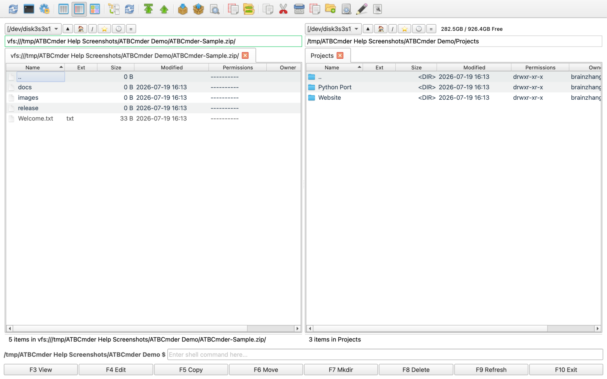
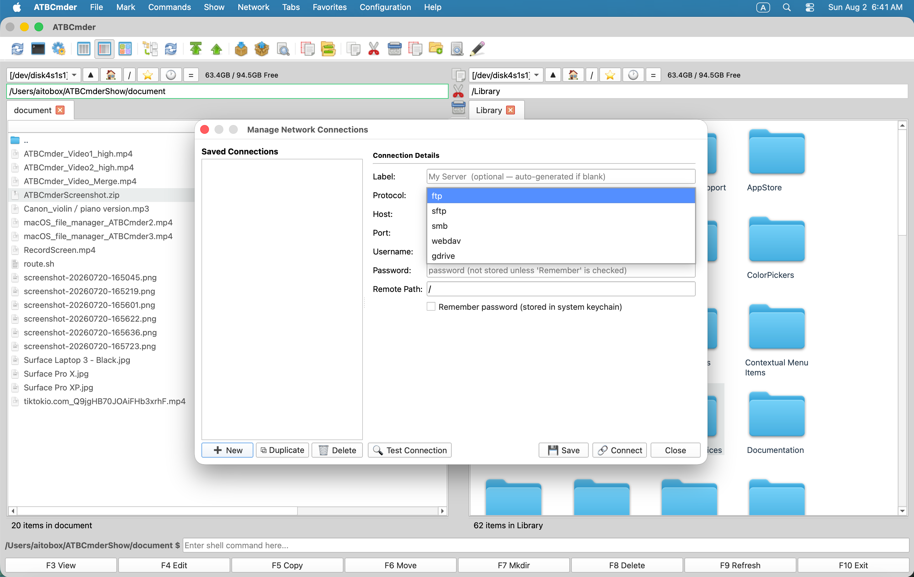

# 第 6 章：虛擬檔案系統與網路互連

在現代數字化工作流中，檔案管理早已超越了單塊物理硬碟的邊界。軟體工程師需要透過 SFTP 維護雲端測試與生產叢集；系統管理員要管理基於 SMB/CIFS 的區域網企業共享儲存；創作者常常藉助 WebDAV 存取私有云 NAS 和媒體資源；而極客與技術人員更是每天都要在本地檢視、修改並打包動輒數以 GB 計的各類壓縮包。

傳統桌面作業系統往往強迫使用者在割裂的應用之間來回切換：開啟專門的解壓工具將 ZIP 解包到臨時目錄，改完後再重新打包；開啟第三方 FTP/SFTP 客戶端上傳檔案；或者透過作業系統掛載彈窗把遠端網路盤散亂堆放在互不相通的訪達 (Finder) 視窗中。

ATBCmder 透過其強大的 **虛擬檔案系統 (Virtual File System, 簡稱 VFS)** 引擎徹底消除了這種割裂。基於統一的 `vfs://` URI 抽象層，ATBCmder 將遠端伺服器和壓縮包一視同仁地視為標準資料夾。您可以直接回車進入 `.tar.gz` 壓縮包，按 `F3` 預覽程式碼檔案，按 `F4` 原地編輯深層配置檔案（並在儲存時**自動無感重新打包回寫**），甚至直接在兩個面板之間按下 `F5`，把檔案從加密 SFTP 伺服器高速流式拷入內網 SMB NAS——全程無需任何手動解壓或臨時檔案落地！

---

## 1. 快速入門：VFS 架構總覽與命令矩陣

ATBCmder 將所有底層檔案系統的讀寫邏輯收斂到統一抽象層。無論是本地 APFS 固態硬碟分割槽、多層巢狀 `.zip` 壓縮包內部的子目錄，還是遠在大洋彼岸 Linux 節點上的 SFTP 目錄，雙面板均提供完全一致的操作互動。

```
┌────────────────────────────────────────────────────────────────────────────────────────┐
│                              ATBCMDER 雙面板主介面                                     │
│            左側面板 (當前啟用)                  右側面板 (對側閒置 / 目標)             │
│  [1] 本地物理檔案系統                    │  [2] 壓縮包虛擬檔案系統 (Archive VFS)       │
│      file:///Users/brain/projects/       │      vfs:///Users/brain/backup.tar.gz/src/  │
│      直接高速訪問本地 APFS 固態硬碟      │      原地免解壓瀏覽、F3檢視、F4實時編輯回寫 │
│                                          │                                             │
│  [3] 遠端網路檔案系統 (SFTP / SSH)       │  [4] 區域網網路儲存 (SMB / WebDAV)          │
│      vfs://sftp://deploy@aws.prod/app/   │      vfs://smb://admin@truenas/Pool/Media/  │
│      Paramiko / SSH 金鑰 / 鑰匙串安全認證│      macOS 原生 mount_smbfs / WebDAV 客戶端 │
│                                          │                                             │
├────────────────────────────────────────────────────────────────────────────────────────┤
│                         統一 VFS 路由排程分發引擎 (vfs://)                             │
│     FileSystemModel ➔ VFSManager ➔ SessionCache ➔ StreamCopyWorker / RepackWorker      │
└────────────────────────────────────────────────────────────────────────────────────────┘
```

### VFS 與網路雙矩陣速查表

| 操作名稱 | macOS 原生快速鍵 | 傳統 Commander 鍵 | 命令 ID | 功能說明 |
| :--- | :--- | :--- | :--- | :--- |
| **壓縮打包檔案** | `Alt+F5` / `⌥F5` | `Alt+F5` | `cm_PackFiles` | 調出打包壓縮對話方塊（支援格式選擇、壓縮率、密碼加密與分卷）。 |
| **解壓提取檔案** | `Alt+F9` / `⌥F9` | `Alt+F9` | `cm_ExtractFiles` | 將選中的壓縮包解壓提取到對側面板，支援衝突自動解決。 |
| **快速網路連線** | 選單：網路 | `cm_NetworkConnect` | `cm_NetworkConnect` | 彈出輕量快捷的即時網路撥號連線彈窗。 |
| **網路連線管理器** | 選單：網路 | `cm_ManageConnections`| `cm_ManageConnections`| 開啟功能完整的連線管理器，維護儲存的伺服器連線書籤。 |
| **FTP 快速連線** | `Ctrl+S` / `⌃S` | `Ctrl+S` | `cm_FTPConnect` | 快速喚起 FTP 協議連線會話。 |
| **進入壓縮包 / 遠端目錄**| `Enter` / `⏎` | `Enter` | `cm_Open` | 直接回車進入 `.zip`、`.tar`、`.7z` 或遠端伺服器目錄。 |
| **退出返回上級目錄** | `Backspace` / `⌫` | `Backspace` | `cm_GoToParent` | 退出當前壓縮包或遠端資料夾，返回外層父級目錄。 |
| **預覽虛擬/遠端檔案** | `F3` / `Fn+F3` | `F3` | `cm_View` | 將遠端或壓縮包內部檔案流式送入全能檢視器。 |
| **編輯虛擬/遠端檔案** | `F4` / `Fn+F4` | `F4` | `cm_Edit` | 調出內建編輯器；儲存後自動觸發後臺重新打包或遠端回傳。 |
| **跨 VFS 面板雙向複製** | `F5` / `Fn+F5` | `F5` | `cm_Copy` | 在本地、壓縮包內部與遠端網路端點之間自由無縫複製。 |
| **後臺任務佇列監視器** | 選單：顯示 | `cm_OperationsPanel` | `cm_OperationsPanel` | 監控後臺非同步傳輸佇列、實時網速與執行緒執行狀態。 |

---

## 2. 統一的 `vfs://` URI 抽象規範

傳統檔案管理器往往把遠端網路盤和壓縮包視為次等公民，必須依賴第三方掛載工具或先全量解壓到臨時目錄。ATBCmder 將所有檔案源全部收斂至標準化、結構嚴謹的統一資源定位符 (URI)：

```
vfs://[協議型別]://[使用者名稱]@[主機地址]:[埠號]/[遠端絕對路徑]
```

### 2.1 虛擬路徑兩大正規化

根據不同的資料載體與應用場景，`vfs://` URI 主要呈現為兩種規範格式：

1. **壓縮包虛擬路徑 (Archive Virtual Paths)**：
   ```
   vfs:///Users/brain/Documents/release_v1.7.zip/src/main.py
   ```

   - **外層協議頭**：`vfs://` 告知底層 `FileSystemModel` 攔截物理檔案系統呼叫。
   - **物理容器路徑**：`/Users/brain/Documents/release_v1.7.zip` 精準定位本地磁碟上實際存在的歸檔檔案。
   - **包內虛擬成員**：`src/main.py` 定位壓縮包內部層級深處的虛擬目標檔案。

2. **網路伺服器路徑 (Network Server Paths)**：
   ```
   vfs://sftp://developer@staging.internal.net:2222/var/www/html/index.php
   vfs://smb://admin@192.168.1.50/StoragePool/Backups/2026/
   vfs://webdavs://user@cloud.mycompany.com:443/remote.php/dav/files/user/
   ```

   - **協議識別符號**：指定具體的傳輸驅動（`sftp`、`ftp`、`ftps`、`smb`、`webdav`、`webdavs`、`gdrive`）。
   - **身份驗證憑據**：編碼使用者名稱與指定埠號。
   - **遠端目標路徑**：對應遠端伺服器主機上的絕對目錄或檔案系統路徑。

```
┌────────────────────────────────────────────────────────────────────────────────────────┐
│                              VFS 路徑解析全流程示意                                    │
├────────────────────────────────────────────────────────────────────────────────────────┤
│                                                                                        │
│   輸入示例: vfs://sftp://deploy@aws.infra:22/var/log/nginx/access.log                  │
│                 │      │        │        │   └────────────────────► 遠端絕對路徑       │
│                 │      │        │        └────────────────────────► 埠 (預設 22)     │
│                 │      │        └─────────────────────────────────► 遠端主機 / 域名    │
│                 │      └──────────────────────────────────────────► 登入使用者名稱         │
│                 └─────────────────────────────────────────────────► 網路傳輸協議驅動   │
│                                                                                        │
│   輸入示例: vfs:///Volumes/Data/Archive.zip/docs/manual.pdf                            │
│                 │                      │        └─────────────────► 壓縮包內部檔案     │
│                 │                      └──────────────────────────► 物理壓縮包檔案     │
│                 └─────────────────────────────────────────────────► 虛擬檔案系統協議頭 │
└────────────────────────────────────────────────────────────────────────────────────────┘
```

### 2.2 雙面板無縫協同互動

因為所有虛擬路徑在 ATBCmder 內部都遵循統一的抽象目錄模型，所以您能享受到完整的雙面板互動能力：

- **多標籤虛擬工作區**：在左側面板標籤頁 1 開啟遠端 SFTP 伺服器，標籤頁 2 開啟本地加密 ZIP 包，標籤頁 3 開啟本地 `~/Downloads` 目錄，多源自由切換。
- **定向雙向複製 (`F5`)**：在本地啟用面板中選中檔案並按下 `F5`，即可將其直接推送到對側面板展示的遠端伺服器或壓縮包內部。
- **直接拖拽傳輸 (Drag-and-Drop)**：跨越面板邊界，在本地磁碟、網路共享以及歸檔內部層級之間直接拖拽檔案，無需中間繁瑣落地。
- **動態互動式麵包屑導航條**：麵包屑路徑欄能夠智慧解析虛擬 URI 為可點選的層級按鈕。點選任何父級目錄或根伺服器徽標，即可瞬間折躍至對應層級。

---

## 3. 壓縮包虛擬檔案系統 (Archive VFS)：免解壓原地暢遊

在 ATBCmder 中開啟壓縮包完全無需先解壓到臨時目錄或藉助第三方解壓軟體。只需高亮選中的壓縮包並按下 **`Enter`**（回車鍵）或雙擊滑鼠，ATBCmder 便會瞬間在原地掛載該歸檔，將當前面板轉化為高效的虛擬目錄瀏覽器。

  
*圖 6.1：將多層巢狀壓縮包視為普通虛擬目錄原地瀏覽，清晰展現未壓縮體積、時間戳與子目錄層級。*

### 3.1 原生支援的歸檔與壓縮格式

ATBCmder 原生內建工業級主流歸檔與壓縮格式驅動：

| 歸檔格式 | 副檔名 | 讀取瀏覽支援 | 寫入 / 打包 | 密碼加密支援 |
| :--- | :--- | :---: | :---: | :--- |
| **ZIP** | `.zip` | 支援 | 支援 | 標準 ZipCrypto 與高強度 AES-256 (`pyzipper`) |
| **GZip 歸檔** | `.tar.gz`, `.tgz` | 支援 | 支援 | POSIX 標準流式 tar 歸檔 |
| **BZip2 歸檔**| `.tar.bz2`, `.tbz2` | 支援 | 支援 | 高壓縮率 bzip2 塊壓縮 |
| **XZ 歸檔** | `.tar.xz`, `.txz` | 支援 | 支援 | 高壓縮比 LZMA2 壓縮 |
| **標準 TAR** | `.tar` | 支援 | 支援 | 未壓縮的傳統 UNIX 磁帶歸檔 |
| **7-Zip** | `.7z` | 支援 | 支援 (基於 `py7zr`) | LZMA / LZMA2 固實壓縮 |

### 3.2 原地暢遊的日常操作流

在壓縮包內部漫遊瀏覽時：

1. **進入子目錄**：在壓縮包內的任何資料夾上按下 `Enter`（回車），立即展開深層巢狀目錄。
2. **返回上一級 (`..`)**：按下 **`Backspace`**（退格鍵 `⌫`）或雙擊 `.. [上一層目錄]` 返回上級。到達壓縮包的根目錄後再按退格鍵，即可優雅返回包含該壓縮包的外部物理資料夾。
3. **即時預覽 (`F3` / `Fn+F3`)**：在包內的任何文件、圖片或原始碼檔案上按下 `F3`，ATBCmder 會在沙箱中僅流式提取該單項，並在全能檢視器中毫秒級展現。
4. **按需單項提取 (`F5` / `Fn+F5`)**：不必為了取出幾個小檔案而解壓幾十 GB 的龐大壓縮包。直接在包內選中需要的檔案並按下 `F5`，ATBCmder 會單獨將選中的條目解壓並投遞到對側面板中。

> [!NOTE]
> 在壓縮包內預覽或複製單個檔案時，ATBCmder 只從容器流中按需提取目標位元組塊，絕不會把未選中的同級檔案也解壓出來，既節省了磁碟空間，又大幅提升了響應速度。

---

## 4. 實時重打包 (Live Repacking)：在壓縮包內原地編輯

ATBCmder 最受極客歡迎的核心功能之一就是 **實時重打包 (Live Repacking)**。在傳統工作流中，修改壓縮包內的一個配置檔案需要極度繁瑣的六個步驟：解壓整個包 ➔ 找到目標檔案 ➔ 編輯並儲存 ➔ 重新壓縮為同名檔案 ➔ 刪除原壓縮包 ➔ 清理臨時解壓目錄。

ATBCmder 讓修改壓縮包內的檔案變得像修改本地普通檔案一樣直觀自然。

```
┌────────────────────────────────────────────────────────────────────────────────────────┐
│                              實時重打包 (LIVE REPACKING) 生命週期                      │
├────────────────────────────────────────────────────────────────────────────────────────┤
│                                                                                        │
│  1. 使用者在 "package.zip" 內部對 "config.json" 按下 F4 編輯                             │
│     │                                                                                  │
│     ├──► ATBCmder 提取 "config.json" 到沙箱: /tmp/dc_repack_xyz/config.json            │
│     └──► 喚起內建 EditorDialog，視窗標題顯示: "config.json — Editor"                   │
│                                                                                        │
│  2. 使用者在編輯器中修改配置並按下 Cmd+S (儲存)                                          │
│     │                                                                                  │
│     ├──► 編輯器發出 file_saved 訊號                                                    │
│     └──► RepackWorker 後臺執行緒比對原壓縮包體積與 ArchiveRepackWarningMB 安全閾值       │
│                                                                                        │
│  3. 原子級重打包執行 (Atomic Repack)                                                   │
│     │                                                                                  │
│     ├──► 將修改後的流式資料寫入暫存歸檔: /tmp/package.zip.tmp                          │
│     ├──► 校驗新生成容器的完整性與內部簽名                                              │
│     ├──► 執行原子替換: os.replace("/tmp/package.zip.tmp", "/original/package.zip")     │
│     └──► 自動重新整理當前啟用面板，並徹底清理臨時沙箱 /tmp/dc_repack_xyz/                  │
│                                                                                        │
└────────────────────────────────────────────────────────────────────────────────────────┘
```

### 4.1 分步實操：修改壓縮包內的配置檔案

1. 按 `Enter` 回車進入壓縮包（如 `application_bundle.zip`）。
2. 定位到需要調整的配置檔案（如 `settings.yaml`）。
3. 按下 **`F4`**（或 `Fn+F4`）。ATBCmder 會自動將該檔案提取到沙箱快取中，並調出內建全功能程式碼編輯器。
4. 在編輯器中按需修改內容。
5. 按下 **`Cmd+S`**（`⌘S`）儲存檔案。
6. 按 `Cmd+W` 或 `Esc` 關閉編輯器。
7. ATBCmder 的 **`RepackWorker`** 守護程序會自動捕獲變更，在後臺將更新後的檔案重新打包裝入原歸檔，執行原子替換，並實時重新整理檔案列表。

> [!CAUTION]
> **超大歸檔安全預警閾值 (`ArchiveRepackWarningMB`)**  
> 對壓縮歸檔進行區域性重打包，底層通常需要重新解壓並重新編碼整個容器的資料流。如果您在一個 20GB 的 `.tar.gz` 藍光影片壓縮包裡修改一個 10KB 的文字檔案，系統將不得不重寫整整 20GB 的資料！  
> 
> 為防止因誤操作導致磁碟長時間高負荷運轉，ATBCmder 設定了安全防線（`ArchiveRepackWarningMB`，在 `atbcmder.xml` 中預設為 **100 MB**）。當您試圖在超過此閾值的超大壓縮包內編輯或刪除檔案時，系統會彈出明確的警示確認彈窗：  
> *"修改此歸檔需要對整個壓縮包重新打包，這可能需要較長時間。是否確認繼續？"*

---

## 5. 建立與提取壓縮包 (`Alt+F5` / `Alt+F9`)

ATBCmder 為歸檔的建立與提取配置了獨立的後臺工作執行緒，確保在執行耗時數分鐘的大體積壓縮任務時，雙面板介面依然流暢可用、絕不假死卡頓。

  
*圖 6.2：壓縮打包對話方塊 (Alt+F5 / cm_PackFiles)，支援目標路徑定製、格式切換、壓縮級別調優與 AES-256 密碼加密。*

### 5.1 壓縮打包檔案 (`Alt+F5` / `⌥F5` / `cm_PackFiles`)

建立新歸檔只需以下幾步：

1. 在當前啟用面板中，選中一個或多個需要打包的檔案或資料夾。
2. 按下 **`Alt+F5`**（`⌥F5`），或從頂部選單欄選擇 **檔案 ➔ 打包壓縮...**。
3. 彈出 **打包壓縮** 對話方塊：
   - **目標歸檔路徑**：生成歸檔的儲存路徑。預設自動指向對側閒置面板所在的目錄，並以當前焦點條目命名。
   - **歸檔格式**：自由選擇 `ZIP`、`TAR`、`TAR.GZ`、`TAR.BZ2`、`TAR.XZ` 或 `7Z`。
   - **壓縮級別**：
     - `儲存 (Store)`：僅打包不壓縮；適合用於本身已高度壓縮的媒體檔案（MP4、JPEG、MKV）。
     - `極速 (Fast)`：CPU 佔用極低，優先保證打包速度。
     - `標準 (Normal Deflated)`：兼顧壓縮比與執行效能（日常通用推薦配置）。
     - `最大 (Maximum)`：極限壓縮模式（在支援的格式下啟用 LZMA/Bzip2 極限演算法）。
   - **保護密碼 (僅限 ZIP)**：輸入加密口令，對歸檔內的檔案進行加密保護。
4. 點選 **確定**（或回車）。壓縮任務將在非阻塞的後臺執行緒中平穩執行，同時呈現精確的進度條與逐檔案處理狀態。

#### 工業級 AES-256 密碼加密防護
傳統的 ZIP 加密方式（老舊的 ZipCrypto）在密碼學上已被證實極易被破解，存在嚴重的明文已知字典攻擊漏洞。在 ATBCmder 中為 ZIP 壓縮包設定密碼時，系統原生採用基於 `pyzipper` 的 **AES-256 工業級高強度加密**（遵循 `WZ_AES` 國際標準）。該標準不僅完全相容 macOS 原生解壓機制、WinZip 與 7-Zip，還能有效阻斷暴力破解與中間人刺探。

#### 超大檔案跨介質分卷壓縮與合併
若您需要透過郵件附件傳送大檔案，或將大體積素材分發到受 FAT32 單檔案 4GB 限制的 U 盤與雲端儲存：

1. 先使用 `Alt+F5` (`cm_PackFiles`) 將檔案完整打包。
2. 游標停留在生成的 `.zip` 或 `.tar` 檔案上，按下 **`Alt+F6`** 喚起檔案分割器 (`cm_FileSpliter`)。
3. 選擇預設分卷大小（如 `100 MB`、`4.7 GB DVD`、`CD 700 MB`，或輸入自定義位元組大小）。
4. ATBCmder 會批次生成帶序列編號的分卷切片（如 `archive.zip.001`、`archive.zip.002` 等）並附帶 CRC32 校驗清單。接收方在任何電腦上隨時可以透過 **`cm_FileLinker`**（檔案合併器）將其無損復原。

---

### 5.2 解壓提取歸檔 (`Alt+F9` / `⌥F9` / `cm_ExtractFiles`)

將壓縮包批次解壓落地到磁碟中：

1. 在啟用面板中選中一個或多個壓縮包檔案。
2. 按下 **`Alt+F9`**（`⌥F9`），或從頂部選單欄選擇 **檔案 ➔ 解壓...**。
3. 彈出 **解壓檔案** 對話方塊：
   - **待解壓檔案**：顯示當前選中的歸檔路徑。
   - **解壓目標路徑**：解壓落地目錄（預設自動對齊對側閒置面板的當前路徑）。
   - **包內預覽列表**：支援在彈窗內動態檢視壓縮包內部的檔案清單。
   - **解壓密碼**：針對受密碼保護的歸檔輸入解密口令。
4. 點選 **確定**。解壓過程中若遇到目標目錄已有同名檔案，ATBCmder 會主動暫停並彈出互動式衝突處理視窗：
   - **覆蓋**：替換當前衝突的單個目標檔案。
   - **跳過**：保留現有目標檔案不動，繼續解壓下一個條目。
   - **全部覆蓋**：後續所有重名檔案全部靜默覆蓋。
   - **全部跳過**：後續所有重名檔案全部自動跳過。
   - **取消**：安全中止解壓任務，保留已解壓好的部分。

---

## 6. 遠端網路檔案系統：主流協議與遠端儲存

ATBCmder 原生內建對多主流網路傳輸協議的支援，無需任何第三方外掛或中間服務，即可直接在雙面板中無縫掛載並操作遠端伺服器。

  
*圖 6.3：透過高安全性 SFTP 協議瀏覽遠端 Linux 伺服器目錄，直觀顯示檔案屬性、所屬許可權並支援面板間雙向流式複製。*

  
*圖 6.4：支援豐富的網路連線型別：安全 SFTP、傳統 FTP/FTPS、WebDAV 雲端儲存以及區域網 SMB 共享。*

### 6.1 支援的網路傳輸協議

| 協議字首 | 預設埠 | 傳輸層技術支撐 | 身份認證模式 | 推薦適用場景 |
| :--- | :---: | :--- | :--- | :--- |
| **`sftp://`** | `22` | SSH-2 (基於 Paramiko) | 密碼認證、SSH 金鑰對 (`id_rsa`, `id_ed25519`) | Linux 雲伺服器、開發測試叢集、安全跳板機 |
| **`ftp://`** | `21` | 標準 RFC 959 純文字 | 匿名登入、明文賬號密碼 | 區域網老舊裝置、實驗室儀器資料交換 |
| **`ftps://`** | `990` | TLS 加密安全 FTP | SSL/TLS 加密賬號密碼認證 | 企業級合規商業 FTP 伺服器 |
| **`smb://`** | `445` | CIFS / SMB3 | Windows 域控 / 本地使用者憑據 | Windows 區域網共享、群暉/威聯通 NAS 儲存 |
| **`webdav://`** | `80` | HTTP WebDAV 擴充套件 | Basic 基本認證、Digest 摘要認證 | 內網自建輕量網盤、本地網路媒體伺服器 |
| **`webdavs://`** | `443` | HTTPS WebDAV 加密 | SSL 加密 Basic / Digest 認證 | Nextcloud、ownCloud、企業私有云盤 |
| **`gdrive://`** | `443` | Google Drive API | OAuth2 官方令牌授權 | Google Drive 個人與團隊雲端硬碟 |

---

### 6.2 協議深度解析與專屬特性

#### SFTP (SSH 檔案傳輸協議)
基於業界標杆級 `paramiko` SSH 核心引擎，ATBCmder 的 SFTP 驅動在埠 22 上建立加密隧道：

- **主機指紋安全防護 (`WarningPolicy`)**：嚴格遵循安全準則，ATBCmder 會自動調閱本地 `~/.ssh/known_hosts`。連線已知主機時自動校驗公鑰指紋；遇到未知伺服器時，系統會彈出明確的安全告警，絕不靜默信任來歷不明的公鑰。
- **SSH 私鑰免密登入**：除了傳統密碼登入外，完全支援載入本地 SSH 私鑰（如 `~/.ssh/id_rsa`、`~/.ssh/id_ed25519`）。
- **UNIX 檔案屬性無損對映**：完整保留遠端檔案的八進位制檔案許可權模式 (`chmod`)、所屬使用者/使用者組屬性以及精確的 POSIX 修改時間戳。

#### FTP 與 FTPS (明文 / TLS 加密傳輸)
基於 Python 內建 `ftplib` 深度重構的 FTP 驅動支援：

- **被動傳輸模式 (PASV)**：預設強制開啟被動模式，確保在穿透複雜 NAT 家用路由器與企業級防火牆時依然保持穩定通訊。
- **多語言編碼自適應切換**：徹底告別跨平臺中文亂碼！支援在 `UTF-8`、`ISO-8859-1`、`GB18030` 與 `Windows-1252` 字元編碼之間一鍵切換。

#### SMB / Samba (Windows 區域網共享與 NAS 裝置)
不同於傳統的慢速純使用者態 Python SMB 庫，ATBCmder 採用了混合加速架構：

- **macOS 原生核心級硬體加速 (`mount_smbfs`)**：在 macOS 上，ATBCmder 的 `SambaMounter` 深度聯動系統底層的 `/sbin/mount_smbfs`。它將遠端網路共享直接掛載進 macOS 原生 VFS 樹（`/Volumes/` 或隔離掛載點），釋放出純原生硬體加速的 SMB3 極致吞吐頻寬。
- **現存掛載點智慧感知**：若 macOS 訪達或系統開機指令碼已經掛載了目標 SMB 卷，ATBCmder 會自動從系統的 `mount` 掛載表中嗅探並瞬間定位進入，避免重複建立冗餘連線。

> [!IMPORTANT]
> **SMB 共享名稱必填規則**  
> SMB 協議規範不允許直接在裸主機名層級瀏覽。因此，SMB 的 URI **必須**在路徑末尾指定具體的共享資料夾名稱：  
>
> - ❌ 錯誤示例：`vfs://smb://nas.local/`  
> - ✅ 正確示例：`vfs://smb://nas.local/StoragePool` 或 `vfs://smb://192.168.1.100/Media`

#### WebDAV 與 WebDAVS (Nextcloud 私有云與雲端儲存)
基於 `webdavclient3` 驅動，提供與現代私有云儲存的雙向同步通道：

- **SSL 證書校驗模式**：對公網 WebDAVS 服務執行嚴苛的 SSL 證書鏈驗證；針對家庭自建的區域網自簽名證書服務，提供一鍵信任跳過開關。
- **遞迴深層目錄建立 (`makedirs`)**：在批次上傳檔案時，若遠端不存在父級多層目錄，驅動會自動執行遞迴建構，防止批次上傳失敗。

---

## 7. 快速連線 vs 連線管理器

ATBCmder 為連線遠端主機提供了兩套相輔相成的方案：針對臨時除錯的 **快速連線**，以及面向固定伺服器資產的 **連線管理器**。

### 7.1 快速臨時連線 (`cm_NetworkConnect`)

當您需要臨時連入某臺裝置處理突發問題，不想把配置持久儲存汙染書籤時：

1. 選擇選單欄 **網路 ➔ 快速連線...**（或執行命令 `cm_NetworkConnect`）。
2. 彈出精簡輕快的快速撥號彈窗：
   - **協議**：選擇 `sftp`、`ftp`、`ftps`、`smb`、`webdav`、`webdavs` 或 `gdrive`。
   - **伺服器地址與埠**：輸入主機 IP 或域名（埠隨協議自動回填預設值）。
   - **使用者名稱與密碼**：輸入遠端認證資訊。
   - **遠端起始路徑**：指定登入後的初始目錄（預設為 `/`）。
   - **記住密碼**：臨時連線建議保持不勾選。
3. 點選 **測試連線**，在正式載入前先行驗證網路握手與身份認證是否通暢。
4. 點選 **連線**。ATBCmder 會立即在當前面板新建一個標籤頁，直連遠端伺服器。

---

### 7.2 連線管理器 (`cm_ManageConnections`)

對於日常頻繁往來的開發叢集、測試機與公司 NAS，**連線管理器**提供了全維度的配置中樞：

```
┌────────────────────────────────────────────────────────────────────────────────────────┐
│                              網路連線管理器 (CONNECTION MANAGER)                       │
├──────────────────────────────┬─────────────────────────────────────────────────────────┤
│  已儲存的書籤列表            │  連線詳細配置項                                         │
│  ┌────────────────────────┐  │  連線別名:     [ AWS 生產叢集跳板機                   ] │
│  │ 🔐 AWS 生產叢集跳板機  │  │  連線協議:     [ SFTP (port 22)                     ▼ ] │
│  │ 🖧 辦公區主力群暉 NAS  │  │  主機地址:     [ ec2-54-210-10-2.compute.amazonaws.com] │
│  │ 🌐 Nextcloud 私有云盤  │  │  埠號:       [ 22                                   ] │
│  │ 📂 實驗室舊版歸檔 FTP  │  │  使用者名稱:       [ ubuntu                               ] │
│  │                        │  │  登入密碼:     [ ••••••••••••••••••                   ] │
│  │                        │  │  遠端起始路徑: [ /var/www/production                  ] │
│  │                        │  │  [✓] 將安全密碼存入 macOS 系統鑰匙串 (Keychain)         │
│  └────────────────────────┘  │                                                         │
│  [➕ 新建] [⧉ 克隆] [🗑 刪除]  │  [🔍 測試連通性]             [💾 儲存]  [🔗 立即連線] │
└──────────────────────────────┴─────────────────────────────────────────────────────────┘
```

#### 維護伺服器連線配置
- **新建 (`➕ 新建`)**：清空右側表單，錄入全新伺服器的連線引數。
- **克隆 (`⧉ 克隆`)**：快速複製當前選中的連線模板。對於配置相同、僅 IP 或埠不同的開發、測試、預發多套環境，能夠極大減少重複輸入。
- **刪除 (`🗑 刪除`)**：安全移除該連線書籤，並同步清理系統中繫結的鑰匙串安全密碼。
- **測試連通性 (`🔍 測試連通性`)**：在後臺派遣 `ConnectionTestWorker` 發起連通性探針，校驗認證有效性，不影響當前面板的正常操作。
- **立即連線 (`🔗 立即連線`)**：儲存改動，立即建立遠端會話並在新標籤頁中開啟。

#### 選單欄動態書籤直達
所有在管理器中儲存的連線，都會自動同步對映到 macOS 頂部選單欄的 **網路 ➔ 已儲存的連線** 中。只需一次點選，即可像開啟本地書籤一樣快速掛載：

- `網路 ➔ 已儲存的連線 ➔ 🔐 AWS 生產叢集跳板機`
- `網路 ➔ 已儲存的連線 ➔ 🖧 辦公區主力群暉 NAS`

---

## 8. 憑據安全與 macOS 鑰匙串原生整合

在各類針對開發者的網路安全攻擊中，檔案管理器的配置檔案往往是重災區。許多傳統檔案管理工具把 FTP/SFTP 密碼明文存放在使用者家目錄的 XML 或 INI 文字中，極易被惡意掃描指令碼盜取。

**ATBCmder 承諾：絕不在磁碟配置檔案中以任何明文形式儲存敏感憑據！**

### 8.1 憑據安全儲存架構

```
┌────────────────────────────────────────────────────────────────────────────────────────┐
│                           憑據多層安全儲存體系架構                                     │
├────────────────────────────────────────────────────────────────────────────────────────┤
│                                                                                        │
│   持久化配置 XML 文字                           macOS 系統原生安全鑰匙串               │
│   (~/.config/atbcmder/atbcmder.xml)            (服務標識: "ATBCmder_VFS")              │
│   ┌─────────────────────────────────────┐      ┌─────────────────────────────────────┐ │
│   │ <connection>                        │      │ 標識: "AWS 生產叢集跳板機"          │ │
│   │   <label>AWS 生產叢集跳板機</label> │      │ 密文: 硬體安全區高強度加密口令      │ │
│   │   <scheme>sftp</scheme>             │      │ 訪問: 受 Apple 安全晶片硬體隔離守護 │ │
│   │   <host>aws.infra.net</host>        │      └─────────────────────────────────────┘ │
│   │   <user>deploy</user>               │                         ▲                    │
│   │   <password></password>             │                         │                    │
│   │ </connection>                       │                         │                    │
│   └─────────────────────────────────────┘                         │                    │
│         ▲                                                         │                    │
│         │ 儲存時強制剔除密碼置空                                   │ 經由系統          │
│         └─────────────────── ConnectionManager ───────────────────┘ keyring 安全存入   │
│                                                                                        │
└────────────────────────────────────────────────────────────────────────────────────────┘
```

1. **XML 配置檔案明文脫敏**：無論在任何時候將連線配置序列化落盤到 `atbcmder.xml`，`ConnectionManager.save()` 方法均會在執行前強制執行 `d["password"] = ""` 置空。即便配置檔案被意外讀取或洩漏，也不會暴露任何伺服器密碼。
2. **Apple 原生 Keychain 硬體加密**：若勾選了 **記住密碼**，系統會呼叫 Python `keyring` 模組直接把密碼存入 macOS 鑰匙串，服務名為 `ATBCmder_VFS`。金鑰派生與資料加解密全程受 Apple 晶片硬體 Secure Enclave 保護。
3. **動態會話記憶體保護**：若未勾選“記住密碼”，憑據僅儲存在當前執行期的動態記憶體結構（`VFSSessionCache`）中，在退出 ATBCmder 的瞬間即被徹底抹除。

---

## 9. ⚡ 高手進階：高效能遠端與歸檔實戰技巧

### 技巧 1：非阻塞後臺傳輸佇列 (`cm_OperationsPanel`)
當跨越遠端伺服器複製海量目錄，或透過 SFTP 下載數十 GB 的系統映象時，切勿讓介面凍結。ATBCmder 的所有網路與歸檔操作均原生接入 **後臺任務佇列系統**：

- 按 **`F5`** 啟動傳輸時，可直接點選 **後臺** 按鈕將任務派入佇列。
- 透過選單欄 **顯示 ➔ 後臺任務面板**（`cm_OperationsPanel`）隨時調出監視視窗，檢視實時傳輸速率曲線、逐檔案進度與剩餘時間估算。
- 您可以隨時對任務進行暫停、繼續或調整先後次序，期間完全不影響雙面板對本地檔案的正常瀏覽與操作。

### 技巧 2：異構協議間的點對點流式直傳
ATBCmder 內建的 `stream_copy_file` 引擎支援**跨協議直接管道流式傳輸**。例如將左側面板 SFTP 伺服器上的大資料夾直接拖拽到右側面板的內網 SMB 共享盤中：

- ATBCmder **不會**先將龐大的目錄全量下載到本地 Mac 固態硬碟，再重新上傳到 SMB。
- 系統在記憶體中構建環形緩衝區，將源端 Socket 讀取到的資料塊直接管道寫入目標端 Socket。不僅減少了對本地 SSD 壽命的磨損，而且即使 Mac 本地磁碟可用空間不足，也能從容完成遠端之間海量資料的無縫遷移！

### 技巧 3：網路長連線保活與自動重連機制
複雜的企業級硬體防火牆或家庭 NAT 路由常會在閒置 60 到 300 秒後強制切斷空閒 TCP 連線。為避免在瀏覽深層遠端樹形目錄時連線斷開：

- ATBCmder 的 `BaseNetworkVFS` 基類會自動在空閒時段向遠端傳送輕量級心跳探針包，維持會話活性。
- 若遭遇偶發性網路抖動，內部的 `_retry()` 故障恢復機制會自動執行最多 **3 次重試**，採用平滑的指數退避策略（每次間隔 `2^attempt` 秒），確保在弱網環境下依然堅如磐石。

### 技巧 4：遠端程式碼檔案的編輯與自動回傳流水線
需要直接修改遠端 Linux 伺服器上的 `nginx.conf` 或 Python 指令碼？

1. 在 SFTP 或 WebDAV 面板中選中目標遠端檔案。
2. 按下 **`F4`**（`Fn+F4`）。
3. ATBCmder 會將該檔案快速拉取到隔離臨時沙箱（`/tmp/`）並在內建編輯器中開啟。
4. 每次按下 **`Cmd+S`**（`⌘S`）儲存時，系統都會觸發 `_upload_vfs_temp()` 非同步將修改後的檔案推回遠端伺服器，並在狀態列輕量提示上傳成功。
5. 關閉編輯器後，本地臨時沙箱檔案會被安全擦除。

---

## 10. 系統許可權與安全警示

> [!WARNING]
> **SSH 主機指紋變更警報 (Host Key Verification Mismatch)**  
> 如果目標 SFTP 伺服器重灌了作業系統重新生成了金鑰，或者當前區域網存在中間人欺騙攻擊，ATBCmder 會檢測到遠端公鑰指紋與本地 `~/.ssh/known_hosts` 不符。  
> 在公共 Wi-Fi 環境下遇到此類告警，切勿盲目跳過，請務必先與伺服器管理員獨立核對公鑰指紋！

> [!IMPORTANT]
> **超大遠端檔案預覽的臨時空間注意**  
> 當在遠端 VFS 伺服器上按 `F3` 預覽或按 `F4` 編輯大體積檔案時，ATBCmder 會將資料暫存至系統的 `/tmp` 目錄。在開啟數 GB 級別的大型音影片或資料庫檔案前，請確保 Mac 的 APFS 啟動盤留有足夠的臨時寫入空間。

> [!CAUTION]
> **正確解除安裝與斷開網路共享**  
> 對於透過 macOS `mount_smbfs` 掛載的區域網 SMB 共享，如果在未安全斷開的情況下直接拔掉網線或合上電腦，可能會在系統的 `/Volumes/` 目錄下殘留無效的假死掛載點。合蓋或切換網路前，請優先在面板驅動器選單中點選斷開連線。

---

## 11. 雙矩陣快速鍵全景速查表

| 分類類別 | 操作功能說明 | macOS 原生快速鍵 | 傳統 Commander 鍵 | 命令 ID |
| :--- | :--- | :--- | :--- | :--- |
| **壓縮歸檔操作** | 打包選中的檔案 / 資料夾 | `Alt+F5` / `⌥F5` | `Alt+F5` | `cm_PackFiles` |
| **壓縮歸檔操作** | 解壓提取選中的壓縮包 | `Alt+F9` / `⌥F9` | `Alt+F9` | `cm_ExtractFiles` |
| **壓縮歸檔操作** | 進入壓縮包內部虛擬瀏覽 | `Enter` / `⏎` | `Enter` | `cm_Open` |
| **壓縮歸檔操作** | 退出壓縮包返回上級物理目錄 | `Backspace` / `⌫` | `Backspace` | `cm_ChangeDirToParent` |
| **壓縮歸檔操作** | 在全能檢視器中預覽包內單項 | `F3` / `Fn+F3` | `F3` | `cm_View` |
| **壓縮歸檔操作** | 在編輯器中實時修改包內檔案 | `F4` / `Fn+F4` | `F4` | `cm_Edit` |
| **壓縮歸檔操作** | 將包內選中檔案單獨拷出 | `F5` / `Fn+F5` | `F5` | `cm_Copy` |
| **壓縮歸檔操作** | 將大歸檔分割為多介質分卷 | `Alt+F6` / `⌥F6` | `Alt+F6` | `cm_FileSpliter` / `cm_Split` |
| **壓縮歸檔操作** | 合併多卷分卷切片為完整歸檔 | 選單：檔案 ➔ 合併檔案 | — | `cm_FileLinker` / `cm_Combine` |
| **遠端網路連線** | 開啟快速臨時撥號連線彈窗 | 選單：網路 | — | `cm_NetworkConnect` |
| **遠端網路連線** | 開啟網路連線管理器 | 選單：網路 | — | `cm_ManageConnections` |
| **遠端網路連線** | 快捷連線至 FTP 伺服器 | `Ctrl+S` / `⌃S` | `Ctrl+S` | `cm_FTPConnect` |
| **遠端網路連線** | 安全斷開遠端網路共享掛載 | 選單：網路 | — | `cm_NetworkDisconnect` |
| **傳輸任務管理** | 調出後臺任務佇列監視器 | 選單：顯示 | — | `cm_OperationsPanel` |
| **傳輸任務管理** | 暫停 / 恢復佇列中當前任務 | `Space` (在佇列中) | `Space` | — |

---

<div align="center">
  <p>準備好定製屬於您的個性化快速鍵、面板檢視與操作行為了嗎？</p>
  <p><strong><a href="preferences_and_customization.md">前往第 7 章：偏好設定與個性化定製 &rarr;</a></strong></p>
</div>
