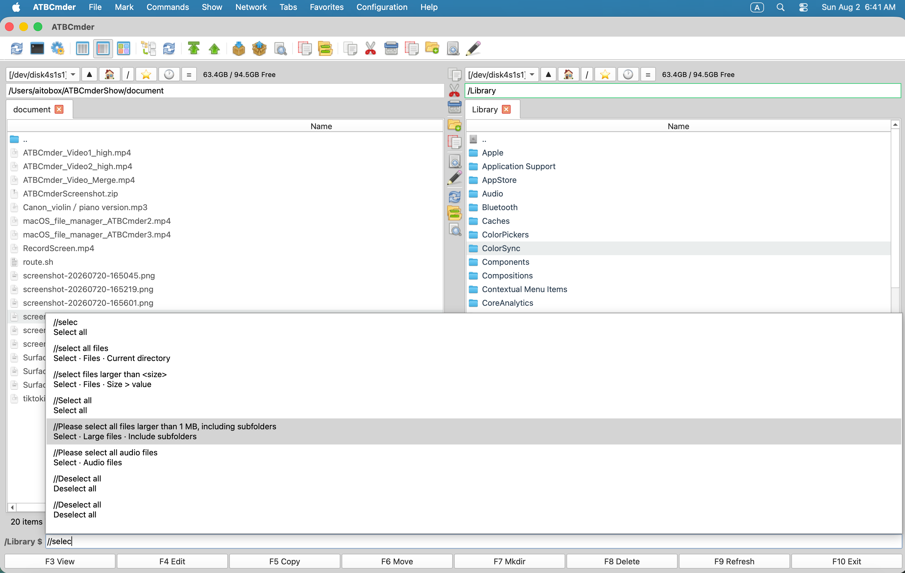

# 第 5 章：進階生產力工具與自動化

在日常高負荷的檔案管理中，基礎的單檔案複製、移動與刪除僅僅是冰山一角。專業開發者、系統管理員、數字創作者與資料分析師經常面臨一系列複雜的批次與系統級任務：將數千張命名混亂的相機素材批次規範化、快速找出兩版配置補丁之間的細微回退程式碼、在區域網 NAS 陣列之間維護嚴格一致的映象備份、深度挖掘埋藏在數十層子目錄裡的配置檔案，以及在歸檔前對海量資產進行加密雜湊核驗。

ATBCmder 將這些原本費時費力的繁瑣勞動轉化為行雲流水的高效流水線。你完全不需要編寫簡陋的 Shell 臨時指令碼，也不必在多個第三方小工具或外部比對軟體之間來回切換。ATBCmder 將一整套工業級自動化套件直接植入其正統雙面板核心中。無論是全目錄正規表示式批次替換、基於逐位元組比對的雙向資料夾同步，還是把多條件搜尋結果一鍵裝載至虛擬面板中集中操作，一切盡在純鍵盤極速掌控之中。

---

## 1. 快速上手：自動化引擎與功能矩陣

ATBCmder 將高階工具與自動化系統劃分為六大核心領域，與雙面板無縫聯動：

```
┌────────────────────────────────────────────────────────────────────────────────────────┐
│                                 雙欄檔案操作面板                                       │
│          左側面板 (源路徑 / 目錄 A)                    右側面板 (目標路徑 / 目錄 B)    │
├────────────────────────────────────────────────────────────────────────────────────────┤
│                                          │                                             │
│  [1] 批次多重重新命名 (Ctrl+M)           │  [2] 差異比對與雙欄 Diff (Meta+Shift+F12)   │
│      智慧萬用字元、正規表示式、計數器    │      逐行高亮差異、程式碼區塊合併同步       │
│                                          │                                             │
│  [3] 資料夾雙向同步 (Shift+F12)          │  [4] 全域深度進階搜尋 (Alt+F7)              │
│      內容/時間比對、非對稱單向鏡像複製   │      Spotlight / 遞迴深搜 ➔ 填入虛擬面板    │
│                                          │                                             │
│  [5] 語意化命令輸入列 (/)                │  [6] 極客安全與實用工具箱                   │
│      原生 Spotlight 檢索、AI 自然語言指令│      大檔案分割合併、雜湊校驗、安全抹除     │
│                                          │                                             │
├────────────────────────────────────────────────────────────────────────────────────────┤
│  [填入虛擬清單] ➔ 將全碟搜尋符合項目聚合為虛擬資料夾面板，統一執行跨目錄批次操作       │
└────────────────────────────────────────────────────────────────────────────────────────┘
```

### 自動化核心功能雙矩陣速查表

| 操作功能 | macOS 原生快速鍵 | 經典 Commander 鍵位 | 命令標識 (Command ID) | 核心用途說明 |
| :--- | :--- | :--- | :--- | :--- |
| **多重批次重新命名** | `Ctrl+M` / `⌃M` | `Ctrl+M` | `cm_MultiRename` | 喚起批次重新命名配置對話方塊 |
| **雙欄檔案差異比對**| `Meta+Shift+F12` / `⌘⇧F12` | `Meta+Shift+F12` | `cm_FileDiff` / `cm_CompareFiles` | 視覺化並排對比兩個檔案的內容差異（`Shift+F3` 為快速對比 `cm_CompareContents`） |
| **資料夾雙向同步** | `Shift+F12` / `⇧F12` | `Shift+F12` | `cm_SyncDirs` | 深度比對左右面板目錄樹並執行雙向/單向映象同步 |
| **多功能高階搜尋** | `Alt+F7` / `⌥F7` | `Alt+F7` | `cm_Search` / `cm_FileSearch` | 喚起具備多維度過濾條件的檔案搜尋視窗 |
| **Spotlight 極速搜尋** | `Ctrl+Shift+F` / `⌃⇧F` | `Ctrl+Shift+F` | *(命令選單)* | 基於系統後設資料索引發起瞬間檢索 |
| **語義命令輸入** | `/` | `/` | `cm_VisSemanticCommand` | 聚焦底部自然語言命令與智慧過濾欄 |
| **超大檔案分割** | `Alt+F6` / `⌥F6` | `Alt+F6` | `cm_FileSpliter` / `cm_Split` | 將大檔案均勻切分成帶序號的連續資料塊 |
| **分卷檔案合併** | 選單: 檔案 ➔ 合併檔案 | — | `cm_FileLinker` / `cm_Combine` | 將有序分卷碎片復原為原始二進位制檔案 |
| **計算雜湊校驗值** | `Ctrl+X` / `⌃X` | `Ctrl+X` | `cm_CheckSumCalc` / `cm_CalculateChecksum` | 計算 MD5, SHA-1, SHA-256, SHA-512 安全雜湊 |
| **校驗檔案完整性** | 選單: 工具 | — | `cm_CheckSumVerify` / `cm_VerifyChecksum` | 讀取 `.md5` / `.sha256` 清單核驗磁碟檔案完整性 |
| **物理安全粉碎抹除**| `Alt+Delete` / `⌥⌫` | `Alt+Delete` | `cm_Wipe` | 多輪覆寫物理扇區，永久安全粉碎機密檔案 |
| **開啟系統終端機** | `Ctrl+J` / `⌃J` | `Ctrl+J` | `cm_RunTerm` | 在當前面板所在路徑下喚起 macOS 系統終端機 |

---

## 2. 多重批次重新命名工具 (`Ctrl+M` / `⌃M` / `cm_MultiRename`)

手動逐個重新命名成百上千個檔案既繁瑣又極易出錯。**多重批次重新命名工具** (`cm_MultiRename`) 允許你定義靈活的命名模板、遞增計數器序列、一鍵統一大小寫，並能執行高階 Python 正規表示式查詢與替換，同時配備防衝突實時計算引擎。

  
*圖 5.1：多重批次重新命名視窗，具備實時更名預覽表格、動態佔位符、計數器引數與同名衝突紅色預警。*

### 2.1 批次重新命名標準工作流

1. **選定待處理檔案**：在啟用面板中使用 `Space`、`Insert` 或萬用字元快速鍵 `+` 選定多個待更名的檔案或子資料夾。若未多選，預設以游標所在當前項為目標。
2. **啟動重新命名工具**：按下 **`Ctrl+M`**（`⌃M`）或點選選單欄 **檔案 ➔ 批次重新命名...**。
3. **配置命名規則**：輸入主檔名模板、副檔名模板，調整計數器或配置查詢替換規則。
4. **即時審視預覽表格**：三列表格（原檔名、新檔名、所在目錄）會隨著你的每一次按鍵**毫秒級動態重新整理計算**。
5. **確認並執行**：點選 **開始重新命名**（或按下 `Enter`）。ATBCmder 會在底層原子安全地完成重新命名，並即時重新整理檔案列表。

---

### 2.2 命名模板佔位符與字元範圍切片

ATBCmder 採用方括號包裹的動態佔位符來提取原檔案的各項後設資料屬性：

| 佔位符程式碼 | 屬性說明 | 原始輸入示例 | 轉換後的結果值 |
| :--- | :--- | :--- | :--- |
| **`[N]`** | 原始檔名（不含副檔名字尾） | `report_2026.pdf` | `report_2026` |
| **`[E]`** | 原始副檔名字尾（不含點號） | `archive.tar.gz` | `gz` |
| **`[C]`** | 遞增數字計數器 | *(列表中第 3 個檔案)* | `003` (取決於位數設定) |
| **`[Y]`** | 檔案最後修改日期的 4 位年份 | `2026-09-06` | `2026` |
| **`[M]`** | 檔案最後修改日期的 2 位月份 | `9月` | `09` |
| **`[D]`** | 檔案最後修改日期的 2 位日期 | `6日` | `06` |
| **`[h]`** | 檔案修改時間的 2 位小時數（24小時制） | `14:30:15` | `14` |
| **`[m]`** | 檔案修改時間的 2 位分鐘數 | `14:30:15` | `30` |
| **`[s]`** | 檔案修改時間的 2 位秒數 | `14:30:15` | `15` |

#### 字串切片語法 (`[Na-b]` / `[Ea-b]`)
你可以從原檔名或字尾中擷取任意指定區間的字元（基於從 1 開始的字元索引）：

- **`[N1-4]`**：提取原名稱的前 4 個字元。例如 `Document_Final.txt` 擷取後得到 `Docu`。
- **`[N5-]`**：從第 5 個字元一直擷取到原名稱末尾。例如相機檔案 `DSC_0982.jpg` 擷取後得到 `0982`（完美剔除字首）。
- **`[N-5]`**：提取從開頭到第 5 個字元。
- **`[E1-2]`**：提取副檔名的前兩個字元。例如 `archive.html` 擷取後得到 `ht`。

---

### 2.3 計數器精細引數控制

**計數器設定 (Counter Settings)** 模組賦予你高度靈活的數字序列編排能力：

- **起始值 (Start At)**：序列號的初始起點整數（預設值為 `1`）。
- **步進幅度 (Step)**：每處理一個檔案所遞增的步長（預設值為 `1`）。例如步進設為 `2` 時，生成的序號為 `1, 3, 5, 7...`。
- **補零位數 (Digits)**：固定數字的位寬（可設範圍 `1` 到 `10`）。設為 `3` 時自動向前補零格式化為 `001`, `002`, `003`；設為 `1` 時則不補零（`1`, `2`, `3`）。

---

### 2.4 文字查詢替換與正規表示式

**查詢與替換 (Find & Replace)** 模組用於快速剔除或替換檔名中的固定字元或複雜模式：

- **查詢內容 (Find)**：目標子字串或正規表示式。
- **替換為 (Replace with)**：目標替換文字。當啟用正則時，支援使用 `$1`, `$2`（或 `\1`, `\2`）反向引用正則括號中捕獲的文字分組。
- **啟用正規表示式 (Regex)**：開啟基於 Python 標準庫的強大正則解析。
- **區分大小寫 (Case Sensitive)**：取消勾選後不區分英文字元大小寫（例如 `.JPG` 和 `.jpg` 一視同仁）。

#### 常見實用正規表示式替換範例

```
範例 1：快速清除檔名中附帶的發行標記或多餘中括號標籤
原始檔案:    Album_Artist_-_Track_01_[Lossless_24bit_96kHz].flac
查詢正則:    \s*\[.*?\]
替換內容:    (留空)
處理結果:    Album_Artist_-_Track_01.flac

範例 2：將日期格式從 YYYY-MM-DD 倒置調整為 DD-MM-YYYY
原始檔案:    Invoice_2026-09-06_Acme.pdf
查詢正則:    (\d{4})-(\d{2})-(\d{2})
替換內容:    $3-$2-$1
處理結果:    Invoice_06-09-2026_Acme.pdf

範例 3：將檔名中的多餘空格與下劃線統一規整為規範橫線
原始檔案:    my new blog post_draft.md
查詢正則:    [ _]+
替換內容:    -
處理結果:    my-new-blog-post-draft.md
```

---

### 2.5 快速大小寫格式轉換

無需配置任何正則，直接從下拉選單中一鍵規範英文字母大小寫：

- **不改變 (No change)**：保持原有的大小寫狀態不變。
- **全部小寫 (lowercase)**：將整個檔名和字尾統一轉為小寫字母（`PHOTO_001.JPG` ➔ `photo_001.jpg`）。
- **全部大寫 (UPPERCASE)**：將所有字元轉為大寫（`readme.txt` ➔ `README.TXT`）。
- **首字母大寫 (First letter uppercase)**：將每個英文單詞的第一個字母大寫（`war and peace.epub` ➔ `War And Peace.epub`）。

---

### 2.6 實時預覽與零事故防衝突引擎

在未預覽的情況下對大批次檔案進行更名是極其危險的。ATBCmder 採用了**零事故安全架構 (Zero-Accident Safety Architecture)**：

1. **瞬時防抖實時預覽**：在輸入框中每敲入一個字元或調整計數器，下方的結果列表即刻計算出未來磁碟上的新檔名。
2. **重名衝突實時檢測與熔斷**：ATBCmder 會在記憶體中遍歷檢查所有生成的目標新名稱。一旦發現有兩項或兩項以上計算出了完全重合的檔名，或者有檔名計算出來為空：
   - 發生衝突的資料行會瞬間被標上極其醒目的**紅色報警背景**；
   - **“開始重新命名”按鈕會被系統強制鎖定禁用**；
   - 懸浮提示給出警告：*“檢測到重名衝突！請調整規則消除重複名稱後再行執行。”*
3. **安全警報自動解除**：當你透過微調計數器、修改佔位符或修正正則消除了重複重名時，警告紅光自動消失，“開始重新命名”按鈕自動解鎖恢復。

---

### 2.7 典型場景實戰配方

#### 配方 A：相機原始照片規範化整理（時間戳+序列號）
將相機生成的無序編號（`IMG_4092.JPG`, `IMG_4093.JPG`）轉換為按拍攝日期排序的檔案：

1. 選中照片，按下 **`Ctrl+M`**。
2. 設定 **檔名模板** 為：`Photo_[Y][M][D]_[C]`。
3. 設定 **副檔名模板** 為：`[E]`。
4. 將 **補零位數** 設為 `3`，**起始值** 設為 `1`。
5. 將 **大小寫轉換** 選為 `全部小寫`。
6. 觀察預覽結果：`photo_20260906_001.jpg`, `photo_20260906_002.jpg`。
7. 按回車確認執行。

#### 配方 B：保留原名但統一新增工程統一字首
在已有文件前追加專案代號：

1. 選中待處理檔案，按 **`Ctrl+M`**。
2. 在 **檔名模板** 中輸入：`PRJ-ALPHA_[N]`。
3. **副檔名模板** 保持預設的 `[E]`。
4. 點選 **開始重新命名**。

---

## 3. 雙欄檔案內容差異比對 (`Meta+Shift+F12` / `⌘⇧F12` / `cm_FileDiff`)

審查配置檔案補丁、定位程式碼編譯回退或比對兩份方案草稿是高階使用者的日常基本功。ATBCmder 內建了直觀的雙欄視覺化差異比對工具 (`DiffViewerDialog`)，讓你徹底告別外部笨重緩慢的商業比對軟體。

```
┌────────────────────────────────────────────────────────────────────────────────────────┐
│  雙欄檔案差異比對: config.py (左側)  vs.  config.py.new (右側)                         │
├────────────────────────────────────────────────────────────────────────────────────────┤
│ [💾 儲存左側] [💾 儲存右側] | [向右合併 →] [← 向左合併] | [上一處] [下一處]            │
│ [🔄 重新比對] | [✔] 忽略空白字元  [ ] 忽略英文字母大小寫  [ ] 忽略空白空行             │
├─────────────────────────────────────────────┬──────────────────────────────────────────┤
│ config.py (左側檔案)                        │ config.py.new (右側檔案)                 │
├─────────────────────────────────────────────┼──────────────────────────────────────────┤
│ 12: DEBUG = False                           │ 12: DEBUG = False                        │
│ 13: LOG_LEVEL = "INFO"                      │ 13: LOG_LEVEL = "DEBUG"      [已修改]    │
│ 14: PORT = 8080                             │ 14: PORT = 8080                          │
│ 15: # 舊版資料庫配置已廢棄                  │ 15:                                      │
│ 16: DB_TIMEOUT = 30              [已刪除]   │ 16: DB_TIMEOUT = 10          [已修改]    │
│ 17:                                         │ 17: SSL_ENABLED = True       [新增]      │
├─────────────────────────────────────────────┴──────────────────────────────────────────┤
│  第 2 處差異 (共 4 處)  │  第 16 行，第 1 列 (左)  │  第 16 行，第 1 列 (右)           │
└────────────────────────────────────────────────────────────────────────────────────────┘
```

### 3.1 啟動檔案內容比對

- **單面板內比對兩個選中的檔案**：在同一個面板中精準選中兩個檔案，按下快速鍵 **`Meta+Shift+F12`**（`⌘⇧F12`），或點選選單欄 **命令 ➔ 比較檔案內容...**。
- **跨左右面板比對對側同名檔案**：在左面板高亮一個檔案，在右面板高亮對應的比對檔案，直接觸發 `cm_CompareContents`。
- **支援命令**：`cm_CompareContents`、`cm_FileDiff` 與 `cm_CompareByContent` 均會統一排程至該比對引擎。

---

### 3.2 差異高亮著色與顏色語義

比對引擎基於最佳化過的 Hunt-Szymanski LCS 最長公共子序列演算法 (`TextDiffer`) 進行逐行深度掃描，並將差異區塊以高保真色彩呈現：

| 差異型別 | 淺色主題色彩語義 | 深色主題色彩語義 | 狀態說明 |
| :--- | :--- | :--- | :--- |
| **新增程式碼行 (Added)** | 柔和淺綠 (`#e6ffed`) | 深森林綠 (`#234b2d`) | 僅在右側新檔案中存在的內容行 |
| **刪除程式碼行 (Removed)**| 柔和淺紅 (`#ffeef0`) | 深暗酒紅 (`#552328`) | 在左側原檔案中存在但右側已被刪除的內容行 |
| **修改程式碼行 (Changed)**| 柔和淺黃 (`#fff5b1`) | 琥珀金暗黃 (`#50461e`) | 左右兩側版本中被區域性改動的內容行 |
| **當前活動塊 (Active)** | 高對比增強邊框 | 高對比增強邊框 | 游標當前聚焦的差異差異塊 |

兩側窗格均配備獨立的左側行號槽 (`LineNumberArea`)，行號與差異行嚴格垂直居中鎖定對齊。

---

### 3.3 雙欄同步滾動與防死鎖重入保護

比對長達數千行的龐大工程原始碼時，視口的步調一致性至關重要：

- 滾動左側或右側任意一個編輯器的垂直或水平捲軸，對側編輯器會在同一時刻以完全一致的畫素偏移量**嚴格同步滾動**。
- ATBCmder 底層實現了專屬的**滾動重入互斥鎖 (`_syncing_vscroll`, `_syncing_hscroll`)**，徹底消除了兩個捲軸相互監聽導致的死鎖抖動與游標漂移。

---

### 3.4 差異塊鍵盤導航與雙向合併

無需依賴滑鼠，純鍵盤高效穿梭比對：

- **下一處差異**：按下 **`Alt+Down`** / `⌥↓`（或 `Ctrl+Down`）。
- **上一處差異**：按下 **`Alt+Up`** / `⌥↑`（或 `Ctrl+Up`）。
- **滑鼠精準聚焦**：點選任意高亮差異行，游標瞬間就位，並將該段設定為當前活動塊。

#### 雙向合併功能 (相容 Vimdiff `dp` / `do` 習慣)
單手擊鍵即可將程式碼塊從一側推送或拉取到另一側：

- **向右合併 (`→`)**：按下 **`Alt+Right`** / `⌥→`（或 `Ctrl+Alt+Right`，或相容 Vimdiff `dp` 的快速鍵 **`Alt+P`**）。左側編輯器的當前差異塊會立即覆蓋右側對應行。
- **向左合併 (`←`)**：按下 **`Alt+Left`** / `⌥←`（或 `Ctrl+Alt+Left`，或相容 Vimdiff `do` 的快速鍵 **`Alt+O`**）。右側編輯器的當前差異塊會立即覆蓋左側對應行。

---

### 3.5 原地編輯與原子級安全寫入

與只能檢視的只讀比對工具不同，ATBCmder 的左右兩個分欄都是**功能完備的互動式文字編輯器**：

- 可以直接在左右兩側敲字、貼上或刪改程式碼。
- 手動微調後，隨時按下 **`F5`**（或 `Ctrl+R`），系統會基於當前編輯器的記憶體文字重新執行差異計算，並重新整理著色。
- **儲存左側檔案**：點選 **💾 儲存左側**（或在焦點位於左側時按 `Cmd+S` / `Ctrl+S`）。
- **儲存右側檔案**：點選 **💾 儲存右側**（或在焦點位於右側時按 `Cmd+S` / `Ctrl+S`）。

---

### 3.6 差異過濾選項

工具欄提供了智慧過濾開關，用於剔除排版格式噪點，聚焦真實核心邏輯：

- **忽略空白字元 (`_cb_ws`)**：自動忽略製表符、行尾空格以及空格與 Tab 混用帶來的虛假差異。
- **忽略英文字母大小寫 (`_cb_case`)**：執行不區分大小寫的純文字對比。
- **忽略空白空行 (`_cb_blank`)**：將空行的增刪視為無差異，過濾程式碼空行調整。

---

### 3.7 二進位制檔案差異智慧識別

如果比對的兩個檔案中存在空位元組或非文字 MIME 特徵（如圖片、編譯包、資料庫檔案）：

- 系統會自動切換至 `BinaryDiffer` 引擎；
- 左右直觀呈現雙方的檔案體積與完整的 SHA-256 加密雜湊值；
- 明確告知兩個二進位制檔案是“逐位元組絕對完全相同”還是“存在資料偏差”。

---

## 4. 資料夾雙向同步 (`Shift+F12` / `⇧F12` / `cm_SyncDirs`)

在本地硬碟、移動備份硬碟與區域網 NAS 之間保持目錄樹的內容同步是保障資料安全的基礎。ATBCmder 內建的 **資料夾同步工具** (`SyncDirsDialog`) 會完整遍歷整個目錄樹，智慧裁定每一個檔案的流動方向，並在真正寫入前為你展示詳盡的預覽報表。

  
*圖 5.2：資料夾同步對話方塊，展示遞迴目錄比對狀態、單雙向流向箭頭以及非對稱映象控制開關。*

### 4.1 啟動資料夾同步

1. 在 **左面板** 開啟原始檔夾，在 **右面板** 開啟目標備份資料夾。
2. 按下快速鍵 **`Shift+F12`**（`⇧F12`）或點選選單欄 **命令 ➔ 資料夾同步...**。
3. 資料夾同步視窗彈出，左右面板的當前路徑已自動載入到頂部的目錄卡片中。

---

### 4.2 比對規則與引數精度

點選比對前，在 **同步規則設定** 中選擇比對標準：

| 設定項 | 預設初值 | 功能與適用場景說明 |
| :--- | :--- | :--- |
| **子目錄 (Compare Subdirectories)** | `開啟` | 遞迴穿透並遍歷所有深層巢狀的子資料夾。 |
| **按內容比較 (Compare by Content)**| `關閉` | 啟用基於 `filecmp.cmp` 的真實位元組流雜湊核驗。對於修改時間一致但內部資料被微調過的檔案提供 100% 鑑別精度。 |
| **忽略日期 (Ignore Date)** | `關閉` | 僅依據檔案位元組大小判定，完全忽略底層修改時間戳。 |
| **FAT / SMB 時間容差 (2.0 秒)** | `2.0 秒` | 自動彌合 FAT32/exFAT 以及部分 SMB 網路共享特有的 2 秒時間戳舍入誤差，防止發生虛假不一致。 |

---

### 4.3 方向流向分析與狀態指示符

點選 **比對 (Compare)** 按鈕，系統會啟動後臺非阻塞多執行緒 (`SyncCompareWorker`)。比對完成後，表格中會列出每一處檔案的行動流向：

```
┌────────────────────────────────────────────────────────────────────────────────────────┐
│ 相對路徑                  │ 同步方向  │ 判定依據          │ 詳細時間/屬性              │
├───────────────────────────┼───────────┼───────────────────┼────────────────────────────┤
│ assets/banner.png         │    ->     │ 左側檔案較新      │ 2026-09-06 > 2026-08-15    │
│ docs/manual.pdf           │    ->     │ 右側缺少該檔案    │ 僅存在於左側源目錄         │
│ config/settings.json      │    <-     │ 右側檔案較新      │ 2026-09-06 > 2026-09-01    │
│ vendor/legacy_lib.so      │    <-     │ 左側缺少該檔案    │ 僅存在於右側備份目錄       │
│ build/cache.db            │    !=     │ 產生衝突          │ 檔案與目錄型別衝突/無法判定│
└────────────────────────────────────────────────────────────────────────────────────────┘
```

- **`->` (從左向右)**：左側檔案較新，或者右側不存在。預設執行：從左側複製覆蓋到右側。
- **`<-` (從右向左)**：右側檔案較新，或者左側不存在。預設執行：從右側反向同步到左側。
- **`=` (完全一致)**：兩側檔案大小、修改時間（或內容）完全相同。預設自動從列表中隱藏，避免干擾視線。
- **`!=` (產生衝突)**：存在目錄與檔案同名衝突或不可解的時間異常。批次同步時會自動跳過以保安全。

---

### 4.4 非對稱映象 (Asymmetric) vs 雙向對稱同步

ATBCmder 支援兩種完全不同的同步哲學：

#### 1. 雙向對稱同步 (Two-Way Symmetric Sync - 預設模式)
- **核心目標**：讓左右兩個目錄都獲得所有檔案的最新版本。
- **處理方式**：標記為 `->` 的檔案從左拷到右；標記為 `<-` 的檔案從右拷到左。
- **安全保障**：**兩端都不會刪除任何檔案**。適合兩臺電腦共同修改同一批工程時的雙向補全。

#### 2. 非對稱映象備份 (勾選 `Asymmetric`)
- **核心目標**：使右側備份目錄成為左側源目錄的**絕對完全映象複製**。
- **處理方式**：左側的新檔案拷入右側；**右側存在但左側已經不存在的檔案（即左側刪掉的檔案），將在右側被徹底物理刪除！**
- **適用場景**：向外接行動硬碟或雲端冷備盤製作純淨備份。

---

### 4.5 執行前審查與審計日誌記錄

- **執行前審視**：在點選同步前，仔細檢查彙總清單中的條目總數與預計刪除項。
- **隨時安全終止**：同步進行中若需緊急中止，點選 **停止 (Stop)**，當前正在寫入的檔案會安全結束並清理臨時碎片，絕不破壞現有檔案。
- **操作審計日誌**：同步過程中的每一筆複製、覆蓋與刪除，都會完整寫入 ATBCmder 的內建操作日誌面板中（`LogCategory.COPY_MOVE_LINK` 與 `LogCategory.DELETE`），事後清晰可查。

---

## 5. 高階檔案搜尋與匯出到面板列表 (`Alt+F7` / `⌥F7` / `cm_Search`)

在龐大的多層目錄深處定位檔案經常成為工作效率的瓶頸。ATBCmder 提供了高效能的 **多功能檔案搜尋對話方塊** (`SearchDialog`)，深度融合了 macOS 原生 Spotlight 極速索引、遞迴底層掃描引擎，以及最富生產力的 **匯出到面板列表 (Feed to Listbox)** 功能。

  
*圖 5.3：多功能檔案搜尋對話方塊具備多條件過濾、底層深度遍歷與“匯出到面板列表”按鈕。*

### 5.1 啟動檔案搜尋

- 在任意麵板按下 **`Alt+F7`**（`⌥F7`），或點選選單欄 **命令 ➔ 搜尋檔案...**。
- 搜尋對話方塊開啟，**搜尋路徑 (Search in)** 會自動填入當前面板正在瀏覽的目錄。

---

### 5.2 雙引擎架構：Spotlight 極速引擎 vs 磁碟深度掃描 (Deep Scan)

ATBCmder 採用了雙軌制的搜尋後臺工作機制：

```
                  ┌───────────────────────────────────────────────┐
                  │                 發起搜尋查詢                  │
                  └───────────────────────┬───────────────────────┘
                                          │
                  ┌───────────────────────┴───────────────────────┐
                  ▼                                               ▼
    ┌───────────────────────────┐                   ┌───────────────────────────┐
    │  Spotlight 極速引擎       │                   │  磁碟深度遍歷掃描引擎     │
    │  (SpotlightSearchWorker)  │                   │  (DeepScanWorker)         │
    ├───────────────────────────┤                   ├───────────────────────────┤
    │ • 基於 macOS 原生 mdfind  │                   │ • 底層遞迴 os.scandir 遍歷│
    │ • 毫秒級返回成千上萬條結果│                   │ • 掃描無 Spotlight 索引盤 │
    │ • 索引 APFS 豐富後設資料    │                   │ • 掃描網路掛載盤 (SMB/NFS)│
    │ • 本地內建硬碟日常首選    │                   │ • 支援逐檔案深層正則檢索  │
    └───────────────────────────┘                   └───────────────────────────┘
```

1. **Spotlight 極速引擎 (`SpotlightSearchWorker`)**：點選 **開始搜尋**（或按 `Enter`），系統自動呼叫 macOS 底層的 Spotlight 索引資料 (`mdfind`)，數毫秒內即可跨越幾十萬個檔案精準呈現結果。
2. **磁碟深度遍歷引擎 (`DeepScanWorker`)**：點選 **深度掃描 (Deep Scan)** 按鈕，系統會繞過系統索引，以遞迴方式真實穿透讀取底層物理扇區。以下場景必用：
   - 未建立 Spotlight 索引的外接 USB 快閃記憶體盤或行動硬碟；
   - 遠端網路掛載共享（SMB、SFTP、FTP、WebDAV）；
   - 帶有 `.metadata_never_index` 忽略標記的構建編譯產物目錄。

---

### 5.3 多維度組合過濾引數

在 **常規 (General)** 與 **高階過濾器 (Advanced Filters)** 選項卡中組合設定精細條件：

- **檔名匹配規則 (File Names Pattern)**：
  - *萬用字元*：標準萬用字元如 `*.py`、`invoice_2026_*.pdf`、`test_??.go`。
  - *包含字串*：直接輸入 `draft` 即可檢索名稱中含有 draft 的所有檔案與資料夾。
  - *正規表示式*：勾選 **正規表示式**，可使用諸如 `^v\d+\.\d+\.(json|xml)$` 的複雜匹配。
- **包含文字 (檔案內容檢索 / In-File Search)**：
  - 在各種文字程式碼與文件檔案中檢索指定的 UTF-8/ASCII 字串。
  - 勾選 **區分大小寫** 鎖定嚴苛大小寫匹配。
- **檔案體積限制**：
  - 設定 **最小大小** 與 **最大大小**（單位為 `KB`、`MB` 或 `GB`），設為 `0` 代表無上限。
- **修改日期範圍**：
  - 支援限定“最近 N 天內被修改過的檔案”（如填入 `7` 查詢最近一週改動的檔案）。

---

### 5.4 搜尋結果即時操作與檢視

在搜尋結果列表中選中任意命中檔案：

- **檢視內容 (`F3`)**：在全能檢視器 Universal Lister 中瞬開預覽。
- **編輯檔案 (`F4`)**：直接在內建編輯器中開啟修改。
- **定位到檔案 (`Enter` / `定位到檔案`)**：關閉搜尋對話方塊，主面板立即跳轉到該檔案所在的真實父目錄，並將游標精準定位在該條目上。

---

### 5.5 殺手鐧特性：“匯出到面板列表 (Feed to Listbox)”

這是正統雙面板檔案管理器最令人驚歎的高效操作模式：

```
┌────────────────────────────────────────────────────────────────────────────────────────┐
│ 搜尋結果 (扁平虛擬面板標籤頁)                       對側面板 (目標歸檔目錄)            │
│ [搜尋結果: *.log 最近 30 天修改]                   /Volumes/ArchiveStorage/Logs        │
├──────────────────────────────────────────────┬───┬─────────────────────────────────────┤
│  名稱                         大小   所在路徑│   │  名稱                        大小   │
│  ▸ [..]                              --:--   │   │  ▸ [..]                             │
│  ✔ app_server.log            14 MB   /var/log│ 復│  ▸ archive_2025             <目錄>  │
│  ✔ auth_audit.log             2 MB   /etc/sec│ 制│                                     │
│  ✔ worker_3.log              88 KB   /opt/app│ ➔ │                                     │
│  ● access.log               512 KB   /var/log│   │                                     │
├──────────────────────────────────────────────┴───┴─────────────────────────────────────┤
│  [已選中 3 項] ➔ 按下 F5 即可將分散在不同深層路徑下的命中檔案統一集中複製到目標盤！    │
└────────────────────────────────────────────────────────────────────────────────────────┘
```

1. 在搜尋對話方塊搜出大批目標檔案後，點選右下角的 **匯出到面板列表 (Feed to Listbox)** 按鈕。
2. 搜尋視窗關閉，當前啟用面板自動開啟一個**全新的虛擬結果分頁**。
3. 原本散落在不同資料夾深度、不同子目錄裡的檔案，被神奇地**平鋪在同一張表格裡**！
4. **此時可以像普通檔案一樣執行任何 Commander 指令**：
   - 按 `Cmd+A` 全選；
   - 按 **`F5`** 或 **`F6`** 將這批分散各處的目標檔案一次性整體複製或移動到對側目標目錄中；
   - 按 **`Ctrl+M`** 撥出批次重新命名，一鍵給所有搜尋出來的檔案換名；
   - 按 **`F8`** 或 **`Alt+Delete`** 一次性徹底清除全工程各處殘留的臨時檔案。

---

## 6. Spotlight 深度整合與自然語言語義命令系統 (`/` 與 `Ctrl+Shift+F`)

現代工作流需要比機械的核取方塊對話方塊更加敏捷的檢索體驗。ATBCmder 將 macOS Spotlight 原生索引直接與主介面底部的**自然語言語義命令系統**融為一體。

  
*圖 5.4：語義命令欄自動解析自然語言查詢並提供實時自動補全模板。*

  
*圖 5.5：語義智慧檢索結果直接在當前啟用面板中實時呈現。*

### 6.1 啟用語義命令欄

- **單按斜槓鍵 `/`**：在當前啟用檔案面板中，直接輕按一下鍵盤上的斜槓鍵 (`/`)，焦點便會瞬間移動到底部的命令輸入框中，並自動填入字首 `/`。
- **Spotlight 專屬快速鍵**：按下 **`Ctrl+Shift+F`**（`⌃⇧F`）或 `Cmd+Shift+F`。
- **清空並退出**：按下 `Escape` 鍵即可退出過濾狀態，瞬間還原原本完整的目錄列表。

---

### 6.2 檢索範圍控制：本地目錄 (`/`) vs 全域性系統 (`//`)

透過斜槓字首的數量輕鬆劃分查詢範圍：

#### 1. 本地當前目錄範圍 (`/<query>`)
以單斜槓開頭的查詢僅對當前面板正在瀏覽的目錄（及其子目錄）生效：

- `/larger than 10MB`：僅展示當前目錄下大於 10 MB 的檔案。
- `/> 50MB`：體積過濾的簡寫形式。
- `/today modified pdf`：篩選出過去 24 小時之內修改過的 PDF 電子文件。
- `/images`：僅呈現柵格與向量圖片。
- `/source code`：僅展示 Python, C++, Rust, Go, JavaScript 等原始碼檔案。
- `/contains "API_KEY"`：檢索正文中包含 "API_KEY" 的文字檔案。
- `/hide *.log`：在當前列表中過濾隱藏所有 `.log` 日誌。

#### 2. 全域性系統磁碟範圍 (`//<query>`)
以雙斜槓開頭的指令會直接呼叫 Spotlight 檢索整臺 Mac 磁碟：

- `//today modified pdf`：查詢整臺電腦中今天修改過的所有 PDF。
- `//larger than 1GB dmg`：揪出整臺電腦中大於 1 GB 的所有 DMG 安裝包。
- `//code contains "OAuth2Handler"`：全域性定位包含特定類名的程式碼檔案。

---

### 6.3 AI 輔助自然語言意圖查詢 (`?` 或 `/?`)

當你在 *偏好設定 ➔ 語義過濾* 中配置了 AI 服務商（Google Gemini、OpenAI、Anthropic Claude 或本地私有 Ollama）後：

- 以 `?` 或 `/?` 開頭的查詢會被派發給大語言模型進行意圖理解；
- 輸入示例：`/? 找出上個季度發給 Acme 客戶的所有超過 5000 元的最終賬單`；
- AI 會將複雜的人類自然語言自動轉換為精準的 macOS Spotlight 後設資料屬性（`kMDItemFSSize`, `kMDItemContentModificationDate`, `kMDItemTextContent`），並在面板中瞬時展現匹配項。

---

### 6.4 命令自動補全、大綱目錄 (`/help`) 與歷史記錄 (`/history`)

- **互動式補全彈窗**：在輸入框中打字時，系統會自動彈出智慧提示選單 (`SemanticCompletionPopup`)，包含常用模板規則，可按上下方向鍵選擇，按 `Tab` 或 `Enter` 快速採納。
- **幫助大綱卡片 (`/help`)**：鍵入 `/help` 會開啟語義命令幫助字典，按大小、日期、檔案型別、正文等分類列出上百種用法，雙擊任一條目即可填入。
- **歷史記錄回溯 (`/history`)**：鍵入 `/history` 展開近期執行過的所有語義命令日誌，便於快速重放。

---

### 6.5 即時面板控制快捷動詞

語義命令欄還可以充當無需滑鼠的面板快捷排程中心：

| 語義指令 | 觸發動作 |
| :--- | :--- |
| `/select all visible` | 選定當前篩選過濾後依然可見的全部條目 |
| `/clear selection` | 清空當前面板的所有選中狀態 |
| `/invert selection` | 反轉當前的選擇標記 |
| `/select images` | 將當前面板內的所有圖片追加至選中集合 |
| `/sort by size descending` | 將檔案列表按體積從大到小倒序排列 |
| `/reset sort` | 恢復預設的字母名稱排序 |
| `/group by date` | 按修改時間區間對檔案進行分組歸類 |
| `/clear filter` | 徹底移除當前活動的所有過濾條件，恢復完整列表 |

---

## 7. 常用檔案實用工具與資料完整性校驗

除搜尋和重新命名外，ATBCmder 在核心中還內建了一系列針對大檔案流轉與安全審計的專屬實用工具。

### 7.1 超大檔案分割器 (`cm_FileSpliter` / `cm_Split` / `Alt+F6`)

當需要將數十 GB 的系統映象、影片素材或虛擬機器檔案透過有限制的介質傳輸（例如 FAT32 的單檔案 4 GB 上限、或郵件附件上限）時，**檔案分割器** (`SplitWorker`) 可以將其切片為連續的碎片包：

1. 在面板中選中超大檔案。
2. 點選選單欄 **檔案 ➔ 分割檔案...**（或快速鍵 `Alt+F6` / `cm_Split`）。
3. 選擇目標輸出路徑（預設為對側閒置面板目錄）。
4. 選取預設規格或輸入自定義位元組大小：
   - **1.44 MB**：經典 3.5 英寸軟盤；
   - **700 MB**：標準 CD-R 光碟容量；
   - **4.7 GB**：標準單面單層 DVD 容量；
   - **100 MB**：標準網盤/郵件切片；
   - **自定義大小**：自由輸入 KB、MB、GB 閾值。
5. 點選 **確定**。系統在後臺子執行緒完成切片，自動生成 `.001`, `.002`, `.003`... 序列檔案。

---

### 7.2 分卷碎片合併復原器 (`cm_FileLinker` / `cm_Combine` / `Alt+F7`)

將切片復原為原始二進位制檔案完全無縫：

1. 在檔案面板中選中**第一個切片檔案**（字尾必須為 `.001`）。
2. 點選選單欄 **檔案 ➔ 合併檔案...**（或快速鍵 `Alt+F7` / `cm_Combine`）。
3. ATBCmder 會自動尋找並統計同目錄下所有連續的後續碎片（`.001`, `.002` 直至 `.999`）。
4. 確認輸出檔名與儲存路徑。
5. 點選 **確定**。後臺工作執行緒 (`CombineWorker`) 會按順序拼裝，還原出一模一樣的位元組級原始檔案。

---

### 7.3 加密雜湊計算與校驗清單核對 (`cm_CheckSumCalc`, `cm_CheckSumVerify`)

驗證下載的安裝包或備份檔案是否遭遇網路損壞或惡意篡改，是高階使用者不可或缺的防線。ATBCmder 內建了 **雜湊校驗與生成工具** (`ChecksumDialog`)。

```
┌────────────────────────────────────────────────────────────────────────────────────────┐
│ 雜湊校驗工具                                                                           │
├────────────────────────────────────────────────────────────────────────────────────────┤
│ 加密演算法: [ SHA256                 ▾]                                                  │
├────────────────────────────────────────────────────────────────────────────────────────┤
│ 3a491d90bc1f42013149db82a890471b67823f40d12e8424e6a00a120894fe83  arch_linux.iso       │
│ 8f14e45fceea167a5a36dedd4bea25431846b9a898492efd727402c3ef30b65a  rootfs.tar.gz        │
│ e3b0c44298fc1c149afbf4c8996fb92427ae41e4649b934ca495991b7852b855  empty_manifest.txt   │
├────────────────────────────────────────────────────────────────────────────────────────┤
│  [當前進度: 100%] 計算全部完成。                                                       │
│  [開始計算]       [停止]       [💾 匯出為校驗檔案]                          [關閉]     │
└────────────────────────────────────────────────────────────────────────────────────────┘
```

#### 計算檔案雜湊摘要 (`cm_CheckSumCalc` / `Ctrl+X`)
1. 選中一個或多個檔案。
2. 點選選單欄 **檔案 ➔ 計算校驗值...**（或按快速鍵 `Ctrl+X`）。
3. 選擇雜湊演算法：**MD5**, **SHA1**, **SHA256**, 或 **SHA512**。
4. 點選 **開始計算**。後臺工作執行緒以 64 KB 分塊流式讀取，介面流暢不鎖死。
5. 點選 **匯出為校驗檔案**，將結果存入標準的 `.sha256` 或 `.md5` 清單中。

#### 核對校驗檔案完整性 (`cm_CheckSumVerify`)
1. 選擇選單欄 **檔案 ➔ 驗證校驗值...**。
2. 選取現成的校驗檔案（`.sha256`, `.md5`, `.sha1`, `.sha512`, `.sfv`）。
3. ATBCmder 會自動解析清單內容，尋找當前目錄下的同名檔案，重新計算其雜湊值並呈現彩色判定：
   - **`OK` (綠色)**：資料百分之百吻合，完全無損；
   - **`FAILED` (紅色)**：雜湊不匹配，資料發生靜默損壞或被篡改！
   - **`MISSING` (黃色)**：清單中記錄的檔案在磁碟上不存在。

---

### 7.4 物理多輪安全粉碎抹除 (`cm_Wipe` / `Alt+Delete` / `⌥⌫`)

普通刪除只是抹掉了檔案系統目錄樹中的索引，磁碟扇區上的原始二進位制依然完好，極易被資料恢復軟體完整撈出。面對敏感密碼簿、商業合同或私鑰：

1. 選中機密檔案或資料夾。
2. 按下 **`Alt+Delete`**（`⌥⌫`）或選擇選單欄 **檔案 ➔ 粉碎檔案...**。
3. 確認安全警示。
4. **多輪覆寫粉碎流水線 (`wipe_path`) 隨即啟動**：
   - **第 1 輪**：使用加密級別的偽隨機位元組流 (`os.urandom`) 覆寫全檔案長度；
   - **第 2 輪**：使用全零二進位制 (`\x00`) 徹底洗刷物理扇區；
   - **第 3 輪**：再次寫入一整輪新的隨機干擾位元組；
   - **硬體落盤強制刷盤**：在檔案描述符上執行 `os.fsync()`，強制作業系統和硬體儲存主控把快取資料真正寫入物理介質；
   - **截斷解鏈**：將檔案截斷為 0 位元組後呼叫 `os.unlink()` 正式解除索引；
   - **遞迴擦除目錄**：針對資料夾，先遞迴粉碎裡面的一切檔案，再安全移除空目錄。

---

### 7.5 嵌入式系統終端機秒開 (`Ctrl+J` / `⌃J` / `cm_RunTerm`)

遇到需要快速執行 Git、執行編譯指令碼或啟動測試服務的場景：

- 按下 **`Ctrl+J`**（`⌃J`）或點選選單欄 **命令 ➔ 執行終端機**。
- ATBCmder 會瞬間喚起 macOS 原生 **終端機 (Terminal.app)** 或你偏好的 iTerm2。
- **核心便利**：終端機新分頁的當前工作目錄 (`cwd`) 會**精準初始化為你當前面板開啟的絕對路徑**，徹底免去繁瑣的手敲 `cd /Users/...`。

---

## 8. ⚡ 進階技巧與深度自動化工作流

### 8.1 實戰流：遞迴搜尋 ➔ 匯出到列表 ➔ 批次批次改名
**任務目標**：將深埋在 50 多個子目錄中的幾百個圖片素材中的版本號標記（如 `_v1`, `_v2.0`）一次性整體抹除。

1. 在左面板開啟工程主目錄。
2. 按 **`Alt+F7`** 喚起搜尋，在檔名匹配中填入：`*_v[0-9]*.png`。
3. 點選 **開始搜尋**。待全部搜出後，點選 **匯出到面板列表 (Feed to Listbox)**。
4. 在生成的虛擬結果分頁中，按 **`Cmd+A`** 全選。
5. 按下 **`Ctrl+M`** 撥出多重重新命名工具。
6. 在 **查詢** 中輸入：`_v\d+(\.\d+)*`，勾選 **啟用正規表示式**。
7. **替換為** 保持完全留空。
8. 觀察實時預覽表格：所有檔案字尾前的版本噪點被幹淨剔除，且無重名衝突。
9. 點選 **開始重新命名**。全工程 50 多個深層子目錄內的數百張素材瞬間改名成功！

---

### 8.2 實戰流：使用非對稱映象向 NAS 或外接固態製作安全備份
**任務目標**：將本地文稿目錄與移動固態硬碟保持絕對一致的純淨映象，自動清除本地已廢棄但備份盤殘留的歷史垃圾。

1. 在左面板進入本地 `~/Documents`。
2. 在右面板進入外接移動固態 `/Volumes/BackupSSD/Documents`。
3. 按下 **`Shift+F12`**（`cm_SyncDirs`）。
4. 在規則中確認勾選 **比較子目錄**。
5. 勾選 **非對稱映象 (Asymmetric)**。
6. 點選 **比對**。
7. 審閱列表：
   - 綠色箭頭 (`->`) 代表本地新增或修改的檔案，將被拷向備份盤；
   - 紅色刪除標記 (`<-`) 代表備份盤上殘留但本地早已刪除的廢棄檔案，將被物理清除。
8. 確認無誤後點選 **同步**。備份盤瞬間獲得 1:1 絕對映象。

---

### 8.3 實戰流：長期離線冷歸檔前的全量雜湊存證
**任務目標**：在一個幾 TB 的大型影視工程或科研資料集移存至磁帶或雲端冷儲存前，建立防篡改防資料靜默損壞的完整性基準。

1. 面板定位到交付成果的主目錄。
2. 按 `Cmd+A` 全選所有專案，按下 **`Ctrl+X`**（`cm_CheckSumCalc`）。
3. 演算法指定為工業標準的 **SHA256**。
4. 點選 **開始計算**。流式工作執行緒在後臺穩步推進。
5. 計算完畢後點選 **匯出為校驗檔案**，命名為 `MANIFEST-SHA256.txt` 並存放在根目錄下。
6. 無論過去三年還是五年，隨時選擇該檔案執行“核對校驗值”，即可一秒確診資料是否有哪怕一個位元的靜默損壞 (Bit-rot)。

---

### 8.4 實戰流：扁平展開檢視 (`Cmd+B`) 與自然語言命令協同整理
**任務目標**：在層層巢狀的雜亂網盤下載包中，瞬間提取出所有大於 5 MB 的高保真設計圖並統一歸集。

1. 游標選中下載包根資料夾，按下 **`Cmd+B`**（`cm_FlatView`），資料夾層級瞬間被擊穿展平為單列表格。
2. 輕輕按下 **`/`** 啟用底部語義命令欄。
3. 鍵入：`/images larger than 5MB` 並按回車。
4. 展平列表中即刻只剩下散落在各個子目錄深處的大體積圖片。
5. 鍵入 `/select all visible` 全部勾選，隨後按 **`F5`** 複製到右側整理面板中。
6. 再次按下 `Cmd+B`，退出展平模式恢復原有目錄層級。

---

## 9. 安全、效能與系統重要警示

> [!CAUTION]
> **非對稱目錄映象刪除的不可逆風險**  
> 在資料夾同步 (`Shift+F12`) 中勾選 **非對稱映象 (Asymmetric)** 模式後，目標路徑中任何源目錄不存在的檔案都會被**物理直接永久刪除**。在點選“同步”之前，務必逐項審閱對比預覽表中的紅色刪除標記。

> [!WARNING]
> **批次重新命名中的正則反向引用校驗**  
> 在多重批次重新命名中使用帶括號的正規表示式捕獲組並配合 `$1`, `$2` 反向引用時，務必仔細核對括號數量與引用的序號是否匹配。執行前務必觀察實時預覽表中的轉換結果，若系統判定發生重名，會自動鎖定“開始重新命名”以避免誤覆蓋。

> [!IMPORTANT]
> **固態硬碟 (SSD) 磨損均衡下的檔案粉碎侷限**  
> 安全粉碎工具 (`cm_Wipe` / `Alt+Delete`) 會執行 3 輪偽隨機資料與零位元組物理覆寫並呼叫 `fsync`。但在現代固態硬碟 (SSD) 內部，由於主控韌體磨損均衡 (Wear-Leveling) 與預留空間調配演算法的存在，覆寫的資料可能會被主控重定向到新的快閃記憶體顆粒塊上。對於涉及最高機密安全的資料銷燬，建議將檔案粉碎與 macOS 系統的 FileVault 全盤硬體加密結合使用。

> [!NOTE]
> **外接盤與網路共享上的 Spotlight 索引可用性**  
> Spotlight 極速搜尋 (`Ctrl+Shift+F`) 依賴 macOS 系統級後設資料索引，該索引預設在蘋果內建 APFS 硬碟上保持全天候活躍。但在外接 exFAT 行動硬碟或區域網網路掛載（SMB/SFTP）上，Spotlight 索引可能是未建立的。如果在這些驅動器上用快捷搜尋未獲得結果，請隨時切換至 **深度遍歷掃描 (Deep Scan)** 引擎。

> [!TIP]
> **Mac 鍵盤功能鍵操作相容性**  
> 在 Apple 鍵盤上按下 `Shift+F12` 或 `Alt+F7` 時，請配合按住左下角的 **`Fn`** 鍵（即 `Fn+Shift+F12`, `Fn+Alt+F7`）。或者前往 macOS **系統設定 ➔ 鍵盤 ➔ 鍵盤快速鍵... ➔ 功能鍵**，開啟“將 F1、F2 等鍵用作標準功能鍵”。

---

## 10. 雙矩陣快速鍵完整對照表

| 分類分組 | 操作動作 | macOS 原生快速鍵 | 經典 Commander 鍵位 | 命令標識 (Command ID) |
| :--- | :--- | :--- | :--- | :--- |
| **批次重新命名** | 喚起多重批次重新命名工具 | `Ctrl+M` / `⌃M` | `Ctrl+M` | `cm_MultiRename` |
| **批次重新命名** | 執行更名操作 | `Enter` / `⏎` | `Enter` | — *(視窗內部)* |
| **批次重新命名** | 取消放棄並退出 | `Esc` | `Esc` | — *(視窗內部)* |
| **差異比對** | 並排比對選中檔案 / 面板 | `Meta+Shift+F12` / `⌘⇧F12` | `Meta+Shift+F12` | `cm_FileDiff` / `cm_CompareFiles` |
| **差異比對** | 游標跳轉至下一處差異 | `Alt+Down` / `⌥↓` | `Ctrl+Down` | — *(視窗內部)* |
| **差異比對** | 游標跳轉至上一處差異 | `Alt+Up` / `⌥↑` | `Ctrl+Up` | — *(視窗內部)* |
| **差異比對** | 將當前塊從左向右合併 | `Alt+Right` / `⌥→` / `Alt+P` | `Ctrl+Alt+Right` | — *(視窗內部)* |
| **差異比對** | 將當前塊從右向左合併 | `Alt+Left` / `⌥←` / `Alt+O` | `Ctrl+Alt+Left` | — *(視窗內部)* |
| **差異比對** | 儲存當前焦點編輯器的修改 | `Cmd+S` / `⌘S` | `Ctrl+S` | — *(視窗內部)* |
| **差異比對** | 重新載入並重新計算差異 | `F5` / `Fn+F5` | `Ctrl+R` | — *(視窗內部)* |
| **資料夾同步** | 喚起資料夾雙向同步視窗 | `Shift+F12` / `⇧F12` | `Shift+F12` | `cm_SyncDirs` |
| **資料夾同步** | 啟動兩端目錄深度比對 | `Alt+C` / `⌥C` | `Enter` | — *(視窗內部)* |
| **資料夾同步** | 緊急中止比對或同步任務 | 點選 `停止` | `Esc` | — *(視窗內部)* |
| **檔案搜尋** | 喚起多功能高階搜尋對話方塊 | `Alt+F7` / `⌥F7` | `Alt+F7` | `cm_Search` / `cm_FileSearch` |
| **檔案搜尋** | 在全能檢視器中預覽選中結果 | `F3` / `Fn+F3` | `F3` | `cm_View` |
| **檔案搜尋** | 在內建編輯器中開啟修改 | `F4` / `Fn+F4` | `F4` | `cm_Edit` |
| **檔案搜尋** | 在主面板中定位到該檔案 | `Enter` / `⏎` | `Enter` | — *(視窗內部)* |
| **檔案搜尋** | 一鍵“匯出到面板列表” | 點選 `匯出到面板列表` | 點選 `匯出到面板列表` | — *(對話方塊動作)* |
| **Spotlight/語義**| 撥出 Spotlight 極速檢索 | `Ctrl+Shift+F` / `⌃⇧F` | `Ctrl+Shift+F` | *(命令選單項)* |
| **Spotlight/語義**| 啟用底部語義命令與過濾欄 | `/` | `/` | `cm_VisSemanticCommand` |
| **Spotlight/語義**| 取消過濾，還原完整列表 | `Esc` | `Esc` | — *(輸入欄內部)* |
| **實用工具** | 超大檔案均勻分卷切片 | `Alt+F6` / `⌥F6` | `Alt+F6` | `cm_FileSpliter` / `cm_Split` |
| **實用工具** | 序列分卷檔案合併復原 | 選單: 檔案 ➔ 合併檔案 | — | `cm_FileLinker` / `cm_Combine` |
| **實用工具** | 計算檔案安全雜湊值 (Checksum)| `Ctrl+X` / `⌃X` | `Ctrl+X` | `cm_CheckSumCalc` / `cm_CalculateChecksum` |
| **實用工具** | 驗證校驗清單檔案完整性 | 選單: 工具 | 選單: 工具 | `cm_CheckSumVerify` / `cm_VerifyChecksum` |
| **實用工具** | 多輪覆寫安全粉碎抹除 (Wipe) | `Alt+Delete` / `⌥⌫` | `Alt+Delete` | `cm_Wipe` |
| **實用工具** | 在當前目錄喚起系統終端機 | `Ctrl+J` / `⌃J` | `Ctrl+J` | `cm_RunTerm` |

---

<div align="center">
  <p>準備好連線遠端區域網 NAS 與探索虛擬歸檔檔案系統了嗎？</p>
  <p><strong><a href="network_and_vfs.md">前往第 6 章：虛擬檔案系統與網路互聯 &rarr;</a></strong></p>
</div>
