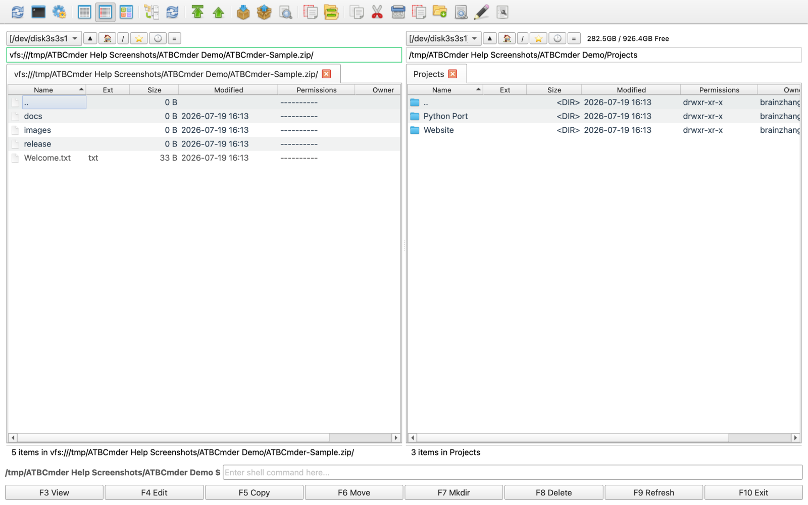
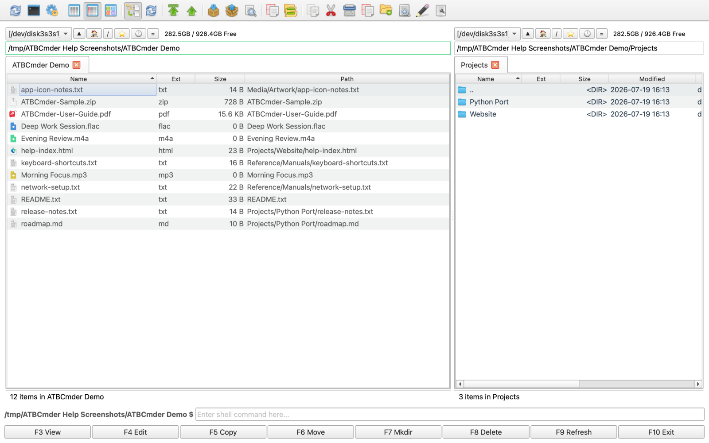
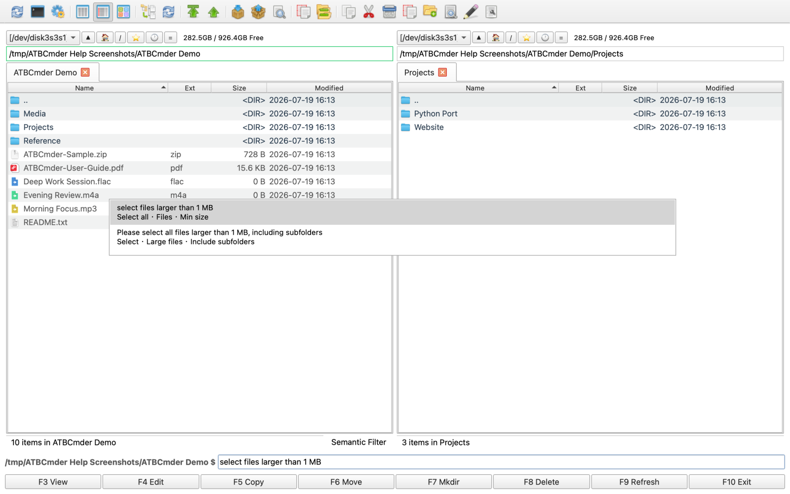

# 高级功能

ATBCmder 为进阶用户提供了一套强大的高级功能，涵盖虚拟文件系统以及 AI 辅助的语义命令等。本指南将解释如何充分利用这些工具来最大化您的生产力。

## 1. 网络虚拟文件系统（Network VFS）

ATBCmder 允许您像操作本地目录一样与远程文件系统进行交互。支持的协议包括 **FTP**、**SFTP**、**WebDAV** 和 **Samba**。

- **无缝集成**：连接成功后，远程文件将显示在标准文件面板中。您可以像在本地一样对文件进行复制、移动、删除和重命名操作。
- **异步传输**：网络操作在后台线程中执行，确保在传输大文件时界面保持流畅响应。
- **连接管理**：所有连接均经由安全方式管理。密码不会保存到 XML 配置文件中，以确保凭据安全。

## 2. 归档 VFS 与自动重包（Repacking）

压缩包被视作虚拟文件系统（`vfs://`），这意味着您无需事先解压，即可直接原生浏览 `.zip`、`.tar` 和 `.7z` 文件的内部内容。

- **原生浏览**：直接在文件面板中进入压缩包查看文件。
- **修改压缩包内容**：需要修改 `.zip` 压缩包内部的文件？直接打开并编辑该文件，ATBCmder 的 RepackWorker 会安全提取文件、等待您修改保存，然后自动为您重新打包更新。
- **冲突解决**：在解压或重打包过程中遇到文件冲突时，软件会弹出直观的对话框以优雅处理。

## 3. 分支视图（平铺视图）

有时您需要将某个目录及其所有子目录中的所有文件展示在单一的平铺列表中。

- **开关方式**：按 `Cmd+B` 即可为当前面板激活或关闭分支视图。
- **快速退出**：按 `Esc` 或 `Backspace` 可快速退出平铺视图，返回标准的目录浏览模式。
- **流式扫描**：目录扫描采用异步流式处理，即便扫描数万个文件也不会导致界面卡死。
- **路径列**：在分支视图下，系统会自动显示“路径”列，展示每个文件的相对目录。
- **配置选项**：可在设置中调节软限制与批量渲染大小，以获取最佳性能表现。

## 4. 自然语言命令（Semantic Command）

自然语言命令（Semantic Command）提供了一个自然语言交互界面，为文件过滤、选择与搜索带来了前所未有的强大体验。它充分利用了 macOS 的 Spotlight（`mdfind`）索引能力来实现极速搜索。

- **激活方式**：按 `/` 或 `Cmd+F` 即可在当前面板底部调出自然语言命令输入框。
- **自然语言输入**：输入类似于 *"选择所有大于 1MB 的文件"* 或 *"查找今天修改过的 PDF 文件"* 等自然语言指令。
- **搜索范围**：默认情况下搜索范围限定在当前目录。在命令前加上前缀 `//` 可进行全局 Spotlight 搜索（例如 `//today modified pdf`）。
- **帮助与历史**：
  - 输入 `/help` 查看支持的命令模板与示例列表。
  - 输入 `/history` 可重放最近使用过的自然语言命令。

## 5. 命令完整兼容性与高级配置

对于从 Double Commander 等经典双面板管理器迁移过来的用户，ATBCmder 保留了极高的灵活性。

- **Double Commander 快捷键**：默认情况下，ATBCmder 沿用了经典的 Double Commander 快捷键组合（`F5` 复制、`F6` 移动、`F7` 新建文件夹、`F8` 删除、`Tab` 切换面板等）。
- **内部命令**：提供超过 189 个内部 `cm_*` 命令，可映射至自定义快捷键、工具栏或菜单。
- **测试模式配置**：开发者与极客可以通过 `ATBCmder_test.sh` 脚本加载独立的 `.test_config` 配置运行 ATBCmder，方便您尝试新的快捷键或设置，而不会影响主配置。

---

**后续步骤**：掌握高级功能后，如果在使用中遇到任何非预期行为，请参阅我们的 [常见问题与操作指南](faq_howtos.md)。
