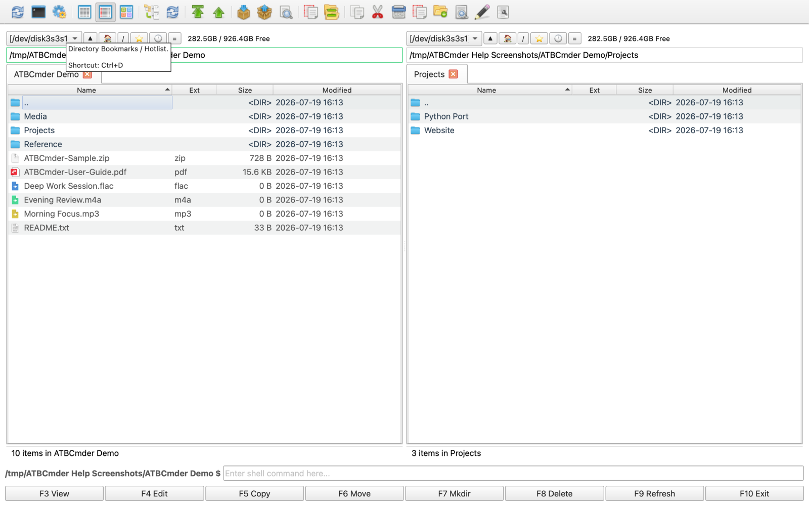

# 文件管理指南

本章节介绍 ATBCmder 的高级文件可视化、预览以及自动刷新功能。

## 媒体预览

当您在面板中选中文件并按下 `F3` 时，ATBCmder 会根据文件类型自动启动专属预览器。

### 音频播放器

专属音频播放器支持 `.mp3`、`.wav`、`.flac`、`.ogg`、`.m4a` 和 `.aac` 格式文件。
- **播放列表：** 自动构建播放列表。如果您选中多个文件，它们将被依次排队；如果仅选中单个文件，同目录下的其他音频文件将自动加入队列。
- **后台播放：** 您可以点击“后台播放”按钮最小化播放器。右侧面板中会显示后台播放指示器，方便您在继续工作的同时不间断聆听音乐。
- **追加模式：** 当播放器在后台运行时，选中更多音频文件并按 `F3` 会将其无缝追加到现有播放列表末尾。

### PDF 预览器

PDF 预览器采用一体化顶部工具栏设计，最大化利用您的垂直阅读空间。
- **视图控制：** 切换左侧书签面板的显隐，并在“单页”与“多页连续滚动”模式之间随意切换。
- **导航与缩放：** 使用工具栏快速翻页、跳转至指定页码以及调整缩放比例（包括适应宽度）。
- **全文搜索：** 内置搜索框支持快速查找文档内的具体文本。
- **无缝滚动：** 当鼠标悬停在书签面板上时，滚动操作会智能转发至文档视图，提供流畅自然的阅读体验。

## 缩略图

在浏览图片时，ATBCmder 会自动生成清晰的高质量缩略图，呈现顺畅直观的视觉体验。这使得您无需逐个打开文件即可快速识别照片与图形。

## 丰富悬停提示（Tooltips）

ATBCmder 拥有丰富详尽的悬停提示，帮助您快速熟悉界面。无论何时对某个按钮、菜单或输入框产生疑问，只需将鼠标悬停其上即可查看全面说明。
- **功能描述：** 解释该元素的作用。
- **触发条件 / 快捷键：** 显示相关联的键盘快捷键（例如 `Ctrl+D` 调出热键列表）。
- **高级帮助：** 深入阐述运作机制、占位符或特殊边界情况。

## 实时更新（自动刷新）

当磁盘内容发生变化时，文件面板会自动更新，确保您始终看到最新状态。此行为可在“设置（选项）”对话框的**自动刷新**分组中进行深度配置：
- **触发条件：** 您可以自定义当文件被创建、删除、重命名，或者文件大小、修改日期、属性发生变更时触发刷新。（属性变更采用高效轮询机制，轮询间隔可自定义，默认 5 秒）。
- **限制条件：** 为节省系统资源，您可以配置当 ATBCmder 处于后台时禁用自动刷新。您还可以设定排除路径和子目录列表，这些路径下的变更将永远不会触发自动刷新。
