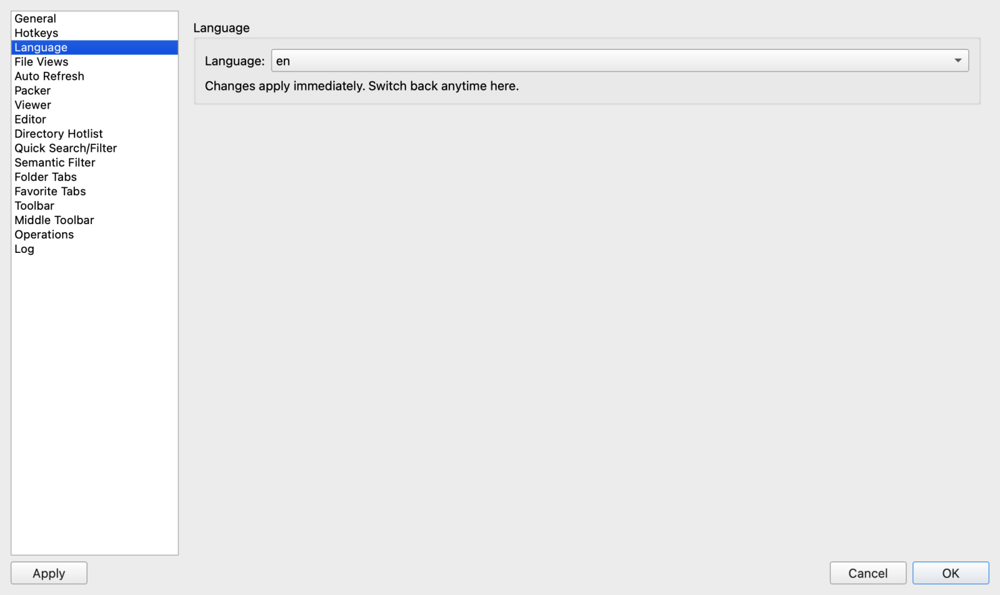

# 第 1 章：新手起步与 macOS 系统设置

欢迎使用 **ATBCmder**！作为一款专为 macOS 12+ 及 Apple Silicon 芯片（M1/M2/M3/M4，ARM64 架构；目前暂不支持 Intel x86_64 架构）深度定制的原生双面板文件管理器，ATBCmder 将正统双面板的高速操控、全键盘流畅切换和极致精确度带到了 Mac 平台。

本章将为您详细拆解双面板的核心理念，带您逐一熟悉界面核心功能分区，指导您通过内置授权向导授予 macOS 沙盒与磁盘访问权限，并提供关键的系统配置技巧，助您快速上手。

---

## 1. 快速入门：双面板设计哲学

如果您习惯了 macOS 自带的“访达 (Finder)”，平时很可能会打开一堆层叠重合的窗口，在凌乱的桌面上把文件拽来拽去，时刻提防着别把文件拖进旁边错误的子文件夹。

ATBCmder 采用经受了数十年检验的 **正统文件管理器 (Orthodox File Manager, OFM)** 模式：两侧并排展示两个完全独立、互为补充的文件夹面板。

```
┌─────────────────────────────────────────────────────────────────────────────────┐
│  当前激活面板 (源目录)                     对侧闲置面板 (目标目录)              │
│  /Users/username/Downloads                 /Volumes/BackupDrive/Projects        │
├─────────────────────────────────────┬───┬───────────────────────────────────────┤
│  名称               大小    修改时间│   │  名称                大小     修改时间│
│  ▸ [..]                     --:--   │ 复│  ▸ [..]                       --:--   │
│  ▸ Project_Assets   <目录>  昨天    │   │  ▸ 2025_Archive      <目录>   5月12日 │
│  ● release_notes.md 14.2 KB 今天    │ 制│  ▸ Website_V2        <目录>   8月28日 │
│  ● update_v1.7.pkg  84.5 MB 今天    │ ➔ │  ● config.yaml       3.2 KB   6月04日 │
│                                     │   │                                       │
│  [ 聚焦状态 / 醒目蓝色高亮边框 ]    │   │  [ 未聚焦 / 柔和暗淡轮廓边框 ]        │
└─────────────────────────────────────┴───┴───────────────────────────────────────┘
```

### 当前激活面板（源）与 对侧闲置面板（目标）

在 ATBCmder 中，所有操作的流向一目了然，绝无模糊：

1. **当前激活面板 (Active / Source)**：
   - 当前键盘焦点和光标所在的面板。
   - 您进行的选择、移动光标、重命名或查看，都会直接针对该面板进行。
   - **视觉提示**：当前面板拥有醒目的高亮聚焦外框（遵循 macOS 主题强调色）、标签页高亮文字，以及选中条目上的高亮光标。

2. **对侧闲置面板 (Inactive / Target)**：
   - 位于另一侧的面板。它始终常驻在屏幕上，展示着另一个独立的目录层级。
   - 当您在激活面板中发起文件复制或移动时，对侧面板就是**默认的目标位置**。
   - **视觉提示**：对侧面板边框柔和暗淡，未获得焦点，文字对比度适度调低。

### 操作方向准则：永远从“源”到“目标”

在 ATBCmder 中触发操作时，应用会自动理清流向：

- **复制 (`F5` / `Cmd+C` ➔ `Cmd+V`)**：将当前激活面板选中的文件，直接复制到对侧闲置面板正在展示的目录中。
- **移动 (`F6` / `Cmd+C` ➔ `Opt+Cmd+V`)**：将当前激活面板选中的文件移动到对侧面板，无需繁琐输入或寻找目标路径。
- **文件夹同步 (`Shift+F12` / `cm_SyncDirs`)**：直接比对左右两侧目录的异同。

> [!TIP]
> **无需鼠标小心翼翼拖拽**：在当前面板选中需要处理的文件，轻按 `F5`（复制）或 `F6`（移动），敲击 `Enter` 回车确认，传输立即开始。

### 面板切换与焦点控制快捷键

| 操作名称 | macOS 原生快捷键 | 传统 Commander 键 | 命令 ID | 功能说明 |
| :--- | :--- | :--- | :--- | :--- |
| **切换左右焦点** | `Tab` | `Tab` | `cm_FocusSwap` | 在左右两侧面板之间瞬间轮转键盘焦点 (`cm_SwitchPanel`)。 |
| **逆向切换焦点** | `Shift+Tab` | `Shift+Tab` | `cm_FocusSwap` | 逆向切换各控件与面板的焦点。 |
| **互换左右路径** | `Ctrl+U` | `Ctrl+U` | `cm_Exchange` | 保持标签页与选中状态不变，将左右两侧的目录路径对调。 |
| **中线居中平衡** | `双击分割条` | `双击分割条` | — | 自动将面板中间分割线重置为精准的 50/50 居中对等比例。 |

---

## 2. 界面功能分区详解

ATBCmder 基于 Qt6 与 PySide6 构建，深度遵循 Apple 人机交互指南 (HIG)，在提供现代优雅外观的同时，完整保留经典全键盘高效工作流。

```
┌─────────────────────────────────────────────────────────────────────────────────┐
│ [1] macOS 原生顶部菜单栏                                                        │
├─────────────────────────────────────────────────────────────────────────────────┤
│ [2] 顶部主工具栏  [ ↺ 刷新 ] [ 📋 复制 ] [ ✂ 剪切 ] [ 🗑 删除 ] ...            │
├─────────────────────────────────────┬───┬───────────────────────────────────────┤
│ [3] 路径面包屑导航 (左侧面板)       │   │ [3] 路径面包屑导航 (右侧面板)         │
│  / ▸ Users ▸ username ▸ Projects    │   │  /Volumes ▸ Backup ▸ Assets           │
├─────────────────────────────────────┤   ├───────────────────────────────────────┤
│ [4] 文件夹标签栏: [开发] [文档] [+] │[6]│ [4] 文件夹标签栏: [照片] [备份] [+]   │
├─────────────────────────────────────┤中 ├───────────────────────────────────────┤
│                                     │间 │                                       │
│ [5] 双文件列表面板 (左)             │工 │ [5] 双文件列表面板 (右)               │
│     - 虚拟化海量列表                │具 │     - 虚拟化海量列表                  │
│     - 名称、扩展名、大小、时间、权限│栏 │     - 名称、扩展名、大小、时间、权限  │
│     - 实时排序与通配符过滤          │&  │     - 实时排序与通配符过滤            │
│                                     │分 │                                       │
│                                     │割 │                                       │
│                                     │线 │                                       │
├─────────────────────────────────────┴───┴───────────────────────────────────────┤
│ [7] 底部状态栏与磁盘容量指示器                                                  │
│  选中 3 / 28 项 (已选 42.8 MB / 共 1.2 GB)  |  Macintosh HD: 218.4 GB 剩余可用  │
└─────────────────────────────────────────────────────────────────────────────────┘
```

### [1] macOS 原生顶部菜单栏
完全融入 macOS 系统顶栏。各项功能、显示开关、高级工具与设置项划分清晰：

- **文件 (File)**：新建标签页、关闭标签页、属性详情、沙盒文件系统授权、退出。
- **选择 (Mark)**：通配符选择组 (`Num+`)、取消选择组 (`Num-`)、反选 (`Num*`)、全选 (`Cmd+A`)。
- **命令 (Commands)**：常用目录书签 (`Ctrl+D`)、左/右驱动器列表 (`Alt+F1/F2`)、全局搜索 (`Alt+F7`)、文件夹同步 (`Shift+F12`)、左右互换 (`Ctrl+U`)、调出终端 (`Ctrl+J`)。
- **显示 (Show)**：多视图模式切换（简要、详细、缩略图、树状、平铺扁平视图）、工具栏显隐、水平双面板切换。
- **配置 (Configuration)**：偏好设置 (`Cmd+,`)、保存当前窗口位置与比例 (`cm_ConfigSavePos`)、保存标签页组。

### [2] 顶部主工具栏
紧贴窗口标题栏下方，提供一键直达的高频指令：

- **默认按钮组**：刷新 (`Ctrl+R`)、对侧快速预览 (`Ctrl+Q`)、复制 (`F5`)、移动 (`F6`)、新建文件夹 (`F7`)、删除 (`F8`)、搜索 (`Alt+F7`) 以及偏好设置 (`Cmd+,`)。
- **个性化定制**：在菜单栏 **显示** → **显示工具栏** 中可随时开启或隐藏工具栏以获取更大浏览视野；更可在偏好设置中自由调整图标尺寸（16px 到 48px）及文字标签。

### [3] 访达风格可交互路径面包屑栏
位于两侧面板顶部，让层级穿透与跳转轻而易举：

- **层级点击跳级**：点击面包屑中的任意祖先文件夹（例如 `/Users/username/Projects/ATBCmder` 中的 `username`），即可直接回退到该层。
- **子目录下拉速选**：鼠标悬停或点击两级之间的分隔箭头，即可弹出同级子文件夹下拉列表快速进入。
- **右键上下文菜单**：右键点击任意路径节点：
  - **在新标签页中打开**：保留当前面板，并在新标签中展开该上级目录。
  - **在访达中显示**：调用系统 Finder 揭示定位该文件夹 (`open -R`)。
  - **复制路径**：一键将该节点的绝对 UNIX 路径复制至剪贴板。
  - **在终端中打开**：直接在系统终端中以此目录作为工作路径启动 (`open -a Terminal`)。
- **地址栏直接编辑模式 (`BreadcrumbLineEdit`)**：双击面包屑栏右侧的空白区域，路径条将瞬间转换为文本输入框。您可直接粘贴或输入任意路径（例如 `/var/log`、`~/Library` 或 `vfs://` 压缩包虚拟路径），按回车立即直达，按 `Esc` 退出。

### [4] 文件夹标签页栏
两侧面板均拥有各自独立的标签页体系：

- 使用 `Cmd+T` (`cm_NewTab`) 新建标签页，使用 `Cmd+W` (`cm_CloseTab`) 随手关闭。
- 鼠标拖拽标签页可自由调整排布顺序。
- 右键点击标签页可执行锁定路径、重命名标签标题、关闭重复标签，或复制当前标签至对侧面板。

### [5] 双文件列表面板
高性能虚拟化列表渲染引擎，即使面对包含数十万条文件的巨型目录也能秒开滚动，绝无拖慢与卡顿：

- 自由排序：点击任意列标题（名称、类型、大小、修改日期、权限属性）即可按升序或降序实时重排。
- 多种视图模式：详细多列列表、简要紧凑网格、缩略图画廊视图、树状导航视图以及跨层级平铺展开的扁平视图 (`Cmd+B`)。

### [6] 垂直居中工具栏与可拖拽分割条
镶嵌在左右面板正中间的垂直操作条是 ATBCmder 的标志性特性之一，将一键快捷操作与灵活比例调节完美融合：


- **垂直快捷操作条**：汇聚日常高频文件操作按钮：
  - `cm_Copy`（复制）
  - `cm_Move`（移动 / 剪切）
  - `cm_Delete`（删除至废纸篓）
  - `cm_MkDir`（新建文件夹）
  - `cm_Rename`（行内快速改名）
  - `cm_View`（全能查看器）
  - `cm_Edit`（代码/文本编辑器）
  - `cm_Exchange`（对调左右面板路径）
  - `cm_SyncDirs`（文件夹双向同步）
  - `cm_FileSearch`（多功能高级搜索）
- **平滑拖拽分割**：将鼠标指针移至中间栏边缘，指针自动变为左右分栏调节箭头 (`SplitHCursor`)。按住并左右拖拽即可随意微调两侧面板的宽度配比。
- **Stylish 现代主题一键预设**：在选用 Stylish 现代主题时，中间条集成有胶囊分段按钮，支持一键吸附至 **50/50**（等宽）、**70/30**（主面板突出）或 **30/70**（对侧面板突出）。
- **个性化设置**：可在 **偏好设置** (`Cmd+,`) → **工具栏** → **中间工具栏** 中随心开启或关闭中间工具栏、缩放按钮尺寸，或在现代扁平与复古立体样式间自由切换。

### [7] 状态栏与磁盘容量指示器
常驻在窗口最底端：

- **实时统计指标**：显示当前激活面板中的文件与文件夹总数、目录总容量、已选中项数量及已选合并字节大小。
- **磁盘容量柱状条**：直观展示当前挂载磁盘的卷名称（如 `Macintosh HD`）、总容量、已用空间以及剩余可用空间的生动百分比示意条。

---

## 3. 实战配置：macOS 沙盒安全机制与全盘文件授权

现代 macOS 引入了严苛的 App Sandbox 应用沙盒隔离机制，以防止流氓软件非法侵入用户数据。在运行 ATBCmder（特别是从 Mac App Store 下载安装或启用了沙盒编译的版本）时，应用默认被隔离在受限的独立容器目录中：
`~/Library/Containers/com.aitobox.atbcmder/Data`

默认状态下，沙盒应用无法随意遍历或修改容器外部的文件，除非用户通过 Apple 原生的安全文件选择面板明确授权。

ATBCmder 内置了 **安全范围书签 (Security-Scoped Bookmarks)** 技术，让您只需一次性授权，即可在日后所有使用过程中持久、自由地访问全盘文件。

### 认识“安全范围书签 (Security-Scoped Bookmarks)”

当您通过 macOS 原生 `NSOpenPanel` 选中并确认某个文件夹时：

1. macOS 系统将签发一份加密的 **安全范围书签**（Security-Scoped Bookmark）。
2. ATBCmder 会将该凭据保存在本地配置目录中：
   `~/Library/Application Support/ATBCmder/sandbox_bookmarks.plist`
3. 每次启动应用时，ATBCmder 会自动加载并激活这些书签凭据。
4. 一旦授权成功，您以后再也无需重复确认这些目录。

### 手把手授权向导：使用 `cm_GrantFilesystemAccess`

在首次启动应用或任何需要的时候，按照以下步骤完成配置：

#### 第 1 步：唤出授权向导窗口
在顶部菜单栏中，点击 **文件**（或 **帮助**）→ **授予文件系统访问权限…**，或执行内部指令 `cm_GrantFilesystemAccess`，弹出授权对话框：

```
┌─────────────────────────────────────────────────────────────┐
│  授予文件系统访问权限                                   [x] │
├─────────────────────────────────────────────────────────────┤
│  本版本 ATBCmder 运行在安全的 macOS 沙盒环境中。为了正常    │
│  管理全盘文件，需要您的明确授权。                           │
│                                                             │
│  [  授权根目录 (/) 访问权限  ]                              │
│                                                             │
│  [  授权外置磁盘 (/Volumes) 访问权限  ]                     │
│                                                             │
│  [  打开系统“完全磁盘访问权限”设置…  ]                      │
│                                                             │
│  根目录授权用于满足 App Sandbox 沙盒规范。                  │
│  完全磁盘访问权限为 macOS 隐私保护机制所必需。              │
│                                                   [ 完成 ]  │
└─────────────────────────────────────────────────────────────┘
```

#### 第 2 步：授予系统根目录 (`/`) 访问权限
1. 点击 **“授权根目录 (/) 访问权限”** 按钮。
2. ATBCmder 将弹出 macOS 原生的选择器面板，并默认选中系统主硬盘 `Macintosh HD` (`/`)。
3. 点击右下角 **“授权访问”**（或“打开”）。
4. 按钮随即更新为 **“根目录访问权限已授予 ✓”** 并置灰锁定。
5. **授权效果**：授予根目录 `/` 访问权后，会自动覆盖其下方所有的用户目录（包括 `~/Documents`、`~/Downloads`、`~/Desktop`、`~/Projects` 以及 `/Applications` 等），因为安全范围书签会自动向下递归继承授权。

#### 第 3 步：授予外置磁盘 (`/Volumes`) 访问权限
1. 点击 **“授权外置磁盘 (/Volumes) 访问权限”** 按钮。
2. 在弹出的原生窗口中确认选中 `/Volumes`，点击 **“授权访问”**。
3. 按钮随即更新为 **“外置磁盘访问权限已授予 ✓”**。
4. **授权效果**：解锁对外接移动硬盘、USB 闪存盘、SD 卡、DMG 镜像挂载点以及局域网 SMB/NFS/AFP 网络共享盘的读写权限。

#### 第 4 步：选择性单独授权文件夹（灵活替代方案）
如果您不想直接授予广泛的根目录访问权限，完全可以跳过前两步：

- 当您通过 ATBCmder 首次浏览未授权的目录时，应用会自动捕获权限边界，并弹出按需授权提示：
  `ATBCmder 需要您的授权以访问：/Users/username/PrivateFolder`
- 点击“授予文件夹访问权限”，在系统面板中确认后，该目录将被单独永久书签化。

#### 第 5 步：开启“完全磁盘访问权限 (Full Disk Access)”以管理受保护的个人数据

> [!IMPORTANT]
> **沙盒书签与完全磁盘访问权限 (FDA) 的区别**：
>
> - **沙盒书签**：满足 macOS 应用沙盒对常规文件、文件夹及外部磁盘的读写要求。
> - **完全磁盘访问权限 (FDA)**：属于 macOS TCC 隐私安全策略，用于保护高度私密的系统数据（如 Safari 历史记录、邮件附件、备忘录、Time Machine 备份及各类系统级缓存）。
> 
> 若您需要管理此类受系统级保护的隐私文件夹：
>
> 1. 在向导窗口中点击 **“打开系统‘完全磁盘访问权限’设置…”**。
> 2. 系统将自动前往 **系统设置** → **隐私与安全性** → **完全磁盘访问权限**。
> 3. 点击锁标或通过 Touch ID 验证身份。
> 4. 找到 **ATBCmder** 并确保右侧的开关处于 **开启** 状态。

### 如何撤销或重置授权

如需重置所有沙盒授权书签：

1. 点击菜单栏 **配置** → **打开配置目录** (`cm_OpenConfigDirectory`)。
2. 找到并删除 `sandbox_bookmarks.plist` 文件。
3. 重启 ATBCmder 即可。
4. 若需重置 macOS 系统级的 TCC 权限记录，在终端执行：
   ```bash
   tccutil reset SystemPolicyAllFiles com.aitobox.atbcmder
   ```

---

## 4. 多语言设置与主题外观定制

ATBCmder 全面支持多语言本地化并深度契合 macOS 的视觉风格。

### 多语言动态切换

ATBCmder 内置支持 **30+ 种主流语言**，包括简体中文、繁体中文、英语、德语、法语、西班牙语、俄语、日语、韩语、意大利语等。



- **自动跟随系统语言**：默认情况下，ATBCmder 会自动识别您 macOS 系统的当前语言环境 (`AppleLanguages`) 并呈现匹配的本地化界面。
- **手动选择语言**：
  1. 按 `Cmd+,` 或执行 `cm_Options` 打开偏好设置。
  2. 在左侧导航栏中选择 **语言 (Language)**。
  3. 在下拉列表中选取目标语言。
- **实时免重启热重载**：与许多修改语言后必须重启的传统 Mac 软件不同，ATBCmder 支持即时热更新——只要在下拉框中选定新语言，所有菜单、按钮提示、状态信息与对话框文本均会即刻完成热替换。

### 外观与深浅色模式

ATBCmder 完美适配 macOS 深浅色外观：

- **随系统外观自动切换**：当您的 Mac 根据日落时间或控制中心在浅色与深色模式间切换时，ATBCmder 会平滑同步变色。
- **特色主题风格**：
  - **Fusion / macOS 原生风格**：经典的桌面设计，完整还原 macOS 强调色高亮与原生视觉通透感。
  - **Stylish 现代时尚风格**：融入现代胶囊控件、精致分割阴影与平滑微动效。
  - **深色模式调色板**：采用纯正炭黑底色（`#2C2C2E` / `#242426`），配合高对比度文字排版与定制文件夹图标，有效缓解暗光环境下的视觉疲劳。
  - **浅色模式调色板**：清爽明亮的白灰色调（`#FAFBFD` / `#EEF2F7`），线条清晰分明。

---

## 5. ⚡ 高级技巧：个性化布局与工作区持久化

充分释放 ATBCmder 灵活的布局潜力，为外接大屏、带鱼屏或垂直旋转显示器定制专属工作空间：

### 技巧 1：锁定保存窗口位置与面板比例 (`cm_ConfigSavePos`)

当您精心调整好窗口大小、拖拽分割线设定好黄金比例后，可以将此布局固定为默认启动状态：

1. 调整好 ATBCmder 窗口大小以及左右面板的分割比例。
2. 点击菜单栏 **配置** → **保存当前位置与布局**，或执行内部指令：
   ```
   cm_ConfigSavePos
   ```

3. 窗口尺寸、屏幕坐标、最大化状态与分割线比例将立即固化写入 `atbcmder.xml`。
4. 在 **偏好设置** → **布局** 中勾选 **“退出时自动保存窗口位置”**，即可让软件持续记忆每次关闭前的最后状态。

### 技巧 2：一键切换上下水平双面板 (`cm_HorizontalFilePanels`)

左右垂直分栏是文件操作的标准布局，但**上下堆叠水平分栏**在很多特殊场景下具有不可替代的优势：

- 面对超长文件名，需要横向展开完整阅读时；
- 需同时比对权限、所属用户、MD5 校验值等多列超宽属性时；
- 在竖屏旋转显示器或平板设备上工作时。

切换方法极其简单：

1. 点击菜单栏 **显示** → **水平双面板**，或执行命令：
   ```
   cm_HorizontalFilePanels
   ```

2. 开启后：
   - 双面板立即变为上下排布（上方主面板与下方副面板）。
   - 中间快捷工具栏自动旋转为横向水平栏，稳稳镶嵌在上下两层之间。
   - 鼠标悬停在中线时自动变为上下拖动指针 (`SplitVCursor`)，让您随心调整上下高度比例。

### 技巧 3：中间分割线快速吸附

- **秒级 50/50 归中**：在中间工具栏或分割线上任意位置**双击鼠标**，两侧面板立即精准恢复对等 50% 宽度。
- **常用比例切换**：在 Stylish 主题下，点击中间条上的胶囊按钮可快速在 `50:50`、`70:30`（左侧突出）或 `30:70`（右侧突出）之间无缝切换。

### 技巧 4：智能全局会话记忆与工作区自动还原

ATBCmder 内置强劲的会话管理系统 (`SessionManager`)，确保每一次重新打开应用，都能无缝接续上次的工作状态：

- **自动持久化存储**：会话状态实时沉淀在配置目录中的 `atbcmder_session.xml` 文件中。
- **全方位空间记忆**：精准恢复窗口屏幕坐标 (`x`, `y`)、长宽尺寸、最大化状态以及左右面板的分割线配比 (`splitter_ratio`)。
- **标签页群组无感重现**：
  - 重启后自动还原左右两侧面板中打开的**全部标签页**。
  - 准确记忆退出前正处于激活状态的标签页索引。
  - 自动还原每个标签页对应的深层目录路径，彻底免去手动一层层重新点击寻找项目的烦恼。
- **设定初始默认位置**：通过菜单栏 **配置 ➔ 保存当前位置** (`cm_ConfigSavePos`)，您还可以随时将当前状态设为今后的基准默认模板。

---

## 6. 避坑指南：Mac 键盘功能键 (`Fn`) 正确配置

如果您曾经在 PC 键盘上使用过 Total Commander 或 Double Commander，您的手指通常习惯了第一排功能键的肌肉记忆（`F3` 查看、`F4` 编辑、`F5` 复制、`F6` 移动、`F7` 新建、`F8` 删除）。

但在 Mac 原生键盘上，这排按键在出厂默认状态下有着不同的行为。

> [!WARNING]
> ### 🍎 macOS 功能键硬件功能冲突预警
> 在 Apple 键盘（包括 MacBook 自带键盘与妙控键盘 Magic Keyboard）上，最顶排按键出厂默认被分配为 **macOS 专用硬件功能**（屏幕亮度、调度中心、聚焦搜索、听写、勿扰模式、多媒体快进暂停以及系统音量）。
> 
> 如果您在一台未做配置的 MacBook 上直接按下 `F5`，系统很可能会调节键盘背光亮度或启动听写，而不是复制文件！

### 方案 A：按住 `Fn`（或地球仪 🌐 键）组合触发（默认体验）
若您希望完整保留 Apple 顶栏原生的音量与亮度调节功能：

- 在按下对应功能键的同时，长按左下角的 **`Fn`**（或地球仪 🌐 键）：
  - `Fn+F3`：全能查看器
  - `Fn+F4`：内置代码/文本编辑器
  - `Fn+F5`：复制文件至对侧
  - `Fn+F6`：移动文件至对侧
  - `Fn+F7`：新建文件夹
  - `Fn+F8`：安全删除至废纸篓

### 方案 B：全局启用“标准功能键”（强烈推荐）
若您追求原汁原味、单键极速响应的 Commander 操控快感，无需每次按住 `Fn`：

1. 点击屏幕左上角 Apple 图标（），打开 **系统设置**。
2. 在左侧菜单中选择 **键盘**。
3. 点击右侧的 **键盘快捷键…** 按钮。
4. 在左侧列表中选中 **功能键**。
5. 打开开关：**“将 F1、F2 等键用作标准功能键”**。

```
┌─────────────────────────────────────────────────────────────┐
│  键盘快捷键                                                 │
├──────────────────┬──────────────────────────────────────────┤
│  启动台与程序坞  │  将 F1、F2 等键用作标准功能键            │
│  显示器          │                                          │
│  调度中心        │  [ 开启 ───● ]                           │
│  键盘            │                                          │
│  输入法          │  开启此选项后，按住 Fn 键即可使用各个按  │
│  截屏            │  键上印制的多媒体控制功能。              │
│ ▸ 功能键         │                                          │
│  App 快捷键      │                                          │
└──────────────────┴──────────────────────────────────────────┘
```

开启此设置后：

- 直接敲击 `F1`–`F12` 即可瞬间触发 ATBCmder 的全套核心指令。
- 若偶尔需要调节屏幕亮度或音量，只需按住 `Fn` 再按下对应键即可，两全其美。

---

## 7. 双矩阵高频核心快捷键速查表

ATBCmder 全面支持双矩阵快捷键生态：您既可以使用原汁原味的 macOS 快捷键（`Cmd ⌘` 修饰键），也可以使用经典的 Commander 功能键（`Fn`），两者并行不悖。

| 核心操作 | 命令 ID | macOS 原生快捷键 (`Cmd ⌘`) | 经典 Commander 键 (`Fn`) | 功能描述 |
| :--- | :--- | :--- | :--- | :--- |
| **常用目录书签呼出** | `cm_DirHotList` | `Cmd+D` / `⌘D` | `Ctrl+D` / `⌃D` | 秒级呼出常用目录书签面板，支持模糊匹配即时直达。 |
| **驱动器切换 (左 / 右)** | `cm_LeftOpenDrives` / `cm_RightOpenDrives` | `⌥F1` / `⌥F2` (`⌥D`) | `Alt+F1` / `Alt+F2` (`Alt+D`) | 呼出左侧或右侧面板挂载驱动器与卷宗列表（`Alt+D` 为当前激活面板）。 |
| **复制文件** | `cm_Copy` | `Cmd+C` ➔ `Cmd+V` | `F5` (或 `Fn+F5`) | 将选中文件从当前激活面板复制到对侧目标面板。 |
| **移动文件** | `cm_Move` | `Cmd+C` ➔ `Opt+Cmd+V` | `F6` (或 `Fn+F6`) | 将选中文件从当前激活面板移动到对侧目标面板。 |
| **全能查看** | `cm_View` | `Space` / `Cmd+Y` | `F3` (或 `Fn+F3`) | 在全能查看器中预览文件（代码、Hex、图片、PDF、音视频等）。 |
| **对侧快速预览** | `cm_QuickView` | `Cmd+Q` / `Ctrl+Q` | `Ctrl+Q` | 直接在对侧面板中实时开启动态快速预览。 |
| **编辑文件** | `cm_Edit` | `Cmd+E` | `F4` (或 `Fn+F4`) | 在内置代码/文本编辑器中打开并修改文件。 |
| **新建文件夹** | `cm_MkDir` | `Shift+Cmd+N` | `F7` (或 `Fn+F7`) | 在当前面板中快速创建新文件夹。 |
| **删除至废纸篓** | `cm_Delete` | `Cmd+Backspace` | `F8` (或 `Fn+F8`) | 安全将选中文件移至 macOS 系统废纸篓。 |
| **行内快速重命名** | `cm_Rename` | `Return` (回车) | `F2` / `Shift+F6` | 原地对当前光标高亮的文件名执行修改。 |
| **切换左右面板** | `cm_FocusSwap` | `Tab` | `Tab` | 瞬时轮转切换键盘焦点至对侧面板 (`cm_SwitchPanel`)。 |
| **互换左右路径** | `cm_Exchange` | `Ctrl+U` | `Ctrl+U` | 保持标签状态，调换左右面板的当前目录路径。 |
| **新建标签页** | `cm_NewTab` | `Cmd+T` | `Ctrl+T` | 在当前面板中开启一个新的目录标签页。 |
| **关闭标签页** | `cm_CloseTab` | `Cmd+W` | `Ctrl+W` | 随手关闭当前面板的活动标签页。 |
| **水平分栏模式** | `cm_HorizontalFilePanels` | 菜单: 显示 ➔ 水平双面板 | 菜单: 显示 ➔ 水平双面板 | 在左右垂直分栏与上下水平分栏排布间自由切换。 |
| **保存当前布局** | `cm_ConfigSavePos` | 菜单: 配置 ➔ 保存位置与布局 | 菜单: 配置 ➔ 保存位置与布局 | 固化当前窗口长宽尺寸与中线分割比例。 |
| **沙盒系统授权** | `cm_GrantFilesystemAccess` | 菜单: 文件 ➔ 授予权限 | 菜单: 文件 ➔ 授予权限 | 启动 macOS App Sandbox 安全范围文件授权向导。 |
| **偏好设置** | `cm_Options` | `Cmd+,` | `Alt+O` | 打开 ATBCmder 综合偏好设置配置中心。 |

---

## 下一步探索

现在您已经掌握了双面板核心模型并完成了 macOS 环境配置，接下来请前往 **[第 2 章：导航、标签页与视图模式](navigation_and_tabs.md)**，深入掌握秒级目录遍历、多标签页高效组织、保存常用工作区组合、常用目录热键书签以及跨层级递归展开的扁平视图！
