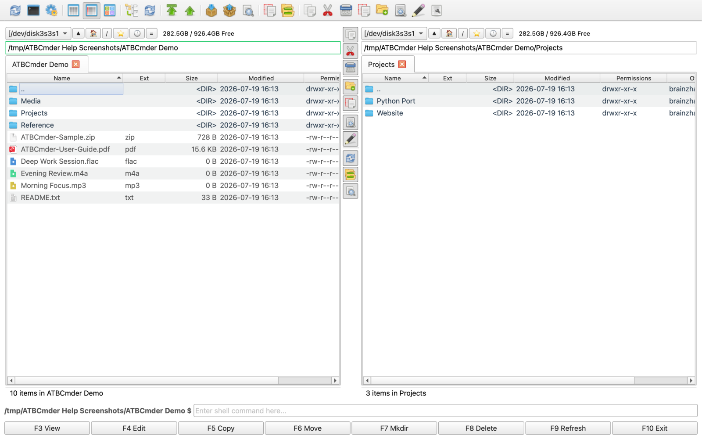

# 欢迎使用 ATBCmder

> **macOS 强大的双面板文件管理器**  
> 以专业工具的效率与实力，快速导航、管理并处理您的所有文件。

---

## 核心功能亮点

* **🗂 双面板高效管理** — 左右双面板同步并排，极其顺畅地比对与传输文件。
* **🌐 网络虚拟文件系统 (VFS)** — 支持 FTP、SFTP、WebDAV 与 Samba，远程文件操作体验如同本地文件。
* **📦 归档虚拟文件系统 (VFS)** — 无需预先解压，即可直接浏览与编辑 ZIP、TAR、7z 压缩包。
* **✨ 语义化智能命令** — 结合 macOS Spotlight 搜索技术，支持自然语言检索文件。
* **🌿 分支视图 (Branch View)** — 一键平铺展开深层嵌套目录中的所有子文件。
* **🌍 30+ 语言多国语言** — 自动跟随您的 macOS 系统语言环境。

---

## 界面与功能预览

  
*通过语义化命令使用自然语言快速搜索文件。*

  
*分支视图：一键将多层嵌套文件夹内的所有文件平铺显示。*

  
*中间工具栏：快捷访问核心常用命令与操作。*

---

## 文档目录与快速指引

欢迎查阅 ATBCmder 官方使用手册！无论您是初次上手的新手，还是探索进阶技巧的高级用户，都可以通过以下章节快速开始：

### 🚀 [快速入门](getting_started.md)
了解双面板核心设计理念、掌握主工具栏与中间工具栏操作，以及设置多语言界面。

### 🧭 [高效导航指南](navigation.md)
掌握目录树视图、标签页管理、收藏夹与热键列表、快速搜索以及常用快捷键。

### 📁 [文件管理指南](file_management.md)
使用内置音频播放器与 PDF 预览器、查看高清缩略图与丰富悬停提示，享受自动刷新体验。

### ⚡ [高级功能（面向进阶用户）](advanced_features.md)
连接远程服务器 (Network VFS)、直接管理压缩包 (Archive VFS)、展开多层目录 (Branch View) 及使用语义化搜索。

### ❓ [操作指南与常见问题](faq_howtos.md)
针对连接 FTP、解压 ZIP、播放音频等常见场景的步骤指引与 FAQ。

### 🔒 [隐私政策](privacy_policy.md)
了解我们关于零数据收集与全本地运行的隐私安全承诺。

---

[前往 App Store 下载](https://apps.apple.com/app/atbcmder/idXXXXXXXX) *(即将推出)* &nbsp;|&nbsp; [开始阅读快速入门 &rarr;](getting_started.md)
