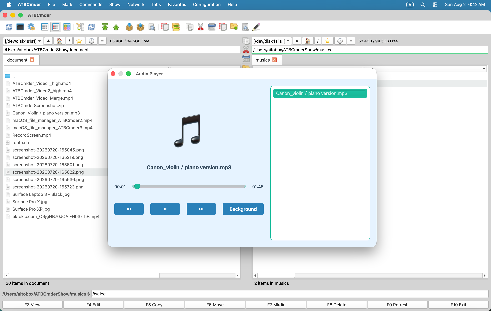

# 第 4 章：全能查看器与内置编辑器

在正统双面板文件管理体系中，工作效率在很大程度上取决于**文件的审视与微调速度**。仅仅为了验证一个哈希值、查阅一行配置文件、裁剪一张截图或翻看一份 PDF，就不得不启动庞大笨重的集成开发环境 (IDE) 或外部大型软件，不仅极大地消耗内存，还会造成大量窗口堆叠的认知负担。

ATBCmder 通过在应用程序内核中直接集成一套多引擎、高性能的**全能查看与编辑子系统**彻底解决了这一痛点。无论是在左右面板之间巡航时的低延迟无感即时预览、深入二进制字节底层的 Hex 模式、在整理文件时在后台静默播放的音乐播放器，还是具备语法高亮与原子级安全写入的代码编辑器，均可通过纯键盘瞬时召唤。

---

## 1. 快速上手：即时文件审视与编辑

ATBCmder 将文件的检查与修改划分为两大清晰模式：

1. **对侧面板快速预览 (`Cmd+Q` / `Ctrl+Q`)**：直接在闲置的对侧面板内嵌入防抖实时视图，无需弹出任何独立浮动窗口。
2. **独立全能查看器 (`F3`) 与内置编辑器 (`F4`)**：唤起功能完备的独立顶级窗口，支持专项渲染引擎、全文检索、多媒体播放与代码着色。

```
┌────────────────────────────────────────────────────────────────────────────────────────┐
│  激活面板 (文件列表浏览)                            对侧闲置面板 (快速预览 Quick View) │
│  /Users/brain/Projects/atbcmder/src                 [正在快速预览: main.py]            │
├──────────────────────────────────────────────┬───┬─────────────────────────────────────┤
│  名称                         大小   修改时间│   │ 0001: """                           │
│  ▸ [..]                              --:--   │ Q │ 0002: 主程序入口入口文件            │
│  ✔ main.py                    8.4 KB 15:10   │ U │ 0003: """                           │
│  ● config.xml                12.1 KB 14:20   │ I │ 0004: import sys                    │
│  ● hero_banner.png          248.5 KB 09:12   │ C │ 0005: from PySide6.QtWidgets import │
│  ● sample_invoice.pdf       512.0 KB 11:30   │ K │ 0006:     QApplication              │
│  ● release_theme.mp3          4.2 MB 16:45   │   │                                     │
│  ● firmware_dump.bin          1.0 MB 10:00   │ V │ [UTF-8] [Python] [LF] [行 1/140]    │
├──────────────────────────────────────────────┴───┴─────────────────────────────────────┤
│   [Cmd+Q / Ctrl+Q] 开启/关闭快速预览   [F3] 全能查看器   [F4] 内置轻量代码/图像编辑器  │
└────────────────────────────────────────────────────────────────────────────────────────┘
```

### 核心预览与编辑双矩阵速查表

| 操作功能 | macOS 原生快捷键 | 经典 Commander 键位 | 命令标识 (Command ID) | 功能说明 |
| :--- | :--- | :--- | :--- | :--- |
| **切换快速预览** | `Cmd+Q` / `⌘Q` | `Ctrl+Q` | `cm_QuickView` | 在对侧闲置面板中即时开启/关闭实时文件预览 |
| **全能查看器** | `F3` / `Fn+F3` | `F3` | `cm_View` | 在独立窗口中打开所选文件（只读多引擎预览） |
| **内置双模编辑器** | `F4` / `Fn+F4` | `F4` | `cm_Edit` | 文本自动进代码编辑器，图片自动进图像编辑器 |
| **新建并编辑文件** | `Shift+F4` / `⇧F4` | `Shift+F4` | `cm_EditNew` | 输入文件名，创建新文件并立即打开编辑 |
| **切换面板与翻转** | `Tab` / `⇥` | `Tab` | `cm_SwitchPanel` | 切换面板焦点，同时将快速预览对称镜像翻转 |
| **十六进制 Hex 模式**| `2` | `2` | — *(Lister 内部)* | 在查看器中瞬间切换为字节级 Hex 十六进制检视 |
| **纯文本模式** | `1` | `1` | — *(Lister 内部)* | 退出 Hex 模式，恢复格式化文本显示 |
| **自动折行切换** | `Alt+W` / `⌥W` | `Alt+W` | — *(Lister/Editor)* | 切换长行文本自动软折行显示 |
| **行号显隐切换** | `Alt+L` / `⌥L` | `Alt+L` | — *(Lister/Editor)* | 开启或隐藏左侧代码行号槽 |
| **实时日志跟踪模式**| `F5` / `Fn+F5` | `F5` | — *(Lister 内部)* | 实时流式捕获追加的日志输出 (类似 tail -f) |
| **后台音乐播放** | 点击 `后台播放` 按钮 | — | — | 将音频播放器无缝折叠至右侧面板状态栏中持续播放 |
| **配置文件关联** | 菜单: 配置 | — | `cm_FileAssoc` | 自定义扩展名对应调用的外部工具与宏参数 |

---

## 2. 对侧面板快速预览 (`Cmd+Q` / `Ctrl+Q` / `cm_QuickView`)

**对侧快速预览 (Quick View)** 是双面板管理器的效率王牌之一。无需频繁打开和关闭浮动窗口，当你在一侧文件夹中顺次翻阅成百上千张文件时，对侧面板会自动变为一个随光标联动的沉浸式视口。

  
*图 4.1：嵌入对侧面板的快速预览视图，一边浏览目录一边实时展现代码语法高亮。*

### 2.1 双面板协同预览优势

开启快速预览的工作流程：

1. 在当前激活面板中移动光标选定任意文件或文件夹。
2. 按下 **`Cmd+Q`**（`⌘Q`）或 **`Ctrl+Q`**（`cm_QuickView`）。
3. 对侧闲置面板即刻退出原有的文件列表，转变为 **快速预览容器 (`QuickViewContainer`)**，直接渲染光标所在文件的真实内容。
4. 再次按下 `Cmd+Q` 或 `Ctrl+Q`，即可一键关闭预览，对侧面板瞬间无损恢复原先的标签页与文件夹列表。

### 2.2 100 毫秒防抖动极速巡航

当长按键盘 `↑` 或 `↓` 键在海量目录中快速滚动时，普通的预览组件极易造成主界面严重卡顿甚至剧烈的磁盘寻道风暴。

ATBCmder 内置了精密调优的 **100 毫秒单次防抖定时器 (`_quick_view_timer`)**：

- 当光标在行间疾速掠过时，系统仅在内存中暂存目标路径；
- 只有当光标在某个条目上稳定停留超过 100 毫秒时，底层才会触发文件读取、语法树解析或多媒体解码；
- 即便翻阅几千张高像素 RAW 照片或巨型数据转储，列表依然能稳定保持 60+ FPS 的丝滑体验。

### 2.3 按 `Tab` 键实现对称镜像翻转 (Symmetric Focus Flipping)

在许多传统软件中，一旦切换面板焦点，原有的预览就会中断消失。ATBCmder 首创了**对称镜像翻转引擎**：

- 假设快速预览正在**右面板**呈现，此时你按下 **`Tab`** 键将键盘焦点转移至右侧：
  1. 右面板会瞬间退出预览模式，无缝还原为可交互的文件表格，供你挑选文件；
  2. 快速预览视图会**自动镜像切换至左面板**，实时展示右面板光标当前高亮的文件！
- 无论焦点落在左栏还是右栏，整个浏览审阅流程永不中断。

### 2.4 智能格式路由机制

快速预览容器会智能检测扩展名、MIME 类型以及二进制魔数头部，将数据精准派发给最佳渲染引擎：

| 文件类型分类 | 常见扩展名与魔数签名 | 嵌入式渲染引擎 |
| :--- | :--- | :--- |
| **源码与文本文件** | `.py`, `.rs`, `.cpp`, `.c`, `.h`, `.js`, `.ts`, `.html`, `.css`, `.json`, `.xml`, `.yaml`, `.md` 及纯文本 | `TextPanel`：带 Pygments 语法高亮与行号。 |
| **栅格与矢量图像** | `.png`, `.jpg`, `.jpeg`, `.webp`, `.svg`, `.bmp`, `.gif`, `.ico`, `.tiff` | `ImagePanel`：平滑双线性缩放并保持宽高比。 |
| **PDF 电子文档** | `.pdf` | `PdfPanel`：基于原生 `PySide6.QtPdf` 渲染（自适应宽度）。 |
| **音视频多媒体** | `.mp3`, `.wav`, `.flac`, `.aac`, `.m4a`, `.ogg`, `.mp4`, `.mkv`, `.mov`, `.avi`, `.webm` | `MediaPanel`：静音轻量预览并提供播放进度条。 |
| **二维数据表格** | `.csv`, `.tsv`, `.xlsx`, `.xls`, `.ods` | `SpreadsheetPanel`：只读网格并支持列宽自适应。 |
| **办公文档与电子书**| `.docx`, `.odt`, `.rtf`, `.epub` | `DocumentPanel` / `EpubPanel` 富文本文档引擎。 |
| **轻量级数据库** | `.sqlite`, `.sqlite3`, `.db` | `SqlitePanel`：表结构大纲树与数据表直读。 |
| **压缩归档包** | `.zip`, `.tar`, `.gz`, `.bz2`, `.xz`, `.7z` | `ArchiveInspectorPanel`：直观展示内部未解压目录层级。 |

### 2.5 文件夹属性与兜底面板 (`QuickViewPropertiesWidget`)

当你把光标移动到文件夹目录、或遇到完全未知的专有二进制文件时，快速预览会自动无缝降级为**元数据属性面板**：

```
┌────────────────────────────────────────────────────────┐
│  📁 release_builds                                     │
│  /Volumes/ExternalSSD/Projects/release_builds          │
├────────────────────────────────────────────────────────┤
│  元数据信息                                            │
│    绝对路径:    /Volumes/ExternalSSD/...               │
│    占用大小:    文件夹目录 (共 148,290,112 字节)       │
│    修改时间:    2026-09-06 14:10:22                    │
│    访问时间:    2026-09-06 15:02:18                    │
├────────────────────────────────────────────────────────┤
│  UNIX 权限矩阵 (chmod)                                 │
│    八进制模式:  0755                                   │
│    所有者:      [✔] 读取  [✔] 写入  [✔] 执行           │
│    所属群组:    [✔] 读取  [ ] 写入  [✔] 执行           │
│    其他人:      [✔] 读取  [ ] 写入  [✔] 执行           │
├────────────────────────────────────────────────────────┤
│  统计与哈希校验                                        │
│    包含内容:    42 个文件, 8 个子文件夹                │
│    MD5 摘要:    正在异步计算... ➔ 8f14e45fceea167a...  │
│    SHA256:      正在异步计算... ➔ 3a491d90bc1f4201...  │
└────────────────────────────────────────────────────────┘
```

- **标头信息卡**：展示高保真系统图标、名称及父级路径。
- **精确元数据**：显示单字节大小与人类易读规格（`KB`, `MB`, `GB`）、修改时间 (`mtime`) 与访问时间 (`atime`)。
- **UNIX 权限矩阵**：实时显示四位八进制权限码（如 `0755`、`0644`）及只读的 3x3 权限矩阵勾选。
- **后台异步哈希计算**：针对文件，后台线程 (`HashWorker`) 会在不阻塞界面的情况下计算 MD5 和 SHA-256 哈希值；针对文件夹，则自动完成文件与子目录的递归统计。

---

## 3. 全能查看器 Lister (`F3` / `Fn+F3` / `cm_View`)

如果说快速预览旨在实现双面板内部的高速检视，那么**全能查看器 Universal Lister**（`F3` / `Fn+F3` / `cm_View`）则是为深度分析量身定制的独立窗口 (`UniversalViewerDialog`)。你可以同时开启多个查看器窗口并排对照，甚至拖放到外接双显示器上持续监控实时日志。

### 顶部快捷操作工具栏

查看器顶部配备了一体化的高效控制条：

```
[文本 (1)] [Hex (2)] [自动换行 (Alt+W)] [显示行号 (Alt+L)] [实时追踪 (F5)] | [◀ 上一个 (P)] [下一个 ▶ (N)] | [🔍 查找 (Ctrl+F)] [跳转到行 (Ctrl+G)] | [系统打开 (Ctrl+O)] [全屏 (F11)]
```

- **文本模式 (`1`) / 十六进制模式 (`2`)**：瞬间在解码字符与原始字节视图之间切换。
- **自动换行 (`Alt+W` / `⌥W`)**：针对超长行开启软换行。
- **显示行号 (`Alt+L` / `⌥L`)**：切换左侧行号基准线。
- **实时日志追踪 (`F5`)**：动态捕获并自动滚动到底部显示新写入的日志内容。
- **上一个文件 (`P`) / 下一个文件 (`N`)**：无需关闭窗口，直接切换查看同目录下的相邻文件。
- **查找内容 (`Ctrl+F` / `Cmd+F`)**：弹出底部停靠的高级搜索栏。
- **跳转到行 (`Ctrl+G` / `Cmd+G`)**：输入行号瞬间直达。
- **在系统中打开 (`Ctrl+O` / `Cmd+O`)**：一键将当前文件交付给 macOS 系统默认程序（如预览、Safari 或 Xcode）处理。
- **全屏浏览 (`F11` / `Alt+Enter`)**：铺满整个屏幕进入沉浸模式。

---

### 3.1 领域 1：办公文档与结构化书籍

ATBCmder 内置了强大的文档解析核心，无需等待笨重的 Office 办公套件漫长启动。

#### 3.1.1 Word 与富文本文档 (`DocumentPanel`)
按下 `F3` 查看 Word (`.docx`, `.doc`)、富文本 (`.rtf`) 或 OpenDocument (`.odt`) 文件：

- **卡片式页面排版**：采用居中阴影卡片模式 (`.doc-page`)，边距与排版严格贴合现代字处理排版标准。
- **格式完好保留**：完整保留段落标题层级、加粗/斜体/下划线、颜色微调、无序与有序列表，以及可点击的超链接。
- **多列表格与内嵌图渲染**：原生支持多列表格排版，自适应单元格间距，并高保真绘制内嵌图。
- **缩放与全文检索**：支持平滑缩放（`Ctrl++` / `Ctrl+-`），并通过 `ViewerSearchBar` 在数万字的长文中进行快速检索。

#### 3.1.2 演示文稿幻灯片 (`PresentationPanel`)
针对 PowerPoint 演示文稿 (`.pptx`, `.ppt`)：

- **幻灯片卡片浏览**：每一张幻灯片均被提取为一个带投影的独立画幅卡片 (`.slide-card`)，方便上下逐页检阅。
- **幻灯片侧边抽屉**：左侧滑动抽屉展示全部幻灯片的微缩索引图，百页 PPT 也能一秒直达。
- **内容全文搜索**：按 `Cmd+F` 可穿透检索幻灯片标题、正文要点、演讲者备注及文本注释框。

#### 3.1.3 PDF 专业级阅读器 (`PdfPanel`)
由 `PySide6.QtPdf` 与 `QPdfView` 原生硬核驱动：

  
*图 4.2：PDF 阅读器具备大纲目录树、页面缩略图侧边栏、全文高亮检索与深色护眼模式。*

- **连续平滑多页滚动**：支持连续滚动模式 (`QPdfView.PageMode.MultiPage`)，亦可自由切换单页或双页跨页模式。
- **多功能侧边导航栏**：
  - *目录大纲树*：点击 PDF 章节书签 (`QPdfBookmarkModel`) 瞬间跳转对应页码。
  - *缩略图预览列表*：通过垂直侧边栏 (`PdfThumbnailList`) 直观翻阅图文版式。
- **全文高亮与命中索引**：按 `Cmd+F` 实时检索，命中的文字全部高亮显示，并标注序号（如 `第 3 处 / 共 28 处`），支持 `Enter` / `Shift+Enter` 来回穿梭。
- **三大阅读主题**：
  - *标准模式*：原版白纸黑字呈现。
  - *反色夜间护眼模式*：智能反转 RGB 像素亮度 (`InvertColorEffect`)，夜间阅读不刺眼。
  - *暖色羊皮纸*：大幅滤除有害蓝光，呵护长时间文本阅读。
- **加密解密与安全属性**：内置 `PdfPasswordDialog` 优雅支持口令解密，并通过 `PdfPropertiesDialog` 查看 PDF 作者与生成引擎信息。

#### 3.1.4 EPUB 电子书阅读器 (`EpubPanel`)
针对技术手册、电子教程及书籍 (`.epub`)：

- **双核架构**：优先采用 `QWebEngineView` 配套 `EpubUrlSchemeHandler` 渲染复杂 CSS 样式与 SVG 矢量排版；在极简环境下自动平滑降级至 `QTextBrowser`。
- **目录树侧栏**：通过 `QTreeView` 展开层级章节，单机即阅。
- **字号无级缩放**：底部工具栏滑动条实时缩放阅读文字大小。
- **多主题适配**：明亮白、暗夜黑与复古浅黄一键切换。

#### 3.1.5 Markdown 格式化解析 (`MarkdownPanel`)
针对工程 README、技术备忘与开发规范 (`.md`, `.markdown`)：

- **GitHub 规范支持 (GFM)**：高保真排版各级标题、引用块、分割线、任务打勾清单 (`- [x]`) 与复杂表格。
- **代码块专属着色**：对 ```` ```python ````、```` ```bash ```` 等语法块渲染专属灰度背景、等宽代码字体及边框。

---

### 3.2 领域 2：数据分析、表格与开发者套件

针对开发者、数据分析师与运维工程师，ATBCmder 提供了一整套免启动第三方客户端的离线轻量数据检视工具。

#### 3.2.1 高性能电子表格 (`SpreadsheetPanel`)
在大型 Office 套件中打开几十兆的 CSV 或多工作表 Excel 往往需要耗费十余秒，而在 ATBCmder 中则是毫秒级瞬开：

  
*全能查看器中的 Excel 表格流式预览，支持多工作表标签栏与行列坐标定位*

- **全格式支持**：兼容 Excel (`.xlsx`, `.xls`)、逗号分隔符 (`.csv`) 与制表符分隔符 (`.tsv`)。
- **多工作表标签栏**：包含多个 Sheet 的工作簿会在底部展示原生的 `QTabBar` 标签，点击自由切换。
- **虚拟表格流式模型 (`VirtualSpreadsheetModel`)**：利用 `canFetchMore` 和 `fetchMore` 实现按需流式懒加载。面对几十万行的巨型 CSV 数据，内存消耗极低，上下滚动不卡顿。
- **行列坐标冻结**：表格顶部的字母列标（`A, B, C...`）与左侧的行号（`1, 2, 3...`）始终冻结悬浮定位。
- **剪贴板 TSV 格式导出**：框选任意单元格区域按 **`Cmd+C`**（`⌘C`），内容自动以标准 TSV 制表符格式存入剪贴板，可直接粘贴到代码、终端或 Slack 中。
- **单元格快速定位**：按 `Cmd+F` 输入关键字，光标瞬移定位到命中行。

#### 3.2.2 SQLite 数据库极速检视器 (`SqlitePanel`)
无需打开外部 Navicat 或 DBeaver，直接穿透检视 SQLite 库文件 (`.sqlite`, `.sqlite3`, `.db`)：

- **表与视图目录树**：左侧面板完整列出所有数据表和视图名，并实时统计行数。点击任意表名即刻在右侧载入。
- **虚拟化数据浏览**：依托 `VirtualSpreadsheetModel` 顺畅翻阅数十万条海量数据记录。
- **交互式 SQL 查询控制台**：在顶部的 SQL 编辑区输入自定义语句，按下 **`Ctrl+Enter`**（或 `Cmd+Enter`）即可立即执行并展示结果集。
- **安全数据类型化**：二进制数据流安全呈现为 `<BLOB: N 字节>`，空值以斜体 `NULL` 标识，防止乱码报错。
- **结果集导出**：右键点击即可将当前查询数据快速导出为 CSV 或 TSV 格式。

#### 3.2.3 Jupyter Notebook 离线免服务解析 (`NotebookPanel`)
检视 Python 数据科学、AI 模型训练与算法 Notebook (`.ipynb`)：

- **零服务端纯本地离线解析**：完全不需要在本地后台启动 Jupyter Server 或 Python 环境。
- **卡片式 Cell 交互排版**：
  - *Markdown Cell*：渲染为清晰易读的图文说明。
  - *Code Cell*：带语法高亮、行号及专属运行批次角标（如 `[1]`, `[14]`）。
  - *Output 区域*：完美呈现控制台打印文本、报错调用栈，以及嵌入的 base64 PNG/SVG 数据图表。

#### 3.2.4 源码与长文本流式查看 (`TextPanel`)
主文本渲染引擎专为极速加载与超大日志设计：

- **64 KB 分块安全读取 (`FileLoaderWorker`)**：以 64 KB 为单位进行块级流式加载，并智能对齐换行边界，杜绝主线程冻结与多字节 UTF-8 截断乱码。
- **Pygments 丰富语法着色**：支持超过 150 种编程语言与配置文件，并随系统明暗主题自适应色彩。
- **智能编码检测与切换**：集成 `chardet` 字符集探测，并在底部状态栏提供 UTF-8、GB18030、Big5、Shift-JIS、Windows-1252 等一键编码重载。
- **实时日志追加跟踪 (`F5`)**：启用 `FileTailWatcher` 引擎，实时捕获外界写入的新日志并自动滚屏，完美复刻 UNIX `tail -f` 体验。

#### 3.2.5 原始二进制 Hex 检视模式 (`2` / Hex Mode)
在分析可执行二进制程序、固件转储或损坏的文件碎片时：

- **16 字节 Hex 矩阵**：经典三列结构——左侧为 8 位十六进制偏移地址，中间为每行 16 字节（分成两组 8 字节）的十六进制码，右侧为可见 ASCII 映射（不可见字符用 `.` 标识）。
- **零字节自动 Hex 探测**：若在文件开头的 1 KB 内部探测到了空字节 ``，ATBCmder 会自动将该文件切入 Hex 模式打开，避免终端或文本引擎乱码。

---

### 3.3 领域 3：视听多媒体与系统排版资源

内置硬件加速的多媒体与图形排版引擎，让审查媒体素材如丝般顺滑。

#### 3.3.1 图片高保真查看器 (`ImagePanel`)
在任意图片格式（`.png`, `.jpg`, `.webp`, `.svg`, `.gif`, `.bmp`, `.ico`, `.tiff`）上按下 `F3`：

  
*图 4.3：全能图像查看器支持画布平滑缩放、旋转、翻转与相机 EXIF 元数据提取。*

- **交互式无限画布**：以鼠标指针所在位置为锚点进行平滑缩放 (`SmoothPixmapTransform`)，支持 1:1 原始像素观察、自适应窗口与手势拖拽平移。
- **EXIF 拍摄参数检视**：点击 **EXIF 信息**，一秒提取相机制造商、机身型号、镜头焦段、曝光时间、光圈值、ISO 感光度以及拍摄 GPS 经纬度。
- **棋盘格透明画布 (`CheckerboardScene`)**：对于带透明通道的 PNG、WebP 或 SVG 图像，底图采用专业级灰白棋盘格衬底，透明羽化边缘清晰可见。

#### 3.3.2 音乐播放器与后台常驻模式 (`AudioPlayerDialog`)
在整理个人音乐库、音效素材包或听播客时：

  
*图 4.4：内置音频播放器具备 ID3 标签解析、专辑封面呈现与播放列表管理。*

- **全格式兼容**：支持 MP3、FLAC、WAV、AAC、M4A、OGG、AIFF，通过 mutagen 引擎自动解析专辑封面、艺术家与歌词标签。
- **面板内常驻后台播放 (Background Playback Mode)**：点击播放器右上角的 **后台播放** 按钮，整个播放窗口会自动优雅折叠进**右侧面板底部的后台状态栏 (`bg_ops_container`)**：
  - 呈现歌曲名称与歌手信息；
  - 提供可点击的交互式控制按钮：上一首 (`⏮`)、播放/暂停 (`▶` / `⏸`)、下一首 (`⏭`)；
  - 音乐在后台持续平稳播放，你可以完全不受影响地在左右面板中复制文件、批量改名或同步数据；
  - **绝妙技巧**：在面板中选中其他音频文件直接按下 **`F3`**，系统会自动把它们**无缝追加到当前后台播放列表中 (`append_tracks`)**，完全不会打断正在播放的曲目！

  
*图 4.5：常驻在面板操作栏下方的微型音乐控制器。*

#### 3.3.3 硬件加速视频播放器 (`MediaPanel`)
对于常见视频文件（`.mp4`, `.mkv`, `.mov`, `.avi`, `.webm`）：

  
*图 4.6：基于硬件加速的视频播放器，具备自动隐藏悬浮 OSD 控制栏。*

- **零损耗硬解码**：基于 `QtMultimedia` 底层打通 macOS VideoToolbox 与 Apple Silicon GPU 硬件加速，播放 4K 高清视频毫无 CPU 压力。
- **自动淡出式悬浮控制栏 (OSD)**：鼠标静止时，进度拖拽条、音量控制及播放按钮会自动平滑淡出，还原纯净画面。
- **音轨与外挂字幕切换**：支持在内置的多语言音轨与外挂字幕文件（`.srt`, `.vtt`）之间快速选择。
- **全屏沉浸播放**：按下 **`F11`** 或双击画面即可进入沉浸全屏，按 `Esc` 退出。

#### 3.3.4 字体字形瀑布流检视器 (`FontPanel`)
直接预览系统或设计专用字体文件（`.ttf`, `.otf`, `.woff`, `.woff2`, `.ttc`）：

- **字号瀑布流预览 (Waterfall Previews)**：同屏连续呈现 12、16、20、24、32、48、64 pt 等各级常用排版字号的文字渲染效果。
- **自定义测字文本**：输入任意字符、标点或特殊符号，快速检查字偶间距 (Kerning) 与字形收录情况。
- **中英双语全字母假名样张**：默认展示完整的中英经典测字短句：*"The quick brown fox jumps over the lazy dog 1234567890 敏捷的棕狐跃过懒狗"*。

---

### 3.4 领域 4：系统归档与通信数据

#### 3.4.1 查看器内联压缩包树状检视 (`ArchivePanel`)
在面板中按 `Enter` 可以直接进入压缩包浏览（通过 VFS），而如果在压缩包（`.zip`, `.tar`, `.7z`, `.tar.gz`, `.tar.bz2`, `.tar.xz`）上按下 **`F3`**，则会唤起**压缩包分析看板**：

- 在快速只读树状视图中，直观审阅内部文件层级、未压缩原始大小、压缩后体积以及压缩比率，无需解压即可全面掌握包内结构。

#### 3.4.2 离线邮件报文查看器 (`EmailPanel`)
针对备份保存的电子邮件报文文件（`.eml`, `.msg`）：

- **RFC 2047 MIME 报头智能解码**：精准解码发件人、收件人、抄送人员、发送日期及邮件主题。
- **清晰元数据卡片**：将复杂的技术邮件头转化为直观现代的卡片信息。
- **富文本正文自由切换**：支持在格式化 HTML 邮件视图与原始纯文本正文之间一键切换。
- **内嵌附件一键提取**：独立列出所有随信附件与体积，并提供 **“附件另存为...”** 按钮，无需邮件客户端即可直接提取到磁盘。

---

## 4. 双模内置编辑器架构 (`F4` / `Fn+F4` / `cm_Edit`)

ATBCmder 内置了一套极为聪慧的 **双模编辑器分发路由引擎**：

- **当光标停留在文本、代码或配置文件上时**：按下 `F4` 会打开原生的 **内置代码编辑器 (`EditorWindow`)**；
- **当光标停留在图片文件（`.png`, `.jpg`, `.webp`, `.bmp`, `.svg`）上时**：按下 `F4` 会**全自动启动专业级图像标注编辑器 (`ImageEditorDialog`)**！

若要在当前面板目录下凭空新建并编辑一个文件，只需按下 **`Shift+F4`**（`cm_EditNew`）。系统会弹出名称输入框（如输入 `deploy.sh` 或 `docker-compose.yml`），新建完成后自动直接载入编辑器。

---

### 4.1 内置代码编辑器 (`EditorWindow`)

```
┌────────────────────────────────────────────────────────────────────────────────────────┐
│  编辑文件: /Users/brain/Projects/atbcmder/scripts/deploy.sh [*]                        │
├────────────────────────────────────────────────────────────────────────────────────────┤
│  [💾 保存] [另存为] | [↶ 撤销] [↷ 重做] | [🔍 查找] [替换] | [自动换行] [行号] [缩放]  │
├──────┬─────────────────────────────────────────────────────────────────────────────────┤
│ 0001 │ #!/usr/bin/env bash                                                             │
│ 0002 │ set -euo pipefail                                                               │
│ 0003 │                                                                                 │
│ 0004 │ echo "正在部署 ATBCmder 发行包..."                                              │
│ 0005 │ TARGET_DIR="/opt/atbcmder"                                                      │
│ 0006 │ if [ ! -d "$TARGET_DIR" ]; then                                                 │
│ 0007 │     mkdir -p "$TARGET_DIR"                                                      │
│ 0008 │ fi                                                                              │
├──────┴─────────────────────────────────────────────────────────────────────────────────┤
│  查找: [deploy                 ]  替换为: [release               ] [第 1 处 / 共 3 处] │
│  [Aa] 大小写匹配   [] 全词匹配   [.*] 正则表达式   [下一个] [替换] [全部替换]         │
├────────────────────────────────────────────────────────────────────────────────────────┤
│  第 5 行，第 12 列 | 8 行 | UTF-8 | LF (UNIX) | Bash Shell | [未保存修改 *]            │
└────────────────────────────────────────────────────────────────────────────────────────┘
```

#### 核心代码编辑能力
- **Pygments 丰富语法高亮**：支持 150 余种编程语言与配置文件，自动根据后缀与文件第一行 Shebang 识别语言类型。
- **动态等宽行号槽**：左侧行号栏随文档总行数自动扩展宽度并严格垂直居中对齐。
- **智能缩进与代码块缩进**：按下 `Enter` 换行自动继承上一行缩进级别；框选代码块按 `Tab` 统一向右缩进，按 `Shift+Tab` 统一向左缩进。
- **软自动折行 (`Alt+W` / `⌥W`)**：在遇到单行超长文本时按窗口边界折行，绝不在物理文件中插入虚假换行符。
- **字号随心缩放**：使用 `Cmd++` (`⌘+`)、`Cmd+-` (`⌘-`) 自由放大缩小字号，按 `Cmd+0` (`⌘0`) 一键复位。

#### 交互式查找与替换控制栏 (`EditorReplaceBar`)
按下 **`Cmd+F`**（`⌘F`）或 **`Cmd+Option+F`**（`⌥⌘F`）呼出底部停靠的替换面板：

- 实时递增式搜索与序号标记（如 `第 4 处 / 共 19 处`）。
- 搜索选项开关：区分大小写 (`[Aa]`)、全词匹配 (`[]`) 与 Python 正则表达式 (`[.*]`)。
- 批量替换支持：支持对当前匹配项执行 **替换**，或一键执行 **全部替换**。

#### 状态栏信息与原子级安全保存
- **遥测数据**：实时展示当前行列、字符数、字符编码（UTF-8等）以及换行符规范（`LF` 还是 `CRLF`）。
- **未保存脏状态提示**：一旦有未保存的修改，标题栏与状态栏会醒目呈现 `*` 标识。
- **原子级安全保存 (Atomic Save)**：按下 `Cmd+S` 时，ATBCmder 会先将数据写入同一分区的临时文件中，落盘刷盘并确认无损后，再通过原子系统调用覆盖原文件，彻底防止保存中途断电或崩溃导致文件被截断为空文件。

---

### 4.2 专属图像标注与涂鸦编辑器 (`ImageEditorDialog`)

当对截图或图像按下 **`F4`** 时，ATBCmder 会直接唤起全功能的**图像编辑器**：

#### 画布与变换操作
- **棋盘格衬底 (`CheckerboardScene`)**：透明部分渲染在清晰的灰白棋盘格上，图层轮廓一目了然。
- **旋转与镜像翻转**：一键顺时针/逆时针 90° 旋转、水平镜像翻转、垂直镜像翻转。
- **缩放与自由平移**：滚轮缩放，按住手势自由平移画布。

#### 预设比例裁剪 (Cropping)
- 鼠标拖拽四角锚点定义裁剪框。
- 预设比例一键切换：**自由比例**、**1:1 正方形**（制作头像或图标）、**4:3 经典画幅**、**16:9 宽屏**。按 `Enter` 键即可裁剪生效。

#### 丰富的矢量标记工具
- **矩形与椭圆框选**：自定义线条粗细与边框色彩，标注 UI 界面元素。
- **指示箭头**：绘制笔直锐利的指引箭头。
- **自由涂鸦画笔**：在画布上流畅手绘批注或签名。
- **文本文字图章**：自由添加中文或英文字样，支持自定义字体、字号、颜色与阴影。

#### 隐私数据脱敏（马赛克 / 高斯模糊）
在公开发布截图前需要遮盖敏感的 Token、手机号或姓名：

- 选取 **马赛克 / 模糊** 工具。
- 在敏感数据上方画一个矩形框。
- 系统会自动进行像素级马赛克遮挡或高斯平滑模糊，导出前完美脱敏。

#### 专业水印模块
支持 4 种常见的水印排版形态：

- **全屏倾斜铺满 (`tiled`)**：以指定倾角在全图铺满密集半透明文字（防泄密与防截图利器）。
- **右下角图章 (`stamp`)**：在右下角盖上醒目的防伪声明。
- **横幅通栏 (`banner`)**：在底部横贯一条半透明品牌横幅。
- **单项自由水印 (`single`)**：单行文本或单张 Logo，支持滑动条调节不透明度。

---

### 4.3 无缝跨 VFS 远程与压缩包编辑 (Round-Trip Editing)

ATBCmder 编辑器最惊艳之处在于其与 **虚拟文件系统 (VFS)** 的原生无缝回写：

- 无论你是在远程 SFTP 服务器上的 Shell 脚本上按 `F4`、在 Nextcloud WebDAV 共享上的配置文件上按 `F4`，还是在本地一个多层嵌套的 `.zip` 压缩包内部的截图上按 `F4`：
  1. ATBCmder 会在后台把目标文件提取到本地安全的隔离沙盒暂存区；
  2. 自动载入 `EditorWindow` 或 `ImageEditorDialog`；
  3. 当你按下 `Cmd+S` 保存时，ATBCmder 会自动拦截保存动作，并**全自动将更新后的数据流回写上传至远程 SFTP/SMB，或唤起 `RepackWorker` 重打包该压缩包**！
  4. 编辑器关闭后，本地临时缓存彻底干净清除。用户完全不需要经历“手动解压 ➔ 修改 ➔ 重新压缩 ➔ 覆盖上传”的痛苦流程。

---

## 5. ⚡ 进阶技巧与深度解析

### 技巧 1：在面板中按 `F3` 动态追加背景音乐

当音频播放器已经在**后台模式**下运行播放时：

1. 在左右任意文件面板中，选中一首或多首新的音频文件；
2. 直接按下 **`F3`**（或 `Fn+F3`）；
3. ATBCmder 检测到后台已有常驻播放器实例，会自动把选中的曲目**直接追加到当前播放列表末尾 (`append_tracks`)**，完全不会中断当前正在播放的旋律！

### 技巧 2：自定义文件类型关联与启动宏 (`cm_FileAssoc`)

默认情况下，按 `F3` 打开内置查看器，按 `F4` 打开内置编辑器。如果某些特殊格式你想调用外部专业工具打开，可利用 **文件关联管理器 (`cm_FileAssoc`)**：

前往菜单栏 **配置 ➔ 文件关联配置...**：

- 可以将指定的扩展名规则（如 `*.rs`, `*.py`, `*.psd`）与外部命令绑定。
- **内置指令**：可映射为内部 Commander 命令（如 `cm_View`, `cm_Edit`）。
- **外部 Shell 命令与宏变量替换**：
  - `%f` ➔ 替换为所选文件的完整绝对路径（如 `/Users/brain/main.rs`）。
  - `%d` ➔ 替换为所选文件所在的父级目录（如 `/Users/brain`）。
  - `%n` ➔ 替换为无后缀的纯文件名（如 `main`）。
  - `%e` ➔ 替换为纯扩展名（如 `rs`）。

*例如为 Rust 代码文件关联 VS Code 打开：*
```bash
code --goto %f
```

### 技巧 3：实时日志流追踪模式 (`F5`)

在调试本地服务、Docker 容器日志或系统后台进程时，在 Universal Lister (`F3`) 中打开该日志文件并按 **`F5`**：

- 启动 `FileTailWatcher` 监听；
- 查看器会自动滚动到底部并实时将新写入的每一行日志打印到屏上，完全媲美 UNIX `tail -f`；
- 在追踪的同时可以保持 `Cmd+F` 搜索过滤，新进来的错误行依然会实时高亮。

### 技巧 4：几十 GB 超巨型文件的直接偏移量二进制检视

面对 20 GB 以上的巨大数据库 Dump 或物理磁盘镜像，千万不要尝试用常规文本编辑器打开。在 ATBCmder 的全能查看器中：

- 使用 **跳转到行 (`Ctrl+G`)** 或底部滑块；
- 底层的 `FileLoaderWorker` 会直接调用系统文件句柄的二进制定位 (`fh.seek(offset)`)，每次仅仅读取并渲染当前视口所需的 64 KB 数据块；
- 哪怕审阅数 TB 的超大镜像，内存占用也是常数级的几十 MB，毫秒级即点即达。

---

## 6. 步骤化实用实战流程

### 实战 1：快速审阅并对敏感截图进行脱敏打码

**场景目标**：你截取了一张包含内部 API 密钥和客户手机号的配置界面截图，需要在提交到公网工单系统前进行安全脱敏并裁剪。

```
第 1 步：在激活面板选中 screenshot.png，按下 F4 打开图像编辑器。
第 2 步：在左侧工具栏中选择“马赛克 / 模糊”工具。
第 3 步：用鼠标拖拽框选住包含 API 密钥与电话号码的文本区域，文字瞬间被模糊打码。
第 4 步：选择“裁剪”工具，框选出核心窗口区域，按下 Enter 确认裁剪。
第 5 步：按下 Cmd+S (保存) 直接覆盖原图，或选择“另存为”保存为 screenshot_redacted.png。
第 6 步：按 Esc 退出编辑器，面板中的图片已完好就绪。
```

---

### 实战 2：实时追踪日志并在 Hex 模式下定位编码异常字符

**场景目标**：某个后台数据写入进程莫名报错崩溃，疑似写入了非法的多字节字符，需要实时抓取并在底层二进制层面确诊。

```
第 1 步：在面板选中 server.log，按 F3 打开全能查看器。
第 2 步：按下 F5 开启实时追踪模式 (Tail Mode)，观察屏幕下方滚动的实时日志。
第 3 步：报错信息刷出瞬间，再次按 F5 暂停滚屏。
第 4 步：按下 Cmd+F 输入报错特征字符串进行定位。
第 5 步：按下键盘数字键 2 瞬间切入 Hex 十六进制检视模式。
第 6 步：在右侧的 16 字节十六进制列中精准审查不可见控制字符的具体字节码。
第 7 步：按下键盘数字键 1 恢复格式化文本显示，按 Esc 退出。
```

---

### 实战 3：极速新建代码脚本并赋予可执行权限

**场景目标**：在当前工程中迅速新建一个用于构建发布的自动化脚本，添加标准 Bash 头部并完成权限设置。

```
第 1 步：在当前面板按下 Shift+F4 (cm_EditNew)。
第 2 步：在弹出框中键入 build_release.sh 并按回车。
第 3 步：内置代码编辑器立即开启，光标就绪。
第 4 步：编写脚本内容（系统自动完成缩进继承）：
         #!/usr/bin/env bash
         set -euo pipefail
         echo "开始编译项目二进制..."
第 5 步：按下 Cmd+S (⌘S) 原子安全写入磁盘。
第 6 步：按下 Cmd+W (⌘W) 关闭编辑器。
第 7 步：在面板中选中 build_release.sh，按下 Alt+Enter (cm_SetFileProperties)。
第 8 步：勾选所有者的“执行”权限 (chmod +x) 并按回车保存。
```

---

## 7. 安全与系统重要警示

> [!WARNING]
> **外部协同修改文件冲突预警**  
> 如果在内置编辑器 (`F4`) 打开编辑某个文件的同时，该文件被外部其他程序修改或清空，ATBCmder 会在保存时弹出警示弹窗。建议选择 **重新载入 (Reload)** 审阅磁盘上的最新版本，或选择 **另存为** 将本地修改保存在新副本中，切勿盲目覆盖。

> [!IMPORTANT]
> **未知二进制文件安全：纯文本 vs Hex 模式**  
> 如果把一个未知格式的可执行程序或压缩包强行以纯文本模式打开并保存，UTF-8 解码过程中产生的替换字符 (`\ufffd`) 会彻底摧毁原文件的底层结构。ATBCmder 的全能查看器 (`F3`) 默认处于严格只读状态，确保在审阅时绝不会意外破坏二进制文件。

> [!CAUTION]
> **针对网络慢速共享上的快速预览建议**  
> 在通过高延迟或弱网环境连接的远程服务器（如跨洋 FTP/SFTP）上，开启快速预览 (`Cmd+Q`) 会在翻阅时频繁向远端发起数据块流式拉取。若网络带宽有限，建议按 `Cmd+Q` 暂时关闭快速预览，以保持纯目录翻阅的极速响应。

> [!TIP]
> **Mac 键盘功能键操作习惯**  
> 在现代 MacBook 或 Magic Keyboard 上，顶排功能键默认用于控制音量与亮度。触发 `F3` 或 `F4` 时，请配合按住左下角的 **`Fn`** 键（即按 `Fn+F3`、`Fn+F4`）。或者前往 macOS **系统设置 ➔ 键盘 ➔ 键盘快捷键... ➔ 功能键**，开启“将 F1、F2 等键用作标准功能键”。

---

## 8. 双矩阵快捷键完整对照表

| 分类分组 | 操作动作 | macOS 原生快捷键 | 经典 Commander 键位 | 命令标识 (Command ID) |
| :--- | :--- | :--- | :--- | :--- |
| **快速预览** | 开启/关闭对侧面板快速预览 | `Cmd+Q` / `⌘Q` | `Ctrl+Q` | `cm_QuickView` |
| **快速预览** | 切换面板焦点并对称镜像预览 | `Tab` / `⇥` | `Tab` | `cm_SwitchPanel` |
| **全能查看器** | 在独立窗口打开所选文件 | `F3` / `Fn+F3` | `F3` | `cm_View` |
| **全能查看器** | 切换为纯文本模式 | `1` | `1` | — *(Lister 内部)* |
| **全能查看器** | 切换为十六进制 Hex 模式 | `2` | `2` | — *(Lister 内部)* |
| **全能查看器** | 切换自动软换行 | `Alt+W` / `⌥W` | `Alt+W` | — *(Lister/Editor)* |
| **全能查看器** | 切换行号基准线显隐 | `Alt+L` / `⌥L` | `Alt+L` | — *(Lister/Editor)* |
| **全能查看器** | 切换实时日志追踪模式 | `F5` / `Fn+F5` | `F5` | — *(Lister 内部)* |
| **全能查看器** | 查看同目录上一个文件 | `P` | `P` | — *(Lister 内部)* |
| **全能查看器** | 查看同目录下一个文件 | `N` | `N` | — *(Lister 内部)* |
| **全能查看器** | 查找文本内容 | `Cmd+F` / `⌘F` | `Ctrl+F` | — *(Lister/Editor)* |
| **全能查看器** | 精准跳转到指定行号 | `Cmd+G` / `⌘G` | `Ctrl+G` | — *(Lister/Editor)* |
| **全能查看器** | 调用 macOS 系统默认应用打开 | `Cmd+O` / `⌘O` | `Ctrl+O` | — *(Lister 内部)* |
| **全能查看器** | 全屏沉浸模式切换 | `F11` / `Fn+F11` | `F11` | `cm_FullScreen` |
| **内置编辑器** | 编辑所选文件（智能分发代码/图片） | `F4` / `Fn+F4` | `F4` | `cm_Edit` |
| **内置编辑器** | 新建文件并立即进入编辑 | `Shift+F4` / `⇧F4` | `Shift+F4` | `cm_EditNew` |
| **内置编辑器** | 原子级安全保存当前文件 | `Cmd+S` / `⌘S` | `Ctrl+S` | — *(Editor 内部)* |
| **内置编辑器** | 文件另存为副本 | `Shift+Cmd+S` / `⇧⌘S` | `F12` | — *(Editor 内部)* |
| **内置编辑器** | 重新自磁盘载入还原 | `Cmd+R` / `⌘R` | `Ctrl+R` | — *(Editor 内部)* |
| **内置编辑器** | 关闭当前编辑窗口 | `Cmd+W` / `⌘W` | `Esc` | — *(Editor 内部)* |
| **内置编辑器** | 打开查找与替换控制条 | `Cmd+Option+F` / `⌥⌘F` | `Ctrl+H` | — *(Editor 内部)* |
| **内置编辑器** | 代码块统一增加缩进 | `Tab` / `⇥` | `Tab` | — *(Editor 内部)* |
| **内置编辑器** | 代码块统一减少缩进 | `Shift+Tab` / `⇧⇥` | `Shift+Tab` | — *(Editor 内部)* |
| **内置编辑器** | 编辑器字号放大 / 缩小 / 复位 | `⌘+` / `⌘-` / `⌘0` | `Ctrl++` / `Ctrl+-` / `Ctrl+0` | — *(Editor 内部)* |
| **多媒体播放** | 折叠到右侧面板后台播放 | 点击 `后台播放` 按钮 | — | — |
| **多媒体播放** | 面板中向后台播放器追加曲目 | 在音频上按 `F3` | `F3` | `cm_View` |
| **系统配置** | 打开文件类型关联配置窗口 | 菜单: 配置 | — | `cm_FileAssoc` |

---

<div align="center">
  <p>准备好领略批量文件自动化与高阶效率工具了吗？</p>
  <p><strong><a href="power_tools.md">前往第 5 章：高阶工具与自动化 &rarr;</a></strong></p>
</div>
